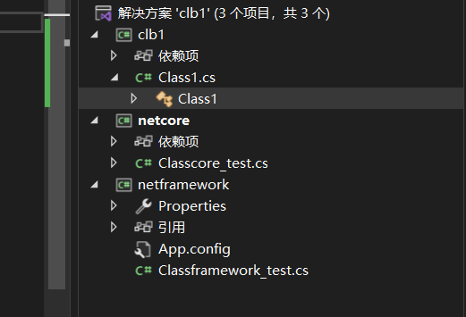
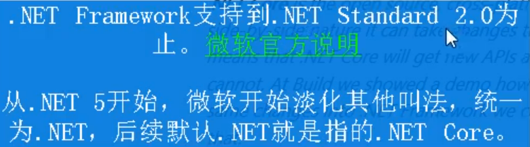
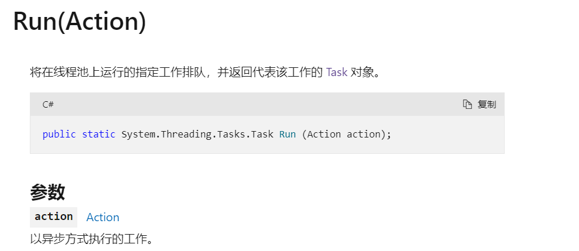

# 什么是.net core


.net 不再单单代表 .net framework

.net framework 是开发 windows程序，而且只能开发windows程序(不支持跨平台)

.net Core 是开发跨平台的应用程序

Xamarin/Mono 是开发移动端，游戏


.net core 能跨平台，市场大多数服务器都是 linux 服务器


Azure提供了许多的云服务器。


.Net Core 为云而生，更好的运行在 云 的环境下。也可以跑在普通的服务器上。


c#是.net平台中最主要的开发语言

.Net FrameWork 到 .Net Core 大部分用法都没变，但是 Core 不是 FrameWork 的升级版


## .NetStandard

.NetStandard是一个标准，规定了 .net core .net framework 有哪些类，以及这些类有哪些方法，它不管这两个是怎么实现的，但必须实现


类库是非可执行项目


typeof(FileStream).Assembly.Location FileStream 这个类所定义的程序集所在的位置。




netcore 和 netframework 都添加了clb1的引用，clb1中 Class1类有 test 方法用于打印typeof(FileStream).Assembly.Location FileStream，让netcore 和 netframework 中各自的类分别调用这个方法

```
执行netcore程序的这个代码得到的(代表 .net framework)
C:\Program Files\dotnet\shared\Microsoft.NETCore.App\6.0.9\System.Private.CoreLib.dll

```


netframework项目无法指向netstandard和.net的类库

我直接在 framework 项目中进行打印

```
C:\Windows\Microsoft.NET\Framework\v4.0.30319\mscorlib.dll
```


打印出的结果对比

```
C:\Windows\Microsoft.NET\Framework\v4.0.30319\mscorlib.dll
C:\Program Files\dotnet\shared\Microsoft.NETCore.App\6.0.9\System.Private.CoreLib.dll
原视频中还给出了 netstandard的打印出的结果
```


使用反编译器，把程序集反编译成近似于源代码


使用方式，输入路径

文件，打开，输入文件名。


先输入 通过 standard类库 获取的路径


最上面那行 Warning 告诉我们，.Net Standard只有定义(方法头)，没有实现(方法体)。


再通过 .net core 项目，可以发现这些方法有定义，也有实现(方法体)


为了对比 .net framework 和 .net core， 我们选同一个方法在framework 和 netcore中的实现。BeginRead 方法

```
public override IAsyncResult BeginRead(byte[] buffer, int offset, int count, AsyncCallback? callback, object? state)
{
	Stream.ValidateBufferArguments(buffer, offset, count);
	if (_strategy.IsClosed)
	{
		ThrowHelper.ThrowObjectDisposedException_FileClosed();
	}
	else if (!CanRead)
	{
		ThrowHelper.ThrowNotSupportedException_UnreadableStream();
	}
	return _strategy.BeginRead(buffer, offset, count, callback, state);
}

```


如法炮制得到 framework FileStream BeginRead反编译后的结果

```
using System.Security;
using System.Security.Permissions;

[SecuritySafeCritical]
[HostProtection(SecurityAction.LinkDemand, ExternalThreading = true)]
public override IAsyncResult BeginRead(byte[] array, int offset, int numBytes, AsyncCallback userCallback, object stateObject)
{
	if (array == null)
	{
		throw new ArgumentNullException("array");
	}
	if (offset < 0)
	{
		throw new ArgumentOutOfRangeException("offset", Environment.GetResourceString("ArgumentOutOfRange_NeedNonNegNum"));
	}
	if (numBytes < 0)
	{
		throw new ArgumentOutOfRangeException("numBytes", Environment.GetResourceString("ArgumentOutOfRange_NeedNonNegNum"));
	}
	if (array.Length - offset < numBytes)
	{
		throw new ArgumentException(Environment.GetResourceString("Argument_InvalidOffLen"));
	}
	if (_handle.IsClosed)
	{
		__Error.FileNotOpen();
	}
	if (!_isAsync)
	{
		return base.BeginRead(array, offset, numBytes, userCallback, stateObject);
	}
	return BeginReadAsync(array, offset, numBytes, userCallback, stateObject);
}

```


但是我们自己写的类库如果带方法，反编译后会带方法体


写类库尽量用 standard


举例子：如果 创建 2.0 的 Standard 类库，那么被 2.0的core 和 4.6.1的framework支持，更早版本的core和framework都不支持，

如果创建1.0的类库，那么上图中所有版本的core和framework都支持。




## 开发环境安装配置


```
https://dotnet.microsoft.com
```

这个官网上可以找文档


.net 可以用 clr 进行开发，但是最主要还是 visual stdio ，要选择框架core 还是 framework


## .net 项目结构以及程序发布

netframework的 csproj 文件结构


```
    <OutputType>Exe</OutputType>
    <RootNamespace>netframework</RootNamespace>
    <AssemblyName>netframework</AssemblyName>
    <TargetFrameworkVersion>v4.7.2</TargetFrameworkVersion>
    <FileAlignment>512</FileAlignment>
    <AutoGenerateBindingRedirects>true</AutoGenerateBindingRedirects>
    <Deterministic>true</Deterministic>
  </PropertyGroup>
  <PropertyGroup Condition=" '$(Configuration)|$(Platform)' == 'Debug|AnyCPU' ">
    <PlatformTarget>AnyCPU</PlatformTarget>
    <DebugSymbols>true</DebugSymbols>
    <DebugType>full</DebugType>
    <Optimize>false</Optimize>
    <OutputPath>bin\Debug\</OutputPath>
    <DefineConstants>DEBUG;TRACE</DefineConstants>
    <ErrorReport>prompt</ErrorReport>
    <WarningLevel>4</WarningLevel>
  </PropertyGroup>
  <PropertyGroup Condition=" '$(Configuration)|$(Platform)' == 'Release|AnyCPU' ">
    <PlatformTarget>AnyCPU</PlatformTarget>
    <DebugType>pdbonly</DebugType>
    <Optimize>true</Optimize>
    <OutputPath>bin\Release\</OutputPath>
    <DefineConstants>TRACE</DefineConstants>
    <ErrorReport>prompt</ErrorReport>
    <WarningLevel>4</WarningLevel>
  </PropertyGroup>
  <ItemGroup>
    <Reference Include="System" />
    <Reference Include="System.Core" />
    <Reference Include="System.Xml.Linq" />
    <Reference Include="System.Data.DataSetExtensions" />
    <Reference Include="Microsoft.CSharp" />
    <Reference Include="System.Data" />
    <Reference Include="System.Net.Http" />
    <Reference Include="System.Xml" />
  </ItemGroup>
  <ItemGroup>
    <Compile Include="Classframework_test.cs" />
    <Compile Include="Properties\AssemblyInfo.cs" />
  </ItemGroup>
  <ItemGroup>
    <None Include="App.config" />
  </ItemGroup>
  <Import Project="$(MSBuildToolsPath)\Microsoft.CSharp.targets" />
</Project>
```

包括了项目的各种信息

.net core 也有 这个文件，但是简单很多

```
<Project Sdk="Microsoft.NET.Sdk">

  <PropertyGroup>
    <OutputType>Exe</OutputType>
    <TargetFramework>net6.0</TargetFramework>
    <ImplicitUsings>enable</ImplicitUsings>
    <Nullable>enable</Nullable>
  </PropertyGroup>

  <ItemGroup>
    <ProjectReference Include="..\clb1\clb1.csproj" />
  </ItemGroup>

</Project>

```


发布，选中项目右键发布

部署模式如果依赖，那就是发布目标电脑要自己安装.Net

如果不依赖，那就是独立，把要用到的类库都放进来了。


可以在显示所有设置中进行调节


是否生成单个文件


只有两个文件


.net 6 没有找到 ReadyToRun 这个选项

剪裁未使用程序集：把没有用到的dll文件不打包，默认是全部打包


应用程序发布的相关文档

[应用程序发布 - .NET | Microsoft Learn](https://learn.microsoft.com/zh-cn/dotnet/core/deploying/)


# NuGet 异步编程 lambda LINQ 依赖注入DI 日志Logging

本部分内容大部分不是.net core 的新特性，.net framework已经有了而且用的比较多


## NuGet

第三方软件安装包的工具，比如 Java 的 Maven，而c#是NuGet作为第三方软件包的安装工具


在visualstudio中执行Install-.. 的命令就能把软件包下载下来


可以直接在网站上进行查找，只有英文页面


https://www.nuget.org


如果你不知道该用什么包解决你需要的问题，可以用搜索引擎，也可以直接输入准确的包的名字


可以查看包的版本，更新了多少次，被下载了多少。


很老的包如果没有任何依赖通常是依赖.net framework


### NuGet使用


NuGet使用两种方式：CLI(命令行) ，VS图形界面。推荐是命令行方式


比如：


通过图形化的方式


直接搜索


图形界面更新比较方便


通过cli


选择你要安装在哪个项目


install就是安装这个包，uninstall就是卸载这个包，Update-package 包名  就是对指定的包进行更新


安装的包会显示在 csproj 文件中的ItemGroup标签中


更多命令可以看官方文档

[dotnet nuget delete 命令 - .NET CLI | Microsoft Learn](https://learn.microsoft.com/zh-cn/dotnet/core/tools/dotnet-nuget-delete)


NuGet服务器就是，把包放在自己公司只允许自己公司的人下载


## Task HttpClient 

### Task


类 [Task](https://learn.microsoft.com/zh-cn/dotnet/api/system.threading.tasks.task?view=net-6.0) 表示一个不返回值且通常异步执行的单个操作。 [Task](https://learn.microsoft.com/zh-cn/dotnet/api/system.threading.tasks.task?view=net-6.0)对象是首先在 .NET Framework 4 中引入[的基于任务的异步模式](https://learn.microsoft.com/zh-cn/dotnet/standard/asynchronous-programming-patterns/task-based-asynchronous-pattern-tap)的中心组件之一。 由于对象执行[Task](https://learn.microsoft.com/zh-cn/dotnet/api/system.threading.tasks.task?view=net-6.0)的工作通常以异步方式在线程池线程上执行，而不是在主应用程序线程上同步执行，因此可以使用[Status](https://learn.microsoft.com/zh-cn/dotnet/api/system.threading.tasks.task.status?view=net-6.0)属性以及属性[IsCanceled](https://learn.microsoft.com/zh-cn/dotnet/api/system.threading.tasks.task.iscanceled?view=net-6.0)[IsCompleted](https://learn.microsoft.com/zh-cn/dotnet/api/system.threading.tasks.task.iscompleted?view=net-6.0)和[IsFaulted](https://learn.microsoft.com/zh-cn/dotnet/api/system.threading.tasks.task.isfaulted?view=net-6.0)属性来确定任务的状态。 通常，lambda 表达式用于指定任务要执行的工作。

对于返回值的操作，请使用 Task<TResult> 该类。


#### Task实例化

第一种 

```
Action<object> action = (object obj) =>
                               {
                                   Console.WriteLine("Task={0}, obj={1}, Thread={2}",
                                   Task.CurrentId, obj,
                                   Thread.CurrentThread.ManagedThreadId);
                                };

//实例化任务t1，但是还没有开始 
 Task t1 = new Task(action, "alpha");
 //开启t1任务
 t1.Start();
```


第二种

调用静态Run方法。 此方法 Run 提供了一种使用默认值启动任务的简单方法。

Run需要的参数是一个 Action委托，表示要完成的任务，可以通过lambda表达式的方法简单给出



```
//t3任务被创建的同时也开启 
Task t3 = Task.Run( () => {Console.WriteLine("helloworld");});
```


第三种

创建的同时并启动任务

静态[TaskFactory.StartNew](https://learn.microsoft.com/zh-cn/dotnet/api/system.threading.tasks.taskfactory.startnew?view=net-6.0)方法。 该 [Task.Factory](https://learn.microsoft.com/zh-cn/dotnet/api/system.threading.tasks.task.factory?view=net-6.0) 属性返回对象 [TaskFactory](https://learn.microsoft.com/zh-cn/dotnet/api/system.threading.tasks.taskfactory?view=net-6.0) 。 使用此方法的 [TaskFactory.StartNew](https://learn.microsoft.com/zh-cn/dotnet/api/system.threading.tasks.taskfactory.startnew?view=net-6.0) 重载可以指定参数以传递给任务创建选项和任务计划程序


```
//t2任务被创建的同时也开启
Task t2 = Task.Factory.StartNew(action, "beta");
```


第四种

```
//创建任务t4
 Task t4 = new Task(action, "gamma");
 //进行同步执行      
 t4.RunSynchronously();
```


#### 等待任务完成

由于任务通常在线程池线程上异步运行，因此在实例化任务后，创建和启动任务的线程会继续执行。 

任务通常在线程池上异步运行，因此都是后台线程，如果前台线程全部跑完了，后台线程即使没结束也会跟着结束，就需要前台线程等待后台线程结束。

在某些情况下，当调用线程是主应用程序线程时，应用可能会在任务实际开始执行之前终止。 其他情况下，应用程序的逻辑可能要求调用线程仅在一个或多个任务完成执行时才继续执行。 可以通过调用 `Wait` 方法等待一个或多个任务完成来同步调用线程的执行及其启动的异步任务。

Wait() 函数的使用方法

```
task.Wait()
谁启动了task任务，那么就让那个启动了task任务的线程等待
```

在执行到这个 Wait的时候，启动线程的线程会卡在那里不动，不会往下执行，等待要等待的任务结束后才继续执行


```
namespace ConsoleApp1
{
    using System;
    using System.Threading;
    using System.Threading.Tasks;
    class Program
    {
        static void Main()
        {
            Task taskA = Task.Run(() => {Console.WriteLine("开始睡觉"); Thread.Sleep(2000); });      
            try
            {
                taskA.Wait();//启动taskA任务的线程(即主线程)需要等待taskA执行完
                Console.WriteLine("主线程等待完毕");
            }
            catch (AggregateException)
            {
                Console.WriteLine("Exception in taskA.");
            }
        }
    }
}
```

Wait函数内部还可以有一个int 类型的参数


如果被开启的任务在规定的时间内完成，则为 true，如果规定时间内没有完成，则为false

```
using System;
using System.Threading;
using System.Threading.Tasks;

public class Example
{
    public static void Main()
    {
        // Wait on a single task with a timeout specified.
        Task taskA = Task.Run(() => Thread.Sleep(2000));
        try
        {
            bool m1 = taskA.Wait(1000);       // Wait for 1 second.
            if (m1)
            {
                Console.WriteLine("任务已经执行完成");
            }
            else
            {
                Console.WriteLine("任务没有在规定时间内完成");
            }
        }
        catch (AggregateException)
        {
            Console.WriteLine("Exception in taskA.");
        }
    }
}
```


在某些情况下，你可能希望等待一系列执行任务中的第一个完成，但不关心它所在的任务。 为此，可以调用方法的 [Task.WaitAny](https://learn.microsoft.com/zh-cn/dotnet/api/system.threading.tasks.task.waitany?view=net-6.0) 重载之一。 等待一系列任务中的第一个任务完成


返回值是该task任务在task数组中的索引


还可以通过调用 [WaitAll](https://learn.microsoft.com/zh-cn/dotnet/api/system.threading.tasks.task.waitall?view=net-6.0) 方法等待所有一系列任务(任务数组)完成。

```
using System;
using System.Threading;
using System.Threading.Tasks;

public class Example
{
    public static void Main()
    {
        // Wait for all tasks to complete.
        Task[] tasks = new Task[10];
        for (int i = 0; i < 10; i++)
        {
            tasks[i] = Task.Run(() => Thread.Sleep(2000));
        }
        try
        {
            Task.WaitAll(tasks);
        }
        catch (AggregateException ae)
        {
            Console.WriteLine("One or more exceptions occurred: ");
            foreach (var ex in ae.Flatten().InnerExceptions)
                Console.WriteLine("   {0}", ex.Message);
        }

        Console.WriteLine("Status of completed tasks:");
        foreach (var t in tasks)
            Console.WriteLine("   Task {0}",t.Status);
    }

}
```


#### Task属性

1. AsyncState

   

2. CompletedTask

   

3. CurrentId

   

4. Status 枚举类型

   

   


#### Task的方法


#### 有返回值的Task


使用方式

```
Task.Run
public static void Main()
   {
      var t = Task<int>.Run( () => {
                                      // Just loop.
                                      int max = 1000000;
                                      int ctr = 0;
                                      for (ctr = 0; ctr <= max; ctr++) {
                                         if (ctr == max / 2 && DateTime.Now.Hour <= 12) {
                                            ctr++;
                                            break;
                                         }
                                      }
                                      return ctr;
                                    } );
      Console.WriteLine("Finished {0:N0} iterations.", t.Result);
   }
   
Task.Factory.StartNew()   
public static void Main()
   {
      var t = Task<int>.Factory.StartNew( () => {
                                      // Just loop.
                                      int max = 1000000;
                                      int ctr = 0;
                                      for (ctr = 0; ctr <= max; ctr++) {
                                         if (ctr == max / 2 && DateTime.Now.Hour <= 12) {
                                            ctr++;
                                            break;
                                         }
                                      }
                                      return ctr;
                               } );
      Console.WriteLine("Finished {0:N0} iterations.", t.Result);
   }   
   
```


## 异步编程

同步和异步

异步编程：不等，你处理完了我再往后走

异步不能够让单个请求的处理速度变快，只是能让服务器同时处理更多请求(并不能提高服务器处理效率)

传统.net framework 异步编程可以用多线程来进行。

c#提供了 async和await 关键字，这两个关键字不代表多线程，但是简化了多线程的开发


1. 某操作为异步操作的时候，会先把这个任务挂起，继续执行后面的代码，并不会等到该操作结束后再执行后面的代码；(async)
2. await 表示等待异步操作执行完再往下走
3. .net core 中一些可能比较耗时的方法都设计成了异步方法而没有同步方法


### async和await使用

”异步方法“：方法一旦被用 async 关键字修饰就成为了异步方法(并不是一定要被async关键字修饰才成为异步方法)

1. 异步方法的返回值一般是Task<T>,其中T是真正的返回值类型，Task<int>.。
2. 异步方法在命名时一般以 Async 结尾，这是习惯不是硬性规定
3. 即使方法没有返回值(本来应该是void)，也最好把返回值声明为非泛型的Task
4. 调用异步方法时，一般在方法前加上await，这样能够实现拿到的返回值是Task<T> 中的 T 类型。(如果调用异步方法不加上await关键字，那么只能拿到 Task<T>类型)
5. 异步方法具有传染性：如果一个方法使用了 await 关键字(await关键字来调用异步函数)，那么这个方法也必须修饰为 async


```
//读写文件，不使用异步方法
static void Main()
{
	string filename = @"E:\a\1.txt";
	File.WriteAllText(filename,"hello");//把hello字符串写入到指定文件中
	string s = File.ReadAllText(filename);
	Console.WriteLine(s);//从文本文件中读出
}

//读写文件使用异步方法
	//Main 函数使用了 await关键字调用异步方法，所以必须加上Async关键字
	//Main 函数 没有任何返回值，但是是异步方法，所以 void 变成 Task
static async Task Main()
    {
        string filename = @"E:\a\1.txt";
        await File.WriteAllTextAsync(filename, "helloworld");//await 表示等待写的操作完成
        string res = await File.ReadAllTextAsync(filename);
        Console.WriteLine(res);
        
        //如果不使用 await 关键字,只能获取 Task<T> 返回值类型
        Task<string> t1 = File.ReadAllTextAsync(filename);
        string s =  await t1; //await 就是用来取其中返回值的。
    }
```

WriteAllTextAsync方法


ReadAllTextAsync方法


async 修饰符可将**方法**、**lambda表达式**或**匿名方法**指定为异步


### 编写异步方法


```
public class Example
{
    static async Task Main()
    {
        await DownloadHtmlAsync("https://www.youzack.com", @"e:\a\html.txt");

    }

    static async Task<int> DownloadHtmlAsync(string url, string filename)
    {
        using (HttpClient httpClient = new HttpClient())//自动释放资源
        {	//获取某网页的html文档
            string html = await httpClient.GetStringAsync(url);
            await File.WriteAllTextAsync(filename, html);
            return html.Length;
        }
    }
}
```


- 同样的功能，如果有同步方法，也有异步方法，那么优先使用异步方法。

- .Net 中，很多框架中的方法也都支持异步：Main WinForm事件处理函数

  winform事件函数无返回值类型不能写成 task，还是要写成void

  

- 对于不支持的异步方法。使用 Wait()等待任务结束往下执行，Result属性获取返回值。有死锁的风险

  


Task.Result 获取方法返回值，Task.Wait() 等待任务执行完毕后才往下继续执行代码


异步委托

lambda  表达式最前面加上 async


### async和await原理


```
static async Task Main(){
	using(HttpClient httpClient = new HttpClient()){
		string html = await httpClient.GetStringAsync("https://www.baidu.com");
		Console.WriteLine(html);
	}
	string txt = "hello";
	string filename = @"e:\a\1.txt";
	await File.WriteAllTextAsync(filename,txt);
	Console.WriteLine("写入成功");
	string s = await File.ReadAllTextAsync(filename);
	Console.WriteLine("文件内容："+s);
}
```


对dll文件进行反编译


这是原始的 Main


反编译dll看底层IL代码

await 和 async 是”语法糖“，最终编译成”状态机调用“


async的方法会被c#编译器编译成一个类，会主要根据await调用进行切分为多个状态，对async的调用会被拆分为对MoveNext的调用

用await看似是等待，经过编译后并没有wait


### async的线程切换

1. await调用的等待期间，.Net 会把当前的线程返回给线程池，等异步方法调用执行完毕后，框架会从线程池再取出来一个线程执行后续的代码

2. Thread.CurrentThread.ManagedThreadId **获得当前线程Id**

```
static async Task Main(){
	Console.WriteLine(Thread.CurrentThread.ManagedThreadId);
	StringBuilder sb = new StringBuilder();
	for(int i = 0;i<10000;i++){
		sb.Append("xxxxxxxxxx");
	}
	await File.WriteAllTextAsync(@"e:\a\1.txt",sb.ToString());
	Console.WriteLine(Thread.CurrentThread.ManagedThreadId);
}
```


优化：要等待(await)的时候，如果发现要等待的已经执行结束了，那就没有必要再切换线程了，剩下的代码就继续在之前的线程上继续执行了。

```
using System;
using System.Text;
using System.Threading;
using System.Threading.Tasks;

public class Example
{


    static async Task Main()
    {
        Console.WriteLine(Thread.CurrentThread.ManagedThreadId);
        StringBuilder sb = new StringBuilder();
        for (int i = 0; i < 10; i++)
        {
            sb.Append("xxxxxxxxxx");
        }
        await File.WriteAllTextAsync(@"e:\a\1.txt", sb.ToString());
        Console.WriteLine(Thread.CurrentThread.ManagedThreadId);
    }
}
```


### 异步方法不等于多线程

异步方法(被async修饰的方法)的代码并不会自动在新线程中执行(就算这个操作非常耗时)，除非把代码放到新线程中执行

```
using System;
using System.Text;
using System.Threading;
using System.Threading.Tasks;

public class Example
{


    static async Task Main()
    {
        Console.WriteLine("Main一方法" + Thread.CurrentThread.ManagedThreadId);
        await CalcAsync();
        Console.WriteLine("操作执行完成");
    }
    static async Task CalcAsync()
    {
        StringBuilder sb = new StringBuilder();
        Console.WriteLine("异步方法一线程为" + Thread.CurrentThread.ManagedThreadId);
        for (int i = 0; i < 1000; i++)
        {
            sb.Append("xxxxxxxxxx");
        }
        Console.WriteLine(sb.ToString());
       // await  File.WriteAllTextAsync(@"e:\a\1.txt", sb.ToString());
        Console.WriteLine("异步方法二方法" + Thread.CurrentThread.ManagedThreadId);
    }
}
```


