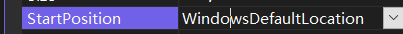
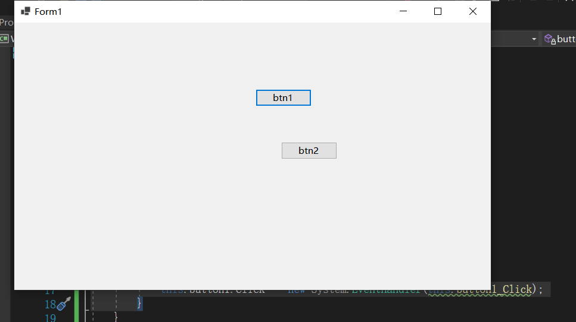
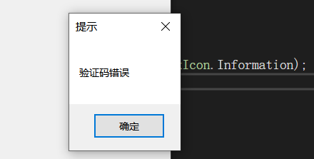
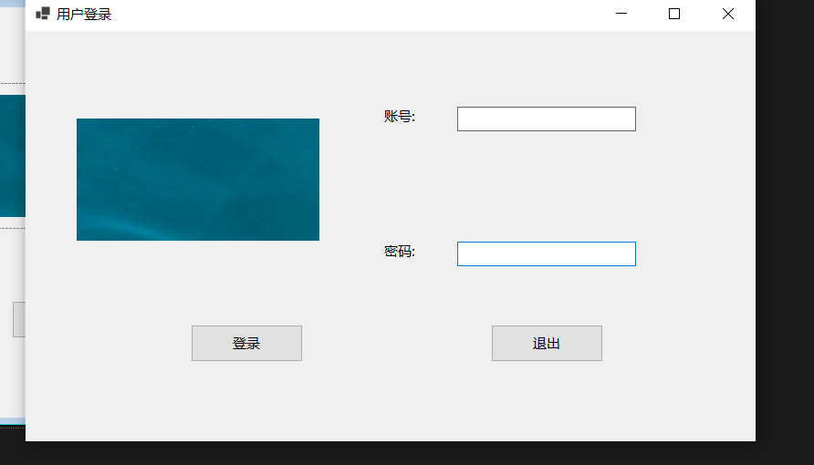

# 1.CS和BS

不能一直使用控制台。

实际应用的软件中要么基于浏览器，要么基于窗体


软件开发完后有两种部署方式 BS 和 CS


BS，程序部署在服务器端，客户端只有浏览器有用。


软件需要在客户端安装的是C/S。


# 2.开发环境与基本项目结构


选择这个作为模板进行创建


解决方案资源管理器，属性管理器，工具箱。全部都在视图中可以找到


属性管理器：所有的控件的属性都可以通过属性管理器来调控


这是 .Net FrameWork 创建的窗体项目的文件


这是 .Net Core（.Net 6.0) 创建的窗体项目的文件


Program.cs 是所有项目(程序)的入口，注意 static void Main()，通常要添加代码逻辑


 Application.Run(new Form1()); 表示打开 Form1 窗口


窗体那一面的工具箱容纳了所有的 控件，windows窗体，等等，能够直接拖动到窗口中来创建


Form1.Designer.cs 是创建这个窗口的代码，以及我们拖动到窗口中的组件它也会自动生成对应的代码，修改窗口中的组件(比如位置大小)也会修改对应的代码


比如我们之前添加的 button1


窗体以及内部组件选中右键选择查看代码可查看原码。

或者选中窗口后按F7


 .Net Core 创建的winform项目中没有Assemblyinfo 文件，这个文件是用于控制版本信息。

该文件只在 .Net FrameWork 中才有。


# 3.窗体

```
namespace WinFormsApp1
{
    public partial class Form1 : Form
    {
        public Form1()
        {
            InitializeComponent();
        }
    }
}
```

Form1 是一个窗体，继承自 Form

partial 是 **部分** 的意思。局部类型可以实现将一个类、结构或接口分成几个部分，分别放在几个不同的.cs文件中(当然也可以放在同一个.cs文件中)。在程序进行编译之后，将会合并成一个完整的类。

当一个命名空间中出现了相同的类，这两个类都被partial 修饰，那么这两个类在编译时会合并成一个完整的类


Form1的构造方法会调用  InitializeComponent(); 方法，这个方法是用于控件的生成。

在我们基于GUI对图形界面进行属性控制和添加控件的时候，  InitializeComponent(); 都会同步进行修改

```
private void InitializeComponent()
        {
            this.SuspendLayout();
            // 
            // Form1
            // 
            this.AutoScaleDimensions = new System.Drawing.SizeF(9F, 20F);
            this.AutoScaleMode = System.Windows.Forms.AutoScaleMode.Font;
            this.ClientSize = new System.Drawing.Size(909, 418);
            this.Name = "Form1";
            this.Text = "Form1";
            this.ResumeLayout(false);

        }
```


所以窗体由两部分组成。

1. 窗体的直接后台代码，窗体的代码，即继承了Form的那个类。
2. 窗体设计器生成的代码  Windows Form Designer generated code，这个不需要我们控制。**后台自动生成**


## 窗体的属性

一共分为这些类


### Design


Design 中的 (Name) 属性。(Name) 属性是控件的Id，这个值必须是唯一的，类比于身份证号必须是唯一的，不能冲突。

### Misc

### 布局

StartPosition 确定窗口第一次出现时的位置。




WindowState 确定窗口第一次打开时的状态，最大化，最小化还是中间


Size 用于指定窗体的大小


### 窗口样式

MaximizeBox

MinimizeBox 

确认点击窗体右上方的两个按钮后窗体要不要最小化最大化


Icon 指定左上角图标资源文件，也会在任务栏中呈现


其子属性Size 指定图标大小


### 焦点

### 可访问性

### 数据

### 外观


Text 属性，呈现窗体的最上方的内容。


FormBorderStyle 设置窗体大小是否可以调节


FixedSingle 就是不能调节 窗体的大小


BackColor 窗体背景颜色 BackgroundImage 窗体背景图片


### 行为


# 4.事件驱动机制

### 事件的应用


### 组件的事件

这个闪电一样的东西是事件


有很多，但是常用的只有 操作 中的 **Click**，表示单击


### 事件处理方法与事件关联起来


如果事件处理方法与事件不关联，那么事件发生的时候事件处理方法不会执行。

如果希望某个事件发生的时候要做什么事情，就要添加 对应的事件处理方法 到组件对象的相应事件中。


在Click 右边空白区域双击，在 窗体后台代码中就会出现一个Click事件的框架


如果右键重置就是清除这个事件


如果是直接去后台把这个事件删除，那还要把对应的委托删除


Button 类内部有 事件 Click


Event 是一个委托


```
this.button1.Click += new System.EventHandler(this.button1_Click_1); 
保证了 在 单击事件触发之后能够 执行 button1_Click_1 内部的代码
```


```
namespace WFDemo2
{
    public partial class Form1 : Form
    {
        public Form1()
        {
            InitializeComponent();
        }

        private void button1_Click(object sender, EventArgs e)
        {
            MessageBox.Show("你好世界");
        }
    }
}
```

单击后弹出你好世界


如果把 this.button1.Click += new System.EventHandler(this.button1_Click_1);  注释掉事件该代码，事件触发后方法内代码无法执行


新增一个按钮 btn2，对 btn1 按钮的事件进行解绑，点击之后不触发

```
  private void button1_Click(object sender, EventArgs e)
        {
            MessageBox.Show("你好世界");
        }

  private void button2_Click(object sender, EventArgs e)
      	{
            this.button1.Click -= new System.EventHandler(this.button1_Click);
        }
```

先点 btn1 ，能弹出来，

再 点 btn2，再点 btn1，就无法弹出来了




### sender是干什么的

sender表示事件触发的时候事件源对象  谁发出的这个事件sender就表示谁。


```
        private void button3_Click(object sender, EventArgs e)
        {
            string text = ((Button)sender).Text;
            MessageBox.Show(text);
        }

        private void button2_Click(object sender, EventArgs e)
        {
            string text = ((Button)sender).Text;
            MessageBox.Show(text);
        }

        private void button1_Click(object sender, EventArgs e)
        {
            string text = ((Button)sender).Text;
            MessageBox.Show(text);
        }
    }
}
```

获取点击的按钮的文本。

# 5.消息框的使用

MessageBox


MessageBox.Show 方法展现提示框，最多可以有4个参数。


- 第一个参数，提示窗口的内容
- 第二个参数，提示窗口的标题
- 第三个参数，提示窗口提供给用户选择的按钮
- 第四个参数，提示窗口的图标

```
private void button1_Click(object sender, EventArgs e)
        {
            MessageBox.Show("验证码错误");
            MessageBox.Show("验证码错误", "提示");
            MessageBox.Show("验证码错误","提示",MessageBoxButtons.OKCancel);
            MessageBox.Show("验证码错误", "提示", MessageBoxButtons.OKCancel,MessageBoxIcon.Information);

        }
```





MessageBox.Show 方法 返回 DialogResult 类型的数据，其实是一个枚举类型的数据。根据这个值判断用户点击了啥


```
private void button1_Click(object sender, EventArgs e)
        {
            DialogResult rs1 = MessageBox.Show("验证码错误", "提示", MessageBoxButtons.OKCancel,MessageBoxIcon.Information);
            if(rs1 == DialogResult.OK)
            {
                MessageBox.Show("用户选择确认");
            } else if(rs1 == DialogResult.Cancel){
                MessageBox.Show("用户选择取消");
            }
        }
```


# 6.项目框架基础搭建

1.搞清楚项目的主程序是什么，winform就是windows应用程序，给项目取名称

2.加入模块(模块：项目的数据访问层与实体层)。通常我们都是以类库的形式添加，在当前解决方案下新建项目，选择c#类库


3.建立项目之间的引用

这里有三个项目


DAL添加Models 的引用

选中 DAL 的 依赖项  ，选择添加项目引用


选中 Models 再确定


Models 不需要添加任何的引用

主项目(运行的项目)需要添加 DAL 和 Models 的两个引用


4.尝试一下空窗体能不能运行，把主窗体名字改成 以 Frm 开头的。一定要检查设计器的改变会不会让后台的代码跟随着改变。


接下来就是设计窗体，第一件事是修改窗体的标题


5.在主项目(窗体所在的项目生成新的窗体)

选中主项目，右键选择添加新建项，选择窗体


取名为 FrmLogin 用户登录


用户登录的窗体不需要最大化。


## 给窗体添加图片

在窗体中加入picturebox组件   picturebox可以显式图片

通过 image 属性选取图片


也可以使用该组件左上角的一个启动按钮(播放键)，快速设置属性


sizemode 设置图片大小模式，设置image在父容器中的停靠位置。


## label标签

标签的 Text 属性设置显示内容


## TextBox文本框

BorderStyle 属性设置该文本框被选中后要不要改变边框的样式


如果该文本框是密码，就需要加密

UseSystemPasswordChar 设置这个文本框要不要使用密码字符。


## Button按钮

按钮也可以加入图片


## tab键顺序

按下tab后自动改变鼠标焦点

视图里面的 tab 键顺序


按照你希望的顺序依次点一遍，如果不希望选中就不要点


再次 点击 视图中的 Tab 键顺序就设置完成。


程序运行后的初始状态。光标自动出现在我们希望它出现在的位置。


再次按下 tab




光标的位置会依次移动，按照我们设置的顺序。


# 7.主窗体的设计

主窗体有菜单栏，状态栏，分割容器

## 菜单栏

MenuStrip 控件是菜单栏。


设置快捷键：(&你想要设置的快捷键)，再把光标挪开就好了


用户按下alt + s 就可以获取焦点


为下拉项添加图标，右键 编辑项


下拉项之间添加分隔符


## 状态栏

Status 状态栏，通常出现在窗体的最下方

控件选择 StatusStrip


## 分割器

分割器分割窗体，使用 SplitContainer


直接拖到窗体里面

如果因为分割器太小了选取不到通过下拉列表选择


BorderStyle 调节边框样式


分割器 有 FixedPanel 属性，保证某个 Panel 大小不变化


日期控件

MonthCalendar 控件


Panel 有 backgroundimage 和 backgroundimagelayout 属性


layout 是布局


通常使用 Stretch 表示全部填充


label 的 BackColor 属性 设置为 web 中的 transparent，去除底色


## 组件与控件的区别以及组件imagelist

通常，组件是用户不可进行操作的，不能够触发事件。

控件可以提供给用户进行操作，用于触发事件。


组件 imagelist 是 图片列表，把想要使用的所有图片统一都加入进来，通过 imagelist1 属性


先把要使用图片的控件和 imagelist 绑定


通过 imageindex 属性选取使用 imagelist 中的哪张图片


## picturebox

用来获取图像


borderstyle 可以设置边框样式

## groupbox

groupbox 是一个容器，里面可以存放许多控件，这些控件就会被添加进入一个集合内


## 单选框

RadioButton控件

## 日期

DateTimePicker 控件

该控件可以选择年月日的格式。

为了让数据库能识别，通常我们选择自定义的形式


Format 设置为 Custon 表示自定义。

CustomFormat 设置成 yyyy-MM-dd    这样得到的日期格式 就是 2022-9-25 这样的格式

## 下拉框

下拉框是 ComboBox 组件


## 多个控件的布局对齐

中间对齐：按住ctrl选择多个控件，使它们对齐在一条水平线上。


水平间距相等


## 窗体的嵌入

把一个窗体设置在一个父容器内

```
  private void btn_AddStudent_Click(object sender, EventArgs e)
        {
            // 每次打开前把之前开启的窗口关闭;

            foreach(Control item in this.spcontainer.Panel2.Controls) // 找到当前面板所容纳的所有控件
            {
                if(item is Form) // 如果这个控件是一个窗体(继承了窗体类) 相当于java 中的  isinstance
                {
                    Form obj = (Form)item; // 强制类型转化
                    obj.Close();
                }
            }

            FrmAddStudent frm = new FrmAddStudent();
            frm.TopLevel = false; // 子窗体设置成非顶级控件
            frm.WindowState = FormWindowState.Maximized;// 让子窗体最大化显示
            frm.FormBorderStyle = FormBorderStyle.None; // 去掉窗体边框
            frm.Parent = this.spcontainer.Panel2; // 指定父容器

            frm.Show();// 通过弹出的方式
        }
```


其中 这些代码是套路一般的每次都会用到。

frm.TopLevel = false; // 子窗体设置成非顶级控件
frm.WindowState = FormWindowState.Maximized;// 让子窗体最大化显示
frm.FormBorderStyle = FormBorderStyle.None; // 去掉窗体边框
frm.Parent = this.spcontainer.Panel2; // 指定父容器


如果还有多个窗体也需要类似通过这种嵌套的方式，所写的代码和上面这些几乎是一样的，就可以把它们封装成方法

```
 #region 关闭先前窗体
        private void closePreForm() // 关闭先前的窗体
        {
            foreach (Control item in this.spcontainer.Panel2.Controls) // 找到当前面板所容纳的所有控件
            {
                if (item is Form) // 如果这个控件是一个窗体(继承了窗体类) 相当于java 中的  isinstance
                {
                    Form obj = (Form)item; // 强制类型转化
                    obj.Close();
                }
            }
        }
        #endregion

        #region 嵌入新的窗体
        private void addNewForm(Form frm) // 嵌入新的窗体
        {                   // 这里的参数是多态
            frm.TopLevel = false; // 子窗体设置成非顶级控件
            frm.WindowState = FormWindowState.Maximized;// 让子窗体最大化显示
            frm.FormBorderStyle = FormBorderStyle.None; // 去掉窗体边框
            frm.Parent = this.spcontainer.Panel2; // 指定父容器

            frm.Show();// 通过弹出的方式
        }
        #endregion
        private void btn_AddStudent_Click(object sender, EventArgs e)
        {
            // 每次打开前把之前开启的窗口关闭;
            closePreForm();

            // 添加
            addNewForm(new FrmAddStudent());
        }
```


## DataGridView控件

用于展示数据，和后台数据进行绑定


添加，编辑，删除通常都不使用


属性 BackGroundColor 通常改成 ButtonFace


添加列


其中，名称往往是类的属性

页眉文本是呈现给用户看的。


编辑列

最后一列 autosizemode 变为 fill 值 能够让该列填充满一整行


调节列表头高度  ColumnHeadersHeightSizeMode 设置为 EnableResizing   表示可以手动调节.

AutoSize 表示自动根据内部字体的大小来调节

然后 通过 ColumnHeadersHeight 调节数值


EnableHeadersVisualStyle 属性 ：行标题和列标题是否启用当前用户指定的自定义模式。


## 容器控件

容器控件 label groupbox   

dock 属性，能够让容器填满其父控件中对应的位置


# 8.文档大纲


能够在多个容器，控件出现的时候，需要控制彼此的父子关系使用。


在一个父容器的子控件列表中，**处于列表上方的控件(视觉上) 会覆盖 处于列表下方的控件**


