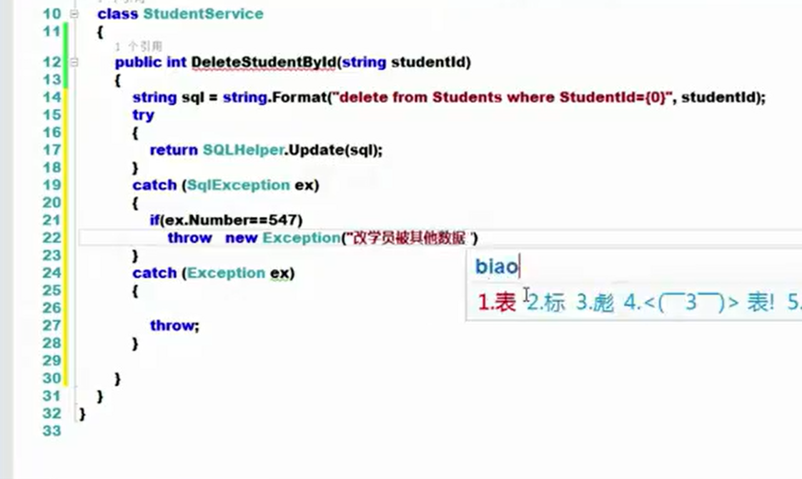
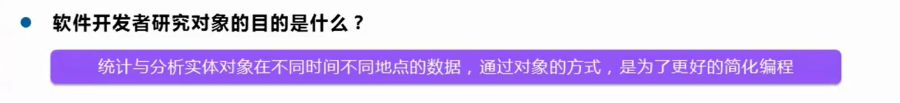
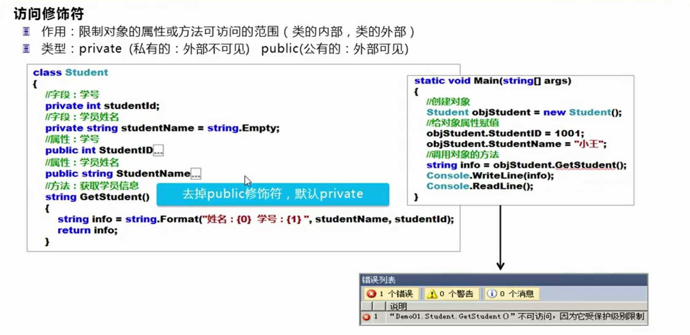
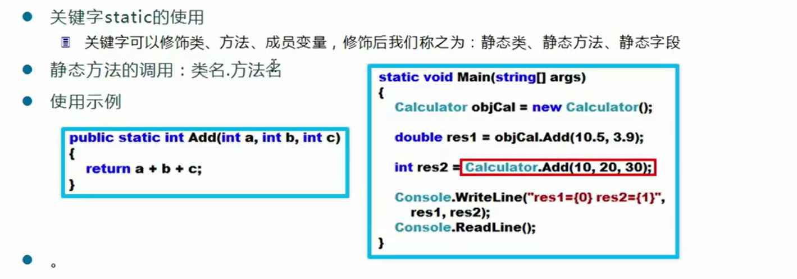
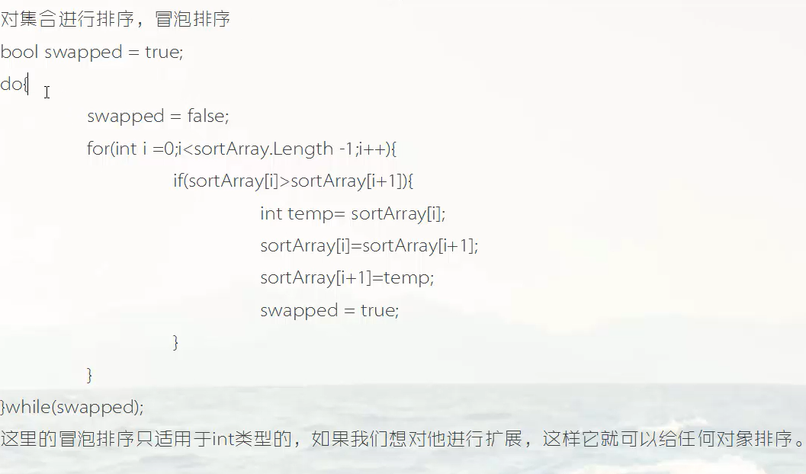
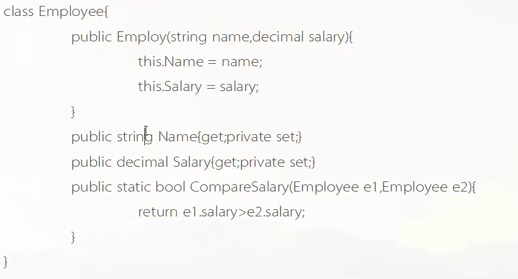
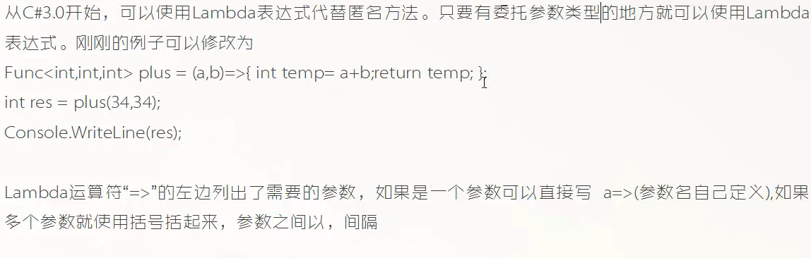

# 第一章 visual studio vode 调试错误处理


语法错误


## visual studio code调试

正常模式下的调试


```
using System;
namespace cs1{
    public delegate double MyDelegate(double num1,double num2);
    class Program2{
    
    
        static void Main(string [] args){
          int temp = 234;
          Console.WriteLine("{0}",temp);
          int temp2 = 134;
           Console.WriteLine("{0}",temp2);
          int sum = temp*temp2;
           Console.WriteLine("{0}",sum);

        }
        
    }
}

```


中断模式下的调试


启动调试


断点


中断模式监测变量的内容


调用堆栈和即时窗口

调用堆栈，显示当前行是由哪个函数调用过来的


```
using System;
namespace cs1{
    public delegate double MyDelegate(double num1,double num2);
    class Program2{
    
        static void test(){
            Console.WriteLine("你还");
        }
        static void Main(string [] args){
          int temp = 234;
          test();
        }
        
    }
}

```


即时窗口没找到


单步执行代码


从左往右：

1. 直接跳到下一个断点
2. 逐个语句执行，遇到函数也当成一个语句执行，跳过具体函数的执行
3. 逐个语句执行，遇到函数会进入函数内部执行
4. 跳出，跳出当前执行语句所在的函数
5. 重新进行调试
6. 结束调试


## 错误处理(异常处理)


### 异常


```
using System;
namespace cs1{
    public delegate double MyDelegate(double num1,double num2);
    class Program2{s
        static void Main(string [] args){
            int [] array = new int[5];
            for(int i = 0;i<10;i++){
                array[i] = 10;
            }
        }
    }
}
```


异常处理防止程序崩溃


### 常见的异常原因


造成结果

点击.exe文件后，会出现


### .Net FrameWork异常的设计架构


SystemException 是公共语言运行时引发的异常

System.ApplicationException 是用户自定义引发的异常


### 异常处理的形式和原则


### 异常处理 try catch finally


```
using System;
namespace cs1{
    public delegate double MyDelegate(double num1,double num2);
    class Program2{ 
        static void Main(string [] args){
        try{
            int [] array = new int[5];
            for(int i = 0;i<10;i++){
                array[i] = 10;
            }
            

        }catch(IndexOutOfRangeException e){
            Console.WriteLine("发生了异常");
        }finally{
            Console.WriteLine("最后执行的代码");
        }
        
    }
}
}

```


catch{

}

这种写法就是捕捉抛出的一切异常


```
using System;
namespace cs1{
    public delegate double MyDelegate(double num1,double num2);
    class Program2{ 
        static void Main(string [] args){
        try{
            int [] array = new int[5];
            for(int i = 0;i<10;i++){
                array[i] = 10;
            }
            

        }catch{
            Console.WriteLine("发生了异常");
        }finally{
            Console.WriteLine("最后执行的代码");
        }
        
    }
}
}

```

catch ( )内的异常必须和报出的异常保持一致(或是子类)才能进行捕捉


异常有哪些要自己总结有哪些


try块如果有一行代码发生了异常，那么其余的代码都不会执行了，直接跳到catch块


例子


```
using System;
namespace cs1{
    public delegate double MyDelegate(double num1,double num2);
    class Program2{ 
        static void Main(string [] args){
            int number1;
            while(true){
                try{
                number1 = Convert.ToInt32(Console.ReadLine());
                break;  
            }
            catch{
                Console.WriteLine("输入的不是整数需要重新输入");
            }
            }
            int number2;
            while(true){
                try{
                number2 = Convert.ToInt32(Console.ReadLine());
                break;  
            }
            catch{
                Console.WriteLine("输入的不是整数需要重新输入");
            }
            }
            Console.WriteLine("{0}+{1} = {2}",number1,number2,number1+number2);
        }
        
    }
}
```


### 异常处理改进


具体操作

通用数据访问类，不会处理异常，而是记录日志




sqlException类中的 Number 属性

new Exception(参数) 这里的参数会被封装为 Message 表示异常信息


前台代码，向用户展示错误信息


### 自定义异常


异常处理需要处理的问题


# 第二章 类与对象

什么是面向对象编程


类 class 创建的对象叫做变量


类是程序的基本单元





类包含两部分


## 如何定义类


分析学生类


```
namespace con1
{

    class Student
    {
        // 字段
        private int studentId;
        private string studentName = string.Empty;
        // 学生学号
        public int StudentId
        {
            get { return studentId; }
            set { studentId = value; }
        }
        // 学生姓名
        public string StudentName
        {
            get { return studentName; }
            set { studentName = value; }

        }
        public string GetName()
        {
            return studentName + studentId;
        }
    }
    class m1
    {
        
        static void Main()
        {
            // 创建对象
            Student student1 = new Student();
            // 类名 对象名 = new(关键字) 类名(构造方法的参数)
            student1.StudentId = 1;
            student1.StudentName = "你好";
            string s1 = student1.GetName();
        }
    }
}
```


## 类的字段


如果要使用一个类来定义它的变量，即定义对象，需要:

1. 引入该类所在的命名空间，如果是在同一个命名空间，就跳过
2. 类名 对象名  = new 类名(构造方法需要的参数列表)
3. 对象名.域和对象名.方法访问域和对象


c# 中，字段和属性不是一个东西


练习


```
using System;
namespace cs1{
    public delegate double MyDelegate(double num1,double num2);
    class Car{
        public void stop(){
            Console.WriteLine("车辆停止");
        }

        public void run(){
            Console.WriteLine("车辆终止");
        }
        private double speed;
        private double maxspeed;
        private double weight;

        public double getspeed(){
            return this.speed;
        }
        public void setspeed(double speed){
            this.speed = speed;
        }
        public double getmaxspeed(){
            return this.maxspeed;
        }
        public void setmaxspeed(double maxspeed){
            this.maxspeed = maxspeed;
        }
        public double getweight(){
            return this.weight;
        }
        public void setweight(double weight){
            this.weight = weight;
        }

    }
    class Program2{ 
        static void Main(string [] args){
           Car c1 = new Car();
           c1.setmaxspeed(90);
           c1.setspeed(60);
           c1.setweight(1000);  
        }       
    }
}


```


```
using System;
namespace cs1{
    public delegate double MyDelegate(double num1,double num2);
    class Vector{
        private double x;
        private double y;
        private double z;
        public double getLength(){
           return Math.Sqrt(x*x+y*y+z*z);
        }
    }
    class Program2{ 
        static void Main(string [] args){
           
        }
        
    }
}


```


## 方法


有参


无参


方法调用


### 方法重载


编译器对调用的重载的方法自动进行参数匹配选择。

方法重载：多个方法方法名相同，返回值可以相同，但是参数列表必须不同


## 构造方法(函数)


构造函数使用一般就是对属性进行初始化

构造函数的名字必须与类名完全相同

构造函数没有返回类型，返回类型甚至不是void 就是没有


这种方式并不灵活，对所有的对象都进行相同操作的赋值。


构造方法也可以重载。

如果不写构造函数编译器自动生成一个构造函数。


### 在构造方法中调用其他的构造方法

```
public 类名(参数):this(另一个构造方法所需的参数)  // 这是参数化列表的方法
{
	this.字段 = 参数
}
```

构造方法先执行里面调用的其他构造方法，再执行本身构造方法。


构造方法与实例方法比较


## this的使用

this 就表示指向当前对象本身的引用   ，this.属性 就表示 当前对象自身的某个属性


没有加 this 就是默认从局部变量开始找。


```
using System;
namespace cs1{
    public delegate double MyDelegate(double num1,double num2);
    class Vector{
        private double x;
        private double y;
        private double z;
        
        public Vector(double x,double y,double z){
            this.x = x;
            this.y = y;
            this.z = z;
        }
    }
    class Program2{ 
        static void Main(string [] args){
           Vector v1 = new Vector(11,12,3);
        }

    }
}


```


## 属性的定义


属性的定义是块形的，包含set块和get块

当该属性被访问时，get块中的语句被执行

当该属性被赋值时，set块中的语句被执行，set块中含有一个value属性用于接收被赋予的值

属性具有数据类型，被赋值时必须符合数据类型


get 与 set 块内部可以添加代码逻辑。


get块和set块可以不同时存在，可以都有，也可以没有其中一个，如果没有了get块，就不能够通过属性取值了。


只读属性 有 readonly 修饰符，但是只读属性能够在 set和get 块中添加逻辑代码


每一个字段都一般有与之对应的属性。 字段 age 的属性就是 Age。

但并不是每一个属性都有与之对应的字段。

如果一个属性具有与之对应的私有字段，可读可写，没有业务逻辑，就称之为**标准属性**


没有了set块，就不能进行赋值了


```
using System;
namespace cs1{
    public delegate double MyDelegate(double num1,double num2);
    class Vector{
        public int MyIntprop{
            get{
                return 100;
            }
            set{
                Console.WriteLine("value的值是{0}",value)
            }
        }
        
      
    }
    class Program2{ 
        static void Main(string [] args){
           Vector v1 = new Vector();
           v1.MyIntprop = 100;
           Console.WriteLine("{0}",v1.MyIntprop);


        }
        
    }
}

```


属性的作用是作为同名字段的set get 方法，实现封装

```
using System;
namespace cs1{
    public delegate double MyDelegate(double num1,double num2);
    class Vector{
        private double x;
            private double y;
            private double z;
            public double X{
                get{
                    return x;
                }
                set{
                    x = value;
                }
            }
            public double Y{
                get{
                    return y;
                }
                set{
                    y = value;
                }
            }
            public double Z{
                get{
                    return z;
                }
                set{
                    z = value;
                }
            }
      
    }
    class Program2{ 
        static void Main(string [] args){
           Vector v1 = new Vector();
          	v1.X = 10;
          	v1.Y = 20;
          	v1.Z = 30;
          	Console.WriteLine("{0},{1},{2}",v1.X,v1.Y,v1.Z);


        }
        
    }
}


```


### 设置属性的只读和只写


### get set 的访问修饰符


设置成private之后只能在类内使用


### 属性和字段的区别


### 自动属性(有问题，可忽略)


{get; set;} 

就相当于      

get{return 字段} 

set{字段 = value} 


## 对象初始化器(对应构造方法)


```
using System.Net;
using System.Net.Sockets;
using System.Runtime.InteropServices;
using System.Text;
using ConsoleApp1;
namespace con1
{
    /// <summary>
    /// 
    /// </summary>
    /// <params></params>
    /// <return></return>
    /// 

    class Student
    {
        // 字段
        private int id;
        private string name;
        public Student() {  } // 只有有参构造器
        public int Id { get; set; }
        public string Name { get; set; }


    }
    class m1
    {

        static void Main()
        {
            // 创建对象
            Student student1 = new Student();// 必须有对应的构造器
            Student student2 = new Student() //不需要有参构造器
            {
                Id = 1,
                Name = "rzy" // 注意里面是逗号
            };   // }后面有 ;

        }
    }
}

```


## 对象销毁


c++中的析构函数，c#中无需关心


## oop的封装特性


我们通常将 字段都设置成 private   ，方法设置成public ，字段设置成private后无法被访问，因此需要再写 get字段名  set字段名 方法  来获取和修改属性，这称为封装。

<font color=red size = 4>get 和 set 在 C# 中靠属性自动实现</font>

# 第三章 杂项

## 匿名类型


```
using System;
namespace cs1{
    public delegate double MyDelegate(double num1,double num2);
    class Program2{ 
        static void Main(string [] args){
           var a = 1000;
           var b = new Vector3(); // 用于指代某个类
           //a = "string"; 不允许 因为a已经是int类型了
        }
        
    }
}


```


## 堆和栈

堆和栈：程序运行时的内存区域


栈：后入先出


堆：杂乱无序


堆内存回收


## 值类型和引用类型


例子1：

```
static void Test1(){
	int i = 34;
	int j = 34;
	int temp = 334;
	char c = 'a';
	bool b = true;
}
```

内存示意


例子2：

```
static void test2(){
	int i = 34;
	int j =234;
	string str = "siki";

}
```


例子3：

```
static void Test3()
{
	string name = "siki";
	string name2 = "taikr";
	name = name2;
	name = "google";
}
```


这里没写的就是 google


例子4：

```
static void Test4{
	Vector v = new Vector();
	v.x = 100;
	v.y = 100;
	v.z = 100;
	
	Vector v2 = new Vector();
	v2.x = 200;
	v2.y = 200;
	v2.z = 200;
	
	v2 = v;
	v2.x = 300
}
```


执行 v2 = v;


执行 v2.x = 300；


例子5：

```
Vector [] vArray = new Vector[]{new Vector(),new Vector(),new Vector}; // 对象数组
Vector v1 = vArray[0];
vArray[0].x = 100;
v1.x = 200;
```

如果一个数组是一个值类型的数组，那么在数组中是直接存储的，如果是一个引用类型的数组(数组中存储的引用类型)，那么内存存储的是引用(内存地址)

执行Vector [] vArray = new Vector[]{new Vector(),new Vector(),new Vector}; 


执行

Vector v1 = vArray[0];

vArray[0].x = 100;

v1.x = 200;


## ref和out 关键字

让值类型按应用类型传递  c语言的指针


ref侧重引用传递，out是输出。

面向对象只存在 值类型 和 引用类型 两种数据类型


## vs带有的类视图


## C#所有类都继承自 object 类


值类型和object之间存在拆箱和装箱，对象类型与object不存在

# 第四章 继承和多态


## 继承的类型

实现继承和接口继承


## 关于多重继承

C#不支持多重继承，只支持多重接口继承(接口实现)

C#的类仅允许一个实现继承(一个亲爹),多个接口继承(认多个干爹)


## 实现继承和多态


部分多态知识

允许如下语法：

父类类型  对象名 = new 子类类型(构造器参数列表);

编译类型是父类类型，运行类型是子类类型

此时，能够使用 对象名.成员名 调用子类重写了父类的方法，而不能调用子类自己新增的方法


能够通过   ((子类类型)对象名).子类成员名  的方法进行向下转型成子类，因为其运行类型是子类。

通过强制类型转换后，可以调用子类特有方法


实现案例：


```
enemy.cs 文件

namespace _enemy{
    class Enemy{
        private float hp;
        private float speed;
        public float HP{
            get{return hp;}
            set{hp = value;}
        }
        public float Speed{
            get{return speed;}
            set{speed = value;}
        }
        public void AI(){
            Console.WriteLine("这里是Eneny的公有AI方法");
        }
        public void Move(){
            Console.WriteLine("这里是Eneny的公有Move方法");
        }
    }

    class Boss:Enemy{
        public void Attack(){
            AI();
            Move();
            HP = 100; // 父类里面公有(public)的数据成员和函数成员能在子类中访问到
            Console.WriteLine("正在进行攻击");
        }
    }
    class Type1Enemy:Enemy{

    }

    class Type2Enemy:Enemy{

    }
}


Program2.cs 文件

using _enemy;
namespace cs1{
    
    public class Program2{ 
        static void Main(string [] args){
           Boss b = new Boss();
           b.AI();//继承：父类里面所有的数据成员和函数成员都继承到子类里
           b.HP = 100;

           // 父类声明的对象，可以使用子类构造 
           Enemy enemy;
           // 等号左边父类，等号右边子类(多态)
           enemy = new Boss() ; // 父类声明，子类实例化

            // 编译类型是 Enemy 父类， 运行类型是 Boss 子类
            // 可以使用强制类型转换
           ((Boss)enemy).Attack();
        }
        
    }
}

```


## 虚方法


在子类里面调用虚函数，不管在哪里调用都是调用重写之后的方法


```
namespace _enemy1{
    class Enemy{
        private float hp;
        private float speed;
        public float HP{
            get{return hp;}
            set{hp = value;}
        }
        public float Speed{
            get{return speed;}
            set{speed = value;}
        }
        public void AI(){
            Console.WriteLine("这里是Eneny的公有AI方法");
        }
        public virtual void  Move(){ // 虚方法
            Console.WriteLine("这里是Eneny的公有Move方法");
        }
    }

    class Boss:Enemy{
        public void Attack(){
            AI();
            Move();
            HP = 100; // 父类里面公有(public)的数据成员和函数成员能在子类中访问到
            Console.WriteLine("正在进行攻击");
        }
        // 重写move 方法
        public override void Move()
        {
            Console.WriteLine("boss的move方法");
        }
    }
    class Type1Enemy:Enemy{

    }

    class Type2Enemy:Enemy{

    }
}

using _enemy1;
namespace cs1{
    
    public class Program2{ 
        static void Main(string [] args){
           Boss b = new Boss();
           b.Move();

           Enemy e1 = new Boss(); // 左边编译类型，右边运行类型
           e1.Move(); // 调用运行类型中的，即子类
        }       
    }
}


```


企图在子类中重写方法时，必须在父类方法中加上关键字 virtual ，并且在子类方法中加上关键字 override


## 隐藏方法


重写 override：子类中不存在从父类继承来的那个同名方法了

隐藏：子类中存在新写的那个方法，也存在从父类继承来的那个方法，两个方法重名，父类继承来的被隐藏了

```
namespace _enemy1{
    class Enemy{
        public  void  Move(){
            Console.WriteLine("Eneny的公有Move方法");
        }
    }
    class Boss:Enemy{
        public new void Move()  
        {
            Console.WriteLine("boss的move方法");
        }
    }
}

using _enemy1;
namespace cs1{
    
    public class Program2{ 
        static void Main(string [] args){
            Boss boss = new Boss();
            boss.Move();   
            Enemy e1 = new Boss();
            e1.Move();   // 这里没有进行方法的重写，因此不触发动态类型绑定，调用 父类中被隐藏的方法
        }
        
    }
}
```


## this关键字和base关键字


base :访问父类对象的属性和方法

this：访问本类对象的属性和方法


对于父类中的虚函数，能够通过base调用出来

```
namespace _enemy1{
    class Enemy{
        private string hp;
        private string name;
        public string Hp{
            get{
                return hp;
            }
            set{
                hp = value;
            }
        }

        public string Name{
            get{
                return name;
            }
            set{
                name = value;
            }
        }
        public virtual void  Move(){
            Console.WriteLine("Eneny的公有Move方法");
        }
    }
    class Boss:Enemy{
        public override void Move()  
        {
            Console.WriteLine("{0},{1}",base.Hp,base.Name/*访问父类中的属性*/);
            base.Move();// 访问父类中的虚函数
            Console.WriteLine("boss的move方法");
        }

    }
}


```

## 抽象类


- 抽象类不能创建对象，但可以放在等号左边作为编译类型
- 一个类内部一旦出现了抽象方法那这个类必须定义成抽象类
- 抽象方法没有方法体
- 一个类继承抽象类时，必须实现抽象类中所有抽象方法，否则也要定义成抽象类

```
namespace _Bird{
    abstract class bird{
        private float speed;
        public void Eat(){

        }
        public abstract void fly(); 
    }
    class Crow:bird{
        public override void fly()
        {
            Console.WriteLine("乌鸦在飞行");
        }
    }
}

using _Bird;
namespace cs1{
    
    public class Program2{ 
        static void Main(string [] args){
            Crow c1 = new Crow();
            c1.fly();
            bird b1 = new Crow();// 抽象类可以作为编译类型不能作为运行类型
            b1.fly();//方法调用动态类型绑定
        }
        
    }
}

```


## 密封类和密封方法

java中的final


sealed作用于方法时，该方法必须已经被重写过一次，和override关键字是连用的


## 派生类的构造函数


public DerivedClass():base(){ 这种写法叫做初始化列表

}

无参构造函数时

```
namespace _Bird{
    class BaseClass{
        public BaseClass(){
            Console.WriteLine("基类无参构造函数被调用");
        }
    }

    class DeprivedClass:BaseClass{
        public DeprivedClass():base(){
        	Console.WriteLine("子类无参构造函数被调用");
        }
        // 也可以写成public DeprivedClass(){}   没有显式声明就调用父类无参构造函数
    }
    class Test{
        static void Main(String [] args){
            DeprivedClass dc = new DeprivedClass();
            
        }
    }
}
```


先调用父类构造函数，再调用子类构造函数


如果父类中已经手写了构造器，那么不会自己生成默认构造器，子类调用父类构造方法的初始化列表也就需要手写


```
namespace _Bird{
    class BaseClass{
        private int y;
        public BaseClass(int y){  //基类中唯一的构造器，是有参构造器
           this.y = y;
        }
    }

    class DeprivedClass:BaseClass{
        private int x;
        public DeprivedClass(int x,int y):base(y){
        	this.x = x;
        }
    }
    class Test{
        static void Main(String [] args){
            
            
        }
    }
}
```


## 访问修饰符


当字段或属性或方法被private修饰的时候，表明该字段或属性或方法只能在class大括号的内部，即类的内部进行访问

当字段或属性或方法被public修饰的时候，表明能够通过对象访问，即类的外部进行访问

当字段或属性或方法被protected修饰的时候，表明本类和其子类能够进行访问，但本类的对象和子类的对象都不能进行访问。如果本类没有被任何子类继承，其作用和private是一样的。


类内部的，方法外部的是成员变量




```
namespace stm1{
    class Fa1{
        protected int m1;
    }

    class son:Fa1{
        public void print(){
            Console.WriteLine("{0}",m1);
        }
    }
    class b1{
        static void Main(string [] args){
            son s1;
            s1.m1;
            Fa1 f1;
            f1.m1;

        }
    }
}
```


class 的访问修饰符有 public 和 不加访问修饰符。在class前面加public才能让这个类在别的项目中去使用


### static修饰符


class 内部的字段或者属性<font size=5>**只能通过**</font> 类名.静态属性 和 类名.静态方法 的方式进行访问





<font color=red size=5>通过类创造出来的对象的内部不包含任何静态的东西，只包括非静态的字段和方法</font>

```
namespace _Bird{
    class Vector{
        public static int x; // 声明静态字段
        private int y;
        private int z; 
        public static void print(){
            Console.WriteLine("这是一个静态方法");
        }
        
    }
    class  _main{
        static void Main(string [] args){
            Vector v1 ;  
            v1.x;	// 错误
            v1.print();// 错误
            int h1 = Vector.x;
            Vector.print();
            
        }
    }
}
```


### 其他修饰符


# 第五章 接口继承

## 定义和实现接口


接口的内部可以有 属性 ，方法的声明(没有大括号) ，索引器

接口内不能有字段，不能有构造函数。

接口内部允许声明成员的修饰符。？？？

接口不能被实例化，但能作为编译类型放在等号左边


<font color=red size=4>一个类可以实现多个接口 单继承多实现</font>

```
//Program2.cs 文件
namespace _ifl{
    interface flyable{
        void Fly();
        void MethodA();
    }
}


//bird.cs 文件
using _ifl;
namespace _Bird{
    class bird:flyable{//实现接口
        public void Fly(){

        }
        public void MethodA(){
            
        }
    }
}
```


## 派生的接口


本身是接口，不需要实现继承来结构的函数

```
namespace _Bird{
    interface IA{
        void MethodA();
    }
    interface IB:IA{
        void MethodB();
    }
}
```


一旦有类实现了子接口，必须实现其父接口和子接口中所有规定的方法。


## 阶段练习

```
namespace _Bird{
    class A{
        public virtual void Method(){
            Console.WriteLine("父类中的虚函数");
        }
        public void Method1(){
            Console.WriteLine("父类中的一般方法");
        }


    }
    class B:A{
        public override void Method()
        {
            Console.WriteLine("重写父类虚方法得到的方法");
        }
        public new void Method1(){
            Console.WriteLine("覆盖父类中方法得到的方法");

        }
    }
    class Test{
        static void Main(string [] args){
            B b1 = new B();
            A a1 = b1;
            b1.Method();     // 从 B 开始往上找 Method方法
            b1.Method1();	 // 从 B1 开始往上找 Method方法
            a1.Method();	 // 动态类型绑定  从运行类型 B开始找	
            a1.Method1();	 // 调用在父类中隐藏的方法，没有进行方法重写因此不触发动态类型绑定
        }
    }
}

```


```
namespace _enemy1{
    public class A{
        public virtual void Fun1(){
            Console.WriteLine("基类中的虚方法");
        }
        public void Fun2(A a){
            a.Fun1();
            Fun1(); //动态类型绑定，取决于由哪个对象调用的方法
        }
    }
    public class B:A{
        public override void Fun1()
        {
            Console.WriteLine("子类中的重写方法");
        }
        public static void Main(string [] args){
            B b = new B(); //动态类型是B
            A a = new A(); //动态类型是A
            a.Fun2(b);
            b.Fun2(a);
        }
    }
}

```


如果一个虚函数virtual修饰的，在子类中没有被使用override关键字重写，那就是被隐藏了

```
namespace _enemy1{
    abstract class BaseClass{
        public virtual void MethodA(){Console.WriteLine("BaseClass中的MethodA");}   
    }
    class SonClass:BaseClass{
        public void MethodA(){
            Console.WriteLine("SonClass中的MethodA");
        }
    }
    class m1{
        public static void Main(string [] args){
            SonClass  s1 = new SonClass();
            BaseClass b1 = s1;
            s1.MethodA(); //  
            b1.MethodA(); // 没有方法重写，不构成动态绑定
        }
    }
}
```


# 第六章 泛型

## 什么是泛型


## List集合类


List 的长度是无限长的


### 列表的创建和使用


<> 里面放的就是你要存储什么类型的数据的数据类型

```
 class m1{
        public static void Main(string [] args){
            List<int> scoreList = new List<int>();//创建了一个空的列表 
            var scoreList1 = new List<int>();// 用匿名类型创建空的列表
            List<int> scoreList2 = new List<int>(){1,2,4}; //创建有初始元素的列表

        }
    }
```


列表List的更多内容


总结

1. 通过构造器可以设置列表初始容量
2. 列表的扩容规则
3. 通过 Capacity 设置 List的容量(能存储元素的最大值)
4. 通过 Count 属性获取当前列表中已有多少个元素


```
 class m1{
        public static void Main(string [] args){
            
            List<int> scoreList2 = new List<int>(){1,2,4}; //创建有初始元素的列表
            scoreList2.Add(11);
            scoreList2.Add(19);
            scoreList2.Add(-100);
            
            Console.WriteLine(scoreList2.Count);
            Console.WriteLine(scoreList2.Capacity);
            
            scoreList2.Add(19);
            scoreList2.Add(-100);
            scoreList2.Add(-100);
             Console.WriteLine(scoreList2.Count);
            Console.WriteLine(scoreList2.Capacity);
            

        }
    }
```


### 列表常用的方法

列表中的元素按照插入的顺序进行排放，并且允许数据的重复


列表名.Add(要插入的元素)

列表名.insert(索引,要插入的元素)  索引有范围限制

列表名.RemoveAt(索引) 索引有范围限制  ，按照索引删除元素

列表名.Remove(某个指定的元素) 列表中删除指定元素，这个指定的元素必须是指定它的地址。

 

列表名.IndexOf(值) 取得一个元素所在列表中的第一个索引位置，如果不存在就返回 -1

列表名.LastIndexOf(值)   从后往前找，返回第一个发现的索引位置

列表名.AddRange(可迭代对象)    能够把一个数组加入到列表中。


### 列表的遍历


```
class m1{
        public static void Main(string [] args){  
            List<int> m1 =new List<int>();
            m1.Add(1);
            m1.Add(2);
            m1.Add(3);
            m1.Add(4);
            m1.Add(5);
            m1.Add(6);
            m1.Add(7);
            m1.Add(8);
            m1.Add(9);

            for(int i = 0 ;i<m1.Count;i++){
                Console.Write("{0} ",m1[i]);
            }
            Console.WriteLine();
            foreach(int m in m1){
                Console.Write("{0} ",m);
            }
        }
    }
```


### 列表的排序(基本数据类型和对象类型)

基本数据类型的排序   

int double string


只需要调用 List 中的 Sort 方法。

Reverse方法实现元素逆序


对象类型排序(默认排序)

**我们需要给出按照什么规则来排序**


```
using System.Net;
using System.Net.Sockets;
using System.Runtime.InteropServices;
using System.Text;
using ConsoleApp1;
namespace con1
{
    /// <summary>
    /// 
    /// </summary>
    /// <params></params>
    /// <return></return>
    /// 

    class Student:IComparable<Student>  // 实现 IComparable 接口
    {
        // 字段
        private int id;
        private string name;
        public Student() { }
        public int Id { get; set; }
        public string Name { get; set; }

        public int CompareTo(Student other)
        {
            return other.Id.CompareTo(this.Id); // 实现  other放在前面，实现降序，如果放在后面，就是升序
            													
        }
    }
    class m1
    {

        static void Main()
        {
            Student student1 = new Student() { Id = 2,Name = "2号"};
            Student student2 = new Student() { Id = 3, Name = "3号" };
            Student student3 = new Student() { Id = 1, Name = "1号" };
            List<Student> st1 = new List<Student>(){student1,student2,student3};
            foreach (Student s1 in st1)
            {
                Console.WriteLine(s1.Name + "   " + s1.Id);
            }
            st1.Sort();
            foreach(Student s1 in st1)
            {
                Console.WriteLine(s1.Name +"    "+s1.Id);
            }
        }
    }
}

```

  

### 对象多种排序方式(动态排序)

Sort 方法调用 可以传递实现了 ICompare 接口的类的对象。程序员自己编写比较器


Sort排序会自动调用 Compare 方法。Compare方法就是程序员编写的。

Sort 内传递的只能是实现了 IComparer 接口的类的对象，不能是 IComparer 的对象，因为 IComparer 是 接口，不能创建对象。

这里是接口类型作为参数的多态。

```
using System.Collections;
using System.Net;
using System.Net.Sockets;
using System.Runtime.InteropServices;
using System.Text;
using ConsoleApp1;
namespace con1
{
    class Student
    {
        private int id;
        private string name;
        private double score;
        public int Id { get { return id; } }
        public string Name { get { return name; } }
        public double Score {  get{ return score; } }
        public Student(int id,string name,double score){
            this.id = id;
            this.name = name;
            this.score = score;
        }

    }
    class SortByIdShengXu : IComparer<Student>
    {
        public int Compare(Student x, Student y)
        {
           return x.Id.CompareTo(y.Id);
        }
    }
    class SortByIdJiangXu : IComparer<Student>
    {
        public int Compare(Student x, Student y)
        {
            return y.Id.CompareTo(x.Id);
        }

    }
    class SortByNameShengXu : IComparer<Student>
    {
        public int Compare(Student x, Student y)
        {
            return x.Name.CompareTo(y.Name);

        }

    }
    class SortByNameJiangXu : IComparer<Student>
    {
        public int Compare(Student x, Student y)
        {
            return y.Name.CompareTo(x.Name);
        }

    }
    class SortByScoreShengXu : IComparer<Student>
    {
        public int Compare(Student x, Student y)
        {
            return x.Score.CompareTo(y.Score);
        }

    }
    class SortByScoreJiangXu : IComparer<Student>
    {
        public int Compare(Student x, Student y)
        {
            return y.Score.CompareTo(x.Score);
        }
    }
    class m1
    {

        static void Main()
        {
            Student student1 = new Student(1,"李四",93.4);
            Student student2 = new Student(2, "王五", 99);
            Student student3 = new Student(3, "张三", 80);
            Student student4 = new Student(6, "老八", 95);
            Student student5 = new Student(5, "笨蛋", 70);
            Student student6 = new Student(0, "智者", 100);
            List<Student> studentList = new List<Student>();
            studentList.Add(student1);
            studentList.Add(student2);
            studentList.Add(student3);
            studentList.Add(student4);
            studentList.Add(student5);
            studentList.Add(student6);
            studentList.Sort(new SortByIdShengXu());  // 按照 ID 升序
            foreach(Student i in studentList)
            {
                Console.WriteLine("id:{0}   name:{1}    score:{2}", i.Id, i.Name, i.Score);
            }
            Console.WriteLine();
            Console.WriteLine();
            Console.WriteLine();
            studentList.Sort(new SortByIdJiangXu()); // 按照 ID降序
            foreach (Student i in studentList)
            {
                Console.WriteLine("id:{0}   name:{1}    score:{2}", i.Id, i.Name, i.Score);
            }
            Console.WriteLine();
            Console.WriteLine();
            Console.WriteLine();
            studentList.Sort(new SortByNameShengXu()); // 按照名字升序
            foreach (Student i in studentList)
            {
                Console.WriteLine("id:{0}   name:{1}    score:{2}", i.Id, i.Name, i.Score);
            }
            Console.WriteLine();
            Console.WriteLine();
            Console.WriteLine();
            studentList.Sort(new SortByNameJiangXu());// 按照名字降序
            foreach (Student i in studentList)
            {
                Console.WriteLine("id:{0}   name:{1}    score:{2}", i.Id, i.Name, i.Score);
            }
            Console.WriteLine();
            Console.WriteLine();
            Console.WriteLine();
            studentList.Sort(new SortByScoreShengXu()); // 按照分数升序
            foreach (Student i in studentList)
            {
                Console.WriteLine("id:{0}   name:{1}    score:{2}", i.Id, i.Name, i.Score);
            }
            Console.WriteLine();
            Console.WriteLine();
            Console.WriteLine();
            studentList.Sort(new SortByScoreJiangXu()); // 按照分数降序
            foreach (Student i in studentList)
            {
                Console.WriteLine("id:{0}   name:{1}    score:{2}", i.Id, i.Name, i.Score);
            }
            Console.WriteLine();
            Console.WriteLine();
            Console.WriteLine();
        }
    }
}

```


## Dictionary集合类


通过键快速找到其对应的值


Dictionary Add 方法，添加键值对

Dictionary 的 Keys 属性，获取键的集合

Dictionary 的 Values 属性，获取值的集合。

字典名[键] 能够找到这个键对应的值。

foreach能够遍历


```
using System.Net;
using System.Net.Sockets;
using System.Runtime.InteropServices;
using System.Text;
using ConsoleApp1;
namespace con1
{
    /// <summary>
    /// 
    /// </summary>
    /// <params></params>
    /// <return></return>
    /// 

    class Student
    {
        // 字段
        private int id;
        private string name;
        public Student() { }
        public int Id { get; set; }
        public string Name { get; set; }


    }
    class m1
    {

        static void Main()
        {
            Student student1 = new Student() { Id = 1,Name = "1号"};
            Student student2 = new Student() { Id = 2, Name = "2号" };
            Student student3 = new Student() { Id = 3, Name = "3号" };


            Dictionary<string, Student> st1 = new Dictionary<string, Student>();
            st1.Add("1号",student1);
            st1.Add("2号", student2);
            st1.Add("3号", student3);
            foreach(var i in st1.Keys) // 遍历键
            {
                Console.WriteLine(i);
            }
            foreach(var i in st1.Values)//遍历值
            {
                Console.WriteLine(i);
            }
            foreach(var i in st1.Keys)// 遍历值再通过值找到对应键
            {
                Console.Write(i+" " + st1[i].Id );

            }


        }
    }
}

```


## 泛型类的定义


```
namespace _enemy1{
    class ClassA<T>{
        private T a;
        private T b;

        public ClassA(T a, T b){
            this.a = a;
            this.b = b;

        }
        public string GetSum(){
            return a+""+b;
        }
    }

    class Test{
        static void Main(string [] args){
            var o1 = new ClassA<int>(12,34); // 通过 <> 指定泛型的类型
            string s = o1.GetSum();
            var o2 = new ClassA<string>("www.1","re.com");
            string s2 = o2.GetSum();
            Console.WriteLine("{0}",s);
            Console.WriteLine("{0}",s2);
        }
    }
}

```


## 泛型方法的定义


当有多个泛型类型时，必须通过<>显式指示出其类型

```
namespace _enemy1{
    class ClassA{
        public String GetSum<T> (T x,T y){
            return x+""+y;
        }
    }
    class Test{
        static void Main(string [] args){
            ClassA a1 = new ClassA();
            a1.GetSum<int>(11,12); // <>内指示类型
            a1.GetSum("HE","2"); 
        }
    }
}
```


## 使用泛型和索引器创造一个集合类


索引器：通过 [index] 去访问数据就是索引器


MyList 类

```
 class MyList<T> where T:IComparable  //这个T必须实现了 Icomparable 接口
    {
        private T[] array;
        public MyList(int size){
            if(size>=0){
                array = new T[size];
            }
        }

        public MyList(){
            array = new T[0];
        }
        public int Capacity{
            get{
                return array.Length;
            }

            // 不设置 set功能
        } 
        private int count = 0;//默认为0
        public int Count{
            get{
                return count;
            }
            // 不设置 set功能
        }


        public void Add(T item){  // 添加元素
            if(count == Capacity){ // 看这个列表满了没
                // 如果满了，就进行扩容
                if(Capacity ==0){
                    array = new T[4]; // 长度为0时候，创建长度为4的数组
                }
                else{
                    //capacity不等于0
                    var newArray = new T [Capacity*2];//长度为原来二倍的数组
                    Array.Copy(array,newArray,Count);//Array是一个工具类
                    // Array.Copy 的作用是 把原数组的前Count个元素复制到新数组中 
                    // 然后新数组代替原数组
                    array = newArray;
                    //旧数组被回收
                }
            }
            
            
            array[count] = item;
            count++;
            
        }

        public T GetItem(int index){
            if(index>=0 &&index<=count-1){
                return array[index];
            }
            else{
                // Console.WriteLine("索引超出范围");
                // 抛出异常
                throw new Exception("索引超出了范围"); // 抛出异常就是抛出 Exception类型的对象
            }
        }

        //索引器
        public T this[int index]{// index是传入的参数
            get{
                //通过索引器取值调用int块
                return GetItem(index);
            }
            set{
                //通过索引器设置值的时候会调用set块  [index] = value   等号右边的值就存储为value
                if(index>=0 &&index<=count-1){
                    array[index] = value; 
                }
                else{
                    throw new Exception("索引超出了范围"); // 抛出异常就是抛出 Exception类型的对象
                }
            }
        }
        public void insert(int index,T item){
            //判断索引是否合理
            if(index>=0&&index<=count-1){
                if(count == Capacity){
                    //进行扩容
                    var newArray = new T [Capacity*2];
                    Array.Copy(array,newArray,Count);
                    array = newArray;
                }
                for(int i = count-1;i>=index;i--){
                    array[i+1] = array[i]; // 每个往后一个单位
                }
                array[index] = item;
                count++;
            }
            else{
                throw new Exception("索引超出范围");
            }
        }

        public void RemoveAt(int index){
            if(index>=0&&index<=count-1){
                for(int i =index+1;i<count;i++){
                    array[i-1] = array[i];
                }
                count--;
            }
            else{
                throw new Exception("索引超出范围");
            }
        }
        public int IndexOf(T item){
            for(int i = 0;i<count;i++){
                if(array[i].Equals(item)){    // Equals方法？
                    return i;
                }
            }
            return -1;
        }
        public int LastIndexOf(T item){
            for(int i = Count-1;i>=0;i++){
                if(array[i].Equals(item)){
                    return i;
                }
            }
            return -1;
        }
        public void Sort(){
            for(int i = 0;i<count;i++){    // 冒泡排序
                for(int j=0;j<count-i-1;j++){
                    if(array[j].CompareTo(array[j+1])>0){  // CompareTo 是 IComparable 接口来的
                        T temp = array[j];
                        array[j] = array[j+1];
                        array[j+1] = temp; 
                    }
                }    
            }
        }
    }
    
测试类
 class Test{
        static void Main(string [] args){
             MyList<int> n1 = new MyList<int>(3);
            n1.Add(11);
            n1.Add(12);
            n1.Add(-10);
            n1.Add(-100);
            n1.Add(0);
            n1.Add(11);
            for(int i = 0;i<n1.Count;i++){
                Console.Write("{0} ",n1[i]);
            }        
            Console.WriteLine();
            Console.WriteLine("{0}",n1.IndexOf(11));
            Console.WriteLine("{0}",n1.LastIndexOf(11));


            n1.insert(4,-1000);
            
            for(int i = 0;i<n1.Count;i++){
                Console.Write("{0} ",n1[i]);
            }
            Console.WriteLine();
            n1.RemoveAt(2);
            for(int i = 0;i<n1.Count;i++){
                Console.Write("{0} ",n1[i]);
            }
            Console.WriteLine();
            n1.Sort();
            for(int i = 0;i<n1.Count;i++){
                Console.Write("{0} ",n1[i]);
            }
        }
    }
```


# 第七章 字符串和正则表达式

## string使用

string 表示字符串类型

string声明并存储字符串类型，字符串字面量需要用双引号引起来

string str1 =  "helloworld";  


语法

- 字符串的Length 属性，能够获取字符串的长度，获取字符串有多少字符
- 用 == 判断 两个字符串是否相同
- 连接两个字符串，使用加法运算符+，"hello" + "world"
- 使用索引器   字符串名[index] 访问字符串中的某个字符，返回 char 类型的字符
- 借助Length属性和索引器对字符串的每个字符进行遍历


内容不变，只是变量存储的地址改变了


## string的常用方法


- A.CompareTo(B)方法会对字符串进行逐字符比较，直到发现不同的字符，就不进行比较了  如果 A的那个位置的字符比B的那个位置的字符大，则返回1，反之则返回-1。A与B相同时才返回0。 （和c语言cmp差不多）
- Replace(指定的字符(串),要替换成的字符(串))  不对原来的字符串造成影响而是返回一个新的字符串。 字符串换字符串，字符换字符，不能错开
- Split(标志字符)，按照标志字符进行拆分，得到一个字符串数组 string []
- SubString(start,length) 从索引位置为index 的地方，截取长度为length的字符串。如果不给长度就是从开始位置到结尾
-  Trim() 删除字符串首尾的所有空白，中间空格不处理，对原字符串不造成影响
- IndexOf() 查找字字符串在本字符串中第一次出现的第一个字符的索引。如果找不到，即不包含，返回-1


1.indexof 方法


2.Length 属性


3.判断字符串内容是否相等。


尽量使用 Equals，Equals在子类重写后可以比较内容。 == 比较的是地址。


4.字符串截取


5.format字符串格式化方法


6.format格式化各种字符串


7.空字符串处理


使用 string.Empty ，表示 "" ，而不是 null

string.Empty == ""  是 true

8.Split 和 Join


9.其他


## StringBuilder类


<font color=red size=7>StringBuilder 位于 System.text 命名空间下</font>

```
using System.Text;
namespace _enemy1{
    class Test{
        static void Main(string [] args){
            // stringBuilder sb = new stringBuilder();
            StringBuilder sb = new StringBuilder();         
        }
    }
}
```

<font color=blue size=6>StringBuilder是动态的字符串</font>


创造方式:

1. StringBuilder sb = new StringBuilder(要创建的初始字符串);//利用构造函数创建StringBuilder
2. StringBuilder sb = new StringBuilder(20);//初始一个空的stringbuilder对象，占有20个字符的大小 
3. StringBuilder sb = new StringBuilder(要创建的字符串,某个数值)   相当于1和2的结合

StringBuilder是可变字符串，如果字符串的内容需要频繁改变就用StringBuilder


如果StringBuilder的字符串的长度超过了上限，那么会进行扩容：对原来的长度乘以2倍，然后再把原来的内容拷贝过来，然后再添加新的内容。


### string和StringBuilder的区别


字符串字面量是不可变的。

string 每次 +=  要添加的字符串都是 重新开辟空间然后指向，

StringBuilder 每次 Append 是在原来的地方进行添

### StringBuilder的常用方法

1. 直接 打印 StringBuilder 类，会得到其存储的字符串的内容

2. 使用  对象名.Append(字符串) 添加 字符串到StringBuilder结尾，这种方式比string的+效率更高

   比如 ：

   ```
   StringBuilder sb = new StringBuilder("www.devsiki.com");
   sb.Append("/xxx.html");
   ```

   这是 string类

   

   这是 StringBuilder类，不需要申请新的内存，**直接在原来内存处进行添加**


3. 使用 对象名.Insert(插入位置的索引,要插入的字符串);
4. 使用 对象名.Remove(开始移除的位置,要移去字符串的长度);
5. 使用 对象名.Replace(要替换的字符(串),取代的字符(串))  前后必须字符串对字符串，字符对字符
6. 使用 对象名.ToString ()   ，返回StringBuilder内字符串的string形式


## 正则表达式

解决文本检索 匹配问题


### 正则表达式的组成


### 操作正则表达式的方法和委托

System.Text.RegularExpresssions 命名空间下 的 Regex 类


### 元字符

@符号


我们使用Regex.Replace() 方法进行做例子

Regex.Replace(目标字符串,用于匹配的正则表达式,要替换的目标字符串)：把目标字符串中所有与正则表达式匹配的部分全部替换为要替换的目标字符串。

#### 定位元字符

"^"   和 "$"

^表示字符串的开头，$表示字符串的结尾。开头和结尾都只有一个地方，因此都只会匹配一个位置。相当于就是开头和结尾插入一段字符串


```
using System.Text.RegularExpressions;
namespace _enemy1{
    
    class Test{
        static void Main(string [] args){
            string sc = "i am blue cat";
            string res = Regex.Replace(sc,"^","开头插入:");
            string res1 = Regex.Replace(res,"$","结尾插入");
            Console.WriteLine("{0}",res);
            Console.WriteLine("{0}",res1);
        }
    }
}
```


#### 基本语法元字符


基本语法元字符能表示一类字符，如果数量上不设限制就是连续无限个，也可以是0个。

以\d 为例子   一个\d 可以表示 连续的无限个由0~9组成的字符串

一个\w 可以表示连续的无限个由字母、数字、下划线、汉字组成的字符串。

```
using System.Text.RegularExpressions;
namespace _enemy1{    
    class Test{
        static void Main(string [] args){
            string pattern = @"\w";
            bool is1 = Regex.IsMatch(Console.ReadLine(),pattern);          
            Console.WriteLine(is1);
        }
    }
}
```


即使是什么都不输入也是对的，因为 "\w" 表示这个字符串需要具有这部分   而需要具有的这部分规定自身这里可以没有，所以是正确的。


实例


Regex.IsMatch(要检验的字符串,正则表达式). 该函数用于判断该字符串是否符号正则表达规范,如果符合就返回 true

```
using System.Text.RegularExpressions;
namespace _enemy1{
    
    class Test{
        static void Main(string [] args){
            string pattern = @"^\d*$";
            bool is1 = Regex.IsMatch(Console.ReadLine(),pattern);
            // \d 表示匹配数字，0到9数字
            // @ 取消转义字符的检查
            // ^ 和 $ 都自动去找最近的那个基本语法元字符 这里都是/d  表明该字符串是以 ^开头  以 $结尾
            // * 表示 有 0 个或者若干个基本语法元字符  这里表示 0个或若干个\d
            Console.WriteLine(is1);
        }
    }
}

```


```
using System.Text.RegularExpressions;
namespace _enemy1{
    class Test{
        static void Main(string [] args){      	
        	//\d*表示可以有0个或者若干个 0到9 字符  但是最后必须有一个1垫底
        	while(true){
            	string pattern = @"\d*1";
            	bool is1 = Regex.IsMatch(Console.ReadLine(),pattern);
            	Console.WriteLine(is1);
            }
        }
    }
}
```


```
using System.Text.RegularExpressions;
namespace _enemy1{
    class Test{
        static void Main(string [] args){      	
        	//\d*表示可以有0个或者若干个 0到9 字符  
        	while(true){
            	string pattern = @"\d*";
            	bool is1 = Regex.IsMatch(Console.ReadLine(),pattern);
            	Console.WriteLine(is1);
            }
        }
    }
}
```


#### 反义字符

\W \D  \S 都是反义字符  以及更一般的特性。


[] 只代表一个字符，而这个字符允许是哪些内容或者不允许是哪些内容由中括号内的内容决定

[abc] 表示该位置的字符允许是 a、b、c   

[a-c] 表示该位置的字符允许是 a到c中的任意一个

[^x] 表示该位置的字符允许是除了 x 的任意一个

[^adwz] 表示该位置的字符允许是除了 adwz 外的任意一个


```
using System.Text.RegularExpressions;
namespace _enemy1{
    class Test{
        static void Main(string [] args){      	
        	string s1 = "i am a cat";
            string pattern = @"[^abcde]";
            Console.WriteLine(Regex.Replace(s1,pattern," 取代字符 "));
            // 替换上面字符串中所有不是 a b c d e 的字符 为" 取代字符 " 
        }
    }
}
```


#### 重复描述字符

重复描述字符，自动匹配其前面的基本语法元字符。

\d{n}


上面的图中 n 和 m 都是 大于等于0的整数

\d* 就是 重复 0~9  字符 0次或者更多次


例子：校验内容是否为合法qq号。

```
using System.Text.RegularExpressions;
namespace _enemy1{
    class Test{
        static void Main(string [] args){      	
        	string qq1 = "234234";
            string qq2 = "234234234234234234";
            string qq3 = "d423423423";
            string pattern = @"\d{5,12}";
            Console.WriteLine(Regex.IsMatch(qq1,pattern));
            Console.WriteLine(Regex.IsMatch(qq2,pattern));
            Console.WriteLine(Regex.IsMatch(qq3,pattern));
            
        }
    }
}
```


实际上只有第一个是true，第二第三个都不符合

原因是

<font color =red size=6>正则表达式一旦检索到大字符串子字符串已经符合规范，就会返回true</font>


要用定位元字符确定开头和结尾的限制。

```
using System.Text.RegularExpressions;
namespace _enemy1{
    class Test{
        static void Main(string [] args){      	
        	string qq1 = "234234";
            string qq2 = "234234234234234234";
            string qq3 = "d423423423";
            string pattern = @"^\d{5,12}$";
            Console.WriteLine(Regex.IsMatch(qq1,pattern));
            Console.WriteLine(Regex.IsMatch(qq2,pattern));
            Console.WriteLine(Regex.IsMatch(qq3,pattern));
            
        }
    }
}
```


#### 择一匹配运算符

中 |  ，相当于一个或


就是|符号两边任意一个条件符合就通过


Regex.Matches(待检索字符串,正则字符串)  

其作用是将所有待检索字符串中符合的部分全都扣出来，然后形成一个MatchCollection对象

可以通过foreach 遍历MatchCollection 对象把符合的部分全部都取出来  ，还要调用每个元素的ToString方法转化成字符串   

```
using System.Text.RegularExpressions;
namespace std1{
    class pro1{
        static void Main(string [] args){
            string s1 = "3424ojwef^4392ui['934912i";
            				// 用于匹配单个字符  这一个字符只要满足 是 0-9 或者 a-z  就可以
            string pattern = @"\d|[a-z]"; 
            MatchCollection mc1 = Regex.Matches(s1,pattern);
            foreach (var m1 in mc1){
                Console.WriteLine("{0}",m1.ToString());
            }
        }
    }
}
```


结果是取出了  0-9 和 a-z 的所有单个字符


Regex.Split(待分割的字符串,正则表达式)  以符合正则表达式的子字符串为分割标志，对原字符串进行分割，其返回结果为分割后的字符串数组。

```
using System.Text.RegularExpressions;
namespace std1{
    class pro1{
        static void Main(string [] args){
            string str = "hello;world,nihao.shijie";
            string pattern  =@"[;,.]";
            string pattern1  =@"[;]|[,]|[.]"; // 第二种写法
            string [] s1 = Regex.Split(str,pattern);
            string [] s2 = Regex.Split(str,pattern1);
            foreach(var m1 in s1){
                Console.WriteLine("{0}",m1);
            }
            foreach(var m1 in s2){
                Console.WriteLine("{0}",m1);
            }
        }
    }
}
```


#### 使用括号()对正则表达式进行分组

() 能够对正则表达式进行分组


例子1

```
using System.Text.RegularExpressions;
namespace std1{
    class pro1{
        static void Main(string [] args){
            string str = Console.ReadLine();
            string pattern = @"(ab\w{2}){2}";
                    // (ab\w{2}){2} 就等于   ab\w{2}ab\w{2}
                                  //表示 ab两个字符ab两个字符   ，这两个字符由\w决定  
            MatchCollection mc = Regex.Matches(str,pattern);
            foreach(var i in mc){
                Console.WriteLine("{0}",i);
            }                                     
        }
    }
}
```

输入：ab__abMCgg23ioabM1ab450


例子2：校验IP4地址  有4位，中间用.来间隔，4个数都是0到255

对于这4个数 ：如果 是 24X 23X 22X 21X 20X这种， 那么 X可以是0~9的数字    如果是 25X这种，那么 X可以是 0~5的数字

如果 百位是1或者是0，十位和个位可以是 0~9 和 0~9


```
string str = @"^(((2[0-4]\d|25[0-5]|[01]?\d\d?)\.){3}(2[0-4]\d|25[0-5]|[01]?\d\d?))$"

解析
string str = 
@"^(
(
(
2[0-4]\d  用于匹配 24X的情况
|
25[0-5]   用于匹配 25X的情况
|
[01]?\d\d?) 用于匹配 0XX 或者 0x 或者 1XX的情况
\.		 .作为分隔符
)
{3}    重复3次
(2[0-4]\d|25[0-5]|[01]?\d\d?))  把上面的再写一次，但是最后一个数后面没有分隔符
$"  // 标志结尾

首部的^去掉和尾部的$去掉，就能让这个正则表达式用于匹配子字符串
```


```
using System.Text.RegularExpressions;
namespace std1{
    class pro1{
        static void Main(string [] args){
              string str =  "255.255.255.255,1.1.1.1,10.10.101.10,";  
              
              string pattern = @"(((2[0-4]\d|25[0-5]|[01]?\d\d?)\.){3}(2[0-4]\d|25[0-5]|[01]?\d\d?))";
              MatchCollection mc = Regex.Matches(str,pattern);
              foreach(var i in mc){
                Console.WriteLine("{0}",i);
              }                   
        }
    }
}
```


# 第八章 委托、事件、Lambda

## 委托


### 声明委托


委托的使用和类的使用一样：先定义，后使用。

定义一个委托要告诉编译器这个委托能够指向哪些类型的方法，根据参数列表和返回值限制委托能够指向的类型。


### 委托的使用

小知识:

Tostring方法

所有的类型(甚至int类型)都继承自Object，Object有一个ToString 方法，返回值是数据的字符串形式。

int.ToString 就是返回其数字的字符串形式

```
int 类型中重写自 Object 的ToString 方法
public override string ToString();
```

自己定义的类中如果想要使用 ToString 需要自己重写


委托的定义可以放在命名空间下面和class下面 

委托类型可以引用静态方法和普通方法


定义(声明)方式

```
delegate 返回类型 委托名 (参数列表);
```

第一种使用方式

```
委托名 委托变量名 = new 委托名(某个符合委托定义规范的方法的引用);
```


编译器在编译一个定义的委托的时候，会把委托编译成一个类 。

new 委托名(某个符合委托定义规范的方法的引用); 就是调用构造函数。这个构造函数需要一个参数，即方法的引用。

通过  委托变量名(参数列表)进行方法调用

```

namespace std1{
    class pro1{
       delegate string getAstring();
        static void Main(string [] args){
          int x = 40;
          //使用委托类型创建实例：使用委托类型声明变量
              // new 委托名(构造函数)  构造方法里面需要指定一个参数，x.ToString 没有跟上括号，没有使用ToString 方法而是单纯拿这个方法的引用
          getAstring gas = new getAstring(x.ToString);
          string s = gas(); // 使用委托实例调用 ToString() 方法;和直接调用该方法是一样的
          Console.WriteLine("{0}",s);

        }
    }
}
```


第二种使用方式

直接把一个方法赋值给委托变量

```
namespace std1{
    class pro1{
       delegate string getAstring();
        static void Main(string [] args){
          int x = 40;        
          getAstring gas = x.ToString; // 把方法赋值给委托变量
          string s = gas(); 
          Console.WriteLine("{0}",s);
        }
    }
}
```


 委托类型的Invoke()方法调用委托变量引用的方法。

```

namespace std1{
    class pro1{
       delegate string getAstring();
        static void Main(string [] args){
          int x = 40;
         
          getAstring gas = x.ToString;
          string s = gas.Invoke(); // 委托类型的Invoke() 方法  调用 委托变量引用的方法。
          Console.WriteLine("{0}",s);

        }
    }
}
```


### 委托类型作为参数使用

```

namespace std1{
    class pro1{
       delegate void printString();//声明一个委托
       static void printstr(printString s1){
          s1();
       }

       static void method1(){
        Console.WriteLine("你好世界");
       }
       static void method2(){
        Console.WriteLine("你好世界2");
       }
        static void Main(string [] args){
          int x =10;
          printString method =method1;
          printstr(method);
          method = method2;  // 重新指向
          printstr(method);
        }
    }
}
```


### Action委托和Func委托

#### Action委托

Action绝对没有返回值


Action 位于System下面。这个委托类型是系统帮我们定义好的。 Action是只能指向没有返回值没有参数的方法。


可以使用 <某种数据类型> 使这个委托类型指向含有某种类型参数的方法。

如果符合的方法发生了重载，自动匹配参数类型符合的。

 Action<int> a; // 定义了一个委托类型，这个委托类型可以指向一个没有返回值，但有一个int参数的方法。
 Action<string> a1; // // 定义了一个委托类型，这个委托类型可以指向一个没有返回值，但有一个string参数的方法。

```

namespace std1{
    class pro1{
       static void method1(int a1){
        Console.WriteLine("{0}",a1);
       }
       static void method2(string s1){
        Console.WriteLine("{0}",s1);
       }
        static void Main(string [] args){
          Action<int> a; // 定义了一个委托类型，这个委托类型可以指向一个没有返回值，但有一个int参数的方法。
          Action<string> a1; // // 定义了一个委托类型，这个委托类型可以指向一个没有返回值，但有一个string参数的方法。
          a = method1;
          a1 = method2;
          a(1);
          a1("hello");       
        }
    }
}
```

Action<int , int > a 就是定义了一个委托类型，这个委托类型可以指向一个没有返回值，但有2个int参数的方法。

```
namespace std1{
    class pro1{
        static void method1(int a1,int a2){
          Console.WriteLine("{0}",a1+a2);
        }
        static void Main(string [] args){
          Action<int,int> a;
          a=method1;
          a(10,13240);
        }
    }
}
```

以此类推，甚至5个参数，但是最多能有16个参数，但是<>内这些参数的类型和顺序要和想要存放的方法的参数顺序一致

```

namespace std1{
    class pro1{
        static void method1(int a1,int a2,double m1,bool t1,int a3,string s1){
          Console.WriteLine("{0},{1},{2},{3},{4},{5}",a1,a2,m1,t1,a3,s1);
        }
        static void Main(string [] args){
          Action<int,int,double,bool,int,string> a;
          a = method1;
          a(1,2,11.1,true,90,"你好世界");
          

        }
    }
}
```


#### Func委托

- Func委托必须带有一个返回值，返回值类型是通过泛型去指定的。
- 返回类型是必须写的，不写报错。
- 如果 Func的<>指定了两个以及更多的数据类型， 最后一个数据类型表示返回值类型，前面的按照顺序是函数的参数类型
- 参数部分最多 16 个数据类型，加上返回值类型 <>内最多17个类型   

```

namespace std1{
    class pro1{
        static int method1(){
          Console.WriteLine("method1方法");
          return 1;
        }
        static int method2(string str){
          Console.WriteLine("{0}",str);
          return -1;
        }
        static bool method3(string str1,int b1){
          Console.WriteLine("{0},{1}",str1,b1);
          return true;
        }
        static void Main(string [] args){
          Func <int> t1 ;  // 指定返回类型是int，参数列表为空         
          Func<string,int> t2; // 返回类型是 int ，参数类型是string
           Func<string,int,bool> t3;//  返回类型是bool string和bool是参数类型
          t1 = method1;
          t2 = method2;
          t3 = method3;
          t1();
          t2("hel");
          t3("erw",11);
        }
    }
}
```


### 冒泡排序

希望做到使用冒泡排序给任何对象(我们自己定义的)都能够进行排序





排序算法解析：每次都对数组中临近的两个进行比较，一旦发现不满足前后顺序要求，就进行前后顺序交换，并且说明还没完全排好，需要再次进行循环(bool值改变)。


```

namespace std1{
    class pro1{
        static void Sort(int [] a){
          bool swapped = true;
          do{
            swapped = false;
            for(int i = 0 ; i <a.Length-1;i++){  //  只用取到 length-2 而不用取到 length-1   因为 下面写了 a[i+1]
              if(a[i+1]>a[i]){
                int temp = a[i];
                a[i] = a[i+1];
                a[i+1] = temp;
                swapped = true;
              }
            }

          }while(swapped);
        }
        static void Main(string [] args){
            int [] a  = new int[10]{-100,0,39,-10003,3239,3423,11,500,102,139};
            Sort(a);
            foreach (var i in a){
              Console.WriteLine("{0}",i);
            }
        }
         
        }
}

```

#### 对复杂类型进行排序

对复杂类型中的某个属性进行排序(以这个属性作为 哪个对象大 哪个对象小 的标准)。

 每个类型的Sort方法都是不一样的，需要按照你希望的逻辑进行编写。将这些方法形式统一，用某种委托代理

例子：对下面的员工类进行排序，以薪水作为标准




```
 public static void commonSort<T>(T [] a,Func<T,T,bool> cmp){    // 使用一个委托类型 只要
      bool swapped = true;
          do{
            swapped = false;
            for(int i = 0 ; i <a.Length-1;i++){  //  只用取到 length-2 而不用取到 length-1   因为 下面写了 a[i+1]
              if(cmp(a[i],a[i+1])){  // cmp委托的使用允许针对多种不同的类的排序方法的耦合
				// 这里的if方法的条件是关键，判断条件就取决于这里，如果是int 类型，只需要普通的> 和 < 就可以，如果是更复杂的类型，就需要特定的用于排序对象的方法。		
                T temp = a[i];
                a[i] = a[i+1];
                a[i+1] = temp;
                swapped = true;
              }
            }

          }while(swapped);
    }
```


```
namespace std1{
   class Employee{
    public string Name{get; private set;}
    public int Salary{get;private set;}
    public Employee(string name,int Salary){
      this.Name = name;
      this.Salary = Salary;
    }
    // 如果 e1 大于 e2 返回true，否则返回 false
    public static bool Compare(Employee e1,Employee e2){
      if(e1.Salary>e2.Salary){
        return true;
      }
      else return false;
    }
    public override string ToString(){
      return Name+":"+Salary;
    }

   }
   class  Sort{
    public static void commonSort<T>(T [] a,Func<T,T,bool> cmp){    // 使用一个委托类型 只要
      bool swapped = true;
          do{
            swapped = false;
            for(int i = 0 ; i <a.Length-1;i++){  //  只用取到 length-2 而不用取到 length-1   因为 下面写了 a[i+1]
              if(cmp(a[i],a[i+1])){  // cmp委托的使用允许针对多种不同的类的排序方法的耦合
                T temp = a[i];
                a[i] = a[i+1];
                a[i+1] = temp;
                swapped = true;
              }
            }

          }while(swapped);
    }
   }
   class Test{
    static void Main(string [] args){
      Employee[] e1 = new Employee[] {
        new Employee("1号",100),
        new Employee("2号",645321),
        new Employee("3号",65432),
        new Employee("4号",342)
      };
      Sort.commonSort(e1,Employee.Compare);
       foreach(var v1 in e1){
        Console.WriteLine(v1);
      }
    }
   }
}

```


### 多播委托


委托引用多个方法。

在已经有第一个方法的引用基础上， 使用 += 添加方法的引用，使用 -= 去掉方法的引用。

按照方法引用添加的顺序进行方法的调用。

如果有返回值，只能得到最后一个调用的方法的返回值

```
namespace std1{
   class Test{
    static void Test1(){
      Console.WriteLine("Test1");
    }
    static void Test2(){
      Console.WriteLine("Test2");
    }
    static void Main(string [] args){
      Action a1;
      a1 = Test1;
      
      a1();
      Console.WriteLine();
      a1 += Test2 ;// 添加第二个
      a1();
      Console.WriteLine();
      a1 -= Test1; // 把之前加的那个删去
      a1();
      Console.WriteLine();
      a1 -= Test2; // 全部去掉
      try{
        a1();// 这里会直接报错 因为a1 已经空了，没有任何方法的索引了。空指针异常。
      }catch{
        Console.WriteLine("出现错误了");
      }
   }
  }
}
```


多播委托一旦有一个方法出现了异常，后面的都不会调用了。


#### 取得多播委托中所有方法的委托


```
namespace std1{
   class Test{
    static void Test1(){
      Console.WriteLine("Test1");
    }
    static void Test2(){
      Console.WriteLine("Test2");
    }
    static void Main(string [] args){
      Action a1;
      a1 = Test1;
      a1 = a1 + Test2;
      Delegate [] am = a1.GetInvocationList();
      foreach(var m1 in am){
        m1.DynamicInvoke();  // 需要参数的话往 DynamicInvoke括号里面添加。
      }
      }
   }
}
```


## lambda

### 匿名方法

匿名方法，本质上是一个方法，没有名字，**任何使用委托变量的地方都可以使用匿名方法赋值**。

```
namespace std1{
   class Test{
    static int Test1(int args1,int args2){
      return args1+args2;
    }
    static void Main(string [] args){
      Func<int,int,int> plus = delegate(int args1,int args2){
        return args1+args2;
      };
      // 匿名方法，本质上是一个方法，没有名字，任何使用委托变量的地方都可以使用匿名方法赋值。
    }
   }
}

```


### lambda表达式

只要有委托参数类型( Func 和 Act 总之是委托就可以  )的地方都可以使用 Lambda表达式



lambda是用来代替匿名方法的。是将匿名方法改成lambda表达式

lambda参数类型不用写，直接写参数名，因为委托类型已经指定参数类型了。

=> 后面跟  { 方法体  }


定义方式

**Func<参数数据类型列表，返回值类型> 委托名 = (参数名列表) =>   {函数体}**


注

- 当参数只有一个的时候，参数名列表的括号可以省略

  ```
  Func<int,int> f1 = a =>{ return a ;};
  ```

- 当函数体的语句只有一句的时候，可以不加上大括号 也可以不加上return 语句(如果函数有返回值那么那个写出来的值就作为返回类型返回，这个值要符合返回值的数据类型)

  ```
  Func<int,int,string> plus = (arg1,arg2)=>"21";
          Console.WriteLine("{0}",plus(10,20)); 
  ```

  

### lambda可以访问外部变量


## 事件


event事件，只能作为类的成员定义变量，不能定义变量在方法内部

其与一般委托没啥区别，主要是 事件的变量不能够定义在方法内部，只能定义在类的内部作为类的成员

```
namespace std1{
  
   class Test{
    public delegate void MyDelegate();
    public MyDelegate mydelegate;   
    public event MyDelegate mydelegate2;
    // event事件，只能作为类的成员定义变量，不能定义变量在方法内部
    static void Main(string [] args){
        Test t1 = new Test();
        t1.mydelegate = test1;
        t1.mydelegate2 = test1;
        t1.mydelegate();
        t1.mydelegate2();

    }

    static void test1(){
      Console.WriteLine("HelloWorld");
    }
   }
}

```

### 观察者设计模式

被观察者发生了状态的变化，观察者状态也要变化


比如：猫作为唯一的被观察者，有许多的老鼠是观察者。猫一行动老鼠就要跑


Unity中，开始按钮 是被观察者，观察者是一系列场景资源加载器，资源管理器


```
namespace std1{
  class Cat{
    private string name;
    private string color;
    public Cat(string name,string color){
      this.name = name;
      this.color = color;
      
    } 
    public void CatComing(){ // 观察者里面不掺杂任何被观察者的代码
      Console.WriteLine("{0}颜色的{1}来了",color,name);
      if(catcome!=null){
        catcome();
      }
    }
    public event Action catcome; // 声明成事件    跟声明称委托变量区别在于   委托成员变量在外部可以通过对象去调用 
                                 //  事件只能在类的内部调用，不能在类的外部通过对象触发，但是事件的方法可以在外部进行注册

  }
  class Mouse{
    private string name;
    private string color;
    public Mouse(string name,string color,Cat cat){
      this.name = name;
      this.color = color;
      cat.catcome += this.MouseRunning;//自身的方法引用传入
    }
    public void MouseRunning(){
        Console.WriteLine("{0}颜色的老鼠{1}说快跑",color,name);
    }
  }

  class Test{
    static void Main(string [] args){
        // Mouse m1 = new Mouse("米奇","黑色");
        // Mouse m2 = new Mouse("mikey","白色");
        // Cat c1 = new Cat("加菲猫","橘色");
        // c1.CatComing(m1,m2);

        // 问题是来了一只新的老鼠后，这个老鼠状态也要发生改变，需要在CatComing里面添加 Mouse3 ，再手动调用 Mouse3方法。
        

        // 观察者状态改变后，观察者发送消息，被所有观察者接收

        // 注册观察者到委托里面
        // c1.catcome+=m1.MouseRunning;
        // c1.catcome+=m2.MouseRunning;
        // c1.CatComing();

        // 将观察者注册到委托里面 可以不放在Main方法中
        // 每一个观察者都需要看着被观察者
        Cat c1 = new Cat("加菲猫","橘色");
        Mouse m1 = new Mouse("米奇","黑色",c1);
        Mouse m2 = new Mouse("mikey","白色",c1);
        c1.CatComing();
        c1.catcome();
        
    }
  }
}

```


### 事件与委托的联系与区别

表面上看，委托可以通过对象那个访问，但是事件只能在类的内部访问，不能在类的外部通过对象访问。


事件就会被编译生成私有的委托示例，add就是 +=，remove就是 -= ，而且是私有的。


