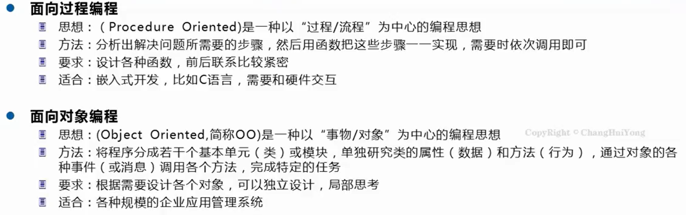
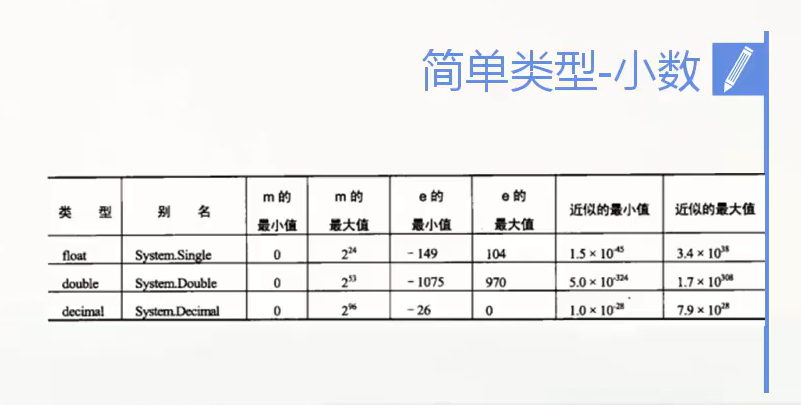
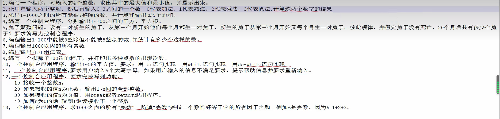

# 前置 visual studio 的使用


涉及 Winform 开发的时候，工具箱就是所有控件，可以通过拖动的方式进行编程。


Debug 可以程序调试，Release 就不行，Release 是发布版本


多个项目的时候设置启动项目


清理解决方案：把项目生成的核心文件删除 exe 和 dll 等

清理前


清理后


生成解决方案，相当于对解决方案中的所有项目依次打包。


## 如何调试


# 第一章 C#和.net框架


c#是 .NET框架的一个编程语言。

可以在 .NET 平台上开发和运行程序


类库：比如 Form 和 Object 类


微软平台的编程

1.编程与越南使用 Visual Basic c c++

2.20世纪 90年代末  win32API MFC COM(组件对象模型)

3.2002 发布第一个 .NET框架(多平台，行业标准，安全性)


什么是 BCL ？Base Class Library 基类库   ：系统提供给的一些类

BCL包括：

1. 通用基础类-文件操作 字符串操作
2. 集合类-列表 字典
3. 线程和同步类-多线程程序
4. XML类-创建、读取以及操作XML文档


同一平台不同开发语言可以互相调用(c#写的程序能调用 vb写的程序)，原因是它们被虚拟机翻译后生成相同字节码(中间语言)


编译过程解析


编译过程就是将 c#  等.NET兼容的语言变成了程序集。 微软中间语言 IL


运行过程解析


运行过程就是将程序集变成了操作系统能够识别的代码


编译和运行过程


CLR称为运行时环境


CLR 

CLR是公共语言运行库，运行环境

托管代码：就是我们所编写的代码


非托管代码不在CLR中运行，直接和操作系统交互


c#演化


Unity支持的是 2.0 版本的


C#文件配置请查看相关视频


# 第二章 第一个C#程序

## c#层次结构


```
//这是注释
// 下面两个 using 是引入命名空间     被使用到的是亮色的
using System;
using System.Collections.Generic;
// namespace cs: 定义了一个命名空间cs,命名空间名字不要用中文
namespace cs{ // 大括号表示命名空间拥有的东西
    // class Program1  定义类
    class Program1{
        //定义了 Main 方法，Main方法就是 Program1的一个成员
        static void Main(string [] args){
            Console.WriteLine("Hello wor1ld");
        }
    }
}

```


Main 方法是整个程序的入口，Main方法有且只有一个


## 写代码的基本知识





常用快捷键 

1. Home:光标移动到代码行首  End:光标移动到代码行尾
2. Pageup Pagedown:上下快速移动当前页面代码，笔记本找不到
3. shift ：快速选中代码，先选择要选择区域的起始位置，再按住shift选择要选择区域的终止位置
4. ctrl+z：撤销删除，或者说，撤销上一步的操作
5. ctrl+a：全选当前页面所有代码
6. ctrl+s：保存当前页面代码
7. ctrl+c，v 复制粘贴
8. ctrl+x：复制并删除即剪切，原位置的东西没了
9. ctrl+home：光标到达当前页面第一个字符   ctrl+end：光标到达当前页面最后一个字符
10. ctrl+f5：运行程序后不结束   f5：程序运行后自动结束
11. delete：删除光标后面的字符
12. insert：覆盖模式和插入模式互换


全角字符和半角字符 中文字符和英文字符

全角字符是占用两个半角字符的位置，写代码肯定是半角字符

写代码用英文状态的符号


## 命名空间


## 注释


文档注释就是 ///

## 折叠器


```
#region 对这段代码的描述

#endregion
```


## 标识符


​									<font size=10>4  标识符不能和C#关键字重名</font>


```
//这是注释
// 下面两个 using 是引入命名空间     被使用到的是亮色的
using System;
using System.Collections.Generic;
// namespace cs: 定义了一个命名空间cs,命名空间名字不要用中文
namespace cs{ // 大括号表示命名空间拥有的东西
    // class Program1  定义类
    class Program1{
        static void Main(string [] args){
            Console.WriteLine("Hello wor1ld");
        }
    }
}

```

该代码中   cs   Program1    Main 是标识符


下面哪些变量不合法?


### C#命名规范


### C#关键字


## Main方法，语句，块的定义

Main 方法，项目的入口


语句是什么


块是什么

块 = 语句+大括号


多个块可以嵌套，大括号一一对应

```
using System;
using System.Collections.Generic;
namespace cs{ 
    class Program1  
    class Program1{
        static void Main(string [] args){
            Console.WriteLine("Hello wor1ld");
            Console.WriteLine("Hello wor2ld");
            Console.WriteLine("Hello wor3ld");
        }
    }
}

//该代码块有3个块
```


## Console类，从程序中输出文本


控制台窗口是一个简单的命名提示窗口，允许程序显示文本并从键盘接受输入。

BCL提供一个 Console的类(在 System 命名空间下)，该类包含了输入和输出到控制台窗口的方法

### Write方法和WriteLine方法

Write 和 Writeline 都是 Console类的成员，它把一个文本字符串发送到程序的控制台窗口。

最简单的使用：Write把文本的字符串字面量发送到窗口，字符串必须使用双引号括起来


```

// using System;   //不知道为什么 using System;不写也可以不报错
//不写using System;  就可以  System.Console.write 调用 write 方法
//  using System;是引入整个命名空间，System.Console.write 是引入命名空间的某一个
namespace cs{ 
    class Program1{
        static void Main(string [] args){
            Console.Write("Hello wor1ld");
            Console.Write("Hello wor2ld");
            Console.Write("Hello wor3ld");
        }
    }
}

```

Write 没有在后面添加换行符，WriteLine 在最后添加了换行符


#### 格式化字符串


类似于  c语言中的  %d 代替整数的那种占位符

C#中的标记就是   {数字}      以0作为第一个 

```

namespace cs{ 
    class Program1{
        static void Main(string [] args){
            Console.WriteLine("两个数相加：{0}+{1}={2}",100,200,340);         
        }
    }
}

```


注：一一对应的原则是   替换值1：{0}，替换值2：{1}，替换值3：{2}

```
namespace cs{ 
    class Program1{
        static void Main(string [] args){
        										//100:{0} 200:{1}  340:{2}
             Console.WriteLine("两个数相加：{2}+{1}={0}",100,200,340);         
            
        }
    }
}

```


多重标记和值


```
// using System;
namespace cs{ 
    class Program1{
        static void Main(string [] args){
           Console.WriteLine("Three Integer are {1},{0} and {1}",20,40);  
        }
    }
}
这里:{0}对应20,{1}对应40，以及{1}标记使用了两次  

```


{}内的数字超出替换值列表的长度-1就会报错

```
namespace cs{ 
    class Program1{
        static void Main(string [] args){
             Console.WriteLine("两个数相加：{2}+{1}={0},{3}",100,200,340);         
            
        }
    }
}

```


使用 f5 键运行程序时，在Main块最后加上  Console.ReadKey()   会让程序卡在那里不往下走，因为ReadKey 就是施加一个对键盘按键的监听，我们不按它就不走


可以使用制表符实现格式化输出

## 使用 msdn


选中 按 f1 就查看其文档


# 第三章 变量和表达式

## 变量


定义变量，就是向内存申请一块空间存储数据


变量的声明


声明变量需要指定变量和类型名

声明格式：

```
变量类型 变量名;
```


```
namespace cs1{
    class Program2{
        static void Main(string [] args){
            int age = 20;
            int hp = 200;
            string name="rzy";
            Console.WriteLine(name);    
        }
    }
}

声明了3个变量并赋值     age hp name     Console.WriteLine 进行变量使用
```


### 变量的类型

#### 整型变量


byte short int long   4种类型   byte 1字节    short 2字节 int 4字节 long 8字节


```
namespace cs1{
    class Program2{
        static void Main(string [] args){
            byte mb = 34;
            int score = 2000;
            long count = 100000000000;
            Console.WriteLine("byte:{0},score:{1},count:{2}",mb,score,count);

          
        }
    }
}
```


#### 浮点型变量



float     double    decimal


注：浮点型常量默认是double 类型，如果要变为float类型 在常数最后加上f

```
namespace cs1{
    class Program2{
        static void Main(string [] args){
            float f1 = 12.5f;
            double d1 = 14.6;
            Console.WriteLine("{0},{1}",f1,d1);

          
        }
    }
}
```


#### 非数值类型


char 用 单引号' '       string 用双引号  " "

bool 是表达式比较的结果类型   我们给它赋值的时候必须是小写的true 和 false

```
namespace cs1{
    class Program2{
        static void Main(string [] args){
            char myChar = 'a';
            string myString = "abc";
            bool myBool = true;
            Console.WriteLine("{0},{1},{2}",myChar,myString,myBool);       
        }
    }
}
```


练习：定义角色的信息并且输出到控制台

```
namespace cs1{
    class Program2{
        static void Main(string [] args){
            string name = "siki";
            int hp = 100;
            int level = 34;
            float exp = 345.3f;
            Console.WriteLine("名字:{0},血量:{1},等级:{2},经验:{3}",name,hp,level,exp);

          
        }
    }
}
```


### 变量的赋值和初始化


第一次给变量赋值叫做初始化，接下来的赋值就是赋值，每一次覆盖之前所赋的值


同时定义多个变量，这些变量必须是同一个类型

```
int hp,age,exp;
hp = 100;
age = 30;
exp = 1000;
```


变量定义常见错误


### 变量的显式和隐式转换


byte < short < int < long < float <double

长度小的数据类型变为长度大的数据类型是安全的，隐式转换即可

长度大的数据类型变为长度小的数据类型是不安全的，需要显式转换

```
using System;
namespace cs1{
    class Program2{
        static void Main(string [] args){
            byte b1 = 10;
            int m2 = b1;  // 隐式转换
            b1 = (byte)m2; // 显式转换
        }
    }
}
```


使用Convert函数将string 转化成 byte int double 等类型


把byte int double 等转化成 string 只需要   ""+数值 就可以了   也可以  使用 ToString 函数

```
using System;
namespace cs1{
    class Program2{
        static void Main(string [] args){
            string s1 = "10";
            string s2 = "19.2";
            string s3 ="c";
            string s4 = "true";
            int c1 = Convert.ToInt32(s1);
            byte c2 = Convert.ToByte(s1);
            double c3 = Convert.ToDouble(s2);
            char c4 = Convert.ToChar(s3);
            bool c5 = Convert.ToBoolean(s4);

        }
    }
}
```


## 字面值和转义字符

字面值是用来表示文本和数字的    

int a = 100   100是字面值      string hp = "1000"    引号内的1000是字面值


char 表示一个字符，字符可以是 字母 数字  @#￥这些特殊的  还有 汉字

string 是 char 的数组，是字符的集合


### 转义字符

具有特殊功能的字符


```
namespace cs1{
    class Program2{
        static void Main(string [] args){
            string name = "siki";
            int hp = 100;
            int level = 34;
            float exp = 345.3f;
            Console.WriteLine("名字:\"{0}\",血量:\"{1}\",等级:\"{2}\",经验:\"{3}\"",name,hp,level,exp);

          
        }
    }
}
```


### 字符的Unicode值


```
namespace cs1{
    class Program2{
        static void Main(string [] args){
            Console.WriteLine("I\u0027s rzy");       
        }
    }
}
这里 \u0027 表示 ’
```


### 字符串前面加@不识别转义字符


在字符串最前面，在引号外面加@

```
namespace cs1{
    class Program2{
        static void Main(string [] args){
            Console.WriteLine("Hello\nworld");
              Console.WriteLine(@"Hello\nworld");  
        }
    }
}
```


在字符串前面，引号外面加上@，还能让字符串分两行定义，此时如果还想要在字符串中使用双引号，就需要 ”“ 两个双引号表示一个双引号  而不是 \\"

```
namespace cs1{
    class Program2{
        static void Main(string [] args){
            Console.WriteLine(@"Hel
lo""world");                
        }
    }
}
```


字符串最前面加@还可以简化路径

```
namespace cs1{
    class Program2{
        static void Main(string [] args){
            Console.WriteLine("C:\\a\\b.txt");
            Console.WriteLine("\n");
            Console.WriteLine(@"C:\a\b.txt");
                    
        }
    }
}
```


## 常量


常量通常是 全部大写，声明的同时进行赋值

## 表达式


### 数学(算数)运算符


```
+  - * / %    =+    =-
```

```
namespace cs1{
    class Program2{
        static void Main(string [] args){
            int num1 = 200;
            int num2 = 400;
            int res1 = num1 - num2;
            int res2 = num1 + num2;
            double res3 = num1/num2;
            int res4 = num1*num2;
            Console.WriteLine("{0},{1},{2},{3}",res1,res2,res3,res4);

        }
    }
}
```


加减乘除求余两边的操作数如果都是整数，那么结果还是整数

如果不能被整除，那会自动略去小数部分

```
namespace cs1{
    class Program2{
        static void Main(string [] args){
            int num1 = 200;
            int num2 = 400;
            double num3 = 400.0;
            double res1 = num1/num2;
            double res2 = num1/num3;
            Console.WriteLine("{0},{1}",res1,res2);

        }
    }
}
```


求余运算 可以对整数求余，也可以对小数求余

```
namespace cs1{
    class Program2{
        static void Main(string [] args){
            int num1 = 200;
            double num2 = 400.7;
            double num3 = 10;
            double res1 = num1%num3;
            double res2 = num2%num3;
            Console.WriteLine("{0},{1}",res1,res2);

        }
    }
}
```


0.6999999999999 是机器原因


#### 数学运算的结果类型


byte < short < int < long < float <double


#### 加法的特殊功能

加法”+“能够用于两个字符串的相加，返回结果是字符串。

当 字符串 和 数字 用加号相连，把数字变为字符串再连接起来结果是字符串

```
namespace cs1{
    class Program2{
        static void Main(string [] args){
            Console.WriteLine("hello"+"world");
            Console.WriteLine(123+"456");
        }
    }
}
```


### 自加和自减运算符


++ -- 一定要和变量使用 不能 和字面量搭配使用

单独使用   操作数 ++ 和 ++ 操作数 没有任何区别       都是使操作数+1

```
int res =操作数 ++;
int res2 = ++ 操作数;
第一个是先赋值 再++  第二个是先++ 再赋值
```

-- 与 ++ 类似

```
namespace cs1{
    class Program2{
        static void Main(string [] args){
            int a = 45;
            int res1 = a++;	
            // 到这里 a 变成 46
            int res2 = ++a;
            Console.WriteLine("{0},{1}",res1,res2);
        }
    }
}
```


### 赋值运算符

用来向盒子(变量)里存放东西的运算符


num + = 12  相当于    num = num + 12

num * = 12  相当于    num = num*12

num  / = 12  相当于     num = num/12

num % = 12  相当于    num = num%12


### 运算符的优先级


括号能改变优先级，优先级同等的就是从左到右算


## 接收用户输入的字符串，整数和小数

Console.ReadLine() 方法从键盘上读取**一行**字符串输入，返回的是一个字符串

对于ReadLine方法，只有当我们按下回车才算读取完，程序才会往下运行

```
string str = Console.ReadLine();
```


```
using System;
namespace cs1{
    class Program2{
        static void Main(string [] args){
            string str = Console.ReadLine();
            Console.WriteLine("你输入的字符串是:{0}",str);
           
        }
    }
}
```


得到整数的方法：Console.ReadLine() 得到整数的字符串，再用函数 Convert.ToInt32(str) 把整数字符串转化成整数 ，再用一个 int 类型的值接收。

如果str字符串无法转换成整数 比如 123a  就会出现异常

```
string str = Console.ReadLine();
int a = Convert.ToInt32(str)
```


```
using System;
namespace cs1{
    class Program2{
        static void Main(string [] args){
            string str = Console.ReadLine();
            int a = Convert.ToInt32(str);
            Console.WriteLine("您输入的整数是{0}",a);
           
        }
    }
}
```


会出现异常：


得到浮点数的方法：Console.ReadLine() 得到浮点数的字符串，再用 Convert.ToDouble(str) 把浮点数字符串转化成浮点数，再用一个 Double 类型的值接收。

如果str字符串无法转换成浮点 比如 123.a  就会出现异常

```
string str = Console.ReadLine();
double a = Convert.ToDouble(str)
```


```
using System;
namespace cs1{
    class Program2{
        static void Main(string [] args){
            
            string str = Console.ReadLine();
            double a = Convert.ToDouble(str);
            Console.WriteLine("你输入的浮点数是:{0}",a);
                   
        }
    }
}
```


会出现如下错误


案例：接收用户输入的两个数字并且输出到控制台

```
using System;
namespace cs1{
    class Program2{
        static void Main(string [] args){
            Console.WriteLine("请输出两个数");
            double num1;
            double num2;
            string s1 = Console.ReadLine();
            string s2 = Console.ReadLine();
            num1 = Convert.ToDouble(s1);
            num2 = Convert.ToDouble(s2);
            double res1 = num1 + num2;
            Console.WriteLine("两数之和为{0}",res1);      
        }
    }
}

```


对于ReadLine方法，只有当我们按下回车才算读取完，程序才会往下运行


## 枚举类型

枚举类型可以定义在class类外(和 class 同一等级，在 namespace 内)，也可以定义在 class内部

class 外部就是全局   class 内部就是局部


一般枚举在类的外部定义，通过静态的方式访问其成员


```
定义在类外
using System;
namespace cs1{
    enum GameState{
        Pause,
        Win,
        Failed,
        Exit
    }
    class Program2{
        static void Main(string [] args){
            GameState state = GameState.Win;
            
        }
    }
}


定义在类内
using System;
namespace cs1{
    class Program2{
         enum GameState{
        Pause,
        Win,
        Failed,
        Exit
    }
        static void Main(string [] args){
            GameState state = GameState.Win;
        }
    }
}
```


默认值，从0开始，依次往后  0 ，1 ，2 ，3...


可以自己给枚举类型中的值进行赋值，后面的默认值也会依次改变


每一个默认值都可以发生改变，即使不等差

```
using System;
namespace cs1{
     enum GameState{
        Pause = 100,
        Win = 220,
        Failed = 210,
        Exit = 201
    }
    class Program2{
        static void Main(string [] args){
            GameState state = GameState.Win;

        }
    }
}
```


enum 枚举类型:整型类型 ，可以改变 enum 的存储类型，默认是int，通常是使用 byte，因为比较小


```
using System;
namespace cs1{
     enum GameState:byte
     
     {
        Pause = 100,
        Win = 220,
        Failed = 210,
        Exit = 201
    }
    class Program2{
        static void Main(string [] args){
            GameState state = GameState.Win;
        }
    }
}
```


## 变量的类型分析

c# 两种数据类型   ：基本数据类型和引用数据类型

基本数据类型：int 等数值型，还有字符串

基本数据类型是不可变的

int a = 10

a = 15 

并不是 10 变成了 15，而是 a 从旧的量 10 指向了 新的量 15


引用数据类型：


对象，数组啥的都是引用类型对象


字符串string 也是引用类型，但是和值类型是类似的。

## 结构体类型

结构体相当于多个简单数据类型构成了复杂数据类型


```
using System;
namespace cs1{
    enum Direction:byte
    {
        North;
        South;
        West;
        East;        
    }
    struct Path{   // Path 的地位相当于 int ， 是一种数据类型
    	// 这里为什么写 public 以后会知道
        public Direction d1;
        public int instance;

    }
    class Program2{
        static void Main(string [] args){
           Path p1;
           p1.d1 = Direction.East;
           p1.instance = 100;
           

        }
    }
}
```


## 阶段练习


1.

```
using System;
namespace cs1{
    class Program2{
        static void Main(string [] args){
            int level;
            double attack;
            int hp;
            int speed;   
        }
    }
}
```

2.

```
using System;
namespace cs1{
    class Program2{
        static void Main(string [] args){
            double num1;
            double num2;
            num1 = Convert.ToDouble(Console.ReadLine());
            num2 = Convert.ToDouble(Console.ReadLine());
            double temp;
            temp = num1;
            num1 = num2;
            num2 = temp;
            Console.WriteLine("{0},{1}",num1,num2);
        }
    }
}
```

3.

```
using System;
namespace cs1{
    class Program2{
        static void Main(string [] args){
            int num1,num2,num3,num4;
            num1 = Convert.ToInt32(Console.ReadLine());
            num2 = Convert.ToInt32(Console.ReadLine());
            num3 = Convert.ToInt32(Console.ReadLine());
            num4 = Convert.ToInt32(Console.ReadLine());
           Console.WriteLine("四个数的乘积是{0}",num1*num2*num3*num4);
        }
    }
}
```

4.

```
using System;
namespace cs1{
    class Program2{
        static void Main(string [] args){
            Console.WriteLine("请输入三位的整数");
            int num1;
            num1 = Convert.ToInt32(Console.ReadLine());
            int part1 = num1%10;
            int part2 = num1%100/10;
            int part3 = num1/100;
            Console.WriteLine("调换后的数为:{0}",part1*100+part2*10+part3);

        }
    }
}
```

5

```
using System;
namespace cs1{
    class Program2{
        static void Main(string [] args){
            Console.WriteLine("请输入上底下底高");
            double shang;
            double xia;
            double gao;
            double square;
            shang = Convert.ToDouble(Console.ReadLine());
            xia = Convert.ToDouble(Console.ReadLine());
             gao= Convert.ToDouble(Console.ReadLine());
            square = (shang+xia)*gao/2;
            Console.WriteLine("面积为{0}",square);

        }
    }
}
```


6.

```
using System;
namespace cs1{
    class Program2{
        static void Main(string [] args){
            Console.WriteLine("请输入半径");
            double r;
            r = Convert.ToDouble(Console.ReadLine());
            double zhouchang = 3.14*2*r;
            double mianji = 3.14*r*r;
            Console.WriteLine("{0},{1}",zhouchang,mianji);

        }
    }
}
```


# 第四章 流程控制


## 比较运算和布尔值

比较运算返回结果是布尔值

```
using System;
namespace cs1{
    class Program2{
        static void Main(string [] args){
            bool b1 = 10>5;
            Console.WriteLine("{0}",b1);
           
        }
    }
}
```


## bool运算符


== 判断是否相等   = 是进行赋值


&&与 || 都是短路符号，&&一旦第一个为假第二个就不会判断，整个结果自动是假

​										   ||一但第一个为真第二个就不会判断，整个结果自动是真


## goto语句

goto实际中几乎不用


```
using System;
namespace cs1{
    class Program2{
        static void Main(string [] args){
            int h = 100;

            goto mylabel;
            h++;			// h++; 跳过了
            mylabel:
            Console.WriteLine("{0}",h);
        }
    }
}
```


## 条件语句

### 3种if

有条件的执行某段代码

if


if - else


if - else if -..... - else   else if 可以有多个   而else只能有一个


```
using System;
namespace cs1{
    class Program2{
        static void Main(string [] args){
            Console.WriteLine("请输入成绩");
            double m = Convert.ToDouble(Console.ReadLine());
            
            if(m>=90&&m<=100){
                Console.WriteLine("优秀");
            }else if (m>=80&&m<90){
                Console.WriteLine("良好");
            }else if (m>=60&&m<80){
                Console.WriteLine("及格");
            }else {
                Console.WriteLine("还需要继续努力");
            }

        }
    }
}
```


### 3元运算符


```
using System;
namespace cs1{
    class Program2{
        static void Main(string [] args){
            int h = 100;

            int a = (h>50)?1:0;
            Console.WriteLine("{0}",a);
        }
    }
}
```


## 选择语句(switch)


test var 可以是 double int 和 char 

如果每个case之间不加break 就是一路往下   default 就是所有情况都没走到的时候兜底的作用

```
using System;
namespace cs1{
    class Program2{
        static void Main(string [] args){
            Console.WriteLine("请输入状态码");
            int state;
            state=Convert.ToInt32(Console.ReadLine());
            switch(state){
                case 0:
                    Console.WriteLine("游戏暂停");
                    break;
                case 1:
                    Console.WriteLine("游戏胜利");
                    break;
                case 2:
                    Console.WriteLine("游戏失败");
                    break;
                case 3:
                    Console.WriteLine("游戏退出");      
                    break;
                default:
                    Console.WriteLine("状态码不正确"); 
                    break;                 
            }

        }
    }
}
```


## 循环语句

### while循环


```
using System;
namespace cs1{
    class Program2{
        static void Main(string [] args){
            int num = 1;
            while(num<=9){
                Console.Write("{0}",num);
                num++;
            }
       
        }
    }
}
```


### do while 循环


do while 是 一定先执行一次循环体再条件判断，至少执行一次循环体。而while循环体可能一次也不执行，while循环先进行条件判断

```
using System;
namespace cs1{
    class Program2{
        static void Main(string [] args){
            int num = 1;
           do{
            Console.WriteLine("{0}",num);
            num++;
           }while(num<=9);   // 这里要一个分号
        

        }
    }
}
```


### for循环


condition 在每次循环前执行，   operation 在每次循环后执行

```
using System;
namespace cs1{
    class Program2{
        static void Main(string [] args){
            for(int index = 1;index <=9;index++){
                Console.WriteLine("{0}",index);
            }
        

        }
    }
}
```


### break中断循环

break能够中断循环， 如果是嵌套循环就是中断该语句所在的循环体

```
using System;
namespace cs1{
    class Program2{
        static void Main(string [] args){
            string str;
            while(true){
                str = Console.ReadLine();
                if(str=="0"){
                    Console.WriteLine("你输入了0,程序将会退出");
                }
            }
        }
    }
}
```


### continue 跳过当前循环

跳过当前循环并继续下面的循环


### 使用goto退出循环

例子：当用户输入0的时候跳出循环

```
using System;
namespace cs1{
    class Program2{
        static void Main(string [] args){
            
            string h =null;
            while(true){
                h = Console.ReadLine();
                if(h =="0"){
                    goto label;
                }
            }
            label:
            Console.WriteLine("已经成功退出循环");
        }
    }
}
```

很少用 goto


### 使用return退出循环

使用return语句，整个函数都结束了，剩余的语句不执行


## 阶段练习



```
1.
using System;
namespace cs1{
    class Program2{
        static void Main(string [] args){
            double num1 = Convert.ToDouble(Console.ReadLine());
            double num2 = Convert.ToDouble(Console.ReadLine());
            double num3 = Convert.ToDouble(Console.ReadLine());
            double num4 = Convert.ToDouble(Console.ReadLine());

            double max = num1>num2?num1:num2;
            max = max>num3?max:num3;
            max = max>num4?max:num4;

            double min = num1<num2?num1:num2;
            min = min<num3?min:num3;
            min = min<num4?min:num4;
            Console.WriteLine("最大值是{0},最小值是{1}",max,min);
               
        }
    }
}

2.
using System;
namespace cs1{
    class Program2{
        static void Main(string [] args){
            int num1,num2;
            Console.WriteLine("请输入两个整数:");
            num1 = Convert.ToInt32(Console.ReadLine());
            num2 = Convert.ToInt32(Console.ReadLine());
            string state;
            Console.WriteLine("请输入一个玩意,0代表加,1代表减,2代表乘，3代表除");
            state = Console.ReadLine();
            switch(state){
                case "0":
                    Console.WriteLine("{0}",num1+num2);
                    break;
                case "1":
                    Console.WriteLine("{0}",num1-num2);
                    break;    
                case "2":
                    Console.WriteLine("{0}",num1*num2);
                    break;
                case "3":
                	Console.WriteLine("{0}",num1/num2);
                default:
                    Console.WriteLine("状态值错误");
                    break;
            }
               
        }
    }
}


3.
using System;
namespace cs1{
    class Program2{
        static void Main(string [] args){
            int num = 1;
            int count =0;
            int sum = 0;
            for(;num<=1000;num++){
                if(num%7==0){
                    count++;
                    sum +=num;
                }
                if(count!=0&&count%5==0){
                    Console.Write("{0} ",sum);
                    sum = 0;
                    count = 0;
                }

            }  
        }
    }
}


4.
Math.Sqrt() 方法能够计算数的平方根
namespace cs1{
    class Program2{
        static void Main(string [] args){
            for(int i = 1;i<=100;i++){
                int pingfang = i*i;
                double pingfanggen = Math.Sqrt(i);
                Console.WriteLine("{0}的平方是{1},平方根是{2}",i,pingfang,pingfanggen);
            }
        }
    }
}


5.
using System;
namespace cs1{
    class Program2{
        static void Main(string [] args){
            int month = 3;
            long number = 2;
            for(;month<=23;month++){
                number*= 2;

            }  
            Console.WriteLine("{0}只兔子",number);
        }
    }
}

6.
using System;
namespace cs1{
    class Program2{
        static void Main(string [] args){
            int i = 1;
            int count = 0;
            for(;i<=100;i++){
                if(i%3==0&&i%5!=0){
                    Console.Write("{0} ",i);
                    count ++;
                }

            }
            Console.Write("共{0}个数",count);
        }
    }
}

7.
using System;
namespace cs1{
    class Program2{
        static void Main(string [] args){
            int i = 2;
            bool flag = true;
            for(;i<=1000;i++){
                for(int j = 2;j<i;j++){
                    if(i%j==0){
                        flag =false;
                        break;
                    }
                }
                if(flag){
                    Console.Write("{0} ",i);
                }
                flag = true;
            }

        }
    }
}

8.
using System;
namespace cs1{
    class Program2{
        static void Main(string [] args){
            for(int i = 1;i<=9;i++){
                for(int j = 1;j<=i;j++){
                    Console.Write("{0}*{1}={2} ",i,j,i*j);
                }
                Console.WriteLine();
            }

        }
    }
}

9.
生成随机数
 Random r = new Random(); 要用到这个类
 
using System;
namespace cs1{
    class Program2{
        static void Main(string [] args){
            Random r = new Random();
            for(int i = 1;i<=100;i++){
                int num = r.Next(1,7);
                Console.WriteLine("第{0}次的丢筛子结果是{1}",i,num);
            }

        }
    }
}


10.
using System;
namespace cs1{
    class Program2{
        static void Main(string [] args){
            int i = 1;
            for( i=1 ;i<=5;i++){
                Console.Write("{0} ",i*i);
            }

            Console.WriteLine();
            i = 1;
            while(i<=5){
                Console.Write("{0} ",i*i);
                i++;
            }
            Console.WriteLine();
            int j = 1;
            do{
                Console.Write("{0} ",j*j);
                j++;
            }while(j<=5);
        }
    }
}

11.
C#中可以通过   字符串名[index]  的方式依次访问字符串中的每个字符


using System;
namespace cs1{
    class Program2{
        static void Main(string [] args){
            while(true){
                string str = Console.ReadLine();
                bool isdaxie = true;
                for(int i = 0;i<=4;i++){
                    if(!(str[i]>='A'&&str[i]<='Z')){
                        isdaxie = false;

                    }
                }
                if(isdaxie){
                    Console.WriteLine("您输入的符合,请继续输入");
                } else {
                    Console.WriteLine("您输入的不符合,请继续输入");
                }
                
            }
        }
    }
}


12.
using System;
namespace cs1{
    class Program2{
        static void Main(string [] args){
            while(true){
                int temp;
                temp = Convert.ToInt32(Console.ReadLine());
                if(temp > 0){
                    for(int i = 0;i<=temp;i++){
                        Console.Write("{0} ",i);
                        Console.WriteLine();
                    }
                } else if(temp == 0){
                    break;
                } else{
                    temp = Convert.ToInt32(Console.ReadLine());
                    Console.WriteLine();
                }

                }
            }
        }
    }

13.

namespace cs1{
    class Program2{
        static void Main(string [] args){
            int i = 1;
               for(;i<=1000;i++){
                int sum = 0;
                int j;
                for(j=1;j<i;j++){
                    if(i%j==0){
                        sum += j;                            
                    }
                }
                if(sum==i){
                    Console.WriteLine("{0} ",i);
                }
            }         
        }
    }
}

```


# 第五章 数组


<font size =5>数组初始化的方法</font>


```
第一种方式  必须在定义该数组的同时进行初始化  数组的长度取决于你初始化了的元素个数
using System;
namespace cs1{
    class Program2{
        static void Main(string [] args){
            int [] scores = {10,20,30,50};

            // 不能写成
            // int [] scores;
            // scores = {10,20,30,50};
        }
    }
}


第二种方式 数组内的元素全是默认值
using System;
namespace cs1{
    class Program2{
        static void Main(string [] args){
            int [] scores = new int [10];  
            Console.WriteLine("{0}",scores[0]);
        }
    }
}


第三种 
using System;
namespace cs1{
    class Program2{
        static void Main(string [] args){
            int [] scores = new int [10]{10,20,30,40,50,60,70,80,90,100};
           
        }
    }
}
```


## 数组的遍历


数组有 Length 属性可以得到数组的长度

```
using System;
namespace cs1{
    class Program2{
        static void Main(string [] args){
            int [] scores = new int [10]{10,20,30,40,50,60,70,80,90,100};
            int i = 0;
            for(i = 0; i<scores.Length;i++){
                Console.WriteLine("{0}",scores[i]);
            }
            i = 0;
            while(i<scores.Length){
                Console.WriteLine("{0}",scores[i]);
                i++;
            }

            // 用临时变量 temp(temp 的数据类型和数组的数据类型一致) 暂时并且逐个将数组的每个元素放入temp中
            foreach(int temp in scores){
                Console.WriteLine("{0}",temp);
            }
           
        }
    }
}
```


二维数组的遍历也类似


## 字符串处理的函数

字符串可以当做字符char类型的数组

字符串也有 Length 属性来访问到字符串的长度


练习：对用户输入的字符串进行反向的输出显示


字符串.ToLower 方法：返回原字符串所有英文字符的小写形式，但是不会对原字符串造成影响


字符串.ToUpper 方法：返回原字符串所有英文字符的大写形式，但是不会对原字符串造成影响


字符串.Trim() 方法：返回去掉了原字符串最前面的所有空格和最后面的所有空格的新字符串，但是不会对原字符串造成影响

字符串.TrimStart() 方法：返回去掉了原字符串最前面的所有空格的新字符串，但是不会对原字符串造成影响

字符串.TrimEnd() 方法：返回去掉了原字符串最后面的所有空格的新字符串，但是不会对原字符串造成影响

字符串.Split(var) 方法:将字符串按照传入的参数进行分割，返回分割后的字符串数组


## 阶段练习


```
2.
using System;
namespace cs1{
    class Program2{
        static void Main(string [] args){
            // 把每次余下来的数全部加起来
            int num =364;
            int rest = 0;
            int thetotal = 0;
            while(num>3){    // 双层循环
                while(num >3){
                  thetotal += num; // 用于计算总数
                   num = num/3;		// 3 换 1
                  rest += num%3; // 把每次余下的数加起来
                }
            num = rest;	// 把所有余下数字的和作为新的数字
            rest = 0;
            }      
             Console.WriteLine("{0}",thetotal);     
        }
       
    }
}


3.
//我们不使用输入而是随机生成
using System;
namespace cs1{
    class Program2{
        static void Main(string [] args){
            Random rc = new Random();
            int shuzi = rc.Next(0,41);
            bool isflag = true;   
            while(isflag){
                Console.WriteLine("请输入你猜的数字的大小:");
                int guessnumber =Convert.ToInt32(Console.ReadLine());
                if(guessnumber > shuzi){
                    Console.WriteLine("猜大了");
                } else if(guessnumber < shuzi){
                    Console.WriteLine("猜小了");
                } else {
                    Console.WriteLine("猜中了");
                    isflag = false;
                }
                

            }
        }
       
    }
}
4.
using System;
namespace cs1{
    class Program2{
        static void Main(string [] args){
           string str = Console.ReadLine();
           Console.WriteLine("加密前:{0}",str);
            char [] newstr = new char[str.Length];
           for(int i = 0;i<newstr.Length;i++){
                if(str[i]<='z'&&str[i]>='a'){
                    if(str[i]>='x'){
                        newstr[i] = (char)(str[i]+3-26);
                    }else{
                        newstr[i] = (char)(str[i]+3);
                    }
                }
                if(str[i]<='Z'&&str[i]>='A'){
                    if(str[i]>='X'){
                        newstr[i] = (char)(str[i]+3-26);
                    }else{
                        newstr[i] = (char)(str[i]+3);
                    }
                }
                else{
                    newstr[i] = str[i];
                }
           }
           Console.Write("加密后:");
           for(int i =0;i<newstr.Length;i++){
                Console.Write("{0}",newstr[i]);
           }        
        }     
    }
}


5.
using System;
namespace cs1{
    class Program2{
        static void Main(string [] args){
           Console.WriteLine("请输入你要输入的数字的个数:");
           int Length = Convert.ToInt32(Console.ReadLine());
           int [] shuzu = new int[Length];
           for(int i = 0;i<Length;i++){
            shuzu[i] = Convert.ToInt32(Console.ReadLine());
           }
           for(int i = 0;i<Length;i++){
            for(int j = 0;j<Length-i-1;j++){
                if(shuzu[j]>shuzu[j+1]){
                    int temp = shuzu[j+1];
                    shuzu[j+1] = shuzu[j];
                    shuzu[j] = temp;
                }
            }
           }
           for(int i = 0;i<Length;i++){
            Console.Write("{0} ",shuzu[i]);
           }
           
        }
        
       
    }
}

6.
using System;
namespace cs1{
    class Program2{
        static void Main(string [] args){
            // 逆推法，从最后开始算
           int n = Convert.ToInt32(Console.ReadLine());
           int number = 1;
           while(n>1){
                number= (number+1)*2;
                n--;
           }
           Console.WriteLine("最开始有{0}个桃子",number);          
        }        
    }
}


7.
using System;
namespace cs1{
    class Program2{
        static void Main(string [] args){
            int length = Convert.ToInt32(Console.ReadLine());
            int [] shuzu = new int[length]; 
            for(int i = 0;i<length;i++){
                shuzu[i] = Convert.ToInt32(Console.ReadLine());
            }

            Console.WriteLine("交换前:");
            for(int i = 0;i<length;i++){
                Console.Write("{0} ",shuzu[i]);
            }
            int min = shuzu[0];
            int position =0;
            for(int i = 0;i<length;i++){
                if(min>shuzu[i]){
                    min = shuzu[i];
                    position = i;
                    
                }
            }
            shuzu[position] =shuzu[0];
            shuzu[0] = min; 

            Console.WriteLine("交换后:");
            for(int i = 0;i<length;i++){
                Console.Write("{0} ",shuzu[i]);
            }                    
        }     
    }
}

8.
using System;
namespace cs1{
    class Program2{
        static void Main(string [] args){
            int [] array = new int[11]{10,20,30,40,50,60,70,80,90,100,0};
            Console.WriteLine("请输入你要插入的数字");
            int temp = Convert.ToInt32(Console.ReadLine());
            for(int i = 0;i<array.Length;i++){
                if(array[i]>temp){
                    for(int j = array.Length-1;j>i;j--){
                        array[j] = array[j-1];
                    }
                    array[i] = temp;
                    break;
                }
                 if(i == array.Length-1){
                    array[i] = temp;
                }
            }
            Console.WriteLine("插入后:");
            for(int i = 0;i<array.Length;i++){
                Console.Write("{0} ",array[i]);
            }
           
        }       
    }
}


9.


10.
using System;
namespace cs1{
    class Program2{
        static void Main(string [] args){
            string str = Console.ReadLine();
            bool flag_first = false ;
            bool flag_body = false;
            if((str[0]>='a'&&str[0]<='z')||(str[0]>='A'&&str[0]<='Z')||(str[0]=='_')||(str[0]=='@'))
                flag_first = true;
            for(int i = 1 ;i<str.Length ;i++){
                
                 if((str[i]>='a'&&str[i]<='z')||(str[i]>='A'&&str[i]<='Z')||(str[i]=='_')||(str[i]>='0'&&str[i]<='9'))
                    flag_body = true;

            }
            if(flag_first&&flag_body){
                Console.WriteLine("{0}符合要求",str);
            } else {
                Console.WriteLine("{0}不符合要求",str);
            }
           
        }
        
       
    }
}

11.
using System;
namespace cs1{
    class Program2{
        static void Main(string [] args){
            string str = Console.ReadLine();
            bool ishuiwen = true;
            for(int i = 0;i<str.Length;i++){
                if(!(str[i] == str[str.Length-1-i])){
                    ishuiwen = false;
                    break;
                }
            }
            if(ishuiwen){
                Console.WriteLine("{0}是回文数",str);
            } else{
                Console.WriteLine("{0}不是回文数",str);
            }
        }
        
       
    }
}

12.
using System;
namespace cs1{
    class Program2{
        static void Main(string [] args){
            bool issafe = true;
            string str = Console.ReadLine();
            if(str.Length>16||str.Length<8){
                issafe = false;
            }
            bool issafe1 = false;
            bool issafe2 = false;
            bool issafe3 = false;
            bool issafe4 = false;
            int count = 0;
            for(int i = 0;i<str.Length;i++){
                if(!issafe1){
                    if(str[i]>='a'&&str[i]<='z'){
                        issafe1 = true;
                        count++;
                    }    
                }
                if(!issafe2){
                    if(str[i]>='A'&&str[i]<='Z'){
                        issafe2 = true;
                        count++;
                    }    
                }
                if(!issafe3){
                    if(str[i]>='0'&&str[i]<='9'){
                        issafe3 = true;
                        count++;
                    }    
                }
                if(!issafe4){
                    if(str[i]=='~'||str[i]=='!'||str[i]=='@'||str[i]=='#'||str[i]=='$'||str[i]=='%'||str[i]=='^'){
                        issafe4 = true;
                        count++;
                    }    
                }
            }
            if(count<3){
                issafe = false;
            }
            if(issafe){
                Console.WriteLine("{0}是安全的",str);
            }else{
                Console.WriteLine("{0}不安全",str);
            }
        }
    }
}


```


# 第六章 函数


## 定义和使用函数


函数是放在类内的，彼此函数之间是平级的


```
using System;
namespace cs1{
    class Program2{
        static void Main(string [] args){
            MyFunction();   // 函数名(参数列表) 来调用函数
        }

        static void MyFunction(){
            Console.WriteLine("这是我的函数");
        } 
    }
}

```


### 返回值


```
using System;
namespace cs1{
    class Program2{
        static void Main(string [] args){
            MyFunction();   // 函数名(参数列表) 来调用函数
        }

        static void MyFunction(){
            Console.WriteLine("这是我的函数");
            return ; // 函数类型是 void ，单写一个void 表示退出函数
        } 
    }
}
```


### 参数

传参一定要传递对应类型的参数


```
main {
	函数名(实参1,实参2);
}

返回类型 函数名 (形参1,形参2){
	return 返回类型的数
}


形参的值是不确定，要等实参传值过来
实参的值会传递给形参做运算
```


```
1.
using System;
namespace cs1{
    class Program2{
        static void Main(string [] args){
            Console.WriteLine("{0}",MyFunction(10,20));   // 函数名(参数列表) 来调用函数
        }
			//返回类型是int
        static int MyFunction(int t1,int t2){
            
            return t1+t2 ; // 函数类型是 void ，单写一个void 表示退出函数
        } 
    }
}

2.
using System;
namespace cs1{
    class Program2{
        static void Main(string [] args){
            int num = Convert.ToInt32(Console.ReadLine());
            int [] number = MyFunction(num);
            for(int i = 0;i<number.Length;i++){
                Console.WriteLine("{0} ",number[i]);
            }
        }

        static int[] MyFunction(int num){
            int count = 0;
            for(int i = 1;i<num;i++){
                if(num%i==0){
                    count++;
                }
            }
            int [] number = new int[count];
            int index = 0;
            for(int i = 1;i<num;i++){
                if(num%i==0){
                    number[index] = i;
                    index++;
                }
            }
            return number;
        } 
    }
}

3.
using System;
namespace cs1{
    class Program2{
        static void Main(string [] args){
            Console.WriteLine("请输入数组的长度");
            
            int length = Convert.ToInt32(Console.ReadLine());
            Console.WriteLine("请输入数组的元素");
            int [] array = new int [length];
            for(int i = 0;i<length ;i++){
                array[i] = Convert.ToInt32(Console.ReadLine());
            }
            int max = GetMaxofArray(array);
            Console.WriteLine("数组最大值是{0}",max);
        }
        static int GetMaxofArray(int [] array){
            int  temp = array[0];
            for(int i = 0;i<array.Length;i++){
                if(temp<array[i]){
                    temp = array[i];
                }
            }
            return temp;
        }
        
    }
}

```


### 参数数组

函数的参数列表内参数的个数不确定使用参数数组


```
1.
static void myfunction(int [] array){
	// 通过 array.Length 就能够动态获取参数的个数
	int num = array.Length;
}

调用方法：
myfunction(new int[10]{0,10,20,30,40,50,60,70,80,90});
//必须我们手动生成数组作为实际参数


2.参数数组
static void myfunction(params int [] array){
	// 同样可以使用 array.Length
}

调用方法：
myfunction(0,10,20,30,40,50,60,70,80,90);
// 我们传入若干个同一数据类型的数，传入的数与形参的数组类型要相符合 。编译器会自动将我们传入的数生成一个数组
参数数组的使用减少了创建数组的过程
```


### 结构函数


例子：


```
using System;
namespace cs1{
    struct vector3{
        public float x;
        public float y;
        public float z;
        public double Distance(){
            return Math.Sqrt(x*x+y*y+z*z);
        }
    }
    class Program2{
        static void Main(string [] args){
            vector3 my;
            my.x = 2;
            my.y = 2;
            my.z = 2;
            Console.WriteLine("{0}",my.Distance());
            
        }
        
    }
}

```


## 函数重载

函数名相同，参数必须不同，返回类型可以相同

编译器通过不同的参数识别应该调用什么函数


```
using System;
namespace cs1{
    
    class Program2{
        static double GetMax(params double [] num){
        double max = num[0];
        for(int i = 0;i<num.Length;i++){
            if(max<num[i]){
                max = num[i];
            }
        }
        return max;
    }
    static int GetMax(params int [] num){
        int max = num[0];
        for(int i = 0;i<num.Length;i++){
            if(max<num[i]){
                max = num[i];
            }
        }
        return max;
    }
        static void Main(string [] args){
           Console.WriteLine("{0}最大",GetMax(10,20,30,50));
           Console.WriteLine("{0}最大",GetMax(10.1,10.2,10.3));
        }
        
    }
}

```


## 委托

委托：同于存储函数，存储的函数必须满足其返回类型和委托的返回类型相同，其参数列表和委托的参数列表相同

委托的声明可以和类平级，在命名空间以外

通过直接把函数赋值给委托的方法来定义委托变量。

委托的声明方法

```
访问修饰符号 delegate(关键字) 函数返回类型 委托名(参数列表); 委托没有方法体
```


```
using System;
namespace cs1{
    public delegate double MyDelegate(double num1,double num2);
    class Program2{
        static double sum(double t1,double t2){
            return t1+t2;
        }
        static double jian(double t1,double t2){
            return t1-t2;
        }
    
    
        static void Main(string [] args){
          MyDelegate d1 ;
          d1 = sum; // 使用函数名给委托变量进行赋值
          Console.WriteLine(d1(20.5,10.1));
          d1 = jian;// 使用函数名再次给委托变量进行重新赋值
          Console.WriteLine(d1(20.5,10.1));
        }
        
    }
}

```


## 阶段练习


