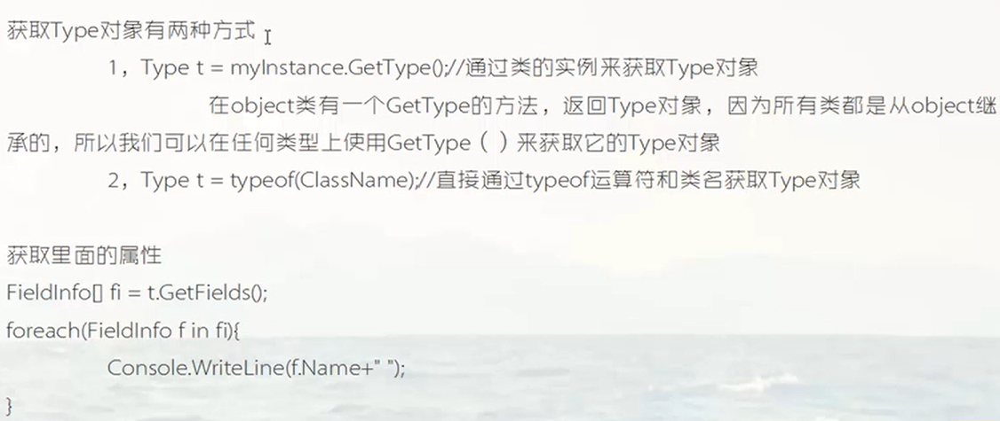
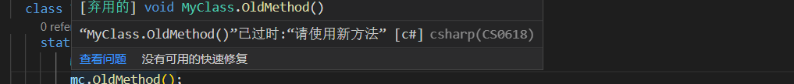
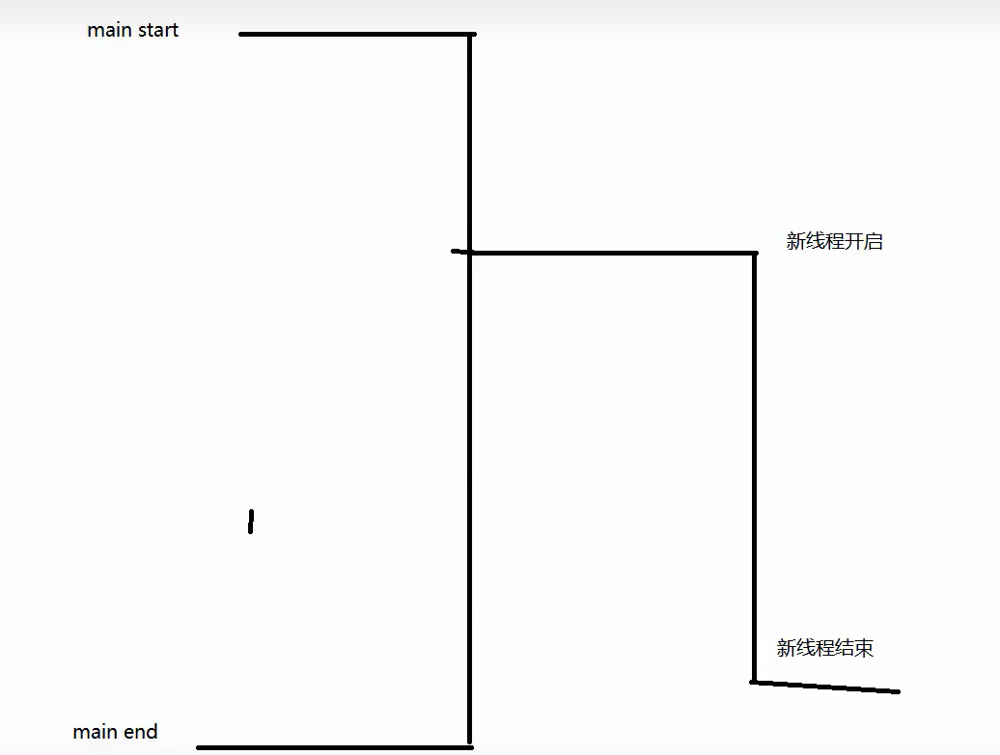
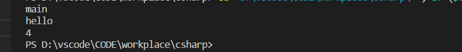
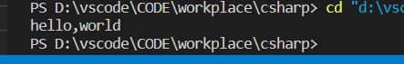
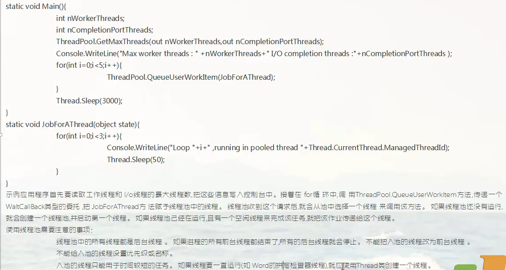

# 一、反射

## 什么是元数据，什么是反射


## Type类


Type类用来存储方法和字段。使用该类能够获取其他类的信息，比如包含的数据和成员。


### 获取type对象



每一个类都对应一个type对象，这个type对象存储了这个类有哪些方法，哪些数据，哪些成员

第一种：通过类的对象获取这个类的type对象

第二种：直接通过类获取这个类的type对象


然后就能用 type 的方法 获取类中的属性，字段，方法

1.  FieldInfo [] fi = type对象.GetFields();     获取所有字段
2. PropertyInfo [] pi = type对象.GetProperties();  获取所有属性
3.  MethodInfo [] gm = type对象.GetMethods();  获取所有方法(系统会自动为每个字段生成许多的get set 方法，因此会得到许多方法)
4.  type对象.Name   type对象.Namespace   type对象.Assembly  获取类名 类的名称空间   这个类所在的程序集
5. FieldInfo  PropertyInfo   MethodInfo  全都是using System.Reflection内的类 用来存储类的成员


 


```
using System.Reflection;
namespace std1{
  class MyClass{
    public void test1(){      
    }
    public MyClass(){

    }

    public int Name1{get;set;}
    public int Name2{get;set;}
    public int Name3{get;set;}
  }
  class Test1{
    static void Main(string [] args){
        MyClass mc = new MyClass();
        Type t1 = mc.GetType();// 通过对象获取这个对象所属类的Type对象
        Console.WriteLine(t1.Name);  // 获取类的名字
        Console.WriteLine(t1.Namespace); // 获取类所在的名称空间
        Console.WriteLine(t1.Assembly); // 程序集信息

          // GetFields() 方法获取字段
        FieldInfo [] fi = t1.GetFields();  // 只能获取共有 public 修饰的字段
        foreach(FieldInfo f1 in fi){
          Console.WriteLine(f1);
        }

          //GetProperties() 方法获取属性
          PropertyInfo [] pi = t1.GetProperties();
          foreach(PropertyInfo p1 in pi){
            Console.WriteLine(p1);
          }
          MethodInfo [] gm = t1.GetMethods();
          foreach(MethodInfo mi in gm){  // 会获取许多方法，编译器会给属性自动生成get set方法
            Console.WriteLine(mi);
          }
          // 通过type对象可以获取它的类的所有成员，除了私有的。
          
    }
  }
}

```


### Assembly 程序集类

- Assembly对象.FullName属性 获取程序集的全名
- Assembly对象.GetTypes() 方法，获取  定义在程序集中的所有的类 的 Type 对象。

```
using System.Reflection;
namespace std1{
  class MyClass{
    public void test1(){      
    }
    public MyClass(){

    }

    public int Name1{get;set;}
    public int Name2{get;set;}
    public int Name3{get;set;}
  }
  class Test1{
    static void Main(string [] args){
        MyClass mc = new MyClass();
        Type t1 = mc.GetType();// 通过对象获取这个对象所属类的Type对象
        Assembly ab1 = t1.Assembly; // 程序集属性
        Console.WriteLine(ab1.FullName);//获取程序集的所有名称
        Type [] b1 = ab1.GetTypes();
        foreach(var  i1 in b1){
          Console.WriteLine(i1);
        }
    }
  }
}

```


## 特性


### Obsolete 特性

Obsolete 特性  .Net 预定义特性


旧方法不能直接删除，因为以前用上了。提示程序员这是旧方法，可以在方法前面加特性

**Obsolete 特性用来表示一个方法被弃用了**，但是想用被弃用的方法也是可以的，编译可以通过

Obsolete 只能使用在方法上


```
using System.Reflection;
namespace std1{
  class MyClass{
    [Obsolete]
    public  void OldMethod(){
      Console.WriteLine("旧方法");
    }
    public void newMethod(){
      Console.WriteLine("新方法");
    }
  }
  class Test1{
    static void Main(string [] args){
        MyClass mc = new MyClass();
        mc.OldMethod();
    }
  }
}
```

试图使用弃用的方法会警告


可以在Obsolete跟上一个括号，括号里面写字符串信息，提示用什么方法代替

```
[Obsolete("请使用新方法")]
```




如果Obsolete后面有第二个参数true，那就不能用旧方法，直接编译报错了

```
[Obsolete("请使用新方法",true)]
```


### Conditional 特性

Conditional在 System.Diagnostics;命名空间下


如果想要取消对某种方法的所有调用，把调用的地方全部注释掉很麻烦。

可以在方法上面定义 Conditional 特性，括号()里面写一个字符串，接着会根据写在括号里的字符串是否被定义决定是否调用该方法。如果没有被定义就不调用。

```
using System.Diagnostics;
namespace std1{
  class MyClass{
    [Conditional("helloworld")]
    public  void Method1(){
      Console.WriteLine("1");
    }
    public void Method2(){
      Console.WriteLine("2");
    }
  }
  class Test1{
    static void Main(string [] args){
      MyClass mc = new MyClass();
         mc.Method2();
         mc.Method1();
         mc.Method1();
    }
  }
}
```

该代码中，只有在 定义了 helloworld字符串的情况下 Method1() 才会被调用


使用宏来定义字符串   #define 某个字符串，不需要加引用，必须放在整个文件最上面

```
  #define helloworld
using System.Diagnostics;

namespace std1{

  class MyClass{
    [Conditional("helloworld")]
    public  void Method1(){
      Console.WriteLine("1");
    }
    public void Method2(){
      Console.WriteLine("2");
    }
  }
  class Test1{
    static void Main(string [] args){
      MyClass mc = new MyClass();
         mc.Method2();
         mc.Method1();
         mc.Method1();
    }
  }
}

```

、


### 调用者信息特性

using System.Runtime.CompilerServices;  在System.Runtime.CompilerServices 命名空间下


调用者信息特性是只能放在函数参数前面的。

调用者信息特性获取调用这个方法的文件路径。就是知道这个方法是被哪个文件调用的，哪个文件的哪一行调用的，哪个文件的哪个方法调用的。

```

using System.Runtime.CompilerServices;

using System.Timers;
namespace std1{

  class MyClass{
                              // 这三个参数让系统进行传递，写在参数的前面，加在前面表示这个是由系统传入参数
    public  void Method1(string str,[CallerFilePath]string fileName="",[CallerLineNumber]int lineNumber = 0,[CallerMemberName]string MethodName = ""){
      Console.WriteLine(str);
      Console.WriteLine(fileName);
      Console.WriteLine(lineNumber);
      Console.WriteLine(MethodName);

    }
    
  }
  class Test1{
    static void Main(string [] args){
      MyClass mc = new MyClass();      
         mc.Method1("helloworld"); 
    }
  }
}

```


### DebuggerStepThrough特性


用于方法

可以跳过debugger单步调试不进入这个方法，在确定这个方法正确的时候可以使用。


### 特性机制


特性用于什么上，什么就成了目标


### 自定义特性

特性是一种类 class

- 通常特性类的命名，最后是 Attribute
- 特性类要继承 System 中 的 Attribute
- 特性类要声明 sealed
- 一般情况下特性类用来表示目标结构的一些状态(定义一些字段和属性，不定义方法)
- 使用特性 AttributeUsage 表示自定义的特性类能够用于什么目标

```
namespace num1{
    [AttributeUsage(AttributeTargets.Class)] // 这个特性作用于Class
    class MyAttribute:System.Attribute{
        public String Description{get; set;}
        public String VersionNumber{get; set;}

        public int ID{get; set;}
    }
}

```


使用 自定义特性 的时候，特性名中的 Attribute 可以省略，只剩下前面的。

```
[My] // 使用特性的时候，不用写名称后面的 Attribute
    class test{

    }
}
```

给自定义特性添加有参构造器，那么使用特性的时候也需要进行传参

```
namespace num1{
    [AttributeUsage(AttributeTargets.Class)]
    class MyAttribute:System.Attribute{
        public String Description{get; set;}
        public String VersionNumber{get; set;}

        public int ID{get; set;}
        public MyAttribute(string des){  // 需要传入一个字符串
            this.Description = des;
        }
    }
    [My("你好世界")] // 传入字符串
    class test{

    }
}

```


使用特性的时候，指定属性的名字给属性进行赋值

```
namespace num1{
    [AttributeUsage(AttributeTargets.Class)]
    class MyAttribute:System.Attribute{
        public String Description{get; set;}
        public String VersionNumber{get; set;}

        public int ID{get; set;}
        public MyAttribute(string des){
            this.Description = des;
        }
    }
    [My("你好世界",ID = 100)] // 使用特性的时候，不用写名称后面的 Attribute
    class test{

    }
}

```


特性类的使用，获取特性的属性和字段：通过被施加特性的类的反射获取

```
namespace num1{
    [AttributeUsage(AttributeTargets.Class)]
    class MyAttribute:System.Attribute{
        public String Description{get; set;}
        public String VersionNumber{get; set;}

        public int ID{get; set;}
        public MyAttribute(string des){
            this.Description = des;
        }
    }
    [My("你好世界",ID = 100)] // 使用特性的时候，不用写名称后面的 Attribute
    class test{
        static void Main(string [] args){
            Type t1 = typeof(test);// 通过类名获取类的反射
            object [] m1 = t1.GetCustomAttributes(false); // false 表示不要获取这个类的父类的特性，只获取当前这个类的特性
            // 由于这个类只被我们施加了一个特性，所以能够直接使用
            MyAttribute a1 = (MyAttribute)m1[0]; // 强制类型转换
            
            Console.WriteLine(a1.Description);
            Console.WriteLine(a1.ID);
            
        }
    }
}
```


# 二、线程 任务 同步




```
namespace num1{

    class test{
        static void Main(string [] args){
            // Main 线程开始 
            // 开启新的线程，处理文件下载

            // 开启新的线程，处理聊天     
            
            // 新的线程开启后不影响其他线程


            // Main 线程结束
        }
    }
}
```


## 异步委托开启多线程


**通过 BeginInvoke 开启异步的方式 只在 .NetFrameWork 上支持**

- 如果这个操作需要很长时间来完成就开启新的线程来完成这项操作

- 使用委托获取某个方法的引用，Func 和 Action 看哪个有返回值用哪个
- 委托名.BeginInvoke 开启新的线程。如果 委托获取的方法没有参数，那么 BeginInvoke参数内部要写两个null，如果委托获取的方法有参数，那么先把要传参的值写了，最后再跟两个 null
- 如果开启线程的委托的是有返回值的，那么委托就使用 Func。要获取返回值，首先要判断这个线程是否结束(BeginInvoke 返回当前线程的状态)，如果结束了，才能够取得返回值,使用 委托名.EndInvoke() 方法获取返回值


```
// 编译器 是 .NetFrameWork 才支持 .Net Core 不支持

namespace num1{
    
    class test{

        static void test1(string st1,int m1){
            Console.WriteLine("你好世界,{0},{1}",st1,m1);
        }
        static void Main(string [] args){
            Action<string,int> m1 = test1;
            m1.BeginInvoke("笨蛋",100,null,null);
            Console.WriteLine("主函数中的方法");
        
        }
    }
}

```


获取返回值

```

namespace num1{
    
    class test{

        static int test1(string st1,int m1){
            return 100;
        }
        static void Main(string [] args){
            Func<string,int,int> m1 = test1;
            IASyncResult ar = m1.BeginInvoke("笨蛋",100,null,null);
            
            while(ar.IsComplete == false){
            	Console.WriteLine("."); // 如果没有写出来就一直打点
            }
            // 走到这里说明循环结束了，说明 ar.IsComplete = True
            int res  = m1.EndInvoke(ar);// 获取返回值
        	
        }
    }
}
```


### 监测线程状态

监测线程状态的方式，不是通过循环

 IASyncResult.AsyncWaitHandle.WaitOne(时间) 其中参数表示等待时间，如果等待了1000毫秒线程还没有结束的话，那么这个方法会返回 false，如果在 1000 毫秒以内线程结束了，那么这个方法会返回true。

使用这个函数就要预判线程要执行多久

```

namespace num1{
    
    class test{

        static int test1(string st1,int m1){
            return 100;
        }
        static void Main(string [] args){
            Func<string,int,int> m1 = test1;
            IASyncResult ar = m1.BeginInvoke("笨蛋",100,null,null);
            
            bool isEnd = ar.AsyncWaitHandle.WaitOne(1000); // 等待1000ms
        	if(isEnd){
        		int res = m1.EndInvoke(ar);
        		Console.WriteLine(res);
        	}
        }
    }
}
```


第二种，异步回调方式


BeginInvoke()  的两个参数

第一个参数是一个委托，要传递一个方法进去,表示回调函数，线程结束的时候，会调用这个委托指向的方法。

第二个参数是用来给回调函数传递参数


想要从回调函数获取返回值就是要从委托方法中调用 EndInvoke


```
class test1{
	static void Test(int a,string b){
		return 100;
	}
	static void Main(string [] args){
		Func<int,string,int> a = Test;
		IAsyncResult ar = a.BeginInvoke(100,"hello",OnCallBack,a); 
	}
	static void OnCallBack(IAsyncResult ar){ // 回调函数的参数必须是 IAsyncResult 类型
			// 这里 a 传给了 ar
		Func<int,string,int> a = (Func<int,string,int>)(ar.AsyncState);// ar.AsyncState就是传递过来的 a
																		// AsyncState 可以是任何类型的数据，只要继承自 Object
		int res = a.EndInvoke(ar);
		Console.WriteLine(res); // 100
	}
}
```


也可以使用 lambda ，BeginInvoke 的第二个参数就不用写了

```
class test1{
	static void Test(int a,string b){
		return 100;
	}
	static void Main(string [] args){
		Func<int,string,int> a = Test;
		a.BeginInvoke(100,"hello",ar=>{
			int res = a.EndInvoke(ar);
			Console.WriteLine(res);//100		
		},null);
	}
	
}
```


## Thread 类开启多线程


```
using System.Threading;
namespace num1{
    
    class test{
        static void test1(){
             Console.WriteLine("hello");
        }
        static void Main(string [] args){
            Thread t1 = new Thread(test1); // 构造器传入方法  构造器的参数是无参无返回值的委托类型
            t1.Start();// 开启线程
            Console.WriteLine("main");
        }
    
    }
}
```


获取线程的ID, Thread.CurrentThread.ManagedThreadId

```
using System.Threading;
namespace num1{
    
    class test{
        static void test1(){
             Console.WriteLine("hello");
             Console.WriteLine("{0}",Thread.CurrentThread.ManagedThreadId);
        }
        static void Main(string [] args){
            Thread t1 = new Thread(test1); // 构造器传入方法
            t1.Start();// 开启线程
            Console.WriteLine("main");
        }
    
    }
}
```




使用 lambda 表达式创建匿名函数传参

```
using System.Threading;
namespace num1{
    
    class test{
        static void Main(string [] args){
            Thread t1 = new Thread(()=>{    
                Console.WriteLine("{0}",Thread.CurrentThread.ManagedThreadId);
            }
            );  // 使用 lambda 表达式传递匿名方法
            t1.Start();
        }
    }
}
```


如何给在单独线程中跑的方法传递参数


给方法传递参数


第一种方式 Start(参数列表),  在开启线程的时候往线程内执行的方法传入数据，但是线程执行的那个方法的参数列表必须都是 object 类型

同样也可以使用 lambda 表达式

```
using System.Threading;
namespace num1{
    
    class test{
        static void test1(Object m){ // 这里的参数必须都是 Object 类型 
            Console.WriteLine(m);
        }
        static void Main(string [] args){
            Thread t1 =new Thread(test1);
            t1.Start("HELLOWOLRD");

            Thread t2 = new Thread(m=>{
                Console.WriteLine(m);
            }
            );
            t2.Start("Helloworld2");
        }
    
    }
}
```


第二种方式，自己定义线程类

Thread 构造函数传递的可以是一个静态方法，也可以是一个对象的成员方法


```
using System.Threading;
namespace num1{
    
    class test{

        static void Main(string [] args){
            MyThread my = new MyThread("hello","world");
            Thread t = new Thread(my.DownLoadFile);
            t.Start();
                        
        }
    
    }
    class MyThread{

        private string fileName;
        private string filePath;
        public MyThread(string fileName,string filePath){
            this.fileName = fileName;
            this.filePath = filePath;
        }
        public string FileName{
            get{
                return fileName;
            }
            set{
                this.fileName = value;
            }
        }
        public string FilePath{
            get{
                return filePath;
            }
            set{
                this.filePath = value;
            }
        }
        public void DownLoadFile(){
            Console.WriteLine("{0},{1}",fileName,filePath);
        }

    }
}
```




## 线程其他概念后台和前台线程

### 前台和后台线程


判断一个应用程序有没有结束，只要判断一下这个应用程序的前台线程有没有结束。如果还存在没有结束的前台线程，那么这个应用程序就没有终止。

后台线程，如果后台线程执行过程中还没有结束，应用程序就被关闭，那么还没有执行结束的后台线程就会被强制杀死

即，一旦所有前台线程都结束了，后台线程就会被强制杀死

```
using System.Threading;
namespace num1{
    
    class test{
        static void Main(string [] args){
            Thread t = new Thread(
                a=>{
                    Thread.Sleep(2000);// 让这个新创建的线程睡眠2秒钟
                    Console.WriteLine("helloworld");
                }
            );
            t.Start("hello");

            Console.WriteLine("你好世界");
                        
        }
    
    }
}
```


```
using System.Threading;
namespace num1{
    
    class test{
        static void Main(string [] args){
            Thread t = new Thread(
                a=>{
                    Thread.Sleep(2000);// 让这个新创建的线程睡眠2秒钟
                    Console.WriteLine("helloworld");
                }
            );
            t.IsBackground = true; // 设置这个新创建的线程为后台线程
            t.Start("hello");

            Console.WriteLine("你好世界");
                        
        }
    
    }
}
```


helloworld 没有打印出来，原因是 Main 线程是前台线程，而新创建的线程  t.IsBackground = true;  被设置为后台线程。

程序中唯一的前台线程Main 结束了，在睡眠中的 新创建的后台线程会被强制杀死


### 线程优先级


```
using System.Threading;
namespace num1{
    
    class test{
        static void Main(string [] args){
            Thread t = new Thread(
                a=>{
                    Thread.Sleep(2000);// 让这个新创建的线程睡眠2秒钟
                    Console.WriteLine("helloworld");
                }
            );
            t.IsBackground = true; // 设置这个新创建的线程为后台线程
            t.Priority = ThreadPriority.Highest;
            t.Start("hello");

            Console.WriteLine("你好世界");
                        
        }
    
    }
}
```


### 控制线程


```
using System.Threading;
namespace num1{
    
    class test{
        static void Main(string [] args){
            Thread t = new Thread(
                a=>{
                    Thread.Sleep(2000);// 让这个新创建的线程睡眠2秒钟
                    Console.WriteLine("helloworld");
                }
            );
            Console.WriteLine(t.ThreadState);
            t.Start("hello");
            Console.WriteLine(t.ThreadState);

            Thread.Sleep(2000);
            Console.WriteLine(t.ThreadState);
            Console.WriteLine(t.ThreadState);
            Console.WriteLine(t.ThreadState);
            Console.WriteLine(t.ThreadState);                    
        }    
    }
}
```


线程对象.Abort() 表示终止这个线程的执行

线程对象.Join() 表示 让当前线程睡眠(当前线程，这句代码在哪个线程执行当前线程就是哪个线程)，等待线程对象(线程对象.Join()中的线程对象)执行完，再执行当前线程下面的代码


## 线程池开启多线程




使用线程池注意事项

- 线程池中的所有线程都是后台线程。如果进程的所有前台线程都结束了，所有的后台线程就会停止。不能把入池的线程改为前台线程
- 不能给入池的线程设置优先级或这名称
- 入池的线程只能用于时间较短的任务。如果线程一直运行(如 Word 的拼写检查器线程)，就应使用 Thread 类创建一个线程。

```
using System.Threading;
namespace num1{
    
    class test{
        static void ThreadMethod(Object o1){ // 这里 必须指定一个 Object 类型的参数
            Console.WriteLine(Thread.CurrentThread.ManagedThreadId);
        }
        void ThreadMethod1(){
            Console.WriteLine(Thread.CurrentThread.ManagedThreadId);
        }
        static void Main(string [] args){
            ThreadPool.QueueUserWorkItem(ThreadMethod);
            // ThreadPool.QueueUserWorkItem(ThreadMethod1); // 不能传入非静态方法
            ThreadPool.QueueUserWorkItem(ThreadMethod);
            ThreadPool.QueueUserWorkItem(ThreadMethod);
            Thread.Sleep(1000); // 唯一的前台线程要等待后台线程完成
        }
    
    }
}
```


线程池怎么传递方法还不知道


## 任务开启多线程


任务创建的线程是后台线程，唯一的前台线程是Main线程，需要让前台线程睡眠


```
using System.Threading;
namespace num1{
    
    class test{
        static void ThreadMethod(){
            Console.WriteLine("helloworld");
        }
        static void Main(string [] args){
            Task t = new Task(ThreadMethod);  // 构造函数的参数是一个委托类型，需要传递一个让线程执行的方法
            t.Start();
            TaskFactory tf = new TaskFactory();// 创建任务工厂
            Task t1 = tf.StartNew(ThreadMethod);  // 任务工厂添加新任务，该方法返回线程的引用
            
            Thread.Sleep(2000);
        }
    
    }
}

```


### 连续任务


只需要开启第一个线程，其余线程在其他线程结束后也会跟着开启。

Task 创建的线程是 后台线程，所以需要前台线程睡眠，保证后台进程执行完

```
using System.Threading;
namespace num1{
    
    class test{
        static void doFirst(){
            Console.WriteLine("首先要做的"+Task.CurrentId);
            Thread.Sleep(3000);
        }
        static void doSecond(Task t){  // 这里传入的参数是前一个任务的引用
            Console.WriteLine("之前完成的是"+t.Id);
            Console.WriteLine("接着要做的"+Task.CurrentId);
            Thread.Sleep(10000);
        }
        static void Main(string [] args){
            Task t1 = new Task(doFirst);
            Task t2 = t1.ContinueWith(doSecond);
            t1.Start();
            Thread.Sleep(20000);

        }
    
    }
}
```


### 任务层次结构


```
using System.Threading;
namespace num1{
    
    class test{
        static void Main(string [] args){
            var parent = new Task(parentTask);
            parent.Start();
            Thread.Sleep(2000);
            Console.WriteLine(parent.Status);
            Thread.Sleep(2000);
            Console.WriteLine(parent.Status);
            Thread.Sleep(7000);
        }
        static void parentTask(){
            Console.WriteLine("父线程ID:{0}",Task.CurrentId);
            var child = new Task(childTask);
            child.Start();
          
            Console.WriteLine("父线程结束");

        }
        static void childTask(){
            Console.WriteLine("子线程开启");
            Thread.Sleep(10000);
            Console.WriteLine("子线程结束");
        }
    
    }
}
```


我的父线程状态只有 RanToCompletion


## 争用条件和死锁


# 三、Socket 编程


服务器端和客户端各有一个socket

服务器端的 socket 用于监听是否有客户端的 socket和它链接

客户端的 socket 试图向服务器端的 socket 发起聊天


socket 是 一个类，位于命名空间 using System.Net.Sockets


通过 ip 地址确定是哪一台计算机，通过端口确定分配给这台计算机的哪个软件。端口号在每个计算机中是唯一的。

端口号在 0 到 60000之间，还有一部分软件已经被占用过了。


计算机可能有很多网卡，每个网卡都会分配ip地址，计算机可能会有多个ip地址


C# 中，ip 地址 和 端口 被整合封装，封装成了 EndPoint 类 ，EndPoint 是抽象类


 

## 单个客户端和服务端的聊天(只能发送1句话)

客户端

```
using System.Threading;
using System.Net.Sockets;
using System.Net;
using System.Net.Sockets;
using System.Text;
namespace num1{
    
    class test{
        static void Main(string [] args){
              Socket socketclient = new Socket(AddressFamily.InterNetwork,SocketType.Stream,ProtocolType.Tcp);
              // 客户端向服务器端发起建立连接的请求
              // 这个程序中，客户端和服务器端是同一台计算机
              IPAddress ip = IPAddress.Parse("10.161.141.0");  // 获取 ip 的第二个方法 ，取代   IPAddress ipaddress = new IPAddress(new byte[] { 192, 168, 98, 246 }); 
              EndPoint ep = new IPEndPoint(ip,7799);


              socketclient.Connect(ep); // 通过 ip 端口号 定位一个要连接到的服务器端
              byte [] b1 = new byte[1024];
              int length = socketclient.Receive(b1); // 数组 b1 用来存储接收到的数据
              string receivedmessage = Encoding.UTF8.GetString(b1,0,length);  // 把编码形式的数据又变成字符串类型
              Console.WriteLine(receivedmessage);  
              // 先启动服务器端，再启动客户端

              // 向服务器端发送消息
              string tobesendmessage = Console.ReadLine();
              socketclient.Send(Encoding.UTF8.GetBytes(tobesendmessage));
              

            
        }
    
    }
}
```

服务端

```
using System.Net;
using System.Net.Sockets;
using System.Text;

namespace con1
{
    class m1
    {
        static void Main()
        {
            // 创建 Socket
            Socket socketserver = new Socket(AddressFamily.InterNetwork,SocketType.Stream,ProtocolType.Tcp);
            // 一共 3 个参数，最后一个参数表示通信协议

            // 绑定 ip 和 端口号
            IPAddress ipaddress = IPAddress.Parse("10.161.141.0");// ip地址被创建

            EndPoint ep = new IPEndPoint(ipaddress,7799);// IpEndPoint 是 对 ip 和 端口 做了一层封装的类
                                                         // 前一个参数是获取ip地址，后一个参数是设置端口号
                                                         


            socketserver.Bind(ep);
            // 向操作系统申请，如果有这个ip地址就绑定这个ip地址，如果端口号没有被占用就把端口号分配给你这个软件，这个软件：当前这个项目的软件

            // 开始监听，等待客户端做连接
            socketserver.Listen(100); // 100 表示最大连接数 ，当前服务器端最多允许100个客户端连接过来

            // 客户端也是 socket 向服务器端发起连接

            Socket clientsocket = socketserver.Accept();//暂停当前线程，直到有一个客户端连接过来
            Console.WriteLine("开始连接");
            // 使用返回来得到的 socket 和 客户端做通信
            string m1 = "helloworld欢迎你";
            byte [] c1 = Encoding.UTF8.GetBytes(m1); // 对要传递的消息字符串做编码，得到一个 byte类型的数组
            clientsocket.Send(c1); // 参数是byte类型的数组
            

            // 服务器端接收用户端发送来的消息
            byte[] data2 = new byte[1024];
            int length = clientsocket.Receive(data2); // 接收消息
            string receivedmessage = Encoding.UTF8.GetString(data2, 0, length);  // 把编码形式的数据又变成字符串类型
            Console.WriteLine(receivedmessage);

            Console.ReadKey();
        }
    }
}
```


## 聊天室

服务器端：version 1 版本

```
using System.Net;
using System.Net.Sockets;
using System.Text;
using ConsoleApp1;
namespace con1
{
    class m1
    {
        static List<Client> allClientList = new List<Client>();
        static void Main()
        {
            Socket tcpserver = new Socket(AddressFamily.InterNetwork, SocketType.Stream, ProtocolType.Tcp);
            tcpserver.Bind(new IPEndPoint(IPAddress.Parse("10.161.141.0"), 7799));
            tcpserver.Listen(100);
            Console.WriteLine("服务器启动成功，接下来进行监听");
            

            while (true)
            {
                Socket clientsocket = tcpserver.Accept(); // 一直监听是否有客户端申请连接
                Client client = new Client(clientsocket); // 把与用户端收发消息的逻辑进行处理
                                                          // 创建一个集合来统计有多少客户端和主机相连。

                // 每次有客户端连接进来就加入到集合
                allClientList.Add(client);
                Console.WriteLine("当前聊天室有{0}个人",allClientList.Count);


            }
        }
    }
}
```


# 四、文件IO


## c#绝对路径相对路径

绝对路径是指通过给定的路径，直接能在电脑中找到这个文件。

相对路径是指文件相对于应用程序(.exe)的路径，也就是把这个要读取的文件放到可执行文件的同一文件夹

在下面中，但凡不是 驱动盘开始的全都是相对路径，相对路径就是和项目启动（.exe) 文件同一个位置。


## c#编码


Encoding.编码格式.方法()

出现乱码是因为你保存这个文件所采用的编码，跟你打开这个文件所采用的编码格式不一样


## 相关类的介绍

FileSystemInfo 是表示任何文件系统对象的基类

FileInfo 和 File 表示文件系统上的文件

DirectoryInfo 和 Directory 表示文件系统上的文件夹

Path 类，包含用于处理路径名的一些静态方法。

DriveInfo 它的属性和方法提供了指定驱动器的信息。


Directory 和 File 是静态的。

DirectoryInfo 和 FileInfo 非静态需要实例化，需要实例化这些类，之后把每个实例与特定的文件夹或者文件关联起来。如果使用同一个对象执行多次操作，使用 Info 的 类比较合适。


## 文件与目录操作

### File 和 directory 


File静态类的方法

```
1. File.Create(string path)
在指定路径中创建或者覆盖一个文件(如果指定路径下已有此文件，那么原有的会被覆盖)

2. File.Delete(string path)
根据指定路径删除一个文件(彻底删除，回收站找不到)

3. File.Copy(string originPath,string newPath)
复制一个文件

4. File.Exists(string originPath)
判断一个文件是否存在，参数为文件路径，返回 bool 类型

5. File.Move(原始文件路径，新的文件路径)
剪切一个文件，如果新的文件路径已经存在就会报错

6. File.ReadAllBytes(文件路径)  
读取一个文件内容，返回的是这个文件内容的字节数组

7. File.ReadAllLines(文件的路径,编码的格式)
读取一个文件所有的行，返回包含文件所有行的字符串数组

8. File.ReadAllText(文件的路径,编码的格式)
读取一个文件所有的内容，返回其内容的字符串
```


Directory 静态方法

```
1. Directory.CreateDirectory(要创建的文件夹的路径)
创建文件夹

2. Directory.Delete(要删除的文件夹的路径)
删除文件夹

3. Directory.Move(源路径,指定路径)
剪切文件夹道到指定路径

4. Directory.GetFiles(文件夹路径)
获取指定文件夹下所有的文件信息   只获取一级子文件

5. Directory.GetFiles(文件夹路径,文件后缀)
查找文件夹中指定后缀的文件  文件后缀的格式: *.txt  *.jpg 这种

6.Directory.GetDirectories(文件夹路径)
获取指定文件夹下的所有子文件夹信息  只获取一级子文件夹
```


```
using System;
using System.Collections.Generic;
using System.Linq;
using System.Text;
using System.Threading.Tasks;
using System.IO;
using System.Runtime.Serialization.Formatters.Binary;
using System.IO;
namespace saveobjecttest
{
    internal class Class1
    {
        static void Main()
        {
            string[] d1 = Directory.GetDirectories("D:\\");
            foreach (var d in d1)
            {
                Console.WriteLine(d);
            }
            string[] d2 = Directory.GetFiles("D:\\","*.exe");
            foreach(var d in d2)
            {
               Console.WriteLine(d);
            }
            string[] d3 = Directory.GetFiles("D:\\");
            foreach (var d in d3)
            {
                Console.WriteLine(d);
            }
        }
    }
}

```


### Directoryinfo 和 fileinfo

 在 C# 中 Directory 类和 DirectoryInfo 类都是对文件夹进行操作的。

DirectoryInfo 类提供了一个构造方法，语法形式如下：

DirectoryInfo(string path)

在这里 path 参数用于指定文件的目录，即路径。

例如创建路径为 D 盘中的 test 文件夹的实例，代码如下。

DirectoryInfo directoryInfo = new DirectoryInfo("D:\\test");


 C#中 File 类和 FileInfo 类都是用来操作文件的，且作用相似，都能完成创建文件、更改文件名称、删除文件、移动文件等操作。

```
        static void Main(string[] args)
        {
            //在 D 盘的 code 文件夹下创建名为 test1.txt 的文件，并获取该文件的相关属性，然后将其移动到D盘下的 code-1 文件夹中。
            Directory.CreateDirectory(@"D:\code");
            FileInfo fileInfo = new FileInfo(@"D:\code\test1.txt");
            if (!fileInfo.Exists)
                fileInfo.Create().Close();//创建文件。Close()关闭流并释放与之关联的所有资源
            
            fileInfo.Attributes = FileAttributes.Normal;
            Console.WriteLine("文件名:" + fileInfo.Name);
            Console.WriteLine("文件父目录：" + fileInfo.Directory);
            Console.WriteLine("文件的完整目录:" + fileInfo.FullName);
            Console.WriteLine("目录的完整路径:" + fileInfo.DirectoryName);
            Console.WriteLine("文件创建时间:" + fileInfo.CreationTime);
            Console.WriteLine("文件扩展名:" + fileInfo.Extension);
            Console.WriteLine("文件是否只读:" + fileInfo.IsReadOnly);
            Console.WriteLine("上次访问文件时间:" + fileInfo.LastAccessTime);
            Console.WriteLine("上次写入文件时间:" + fileInfo.LastWriteTime);
            Console.WriteLine("文件大小：" + fileInfo.Length);
            Console.ReadLine();
 
            Directory.CreateDirectory(@"D:\code-1");//创建 code-1 文件夹
            FileInfo newFileInfo = new FileInfo(@"D:\code-1\test1.txt");//判断 code-1文件夹下是否存在test1.txt
            if (!newFileInfo.Exists)
                fileInfo.MoveTo(@"D:\code-1\test1.txt");//不存在则移动文件
        }
    }
}
```


### path

Path 其实就是字符串，部分方法能把其中的部分提取出来

```
namespace ConsoleApp1
{
    class Program
    {
        static void Main(string[] args)
        {
            //从控制台输入一个路径，输出该路径的不含扩展名的路径、扩展名、文件全名、文件路径、更改文件扩展名
            Console.WriteLine("请输入一个路径：");
            string path = Console.ReadLine();
            Console.WriteLine("不含扩展名的路径：" + Path.GetFileNameWithoutExtension(path));
            Console.WriteLine("扩展名：" + Path.GetExtension(path));
            Console.WriteLine("文件全名：" + Path.GetFileName(path));
            Console.WriteLine("文件绝对路径：" + Path.GetFullPath(path));
            Console.WriteLine("文件路径：" + Path.GetDirectoryName(path));   
            Console.WriteLine("更改文件扩展名：" + Path.ChangeExtension(path, null));
            Console.ReadLine();
        }
    }
}
```


### driveinfo

用来查看计算机驱动器信息。主要包括查看磁盘的空间、磁盘的文件格式、磁盘的卷标等 。

```cs
Driveinfo driveInfo=new Driveinfo("C");
```


```
namespace ConsoleApp1
{
    class Program
    {
        static void Main(string[] args)
        {
            DriveInfo driveInfo = new DriveInfo("D");
            Console.WriteLine("驱动器的名称：" + driveInfo.Name);
            Console.WriteLine("驱动器的根目录：" + driveInfo.RootDirectory);
            Console.WriteLine("驱动器是否准备好：" + driveInfo.IsReady);
            Console.WriteLine("磁盘上可用空闲量：" + driveInfo.AvailableFreeSpace);
            Console.WriteLine("驱动器上的可用空闲空间总量:" + driveInfo.TotalFreeSpace);
            Console.WriteLine("驱动器上存储空间总大小：" + driveInfo.TotalSize);
            Console.WriteLine("文件系统格式名称:" + driveInfo.DriveFormat);
            Console.WriteLine("驱动器类型：" + driveInfo.DriveType);
            Console.WriteLine("驱动器的卷标：" + driveInfo.VolumeLabel);
            Console.ReadLine();
        }
    }
}
```


```
namespace ConsoleApp1
{
    class Program
    {
        static void Main(string[] args)
        {     
            //获取计算机中所有驱动器名称和文件格式
            DriveInfo[] drives = DriveInfo.GetDrives();
            foreach (DriveInfo drive in drives)
            {
                if (drive.IsReady)
                {
                    Console.WriteLine("驱动器名称：" + drive.Name);
                    Console.WriteLine("文件格式：" + drive.DriveFormat);
                }
            }
            Console.ReadLine();
        }
    }
}
```


## 流

当我们操作的文件过大的时候，如果使用File类操作，会给内存带了很大的负荷，因此采用文件流来操作文件。

流是一种数据的处理方式

数据小，可以直接一次性搬运

数据大，可以把数据当作水，接一个水管，一点点搬运


流媒体

流是一个用于传输数据的对象，数据可以向两个方向传输

如果数据从外部源传输到程序中，这就是读取流

如果数据从程序传输到外部源中，这就是写入流。


外部源

可能是一个文件、网络上的数据、内存区域上、读写到命名管道上。


读写内存使用 System.IO.MemorySystem

处理网络数据使用 System.Net.Sockets.NetWorkStream


### FileStream

字节流

new FileStream(path,FileMode,FileAccess)


主要用于文件的读写，不仅能读写普通的文本文件，还可以读取图像文件、声音文件等不同格式的文件。

在创建 FileStream 类的实例时还会涉及多个枚举类型的值， 包括 FileAccess、FileMode、FileShare、FileOptions 等。

FileAccess 枚举类型主要用于设置文件的访问方式：

Read：以只读方式打开文件。
Write：以写方式打开文件。
ReadWrite：以读写方式打开文件


FileMode 枚举类型主要用于设置文件打开或创建的方式

CreateNew：创建新文件，如果文件已经存在，则会抛出异常。
Create：创建文件，如果文件存在，则删除原来的文件，重新创建文件。
Open：打开已经存在的文件，如果文件不存在，则会抛出异常。
OpenOrCreate：打开已经存在的文件，如果文件不存在，则创建文件。
Truncate：打开已经存在的文件，并清除文件中的内容，保留文件的创建日期。如果文件不存在，则会抛出异常。
Append：打开文件，用于向文件中追加内容，如果文件不存在，则创建一个新文件。


FileShare 枚举类型主要用于设置多个对象同时访问同一个文件时的访问控制：

None：谢绝共享当前的文件。
Read：允许随后打开文件读取信息。
ReadWrite：允许随后打开文件读写信息。
Write：允许随后打开文件写入信息。
Delete：允许随后删除文件。
Inheritable：使文件句柄可由子进程继承。


 FileOptions 枚举类型用于设置文件的高级选项，包括文件是否加密、访问后是否删除等：

WriteThrough：指示系统应通过任何中间缓存、直接写入磁盘。
None：指示在生成 System.IO.FileStream 对象时不应使用其他选项。
Encrypted：指示文件是加密的，只能通过用于加密的同一用户账户来解密。
DeleteOnClose：指示当不再使用某个文件时自动删除该文件。
SequentialScan：指示按从头到尾的顺序访问文件。
RandomAccess：指示随机访问文件。
Asynchronous：指示文件可用于异步读取和写入。


字符串编码 GetBytes 方法，解码成字符串 GetStrings方法。

可以设置读入和写出缓冲区，一个 byte 类型的数组


```
   class Program
    {
        static void Main(string[] args)
        {
            //在 D 盘 code 文件夹的 student.txt 文件中写入学生的学号信息
            File.Create(@"D:\code\student.txt").Close();
            string path = @"D:\code\student.txt";
            string mes = "学号：3188906224";
            byte[] bytes = Encoding.UTF8.GetBytes(mes);//字符串编码成 Utf-8
            using (FileStream fileStream = new FileStream(path, FileMode.Open, FileAccess.Write))
            {
                fileStream.Write(bytes, 0, bytes.Length);
                fileStream.Flush();
            }
 
            //从 D 盘的 code 文件夹中将 student.txt 文件中的学号读取出来，并显示到控制台上
            if (File.Exists(path))
            {
                using (FileStream fileStream = new FileStream(path, FileMode.Open, FileAccess.Read))
                {
                    byte[] b = new byte[fileStream.Length];//定义存放文件信息的字节数组
                    fileStream.Read(b, 0, b.Length);//读取文件信息
                    char[] c = Encoding.UTF8.GetChars(b);//将读取的数据从字节类型转换成字符类型
                    Console.WriteLine(c);
                }
            } 
            else
               Console.WriteLine("文件不存在");
            Console.ReadLine();
 
        }
    }
}
```


如果数据太多就需要循环读取循环输出

```
 while(true)
            {
                int r = fsRead.Read(buffer,0,buffer.Length);
                if(r==0)
                {
                    break;
                }
                fsWrite.Write(buffer,0,r);
                 // r 是本次读取了多少个字节数
            }
```


### StreamWriter和StreamReader

字符流


写入文件，5个步骤

1.创建文件流

FileStream fs = new FileStream("创建文件的指定路径",创建的途径一个枚举类型)

2.创建写入器

StreamWriter sw = new StreamWriter(创建的文件流);

3.以流的方式写入数据

sw.write(你要写入的内容)

4.关闭写入器 StreamWriter

5.关闭写入流 FileStream


字符流


1.创建文件流

FileStream fs = new FileStream("创建文件的指定路径",创建的途径一个枚举类型)

2.创建读取器

StreamReader sr = new StreamReader(文件流,读取的编码方式);   第二个参数可以省略，如果读取的时候出现乱码旧尝试改变第二个参数

3.以流的方式读取文件

读取器.ReadToEnd() // 磁盘中的文件完整读入内存

4.关闭写入器

5.关闭写入流


```
using System;
using System.Collections.Generic;
using System.Linq;
using System.Text;
using System.Threading.Tasks;

using System.IO;
namespace IO_operation_useConsole
{
    class Class1
    { 
        static void Main()
        {
            FileStream fs = new FileStream("D:\\iotest1.txt",FileMode.Create); 
            StreamWriter sw = new StreamWriter(fs);
            sw.Write("梦梵是大笨蛋");
            sw.Close(); 
            fs.Close();

            FileStream fs1 = new FileStream("D:\\iotest1.txt", FileMode.Append);
            StreamWriter sw1 = new StreamWriter(fs1);
            sw1.Write("1234567");
            sw1.Close();
            fs1.Close();

            FileStream fs2 = new FileStream("D:\\iotest1.txt", FileMode.Open);
            StreamReader sw2 = new StreamReader(fs2);
            string txt = sw2.ReadToEnd();
            sw2.Close();
            fs2.Close();
            Console.WriteLine(txt);

        }
    }
}
```


### using 方法

将创建文件流对象的过程放进using中，可以自动的帮助我们释放资源

```
using( 流的创建)
{
创建文件流对象过程
}

```


## 对象的保存

程序运行中需要保存数据。查询结果需要保存。

面向对象编程是以对象形式存在的。、


一行一行写入，一行一行读取

```
using System;
using System.Collections.Generic;
using System.Linq;
using System.Text;
using System.Threading.Tasks;
using System.IO;
namespace saveobjecttest
{
    internal class Class1
    {
        static void Main()
        {
            Student student1 = new Student()
            {
                Name = "梦梵",
                Age = 17,
                Birthday = Convert.ToDateTime("2005-4-14"),
                Gender = "male"

            };
            FileStream fs1 = new FileStream("D:\\tmw1.obj",FileMode.Create);
            StreamWriter streamWriter = new StreamWriter(fs1);
            streamWriter.WriteLine(student1.Name);
            streamWriter.WriteLine(student1.Age);
            streamWriter.WriteLine(student1.Birthday);
            streamWriter.WriteLine(student1.Gender);

            streamWriter.Close();
            fs1.Close();


            
            FileStream fs2 = new FileStream("D:\\tmw1.obj",FileMode.Open);
            StreamReader streamReader = new StreamReader(fs2);

            // 逐行读取
            string name = streamReader.ReadLine();
            int age = Convert.ToInt32(streamReader.ReadLine());
            DateTime dt= Convert.ToDateTime(streamReader.ReadLine());
            string gender = streamReader.ReadLine();


            // 显示数据
            Console.WriteLine(name);
            Console.WriteLine(age);
            Console.WriteLine(gender);
            Console.WriteLine(dt);


        }
    }
}

```


## 对象序列化

直接保存进入硬盘(文本文件)的问题


序列化：把对象一次性的保存，一次性的还原。只要对于文件保存都用序列化的方式。小文件可以用文本文件存储

对象都可以序列化。


需要引入命名空间   using System.IO   **using System.Runtime.Seriallzation.Formatters.Binary**    二进制格式化器

```
using System;
using System.Collections.Generic;
using System.Linq;
using System.Text;
using System.Threading.Tasks;
using System.IO;
using System.Runtime.Serialization.Formatters.Binary;
namespace saveobjecttest
{
    internal class Class1
    {
        static void Main()
        {
            // 出现异常未标记为可序列化就要把这个对象标记为可序列化

            // 封装对象
            Student student1 = new Student()
            {
                Name = "梦梵",
                Age = 17,
                Birthday = Convert.ToDateTime("2005-4-14"),
                Gender = "male"
            };
            // 创建文件流
            FileStream fs1 = new FileStream("objStudent.stu",FileMode.Create); 
            // 创建二进制格式化器
            BinaryFormatter bf = new BinaryFormatter();
            // 调用序列化方法
            bf.Serialize(fs1, student1);
                            // 通过文件流来序列化，文件流参数
            // 关闭流文件
            fs1.Close();

            FileStream fs2 = new FileStream("objStudent.stu", FileMode.Open);
            BinaryFormatter bf1 = new BinaryFormatter();
            Student st1 = (Student)bf1.Deserialize(fs2); // 反序列化

            Console.WriteLine(st1.Age);
            Console.WriteLine(st1.Birthday);
            Console.WriteLine(st1.Gender);
            Console.WriteLine(st1.Name);
            fs2.Close(); 
        }
    }
}
```


# 五、xml 文件


## xml文件


在XML文档中，节点、属性都是区分大小写的。对于某个节点的属性，Name是不能重复的，即使在定义属性的时候，定义了两个name完全相同的属性，添加到同一个节点上面，后面的属性会把前面的属性覆盖，不会报语法错误；对于某个节点下面的子节点，则可以添加多个完全相同的子节点。

对XML文档的操作的前提是：XML文档已经存在，并且根节点已经存在。


## 添加节点和属性

1、定义一个XML的操作对象：

XmlDocument doc = new XmlDocument();

2、加载一个XML文件：

doc.Load(@"D:\App.config");

指定的文件一定要存在，否则会报错的。

3、获取根节点：

XmlNode root = doc.DocumentElement;

4、定义一个属性：

XmlAttribute ra = doc.CreateAttribute("Name");

5、给属性的值赋值：

ra.Value = "zwj2";

6、将属性添加到节点上面：

root.Attributes.Append(ra);

7、再定义一个节点为根节点的子节点：

XmlNode root1 = doc.CreateElement("table");

8、给节点赋文本值：

root1.InnerText = "sdf1";

9、给节点定义并添加属性

10、将该节点添加到父节点上去：

root.AppendChild(root1);

11、保存XML文档：

doc.Save(@"D:\App.config");

注意：可以对一个节点添加多个属性，那么各个属性会依次往后排；可以给根节点添加多个子节点，也可以对子节点再添加多个子节点。


```
XmlDocument doc = new XmlDocument();
doc.Load(@"D:\App.xml");
XmlNode root = doc.DocumentElement;
XmlAttribute ra = doc.CreateAttribute("Name");
ra.Value = "zwj2";
root.Attributes.Append(ra);
XmlNode root1 = doc.CreateElement("table");
root1.InnerText = "sdf1";
root.AppendChild(root1);
doc.Save(@"D:\App.xml")
```


## 查询和修改节点和属性

1、元素结点有Name属性，就是<>里面的串，也有InnerText属性（相当于文本结点），就是<></>之间的串：root.Name、root.InnerText。这些属性都是可以读写的。------------------------------XmlNode

2、属性结点有Name，也有Value：providerName="System.Data.SqlClient"，前面为Name，后面为Value这些属性既可读也可写。-----------------------------------------------------------XmlAttribute

3、每一个结点有子结点的集合，也有属性的集合：root.ChildNodes、root.Attributes;集合都有count属性。

4、集合都满足索引：

对于属性集合，属性的name是不能重复的，所以索引可以是name字符串索引，那么name字符串要存在，否则返回的是一个null属性对象，不会报错；也可以是整数索引，那么此时的整数不能越界，否则是会报错的；：root.Attributes["name"]、root.Attributes[0]，返回XmlAttribute。

对于子节点的集合，因为子节点可以完全相同，那么子节点的name肯定也可以相同，所以此时的索引只能是整数的，而不能是子节点name字符串，整数索引也不能越界，否则会报错： root.ChildNodes[10]，返回XmlNode。


## 几个重要的函数

**1、XmlNode XmlDocument.SelectSingleNode(@"configuration/twoNode/dayStart")**

这个函数是用一个声明好的并且已经成功加载了某个配置文件的XmlDocument对象去调用SelectSingleNode函数；该函数的参数是配置文件中的从根节点名字开始一直往下最终到想要的节点的名字，整个名字路径都不能出错，注意是左斜杠；函数的返回值是第一次找到的XmlNode节点的对象，如果找不到就会返回null。

操作如下xml：

<?xmlversion="1.0"?>

<configuration>

 <twoNode>

 </twoNode>

 <twoNode>

  <dayStart>1</dayStart>

  <dayStart>2</dayStart>

  <dayStart>3</dayStart>

 </twoNode> 

</configuration>

如果执行该函数，那么将会找到节点：<dayStart>1</dayStart>


**2、XmlNodeList XmlDocument.SelectNodes (@"configuration/twoNode/dayStart")**

这个函数是用一个声明好的并且已经成功加载了某个配置文件的XmlDocument对象去调用SelectNodes函数；该函数的参数是配置文件中的从根节点名字开始一直往下最终到想要的节点的名字，整个名字路径都不能出错，注意是左斜杠；因为节点的名字是可能重复的，所以函数的返回值是找到的所有XmlNode节点对象的集合XmlNodeList，如果找不到就会返回null。

XmlNodeList是集合，那么就有count属性，可以直接对这个集合用[int index]来索引具体的对象，也可以用集合的Item(int index)函数来索引具体的对象，但是索引不能越界，否则会出错，返回的是XmlNode。

操作如下xml：


XmlNodeList XmlDocument.SelectNodes (@"configuration/twoNode/dayStart")  表示选择 configuration 之下的 twoNode 之下的 dayStart，深度关系也不能变


<?xmlversion="1.0"?>

<configuration>

 <twoNode>

  <dayStart>-1</dayStart>

  <dayStart>-2</dayStart>

  <dayStart>-3</dayStart>

 </twoNode>

 <twoNode>

  <dayStart>1</dayStart>

  <dayStart>2</dayStart>

  <dayStart>3</dayStart>

 </twoNode> 

</configuration>

如果执行该函数，那么将会找到节点集合：

  <dayStart>-1</dayStart>

  <dayStart>-2</dayStart>

<dayStart>-3</dayStart>

  <dayStart>1</dayStart>

  <dayStart>2</dayStart>

<dayStart>3</dayStart>

 

操作如下xml：

<?xmlversion="1.0"?>

<configuration>

 <twoNode>

 </twoNode>

 <twoNode>

  <dayStart>1</dayStart>

  <dayStart>2</dayStart>

  <dayStart>3</dayStart>

 </twoNode> 

</configuration>

如果执行该函数，那么将会找到节点集合：

  <dayStart>1</dayStart>

  <dayStart>2</dayStart>

  <dayStart>3</dayStart>


## 总结


必须引入命名空间 using System.Xml


