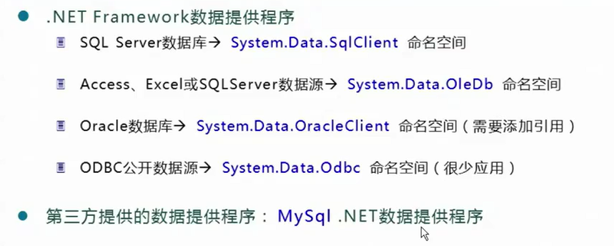
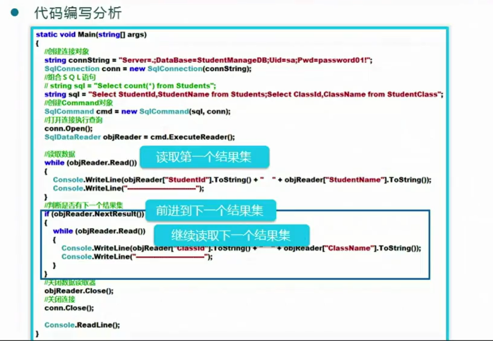

# 1、ADO.NET 数据访问技术

## ADO.NET 组件与数据库连接


ADO.NET并不是全新的，而是被移植的


ADO.NET的组件主要由两部分组成

下图中，注意双箭头和单箭头


Connection 对象：负责与数据源建立连接

Command 对象：负责对数据源执行命令，让数据源干什么

DataReader 对象：将服务器的端希望呈现的数据展示到客户端

DataAdapter 对象：也是将数据展示到客户端，但是有缓存


数据提供程序类型

访问不同的数据库(Oracle SQLserver等)要使用不同的类



这里只讲 SQLServer 和 C#项目连接


### 连接前的准备


sqlserver 配置管理器


网络端口号可改可不改看情况


修改后需要重启sqlserver的服务才能生效


正确连接的4个条件

1.服务器的ip地址

2.数据库名称

3.登录账号

4.登录密码


我们现在用的是sa，但是也可以创建新的用户

SQLServer 身份验证


## 4个对象

#### <font color=red size=6>1.Connection对象</font>


Data.SqlClient 的安装办法


命令行中输入 Install-Package System.Data.SqlClient


```
using System;
using System.Collections.Generic;
using System.Data;
using System.Linq;
using System.Text;
using System.Threading.Tasks;
using System.Data.SqlClient;
using ConnectwithSql;
using System.Collections;


namespace ConnectwithSql
{
     class Class1
    {
        static void Main(string[] args)
        {
            //使用用户名和密码的标准连接
            // 不要用上面的方式，要把 字符串内部每个参数写完整
            string connString = "Data Source=.;Initial Catalog=StudentManageDB;User id=sa;Password=asdjkl123; /*最后这个地方有分号*/  "; 
            //创建连接对象
            SqlConnection conn = new SqlConnection(connString);
            conn.Open();//打开连接
            if (ConnectionState.Open == conn.State)
            {
                Console.WriteLine("数据库打开完成");
            }
            conn.Close();//关闭连接
            if (ConnectionState.Closed == conn.State)
            {
                Console.WriteLine("数据库已经关闭");
            }
            
            //可信任连接
            string connString1 = "Data Source=.;Initial Catalog=StudentManageDB;Integrated Security=True";
            SqlConnection conn1 = new SqlConnection(connString1);
            conn.Open();//打开连接
            if (ConnectionState.Open == conn.State)
            {
                Console.WriteLine("数据库打开完成");
            }
            conn.Close();//关闭连接
            if (ConnectionState.Closed == conn.State)
            {
                Console.WriteLine("数据库已经关闭");
            }
        }
    }
}
```

SqlConnection 类继承了 Connection 类 ，用于连接SQLServer数据库


连接字符串，主要是转义字符的问题


如果是连接本地的那么就直接 Server = .


#### 2.Command对象


-1表示执行出问题了


##### ExecuteNonQuery()方法

增(insert)删(delete)改(update) 都是这个方法

添加实体


```
using System;
using System.Collections.Generic;
using System.Data;
using System.Linq;
using System.Text;
using System.Threading.Tasks;
using System.Data.SqlClient;
using ConnectwithSql;
using System.Collections;


namespace ConnectwithSql
{
    class Class1
    {
        static void Main(string[] args)
        {
            //使用用户名和密码的标准连接
            // 不要用上面的方式，要把 字符串内部每个参数写完整
            string connString = "Data Source=.;Initial Catalog=StudentManageDB;User id=sa;Password=asdjkl123;";
            //创建连接对象
            SqlConnection conn = new SqlConnection(connString);
            conn.Open();//打开连接

            string sql = "insert into Students(StudentName,Gender,Birthday,StudentIdNo,Age,Telephone,StudentAddress,ClassId)";
            sql += "values('{0}', '{1}','{2}','{3}','{4}', '{5}', '{6}', '{7}')"; //注意 {}外边都需要加上单引号，因为数据库执行的时候需要把这些值当成字符串的
            sql = string.Format(sql, "rzy", '男', "2003-04-06", "320206200304062818", 19, "18800563498", "无锡", 1);//格式化字符串的方式填入值
            //创建 Command 对象
            SqlCommand cmd = new SqlCommand(sql, conn);
            //执行插入操作
            int result = cmd.ExecuteNonQuery();
            conn.Close();
            if (result == 1) // ==1 是因为只操作了一行
            {
                Console.WriteLine("添加成功");
            }

        }
    }
}
```


注意：插入过程可能受到数据表中已经有的 外键约束  等约束影响导致不能插入


修改和删除实体

只需要把 sql语句修改成  update 和 delete 的就可以了


修改实体

```
using System;
using System.Collections.Generic;
using System.Data;
using System.Linq;
using System.Text;
using System.Threading.Tasks;
using System.Data.SqlClient;
using ConnectwithSql;
using System.Collections;

namespace ConnectwithSql
{
    class Class1
    {
        static void Main(string[] args)
        {
            //使用用户名和密码的标准连接
            // 不要用上面的方式，要把 字符串内部每个参数写完整
            string connString = "Data Source=.;Initial Catalog=StudentManageDB;User id=sa;Password=asdjkl123;";
            //创建连接对象
            SqlConnection conn = new SqlConnection(connString);
            conn.Open();//打开连接
            string sql = "update Students set Telephone = 15852829686 where StudentName = 'rzy'";
            SqlCommand cmd = new SqlCommand(sql, conn);
            cmd.ExecuteNonQuery();
            conn.Close();  
        }
    }
}
```


删除实体

```
using System;
using System.Collections.Generic;
using System.Data;
using System.Linq;
using System.Text;
using System.Threading.Tasks;
using System.Data.SqlClient;
using ConnectwithSql;
using System.Collections;


namespace ConnectwithSql
{
    class Class1
    {
        static void Main(string[] args)
        {
            //使用用户名和密码的标准连接
            // 不要用上面的方式，要把 字符串内部每个参数写完整
            string connString = "Data Source=.;Initial Catalog=StudentManageDB;User id=sa;Password=asdjkl123;";
            //创建连接对象
            SqlConnection conn = new SqlConnection(connString);
            conn.Open();//打开连接

            string sql = "delete from Students where studentName = 'rzy'";
            SqlCommand cmd = new SqlCommand(sql, conn);
            cmd.ExecuteNonQuery();
            conn.Close();
 
        }
    }
}
```


一次性执行多条 sql 语句

要执行的字符串内部放多条sql 语句即可，但是各个sql 语句之间要使用分号间隔


```
using System;
using System.Collections.Generic;
using System.Data;
using System.Linq;
using System.Text;
using System.Threading.Tasks;
using System.Data.SqlClient;
using ConnectwithSql;
using System.Collections;


namespace ConnectwithSql
{
    class Class1
    {
        static void Main(string[] args)
        {
            //使用用户名和密码的标准连接
            // 不要用上面的方式，要把 字符串内部每个参数写完整
            string connString = "Data Source=.;Initial Catalog=StudentManageDB;User id=sa;Password=asdjkl123;";
            //创建连接对象
            SqlConnection conn = new SqlConnection(connString);
            conn.Open();//打开连接
            StringBuilder sb = new StringBuilder();
            string sql1 = "insert into Students(StudentName,Gender,Birthday,StudentIdNo,Age,Telephone,StudentAddress,ClassId)";
            sql1 += "values('{0}', '{1}','{2}','{3}','{4}', '{5}', '{6}', '{7}')";
            sql1 = string.Format(sql1, "mzk", '男', "2002-01-03", "324564324433432818", 19, "65432456548", "japan", 1);//格式化字符串的方式填入值
           
            string sql2 = "insert into Students(StudentName,Gender,Birthday,StudentIdNo,Age,Telephone,StudentAddress,ClassId)";
            sql2 += "values('{0}', '{1}','{2}','{3}','{4}', '{5}', '{6}', '{7}')";
            sql2 = string.Format(sql2, "rzy", '男', "2003-04-06", "320206200304062818", 19, "18800563498", "无锡", 1);//格式化字符串的方式填入值
           
            string sql3 = "insert into Students(StudentName,Gender,Birthday,StudentIdNo,Age,Telephone,StudentAddress,ClassId)";
            sql3 += "values('{0}', '{1}','{2}','{3}','{4}', '{5}', '{6}', '{7}')";
            sql3 = string.Format(sql3, "r4y", '男', "2103-11-06", "324532134245324548", 20, "18213422498", "无3", 1);//格式化字符串的方式填入值
            //创建 Command 对象
            sb.Append(sql1);
            sb.Append(sql2);
            sb.Append(sql3);
            SqlCommand cmd = new SqlCommand(sb.ToString(), conn);
            //执行插入操作
            int result = cmd.ExecuteNonQuery();
            conn.Close();
            if (result == 1) // ==1 是因为只操作了一行
            {
                Console.WriteLine("添加成功");
            }

        }
    }
}
```


##### ExecuteScalar()方法


insert 的同时希望获得最近的那一次标识列的值，使用 select ，数据库会进行返回。

ExecuteScalar 方法可以同时执行 insert 和 select 语句


```
using System;
using System.Collections.Generic;
using System.Data;
using System.Linq;
using System.Text;
using System.Threading.Tasks;
using System.Data.SqlClient;
using ConnectwithSql;
using System.Collections;


namespace ConnectwithSql
{
    class Class1
    {
        static void Main(string[] args)
        {
            //使用用户名和密码的标准连接
            // 不要用上面的方式，要把 字符串内部每个参数写完整
            string connString = "Data Source=.;Initial Catalog=StudentManageDB;User id=sa;Password=asdjkl123;";
            //创建连接对象
            SqlConnection conn = new SqlConnection(connString);
            conn.Open();//打开连接
           
            string sql1 = "insert into Students(StudentName,Gender,Birthday,StudentIdNo,Age,Telephone,StudentAddress,ClassId)";
            sql1 += "values('{0}', '{1}','{2}','{3}','{4}', '{5}', '{6}', '{7}');select @@identity";
            sql1 = string.Format(sql1, "mzk", '男', "2002-01-03", "314523443343281811", 19, "65432456548", "japan", 1);//格式化字符串的方式填入值
            SqlCommand cmd = new SqlCommand(sql1, conn);

            //执行插入操作
            int result =  Convert.ToInt32(cmd.ExecuteScalar());
            conn.Close();
            Console.WriteLine(result);

        }
    }
}
```


##### Command 对象用于查询的语句

<font color=red size=5>1.查询返回结果为 **单行 单列**的</font>

比如 


ADO.NET实现方式


```
namespace ConnectwithSql
{
    class Class1
    {
        static void Main(string[] args)
        {
            //使用用户名和密码的标准连接
            // 不要用上面的方式，要把 字符串内部每个参数写完整
            string connString = "Data Source=.;Initial Catalog=StudentManageDB;User id=sa;Password=asdjkl123;";
            //创建连接对象
            SqlConnection conn = new SqlConnection(connString);
            conn.Open();//打开连接
            string sql = "select count(*) from Students";
            SqlCommand cmd = new SqlCommand(sql,conn);
            //执行插入操作
            object obj = cmd.ExecuteScalar();
            conn.Close();
            Console.WriteLine(obj.ToString());
        }
    }
}
```


```

namespace ConnectwithSql
{
    class Class1
    {
        static void Main(string[] args)
        {
            //使用用户名和密码的标准连接
            // 不要用上面的方式，要把 字符串内部每个参数写完整
       	    string connString = "Data Source=.;Initial Catalog=StudentManageDB;User id=sa;Password=asdjkl123;";
            //创建连接对象
            SqlConnection conn = new SqlConnection(connString);
            conn.Open();//打开连接
            string sql = "select telephone from Students where studentname = 'rzy'"; 
            SqlCommand cmd = new SqlCommand(sql,conn);    
            //执行插入操作
            object obj = cmd.ExecuteScalar();
            conn.Close();
            Console.WriteLine(obj.ToString());
        }
    }
}
```


<font color=red size=5>2.**返回单个结果集的查询**</font>

返回多行多列的结果，结果集存储了其结果，再进行读取

使用 executereader()方法


DataReader 是读取器，ExecuteReader() 返回该读取器对象


DataReader 工作流程

1. 服务器端收到客户端发送来的查询指令后，查询相关的数据形成 一张虚拟表，虚拟表存储在数据库服务器的内存中。
2. Connection对象建立
3. DataReader 从虚拟表中一行一行循环判断(会返回一 bool 值)数据有没有读完，并且获取读取到的数据
4. 关闭 DataReader，关闭 Connection


SqlDataReader 对象继承自 DataReader 

SqlDataReader对象[''数据表的列名'']获取当前 DataReader 读取的行的该列名的值。这个数据表的列名必须出现在上面写过的 sql 语句中

```

namespace ConnectwithSql
{
    class Class1
    {
        static void Main(string[] args)
        {
            //使用用户名和密码的标准连接
            // 不要用上面的方式，要把 字符串内部每个参数写完整
            string connString = "Data Source=.;Initial Catalog=StudentManageDB;User id=sa;Password=asdjkl123;";
            //创建连接对象
            SqlConnection conn = new SqlConnection(connString);
            conn.Open();//打开连接
            string sql = "select * from Students";
            SqlCommand cmd = new SqlCommand(sql, conn);
            SqlDataReader sdr =  cmd.ExecuteReader();
            while (sdr.Read())
            {
                Console.WriteLine(sdr["StudentName"] + "\t" + sdr["Gender"] + "\t" + sdr["telephone"]);
            }


        }
    }
}
```

<font color=red size=5>3.返回多个结果集的查询</font>


C#里面的sql语句可以写多个 select 查询，彼此用分号分割


DataReader 类提供了 NextResult()方法，可让读取器从当前结果集的读取跳到下一个结果集的读取



```
class Class1
    {
        static void Main(string[] args)
        {
            //使用用户名和密码的标准连接
            // 不要用上面的方式，要把 字符串内部每个参数写完整
            string connString = "Data Source=.;Initial Catalog=StudentManageDB;User id=sa;Password=asdjkl123;";
            //创建连接对象
            SqlConnection conn = new SqlConnection(connString);
            conn.Open();//打开连接
            StringBuilder sb = new StringBuilder();
            string sql1 = "select * from Students";
            string sql2 = "select * from StudentClass";
            sb.Append(sql1);
            sb.Append(";");
            sb.Append(sql2);
            SqlCommand cmd = new SqlCommand(sb.ToString(), conn);
            SqlDataReader sdr =  cmd.ExecuteReader();
            while (sdr.Read())
            {
                Console.WriteLine(sdr["StudentName"] + "\t" + sdr["Gender"] + "\t" + sdr["telephone"]);
            }
            if (sdr.NextResult())//判断有没有下一个结果集
            {
                while (sdr.Read())
                {
                    Console.WriteLine(sdr["ClassId"] + "\t" + sdr["ClassName"]);
                }
            }
        }
    }
```


##### 总结


# 2、基于 oop 原则优化数据访问

## 通用数据访问类的使用

代码复用，减少重复


结果：


Program 是程序入口，SQLHelper 是按照oop思想封装成的工具

```
using System;
using System.Collections.Generic;
using System.Linq;
using System.Text;
using System.Threading.Tasks;
using System.Data;
using System.Data.SqlClient;
namespace ConnectwithSql
{
     class SQLHelper //工具类
    {
        private static string connString = "Data Source=.;Initial Catalog=StudentManageDB;User id=sa;Password=asdjkl123;  ";

        public static SqlConnection createConnection()
        {
            SqlConnection conn = new SqlConnection(connString);
            conn.Open();
            return conn;
        }
        
        /// <summary>
        /// 单一结果查询
        /// </summary>
        /// <param name="sql">要执行的sql语句</param>
        /// <returns>返回object类型的结果</returns>
        public static object GetSingleResult(string sql)
        {
            SqlConnection conn = createConnection();
            SqlCommand sc = new SqlCommand(sql, conn);
            object result = sc.ExecuteScalar();
            conn.Close();
            return result;
        }
        /// <summary>
        ///可以执行 insert update delete
        /// </summary>
        /// <param name="sql">要执行的sql，可以多条sql语句</param>
        /// <returns>返回结果为影响的行数</returns>
        public static int Update(string sql)
        {
            SqlConnection conn = createConnection();
            SqlCommand sc = new SqlCommand(sql, conn);
            int result = sc.ExecuteNonQuery();
            conn.Close();
            return result;
        }
        /// <summary>
        /// 执行查询语句
        /// </summary>
        /// <param name="sql">查询的sql语句，可以多条</param>
        /// <returns>返回查询的结果集</returns>
        public static SqlDataReader GetDataReader(string sql)
        {
            SqlConnection conn = createConnection();
            SqlCommand sc1 = new SqlCommand(sql,conn);
            return sc1.ExecuteReader(CommandBehavior.CloseConnection); //ExecuteReader里面的参数用于实现关闭DataReader的同时也关闭 Connection
        }
    }
}
```


## **基于对象职责明确原则优化程序**

<font color=red size=5>应用软件如何做到界面(前台展示)与程序(后台代码)的分离</font>


当前程序，**前台代码和后台代码是混在一起的**


解决 前台后台代码混合在一起的办法，把数据访问代码单独抠出来生成一个新的类


DAL层在项目中作为数据(库)访问层，用于对数据库发布命令，StudentService 作为数据访问类


前台展示代码只保留 数据展示 和 部分业务

```
namespace ConnectwithSql
{
    class StudentService
    {
        public int AddStudnet(string studentname,string gender,string birthday,string studentidno,int age,
                                string telephone,string studentaddress ,int classid)
        {
            string sql = "insert into Students(StudentName,Gender,Birthday,StudentIdNo,Age,Telephone,StudentAddress,ClassId)";
            sql += "values('{0}','{1}','{2}','{3}','{4}','{5}','{6}','{7}')";
            sql = string.Format(sql,studentname,gender,birthday,studentidno,age,telephone,studentaddress,classid);
            return SQLHelper.Update(sql);
        }
        
    }
}
```

前台代码编写:


### 实践


依赖项添加之前写的项目引用


注意，如果希望一个类能够被跨项目使用，这个类要用 public 修饰。然后在想要使用的那个类中引入命名空间


后台代码

```
namespace ConnectwithSql
{
    public class StudentService
    {
        public int AddStudnet(string studentname,string gender,string birthday,string studentidno,int age,
                                string telephone,string studentaddress ,int classid)
        {
            string sql = "insert into Students(StudentName,Gender,Birthday,StudentIdNo,Age,Telephone,StudentAddress,ClassId)";
            sql += "values('{0}','{1}','{2}','{3}','{4}','{5}','{6}','{7}')";
            sql = string.Format(sql,studentname,gender,birthday,studentidno,age,telephone,studentaddress,classid);
            return SQLHelper.Update(sql);
        }
        public int GetStuIntCountByClassId(string classid)
        {
            string sql = "select count(*) from  students where classid=" + classid;
            return Convert.ToInt32(SQLHelper.GetSingleResult(sql));
        }

    }

}
```

前台代码

引入命名空间


```
private void btn_getcount_Click(object sender, EventArgs e)
        {
            StudentService sc = new StudentService();
            int class1count = sc.GetStuIntCountByClassId("1");
            MessageBox.Show("人数为" + class1count);
        }
```


### 总结


**界面(前台)的程序中不能出现任何 SQL 语句**


## 实体类在开发中的应用

方法调用的方法参数太多了


### 实体类的设计

- 实体类就是对应了数据表的列名
- 实体类对象就是对应了数据表的一行
- c#中的**数据类型** 和 数据库的**数据类型**能够实现映射关系
- c#中实体类的属性名应该和数据表中的列名一致


```
class Student{
	public int StudentId{get;set;}
	public string StudentName{get;set;}
	public string Gender {get;set;}
	public DateTime Birthday{get;set;}
	public decimal StudentIdNo{get;set;}
	public int Age{get;set;}
	public string Telephone{get;set;}
	public string StudentAddress{get;set;}
	public int ClassId{get;set;}
}
```

后台代码


```
 public int AddStudent(Student objStudent)
        {
            string sql = "insert into Students(StudentName,Gender,Birthday,StudentIdNo,Age,Telephone,StudentAddress,ClassId)";
            sql += "values('{0}','{1}','{2}','{3}','{4}','{5}','{6}','{7}')";
            sql = string.Format(sql,objStudent.StudentName,objStudent.Gender,objStudent.Birthday,objStudent.StudentIdNo,objStudent.Age,objStudent.Telephone,objStudent.StudentAddress,objStudent.ClassId);
            return SQLHelper.Update(sql);
        }
```

前台调用方法的改进


```
static void Main(){
	Student objStudent = new Student();
	Console.WriteLine("请输入学员姓名");
	objStudent.StudentName = Console.ReadLine();
	
	Console.WriteLine("请输入学员性别");
	objStudent.Gender = Console.ReadLine();
    
	Console.WriteLine("请输入学员出生日期");
	objStudent.Birthday =Convert.ToDateTime(Console.ReadLine());
    
	Console.WriteLine("请输入学员身份证号");
	objStudent.StudentIdNo = Convert.ToDecimal(Console.ReadLine());
    
	Console.WriteLine("请输入学员年龄");
	objStudent.Age = Convert.ToInt32(Console.ReadLine());
    
    Console.WriteLine("请输入学员电话");
	objStudent.Telephone = Console.ReadLine();	
	Console.WriteLine("请输入学员地址");
	objStudent.StudentAddress = Console.ReadLine();	
	Console.WriteLine("请输入学员班级编号");
	objStudent.ClassId = Console.ReadLine();
    StudentService objStuService = new StudentService();
    int result = objStuService.AddStudent(objStudent);
    if(result ==1)
    	Console.WriteLine("成功添加一个学员对象");
}
```


### 具体操作

实体层

```
namespace ConnectwithSql
{
    public class Student
    {
        public int StudentId { get; set; }
        public string StudentName { get; set; }
        public string Gender { get; set; }
        public DateTime Birthday { get; set; }
        public decimal StudentIdNo { get; set; }
        public int Age { get; set; }
        public string Telephone { get; set; }
        public string StudentAddress { get; set; }
        public int ClassId { get; set; }
    }
}

```


数据层

```
namespace ConnectwithSql
{
    public class StudentService
    {
    // AddStudent 方法
        public int AddStudent(Student objStudent)
        {
            string sql = "insert into Students(StudentName,Gender,Birthday,StudentIdNo,Age,Telephone,StudentAddress,ClassId)";
            sql += "values('{0}','{1}','{2}','{3}','{4}','{5}','{6}','{7}')";
            sql = string.Format(sql, objStudent.StudentName, objStudent.Gender, objStudent.Birthday, objStudent.StudentIdNo, objStudent.Age, objStudent.Telephone, objStudent.StudentAddress, objStudent.ClassId);
            return SQLHelper.Update(sql);
        }
        
        // 没有优化前的 AddStudent方法,AddStudent 参数列表很长很麻烦
        //public int AddStudnet(string studentname,string gender,string birthday,string studentidno,int age,
        //                        string telephone,string studentaddress ,int classid)
        //{
          //  string sql = "insert into //Students(StudentName,Gender,Birthday,StudentIdNo,Age,Telephone,StudentAddress,ClassId)";
  //          sql += "values('{0}','{1}','{2}','{3}','{4}','{5}','{6}','{7}')";
    //        sql = //string.Format(sql,studentname,gender,birthday,studentidno,age,telephone,studentaddress,classid);
  //          return SQLHelper.Update(sql);
    //    }
        
        
        
        
        
        
        
        public int GetStuIntCountByClassId(string classid)
        {
            string sql = "select count(*) from  students where classid=" + classid;
            return Convert.ToInt32(SQLHelper.GetSingleResult(sql));
        }

    }
}

```


前台代码,程序入口

```
namespace ConnectwithSql
{
    class Program
    {
        static void Main()
        {
            Student objStudent = new Student();
            Console.WriteLine("请输入学员姓名");
            objStudent.StudentName = Console.ReadLine();

            Console.WriteLine("请输入学员性别");
            objStudent.Gender = Console.ReadLine();

            Console.WriteLine("请输入学员出生日期");
            objStudent.Birthday = Convert.ToDateTime(Console.ReadLine());

            Console.WriteLine("请输入学员身份证号");
            objStudent.StudentIdNo = Convert.ToDecimal(Console.ReadLine());

            Console.WriteLine("请输入学员年龄");
            objStudent.Age = Convert.ToInt32(Console.ReadLine());

            Console.WriteLine("请输入学员电话");
            objStudent.Telephone = Console.ReadLine();
            Console.WriteLine("请输入学员地址");
            objStudent.StudentAddress = Console.ReadLine();
            Console.WriteLine("请输入学员班级编号");
            objStudent.ClassId = Convert.ToInt32(Console.ReadLine());
            StudentService objStuService = new StudentService();
            int result = objStuService.AddStudent(objStudent);
            if (result == 1)
                Console.WriteLine("成功添加一个学员对象");
        }
    }
}

```


### 实体类总结1


# 3、数据查询与对象封装

## **实体封装单一对象**，用于数据传递

后台代码方法直接返回一个已经对属性进行赋值的对象给前台


这里后台把数据库中的数据封装成对象的方式也可以用对象初始化器

在前台代码直接解析对象即可


```
StudentService类中的方法
public Student GetStudentById(string studentId)
        {
            string sql = "select StudentName,Gender," +
                "Birthday,StudentIdNo,StudentAddress from Students where StudentId = {0}";
            sql = string.Format(sql, studentId);
            //执行查询
            SqlDataReader objReader = SQLHelper.GetDataReader(sql);
            //读取数据并封装对象
            Student objStu = null;
            if (objReader.Read())
            {
                objStu = new Student();
                objStu.StudentName = objReader["StudentName"].ToString();
                objStu.Gender = objReader["Gender"].ToString();
                objStu.Birthday = Convert.ToDateTime(objReader["Birthday"].ToString());
                objStu.StudentIdNo = Convert.ToDecimal(objReader["StudentIdNo"]);
                objStu.StudentAddress = objReader["StudentAddress"].ToString();
            }
            objReader.Close();
            return objStu;

        }
     //前台代码   
        static void Main()
        {
            StudentService objStuService = new StudentService();
            Student objStudent = objStuService.GetStudentById("10089");

            //解析对现象
            Console.WriteLine(objStudent.StudentName + " " + objStudent.Birthday.ToShortDateString() + " " + objStudent.StudentIdNo);
        }
```


对象的传递实现了前台和后台的解耦合


<font color=red size=5>**后台封装对象，前台解析对象** 的意义</font>


### 实体类总结2


实体类是数据传递的载体，用于封装和解析数据


## **使用List集合封装多个同类型对象**


<font color=red size=5>List 泛型集合是对象最好的容器</font>


```
// 后台 StudentService 中的方法
public List<Student> GetAllStudents(){
	string sql = "select StudentName,Gender,"+
		"Birthday,StudentIdNo,StudentAddress from Students";
	SqlDataReader objReader = SQLHelper.GetDataReader(sql);	
	//泛型集合对象接收多个实体Student对象
	List<Student> stuList = new List<Student>();
	while(objReader.Read()){
		Student objStu = new Student();
         objStu.StudentName = objReader["StudentName"].ToString();
         objStu.Gender = objReader["Gender"].ToString();
         objStu.Birthday = Convert.ToDateTime(objReader["Birthday"].ToString());
         objStu.StudentIdNo = Convert.ToDecimal(objReader["StudentIdNo"]);
         objStu.StudentAddress = objReader["StudentAddress"].ToString();
        
        stuList.Add(objStu);
	}
	objReader.Close();
	return stuList;
	
}
//前端
static void Main(string [] args){
	StudentService objStuService = new StudentService();
	List<Student> list = objStuService.GetAllStudents();
	
	if(list.Count!=0) //避免传过来的列表是空列表
    {
    	foreach(Student item in list){
    		Console.WriteLine(item.StudentName + " " + item.Birthday.ToShortDateString() + " " + item.StudentIdNo);
    		Console.WriteLine("-------------------------------------------------");
    	}
    } else Console.WriteLine("没有要显示的数据");
}
```


## **组合扩展实体的应用**


遇到的问题是：如果返回的查询结果是多表查询的结果怎么办，多表查询就意味着有多个实体

就需要把 数据表在 c#语言中的类的映射组合在一起，组合成一个新的类


```
// 组合类 StudentExt 放在 实体类的模块中
public class StudentExt
    {
        public StudentExt()
        {
        // 这里并没有在构造器内部写初始化对象的语句
        }
        public Student ObjStudent { get; set; }
        public StudentClass ObjClass { get; set; }
        public ScoreList ObjScore { get; set; }

    }


//StudentServcie 后台代码
public List<StudentExt> GetStudentExt()
        {

            string sql = "Select Students.StudentId,StudentName,";
            sql+="ClassName,CSharp,SQLServer from Students ";
	        sql+="inner join StudentClass on Students.ClassId = StudentClass.ClassId ";
	        sql+="inner join ScoreList on Students.StudentId=ScoreList.StudentId";
	        //执行查询并封装
	        SqlDataReader objReader = SQLHelper.GetDataReader(sql);
            List<StudentExt> extList = new List<StudentExt>();
	
	        while(objReader.Read()){
		        StudentExt ext = new StudentExt();
                ext.ObjStudent = new Student()
                {
                    StudentId = Convert.ToInt32(objReader["StudentId"]),
                    StudentName = objReader["StudentName"].ToString()
                 };
                ext.ObjClass =new StudentClass()
                {
                    ClassName = objReader["ClassName"].ToString(),
                };
                ext.ObjScore = new ScoreList()
                {
                     Csharp = Convert.ToInt32(objReader["Csharp"]),
                    SQLServerDB = Convert.ToInt32(objReader["SQLServer"])

                };
                extList.Add(ext);	
	        }
             objReader.Close();
	        return extList;
        }
        
//前台展示


		static void Main()
        {
            StudentService objStuService = new StudentService();
            List<StudentExt> list = objStuService.GetStudentExt();
            foreach (StudentExt item in list)
            {
                Console.WriteLine(item.ObjStudent.StudentName + " "
                + item.ObjStudent.StudentId + " "
                + item.ObjClass.ClassName + " "
                + item.ObjScore.Csharp + " "
                + item.ObjScore.SQLServerDB);
                Console.WriteLine("---------------------------------------");
            }
        }
```


## 简单扩展实体的应用

如果查询的内容并不算多，通过继承，继承并创建新的属性


封装简单实体


## 面向对象查询总结


# 附:连接时出现错误总结

## 无法与数据库连接


## 连接字符串时的问题


## 


