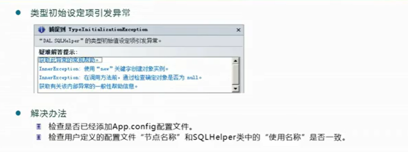
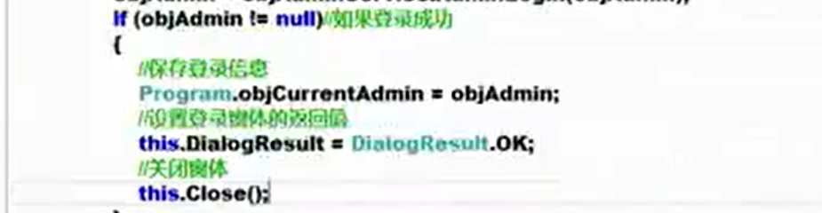
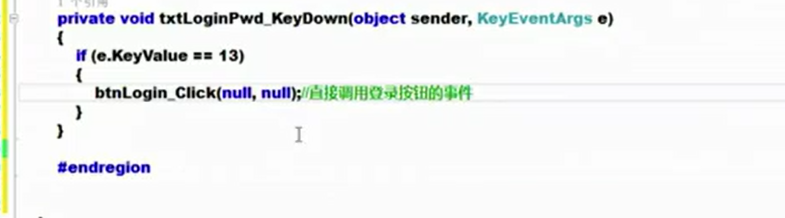
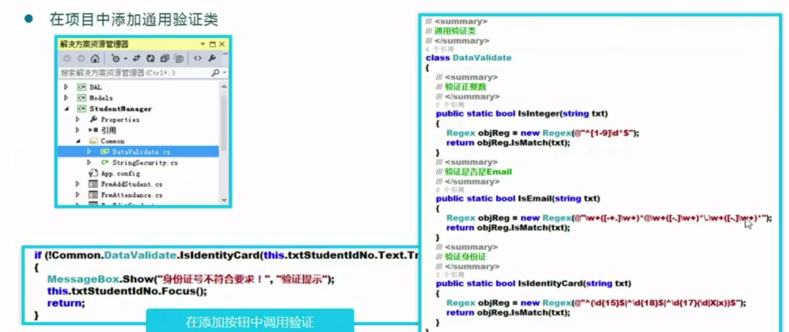
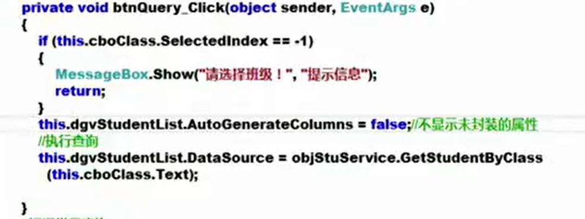
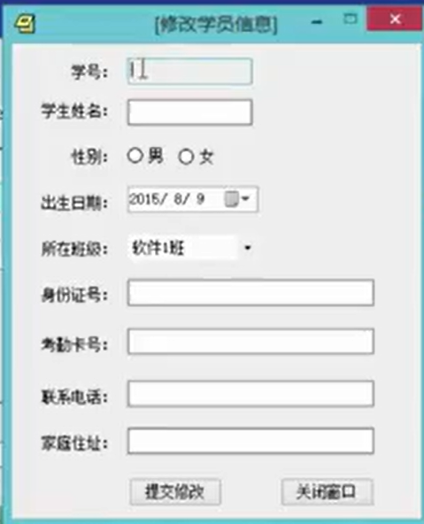
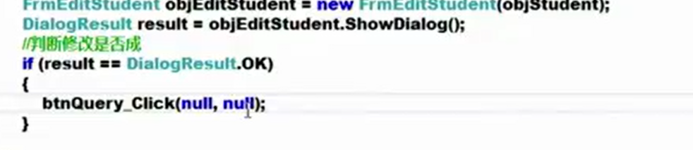
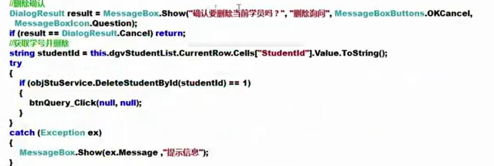

# 基于oop设计项目的基本方法


# 模块封装与程序集

## 程序模块的封装

回顾之前计算器设计的问题


计算器类的实现


面向对象最基本的要求：按照需要设计类，并且在适时创建对象并使用这个类

面向对象希望程序具有可扩展可维护性


每个人写不同的模块，然后把模块组装在一起，这样软件的实现就是基于模块，模块也就是类库，类库是模块的一种类型


如何添加类库


这个类库可以添加我们所需要的全部类


类库里的被如果希望这个类被其他地方，就加public，如果不加 public 就是 internal，只能在这个程序集(这个模块)的内部使用


实际操作


选择类库


在这个类库中可以编写多个类


这个类库中的类编写完后，让这个项目进行 生成，就能生成 dll 文件


在 文件夹中找到该类库 dll 文件


在希望引入该类库的项目中进行添加引用


成功引入


如果想要使用还需要引入命名空间


dll  动态链接库


这个dll 文件只限定于 .Net 平台生成的 dll 文件


模块封装的应用


## **.NET中的程序集**

.Net Core 项目里的Assemblyinfo.cs 文件找不到了


程序集信息修改


这些信息可以通过右键项目属性可视化的方式进行更改

右键项目属性


命名空间和程序集(项目)的关系

相同的命名空间可以分布在不同的程序集里面。通常会有一个顶级的命名空间


## **多语言编程原理**


CalDLLVB 类


Csharp项目中添加 VB引用


依旧引入命名空间


Csharp 和 VB可以混编

### 多语言编程原理


原理分析


# 学生管理系统项目

## 主窗体UI


## 项目框架设计实践

### **搭建学员管理系统框架**

回顾类库好处


小型项目，通常用两层项目框架实现


- UI，就是用户交互的窗体，这是表示层
- Models，数据访问层，存储一大堆数据访问类(实体类)
- DAL层，用于和数据库交互，这是交互层


<font color=red size=5>创建项目结构层次</font>

创建窗体项目 StudentManager，两个类库： DAL Models 


添加引用，建立关联：DAL添加对Models的引用。StudentManager添加对Models 和 DAL的引用


如果此时你能够成功生成解决方案，那么到这里位置是ok的


<font color=red size=5>UI界面设计</font>


<font color=red size=5>设计实体类</font>

添加实体类，取决于具体的需要，取决于你当前项目要访问的数据库


根据数据表添加实体类

Admins 变成 SysAdmin 类

Students 变成 Student 类

StudentClass 变成 StudentClass 类

ScoreList 变成 ScoreList 类


类具有哪些属性对照数据表的列名

```
public class SysAdmin{
	
}
```


数据库实体类和c#中的数据访问类是一一对应的

扩展实体在需要用的时候再加


<font color=red size=5>设计数据访问类</font>

数据访问类(DAL层)和实体类(Models层)一般有对应关系


数据访问类访问修饰符全部是public


### **数据库连接的安全保障**

SQLHelper类的编写


SQLHelper 通常创建一个文件夹来放入这个类

如果就在这个文件夹结构内部添加，那么命名空间会更改，变得和别的命名空间不同，就需要单独引入。

通常都是在外部创建然后再引入该文件夹，保持命名空间和别的一致


写之前记得添加包 SqlClient


问题：如果改密码了，但是csharp中字符串，我们希望其是可变的动态的。


方法：使用配置文件


修改配置文件是很方便的


必须只能在UI层添加配置文件，并且在根目录，而且名字不可以更改，就使用默认的 App.config 


使用 connectionStrings 结点


依照 路径字符串属性，字符串名，字符串内容来写 add 结点的name 属性和 connectionString 属性

private static string connString = "Data Source=.;Initial Catalog=StudentManageDB;User id=sa;Password=asdjkl123; ";


```
<?xml version="1.0" encoding="utf-8" ?>
<configuration>
	<connectionStrings>
					//这里写
		<add name ="connString" connectionString="Data Source=.;Initial Catalog=StudentManageDB;User id=sa;Password=asdjkl123; "/>
	</connectionStrings>
</configuration>
```


在DAL层中，需要使用配置文件的地方引入命名空间   using System.Configuration; 用于读取配置文件

要引入这个包 Configuration Manager


```
																			//name属性的名字
private static string connString = ConfigurationManager.ConnectionStrings["connString"].ToString();
```





reaonly 和 const 属性


这就是刚才写的 config 文件


UI层下的字符串加密类


## 用户登录逻辑与实现

### 显示登录窗体


用户登录逻辑


```
Program.cs //程序入口

static void Main()
        {
            // To customize application configuration such as set high DPI settings or default font,
            // see https://aka.ms/applicationconfiguration.
            ApplicationConfiguration.Initialize();


            //创建登录窗体
            FrmUserLogin objFrmLogin = new FrmUserLogin();
            DialogResult result = objFrmLogin.ShowDialog();//ShowDialog 方法 模态显示，模态窗体不允许操作其他窗体，该模态窗体弹出后组织调用窗口的所有消息响应。只有在弹出窗口结束后调用窗口才能继续
            //ShowDialog 方法返回DialogResult 类型的值，是枚举类型

            //根据 result 值判断登录是否成功
            if (result == DialogResult.OK)  // 如果我们在登录窗体直接右上角退出 ，result 不等于 DialogResult.OK

            {
                Application.Run(new Form1());
            }
            //不ok 就表示不想登录，整个程序退出
            else
            {
                Application.Exit();//退出整个程序
            }
            
        }
```


该UI界面


### **登录后台方法编写**


DAL(与数据库的交互层)层中的SysAdminService类 中的AdminLogin 方法，作用是根据前台输入的账号和密码在数据库中查找是否有该用户


```
SysAdminService 类中
public SysAdmin AdminLogin(SysAdmin objAdmin){
	//组合SQL语句
	string sql = "select AdminName from Admins where Loginid=‘{0}’ and LoginPwd = '{1}'";
	sql = string.Format(sql,objAdmin.LoginId,objAdmin.LoginPwd);
	//从数据库中查询
	SqlDataReader objReader = SQLHelper.GetReader(sql);
	if(objReader.Read()){
		objAdmin.AdminName = objReader["AdminName"].ToString();
	}
	else
	{
		objAdmin = null;//如果登录不成功，将当前对象清空
	}
	objReader.Close();
	//返回结果
	return objAdmin;
}
```


### 登录窗体中的事件处理


```
SysAdmin objAdmin = new SysAdmin(){
	LoginId = this.ToInt32(this.txtusername.Text.Trim());
	LoginPwd = this.txtpassword.Text.Trim();
}
// [3] 和后台交互判断登录信息是否正确
try{
	objAdmin = objAdminService.AdminLogin(objAdmin);
	if(objAdmin !=null){
		// 如果登录成功了
		//保存登录 信息，Program.cs 程序入口类设置全局变量保存当前正在上机的用户信息
	}
	else{
		MessageBox.Show("登录账号不存在或密码错误","登录提示");
	}
} catch(Exception ex){
	MessageBox.Show("数据访问出现异常!","登录提示");
}
```





输入回车自动使下一个输入框获取焦点





登录窗体和事件成品


Program.cs 中的全局变量，保存登录的用户信息


```
//UI界面的事件
private void btnLogin_Click(object sender, EventArgs e)
        {
            // [1] 数据验证
            if (this.txtusername.Text.Trim().Length == 0)
            {
                MessageBox.Show("请输入登录账号！", "登录提示");
                this.txtusername.Focus();//用户名输入框获取焦点
                return;
            }
            if (this.txtpassword.Text.Trim().Length == 0)
            {
                MessageBox.Show("请输入密码!","登录提示");
                this.txtpassword.Focus();
                return;
            }
            // [2] 封装对象
            SysAdmin objAdmin = new SysAdmin()
            {
                LoginId = this.txtusername.Text.Trim(),
                LoginPwd = this.txtpassword.Text.Trim()
            };
            SysAdminService objAdminService = new SysAdminService();
            // [3] 和后台交互判断登录信息是否正确
            try
            {
                objAdmin = objAdminService.AdminLogin(objAdmin);
                if (objAdmin != null)
                {
                    // 如果登录成功了
                    //保存登录 信息，Program.cs 程序入口类设置全局变量保存当前正在上机的用户信息
                    Program.objCurrentAdmin = objAdmin;

                    //设置登录窗体的返回值
                    this.DialogResult = DialogResult.OK;
                    //关闭当前登录窗体(关闭 FrmUserLogin)
                    this.Close();
                }
                else
                {
                    MessageBox.Show("登录账号不存在或密码错误", "登录提示");
                }
            }
            catch (Exception ex)
            {
                MessageBox.Show("数据访问出现异常!", "登录提示");
            }

        }

        private void btnExit_Click(object sender, EventArgs e)
        {
            this.Close();
        }

        private void txtusername_KeyDown(object sender, KeyEventArgs e)
        {
            if(e.KeyCode == Keys.Enter)//如果用户选中当前组件并且按下回车
            {
                if(this.txtusername.Text.Trim().Length!= 0)//用户已经在这个框里面输入了一些东西
                {
                    this.txtpassword.Focus();//当前焦点移动到密码框
                }
            }
        }

        private void txtpassword_KeyDown(object sender, KeyEventArgs e)
        {
            if(e.KeyCode == Keys.Enter)
            {
                btnLogin_Click(null, null);
            }
        }
```


### **通用验证类的设计和程序退出**


使用正则表达式




### 避免开启多个同一个窗体


设置一个静态成员变量，如果不为空说明已经有一个这种窗体被打开了，那就把它激活


将该窗体关闭的同时，也需要把这个静态成员变量置空


不要使用 showdialog() 如果使用showdialog()，该窗体关闭前都不能操作其他窗体


## 基于oop实现系统功能

### 下拉框的数据绑定

先获取数据源(从DAL层中获取，StudentClassService类负责和数据库交互)


```
public List<StudentClass> GetAllClasses(){
	string sql = "select ClassName,ClassId from StudentClass";
	SqlDataReader objReader = SQLHelper.GetReader(sql);
	List<StudentClass> list = new List<StudentClass>();
	while(objReader.Reader()){
		list.Add({
			ClassId = Convert.ToInt32(objReader["ClassId"]);
			ClassName = objReader["ClassName"].ToString();
		});
	}
	objReader.Close();
	return list;
}
```


使用数据源对下拉框的初始化需要在窗口初始化完成后立刻就完成(在窗口构造器中)


### **添加学员对象后台数据访问方法的实现**

- 把用户输入的数据封装到对象里面

- 封装之前要进行验证

  身份证号格式是否符合可以不依靠数据库实现(正则表达式)

  身份证号是否已经存在要靠遍历数据库中的id号来进行判断

  

- 把封装的对象传递到DAL层，DAL层负责和数据库交互，向数据库发送命令

  StudentService类

  

  ```
  stringBuilder sqlBuilder = new StringBuilder();
  sqlBuilder.Append("insert into Students(StudentName,Gender,Birthday,StudentIdNo,Age,Telephone,StudentAddress,CardId,ClassId)");
  sqlBuilder.Append("values('{0}','{1}','{2}',{3},{4},'{5}','{6}','{7}',{8})); //凡是数据库中是字符串数据类型的都需要加引号
  string sql = string.Format(sqlBuilder.ToString(),objstu.StudentName,objstu.Gender,objstu.Birthday,objstu.StudentIdNo,objstu.Age,objstu.Telephone,objstu.StudentAddress,objstu.CardId,objstu.ClassId);
  ```

  


### 添加学员对象ui实现


点击确认按钮后先进行一系列验证，然后添加对象


开始封装数据


### 按照班级查询学员对象


FrmMain 窗口中通过按钮打开这个窗口


下拉框数据初始化


设置扩展类，通过继承的方式扩展(StudentExt类)


目前的扩展实体只有ClassName


StudentService类中的方法，按照班级名称查找学员


FrmStuManager 查询按钮添加





### **根据学号查询学员对象详细信息**


后台代码


前台UI代码


这里会生成新的窗体FrmStudentInfo窗体构造器，展示数据


FrmMain 主窗体类中通常添加其他子窗体的作为静态成员，关闭后再释放位Null。


### **修改学员信息**

窗口样式



StudentService类中

修改学员对象方法


修改学员时判断是否和其他学员重复


前台UI代码


FrmEditStudent 窗口

展示该窗口的时候应该显示该窗口曾经的数据


FrmEditStudentUI代码

点击修改按钮后


提交后台


FrmStudentManage中，如果收到了 FrmEdit 中传来的修改成功的消息，就对页面进行刷新，这里使用的刷新的方法是再进行一次查询(这种只适合查询数据量小的语句)




#### 改善用户体验

右键菜单设计

设置右键会弹出来什么菜单。DataGridView中的contextMenuStrip属性指定你要哪个 ContextMenuStrip组件作为右键菜单


给DataView 添加单元格双击事件。

CellDoubleClick事件


就是调用了点击查询按钮的方法


### 删除学员

后台代码

外键异常返回错误号 547


前台代码UI




