# 体育彩票选号器


本项目使用 winform 架构

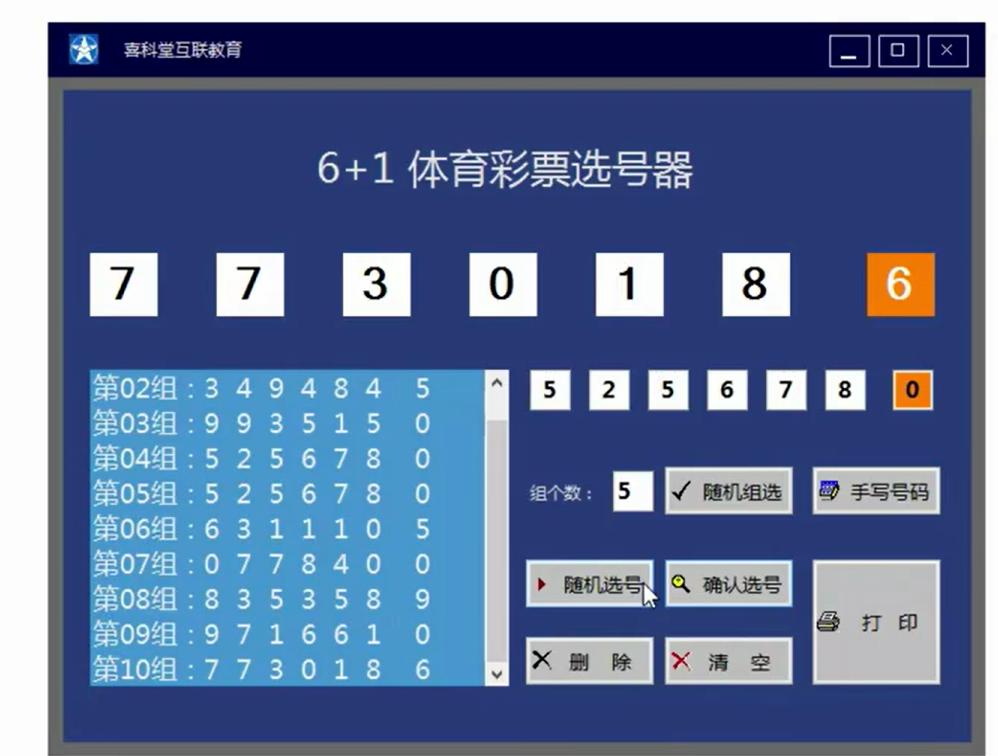


打印结果

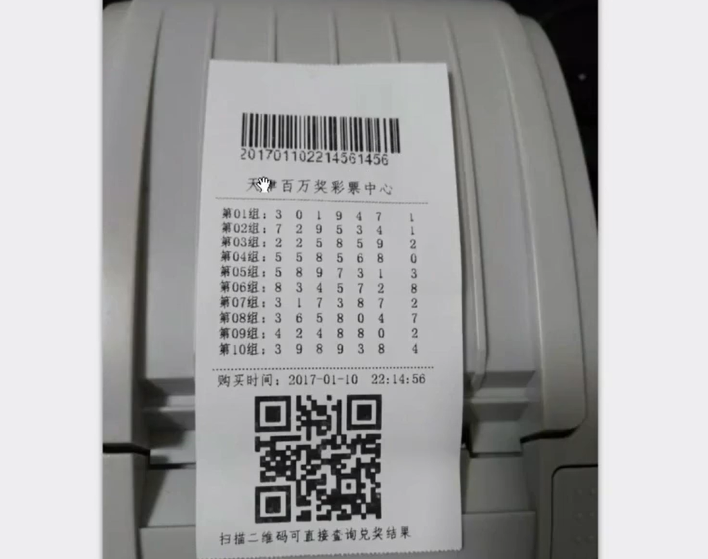

## UI设计

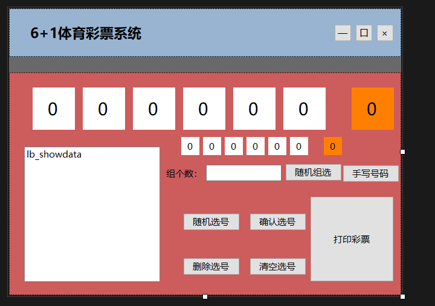

注：

1. 用到的控件有 按钮 标签 textbox listbox   label容器 ，  组件有 Timer 定时器

2. **这个窗体去掉了边框，导致不能够移动窗体**。 最大化，最小化，退出都是用按钮实现的

3. 窗体内有两个 panel ，分别填充了 窗体的上面和下面，靠 Dock 属性

   


## 后台代码

类：Selector 选择器类  Programs 类 程序入口，以及窗体类

Selector 类放在Models 文件夹中

```
 public class Selector
    {
        // 选择的号码 每一组都会存储起来作为字符串数组
        public List<string[]> SelectedNumbers{ get;set; }
        private Random random;    

        // 构造器
        public Selector()
        {
            SelectedNumbers = new List<string[]>();
            random = new Random();
        }
        // 生成随机数


        // 生成1组随机号码
        public string[] CreateNum()
        { 
            //Random random = new Random();  这个对象一直在使用，可以升级为成员变量
            string[] numbers = new string[7];
            for(int i = 0; i < numbers.Length; i++)
            {
                         // 随机生成 0 到 9 的数
                numbers[i] = random.Next(10).ToString();
            }
            return numbers;
        }
        // 指定生成组数的随机号码
        public void CreatGroupNums(int count)
        {
            
            for(int i =0; i < count; i++)
            {
                SelectedNumbers.Add(CreateNum());// 增加 count 组
            }
        }
        // 将 list<string[]> 变为 list<string>
        public List<string> GetPrintedNumbers()
        {
            List<string> numbers = new List<string>();
            for(int i = 0; i < SelectedNumbers.Count; i++)
            {
                string printedNum = string.Empty;
                if( i < 9)
                {
                    printedNum = "第0" + (i + 1) + "组：";
                }
                else
                {
                    printedNum = "第" + (i + 1) + "组：";
                }
                for(int j = 0; j < SelectedNumbers[i].Length; j++)
                {
                    if (j == 5)  // 最后一个数字离前面的数字距离大一点
                    {

                        printedNum += this.SelectedNumbers[i][j] + "    ";
                    }
                    else
                    {
                        printedNum += this.SelectedNumbers[i][j] + " ";
                    } 

                } 
                numbers.Add(printedNum);
            }
            return numbers;
        }
    }
```


在具体情况，部分按钮要设置为不可使用

```
// 判断这个 listbox 内部是否有数据
        private void isClearandDelUsable()
        {
            if (this.lb_showdata.Items.Count > 0)
            {
                this.btn_delete.Enabled = true;
                this.btn_clear.Enabled = true;
                this.btn_print.Enabled = true;
            }
            else
            {
                this.btn_delete.Enabled = false;
                this.btn_clear.Enabled = false;
                this.btn_print.Enabled = false;
            }
        }
```


Frm窗体构造器

```
public FrmMain()
        {
            
            objSelector = new Selector();
            InitializeComponent();
            isClearandDelUsable(); // 从一开始判断这个listbox 是否有数据
            // 初始一部分按钮设置为不可用
            this.btn_confirm.Enabled = false;       
        }
```

 

随机选号功能的实现

```
 // 随机选号，使用定时器进行随机
        private void btn_randomselect_Click(object sender, EventArgs e)
        {
            this.RandomTimer.Start(); // 让定时器开始

            // 定时器开始后，这个按钮就不能再点了 ，但是确认按钮可以点来终止随机进行选择,随机组选按钮也不能点
            this.btn_randomselect.Enabled = false;
            this.btn_confirm.Enabled = true;
            this.btn_selectgroup.Enabled = false;
            this.btn_confirm.Enabled = true;
            
            isClearandDelUsable();
            this.btn_delete.Enabled = false;
            this.btn_print.Enabled = false;
            this.btn_clear.Enabled = false;
        }

// 定时器开启后，执行下面的事件
 private void RandomTimer_Tick(object sender, EventArgs e)
        {
            string[] numlist = objSelector.CreateNum(); // 生成随机号
            lbl_Num1.Text = numlist[0];
            lbl_Num2.Text = numlist[1];
            lbl_Num3.Text = numlist[2];
            lbl_Num4.Text = numlist[3];
            lbl_Num5.Text = numlist[4];
            lbl_Num6.Text = numlist[5];
            lbl_Num7.Text = numlist[6];

        }
//Selector 内的 CreateNum 方法
 // 生成1组随机号码
        public string[] CreateNum()
        { 
            //Random random = new Random();  这个对象一直在使用，可以升级为成员变量
            string[] numbers = new string[7];
            for(int i = 0; i < numbers.Length; i++)
            {
                         // 随机生成 0 到 9 的数
                numbers[i] = random.Next(10).ToString();
            }
            return numbers;
        }   
```


确认：停止选号，并且保留那一瞬间的文本

```
 private void btn_confirm_Click(object sender, EventArgs e)
        {
            this.RandomTimer.Stop(); // 停止定时器
            string[] numlist =   // 把暂停瞬间文本框中的值保存
            {
                this.lbl_Num1.Text,
                this.lbl_Num2.Text,
                this.lbl_Num3.Text,
                this.lbl_Num4.Text,
                this.lbl_Num5.Text,
                this.lbl_Num6.Text,
                this.lbl_Num7.Text
            };
            
            // 作为被选中的一组数据，加入集合中
            this.objSelector.SelectedNumbers.Add(numlist);

            // 这里还需要把 string[]  转化成 string 才能显示，因此要写一个转化函数，作为一个单独的功能，放在 Selector 类中。
            ShowSelectedNumbers();
           
            
            this.btn_confirm.Enabled = false;
            this.btn_randomselect.Enabled = true;
            this.btn_selectgroup.Enabled = true;   // 随机组选按钮可以选
            isClearandDelUsable();
        }
```


保存用户手动输入的号码

```
 // 保存用户手动输入的号码
        private void btn_writenumber_Click(object sender, EventArgs e)
        {
            string[] numlist =   // 把暂停瞬间文本框中的值保存
            {
                this.lbl_txt1.Text,
                this.lbl_txt2.Text,
                this.lbl_txt3.Text,
                this.lbl_txt4.Text,
                this.lbl_txt5.Text,
                this.lbl_txt6.Text,
                this.lbl_txt7.Text
            };
            objSelector.SelectedNumbers.Add(numlist);
            ShowSelectedNumbers(); // 更新要显示的数据，展示到 listbox 中
            isClearandDelUsable();
        }
```


多组选号

```
private void btn_selectgroup_Click(object sender, EventArgs e)
        {
            try
            {
                this.objSelector.CreatGroupNums(Convert.ToInt32(this.tb_number.Text.Trim()));  // 创建多组号码
            }
            catch
            {
                MessageBox.Show("请输入组数");
            }
            this.ShowSelectedNumbers();
            isClearandDelUsable();
        }
```


删除listbox中选中的行

```
 private void btn_delete_Click(object sender, EventArgs e)
        {
            if(this.lb_showdata.Items.Count == 0||this.lb_showdata.SelectedItems == null)
            {
                return;
            }
            // 获取 listbox 中被选取中的索引
            int index = this.lb_showdata.SelectedIndex;
            try
            {
                objSelector.SelectedNumbers.RemoveAt(index); // 把对应位置删除。
            }
            catch
            {
                MessageBox.Show("请选择要删除的行");
            }
            isClearandDelUsable();

            ShowSelectedNumbers(); // 刷新页面显示
        }
```


清空选项

```
 private void btn_clear_Click(object sender, EventArgs e)
        {
            this.lb_showdata.Items.Clear(); // 从页面中清除
            this.objSelector.SelectedNumbers.Clear();  // 后台代码也对应清除
            //号码复位

            this.lbl_txt1.Text = "0";
            this.lbl_txt2.Text = "0";
            this.lbl_txt3.Text = "0";
            this.lbl_txt4.Text = "0";
            this.lbl_txt5.Text = "0";
            this.lbl_txt6.Text = "0";
            this.lbl_txt7.Text = "0";

            this.lbl_Num1.Text = "0";
            this.lbl_Num2.Text = "0";
            this.lbl_Num3.Text = "0";
            this.lbl_Num4.Text = "0";
            this.lbl_Num5.Text = "0";
            this.lbl_Num6.Text = "0";
            this.lbl_Num7.Text = "0";
            this.tb_number.Text= "0";
            isClearandDelUsable();
        }
```


使用listbox展示数据

```
  private void ShowSelectedNumbers()
        {
            this.lb_showdata.Items.Clear();
            this.lb_showdata.Items.AddRange(this.objSelector.GetPrintedNumbers().ToArray());// Items 是一个集合 把要展示的元素加入其中
            //一旦 加入到了 Items 之后就会展示到界面上的 listbox中
        }
```


listbox 的 Items属性代表用户看到的前台的列表数据。

我们写的 SelectedNumbers 表示后台的列表数据。

这两个一一对应


### print 打印按钮功能的实现

打印条形码，打印二维码是问题

右键 依赖项 添加 项目引用，引入 dll文件，这两个dll文件分别用来创建条形码和二维码

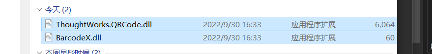

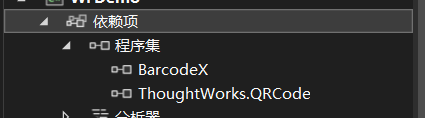

Selector 中打印票据的方法

Selector 中有 成员 Fath.BarcodeX barCode ，表示条形码对象

QRcodeCreator 是我们自己写的一个类，加入到Models 文件夹中，其内部有GetQRCodeBmp 方法，其方法部分功能来源于之前引入的 ThoughtWorks.QRCode dll文件中


```
class QRcodeCreator{
	public static Image GetQRCodeBmp(string url){
		QRCodeEncoder qrCodeEncoder = new QRCodeEncoder();
		qrCodeEncoder.QRCodeEncodeMode = QRCodeEncoder.ENCODE_MODE.BYTE;
		qrCodeEncoder.QRCodeScale = 4;
		qrCodeEncoder.QRCodeVersion = 0;
		qrCodeEncoder.QRCodeErrorCorrect = QRCodeEncoder.ERROR_CORRECTION.M;
		return qrCodeEncoder.Encode(url);
	}
}
```


下面是票据打印的代码，全都是 GDI 的知识


打印的内容都是画出来的，就是 Drawing 命名空间的内容

把 下面 的 e.Graphics 指定为画笔，然后控制其要画的内容


```
public void PrintLottery(System.Drawing.Printing.PrintPageEventArgs e,string serialNum,List<string> numList){
	// 生成条形码
	barCode.Text = serialNum;//条形数据
	barCode.Symbology = Fath.bcType.Code;//设置条码的格式
	barCode.ShowText = true;//是否显示条码下面的文本。
	e.Graphics.DrawImage(barCode.Image(240,50),new Point(20,5));
							//画的条码图形的长宽    画的图形的坐标
	
	//生成票据
	float left = 2;//打印区域的左边界
	float top = 70;//打印区域的上边界
	Font titlefont = new Font("仿宋",10);//标题字节
	Font font = new Font("仿宋",8);//内容字体
									//字体，   蓝色				// 标题打印的基准点
	e.Graphics.DrawString("彩票中心",titlefont,Brushes.Blue,left+20,top,new StringFormat());//打印标题
	// 画一条分界线
	Pen pen = new Pen(Color.Green,1); // 需要强制类型转换是因为left 和 top 是float 类型
	 e.Graphics.DrawLine(pen, new Point((int)left - 2,(int)top + 20), new Point((int)left + (int)180, (int)top + 20));
																//长度宽度和位置
	//循环打印选号
	for(int i = 0 ;i<numList.Count;i++){
		e.Graphics.DrawString( //每一行数据打印
		numList[i],
		font,
		Brushes.Blue,
		left, 
		top+titlefont.GetHeight(e.Graphics)+font.GetHeight(e.Graphics)*i+12,  //进行位置控制
		new StringFormat()
		);
	}
	
	//再画一条分界线   调整位置
	float topPoint = titlefont.GetHeight(e.Graphics) +  font.GetHeight(e.Graphics)*(numList.Count)+22;
	e.Graphics.DrawLine(
	pen,
	new Point((int)left-2,(int)top + (int)topPoint),
	new Point((int)left + (int)180,(int)top+(int)topPoint)
	);
	
	// 打印时间
	string time = "购买时间:" + DateTime.Now.ToString("yyyy-MM-dd HH:mm:ss");
     e.Graphics.DrawString(
     time,
     font,
     Brushes.Blue,
     left,
     top+titlefont.GetHeight(e.Graphics)+font.GetHeight(e.Graphics)*(numList.Count+1)+12,
     new StringFormat()
     );
     
     
    //打印二维码
    //二维码图片 left 和 top 的坐标
    int qrcodetop =(int)(top+titlefont.GetHeight(e.Graphics)+font.GetHeight(e.Graphics)*(numList.Count+3)+12);
    int qrcodeleft = (int)left + 32;
    
    // 生成二维码图片， Image 是一个类型
    Image bmp = QRcodeCreator.GetQRCodeBmp("http://www.baidu.com"); //官网网址转化为二维码图片
    //打印
    e.Graphics.DrawImage(bmp,new Point(qrcodeleft,qrcodetop));//不同 URL图片大小不同，可以根据需要调整left坐标
    e.Graphics.DrawString(
    "扫描二维码可直接查询兑奖结果",
    font,
    Brushes.Blue,
    left,
    qrcodetop + bmp.Height + 10,
    new StringFormat()
    )
}


```


还要把打印出的号码的序列号保存在后台记录中，因此在 Selector 类中在写一个 Save 方法用于保存打印出来的条形码的序列号


```
public void Save(string serialNum){
						// 和可执行文件一个文件夹
	Directoryinfo dir = new DirectoryInfo("numList");
	if(!dir.Exists){
		dir.Create();
	}
	    // 创建序列号.num 的文件
	string path = @"numList\" + serialNum +".num";
	FileStream fs = new FileStream(path,FileMode.Create);
	BinaryFormatter bf = new BinaryFormatter(); //二进制格式化器
		//using System.Runtime.Serialization.Formatters.Binary // 二进制格式化器命名空间
	bf.Serialize(fs,this.SelectedNumbers);
	fs.Close();
}
```


把这个方法加入到 打印之前

```
private void LotteryPrintPage(object sender,System.Drawing.Printing.PrintPageEventArgs e)
        {
            string serialNum = DateTime.Now.ToString("yyyyMMddHHmmssms");//流水号，生成条形码使用
            this.objSelector.Save(serialNum); // 保存所选中号码
            this.objSelector.PrintLottery(e, serialNum, objSelector.GetPrintedNumbers());//调用前面编写的打印方法

            btn_clear_Click(null,null); //打印完成后清空

        }
```


项目到这里完成

项目最终结构

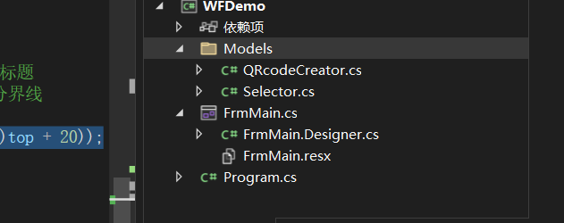

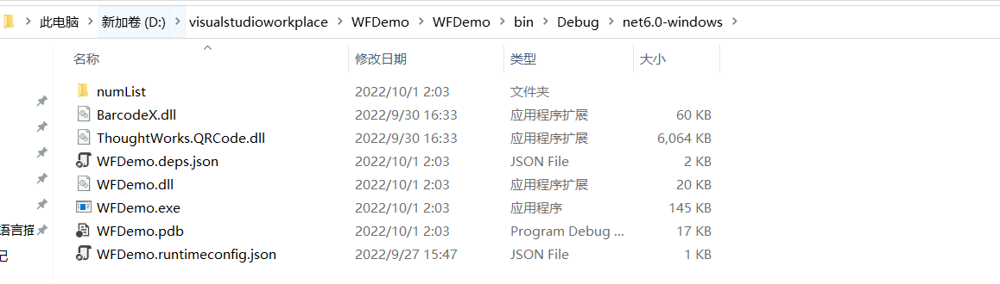

numList就是保存打印内容的文件夹，里面还有我们引入的 dll 文件


# 题库系统

Winform架构


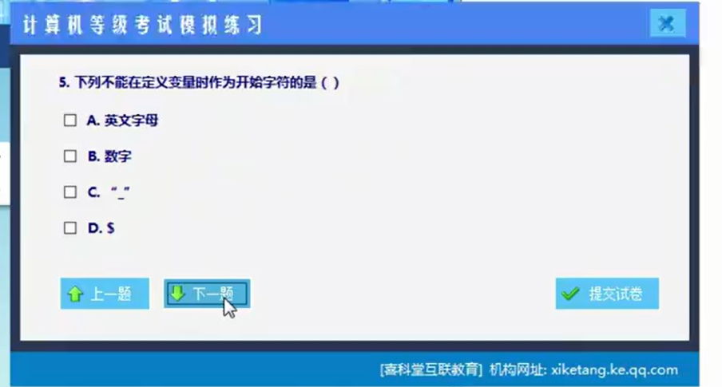

项目分析

1. 这些题目存储的位置：本项目是在磁盘文件(文本文件)中存储的，没有存储在数据库中。每个题目之间有一个分隔符

2. 分析项目中有哪些对象参与程序，先找这个项目的名词(名词分析法则)

   分析标准:

   (1)这个对象的确能够参与程序的运行

   (2)这个对象有对象的基本特征

   (3) 对象必须是项目强相关的对象。

   这个项目中名词有:  **试卷 试题 考生 答案 题干 题目选项 计算机**

   试卷有试题属性      试题有答案和题干属性    计算机不具备基本特征    答案分为标准答案和用户选择答案

   题干属于试题的一部分，试题直接包含了题干，但是试题和答案是弱包含的。

   筛选后，能得到的类：**试卷类**(本项目中只有一张试卷,后续可以扩展成多套试卷) ，**试题类**(有题干属性、答案属性、选项属性，答案也应该是一个独立的对象)   **答案类**(包括正确答案、答案分析、用户选择答案)，**边界类**(负责和用户交互，完成和对象关联，就是一个界面)

3. 分析项目中类和对象的关系

   一张**试卷** 对应 多个**试题**。试题在对象中以集合形式存在

   一个**试题**对应一个**答案**。答案在试题中以对象属性形式存在

   边界类就是一个窗体，一个窗体中对应一个试卷对象。

图解版本

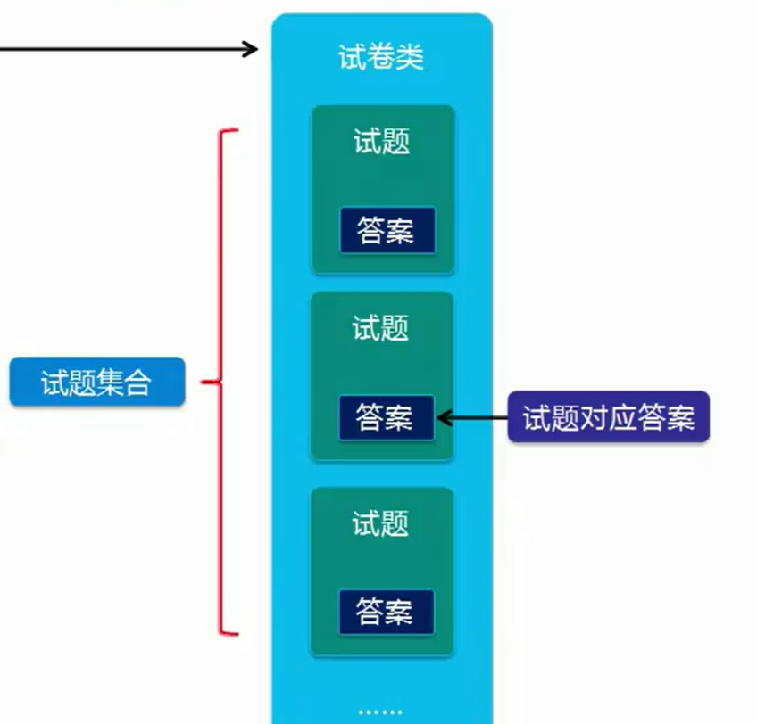

设计类

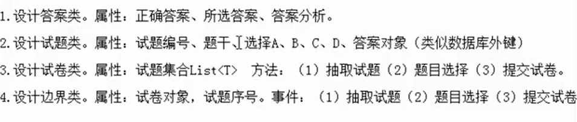


## 后台代码


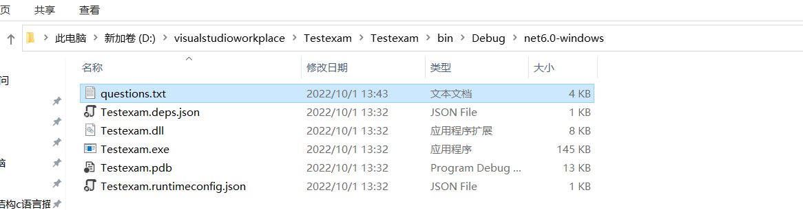


注意这个文本的保存方式 是 UTF-8

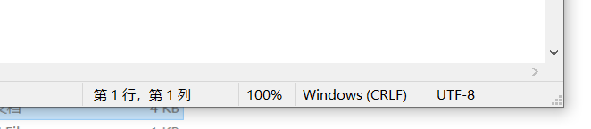

读取方式也需要设置为 UTF-8

```
FileStream fs = new FileStream("questions.txt",FileMode.Open);
StreamReader sr = new StreamReader(fs,Encoding.UTF8);
```

可视化文本工具查看

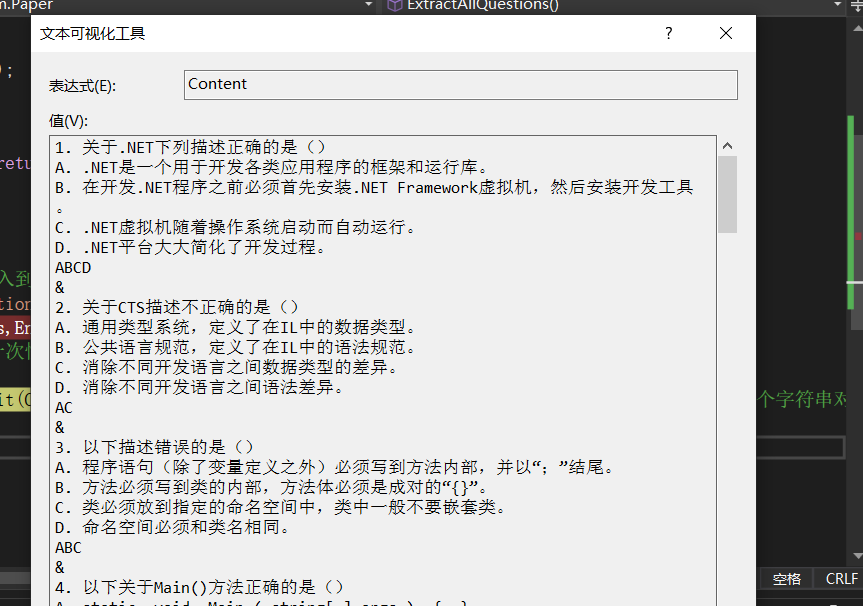

把这个字符串按照 & 字符切割以后得到字符串数组

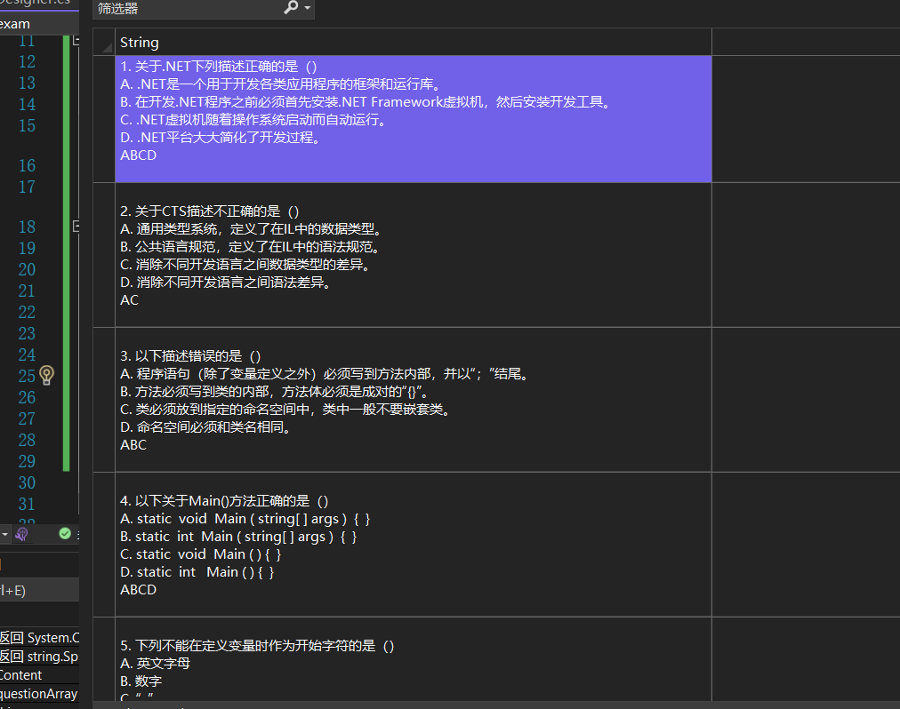

txt文件中的每一个回车都是 \r\n键


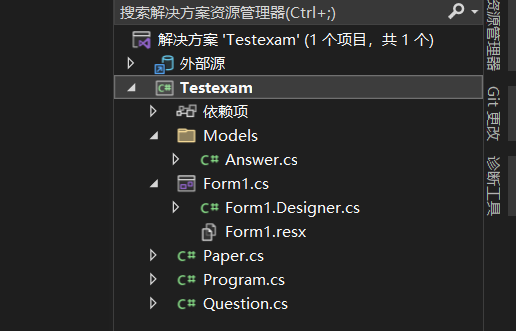

Answer类

```
namespace Testexam.Models
{
    [Serializable]
    internal class Answer
    {
        public string RightAnswer { get; set; } = string.Empty;  // string.Empty 是给属性初始值
        public string SelectedAnswer { get; set; } = string.Empty ;
        public string AnswerAnalysis { get; set; } = string.Empty;
    }
}

```


Question类

```
namespace Testexam
{
    internal class Question
    {
        public int QuestionId { get; set; }
        public string Title { get; set; }

        public string OptionA { get; set; }
        public string OptionB { get; set; }
        public string OptionC { get; set; }
        public string OptionD { get; set; }

        public Answer Answertothequestion { get; set; } //答案（对象类型的属性）
        public Question()
        {
            Answertothequestion = new Answer();
        }

    }
}
```


Paper类

```
using System;
using System.Collections.Generic;
using System.Linq;
using System.Text;
using System.Threading.Tasks;
using System.IO;
using System.Runtime.Serialization.Formatters.Binary;
using System.Drawing.Printing;

namespace Testexam
{
    internal class Paper
    {
        public Paper()
        {
            this.questions = new List<Question>();
        }
        private List<Question> questions;  //存储试题
        public List<Question> Questions { get { return questions; } }
        //抽取全部试题，需要io操作，引入命名空间
        public void ExtractAllQuestions()
        {
            //我们需要提前把存储试题的文本文件放入到 和 exe同一个路径的文件夹中
            FileStream fs = new FileStream("questions.txt",FileMode.Open);
            StreamReader sr = new StreamReader(fs,Encoding.UTF8);
            string Content = sr.ReadToEnd(); //一次性读取全部内容

            string[] questionArray = Content.Split(Convert.ToChar("&"));  // 以&为分割符号 ,将大字符串分割为试题字符串数组，一个字符串对应一个试题
            string[] question = null;//用来保存一道试题题干，选项，标准答案
            foreach (string item in questionArray)
            {
                //将一道试题字符串分割后变为数组信息
                question = item.Trim().Split(Convert.ToChar("\r"));
                this.questions.Add(  
                   new Question    //根据字符串数组信息构成题目对象
                   {
                       Title = question[0].Trim(),  //题干
                       OptionA = question[1].Trim(),//第一个选项
                       OptionB = question[2].Trim(),//第二个选项
                       OptionC = question[3].Trim(),//第三个选项
                       OptionD = question[4].Trim(),//第四个选项
                       Answertothequestion = new Models.Answer
                       {
                           RightAnswer = question[5].Trim(), //存储标准答案
                       } 
                   } 
                    );
            }
            sr.Close();
            fs.Close();
        }
        private void SavePaper()
        {
            FileStream fs = new FileStream("questions.obj",FileMode.Create);
            BinaryFormatter bf = new BinaryFormatter();
            bf.Serialize(fs,this.questions); //把这个存储试题的集合对象以序列化方式存在
            fs.Close();
        }
        //在第一次序列化存储之后接下来就可以都依靠反序列化的方式把集合对象读出来
        public void Extractbyserial()
        {
            FileStream fs = new FileStream("questions.obj", FileMode.Open);
            BinaryFormatter bf = new BinaryFormatter();
            this.questions = (List<Question>)bf.Deserialize(fs);
            fs.Close();
        }
        //提交试卷
        public int SubmitPaper()
        {
            int count = 0;//count表示分数
            foreach(Question question in this.Questions)
            {
                if (question.Answertothequestion.SelectedAnswer == string.Empty) continue;
                if (question.Answertothequestion.RightAnswer.Equals(question.Answertothequestion.SelectedAnswer))
                    count += 5;
            }
            return count;
        }
    }
}

```


## UI设计

UI设计，在需要控制多个控件是否出现的时候，使用 visible属性。

控制多个容器之间的包含关系，以及谁浮在别的东西上方的时候，可以使用文档大纲

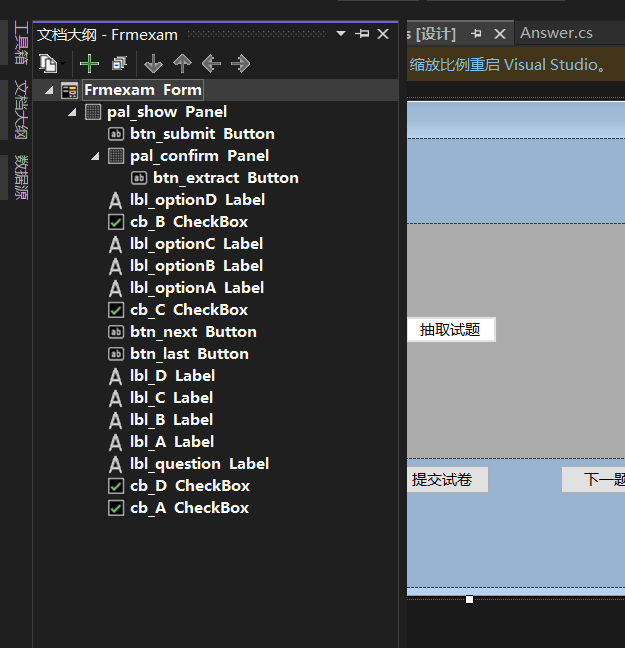

控制控件容器之间的父子关系。

文件大纲可以在视图中找到。


# 学员选择器

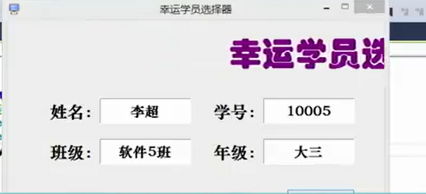

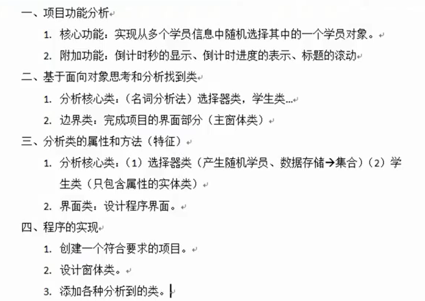

​							<font size=5>4.     按照核心功能添加程序，再添加辅助功能</font>

