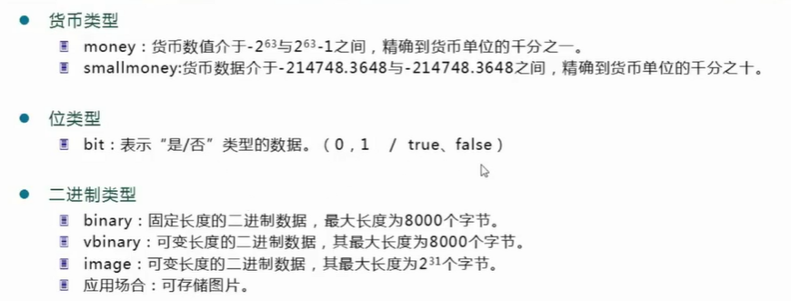
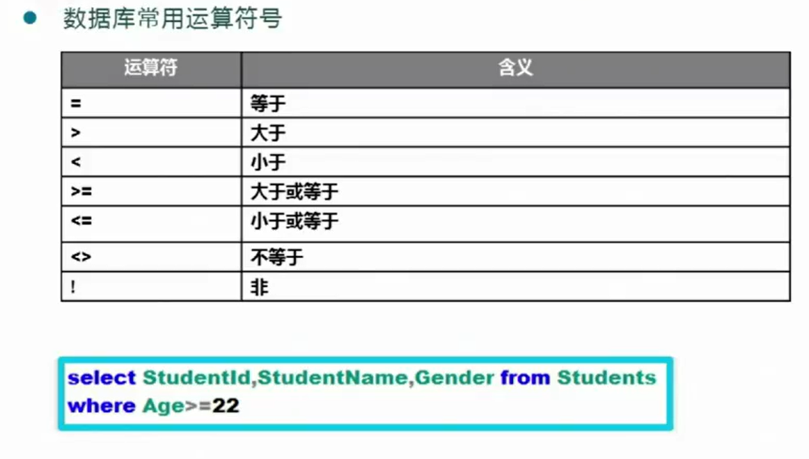
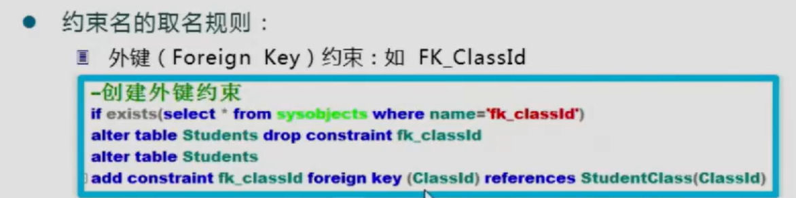
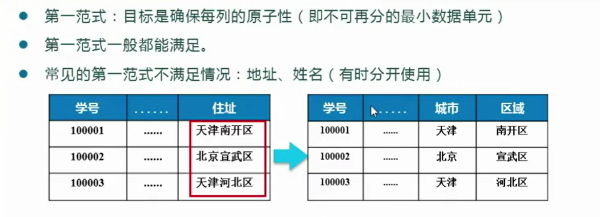

# 1、接触SQLServer数据库

数据库全称叫数据库服务器，**其实是一种服务器**

## 数据库安装教程以及管理系统安装教程

[(92条消息) SQL Server超详细使用教程——从安装到编写SQL语句_王森ouc的博客-CSDN博客_sqlserver在哪里写sql语句](https://blog.csdn.net/weixin_43074474/article/details/105106894?app_version=5.7.0&code=app_1562916241&csdn_share_tail={"type"%3A"blog"%2C"rType"%3A"article"%2C"rId"%3A"105106894"%2C"source"%3A"m0_62745577"}&uLinkId=usr1mkqgl919blen&utm_source=app)


## c#中的类的实体和实体属性在数据库中的存储方式


## 数据库管理系统


<font color=red size=5>用户在前端(无论cs还是bs)进行操作都是在向后端的数据库(服务器发送请求数据的服务</font>

## 学数据库的什么


## SQL和T-SQL


## 主流数据库


# 2、**数据库服务的运行与登录**


打开与关闭服务的方式。

打开这个服务以后客户端才能访问服务器端

第一种方式、在操作系统的服务中启动和关闭


现在设置为自动启动


第二种方式、通过命令窗口


 启动：net start mssqlserver       停止：net stop mssqlserver

第三种方式、通过 SQL Server Configuration Manager 启动和关闭


注：服务器的名称只限制于局域网或者本机

我安装的时候是本机服务器，身份验证是 windows身份验证


## SQL Server 实例

  所谓“SQL实例”，实际上就是SQL服务器引擎，每个SQL Server数据库引擎实例各有一套不为其他实例共享的系统及用户数据库。
**在一台计算机上，可以安装多个SQL SERVER，每个SQL SERVER就可以理解为是一个实例**。
实例又分为“默认实例”和“命名实例”，如果在一台计算机上安装第一个SQLSERVER,命名设置保持默认的话，那这个实例就是默认实例。
   一台计算机上最多只有一个默认实例，也可以没有默认实例，默认实例名与计算机名相同。

**[计算机名是可以修改的，但修改后对默认实例无影响,即默认实例随计算机名的改变而改变]
**所以说，默认实例的名称是与计算机名相同，而不是称为"local"

一般情况下，如果要访问**本机上的默认SQL服务器实例**，使用 **计算机名**、**(local)**、**localhost**、**127.0.0.1**、**.** 、**本机IP地址**，都可以达到相同的目的。但如果要访问非本机的SQL服务器，那就必须使用计算机/实例名的办法。


## 企业管理器和查询分析器


主要学习用查询分析器写 sql 语句


# 3、使用SQLServer连接本机数据库服务器

在局域网或者外网访问 SQLServer 服务器(不是访问本机服务器)

在已经安装 SQLServer 的基础上做以下4个步骤


这个密码的位数是会变的，为了安全性


# 4、创建数据库和数据表

大纲：

创建数据库

创建数据表

go语句的使用

标识列的使用

创建数据库和数据表都是 create 关键字，删除数据库数据表都是 drop 关键字


通过 DBMS 数据库管理系统创建数据库

## 数据库创建

### 数据库分类

SQLServer 里面的数据库有两种，**系统数据库 ** 和 **用户数据库**


我们要创建的数据库是 **用户数据库**

master 数据库是数据库的数据库


### 用户数据库文件组成


### 脚本sql语句创建数据库

#### 创建一个数据文件


注：

1. sql 语句的注释是 两个杠再空格：-- 注释

2. go 关键字表示一个完整的创建过程，开头结尾都要有

3. 创建数据库用 create 关键字

4. 数据文件 mdf ，日志文件 ldf

5. on primary后面必须使用小括号，小括号里面的参数之间是用逗号","分隔的。

6. **数据库文件的逻辑名**是不可以重复的

7. 参数 name ：数据库文件的逻辑名，不可重复 

   filename：数据库物理文件名(表示这个数据库文件的绝对路径，即文件存储在哪里)

   size：数据库文件初始大小

   filegrowth ：数据文件增长量，这个值可以是 确定数值的MB，或者某个百分比数

   

   

```
use master -- 在 master 数据库中备份我们要创建的数据库的数据
go
create database StudentManageDB
on primary
(
	name = "StudentManageDB_data",
	filename = "D:\DB\StudentManageDB_data.mdf",
	size = 10MB,
	filegrowth = 5MB
)
log on
(
	name = "StudentManageDB_log",
	filename = "D:\DB\StudentManageDB_log.ldf" ,
	size = 2MB,
	filegrowth = 1MB
)
go
```


新建查询，选中代码执行

注意，要提前在D盘创建DB文件夹


执行后的结果


#### 创建多个数据文件


注：

1. 数据文件 主数据文件扩展名是 .mdf   次要数据文件扩展名是 .ndf
2. 日志文件没有主次之分
3. 文件之间也是用逗号分开
4. 文件名可以用双引号或者单引号括起来都可以

```
create database studentManageDB
on primary
(
	name = 'StudentManageDB_data',
	filename = "D:\DB\StudentManageDB_data.mdf",
	size = 10MB,
	filegrowth = 5MB
)
,
(
	name = 'StudentManageDB_data1',
	filename =  "D:\DB\StudentManageDB_data.ndf",
	size = 2MB,
	filegrowth = 1MB
)
log on
(
	name =  'StudentManageDB_log',
	filename =  "D:\DB\StudentManageDB_log.ldf",
	size = 2MB,
	filegrowth = 1MB
)
,
(
	name =  'StudentManageDB_log1',
	filename =  "D:\DB\StudentManageDB_log1.ldf",
	size = 2MB,
	filegrowth = 1MB
)
```


把已有的数据库删去，选择关闭现有连接


如果数据库存在就删除该数据库

```
if exists(select * from sysdatabases where name = "StudentManageDB") -- 如果存在名为 StudentManageDB 的数据库就进行删除
drop database StudentManageDB
```

select * from sysdatabases 的结果


### 分离数据库与附加数据库


注意，filename1后面写的是**主文件**物理文件路径，filename2后面写的是主文件对应的日志文件

```
exec sp_detach_db @dbname = StudentManageDB  -- 分离数据库

--附加数据库
exec sp_attach_db @dbname = StudentManageDB,
@filename1 = 'D:\DB\StudentManageDB_data.mdf', -- 这里写的是主文件物理文件路径
@filename2 = 'D:\DB\StudentManageDB_log.ldf'
```


## 数据表的创建

### SQLserver 的数据类型

文本类型


数值类型


​                    real 表示范围：-3.40E+38 ~ 3.40E+38 占用4个字节存储空间，相当与 float(24)


时间类型


其他类型




使用例子


### 创建数据表


**<u>列的特征</u>包含的内容**

- **是否为空(NULL)**：在输入数据时，数据库的列允许为空时，可以不输入数据，否则必须输入。列是否为空要根据数据库设计的具体要求决定，对于关键列必须禁止为空    not null
- **是否是标识列**(自动编号的列)   标识列   identity
- 是否有默认值：如果数据表的某列在用户不输入数据的时候，希望提供一个默认的内容，比如：用户如果不输入学员地址，则默认'地址不详'。
- 是否为主键：主键是实体的唯一标识，保证实体不重复。一个数据表必须有主键才有意义。


```
-- 创建数据表
use StudentManageDB--指定数据库
go
if exists(select*from sysobjects where name = 'Students')
drop table Students
go
create table Students(
	StudentId int identity(10000,1), -- 学号  从10000开始，每次递增1 标识列
	StudentName varchar(20) not null, --姓名
	Gender char(2) not null,		-- 性别
	Birthday datetime  not null,   --出生日期
	StudentIdNo numeric(18,0) not null, --身份证号
	Age int not null,
	Telephone varchar(50),
	StudentAddress varchar(500),
	ClassId int    -- 保留一个外键关系  表示班级外键
)
go
```

#### 标识列的使用

上面的代码中

```
StudentId int identity(10000,1)是添加标志列
```

标识列的特殊说明


创建出数据表后，这个数据表依旧是一个空表


编辑方法：右键选中这个表编辑前200行


就可以选择添加


StudentId 是标志列，我们不能写，是系统自动维护的

标志列在我们创建完成后会自动增长


删除第二行后，再增加新的一行元素


#### 批处理语句go


### 完成剩余数据表的创建

创建 学生表 班级表 管理员表 分数表

```
-- 创建数据表
use StudentManageDB--指定数据库
go
if exists(select*from sysobjects where name = 'Students')
drop table Students
go
create table Students(
	StudentId int identity(10000,1), -- 学号  从10000开始，每次递增1 标识列
	StudentName varchar(20) not null, --姓名
	Gender char(2) not null,		-- 性别
	Birthday datetime  not null,   --出生日期
	StudentIdNo numeric(18,0) not null, --身份证号
	Age int not null,
	Telephone varchar(50),
	StudentAddress varchar(500),
	ClassId int    -- 保留一个外键关系  表示班级外键
)
go

if exists(select * from sysobjects where name = 'ScoreList')  --分数表
drop table ScoreList
go
create table ScoreList (
	Id int  identity(1,1) primary key, --这是主键
	StudentId int not null, --这是外键、
	Csharp int null,  -- 这个值默认是 null
	SQLServer int null,
	UpdateTime datetime not null --更新时间
)
go

if exists(select * from sysobjects where name ='Admins') -- 管理员表
drop table Admins
go
create table LoginId(
	LoginId int identity(1000,1) primary key,
	LoginPwd varchar(20) not null, --登录密码
	AdminName varchar(20) not null
)
go
-- 班级表
if exists(select * from sysobjects where name = 'StudentClass')
drop table StudentClass
go
create table StudentClass
(
	ClassId int primary key,--班级编号
	ClassName varchar(20) not null
)
go
```


## sysobject 和 sysdatabases

在数据库内创建的每个对象(约束、默认值、日志、规则、存储过程)都存储在 sysobjects中

所有创建的数据库都存储在 sysdatabases中


# 5、数据的基本操作

## 插入实体 关键字insert


```
insert [into] 完整表名 (列名1,列名2,列名3...) values (值1,值2,值3...),(值1,值2,值3...)...
values后面可以跟多组实体
```

日期用字符串类型代值，但是要满足标准格式

```
insert into Students(StudentName,Gender,Birthday,StudentIdNo,Age,Telephone,StudentAddress,ClassId) values
('王一','男','2002-03-04',111122223333444455,19,'18800563355','njupt',1),
('王二','男','2003-03-04',111122223333444466,20,'18800563388','njupt',1),
('王三','男','2001-03-04',111122223333444477,20,'18800563399','njupt',2),
('王四','男','2003-03-04',111122223333444455,18,'18800563300','njupt',2)
```


## 查询实体 关键字select


```
select 列名1,列名2,列名3... from 完整表名 where 查询条件
```


```
select StudentName,Birthday,StudentIdNo,Age from Students where ClassId = 1
```


### T-SQL中的运算符




## 修改实体 关键字update


```
update 完整表明 set 列名1=更新值1,列名2=更新值2,列名3=更新值3... [where 更新条件]
    where 如果不写就是 所有行的这个列的值都改变了
```


## 删除实体 关键字delete truncate


```
delete from 表名 where 删除条件(要删除哪一行)  
如果不写条件，delete就是删除所有行
```

truncate 是删除整个数据表


```
use StudentManageDB
go
insert into Students(StudentName,Gender,Birthday,StudentIdNo,Age,Telephone,StudentAddress,ClassId) values
('王一','男','2002-03-04',111122223333444455,19,'18800563355','njupt',1),
('王二','男','2003-03-04',111122223333444466,20,'18800563388','njupt',1),
('王三','男','2001-03-04',111122223333444477,20,'18800563399','njupt',2),
('王四','男','2003-03-04',111122223333444455,18,'18800563300','njupt',2)
go
select StudentName,Birthday,StudentIdNo,Age from Students where ClassId = 1
go
update Students set Gender = '女' where StudentName = '王一'
update Students set Age = 30 where StudentName = '王二'
go
delete from Students
go
```


# 6、数据完整性设计与实践

约束的关键字 alter table 表名 add constraint ... 

数据完整性的概念：确保存储在数据库中数据的准确性和一致性


## 完整性约束的类型

常用三类约束保证数据的完整性

1.域(列)完整性


2.实体完整性


3.引用完整性


## 实体的完整性(保证每一行都是独一无二的)


保证实体完整性(一行唯一的方法)：主键约束、标识列、唯一约束


### 添加约束的语法 主键约束 唯一约束


```
alter table 表名  add constraint 约束名 约束类型 (要添加的约束在这个表的哪一列上)
```


```
--创建主键约束
if exists(select * from sysobjects where name = 'pk_StudentId') 
			--在sysobjects中查询先前有没有过名为pk_StudentId的主键被创建
alter table Students drop constraint pk_StudentId   --如果有就把这个主键删除
alter table Students add constraint pk_StudentId primary key(StudentId) --添加主键


--创建唯一约束
if exists(select * from sysobjects where name = 'uq_StudentIdNo')
			--在sysobjects中查询先前有没有过名为uq_StudentIdNo的唯一约束被创建
alter table Students drop constraint uq_StudentIdNo   --如果有就把这个唯一约束删除
alter table Students add constraint uq_StudentIdNo unique(StudentIdNo)--添加新的唯一约束
```

执行以后，右键选择表的设计


## 域(列)完整性(列的每一个值要合理)


### 检查约束与默认约束


```
检查约束
alter table 表名 add constraint 要创建的检查约束的名字 check(对该表属性，即表的列的检查方式)

默认约束
alter table 表名 add constraint 要创建的约束的名字 default (默认值信息) for 该表要添加默认值的列 
```


```

--创建检查约束
if exists(select * from sysobjects where name='ck_Age')
alter table Students drop constraint ck_Age
alter table Students add constraint ck_Age check(Age between 18 and 25)

if exists(select * from sysobjects where name = 'ck_Telephone')
alter table Students drop constraint ck_Telephone
alter table Students add constraint ck_Telephone check(len(Telephone)=11)

```

如果创建了约束以后，还试图插入与约束违背的数据，会报错


如果先有数据，后有约束，约束与已经在表中的数据不相符，那么约束加不上去


```
--创建默认约束
if exists(select * from sysobjects where nme = 'df_StudentAddress')
alter table Students drop constraint df_StudentAddress
alter table Students add constraint df_StudentAddress default ('地址不详') for StudentAddress
```


```
insert into Students(StudentName,Gender,Birthday,StudentIdNo,Age,Telephone,StudentAddress,ClassId) values
('王一','男','2002-03-04',111122223333444455,19,'18800113355',1)  
--这种写法会报错，因为列的数量与要写入的值的数量不相等
insert into Students(StudentName,Gender,Birthday,StudentIdNo,Age,Telephone,StudentAddress,ClassId) values
('王一','男','2002-03-04',111122223333444455,19,'18800113355',default,1)
											 --要使用默认值的地方必须要使用 default 占位
```


## 引用完整性(保证不同表具有的相同的属性值是有效的)


### 外键约束

关联两个表，分别称为主表和子表



一定要满足**主表的元素早于子表中的元素被创建，子表中的元素早于主表中的元素被删除**

比如：水果摊卖的水果是主表，我们要买的水果是子表，**水果摊只卖哪些水果规定了我们子表只能买哪些水果**

语法，子表写在前面，一定是子表申请和主表关联

```
alter table 子表 add constraint 外键名 foreign key (子表中的希望被约束的列) references 主表(主表中提供约束的列)
```


```
if exists(select *from  sysobjects where name = 'fk_classId')
alter table Students drop constraint fk_classId
alter table Students
add constraint fk_classId foreign key(ClassId) references StudentClass(ClassId)
--注意这里  Students 表是子表，StudentClass是主表，主表中提供约束的列通常是主键列
```


如果试图往子表中插入主表中不存在的数据

```
insert into Students(StudentName,Gender,Birthday,StudentIdNo,Age,Telephone,StudentAddress,ClassId) values
('王一','男','2002-03-04',111122223333444455,19,'18800563355','njupt',1)  
这里是ClassId是1，但是此时主表中的ClassId 还没有1这个值
```


 必须是

```
insert into StudentClass(ClassName,ClassId) values('高三五班',1)
insert into Students(StudentName,Gender,Birthday,StudentIdNo,Age,Telephone,StudentAddress,ClassId) values
('王一','男','2002-03-04',111122223333444455,19,'18800563355','njupt',1)
```


如果试图先删除主表中的数据而且该数据已经在子表中被使用了


## 总结


# 7、企业管理器的使用

<font color=red size=6>创建数据库</font>


所有者


<font color=red size=6>创建数据表</font>

选中 表 结点，右键新建表


**设置主键**  选中一行


**设置标识列** 选中一行


标识增量，即 **步长**

标识种子，即 **起始值**


保存表


给表取名字


再创建第二张表


<font color=red size=6>添加约束</font>

**check** **约束**


选择 添加


编写表达式为该列添加约束


**外键约束**

选择 希望成为子表的表中希望被别的主表约束的列，右键选择 关系


选择 添加


选择 **表和列规范**


要注意保持数据类型和长度一致


如果出现不让更改表的属性的窗口


阻止保存要求重新创建表的更改

<font color=red size=6>创建数据库关系图</font>


能够看清外键之间的关系


在该视图中也可以 添加外键关系 和 删除外键关系

添加外键关系：选中该表的某一行，按住左键，再拖动到另一行


# 8、常用查询

## 查询基本知识

### 查询实现过程分析


### 查询的基本组成部分


```
select 列名1,列名2... from 表名 where 查询条件表达式  order by 用于排序的列的列名 ASC或者DESC
```

Desc 降序 ASC升序


### 各种查询  AS使用对查询出的列展示时重命名 加号使用 固定行数


+连接的是字符串，那么就是字符串拼接，如果+连接的是数值，那么就是数值相加

```
select 原列名 as 要展示的列名,要展示的列名 = 原列名 from 表名
```


多列排列，第一个条件排完之后，如果出现了两个值相同的情况，再根据第二个排序条件进行排列

```
order by 列名1 DESC,列名2 DESC....
```


在查询的时候可以对表进行重命名来简化书写

```
select 属性 from 表名 表的新名字 
```


## 模糊查询 like between in

Like 用于模糊匹配字符串

```
where 字符串类型 like 一个字符串通配符
```


between 用于 整型 和 日期类型

```
where 整型或日期字段 between 整型1(日期1) and 整型2(日期2)
```


in 直接给出这个列允许的取值

```
where 列名 in (允许的值1,允许的值2,允许的值3,允许的值4,允许的值5....)
```


## 最大值、最小值、平均值相关函数


``` 
SUM(列名) 对列名的取值求总和
Count(列名) 得到数量   Count里面通常用*
Max(列名) 按照某个列取最大值  
Min(列名) 按照某个列取最小值
Avg(列名) 平均值
```


聚合函数通常用于代替select后面的列名

```
select 聚合函数(列名) as 重命名 from 表名
```


## 多表查询 (inner) join outer

### 内连接查询


什么是内连接

说明：组合两个表中的记录，返回关联字段相符的记录，也就是返回两个表的交集（阴影）部分。

**这里有两个表做内连接查询，我们把其中各表的所有行做排列组合，再删去不符合连接条件的，就得到了内连接虚拟表**

**再从内连接虚拟表中筛选出where条件符合的，再选出我们希望看到的字段(select后面)，就得到了表**

维基百科解释：连接产生的结果集，可以定义为**首先对两张表做笛卡尔积（交叉连接）** -- **将 A 中的每一行和 B 中的每一行组合**，然后**返回满足连接谓词的记录。**


```
select 列名1,列名2... from 表名1 inner join 表名2 on 连接条件 where 表1或者表2的条件都可以
注：select 后面的列名如果不加 表名2.列名 就都默认是表名1中的数据
	如果只有两个表关联，即表1和表2，表名1 与 表名2 的位置可以互换内连接
```

inner join 也可以省略 inner ，也是内连接查询


多表连接查询

后面写多个 inner join

一个写在前面的主表与写在后面的多个副表分别进行排列组合(每次都是主表和其中一个副表)，再分别删去各自不符合连接条件的，再进行合并，再按照 where 条件进行删去


```
select 字段 from 表名1
inner join 表名2 on 连接条件1
inner join 表名3 on 连接条件2
where 条件
表名1必须同时和表名2表名3关联
```


### 左外连接查询

什么是左外连接

left join 是left outer join的简写，它的全称是左外连接，是外连接中的一种。

左(外)连接，左表(a_table)的记录将会全部表示出来，而**右表(b_table)只会显示符合搜索条件的记录**。右表记录不足的地方均为NULL。


就是说，左表的所有行肯定都会出现，其出现有两种情况

一是其满足on后面的条件出现了

二是不满足on后面的条件，该行依旧出现，如果这个行要展示右表的值，那么右表的值会被全部填上null

```
select 要查询字段 from 左表 left outer join 右表 on 连接条件 where 条件
```


### 右外连接查询

right join是right outer join的简写，它的全称是右外连接，是外连接中的一种。
与左(外)连接相反，右(外)连接，左表(a_table)只会显示符合搜索条件的记录，而右表(b_table)的记录将会全部表示出来。左表记录不足的地方均为NULL。


```
select 要查询字段 from 左表 right outer join 右表 on 连接条件 where 条件
```


### 外连接查询详解

假设展示的时候两个表的数据都被展示了

1.两表所有行进行排列组合进行拼接，得到笛卡尔集

2.按照on后面的条件把第一批要展示的行挑选出来，这一批没有任何一行被填充null

3.把左外连接或者右外连接中主表中不在第一批的剩余的行拿出来，在它们要展示的副表上的位置的地方填充上null

4.两批行合在一起共同展示


## 分组查询与统计 group by having

group by


注意：分组以后不可查询个体值，因为已经聚合到一起了(多个行已经合并了)，只能查询 **group by 后面的值**，和 **聚合函数与值搭配**

聚合函数计算分组后各个组内的值


having是作用于 groupby之后的，where 是作用于尚未分组前的


having 后面跟着的属性值都是分组之后的，因此也要和聚合函数搭配使用


### where 和 分组 和 having


### 查询重复数据

先知道什么属性的值重复了，再想要知道重复的内容是什么


```
1.已知 重复的是哪个字段
select 重复的字段 from 表名 group 重复的字段 having Count(*) > 1
2. 查询所有重复的记录
select * from 表名 where 重复的值 in(select 重复的值 from 表名 group by 重复的值 having count(*)>1) order by 重复的值
3. 其他方法										
select * from 表名 where (select count(*) from 表名 where 重复的值 = 表名)

```


# 9、数据库的设计

## 数据库设计基本步骤


1.需求分析


2.标识对象(实体)并设计对象的属性


3.确定对象之间映射关系


不要把对象数据堆积在一张表，尽可能的分开来，分成多张表然后用外键联系起来


## 数据库设计的检验与模型设计


### 三范式原则


**第一范式**



第二范式


一个实体就相当于，c#中的一个对象。每个对象的属性都是要与之相符合的而不是本不属于这个对象的属性也参杂进来，要分离出来创建新的类

第三范式


### 软件可视化数据库模型


### 三范式与数据库性能


<font color=red size=5>分割出的表越多，数据库使用的性能，查询(select)的性能越低</font>


