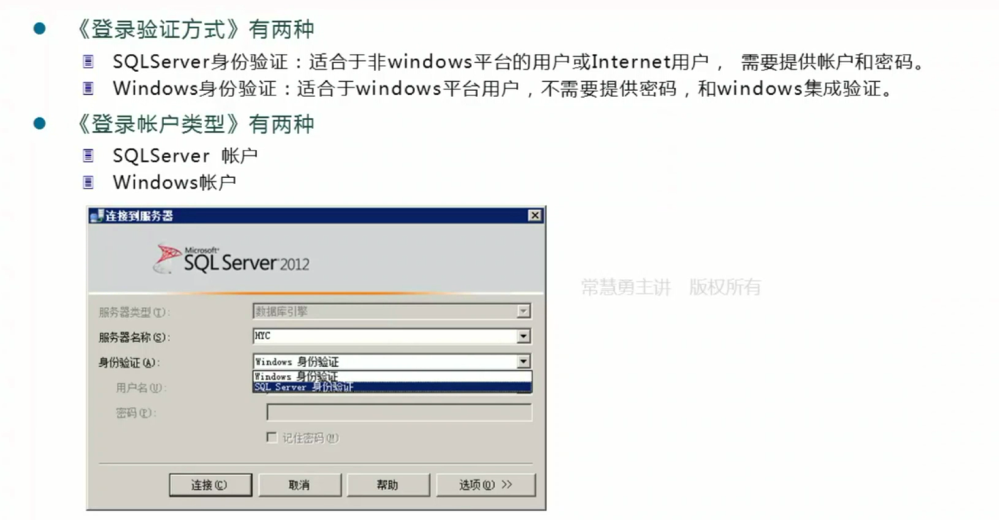
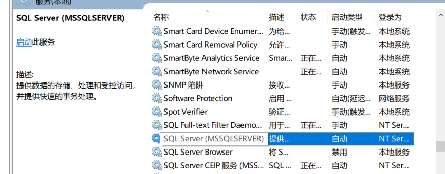
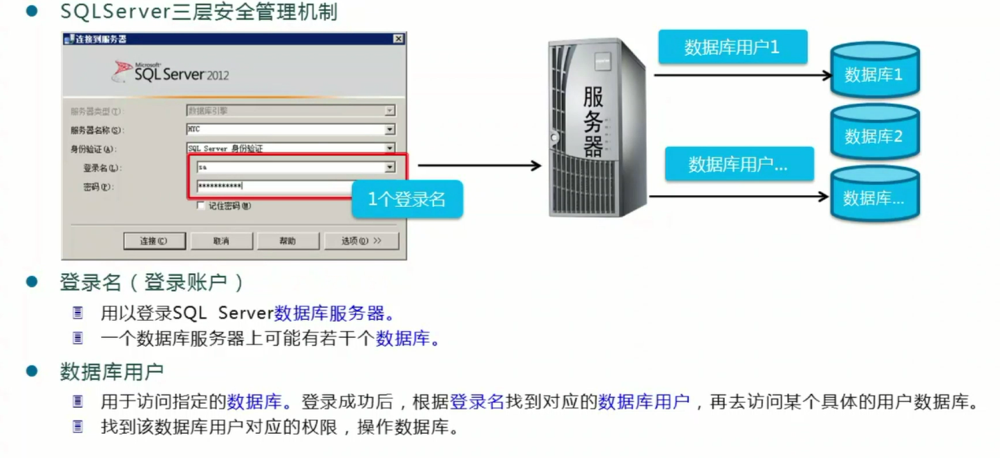
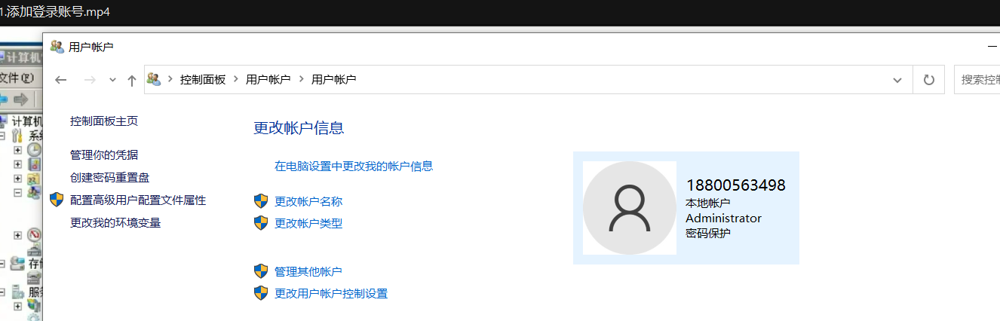
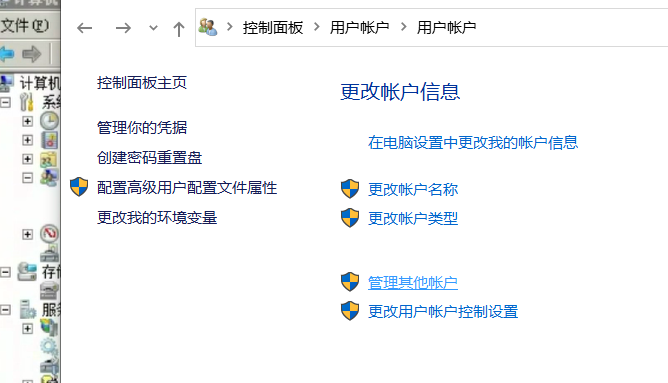
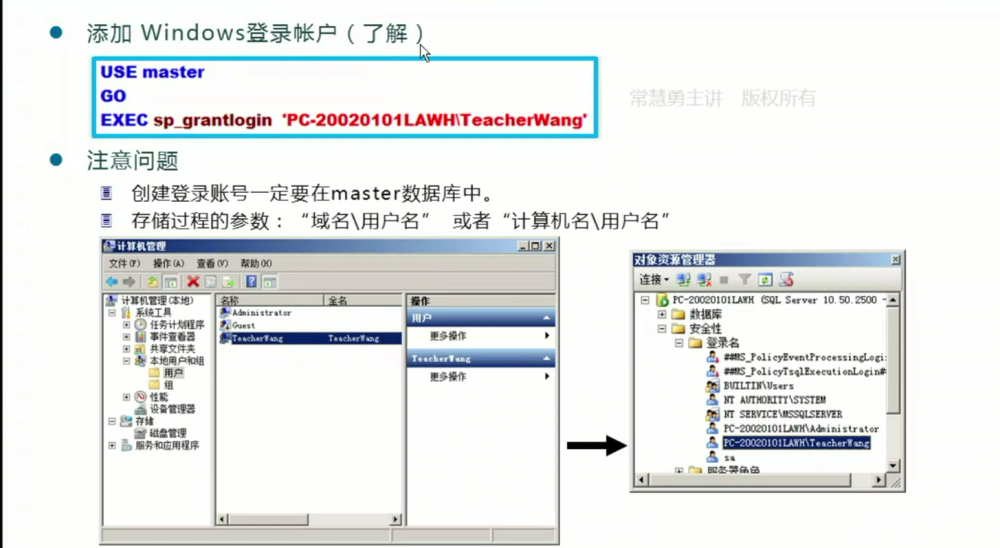

## 添加登录账号

登录SQLServer的时候可以使用两种方式

windows 身份验证和sqlserver身份验证

sqlserver身份验证可以使用网络登录

用户输入账号(登录名)和密码,登录到了部署SQLServer的计算机。安装数据库的时候客户端和服务端是一起安装的。

这是数据库客户端

这是数据库服务端

可以给一个登录名创建多个数据库用户。

登录名和数据库用户一对多的关系。

数据库用户和数据库是一对一的关系。

登录名 数据库 权限 是数据库三成安全管理机制

给电脑用户添加数据库账号

