# GoLang语言发展和应用

## Go语言历史


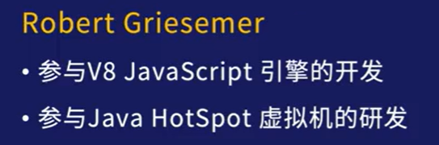


go语言的发明是为了避免c++的复杂。


发展


## 优势与劣势

优势

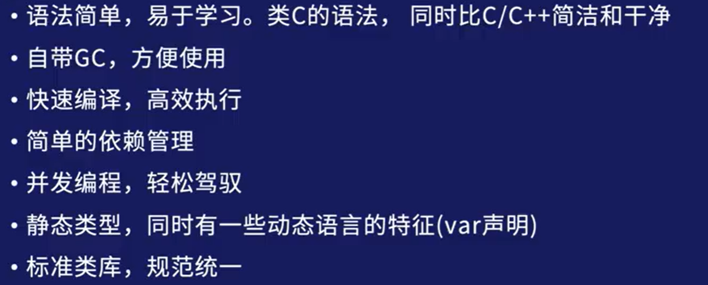

劣势


## go语言用途


## go微服务


## 基于go语言的应用


## **go开发环境搭建**

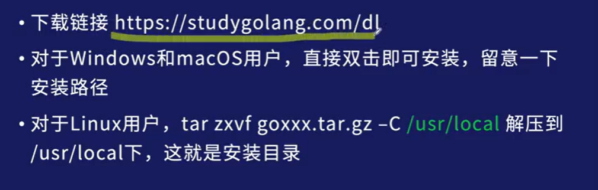

https://studygolang.com/dl

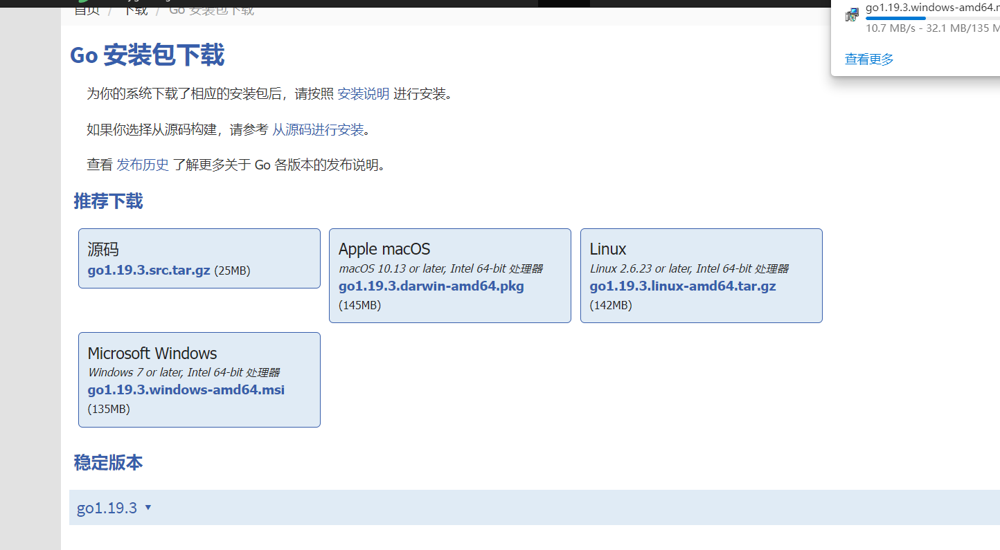

安装路径如下


下载完成后的目录

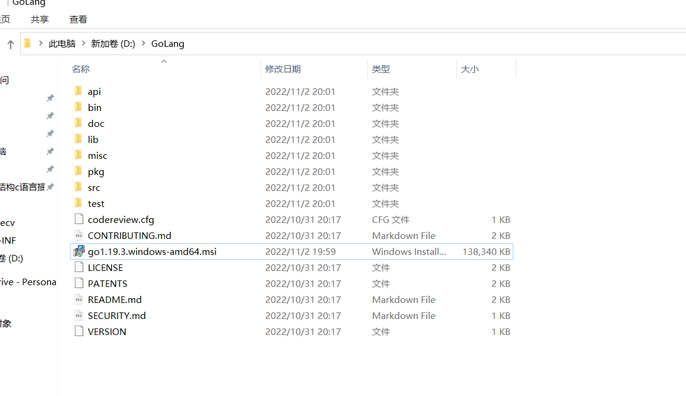

### 配置环境变量(确定GoLang位置的基础上)

对于 linux 和 mac

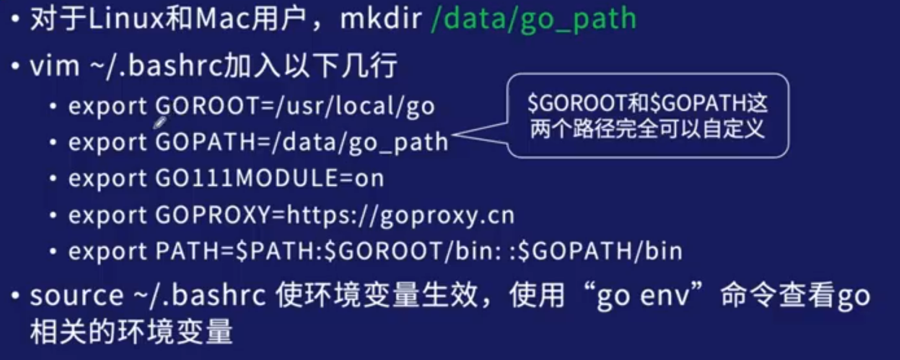

```
GOROOT=D:\GoLang
GoPath=D:\GoLangProject
GO111MODULE=ON
GOPROXY=https://goproxy.cn
PATH=%PATH%\bin
```


对于windows用户


我的配置

- GOPATH环境变量要指向工程目录，配置在系统变量，用户变量的删去

  

- 配置GOPROXY 系统变量

  

- 配置GOROOT  系统变量

  

  

- Path 设置Go语言的bin目录

  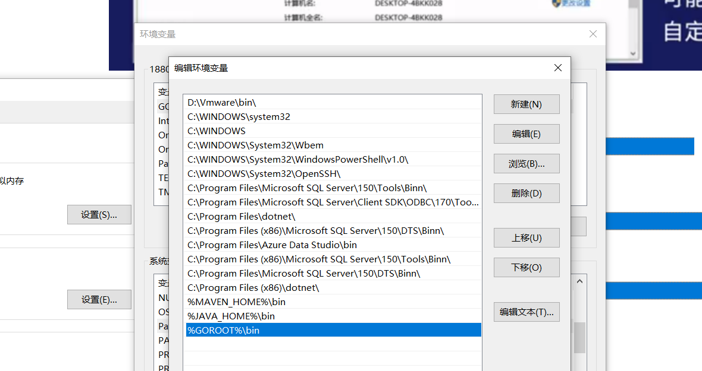

- Go111MODULE   值是 on ，不知道干什么用的，系统变量

  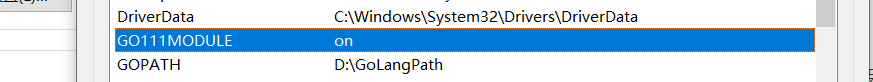


工程目录设置三个文件夹 bin：可执行程序目录，pkg：外部依赖目录，modules下载的目录都保存在这里，相当于JAVA的Maven的本地仓库，src：源代码目录，src下回新建一个个的工程，即我们写的项目。


文件夹 

GoLang安装目录

GoLangProject 存放GoLang项目


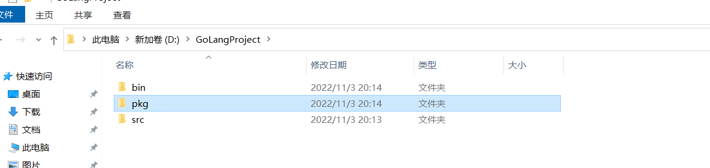


环境变量的含义


cmd窗口输入 go env

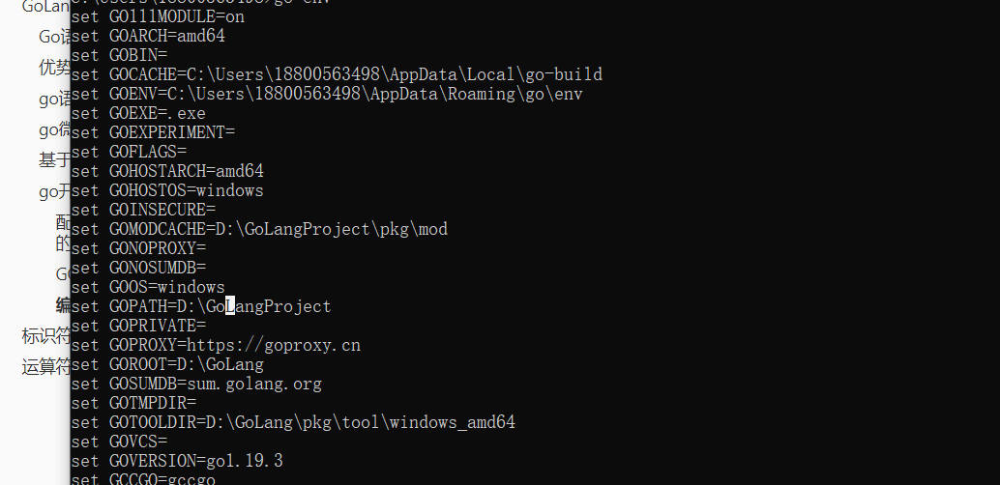


### GOMODULES依赖包查找机制


第三方依赖包下载后放在  GOLang项目路径/pkg/mod下


查找顺序：先找你的在编写的项目里有没有，再去 GOLang项目路径/pkg/mod找，再去 GOLang安装目录/src下去找


goroot 内的bin文件夹内部是go命令的可执行文件。


### 编辑器


线上编辑器(网页版的，不用在计算机上配置环境变量)


#### 使用goland


GOPATH

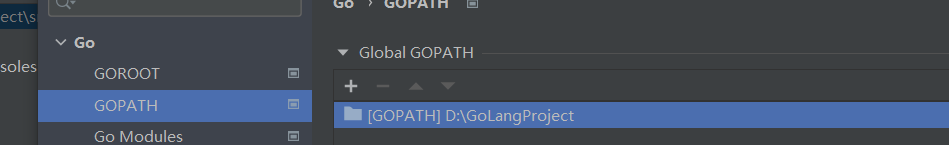

GOROOT

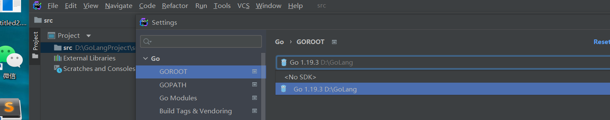


打开项目的方式：选择工作目录下的src文件夹打开即可


勾选使用 Go modules ，再设置一个环境变量GOPROXY

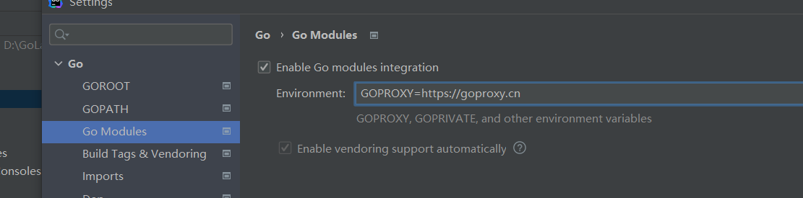


## golang常用命名


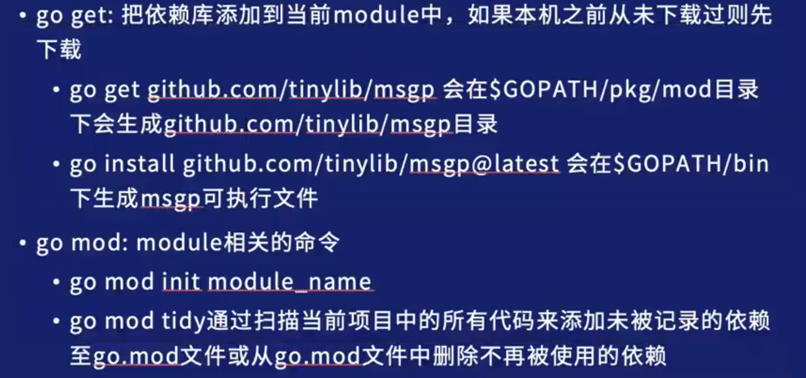


# 第一个GO语言程序

```
package main

import "fmt"

func main() {
	fmt.Print("你好世界")
}
```


# 标识符和关键字

标识符命名方式


go语言关键字，关键字和保留字不能用于标识符

关键字


保留字

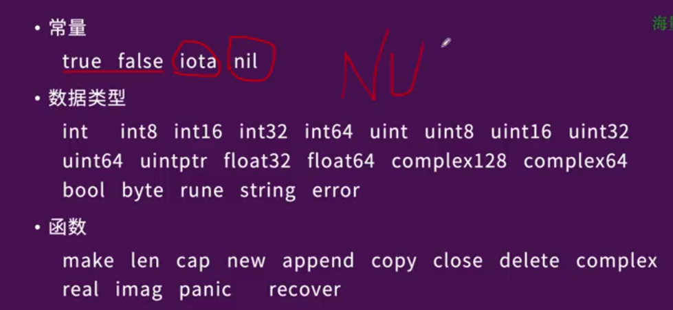


# 运算符

## 算数运算符


## 关系运算符

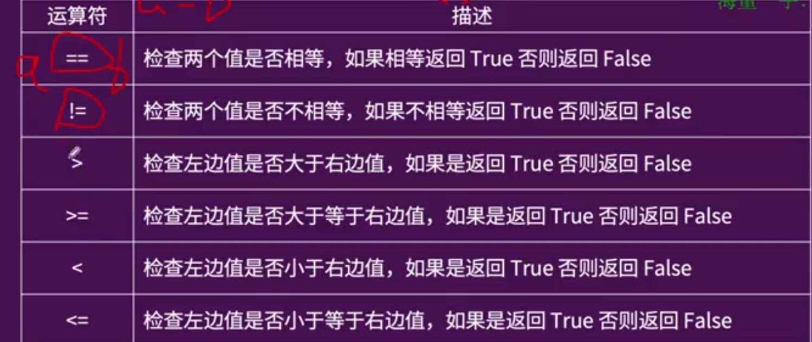


## 逻辑运算符


&& 和 ||是短路的


## 位运算符

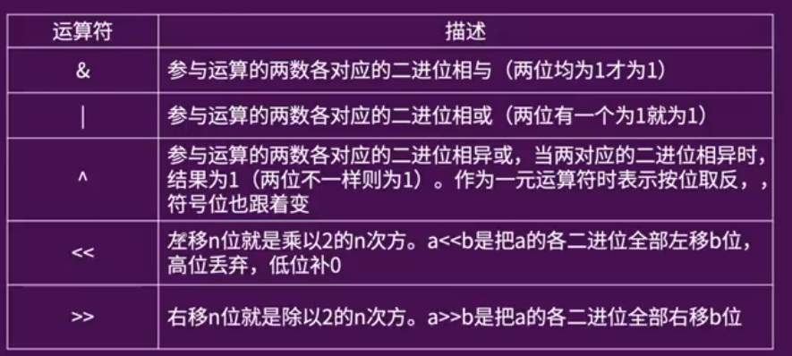


补码 原码按位取反再 +1 变成补码。


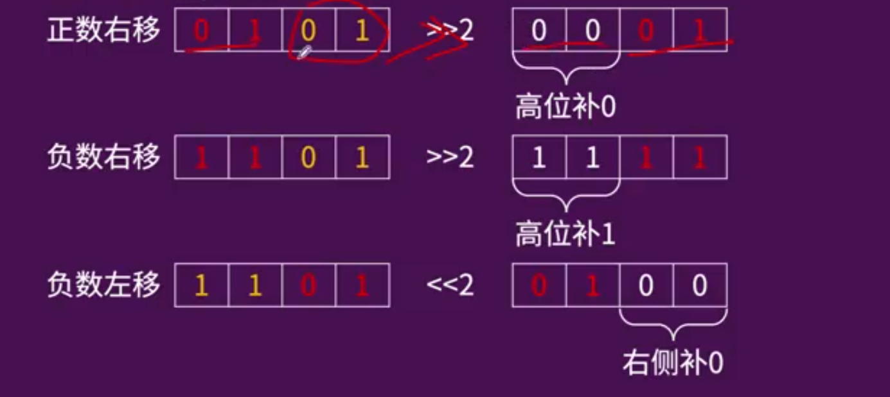

