# **什么是Git**(区分github)


大名鼎鼎的github用的就是git系统来管理它们的网站，这里需要区分一下，github和git是两个东西，**github是一个社区，git是一个服务系统，github只支持git分布式系统，所以故名成为github。**


# **为什么要使用Git**


Git 的出现不需要我们手动管理我们的项目

# **Git和SVN区别**

## SVN是什么

也是一个版本控制系统

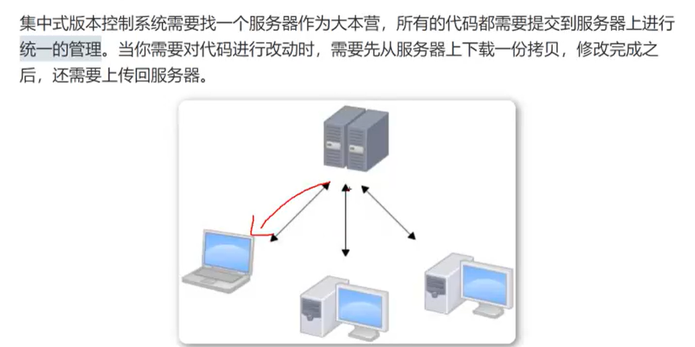


除了git还有svn、cvs这样的版本控制系统，它们的区别在于一个是分布式一个是集中式

集中式就是svn和csv这样的版本控制系统，分布式是git

区别在于集中式的版本控制系统每次在写代码时都需要从服务器中拉取一份下来，并且如果服务器丢失了，那么所有的就都丢失了，你本机客户端仅保存当前的版本信息，换句话说，**集中式就是把代码放在一个服务器上集中管理**，你的所有回滚等操作都需要服务器的支持。

分布式的区别在于，**每个人的电脑都是服务器，当你从主仓库拉取一份代码下来后，你的电脑就是服务器，无需担心主仓库被删或者找不到的情况，你可以自由在本地回滚，提交，当你想把自己的代码提交到主仓库时，只需要<u>合并推送</u>到主仓库就可以了**，同时你可以把自己的代码新建一份仓库分享给其它人。

像集中式它们都有一个主版本号，所有的版本迭代都以这个版本号为主，而分布式因为**每个客户端都是服务器，git没有固定的版本号，但是有一个由哈希算法算出的id，用来回滚用的，同时也有一个master仓库，这个仓库是<u>一切分支仓库的主仓库</u>**，我们可以推送提交到master并合并到主仓库上，主仓库的版本号会迭代一次，我们客户端上的git版本号无论迭代多少次，都跟master无关，只有合并时，master才会迭代一次。


## Git的分布性

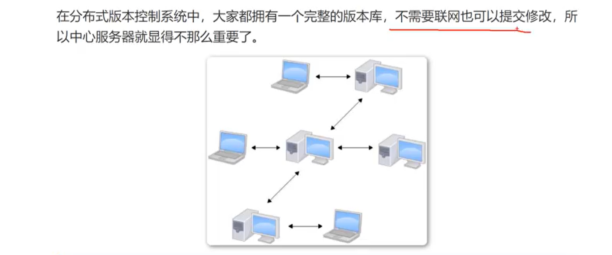


只管哪里变化了，不管变化内容是什么


# **Git工作流程**

git有四大工作区域，目的是让我们协作的时候有规范的工作流程


暂存区相当于一个缓冲区，不可能一修改就进行位置的挪动(哪怕是一点点)，效率太低，操作过于零碎。

把一个功能写完再提交一次，而不是写一行代码提交一次


- 在工作区中修改某些文件
- 对修改后的文件进行快照，然后添加到暂存区中。
- 提交更新，将保存在暂存区的文件快照永久转储到 Git 仓库中


# **Git下载安装**

[Git (git-scm.com)](https://git-scm.com/)


安装过程全部选择默认设置


# **Git基础_环境配置**


```
指令
git config --global user.name "你的用户名"
git config --global user.email "你的邮箱"
```


按下回车，没有提示是最好的


检查当前git的设置信息

```
git --config list
```


在这里做修改也是可以生效的


# **Git基础_初始化本地仓库**


在桌面新建一个文件夹git-text作为例子


打开该文件夹进入内部后再右击调出git黑窗口

必须放在文件夹内部，才能针对文件夹里面进行打开，如果路径打开错误，可以通过cd命令调。

cd命令是linux操作系统的内容


输入 

```
git init
```

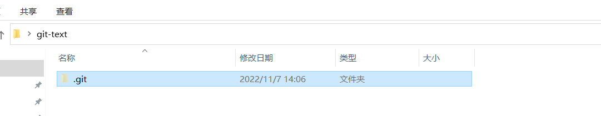

有一个.git 文件夹

.开头的文件表示是隐藏文件


**一个文件夹内部有.git文件夹就表示这个目录接下来会让git进行版本的管理**

.**.git 文件夹所在目录就是工作目录**


# git暂存区与本地仓库的区别

要想深入理解git命令，必须理解git仓库相关的几个概念。先看一下一份本地代码目录D:\gittest目录下：

需要注意的是.git是隐藏目录，需要显示隐藏文件才能看到。


**工作区（working directory）**：简单来说保存在本地的文件或目录都属于工作区，平常修改代码都是在工作区进行的。一般本地的文件，除了隐藏的.git目录，其它都属于工作区。上图中看到的mydir、file1.txt、file2.txt都是属于工作区。
**暂存区（Stage）**：又称索引区（index），顾名思义，它是工作区与本地仓库之间的一个过渡，它记录了工作区的代码状态（有无改动，或者作了哪些改动）。**暂存区位于.git目录中**。
**本地仓库（repository）**:记录了本地代码的状态，**本地仓库位于.git目录中**。


关于状态的理解：
想一下，我们平时在修改一份重要的文件时，肯定要先做一份备份，目的是防止修改出错，最终还能恢复。假如这份文件本身很大，如果如果备份就会占用额外较多的空间，这样就显得不太划算。还有另外一种方式，就是记录文件的修改状态，而不是对文件本身进行备份。文件状态类似如下描述：
文件第一行：将xxx换成了
文件第三行和第四行之间，增加了一行，内容是……
说白了文件状态就是文件的修改记录，根据修改记录我们就可以知道我们对文件作了哪些修改，根据修改记录也可以恢复到文件修改之前的状态。


git status 查看文件在工作区、暂存区、本地仓库之间的变化
git diff 查看工作区与暂存区的差异
git diff --cached 查看暂存区与本地仓库的区别
git diff HEAD 查看工作区与本地仓库之间的差异


使用git commit提交时git会提交到当前仓库中，当前的工作区也就成为了最新一次提交的仓库版本。


# **Git基础_文件的两种状态**


版本控制是对文件的版本控件

文件的两种状态 未跟踪和已跟踪

## 查看文件状态命令

```
git status

可以加入参数 -s 变成 git status -s 实现简介输出
```


要在工作目录中使用 不然提示 not a git repository (or any of the parent directories): .git


html文件是我自己创建的


## untracked 未跟踪状态

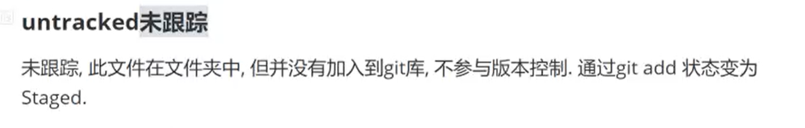

Staged 是已跟踪Tracked 状态的一种 

```
git add 文件名
```


再查看文件状态


## Tracked 已跟踪状态

已跟踪状态又分为三种


## 总结

Untracked：未跟踪，此文件在工作文件夹中，但没有加入到 git 库，不参与版本控制。通过git add 把该文件状态变为 Staged，即把文件放入暂存区中。

Staged：暂存状态，执行 git commit 则将该文件上传到永久库并且本地的这个文件变为 unmodified文件

unmodified 文件：文件已经入库，永久库中文件和本地的这个文件内容一致。

modified文件：相较于永久库中的文件，这个文件已经修改过了，这种情况下，使用 git checkout 指令，从永久库中调用对应文件(曾经提交过的，还没有进行修改的文件)把本地的这个已经修改的文件覆盖。


 git status -s得到的

- ?? 表示 未跟踪状态
- 单个绿色的A表示Staged
- 绿色的A拼红色的M表示Modified


# **Git基础_文件加入暂存区:git add**


指令

```
git add .
```

这个 "**.**"表示当前工作目录**所有未跟踪的文件**和**所有 Modified 的文件**都加入到暂存区(Stage)


git add 命令提交指定的文件

```
git add 需要提交的文件的文件名
```


使用git add命令将文件添加到本地仓库的提交缓存

这个时候还不算添加到了本地仓库，我们还需要使用git commit命令为其添加修改的描述信息


文件被执行 git reset 指令后，文件从 Stage 状态变成 untracked 状态(未跟踪)


# git add 出现的问题

windows平台进行 git add 时，控制台打印警告warning: in the working copy of ‘XXX.py’, LF will be replaced by CRLF the next time Git touches it、


Dos/Windows平台默认换行符：回车（CR）+换行（LF），即’\r\n’
Mac/Linux平台默认换行符：换行（LF），即’\n’
企业服务器一般都是Linux系统进行管理，所以会有替换换行符的需求


解决方法

设置方法一：

```
#提交时转换为LF，检出时转换为CRLF
git config --global core.autocrlf true
```

适用于Windows系统，且一般为Windows默认设置，会在提交时对换行符进行CRLF - LF的转换，检出时又会进行LF - CRLF的转换。


设置方法二：

```
#提交检出均不转换
git config --global core.autocrlf false
```

适用于Windows系统，且只在Windows上开发的情况。在提交、检出时不会对CRLF/LF换行符进行转换


# **Git基础_文件提交**:git commit


git commit 从**暂存区加入到版本库**


如果 不写 -m 参数，会进入 vim 编辑画面


在这里进行编写我们为什么进行提交(提交记录)


## 修改commit提交

改动 Commit 记录的方式

1. 把 .git 目录整个删除(不建议)
2. 使用 git rebase 命令改动历史记录
3. 先把 Commit 用 git reset 命令删除，整理后再重新 Commit
4. 使用 --amend 参数改动最后一次的 Commit。(重点)


```
指令
git log --oneline 查看最近一次提交的描述信息

git commit --amend -m "想要修改成的描述信息"
```


查看历史提交记录

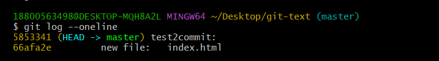

黄色的部分是提交的id号


commit 命令中 加上参数 --amend 修改最后一次提交的信息

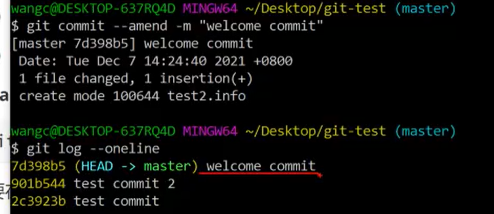


# Git基础_查看历史提交日志:git log以及日志的含义

```
git log
```


这里来解释一下上面提交的信息是什么意思

- **第一行的commit是哈希算法算出的id**

  分布式是没有一个主版本号的，它们都是用id来做标志的，同时用master作为主仓库，其它的分支怎么迭代都不会影响到master，后面我会介绍如何使用分支。

  ```
  commit 0b02e948ad69145bf02b35bcf6e3cad07178cf91
  ```

- 后面的HEAD是指向的意思，表示这次提交到哪儿，HEAD->master代表这次提交到master主仓库，如果是HEAD->分支仓库则代表提交到分支仓库

  ```
  commit 0b02e948ad69145bf02b35bcf6e3cad07178cf91 (HEAD -> master, orgin1/master)
  ```

- Author是提交者是谁的意思，显示格式是：用户名 <邮箱>

  ```
  Author: sudnmf <2429872999@qq.com>
  ```

- Date的意思是提交时间，后面的+0800这个是格林尼治时间，代表当前是以哪儿的时间地作为基准，这是世界时间，用它来作为基数与当前所在地时差进行计算，包括地球自转等公式。

  ```
  Date:   Sat Nov 19 17:24:38 2022 +0800
  ```

- 最下面的是提交的描述，这里我写的描述信息好像是 11

  


如果觉得log打印内容过多，可以加上--pretty=oneline选项简洁输出

```
git log --pretty=oneline
```


 commit 后面的是 id

master 是主分支


# git的历史版本

## HEAD指针的理解

HEAD指的就是 `.git/HEAD` 文件，它存储着当前working directory所处的某次commit，打开文件内容为

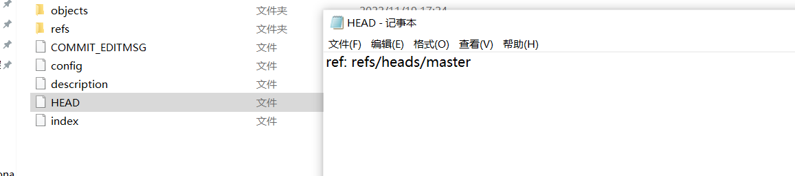

```
ref: refs/heads/master
```


refs目录下存储的是仓库和tags，每个仓库下又有分支，每个tags下又有tag，一个tag对应的某次commit。


```
存储 local master 分支的最新commit对象的SHA-1
refs/heads/master

存储远程仓库 master 分支的最新commit对象的SHA-1
refs/remotes/origin/master

存储tag的SHA-1
tags/xxx
```


**HEAD 是当前分支引用的指针，它总是指向某次commit，默认是上一次的commit。** 这表示 HEAD 将是下一次提交的父结点。 通常，可以把 HEAD 看做你的上一次提交的快照。当然HEAD的指向是可以改变的，比如你提交了commit，切换了仓库，分支，或者回滚了版本，切换了tag等。


1. 我们在git中的每一次 git commit 操作就会提交一个历史版本；
2. 每一个历史版本都有一个**唯一的hash值进行记录**；
3. 每一个历史版本实际上就是我们对工作区中的内容修改的一次记录；

4. 因此，当我们像退回到某个修改的时候，只需要退回到某个版本即可。

5. 在git的版本管理中，**有一个叫做`HEAD`的标记，这个标记就是一个用来指向<u>当前版本的指针</u>**；

6. 因此，当我们进行版本回退或版本切换的时候，实际上是移动HEAD指针的位置。

7. 版本回退或版本穿梭之后，可以在对应的版本上进行操作，及提交，提交后便会正常生成一次历史记录。


## git历史查看命令

1.git log : 查看详细历史记录，按提交时间倒叙排列，包含提交时间，提交作者，提交备注以及提交的hash值；
2.git log --pretty=oneline : 格式化log形式，每条log只有一行，只包含 完整的hash值 和 提交的备注；
3.git log --oneline : 格式化log形式，每条log只有一行，只包含 短hash值 和 提交的备注；

【注】2和3的区别就是 展示的hash值的长短，短hash就是完整hash截取了前7位的表示形式。

4.git log -n 3 : 只展示最新的 几条 日志，-n 后面的数字就表示 要展示的条数;
5.git log --graph : 会展示历史提交的分支路线;

【注】 参数可以结合使用!
      比如 git log --oneline -n 3 : 即一行一行的展示+只展示最近的3次提交记录;
      比如 git log --oneline --graph : 即一行一行的展示+展示提交的路线;

6.git reflog : 展示短hash+HEAD{n}+提交备注，非常方便用来进行历史版本的回退与任意版本的切换；
7.git reflog -n 2 : 表示只看最近的两次提交

【注】 git log 和 git reflog 的区别：
            git log : 只展示 当前版本之前的版本，即HEAD指针指向的版本及之前的历史版本；
            git reflog : 会展示所有的历史提交版本，非常的全。

8.git log --stat : 可以查看历史提交的改动的文件

## git历史查看命令使用效果

```
$ git log
```


```
git log --pretty=oneline
```


```
git log --oneline
```


git log -n 3 : 只展示最新的 几条 日志，-n 后面的数字就表示 要展示的条数;

```
git log -n 2
```


```
git log --oneline -n 2
```


```
git log --graph
```


```
 git log --oneline --graph
```


```
 git reflog
```

展示短hash+HEAD{n}+提交备注，非常方便用来进行历史版本的回退与任意版本的切换；


```
git reflog -n 2
```


## git的版本回退操作

操作思路 ： 
  1.使用 git log 或者 git reflog 命令 获取到要回退或者切换的版本id
  2.使用 git reset --hard命令回退/切换到某个历史版本；
  3.git reset --hard 命令会重置  本地仓库、暂存区和工作区，三者的状态保持一致！


```
版本回退/切换的命令：
1.git reset --hard [索引值] : 可切换到任意版本[推荐使用这个方式]
2.git reset --hard HEAD^ ： 只能后退，一个 ^ 表示回退一个版本，两个^ 表示回退两个版本，。。。依次类推
3.git reset --hard HEAD~n ：只能后退，n表示后退n个版本
```


 git reset --hard HEAD^

```
^ : 一个^ 表示回退HEAD前的一个版本；
    两个^表示回退两个版本；
    三个^表示回退三个版本；

    。。。。。。
    n个^表示回退n个版本
```


操作举例


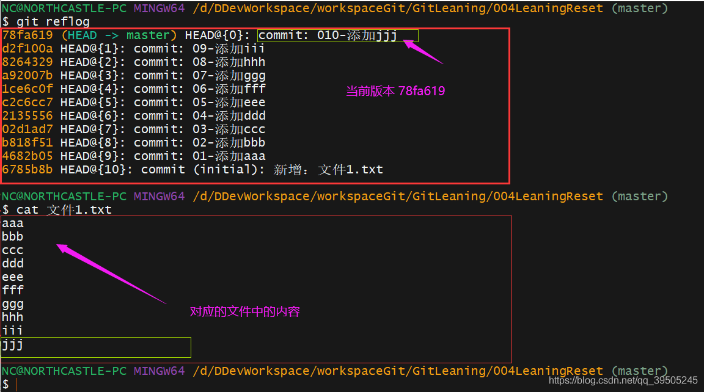

回退到上一个版本


git reset --hard HEAD~n

```
~n : 表示直接回退到 n 个版本；
是 ^ 参数的简写
```


回退三个版本

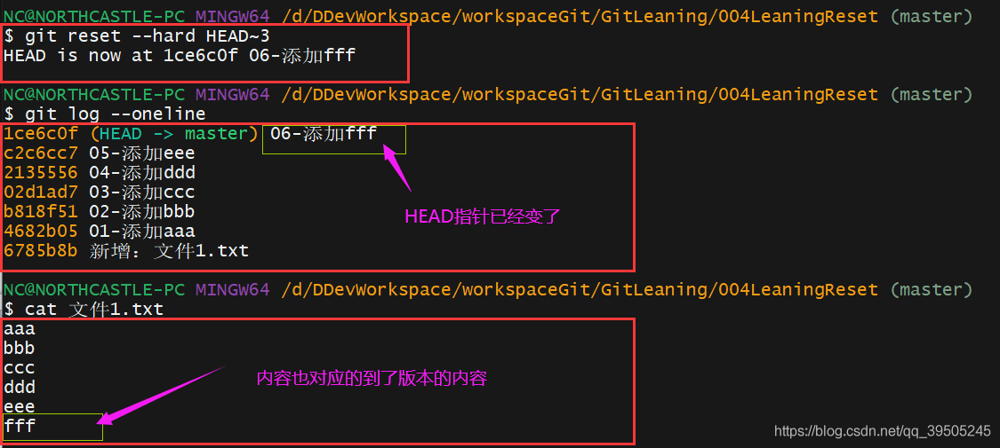

git reset --hard

1. 上面的两种方式只能往之前的版本切换；

2. 如果想进行任意版本的切换，就可以直接使用 git reset --hard [索引值] 命令；
3.  配合 git reflog 命令可以查看到所有的历史版本的提交。


穿梭到最新的版本 78fa619 版本


扩展 git reset 的其他参数（了解）


## 通过reset 命令进行版本的时光穿梭(前往过去和前往未来)

### 例子背景


已经有三次提交，当前是第三次提交(HEAD 指针指向的是第三次 commit)

### 前往过去

执行一次，回到当前版本前一个版本

```
git reset --hard HEAD^  
```


工作区内容也会发生变化


再回到前一个版本


工作区内容同样变化


### 前往未来

如果我们当前在最老的版本，那么 git log 只会显示当前 HEAD指针指向的commit 的之前的版本。


无法通过 git log 获取将来的commit 的哈希值

我们可以通过指令 git reflog 获取将来我们想要前往的 commit 的 哈希值


通过 

```
git reset --hard commit的哈希值
```

前往我们想要前往的 commit 版本，过去还是未来都可以


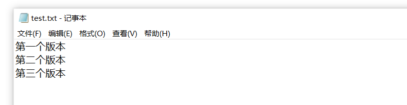

再回到过去


# git基本组成框架：Workspace、Index / Stage、Repository、Remote

- Workspace：开发者工作区
- Index / Stage：暂存区/缓存区
- Repository：仓库区（或本地仓库）
- Remote：远程仓库

Workspace：开发者工作区，也就是你当前写代码的目录，它一般保持的是最新仓库代码。(.git文件夹所在的目录)

Index / Stage：缓存区，最早叫Stage，现在新版本已经改成index，位于.git目录中，它用来存放临时动作，比如我们做了git add或者git rm，都是把文件提交到缓存区，这是可以撤销的，然后在通过git commit将缓存区的内容提交到本地仓库(在.git 文件夹内)

Repository：仓库区，是仓库代码，你所有的提交都在这里，git会保存好每一个历史版本，存放在仓库区，它可以是服务端的也可以是本地的，因为在分布式中，任何人都可以是主仓库。(在.git 文件夹内)

Remote：远程仓库，只能是别的电脑上的仓库，即服务器仓库。


# git 查看文件状态git status

git status是用来**检查当前项目下所有文件状态**，在git管理中文件有四种阶段，分别是未跟踪的(Untracked)、未更改的(Unmoified)、发生更改的(Modified)、暂存的更改(Staged)。


当我们在克隆仓库后立刻使用此命令，会看到这样的输出：


这说明你现在的工作目录相当干净。换句话说，所有已跟踪文件在上次提交后都未被更改过。
git status 命令可以添加参数，这样打印出来的内容会简略显示文件状态，这种打印称为状态简览


```
git status [<选项> …] [--] [<路径名> …]

提示：方括号 [ ] 表示可选，...表示可以有多项。
```


-s 精简输出

**第一列**(绿色的)字符表示**版本库**与**暂存区**之间的比较状态。
**第二列**(红色的)字符表示**暂存区**与**工作区**之间的比较状态


`' '` （空格）表示文件未发生更改
`M` 表示文件发生改动。
`A` 表示新增文件。
`D` 表示删除文件。
`R` 表示重命名。
`C` 表示复制。
`U` 表示更新但未合并。
`?` 表示未跟踪文件。
`!` 表示忽略文件。

**如果<u>提交了(commit)的文件，且没有改动的</u>**，不会显示到这个里面

## 文件各个时期状态

要明确文件状态有两种，一种是相对

1.未跟踪的(Untracked)
当文件第一次被创建时，git不会马上跟踪上这个文件，此时打印出来的状态是这样的


这时文件 index.css 文件刚刚新建，没有被跟踪，如果想跟踪这个文件的话，需要使用命令

```
git add <files>
```

2.未更改的(Unmodified)
文件被 git 跟踪，但没有发生更改，**这种状态的文件不会出现在 git status 所打印出来的状态列表中**


3.发生更改的(Modified)
文件被 git 跟踪，而且发生了更改，此时打印出来的状态是这样的


暂存区与工作区相比，工作区改变了


No commits yet 表示还没有提交过


4.改文件该没有提交就已经进行了修改，现在我们把工作区的修改进行暂存

再使用一次 git add


5.对文件提交到本地仓库

git commit 执行过后，再执行 git status

会发现什么都没有

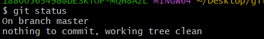


因为**如果<u>提交了(commit)的文件，且没有改动的</u>**，不会显示到git status 展示页面中

6.已经提交过后，对文件进行修改

修改过后，再 git status

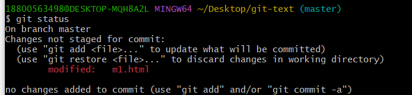

**第一列**(绿色的)字符表示**版本库**与**暂存区**之间的比较状态。
**第二列**(红色的)字符表示**暂存区**与**工作区**之间的比较状态


7.已经提交过后，并且对文件修改，并且再把这次修改添加到暂存区

执行 git add以后


版本区和暂存区的相比是修改过了


8.再次进行提交(缓冲区加到本地仓库中)

git commit -m ""


# Git基础_回滚代码仓库：git reset

```
git reset 模式(--hard --soft --mixed)
```

回滚工作区中的文件到历史版本

有三种模式

--soft 、--mixed以及--hard是三个恢复等级。

- 使用--soft就仅仅将头指针恢复，**已经add的暂存区以及工作空间的所有东西都不变**。
- 如果使用--mixed(默认)，就将头恢复掉，已经add的暂存区也会丢失掉，**工作空间的代码什么的是不变的**。
- 如果使用--hard，那么一切就全都恢复了，头指针变，add的暂存区消失，代码什么的也恢复到以前状态。


有多种回滚方式

1. 回滚到**指定历史版本**

   先使用git log查看历史版本，再使用**git reset --hard**命令回滚

   ```
   git reset --hard 要回滚id
   ```

   

2. 回滚**当前仓库指向的版本**

   **HEAD(指针)是指向当前仓库的**，历史版本中可能有别的分支，我们只想迭代我们仓库的上一个版本，这个很简单，我们只需要用HEAD来指向就可以了。

   

   ```
   git reset --hard HEAD^
   ```

   ^代表上一个版本的意思，HEAD代表当前仓库的指向，当前HEAD指向master，就代表回滚到master上一次提交的版本

   

   当然我们也可以使用另外一种方式来回滚到当前仓库的指定版本

   ```
   git reset --hard HEAD~3
   ```

   后面的~3，代表以当前版本为基数，回滚多少次。HEAD~3代表回滚master前三个版本


# 修改缓存区内容：git add、git commit -m

比如我们使用git add添加了一个名为min.c的文件，但是还没有提交的时候我们修改了它的内容，修改完成之后在提交会发现内容并不是我们第二次修改的内容

这就要说一点，**当我们使用git add添加到缓存区的内容后，我们在修改这个文件时，它跟缓冲区内容是没有任何关系的**！

**我们使用git commit提交的时**，**它只会提交缓存区内容**

如果**想提交第二次修改，我们只需要在git add一次，然后在使用git commit提交就可以了，git会自动帮我们合并提交**

例子：

下面的例子中先 git add ，再修改文件，再git add


# 将改动文件添加到缓存区：git add

平时我们可能写代码的时候不可能保证只改动了一个文件，我们切来切去最后都不知道自己改了哪些文件，为了保证所有的文件都能被准确提交，我们可以使用git add我们确定修改的文件，当git add后在使用status查看一下状态，看看是否有遗漏没有提交的文件：

```
git add min.c 
```


# 将所有改动文件添加到缓存区：git add --all、git add .

如果你实在不确信哪些文件是改动过的，你只需要使用(全部提交到缓存区)

```
git add --all
```


这个命令会将当前目录下包括子目录下所有改动的文件提交到暂存区，注意只包括改动的文件，不改动的不会放到缓存区。

这个命令还会把删除的文件也提交进去

**如你在本地删除了min.c 这个命令会把删除信息也记录进去，然后在提交的时候把仓库里对应的min.c也删除掉，也就是说你在本地做的删除操作会被记录**，提交仓库时会删除同样的文件(删除在仓库中的文件)。

如果不想删除文件，可以使用git add .

```
git add .
```

注意后面有一个“.”点的符号，这个命令跟git add --all一样，但是不会记录删除操作。

最后别忘记使用git commit提交到仓库中。


# 查看单个文件可回滚版本：git log "文件名"??

```
git log "文件名"
```

当我们想**回滚指定文件到指定版本**时，需要**查看该文件有多少个版本可以回滚时，可以使用git log filename命令**


commit 后面一串序号都是版本

再使用 git reset 命令将其回滚就可以。

```
git reset 版本号 文件名
```

git reset 默认是使用 mixed  模式


回滚完成后再 git add 和 git commit 就可以提交到本地仓库中


# git rm删除文件

删除，如果你是要从版本库中删除改文件

确实要从版本库中删除该文件，使用

git rm，并且git commit，两个都要执行。

删除文件也是一种修改文件，git rm会把 **什么文件被删除了** 也保存到暂存区进行记录。

**新提交的版本库就会把那个想要删除的文件删去了，但是<u>历史版本库中该文件</u>依旧存在。**


现在我是第三次提交的版本


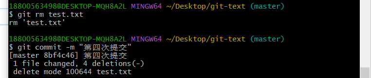

git rm 把 test.txt 文件删除，并且第四次提交。

当前工作区中也没有这个文件了。


我们使用历史回滚的功能回滚到以前

```
git reset --hard HEAD^  
```


这个文件就又回来了。


说明在库中删除文件只是生成了一个该文件被删除的版本，更老版本中该文件依旧存在。


# 恢复文件：git reset、git checkout

## git rm删除并且commit 提交删除了

上面已经讲过，**如果已经git rm删除并且commit 提交删除了**，可以git reset 读取被删除文件还存在的档位(历史版本)来还原。

如果有多个文件，但是只有个别文件被删掉了，希望不改变当前文件还能获取旧文件。

这里给一个方法，就是**把当前目录全部提交一次(提交成最新版本代码)**，这样做是为了防止我们等下回滚的时候导致一些修改的文件被替换掉了，**然后我们回滚到有那个文件的版本，将那个文件copy到别的文件目录**，这个文件目录要是你记得的，然后**再回滚到最新版本代码，在将那个文件copy回来**，在提交进去。


## **已经 git rm 但是还没有 commit**

1. 先  **git reset**，表示重置缓存区操作

2. 重置完成之后在使用git checkout命令将文件取消操作

   ```
   git checkout 被删除的文件的名字
   ```

   


## 只是修改文件

如果**只是文件进行了修改，并不是 git rm 删除**

还可以使用 git checkout


checkout命令的功能是切换分支。

**这个命令加上 -- 可以用来将文件切换到最近一次的状态。**

这个恢复只能恢复到上一次提交(commit)的状态，比如你刚刚提交了这个文件到仓库，随后你修改了它， 那么使用这个命令会回到提交后的状态(和提交的状态一致)，不能回到提交前的状态(必须先提交才有这个功能)。

```
git checkout -- 文件名
         注意这里有两个空格
```

**这个功能不能一直迭代恢复，你回到了修改之前的版本，但是不能回到修改前再之前的版本**


例子

这是刚提交完的状态


做修改


再打开文件，发现和刚提交的一样


# git创建分支：git branch、git checkout

使用git checkout -b参数来创建一个分支，创建完成分支后会自动切换过去

```
git checkout -b 分支名
```


然后我们在使用branch来查看当前属于哪个分支，也就是查看HEAD的指向

```
git branch
```


```
git checkout -b 分支名
等价于
git branch 分支名
git checkout 分支名
```

git branch 如果后面跟着名字则会**创建分支，但不会切换**

git checkout **后面如果是分支名称则切换过去**


# git切换分支：git checkout

当我们想切换分支可以使用git checkout来切换，如刚刚我们创建了一个分支并切换了过去，现在切换回master

```
git checkout master
```

git checkout的作用是检出，如果是文件的话，会放弃对文件的缓存区操作，但是要使用reset重置一下变更才行。

**git checkout 文件名**：放弃对文件的缓存区操作。 比如 已经 git rm 了 但是 没有 提交，git reset 再 git checkout 文件名，放弃删除操作

**git checkout 分支名**：如果是分支的话会切换过去。


# git合并分支：git merge

当我们新建分支并做完工作之后，想要把分支提交至master，**只需要切换到master仓库，并执行git merge 分支名就可以了**

```
git merge 分支名
当前分支合并 指定分支名的分支
```

testb 分支中新创建了两个文件 testb_1.txt 和 testb_2.txt，并且都添加到 git add 和 commit

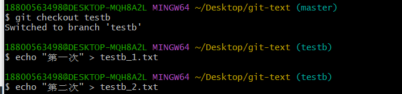


在不同分支创建的文件都会在工作区中显示


切换到 master 分支再合并 testb 分支


如果你在任何分支下创建文件，没有提交到仓库，那么它在所有仓库都是可见的，比如你在分支testb中创建了一个文件，没有使用git add和git commit提交，此时你切换到master，这个文件依旧存在的，因为你创建的文件在工作目录中，你切换仓库(分支)时git只会更新跟仓库有关的文件，无关的文件依然存放在工作区。

同时我们可以看到历史版本中有分支提交的历史


# git查看分支：git branch -a

如果要查看当前所有分支可以使用：git branch -a

HEAD指向当前分支


星号表示当前所在分支

# git删除本地分支：git branch -D

```
git branch -D 分支名
```


# git删除远程分支：git push origin --delete

注意这里的远程分支名不需要加origin，输入分支名就可以了

```
git push origin --delete 远程分支名
```

# 在开发中git分支的重要性


当我们在开发中，无论做什么操作都建议使用分支，因为在团队开发中，master只有一个，合作开发里任何人都可以从master里拉取代码，拉取时master后创建分支，分支名改为你要做的操作，比如修改某某文件，修改什么什么bug，单词以下划线做分割，然后在提交一个版本

分支名必须简洁，和标题一样，提交的commit在简单描述一下就可以了。

如我们的master中有个bug，是内存泄漏

我们可以常见一个分支名为Memory_Leak,然后在commit里简单描述一下修复了哪个模块的内存泄漏，不要写修复了什么什么代码，什么什么问题导致的，只需要简单描述一下就可以了。

一般情况下，我们都是拉取master后，想要修改功能或者添加功能，都是创建分支，在分支里修改不影响master，如果修改错了代码或者误删之类的，在从master上拉取一份就可以了。
C 4.0 BY-SA版权协议，转载请附上原文出处链接及本声明。

# github的使用

github是一款使用git命令作为基础框架的网站，它是一款开源分享网站，你开源把你的源代码放到github上，然后让人来start给你小星星，小星星越多代表你的项目越具有影响力，很多公司面试如果你有一个很多星星的项目，会大大提升你的录取率。

你也可以把你的一些项目分享到github上保存，github上是无限制代码的。

1. 首先到**github上注册一个你的账号**

2. **在本地创建一个ssh的key，因为github是使用ssh服务进行通讯的**

   ```
   ssh-keygen -t rsa -C "your_email@example.com"
   ```

   -t 指定密钥类型，默认是 rsa ，可以省略。
   -C 设置注释文字，比如邮箱。
   -f 指定密钥文件存储文件名，一般我们默认，让存储到默认路径以及默认文件名

   

   它会要求输入Enter file in which to save the key (/home/stephenzhou/.ssh/id_rsa)

   

   这里是生成的sshkey文件名，我们可以回车使用默认文件名(在这里直接回车)

   

   

   除此之外还会让你输入

   Created directory '/home/stephenzhou/.ssh'.
   Enter passphrase (empty for no passphrase): 

   

   这个密码会在让你push提交时候要输入的，除了git登录密码，还要输入这个密码，直接回车则空密码，**这里我们直接回车**

   这里直接回车 表示空密码，没有密码。

   

   接着会让你在此输入密码，验证这里依旧回车

   Enter same passphrase again：

   

   验证密码接着是空密码，也是直接回车

   生成之后你就会看到这样的界面:
   

   生成的ssh文件如果不使用-f指定的话会生成在用户目录下的.ssh目录中，.ssh是隐藏文件，可以使用ls -ah看到，使用cd ~进入用户主目录，然后cd进入到.ssh目录中可以看到文件

   我使用 windows 直接可视化界面

   

   id_rsa是私匙，id_rsa.pub是公匙，id_rsa不能告诉任何人，只有公钥可以，ssh采用的是非对称加密。

   接着在github上添加你的**公钥**

   在这个网址

   [Add new SSH keys (github.com)](https://github.com/settings/ssh/new)

   

   添加公钥

   

   再次输入密码

   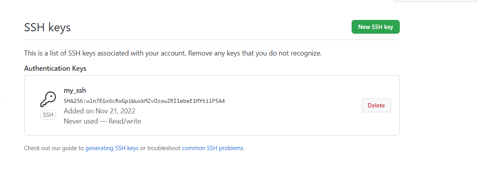

   添加成功

   

你可以添加如很多个ssh，比如你有多台电脑，在每个电脑上都配置ssh然后添加进来就可以了，git需要这个是要确定你是主人，确定是主人的机器推送的才可以推送到仓库中，但是你可以创建公开仓库，别人只能拉取不能推送到这个仓库中，你可以给其它人权限。

找到你要开放的仓库，选择Manage access然后使用invite a cikkaborator添加成员就可以了。


# github上创建仓库

我们可以在github上创建一个仓库


网址

[Create a New Repository (github.com)](https://github.com/new)


进行一些基础的配置


创建完成之后的样子

什么也没有，只有一个readme文件


# github将本地仓库关联到远程仓库：git remote add origin

我们本地有一个仓库，我们想把它推送到远程上去，很简单，我们只需要使用git remote add origin命令就可以了，

指令

```
git remote add origin 远程仓库链接
```

origin是github上的仓库名称，意思是远程仓库的意思。

首先选择仓库的code找到github生成的远程仓库链接。


然后进行关联

```
git remote add origin git@github.com:sudnmf/testforgithub.git
```


然后使用git push推送到远程

```
git push -u origin master
```

该指令意义

- push：将本地仓库与远程仓库合并

- -u：**将本地仓库分支与远程仓库分支一起合并**，就是说将master的分支也提交上去，这样你就可以在远程仓库上看到你在本地仓库的master中创建了多少分支，**不加这个参数只将当前的master与远程的合并，没有分支的历史记录，也不能切换分支**
- origin：远程仓库的意思，如果这个仓库是远程的那么必须使用这个选项

- master：**提交本地master分支仓库**


注意第一次提交ssh会让你验证是否来自github

The authenticity of host 'github.com (13.229.188.59)' can't be established.
RSA key fingerprint is SHA256:nThbg6kXUpJWGl7E1IGOCspRomTxdCARLviKw6E5SY8.
Are you sure you want to continue connecting (yes/no/[fingerprint])? yes


直接输入 yes


我们不需要登录，因为github上的ssh列表里有这台机器

注意第一次的时候加上-u就可以了，因为我们本地其它可能有很多分支也提交上去，以后只提交最新代码就可以了

```
git push origin master
```

-u 参数只需要第一次 push 添加，之后的 push 都不需要添加这个参数

不需要在提交其它分支


这个时候你可以在github上看到有提交记录


但是什么都没有，因为这个分支是main，我们提交的是master

选中它然后切换到master


有我们写的文件了


默认是没有master的，master是我们新添加的分支

github上已经**默认是main作为主仓库了**，这个原因是因为种族运动的原因，master也代表主人，类似奴隶制，所以github已经替换默认master为main

# git将远程仓库关联到本地和拉取指定分支、切换远程分支：git clone

当我们远程有仓库时，想要关联到本地只需要使用git clone就可以了

新建一个空目录，不要git init(不需要有 .git 文件夹)

使用git clone会自动帮我们初始化

```
git clone 远程仓库地址
```


鉴于刚刚的，我们上传的代码在远程仓库中有一个默认的main和master，由于我们最初上传的分支是master，所以github给我们创建了一个新的分支叫master，并没有关联到main中，我们拉取时，**默认拉取的是main分支**


所以我们可以使用git clone -b分支名 仓库地址来指定分支

```
git clone -b 分支名 仓库地址
```


master 分支的文件内容


# github提交本地仓库到远程仓库：git add、git commit、git push

我们修改了master上的分支代码，然后使用git add提交到缓存区，再使用commit提交到本地仓库，再使用push推送到远程就可以了，非常简单，命令都是我们学过的


- 对文件进行修改
- git add .
- git commit -m 描述信息
- git push origin master


# git修改分支名称：git branch -m

使用-m选项

```
git branch -m 分支名 新的分支名
```


# git保存当前工作切换分支：git stash

在你当前工作区修改了文件或者其它功能时，你想要切换或者创建到其它分区是不可能的。

我们分支修改了内容，想要切换到其它分区git会终止你这样操作，为的是防止丢失当前工作区内容。

我们可以使用git stash命令来保存当前工作状态。


能够将所有未提交的修改（工作区和暂存区）保存至堆栈中，用于后续恢复当前工作目录。

1. `git stash` 是本地的，不会上传到服务器上；

# **Git基础_文件添加至忽略列**


举例


ｌｌ　－ａ　指令显示隐藏文件


ｖｉｍ　．ｇｉｔｉｇｎｏｒｅ

忽略所有的ｊａｖａ文件


又写了一个　HｅｌｌｏWｏｒlｄ．ｊａｖａ


中间使用　ｖｉｍ．ｇｉｔｉｇｎｏｒｅ　把忽略效果去掉了


# **Git基础_比较文件差异**


**没写完**

# **Git基础_还原文件**


# **Git远程仓库_常见的Git托管平台**


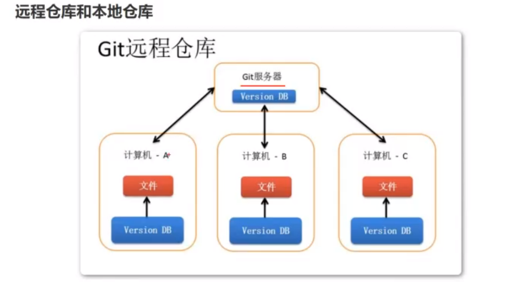


# **Git远程仓库_远程仓库操作**


**一个本地仓库可以添加不止一个远程仓库,可以多个**


# **Git远程仓库_注册码云(Gitee)和创建远程仓库**


创建远程仓库


创建完成后


HTTPS SSH 是远程仓库的地址

```
https://gitee.com/wirjn/njupt1.git
```


# **Git远程仓库_推送、抓取和拉取**

添加远程仓库地址


## 推送


**在推送之前一定要有 git commit  命令进行提交**

不然会出现

```
error: src refspec master does not match any
error: failed to push some refs to 'https://gitee.com/wirjn/njupt1.git'
```


让输入账号密码就输入


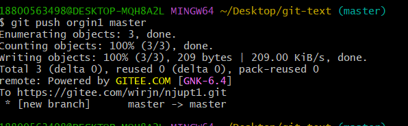


提交以后

本地仓库的东西就会放入远程仓库，并且**忽略忽略列**


## 克隆远程仓库


点击橙色的这里，获取下载链接


在新建文件夹中使用 bash命令


把地址粘贴上来


克隆好的目录点进去才是工作目录


## 抓取

我们拥有远程仓库的其中一些文件，但少了几个，我们可以通过 git fetch 把缺少的文件补全。


git fetch 以后是把代码放到暂存区了

fetch 获取之后不会把远程仓库的代码和本地仓库的代码进行合并，我们需要手动合并，相对远程仓库缺少的文件才会出现

```
git merge origin1/master
```


比如


我们本地仓库中把 a2.txt 删了，希望能够从远程仓库中抓取缺少的


再合并


## 拉取


