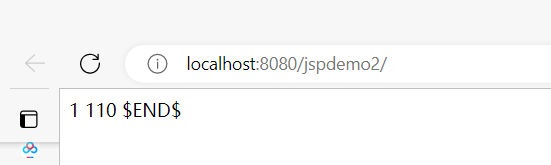
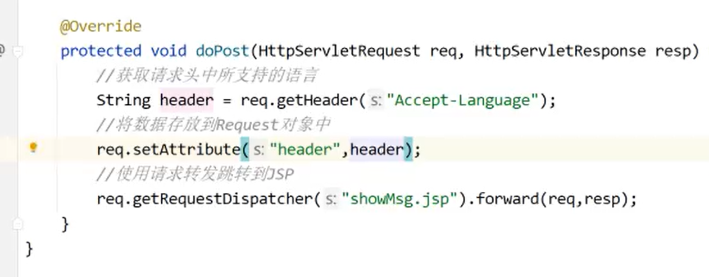
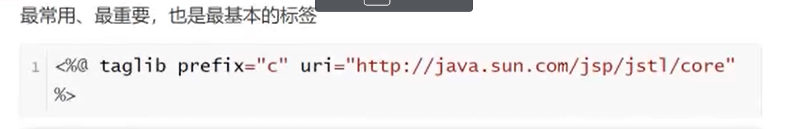

# **JSP简介**


## 前后端分离


# JSP原理

JSP是运行在服务端的视图技术


客户端请求.jsp时候，如果这个.jsp是第一次被请求，那么web容器(tomcat)，把.jsp转换成servlet并执行这个servlet

怎么转换成servlet：先转换成.java的源文件，该文件名字是 xxx_jsp.java

web容器并不是每次有浏览器请求jsp都会进行编译。只有两种情况会进行编译

一：.jsp第一次被请求    二：该.jsp发生修改了


这里是IDEA创建出来的复制Tomcat的目录


内部全是 java 代码


# 引入 JSP jar包


# **JSP三种原始标签**


原始标签在jsp任何版本都能使用。但还有些标签对jsp版本有要求

java代码不允许随处编写，必须放在特定java标签内

html代码放置位置是任意的

## JSP声明标签

<%!    %> 中的内容会出现在 Servlet 的 class的{} 中


看index.jsp中我们写的java代码会出现在哪里


## **JSP脚本标签**

<%    %>

脚本标签被编译后出现在 _jspService 的方法体中，所以只能写局部变量不能写方法


## **JSP赋值标签**


<%=               %>

赋值标签中的内容最后不要加 分号;

```
<%@ page contentType="text/html;charset=UTF-8" language="java" %>
<html>
  <head>
    <title>$Title$</title>
  </head>
  <body>
  <%!
    int a=1;
    int fun(int a,int b){return a+b;}
  %>

  <%= 1%>
  <%= fun(10,100)%>
  $END$
  </body>
</html>
```


三种原始标签就是 对应 java 代码中的三个 位置 分别 类大括号  方法大括号    要打印的内容



## **JSP三种原始标签的使用**

**jsp原始标签不允许彼此之间嵌套**


jsp页面模拟抽奖功能

```
<%@ page import="java.util.Random" %><%--
  Created by IntelliJ IDEA.
  User: 18800563498
  Date: 2022/11/5
  Time: 15:43
  To change this template use File | Settings | File Templates.
--%>
<%@ page contentType="text/html;charset=UTF-8" language="java" %>
<html>
<head>
    <title>Title</title>
</head>
<body>
<%
    int flag = new Random().nextInt(100);
    String str = "";
    if(flag<=20){
        str="中奖了";
    }else{
        str="再试试";
    }
%>
<%= str%>
</body>
</html>

```


也可以


```
<%@ page import="java.util.Random" %><%--
  Created by IntelliJ IDEA.
  User: 18800563498
  Date: 2022/11/5
  Time: 15:43
  To change this template use File | Settings | File Templates.
--%>
<%@ page contentType="text/html;charset=UTF-8" language="java" %>
<html>
<head>
    <title>Title</title>
</head>
<body>
<%
    int flag = new Random().nextInt(100);
    if(flag<=20){ // 满足flag<=20 就输出 中奖了 这个范围的内容
%>
中奖了
<%}else
%>
</body>
</html>
```


# JSP指令标签


属性之间用 空格分隔，属性的值之间用,分隔


page指令标签的含义

```
<%@ page import="java.util.Random" %>
<%@ page contentType="text/html;charset=UTF-8" language="java" %>
```

## page指令标签以及属性


contentType 后面那个编码能够设置页面编码和响应编码，如果pageEncoding属性也设置后那么页面属性看页面编码


session 属性 默认是 true ，建立会话


## include指令标签


## TagLib标签


# **JSP的内置对象**


# **请求转发**


## 请求转发与重定向的区别


请求转发完全是服务端内部发生的，与客户端无关

请求转发全程只有一个 request，而重定向会有两个响应，第一个request在产生响应的时候生命周期就结束了

DML 表示添加修改删除数据库。查询要使用请求转发

## **请求转发案例**

Servlet去做视图的查询，jsp去做视图的生成。jsp中通常不会有过的的java代码




getRequestDispatcher(相对路径) 该相对路径 是默认在项目中webapps 文件夹内  

getRequestDispatcher(你写的路径)  就相当于访问     webapps/你写的路径 


# **JSP四大作用域对象**


request对象通常用于数据的存储

# **JSTL标签库介绍**


## JSTL标签分类

### 核心标签



taglib prefix = "c" 必须是c


### 格式化标签


### sql标签(没啥用)


### xml标签

## JSTL函数


# **EL表达式介绍**


使用 EL表达式取出作用域中的值


# JSTL标签库与EL表达式的使用


