javaEE简介**


上面很多的技术都会被框架代替

JDBC将来会使用 MyBatis代替

Servlet 将来会使用 SpringMVC代替


JavaEE版本并不是jdk的版本


# 服务器

## 服务器简介


软件服务器分为 文件服务器 数据库服务器 应用程序服务器。

## 服务器分类


## javaee应用服务器


可以执行javaee开发的web项目都是实现了javaee中定义的接口的服务器。

## web容器

web容器只实现了 javaee平台下部分技术标准


将来的开发使用 web容器 + 开源框架


# Tomcat使用

## 简介

tomcat的开发也使用了java代码，需要提前安装jdk


## Tomcat版本说明


使用tomcat 9 

## tomcat作用


web服务器获取请求并交给 servlet 处理，并把响应返回

tomcat三个功能

1.web服务器

2.jsp容器

3.servlet容器


# Tomcat 下载和安装

## 下载

下载地址 ：http://tomcat.apache.org/

## 安装

选择tomcat9


下载完成解压使用即可

## 环境变量


注意CLASS_PATH的配置


# Tomcat目录结构与介绍


bin目录：


conf目录，配置文件

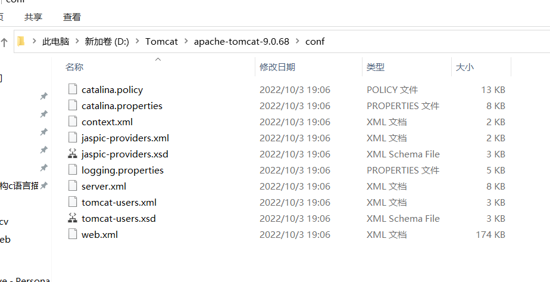

lib目录：存放运行时需要的 jar 包


jsp-api.jar 和 servlet-api.jar 是对 javaee技术规范的具体实现


work目录，jsp会被编译成servlet保存到 work目录当中


webapps 存放应用程序，存放项目。

.war 放在 webapps目录下，启动的时候tomcat自动对 war 文件做解压

 


# Tomcat启动和关闭

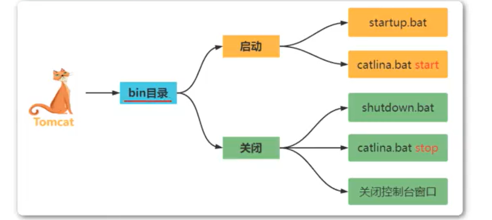

## Tomcat启动

startup.bat 是 windows 操作系统的 startup.sh 是 linux 操作系统的

startup.bat 点击即可开始


第二种方式


## Tomcat关闭

关闭方式

1. startup.bat还存在的时候，点击右上角X

2. startup.bat还存在的时候，点击shutdown.bat

3. 黑框框中输入 catalina.bat


## 访问Tomcat方式

通过URL


Tomcat监听端口不修改是8080


# Tomcat配置文件


除了 context.xml 配置文件，如果修改了其他配置还想让它生效，必须重启服务器而 context.xml不需要


如果项目内的 web.xml 没有设置，那就用全局的 这里的xml，如果项目内设置了，那就以项目内设置的为准


修改 tomcat 监听的端口就通过修改 server.xml 文件


# **解决控制台乱码以及修改监听端口**


注意修改的是哪个标签中的 port 。

修改之后必须重启 tomcat 才能生效。

我这里不进行修改

# 配置TomcatManager

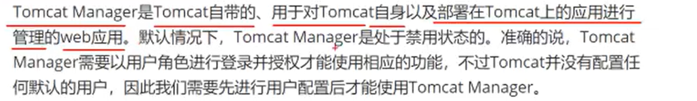


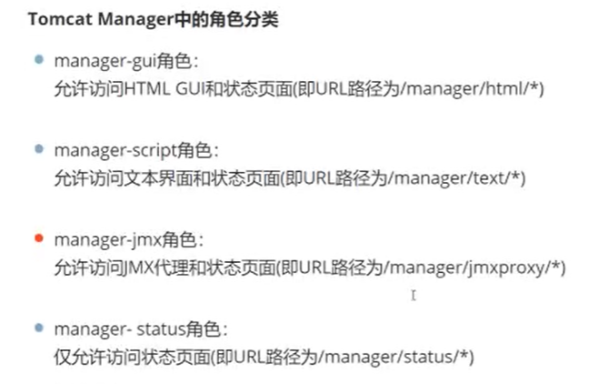


```
<role rolename = "manager-gui"/>
<user username = "jaceyang" password="asdjkl123" roles = "manager-gui"/>
```


使用当前ip地址无法访问管理


无法远程访问到 tomcatManager，需要修改 context.xml。配置允许远程访问。

注意是 webapps中的manager中的context.xml，不是 conf 目录中的 context.xml


把  <Valve className="org.apache.catalina.valves.RemoteAddrValve"
         allow="127\.\d+\.\d+\.\d+|::1|0:0:0:0:0:0:0:1" />  注释掉

远程地址也可以访问了


# Tomcat架构讲解

## tomcat工作原理

应用只要能使用 http协议 发送请求就可以被tomcat接收处理


用户应用程序发送来请求到达tomcat，tomcat会把请求进行获取解析，并且封装到对象中，根据请求行中的资源标识，找到tomcat中的该资源并运行。(比如用户要求查询数据库，那么tomcat就会启动操作数据库并查询的相关代码文件)

web服务器只接收，不处理请求，是tomcat中的容器引擎对请求进行处理

## tomcat架构图

tomcat默认只支持http协议，想要支持其他的协议需要进行配置。


web服务器 就是tomcat 中的 connector ，Engine 就是 容器。


server组件包含 service 组件 ，service 组件包含 engine 组件，engine包含 host组件，host 包含 context。

上次 server.xml 我们 在 connector 标签修改的就是监听的窗口，connector就是用于监听发送来的请求。


# Tomcat组件

## Server组件

Server 组件就是对应一个tomcat 实例。启动一个 Server 实例 就是启动一个 Tomcat ，就是启动一个jvm(jvm处理tomcat代码，tomcat是java编写的。)


启动多个 Server 实例，如果不做修改，它们都监听8005，因此这个监听关闭的端口需要修改。


验证方式，先启动 tomcat

指令 netstat -ano


注意 端口号 8005 和端口号 8080，的它们的pid 都是 31396，说明是同一进程中的。tomcat启动后就会启动这两个端口。


我们关闭tomcat时，就是往 8005端口发送了 shutdown指令(就是shutdown字符串)。

可以使用 windows 自带的 telnet 进行检验。


这里默认是 8005 端口接收到 SHUTDOWN字符串就关闭 tomcat，如果 改成 shutdown="1234" 那就是 8005端口接收到 1234字符串才会关闭 tomcat。


如果使用 设置 port="-1"，那么 tomcat 启动时就不会绑定或监听 8005 端口，就相当于把8005这个端口掐掉了，直接消失。通过cmd shutdown.bat 无法把 tomcat 关闭。 唯一的关闭方式是右上角点×。


试图通过 cmd catalina.bat 就没用。


## **Service组件**

引擎：Engine  连接器：connector

可以把多个连接器与一个引擎相连


表明基于 HTTP/1.1 并向8080端口发送的会被监听8080端口的connector拿到。拿到后连接会把请求交给引擎来处理

## **Connector组件**


SSL连接器是处理 https协议的。


maxThreads 最大处理200个并发量的请求，**最多同时处理200个请求。**


## Engine组件

Engine 是 server 容器


name 引擎起名字。

虚拟主机，是通过软件虚拟出来的，比如云服务器。Host组件是在tomcat中配置虚拟主机的。一个Host组件就是一个虚拟主机。

一个 Engine组件 中可以配置多个Host组件，即虚拟主机。配置多个虚拟主机后就可以存放多个web资源在虚拟主机中。


连接器监听的应该是 8080，我没修改。


该Engine内部有三个虚拟主机，其中两个有域名 bjsxt.com 和 itbz.com ，localhost也是一个虚拟主机。

每个虚拟主机内有网页资源，比如 html js css 等。

客户端通过浏览器发送请求，请求被connector获取后，按照其请求的域名，在Engine中选择虚拟主机，然后通过资源标识符获取网站资源。

如果客户端发来的域名不明确，没有域名为客户端需要的虚拟主机host，那么这时就需要一个默认虚拟主机，用于接收处理所有不明确域名的请求。

上面的例子中，最右边第三个，suibian.com 在服务器中不存在，但是 defaultHost 设置 了 localhost，那就是 localhost虚拟主机处理不明确域名的请求。


## host组件

host组件用于配置虚拟主机


一个硬件设备运行一个服务器，很不划算。

虚拟主机实现，通过软件技术模拟出多个虚拟主机，再把软件放在虚拟主机中。

购买云服务器并不会给你分配物理上的硬件，而是创建新的服务器再分配给你。


appBase 就是tomcat目录 中的 webapps文件夹。这里webapp是相对路径。

虚拟主机的名称name，就是域名

## context组件


appBase 指定了 webapps 为存放web资源的目录，此时不需要context组件

如果web资源不想放在tomcat webapps中，就需要用到context组件来把网页资源存放在别处。

context 组件用来指定一个web项目存在的位置，或者是web应用的目录。


一个context 对应一个项目 (web项目)

path配置的是**用户访问你项目的访问路径**，就是用户输入的url的路径

- 如果这个项目是放在webapps中，由于webapps中有很多web项目，默认 **项目的名字 是 context 的path的值**
- 如果这个项目是放在了 外部，不是webapps中，那么你需要手动配置这个path值(随便什么值都可，只要让用户作为 url输入到网址栏中能访问到web资源即可)，用户通过这个path值来找到网页资源。

docBase，指定web项目所在路径，可以是项目的 war 包，也可以是该项目没有打包的文件夹。

## 组件结构


# Host组件配置虚拟主机

## 创建页面

tomcat中新建两个目录 webapps1   和 webapps2


我们希望把这两个目录分别部署作为两个虚拟主机的网路资源(context)。


创建一个a文件夹，里面只有一个 index.html 文件作为网页资源。

a文件夹分别放入webapps  webapps1 webapps2文件夹中，里面有不同的文字。

a就是项目的名字。


## 配置server.xml

去修改server.xml

localhost 不改动。再去增添新的 Host标签。

```
      <Host name="localhost"  appBase="webapps"
            unpackWARs="true" autoDeploy="true">

        <!-- SingleSignOn valve, share authentication between web applications
             Documentation at: /docs/config/valve.html -->
        <!--
        <Valve className="org.apache.catalina.authenticator.SingleSignOn" />
        -->

        <!-- Access log processes all example.
             Documentation at: /docs/config/valve.html
             Note: The pattern used is equivalent to using pattern="common" -->
        <Valve className="org.apache.catalina.valves.AccessLogValve" directory="logs"
               prefix="localhost_access_log" suffix=".txt"
               pattern="%h %l %u %t &quot;%r&quot; %s %b" />

      </Host>
	<Host name="njupt1.com"  appBase="webapps1"
            unpackWARs="true" autoDeploy="true">

        <!-- SingleSignOn valve, share authentication between web applications
             Documentation at: /docs/config/valve.html -->
        <!--
        <Valve className="org.apache.catalina.authenticator.SingleSignOn" />
        -->

        <!-- Access log processes all example.
             Documentation at: /docs/config/valve.html
             Note: The pattern used is equivalent to using pattern="common" -->
        <Valve className="org.apache.catalina.valves.AccessLogValve" directory="logs"
               prefix="localhost_access_log" suffix=".txt"
               pattern="%h %l %u %t &quot;%r&quot; %s %b" />

      </Host>
<Host name="njupt2.com"  appBase="webapps2"
            unpackWARs="true" autoDeploy="true">

        <!-- SingleSignOn valve, share authentication between web applications
             Documentation at: /docs/config/valve.html -->
        <!--
        <Valve className="org.apache.catalina.authenticator.SingleSignOn" />
        -->

        <!-- Access log processes all example.
             Documentation at: /docs/config/valve.html
             Note: The pattern used is equivalent to using pattern="common" -->
        <Valve className="org.apache.catalina.valves.AccessLogValve" directory="logs"
               prefix="localhost_access_log" suffix=".txt"
               pattern="%h %l %u %t &quot;%r&quot; %s %b" />

      </Host>
```

三个 host标签，就表示有三个虚拟主机。

通过 njupt1.com 域名 访问 webapps1中的网页项目资源。

通过njupt2.com 域名 访问 webapps2中的网页项目资源。

希望通过域名 访问网络资源

URL：njupt1.com:8080/a/index.html 访问 webapps1  中的a项目的资源index.html

URL：njupt2.com:8080/a/index.html 访问 webapps2  中的a项目的资源index.html

现在还访问不到

还需要完成域名和ip地址的映射，实现把域名转换成服务器所在的ip地址。

c盘中，按照下图路径 找到 host文件


浏览器在将域名转换成ip地址前，先查本机的这个文件看有没有存储相关的转换方式，没有再去查找DNS服务器。


属性把修改权限(user的，右键属性，安全，编辑)打开，把只读属性去掉


记事本以管理员身份打开，并且打开该hosts文件


前面写ip，后面写域名

127.0.0.1       njupt1.com
127.0.0.1       njupt2.com
127.0.0.1       suibian.com


suibian.com这个域名并不存在，所以交给默认的，即 localhost 进行处理


# 配置Context


网页资源部署到其他文件夹当中。


网页资源项目是 d盘中的demo文件夹，该文件夹内只有一个 index.html文件


tomcat 中 的 webapps2下没有目录，其项目被放在了外面就是d盘中的demo文件


现在就这样访问无法访问到资源。


因为网页资源被拿出来了。

此时就需要添加context标签在 host内部，在哪个host下添加，就看你这个项目是从哪个host标签中的appBase属性指定文件夹中拿出来的。

<Context path="/njd1" docBase="d:/demo"/>


对比上面web资源文件在 tomcat内部的， a 变成了 njd1,来区分webapp文件夹中的众多项目


如果 配置了 host 中的 appBase 属性和 Context 中的 docBase 属性，不会冲突，以 docBase 为主去找资源文件。


# **Servlet简介**

Servlet 处理请求，返回响应

## web开发历史回顾

CGI模式


## Servlet简介


Servlet 是java语言编写的。

Servlet的技术特点是 使用 **单进程 ，多线程** 的方式


单进程指的是 tomcat(server)，而 多进程指的是 servlet


servlet 介于 webserver(连接器)和数据库之间。


# **编写和编译Servlet**


一个类想要成为servlet，那么

- 这个类必须继承 httpservlet 类
- 这个类有 doGet 方法


```
import javax.servlet.ServletException;
import javax.servlet.http.HttpServlet;
import javax.servlet.http.HttpServletRequest;
import javax.servlet.http.HttpServletResponse;
import java.io.IOException;
import java.io.PrintWriter;

public class HelloWorld extends HttpServlet {
    @Override
    protected void doGet(HttpServletRequest req, HttpServletResponse resp) throws ServletException, IOException {
        PrintWriter pw = resp.getWriter();a'z
        pw.write("<!DOCTYPE html>");
        pw.write("<html>");
        pw.write("<head>");
        pw.write("<meta charset=\"utf-8\">");
        pw.write("<title></title>");
        pw.write("<style>");
        pw.write("\t\t.box{");
        pw.write("                    font-size:48px;");
        pw.write("                    color:red;");
        pw.write("                    }");
        pw.write("</style>");
        pw.write("</head>");
        pw.write("<body>");
        pw.write("<div class=\"box\">HelloWorld!!!</div>");
        pw.write("</body>");
        pw.write("</html>");
    }
}

```


servlet 是 javaee平台下的规范。我们去找tomcat对servlet的实现类


servlet 的jar包里有这些实体类


编译的时候除了类名以外，还需要传入jar包的路径。

servlet-api.jar 包含了 servlet 的实体类


# 创建web.xml

配置文件中必须包含 web.xml


web.xml 中，需要配置

- servlet 的全名，实例化servlet的工作(把继承了 HttpServlet 的类实例化)是Tomcat自动完成的。
- servlet 的资源路径，servlet也是资源,区分html，css，是一个动态资源，是资源就需要一个资源访问路径(URL)。


```
<?xml version="1.0" encoding="UTF-8"?>
<web-app xmlns="http://xmlns.jcp.org/xml/ns/javaee"
	 	 xmlns:xsi="http://www.w3.org/2001/XMLSchema-instance"
xsi:schemaLocation="http://xmlns.jcp.org/xml/ns/javaee"	 	 
http://xmlns.jcp.org/xml/ns/javaee/web-app_4_0.xsd"
	version="4.0">
</web-app>	
```


里面有 两个 标签 servlet标签(配置servlet的全名)，servlet-mapping标签(配置servlet资源路径，servlet和url绑定)

servlet 标签内有servlet-name标签(用于给这个servlet起别名),servlet-class标签(给出这个servlet类的全类名(包名+类名))

servlet-mapping标签内有 servlet-name 标签(指定你要将哪个servlet绑定URL)，url-pattern标签(上面名字为servlet-name的servlet对应的资源路径)

servlet资源的访问路径为了区分通常加上后缀.do，表示这是一个servlet资源文件


```
<?xml version="1.0" encoding="UTF-8"?>
<web-app xmlns="http://xmlns.jcp.org/xml/ns/javaee"
         xmlns:xsi="http://www.w3.org/2001/XMLSchema-instance"
         xsi:schemaLocation="http://xmlns.jcp.org/xml/ns/javaee http://xmlns.jcp.org/xml/ns/javaee/web-app_4_0.xsd"
         version="4.0">
    <servlet>
        <!--servlet类的全类名就是 HelloWorld，我没有把它放在任何包中
        该类的别名是 HellomyWorld-->
        <servlet-name>HellomyWorld</servlet-name>
        <servlet-class>HelloWorld</servlet-class>
    </servlet>

    <servlet-mapping>
    <!--对别名为HellomyWorld的servlet类(就是上面那个servlet标签内部的)配置资源路径-->
    <servlet-name>HellomyWorld</servlet-name>
    <!--用户通过什么路径能访问到这个资源-->
    <url-pattern>/helloworld.do</url-pattern>
    </servlet-mapping>
</web-app>
```

# 部署运行Servlet


WEB-INF 的命名必须就是 WEB-INF,其内部必须有两个 文件夹(classes 和 lib，必须叫这个名字)，一个配置文件(web.xml，必须叫这个名字)


在webapps下创建项目，该项目名称为 servletdemo(命名就是该项目的名字，啥名字都可以)


 servletdemo下创建 WEB-INF

WEB-INF 下 创建 lib classes web.xml


classes 下给出servlet类的class文件(class文件是已经编译的java文件，如果是放在包内的，还需要按照包名创建相应文件夹) 


配置好web.xml


路径

/servletdemo 由于是在 webapps 中，即tomcat内，就是项目的名字

```
localhost:8080/servletdemo/helloworld.do
```


如果出了问题通常是 web.xml 配置错了，可以看启动tomcat时的报错


步骤

- servlet 类必须继承 HttpServlet类
- 编译 servlet类生成.class，依赖第三方包的写法
- web.xml 的配置
- servlet部署到tomcat当中，要有严格的目录结构

# **Tomcat处理请求过程**


第五步，如果 没有context，就是放在tomcat内部的webapp里的，那就是根据项目名去找

# Servlet继承结构


Servlet 就是 Servlet 规范的体现。规范就是接口+文档，这些接口是让其他服务器来实现的。

Servlet接口有5个方法


init 和 destroy对称

getServletConfig 能够拿到 ServletConfig对象，该对象是容器向Servlet传递参数的。

web.xml配置文件中有 servlet 标签，该标签除了别名和全类名，还可以完成对servlet初始化参数的配置，初始化参数是name = value的形式进行配置。ServletConfig就能获取这些初始化参数。


Serializable 可序列化接口


ServletConfig 接口


 


GenericServlet 没有实现 service 方法，这个方法留给继承自GenericServlet 来实现，用于对应不同的网络协议

HttpServlet 就是用于处理 Http的网络协议。


tomcat 对 servlet 技术规范实现了(有实现了 servlet接口的类)


查看 tomcat servlet-api.jar 包的内容，反编译

解压工具打开 jar 文件


我们之前编写HttpServlet的时候就用到了 这个 javax 包

javax包下有servlet包，servlet目录


其中这个Servlet.class 就是接口


反编译Servlet.class


GenericServlet 抽象类

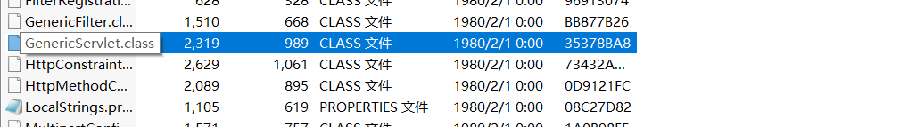

service方法没有重写


ServletRequest 和 ServletRespone 分别是 HttpServletRequest 和 HttpServletRespone 的父类


https文件夹中有 HttpServlet.class 文件


GenericServlet 抽象类 中的service方法进行重写


该类处理的是 Httpservice，所以传参过来的一定是Http版本的这两个参数，因此可以强转，再去调用本类的另一个service方法

# **Servlet的生命周期**

Servlet是容器(Tomcat)管理的，Servlet实例的创建是 容器完成的，我们没有new。

servlet实例创建后才可以调用其中的方法，比如doget


init 和 destroy都是空的，需要我们来写，通过多态的方式进行调用，如果不重写就是调用GenericServlet抽象类中空的init 和 空的destroy。


Servlet 使用的是单例模式(只创建一次 Servlet对象，**一个Servlet只会被Tomcat实例化一次**)，每次处理请求就是**在新的线程中执行Service方法**。

# **Servlet处理请求的原理**


成为serlvet类 必须继承HttpServlet方法

有doGet方法，doGet方法有两个参数,这两个参数的由来：


1. 浏览器发送请求，首先被Tomcat拿到，Tomcat首先对请求的信息做解析，解析的结果会放到HttpServletRequest 对象中(这个对象也会被Tomcat自动实例化)

2. HttpServletRespone封装的是谁发送的请求(发送请求的客户端的信息，浏览器的信息)，所以可以直接获取打印流向用户客户端进行输出

   

我们在web项目中都会配置web.xml，Tomcat启动后就会解析所有web项目的web.xml文件，解析结果就会保存，通过客户请求的信息去和URL比对，决定发送给哪个Servlet，解析xml的时候不会实例化Servlet，但是客户指定要访问某个Servlet资源的时候，才会对Servlet进行实例化，如果已经实例化了那就根据URL在缓存里找这个Servlet，在新线程里调用Service方法。


配置文件中有类的全名，可以反射实例化。实例化后是用 Servlet 类型作为句柄。

Servlet 类名 = Servlet对象(对象所属类实现了HttpServlet接口)。

编译类型是Servlet，运行类型是继承了 HttpServlet 的类。

会先执行init方法，如果没有重写就从子类往父类找。

ServletConfig抽象类的init 方法


再次调用 init(),如果init(空参)没有被继承重写，那就还是调用ServletConfig中空的 init()

如果init(空参)被继承的类重写了，根据多态调用被重写的init


init执行完后，在新线程中调用service方法。

对象名.service方法()  对象名的运行类型是我们编写的继承自HttpServlet类的类

会执行HttpServlet 类中的 Service方法(ServletConfig没有重写Service)。


能够强转是因为Tomcat传来的就是HttpServletRequest 和 HttpServletRespone类型的数据

强转之后调用重载的service方法


获取请求方式，并指向相应的doGet，这里执行的doGet是我们重写的doGet方法，利用多态的特性

(调用service方法是通过，**对象名.ervice()**的方式，对象名代表的对象的**运行类型是我们创建的Servlet类**，**即继承了HttpServlet类的那个类)**。


# Servlet的作用

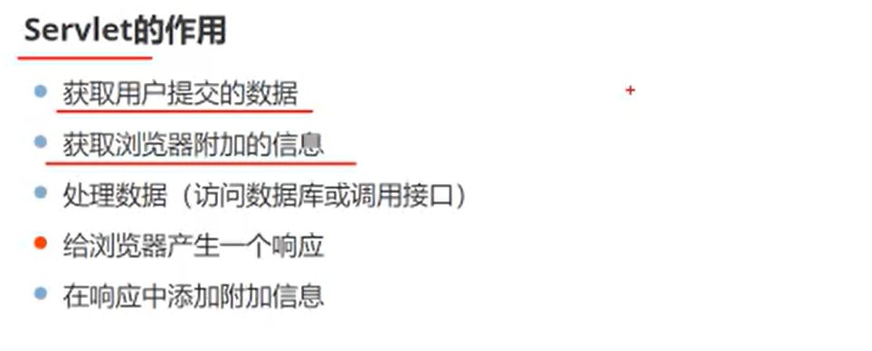

浏览器附件信息就是请求头

相应Respone

相应中添加附加信息就是在响应头的中添加 Key = Value


# **在Idea中创建web工程**

手动配置Servlet(之前做的)，太麻烦了。


什么都不用选


就是先创建一个普通的java工程

project创建完成后，右键项目 Add Framework Support


把 WebApplication 勾选上，然后确认


项目已创建完成


再添加依赖的 jar 包 比如 servlet

选中项目 点击 project structure


这个jar包在tomcat当中，就找这个jar包的路径


配置tomcat

右上角 add Configuration


Tomcat server 选 local 关联本地的。

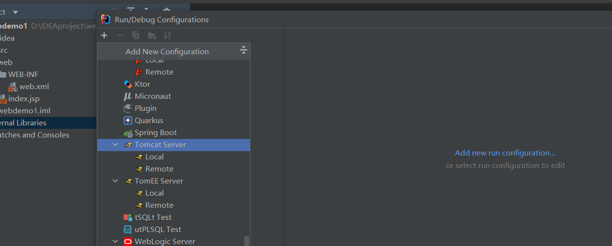


configure tomcat server


选择tomcat 的根目录


修改 connector 监听的端口直接在这里修改即可


Deployment 最下面一定要设置路径


Application context 就是表示你项目的访问路径(就相当于 context控件 的path 属性的作用)。

一般都是项目名作为项目访问路径


访问方式就是 域名:端口:/webdemo1(项目名)/项目下具体的资源(html,servlet,css,js等等)

# **在web工程中编写Servlet**

java代码，即.java文件依然要放在src目录下，并且有包结构


敲入doGet 会自动提示要重写 doGet方法


servlet 写完之后还是要在 web.xml 文件中进行配置


url-pattern 前面一定要有/


项目的部署IDEA帮我们完成了

启动Tomcat


之前有个手动构建tomcat的时候，有一个demo项目放tomcat外面通过context组件引入的，不要把demo项目删了


打开项目的根，打开的是 index.jsp 的资源


# **Idea中的web项目部署详解**


webapps下并没有IDEA中创建的web项目，是把项目都放在Tomcat外面了，再用Context指向


编译后会有out目录


out目录存放的就是IDEA创建的web项目编译完成后的web目录的结构，它不会把.java文件放入out目录中而是把.class文件放到out目录中


这个out目录删除后，再次运行tomcat会重新对项目进行编译，然后再次生成out目录

已知项目在外部了，因此需要context组件指定项目在哪


conf logs work 就是副本

这些目录是我们给IDEA配置关联的Tomcat，从这个Tomcat复制过来的。

bin目录启动目录不用复制一个就够了。

关键是conf目录


Tomcat有server.xml文件，在哪里我们可以在 host 标签内设置context标签来指向外部资源。

在这里我们也可以写context标签，即在 conf目录下的Catalina目录下，在这里新建和虚拟主机(host)域名相同的目录，在这里添加xml配置文件，xml配置文件必须和项目(网页资源)名称相同。

这个/webdemo1就是 IDEA中配置的/webdemo1


docBase指向了 IDEA中编译完成的web项目。


Tomcat启动后怎么关联副本Tomcat

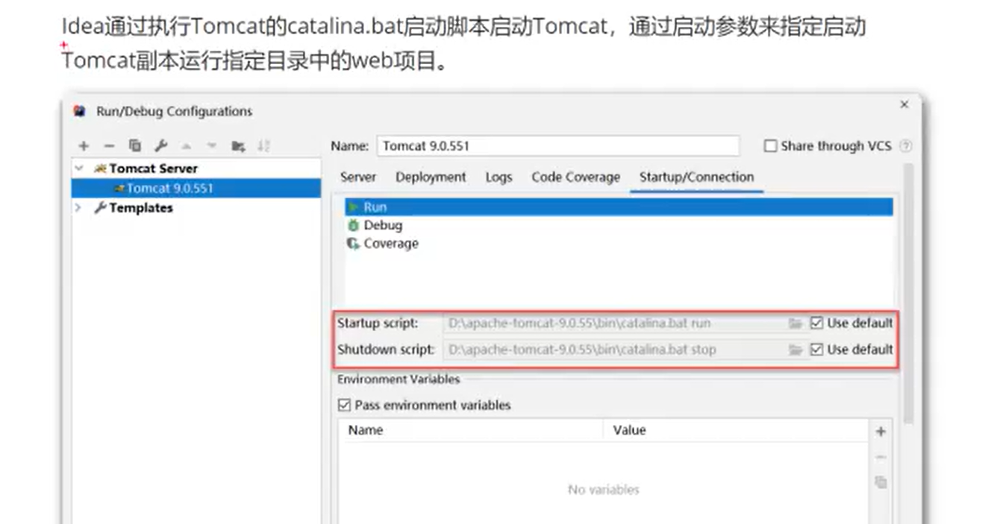


catalina.bat批处理 给一个run表示启动


记事本打开 Tomcat中的catalina.bat


重点关注 CATALINA_HOME 和CATALINA_BASE

 CATALINA_HOME指定tomcat安装目录

CATALINA_BASE指定tomcat工作目录，即项目的目录


每次启动Tomcat都会指定新的值


如果CATALINA_BASE不为空，那么就以传入(IDEA向批处理文件bat传入这个参数)的CATALINA_BASE的值作为工作目录


总结

- web工程在外部不在webapps内了

- IDEA会生成Tomcat副本作为工作目录，不是我们下载的那个Tomcat
- IDEA启动Tomcat时向其批处理文件传入Tomcat副本文件夹的路径改变Tomcat的工作路径，让Tomcat以Tomcat副本作为工作目录解析其中内容


# **将web项目部署到Tomcat的webapps中(返本)**

打开项目 Project Structure 

Output directory 就是 web项目编译完成后存放的位置


改成存放在Tomcat中的webapps文件下


再次启动 Tomcat，就能在webapps中发现编译后的web项目了


out目录里面就没有 artifacted的那个目录了


# **获取请求信息**HttpServletRequest


## 获取请求信息

通过HttpServletRequest对象的方法获取请求信息


完整URL ：就是用户输入在浏览器地址栏的内容完全获取

URI:获取 contextpath(context控件的path属性，通常是和项目同名的)+资源uri(html,css,js文件名称)


```
package com.njupt;

import javax.servlet.ServletException;
import javax.servlet.http.HttpServlet;
import javax.servlet.http.HttpServletRequest;
import javax.servlet.http.HttpServletResponse;
import java.io.IOException;
import java.io.PrintWriter;

public class GetRequestInfo extends HttpServlet {
    @Override
    protected void doGet(HttpServletRequest req, HttpServletResponse resp) throws ServletException, IOException {
        //获取浏览器发出请求的完整URL
//                    getRequestURL()返回StringBuffered的数据类型
        String s = req.getRequestURL().toString();

//        获取请求行中指定资源部分
        String requestURI = req.getRequestURI();
        String remoteAddr = req.getRemoteAddr();
//        获取服务器IP地址
        String localAddr = req.getLocalAddr();
//        获取服务器监听端口,Connector监听的端口
        int localPort = req.getLocalPort();
        PrintWriter pw = resp.getWriter();
        pw.println("URL:"+s);
        pw.println("URI:"+requestURI);
        pw.println("服务器地址:"+localAddr);
        pw.println("用户地址:"+ remoteAddr);
        pw.println("Connector监听的端口:"+localPort);
    }
}

```

每次编写一个新的Servlet类都要在web.xml 中配置其映射


## **获取请求数据(表单中上传的数据)**


getParameter 的参数写的是html form标签中，**标签的name属性的值**。

```
 比如
html中如果写<input type="text" name="username"/><br>

想要在servlet中获取，就写成 req.getParameter("username");
```

getParameter只能获取单行文本，单选按钮，select标签的值，只能根据一个值获取一个value，但是复选框(看下一节)是一个值对应多个value


在HttpServletrequest的封装中，表单中提交的字符或者数字统一是字符串数据类型


html页面应该放在web项目的哪个目录中？


html，css，js都放在web文件夹下，但是，不能放在WEB-INF目录中(此时静态页面用户无法直接请求)，在web目录下新建文件夹再把静态资源放入也可以。

html的form 表单的action属性，写你要把这个表单中的数据传给哪个Servlet来处理，就写这个Servlet在web.xml 中配置的映射，但是不要在最前面写 /，比如，如果在web-xml中的servlet-mapping配置的是/helloworld.do，想要交给这个servlet提交，那么 action = "helloworld.do" 而不要写action="/helloworld.do"


```
package com.njupt;

import javax.servlet.ServletException;
import javax.servlet.http.HttpServlet;
import javax.servlet.http.HttpServletRequest;
import javax.servlet.http.HttpServletResponse;
import java.io.IOException;
import java.io.PrintWriter;
//获取请求数据
public class GetRequestData extends HttpServlet {
    //        基于post方式提交请求，重写dopost方法

    @Override
    protected void doPost(HttpServletRequest req, HttpServletResponse resp) throws ServletException, IOException {
//                        getParameter内部写的是html中form表单标签的name属性的值
        String username = req.getParameter("username");
//        获取用户密码
        String pwd = req.getParameter("userpwd");
        PrintWriter pw  = resp.getWriter();
        pw.println("userName:"+username);
        pw.println("passWord:"+pwd);
        pw.flush();
    }
}
```


配置Servlet映射在 web.xml中


路径也发生改变，变成了......./getrequestdata.do 


## **获取Html中复选框的信息**


复选框是一个值对应多个value


先看一下发送请求的形式


打开浏览器检查页面


提交以后


提交的数据


可以发现 userlike 有多个值与之对应


```
package com.njupt;

import javax.servlet.ServletException;
import javax.servlet.http.HttpServlet;
import javax.servlet.http.HttpServletRequest;
import javax.servlet.http.HttpServletResponse;
import java.io.IOException;
import java.io.PrintWriter;
//获取请求数据


public class GetRequestData extends HttpServlet {
    //        基于post方式提交请求，重写dopost方法

    @Override
    protected void doPost(HttpServletRequest req, HttpServletResponse resp) throws ServletException, IOException {
//                        getParameter内部写的是html中form表单标签的name属性的值
        String username = req.getParameter("username");
//        获取用户密码
        String pwd = req.getParameter("userpwd");
        PrintWriter pw  = resp.getWriter();
        pw.print("爱好:");
        String [] userlikes = req.getParameterValues("userlike");
        for (String s1:userlikes) {
            pw.print(s1+" ");
        }
        pw.println("userName:"+username);
        pw.println("passWord:"+pwd);
        pw.flush();
        pw.close();
    }
}
```


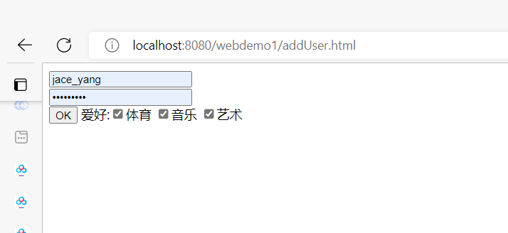


## 获取所有数据提交(表单)的key


获取 form表单内所有提交数据的的标签的name属性的值。


该表单中，能够获取表单的key有 username userpwd userlike

```
package com.njupt;

import javax.servlet.ServletException;
import javax.servlet.http.HttpServlet;
import javax.servlet.http.HttpServletRequest;
import javax.servlet.http.HttpServletResponse;
import java.io.IOException;
import java.io.PrintWriter;
import java.util.ArrayList;
import java.util.Enumeration;
//获取请求数据


public class GetRequestData extends HttpServlet {
    //        基于post方式提交请求，重写dopost方法

    @Override
    protected void doPost(HttpServletRequest req, HttpServletResponse resp) throws ServletException, IOException {

        Enumeration<String> parameterNames = req.getParameterNames();
        ArrayList<String> l1 = new ArrayList();
        while(parameterNames.hasMoreElements()){
            l1.add(parameterNames.nextElement());
        }
        PrintWriter pw = resp.getWriter();
        for (String s1:l1) {
            pw.print(l1);
        }

    }
}

```


## **使用Map结构获取提交数据**


所有key 和 value一次拿出来，value是String[] 是考虑了复选框的表单数据


```
package com.njupt;

import javax.servlet.ServletException;
import javax.servlet.http.HttpServlet;
import javax.servlet.http.HttpServletRequest;
import javax.servlet.http.HttpServletResponse;
import java.io.IOException;
import java.io.PrintWriter;
import java.util.*;
//获取请求数据


public class GetRequestData extends HttpServlet {
    //        基于post方式提交请求，重写dopost方法

    @Override
    protected void doPost(HttpServletRequest req, HttpServletResponse resp) throws ServletException, IOException {
        Map<String,String[]> para=req.getParameterMap();
        Iterator<Map.Entry<String, String[]>> ems = para.entrySet().iterator();
        PrintWriter pw = resp.getWriter();
        while(ems.hasNext()) {
            Map.Entry<String,String[]> entry = ems.next();
            String key = entry.getKey();
            String [] value= entry.getValue();
            pw.println(key+":"+Arrays.asList(value));
        }

    }

}
```


## **设置请求编码**

用户提交的是汉字，那么在servlet获取后就会乱码。


Tomcat 默认使用 ISO-8859-1 编码方式完成字节到字符的转换。

req.setCharacterEncoding("utf-8") 指定以UTF-8的方式完成字节到字符的转换。

也可以我们手动完成

- 得到字节(以 ISO-8859-1的方式字符到字节)
- new String(表示数据的字节数组,"utf-8"); 第二个参数是指定 字节转换成字符是用UTF-8的方式。

req.setCharacterEncoding("utf-8")  可以完成我们上面做的。

req.setCharacterEncoding("utf-8") 一定要放在获取请求数据(表单)之前

原来的

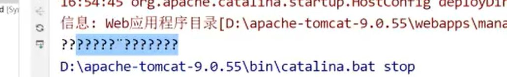

现在的

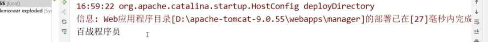


解决了在控制台的乱码，但是响应乱码没有解决，输出流有汉字依旧会出现乱码，没有解决。


```
package com.njupt;
import javax.servlet.ServletException;
import javax.servlet.http.HttpServlet;
import javax.servlet.http.HttpServletRequest;
import javax.servlet.http.HttpServletResponse;
import java.io.IOException;
import java.io.PrintWriter;
import java.util.*;
//获取请求数据
public class GetRequestData extends HttpServlet {
    //        基于post方式提交请求，重写dopost方法
    @Override
    protected void doPost(HttpServletRequest req, HttpServletResponse resp) throws ServletException, IOException {
        req.setCharacterEncoding("UTF-8");
        String username = req.getParameter("username");
        System.out.println(username);
        PrintWriter printWriter = resp.getWriter();
        printWriter.println("用户名:"+username);
    }
}
```


# **资源访问路径**

用户短请求资源时的URL给定格式


action 的值表示表单要提交到的地址。

如果action 的值以 / 开头，那就是绝对路径。这种表示方式只适用于，该项目的context path 是 "/"

如下，下图就表示此时该web项目的contextpath是/，但是contextpath最少都必须是/，不能没有


此时启动服务器


原本应该是 域名:端口/表示项目的contextpath/，现在只剩下 域名:端口/


此时访问该addUser.html文件


提交表单

此时action是 /getrequestdata.do 


是可以提交的

如果 action 改成 getrequestdata.do 


也可以提交


如果 context 不是 / 而是 / 还带点东西，那就是相对路径


如果此时action是 getrequestdata.do ，可以

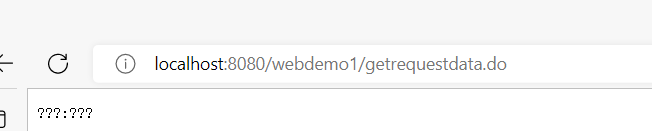

如果此时action是 /getrequestdata.do

注意路径，URL中没有contextpath，域名:端口后面直接跟了 servlet 的映射。


如果此时我们把

addUser.html 放在了 web 文件夹中


context 后面的资源标识符也要改变其路径


form action="getrequestdata.do"无法进行跳转


此时有两个方法（这两种方法不要一起使用).


1. 把 form action="getrequestdata.do" 变为form action="../getrequestdata.do" 

   ../表示让URL路径回到当前路径上一级，即回到webdemo1

   

2. 修改servlet的映射(web.xml中) /getrequestdata.do 变为 /web/getrequestdata.do  表示该servlet资源通过/a/getrequestdata.do的路径获取

   

   

通常第一种，我们不修改映射。


如果出现了这种层级结构


那就是action = ../../getrequestdata.do (从表单修改)  ，往回走两次

或者/web1/web/getrequestdata.do


# **获取请求头信息**


获取浏览器附加信息，就是获取请求头信息

post 有请求体(用于传参) get 没有请求体(通过URL(请求行)进行传参，可以直接在地址栏被看见)。

我们输入地址到浏览器地址栏直接访问资源是get方式的请求。


根据请求头的 key 来获取对应的value


```
package com.njupt;

import javax.servlet.ServletException;
import javax.servlet.http.HttpServlet;
import javax.servlet.http.HttpServletRequest;
import javax.servlet.http.HttpServletResponse;
import java.io.IOException;
import java.io.PrintWriter;
import java.util.*;
//获取请求数据


public class GetRequestData extends HttpServlet {
    //        基于post方式提交请求，重写dopost方法

    @Override
    protected void doPost(HttpServletRequest req, HttpServletResponse resp) throws ServletException, IOException {
        String headerInfo = req.getHeader("Accept-Encoding");
        PrintWriter pw = resp.getWriter();
        pw.println("Accept-Encoding:"+headerInfo);
        pw.flush();
        pw.close();
        Enumeration<String> headerNames = req.getHeaderNames();
        while(headerNames.hasMoreElements()){
            String key = headerNames.nextElement();
            String value = req.getHeader(key);
            System.out.println(key+":"+value);
        }
    }
    @Override
    protected void doGet(HttpServletRequest req, HttpServletResponse resp) throws ServletException, IOException {
        this.doPost(req, resp);
    }
}


```


## 一个案例


# **HttpServletRequest对象的生命周期**


Tomcat 生命周期开始：有用户指向请求它，HttpServletRequest 才会被创建，当产生响应后该对象生命周期结束。

**每次请求只会产生一个 HttpServlet。**浏览器发来新的请求就创建新的HttpServlet


# HttpServletRespone对象

如果有多个客户端浏览器去请求Tomcat，Tomcat会为每个浏览器创建一对 HttpServletRespone 和 HttpServletRequest。

而不是一对对象代表所有客户端浏览器


## 设置响应类型

客户端浏览器根据响应类型处理响应

这是jsp页面的响应类型


text/plain 表示普通文本

charset = "utf-8" 表示以utf-8方式解码


上面的响应类型总共两种：字符响应和字节响应(图片影音)

### 设置字符型响应


普通文本是超文本的子集。

我们不设置响应类型浏览器默认当成 text/html 的形式处理

设置响应类型一定**要在获取字符输出流之前**


text/plain  浏览器不会再以 html 的格式解析


### **设置字节型响应**

图片，影音都是传给浏览器字节，然后让浏览器处理


例子：读取响应的图片再发送给对方浏览器


resp.getOutputStream()  发往浏览器的基于字节的输出流对象


## 设置响应编码

字符型响应需要设置，字节型响应不需要设置


请求乱码的解决：Tomcat 从网络获取字节，字节变成字符，默认是 ISO-8859-1 的形式，这个形式只支持单字节的，不支持汉字这种多字节。

响应乱码的原因：我们获取resp的printwriter后，其实还是把那些字符转换成字节再发送给对方浏览器的，而且字符到字节的转换形式依旧是ISO-8859-1。所以如果你发送的数据含有汉字依旧会乱码


第一种方式保证 Tomcat 把我们要发送的字符型数据转换成字节用的方式是UTF-8。并且保证浏览器用UTF-8的格式把Tomcat发送的字节转换成字符。永远有效。

第二种方式只保证 Tomcat 把我们要发送的字符型数据转换成字节用的方式是UTF-8，但是浏览器用何种格式把字节转换成字符不管。不保证一直有效


# 在响应中添加附加信息

## 重定向响应


```
package com.njupt;
import javax.servlet.ServletException;
import javax.servlet.http.HttpServlet;
import javax.servlet.http.HttpServletRequest;
import javax.servlet.http.HttpServletResponse;
import java.io.IOException;
public class RedirectServlet extends HttpServlet {
    @Override
    protected void doGet(HttpServletRequest req, HttpServletResponse resp) throws ServletException, IOException {
        resp.sendRedirect("http://www.baidu.com");
    }
    @Override
    protected void doPost(HttpServletRequest req, HttpServletResponse resp) throws ServletException, IOException {
        this.doGet(req,resp);
    }
}
```


重定向会有两次请求两次响应


第二条，重定向的URL是由客户端浏览器发起的。(从第一次的Respone获取的)


### 重定向案例


```
https://www.baidu.com/s?wd=需要搜索的关键字&rsv_spt=1&rsv_iqid=0xe9a487720001f794&issp=1&f=8&rsv_bp=1&rsv_idx=2&ie=utf-8&tn=baiduhome_pg&rsv_enter=1&rsv_dl=tb&rsv_sug3=16&rsv_sug1=17&rsv_sug7=100&rsv_sug2=0&rsv_btype=i&prefixsug=nihaoshijie1&rsp=6&inputT=3742&rsv_sug4=3742
```


```
package com.njupt;

import javax.servlet.ServletException;
import javax.servlet.http.HttpServlet;
import javax.servlet.http.HttpServletRequest;
import javax.servlet.http.HttpServletResponse;
import java.io.IOException;

public class RedirectServlet extends HttpServlet {
    @Override
    protected void doGet(HttpServletRequest req, HttpServletResponse resp) throws ServletException, IOException {
    	req.setCharacterEncoding("utf-8");
        String search  = req.getParameter("search");
        String re = "https://www.baidu.com/s?wd="+search+"&rsv_spt=1&rsv_iqid=0xe9a487720001f794&iss" +
                "p=1&f=8&rsv_bp=1&rsv_idx=2&ie=utf-8&tn=baiduhome_pg&rsv_enter=1&rsv_dl=tb&rsv_sug3=16&r" +
                "sv_sug1=17&rsv_sug7=100&rsv_sug2=0&rsv_btype=i&prefixsug=nihaoshijie1&rsp=6&inputT=3742&rsv_sug4=3742";
        resp.sendRedirect(re);


    }

    @Override
    protected void doPost(HttpServletRequest req, HttpServletResponse resp) throws ServletException, IOException {
        this.doGet(req,resp);
    }
}
```


乱码了


解决方法：URLEncoder.encode(要拼接成URL的汉字字符串,"utf-8")


URLEncoder 是先把字符串转化成字节，再从字节变成 URL编码格式的字符串

get方式提交，如果你的地址栏中有汉字，那么应该对汉字做URL编码，否则会乱码

URL编码是将 URL中不可打印的字符或具有特殊含义的字符转换为Web浏览器和服务器普遍接受的字符的过程。

URL中的汉字都要进行URL编码。(把汉字字符串转成字节再转成URL字符串。浏览器会对URL编码进行解码并读取信息)。

原本的一个字符会被编码成 一个百分号和两个十六进制数字

```
https://www.baidu.com/s?wd=URLEncoder.encode(search,"utf-8")&rsv_spt=1&rsv_iqid=0xe9a487720001f794&issp=1&f=8&rsv_bp=1&rsv_idx=2&ie=utf-8&tn=baiduhome_pg&rsv_enter=1&rsv_dl=tb&rsv_sug3=16&rsv_sug1=17&rsv_sug7=100&rsv_sug2=0&rsv_btype=i&prefixsug=nihaoshijie1&rsp=6&inputT=3742&rsv_sug4=3742
```


# Servlet实现**文件下载**


```
package com.njupt;

import javax.servlet.ServletException;
import javax.servlet.http.HttpServlet;
import javax.servlet.http.HttpServletRequest;
import javax.servlet.http.HttpServletResponse;
import java.io.*;

public class DownLoadServlet extends HttpServlet {
    @Override
    protected void doGet(HttpServletRequest req, HttpServletResponse resp) throws ServletException, IOException {
        File file = new File("D:/你好世界.txt");
        InputStream is = new FileInputStream(file);
        byte [] buff = new byte[is.available()];
        is.read(buff);
        resp.addHeader("Content-Disposition","attachment;filename"+file.getName());
        OutputStream os = resp.getOutputStream();
        os.write(buff);
        os.flush();
        os.close();
    }
    @Override
    protected void doPost(HttpServletRequest req, HttpServletResponse resp) throws ServletException, IOException {
        this.doGet(req, resp);
    }
}

```


下载的文件的名字是该网页路径的名字。。


## **解决文件名中文乱码问题**(作废了)


中文系统，按照gbk编码变成字节。再把这些字节按照ISO-8859-1的规范变成字符，再发送出去。

文件名的信息在响应头中，浏览器会用ISO-8859-1的格式把响应头做字符到字节的转换，然后浏览器就会得到文件名字节，浏览器再会按照操作系统支持的语言，按照GBK格式把这串字节转化成字符。


# **ServletContext对象**

## ServletContext特性介绍

ServletContext 是 容器(Tomcat)自动创建的


## 获取ServletContext的方式

```
ServletContext cs = this.getServletContext();  
```

这个方法 是 GenericContext 中的方法

## ServletContext对象的作用


### 相对路径转绝对路径


相对路径是相对于项目，项目内部的路径是不会改变的。

根据相对路径，再变为绝对路径，再使用绝对路径进行读取。

相对路径是以项目的web目录为开始的。

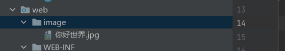


```
package com.njupt;

import javax.servlet.ServletContext;
import javax.servlet.ServletException;
import javax.servlet.http.HttpServlet;
import javax.servlet.http.HttpServletRequest;
import javax.servlet.http.HttpServletResponse;
import java.io.*;

public class DownLoadServlet extends HttpServlet {
    @Override
    protected void doGet(HttpServletRequest req, HttpServletResponse resp) throws ServletException, IOException {
        ServletContext sc = this.getServletContext();
        String rel = "image/你好世界.jpg";
        String realpath = sc.getRealPath(rel);
        File file = new File(realpath);
        InputStream is = new FileInputStream(file);
        byte [] buff = new byte[is.available()];
        is.read(buff);
//       在响应中添加附加信息
        resp.addHeader("Content-Disposition","attachment;filename"+file.getName());
        System.out.println(realpath);
        OutputStream os = resp.getOutputStream();
        os.write(buff);
        os.flush();
        os.close();
    }
    @Override
    protected void doPost(HttpServletRequest req, HttpServletResponse resp) throws ServletException, IOException {
        this.doGet(req, resp);
    }
}
```


如果web项目**添加了新的文件夹要把旧的编译好的web项目删除掉再重新部署，有时可能加不进去**


### **获取容器的附加信息**


```
package com.njupt;

import javax.servlet.ServletContext;
import javax.servlet.ServletException;
import javax.servlet.http.HttpServlet;
import javax.servlet.http.HttpServletRequest;
import javax.servlet.http.HttpServletResponse;
import java.io.IOException;
import java.io.PrintWriter;

public class GetAttach extends HttpServlet {
    @Override
    protected void doGet(HttpServletRequest req, HttpServletResponse resp) throws ServletException, IOException {
        this.doPost(req, resp);
    }

    @Override
    protected void doPost(HttpServletRequest req, HttpServletResponse resp) throws ServletException, IOException {
        ServletContext sc = this.getServletContext();
        String serverInfo = sc.getServerInfo();
        int majorVersion = sc.getMajorVersion();
        int majorVersion1 = sc.getMajorVersion();
        resp.setContentType("text/plain;charset=UTF-8");
        PrintWriter pw = resp.getWriter();
        pw.println("容器名称和版本号:"+serverInfo);
        pw.println("版本号:"+majorVersion+majorVersion1);
    }
}

```


### **获取web.xml中的信息**


```
package com.njupt;

import javax.servlet.ServletContext;
import javax.servlet.ServletException;
import javax.servlet.http.HttpServlet;
import javax.servlet.http.HttpServletRequest;
import javax.servlet.http.HttpServletResponse;
import java.io.IOException;
import java.io.PrintWriter;
import java.util.Enumeration;

public class GetAttach extends HttpServlet {
    @Override
    protected void doGet(HttpServletRequest req, HttpServletResponse resp) throws ServletException, IOException {
        this.doPost(req, resp);
    }
    @Override
    protected void doPost(HttpServletRequest req, HttpServletResponse resp) throws ServletException, IOException {
        ServletContext sc = this.getServletContext();
        Enumeration<String> initParameterNames = sc.getInitParameterNames();
        PrintWriter pw = resp.getWriter();
        while(initParameterNames.hasMoreElements()){
            String name = initParameterNames.nextElement();
            String value = sc.getInitParameter(name);
            pw.println(name+":"+value);
        }
    }
}

```


### 作为全局容器

一个Servlet 向 全局容器中添加数据，该项目的其他Servlet 都能够获得此数据。

获得此数据时要进行强制类型转换。

一定要先向全局容器中存放数据，别的Servlet才能从中取数据


```
package com.njupt;

import javax.servlet.ServletContext;
import javax.servlet.ServletException;
import javax.servlet.http.HttpServlet;
import javax.servlet.http.HttpServletRequest;
import javax.servlet.http.HttpServletResponse;
import java.io.IOException;
import java.io.PrintWriter;
import java.util.Enumeration;

public class GetAttach extends HttpServlet {
    @Override
    protected void doGet(HttpServletRequest req, HttpServletResponse resp) throws ServletException, IOException {
        this.doPost(req, resp);
    }
    @Override
    protected void doPost(HttpServletRequest req, HttpServletResponse resp) throws ServletException, IOException {
        ServletContext sc = this.getServletContext();
        String n1 = (String)sc.getAttribute("你好");
        String n2 = (String)sc.getAttribute("你好2");
        System.out.println(n1);
        System.out.println(n2);
    }

    @Override
    public void init() throws ServletException {
        ServletContext sc = this.getServletContext();
        sc.setAttribute("你好","世界");
        sc.setAttribute("你好2","世界2");
    }
}
```

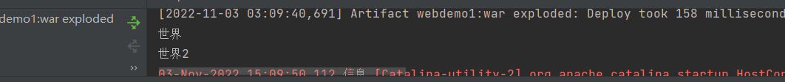


该案例必须保证 GetAttach 这个 servlet 先调用了 init 方法(这个servlet 首先被用户访问)，才会把数据添加到全局容器中，才能让其他Servlet获取此数据


## **ServletContext对象生命周期**


业务数据会被放在数据库当中。


# ServletConfig对象

ServletConfig对象和Servlet对象一一对应。

Servlet对象被初始化的同时一个ServletConfig也会被创建。

ServletConfig也是自动被创建的，我们只要获取即可。

获取方式：this.getServletConfig() 这是继承来的方法


一个 init-param 内只能获取一对param-name 和 param-value


**一个Servlet 只能读取与之 对应的 ServletConfig 对象的配置信息**。与之前ServletContext能够获取web.xml的信息不同，web.xml能够获得的信息必须是根标签下的，Servlet获取的信息必须是web.xml中servlet标签下的。


