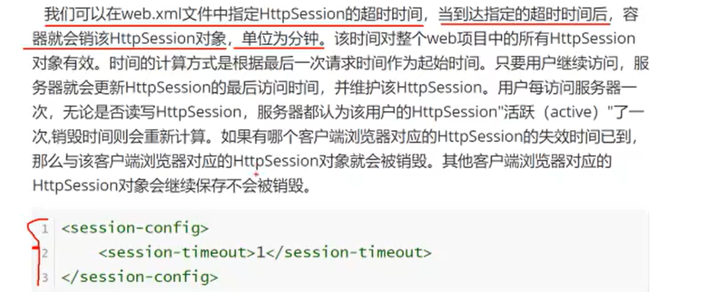
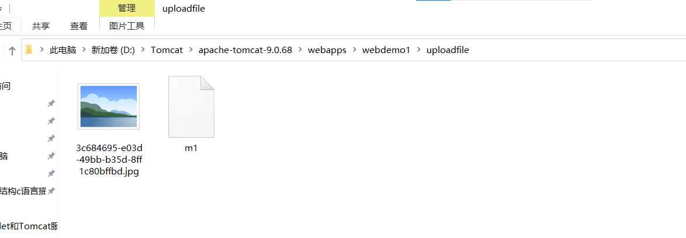
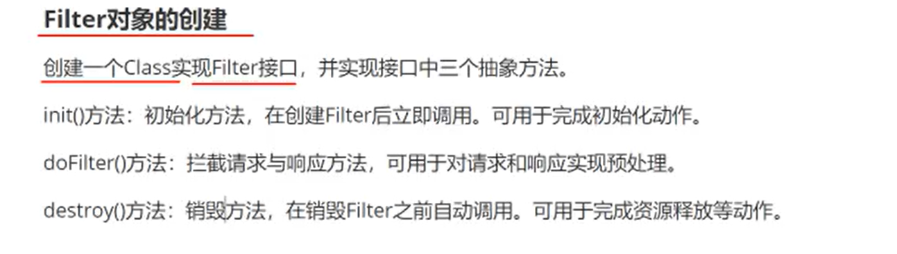

# **Cookie对象与HttpSession对象**


# Cookie对象

## Cookie对象特点

创建出来的cookie的key(name)不能是中文


客户端浏览器在发送请求的时候，会把**所有服务端曾经写给客户端的Cookie再提交给服务端(只要向浏览器发送Cookie的Servlet和浏览器要发送Cookie的目标Servlet是同一个域名下的(同一个虚拟主机)，就会携带曾经的Cookie)**。

出现key的值相同的时候，新的value值会覆盖旧的value值。

## Cookie对象的创建

Cookie是服务器为客户端创建的，并且在响应中，把Cookie送给客户端浏览器。

**Cookie是在服务器端创建的，然后再发送给客户端**


```
package com.njupt;

import javax.servlet.ServletContext;
import javax.servlet.ServletException;
import javax.servlet.http.Cookie;
import javax.servlet.http.HttpServlet;
import javax.servlet.http.HttpServletRequest;
import javax.servlet.http.HttpServletResponse;
import java.io.IOException;
import java.io.PrintWriter;
import java.util.Enumeration;

public class GetAttach extends HttpServlet {
    @Override
    protected void doGet(HttpServletRequest req, HttpServletResponse resp) throws ServletException, IOException {
        this.doPost(req, resp);
    }
    @Override
    protected void doPost(HttpServletRequest req, HttpServletResponse resp) throws ServletException, IOException {
        Cookie ck = new Cookie("hello","世界");
        resp.addCookie(ck);
        PrintWriter pw = resp.getWriter();
        pw.println("Cookie OK");
        pw.flush();
        pw.close();
    }
}
```


## 获取Cookie中的数据


只要向浏览器发送Cookie的Servlet和浏览器要发送Cookie的目标Servlet是同一个域名下的(同一个虚拟主机)，就会携带曾经的Cookie到服务端


如果客户端浏览器没有Cookie还想要获取其Cookie就会导致出现异常，每次遍历Cookie数组前都需要检验

使用的是**状态Cookie，此Cookie会放在浏览器所在的内存当中，浏览器关闭后内存被清空该Cookie也就没了**。


上个案例中的浏览器没有关

```
package com.njupt;

import javax.servlet.ServletException;
import javax.servlet.http.Cookie;
import javax.servlet.http.HttpServlet;
import javax.servlet.http.HttpServletRequest;
import javax.servlet.http.HttpServletResponse;
import java.io.IOException;
import java.io.PrintWriter;

public class GetCookie extends HttpServlet {
    @Override
    protected void doGet(HttpServletRequest req, HttpServletResponse resp) throws ServletException, IOException {
        Cookie [] cs = req.getCookies();
        resp.setContentType("text/html;charset=UTF-8");
        PrintWriter pw = resp.getWriter();
        for (Cookie e:cs)  {
            String key = e.getName();
            String value=e.getValue();
            pw.println(key+":"+value);
        }
    }

    @Override
    protected void doPost(HttpServletRequest req, HttpServletResponse resp) throws ServletException, IOException {
        this.doGet(req, resp);
    }
}
```


## **解决Cooke不支持中文**


添加Cookie的时候对name和value字符串都按照UTF-8编码格式由字符串变成字节数组，再按照URL编码格式变为 URL编码，%两个十六进制数的格式

获取Cookie的时候对name和value都从URL编码变成字节数组，再按照UTF-8编码变成字符串。

a


添加Cookie 

```
package com.njupt;

import javax.servlet.ServletContext;
import javax.servlet.ServletException;
import javax.servlet.http.Cookie;
import javax.servlet.http.HttpServlet;
import javax.servlet.http.HttpServletRequest;
import javax.servlet.http.HttpServletResponse;
import java.io.IOException;
import java.io.PrintWriter;
import java.net.URLEncoder;
import java.util.Enumeration;

public class GetAttach extends HttpServlet {
    @Override
    protected void doGet(HttpServletRequest req, HttpServletResponse resp) throws ServletException, IOException {
        this.doPost(req, resp);
    }
    @Override
    protected void doPost(HttpServletRequest req, HttpServletResponse resp) throws ServletException, IOException {
//        Cookie ck = new Cookie("你好","万岁");
        Cookie ck = new Cookie(URLEncoder.encode("你好","UTF-8"),URLEncoder.encode("万岁","UTF-8"));
         System.out.println(URLEncoder.encode("你好","UTF-8"));
        System.out.println(URLEncoder.encode("万岁","UTF-8"));
        resp.addCookie(ck);
        PrintWriter pw = resp.getWriter();
        pw.println("Cookie OK");
        pw.flush();
        pw.close();
    }
}

```


获取Cookie

```
package com.njupt;

import javax.servlet.ServletException;
import javax.servlet.http.Cookie;
import javax.servlet.http.HttpServlet;
import javax.servlet.http.HttpServletRequest;
import javax.servlet.http.HttpServletResponse;
import java.io.IOException;
import java.io.PrintWriter;
import java.net.URLDecoder;
import java.net.URLEncoder;

public class GetCookie extends HttpServlet {
    @Override
    protected void doGet(HttpServletRequest req, HttpServletResponse resp) throws ServletException, IOException {
        Cookie [] cs = req.getCookies();
        resp.setContentType("text/html;charset=UTF-8");
        PrintWriter pw = resp.getWriter();
        for (Cookie e:cs)  {
        	//获取前进行解码
            String key = URLDecoder.decode(e.getName(),"UTF-8");
            String value = URLDecoder.decode(e.getValue(),"UTF-8");
            pw.println(key+":"+value);
        }
    }
    @Override
    protected void doPost(HttpServletRequest req, HttpServletResponse resp) throws ServletException, IOException {
        this.doGet(req, resp);
    }
}
```

System.out.println(URLEncoder.encode("你好","UTF-8"));
System.out.println(URLEncoder.encode("万岁","UTF-8"));

输出结果


## **Cookie跨域问题**


我们去申请域名都是申请顶级域名。顶级域名即一级域名。

二级域名是自己扩展的。


## **状态Cookie与持久化Cookie**


win10安全设置无法直接看到数据。打开Cookie文件都会显示下面这句话


通过指定失效时间setMaxAge(秒数)方法的方式让cookie变为持久化Cookie。

到了时间就算浏览器不关闭它也会被删除。


```
 protected void doPost(HttpServletRequest req, HttpServletResponse resp) throws ServletException, IOException {
//        Cookie ck = new Cookie("你好","万岁");
        Cookie ck = new Cookie(URLEncoder.encode("你好","UTF-8"),URLEncoder.encode("我爱你中国","UTF-8"));
        System.out.println(URLEncoder.encode("你好","UTF-8"));
        System.out.println(URLEncoder.encode("万岁","UTF-8"));
        ck.setMaxAge(120);
        resp.addCookie(ck);
        PrintWriter pw = resp.getWriter();
        pw.println("Cookie OK");
        pw.flush();
        pw.close();
    }
```


注意看到期时间

获取cookie此时有


2分钟过后没了


## **通过Cookie实现客户端与服务端会话的维持**


判断用户浏览器是不是第一次访问这个网站。

```
package com.njupt;

import javax.servlet.ServletException;
import javax.servlet.http.Cookie;
import javax.servlet.http.HttpServlet;
import javax.servlet.http.HttpServletRequest;
import javax.servlet.http.HttpServletResponse;
import java.io.IOException;
import java.io.PrintWriter;

public class CookieDemo1 extends HttpServlet {
    @Override
    protected void doGet(HttpServletRequest req, HttpServletResponse resp) throws ServletException, IOException {
        Cookie[] cookies = req.getCookies();
        boolean flag = false;
        if(cookies!=null){
            for(Cookie cookie:cookies){
                //如果已经存在了名字为 welcome那就表示用户已经访问过了这个页面
                if("welcome".equals(cookie.getName())){
                    flag = true;
                    break;
                }
            }
            resp.setContentType("text/plain;charset=UTF-8");
            PrintWriter pw =resp.getWriter();
            if(flag){
                pw.println("欢迎回来");
            }else{
                pw.println("欢迎第一次访问");
                Cookie cookie = new Cookie("welcome","welcome");
                cookie.setMaxAge(60);
                resp.addCookie(cookie);
            }
        }
    }

    @Override
    protected void doPost(HttpServletRequest req, HttpServletResponse resp) throws ServletException, IOException {
        this.doGet(req, resp);
    }
}

```

## Cookie总结


# HttpSession对象

Session 也可以用于服务端与客户端建立会话

## HttpSession对象特点


## **HttpSession对象的创建**

通过HttpServletRequest 对象实例化 HttpSession 对象 。HttpServletRequest 对象中有getSession()方法，这个方法会先从HttpServletRequest对象中取一个Cookie对象，这个Cookie对象的key叫做 JessionId， JessionId对应的value值叫做HttpSession的sessionID。

当浏览器第一次访问，是没有该网站的SessionId的，getSession方法会进行创建，返回JessionId作为key和Sessionid 作为值的一个Cookie（状态Cookie）。并创建HttpSession对象放在HttpSession列表当中。

如果用户第二次访问，getSession则直接取出jsessionid的值，即Sessionid，再去HttpSession列表中找对应的值。

并不是所有浏览器共用一份HttpSession对象，服务器会为每一个浏览器都创建一份HttpSession对象(在第一次)。

HttpSession对象也是一个Map 数据结构，键值对，key是String类型的，value是object类型的


Cookie（状态Cookie） 在浏览器关闭后会消失，但是该 Cookie的值，即SessionId 在服务器中的对象没有消失。当重启服务器后再次调用getSession() 方法会生成新的 HttpSession对象 但是旧的 HttpSession 对象没有消失。


```
package com.njupt;

import javax.servlet.ServletException;
import javax.servlet.http.HttpServlet;
import javax.servlet.http.HttpServletRequest;
import javax.servlet.http.HttpServletResponse;
import javax.servlet.http.HttpSession;
import java.io.IOException;
import java.io.PrintWriter;

public class dosess extends HttpServlet {
    @Override
    protected void doGet(HttpServletRequest req, HttpServletResponse resp) throws ServletException, IOException {
        HttpSession hss = req.getSession();
        System.out.println(hss);
        PrintWriter pw = resp.getWriter();
        pw.println("create complete");
        pw.flush();
        pw.close();
    }

    @Override
    protected void doPost(HttpServletRequest req, HttpServletResponse resp) throws ServletException, IOException {
        this.doGet(req, resp);
    }
}

```


## **HttpSession的使用**


setAttribute key 是String 类型 value 是object 类型


```
package com.njupt;

import javax.servlet.ServletException;
import javax.servlet.http.HttpServlet;
import javax.servlet.http.HttpServletRequest;
import javax.servlet.http.HttpServletResponse;
import javax.servlet.http.HttpSession;
import java.io.IOException;
import java.io.PrintWriter;
public class dosess extends HttpServlet {
    @Override
    protected void doGet(HttpServletRequest req, HttpServletResponse resp) throws ServletException, IOException {
        HttpSession hss = req.getSession();
        hss.setAttribute("key1","hello1");
        hss.setAttribute("key2","hello2");
        hss.setAttribute("key3","value3");
        PrintWriter pw = resp.getWriter();
        pw.println("create complete");
        pw.println(hss.getId());
        pw.flush();
        pw.close();
    }
    @Override
    protected void doPost(HttpServletRequest req, HttpServletResponse resp) throws ServletException, IOException {
        this.doGet(req, resp);
    }
}
```


```
package com.njupt;

import javax.servlet.ServletException;
import javax.servlet.http.HttpServlet;
import javax.servlet.http.HttpServletRequest;
import javax.servlet.http.HttpServletResponse;
import javax.servlet.http.HttpSession;
import java.io.IOException;
import java.io.PrintWriter;
import java.util.Enumeration;

public class getsession extends HttpServlet {
    @Override
    protected void doGet(HttpServletRequest req, HttpServletResponse resp) throws ServletException, IOException {
        HttpSession httpSession = req.getSession();
        String key1 = (String)httpSession.getAttribute("key1");
        String key2 = (String)httpSession.getAttribute("key2");
        String key3 = (String)httpSession.getAttribute("key3");
        PrintWriter pw = resp.getWriter();
        pw.println(key1);
        pw.println(key2);
        pw.println(key3);
        httpSession.removeAttribute("key1");
        Enumeration<String> attributeNames = httpSession.getAttributeNames();
        while(attributeNames.hasMoreElements()){
            String s = attributeNames.nextElement();
            System.out.println(s+":"+httpSession.getAttribute(s));
        }
    }

    @Override
    protected void doPost(HttpServletRequest req, HttpServletResponse resp) throws ServletException, IOException {
        this.doGet(req, resp);
    }
}

```


先访问


再访问


再看控制台输出


## HttpSession销毁方式





session-config 标签直接就放在 web-app 标签下


web.xml 是对所有HttpSession 都设置的超时时间

session-timeout  单位是分钟


HttpSession 对象.invalidate();

## **通过HttpSession实现客户端与服务端会话的维持**


```
package com.njupt;

import javax.servlet.ServletException;
import javax.servlet.http.HttpServlet;
import javax.servlet.http.HttpServletRequest;
import javax.servlet.http.HttpServletResponse;
import javax.servlet.http.HttpSession;
import java.io.IOException;
import java.io.PrintWriter;

public class EachServe extends HttpServlet {
    @Override
    protected void doGet(HttpServletRequest req, HttpServletResponse resp) throws ServletException, IOException {
        HttpSession hs = req.getSession(false);
        resp.setContentType("text/html;charset=UTF-8");
        PrintWriter pw = resp.getWriter();
        if(hs==null){
            pw.println("欢迎第一次来");
        }else{
            pw.println("欢迎再临");
        }
        pw.flush();
        pw.close();
    }

    @Override
    protected void doPost(HttpServletRequest req, HttpServletResponse resp) throws ServletException, IOException {
        this.doPost(req, resp);
    }
}

```

当tomcat服务器启动成功的时候,会自动打开 index.jsp 页面,访问该页面的同时,也会有一个 HttpServletRequest去调用 req.getSession(true); 方法,所以访问eachserve.do的时候cookie中已经有jessionid了,所以我们拿到的总是欢迎再临.

可以保持服务器一直打开的时候重启服务器再访问eachserve.do资源,因为jessionid是状态cookie,关闭浏览器后会消失

## **HttpSession生命周期**


## HttpSession总结


保存用户登录信息,避免多次重复登录.


# 自启动Servlet

正常Servlet 声明周期的开始 是有用户按照路径请求该Servlet资源


load-on-start中要写一个整数,该整数的作用:

如果web.xml中配置了多个自启动的servlet,那么该整数决定了该Servlet被实例化的优先级,这个值越小自启动优先级越高


```
package com.njupt;

import javax.servlet.ServletException;
import javax.servlet.http.HttpServlet;
import javax.servlet.http.HttpServletRequest;
import javax.servlet.http.HttpServletResponse;
import java.io.IOException;

public class AutoStart extends HttpServlet {
    @Override
    protected void doGet(HttpServletRequest req, HttpServletResponse resp) throws ServletException, IOException {
        this.doPost(req, resp);
    }

    @Override
    protected void doPost(HttpServletRequest req, HttpServletResponse resp) throws ServletException, IOException {
        System.out.println("你好世界123");
    }

    @Override
    public void init() throws ServletException {
        System.out.println("你好世界");
    }
}

```

没有配置load-on-start


配置了load-on-start

浏览器还没有进行资源的请求


## **通过自启动Servlet实现配置信息的读取**

尽可能不要把路径在代码中写死,而是通过读取配置文件的方式来获取实现解耦合

思路

- 有一个servlet 是自启动的,容器启动的同时其也会被创建,其init方法也会被执行,调用其ServletConfig对象(Servlet被创建的同时也会生成),获取其对象的参数

  load-on-startup 标签一定要配置在servlet标签内部的最后

  

- 将这个数据存储在ServletContext对象中(全局上下文).

- 在具有下载功能的Servlet被请求的时候,读取ServletContext中的内容,作为下载的文件路径的一部分凭借成字符串得到该文件的路径


```
package com.njupt;
import javax.servlet.ServletConfig;
import javax.servlet.ServletContext;
import javax.servlet.ServletException;
import javax.servlet.http.HttpServlet;
import javax.servlet.http.HttpServletRequest;
import javax.servlet.http.HttpServletResponse;
import java.io.IOException;
public class AutoStart extends HttpServlet {
    @Override
    protected void doGet(HttpServletRequest req, HttpServletResponse resp) throws ServletException, IOException {
        this.doPost(req, resp);
    }
    @Override
    protected void doPost(HttpServletRequest req, HttpServletResponse resp) throws ServletException, IOException {
        System.out.println("你好世界123");
    }
    @Override
    public void init() throws ServletException {
        ServletConfig servletConfig = this.getServletConfig();
        String valueofpath = servletConfig.getInitParameter("path");
        ServletContext servletContext = this.getServletContext();
//      将数据封装进入 ServletContext中
        servletContext.setAttribute("path",valueofpath);
    }
}
```


```
package com.njupt;

import javax.servlet.ServletContext;
import javax.servlet.ServletException;
import javax.servlet.http.HttpServlet;
import javax.servlet.http.HttpServletRequest;
import javax.servlet.http.HttpServletResponse;
import java.io.*;

public class DownLoadServlet extends HttpServlet {
    @Override
    protected void doGet(HttpServletRequest req, HttpServletResponse resp) throws ServletException, IOException {
        ServletContext sc = this.getServletContext();
        String valueofpath = (String)sc.getAttribute("path");
        System.out.println(valueofpath);
        String rel = valueofpath+"/你好世界.jpg";
        String realpath = sc.getRealPath(rel);
        File file = new File(realpath);
        InputStream is = new FileInputStream(file);
        byte [] buff = new byte[is.available()];
        is.read(buff);
//       在响应中添加附加信息
        resp.addHeader("Content-Disposition","attachment;filename"+file.getName());
        System.out.println(realpath);
        OutputStream os = resp.getOutputStream();
        os.write(buff);
        os.flush();
        os.close();
    }
    @Override
    protected void doPost(HttpServletRequest req, HttpServletResponse resp) throws ServletException, IOException {
        this.doGet(req, resp);
    }
}
```


# **Servlet线程安全问题**


执行Service() 方法会启动不同的线程,导致多个线程共同处理同一个Servlet对象中的数据

我们编写的doget dopost 都会在执行service的方法中被调用


```
package com.njupt;

import javax.servlet.ServletException;
import javax.servlet.http.HttpServlet;
import javax.servlet.http.HttpServletRequest;
import javax.servlet.http.HttpServletResponse;
import java.io.IOException;
import java.io.PrintWriter;

public class SafeRequestDemo extends HttpServlet {
        private PrintWriter pw;
//        pw是成员变量
    @Override
    protected void doGet(HttpServletRequest req, HttpServletResponse resp) throws ServletException, IOException {
        this.doPost(req, resp);
    }

    @Override
    protected void doPost(HttpServletRequest req, HttpServletResponse resp) throws ServletException, IOException {
        String name = req.getParameter("name");
        pw = resp.getWriter();
        try{
            Thread.sleep(4000);
            pw.println(name);
        }catch(Exception e){
            System.out.println("出现异常");
        }
    }
}

```


我们同时启动(相隔时间非常短)两个浏览器访问该Servlet资源,并且还要携带附加信息

```
http://localhost:8080/webdemo1/saferequestdemo.do?name=njupt
```


- 假设Edge浏览器先发送请求
- Servlet 中会获取通向Edge浏览器的打印流.
- 然后第一个线程睡眠
- Chrome浏览器请求发来,又开启一个线程,该线程下又进行了 pw=resp.getWriter() 那么 pw又变成了通向Chrome浏览器的打印流(原来通向Edge的被覆盖了).
- 第二个线程睡眠
- 第一个线程醒来,执行pw.println() 此时pw已经变成了通向chrome浏览器的,这是第一次打印
- 第二个线程再醒来,执行pw.println(),其结果就是往Chrome浏览器打印了两遍的内容

办法

syn..(this){

​	发生冲突的代码

}

this表示当前对象,当前对象即Servlet对象,Servlet对象只会被创建一次

只要当前多线程执行的Service方法都是同一个Servlet对象下的方法,那么这些线程**执行加锁代码时**都是互斥的,由并行化变成串行化


不要使用成员变量,如果真的要用成员变量只读取不修改

尽量使用方法内的局部变量


# **Servlet的url-pattern配置**


精确匹配:URL完全一致的时候才会提交给该Servlet

我们之前用的都是精确匹配

```
<url-pattern>/saferequestdemo.do</url-pattern>  就是精确皮皮额
```


不允许 写成 /*.do   只能写成\*.do


```
/suibian/* 表示只要路径是以 /suibian/开头的都会被处理
/suibian/ 开头表示  contextpath指定路径/suibian/....     contextpath指定路径通常是其项目名
				 contextpath指定路径/aa/suibian/.... 是以/aa/ 开头,不是以/suibian/开头
```


你请求 .html 但是被拦截了 servlet 答非所问了,但是index.jsp 不会被拦截


/contextpath/.....  啥都匹配


```
1. /abc/*   比 /* 精确度更高
2. /abc 就是绝对精度匹配了
3. /abc/* 和 *.do   扩展名匹配优先级最低的
4. /* 和 *.do    扩展名匹配优先级最低的
```

# **Servlet的多URL映射方式**


对同一个Servlet允许有多个URL映射

但是 对一个URL不允许对应多个Servlet


一个servlet-mapping下多个url-pattern标签,或者多个servlet-mapping标签,每个servlet-mapping标签下只有一个url-pattern标签

# **基于注解式开发Servlet**


- 使用注解不会让web.xml配置代码太多
- web.xml 中的标签就对应了 WebServlet注解
- urlPattern属性名就是 value属性
- servlet-name在注解中没有必要了

该注解加在 Servlet类上

```
@WebServlet(urlPatterns/*就是value*/ = {"url1","url2",...},description = "描述信息",name="servlet的名称",/*更多属性*/...)
```


@WebServlet()  ()内可以只写 urlPattern ，因为 urlPatterns 就是 value属性。

@WebServlet({"url1","url2","url3",.....})   如果 要配置的 url只有一个 ，{}大括号也可以省去  @WebServlet(url值)


```
package com.njupt;

import javax.servlet.ServletException;
import javax.servlet.annotation.WebServlet;
import javax.servlet.http.HttpServlet;
import javax.servlet.http.HttpServletRequest;
import javax.servlet.http.HttpServletResponse;
import java.io.IOException;
import java.io.PrintWriter;
//相当于写配置文件
@WebServlet(urlPatterns = {"*.do","/suibian/*"},description = "nihao",name="helo")
public class AnnoServlet extends HttpServlet {
    @Override
    protected void doGet(HttpServletRequest req, HttpServletResponse resp) throws ServletException, IOException {
        PrintWriter pw = resp.getWriter();
        pw.println("helloworld");
        pw.flush();
        pw.close();
    }

    @Override
    protected void doPost(HttpServletRequest req, HttpServletResponse resp) throws ServletException, IOException {
        this.doGet(req,resp);
    }
}
```


# **@WebInitParam注解的使用**

该注解是替换 init-params


@WebServlet 中有属性initParams 该属性的类型是 WebInitParam 数组 ,即注解数组.

数组中每一个WebInitParam都有且只有一对 name和value


获取注解配置的参数依旧靠ServletConfig对象获取

```
package com.njupt;
import javax.servlet.ServletConfig;
import javax.servlet.ServletException;
import javax.servlet.annotation.WebInitParam;
import javax.servlet.annotation.WebServlet;
import javax.servlet.http.HttpServlet;
import javax.servlet.http.HttpServletRequest;
import javax.servlet.http.HttpServletResponse;
import java.io.IOException;
@WebServlet(urlPatterns = {"/webinitparam.do"},loadOnStartup = 1,initParams = {@WebInitParam(name="hello1",value="world1"),@WebInitParam(name="hello2",value="world2")})
public class WebInitParam1 extends HttpServlet {
    @Override
    public void init() throws ServletException {
        ServletConfig servletConfig = this.getServletConfig();
        System.out.println(servletConfig.getInitParameter("hello1"));
        System.out.println(servletConfig.getInitParameter("hello2"));
    }
    @Override
    protected void doGet(HttpServletRequest req, HttpServletResponse resp) throws ServletException, IOException {
        this.doPost(req, resp);
    }
    @Override
    protected void doPost(HttpServletRequest req, HttpServletResponse resp) throws ServletException, IOException {
    }
}
```


# 文件上传


multipart-config  标签加在 servlet 标签下


必须要开启多参数的配置（两种配置方式 web.xml 设置 和 注解设置）才可以使用 Part对象


基于注解，把@MultipartConfig 直接加在Servlet类上


通过Part对象能够获取


获取Part对象的方式 ： 调用 HttpRequestServlet 对象的 getPart() 方法。**Part对象就代表文件**

用户将来上传文件会被放在我们写的项目文件被部署的(编译后的，src内是.class文件而不是.java文件)的位置


文件上传是用户上传文件


form表单的提交方式

Post可以提交字符，也可以提交字节，而Get只能提交字符。

html的form标签中，Post方式默认是提交字符。

需要在form标签中再设置  enctype=“multipart/form-data”  才是post字节方式提交。

 enctype的默认值是 application/x-www-form-urlencoded


form提交方式不能既以字节方式提交又以字符方式提交


用户上传的文件会被放到某个路径(文件夹)内，如果上传文件出现重名现象，那么就会出现新的同名文件覆盖旧的同名文件现象。

解决办法：先把文件扩展名取出来，UUID类生成不会重复的字符串作为文件名，两个再拼起来

UUID.randomUUID()+file.getSubmittedFileName().substring(file.getSubmittedFileName().indexOf("."));

、

```
package com.njupt;

import javax.servlet.Servlet;
import javax.servlet.ServletContext;
import javax.servlet.ServletException;
import javax.servlet.annotation.MultipartConfig;
import javax.servlet.annotation.WebServlet;
import javax.servlet.http.HttpServlet;
import javax.servlet.http.HttpServletRequest;
import javax.servlet.http.HttpServletResponse;
import javax.servlet.http.Part;
import java.io.IOException;
import java.util.UUID;

@MultipartConfig
@WebServlet({"/uploadservlet.do"})
public class UpLoadServlet extends HttpServlet {
    @Override
    protected void doGet(HttpServletRequest req, HttpServletResponse resp) throws ServletException, IOException {
        String filename = req.getParameter("filename");
//        获取文件
        Part file = req.getPart("file");
//        处理文件名
        String filenamen = UUID.randomUUID()+file.getSubmittedFileName().substring(file.getSubmittedFileName().indexOf("."));

//        路径转换
        ServletContext servletContext = this.getServletContext();
        String realpath = servletContext.getRealPath("uploadfile/"+filenamen);
//        向指定路径保存文件
        file.write(realpath);
        System.out.println("文件保存完成");
    }
    @Override
    protected void doPost(HttpServletRequest req, HttpServletResponse resp) throws ServletException, IOException {
        this.doGet(req, resp);
    }
}

```


项目中存储文件的文件夹一定要不能为空，不然编译出来之后没有那个文件夹


用户将来上传文件会被放在我们写的项目文件被部署的(编译后的)位置

项目部署的位置


全是class文件


文件m1是用来占位的




# **Filter**

## 过滤器作用


在Filter中能够实现对所有Servlet请求和响应的统一处理


如果浏览器向服务器发送请求的url，恰好满足Filter对url的匹配规则，那么这个请求会先被 Filter所拦截，先执行 Filter中的方法，再放行。响应发送给浏览器前也要经过过滤处理


## Filter对象的创建

Filter对象也是容器实例化的。**是容器启动后立即实例化**(类似于自启动servlet)，创建后立刻调用init() 方法。




- public void doFilter(ServletRequest servletRequest, ServletResponse servletResponse, FilterChain filterChain) throws IOException, ServletException    第三个参数能够对请求和相应进行放行

- filterChain.doFilter(servletRequest,servletResponse);该方法对请求和响应进行放行

  该句代码上面部分对请求进行处理，下面对响应进行处理


```
package com.njupt.filter;

import javax.servlet.*;
import java.io.IOException;

public class FirstFilter implements Filter {
//    被创建后立刻调用的方法
    @Override
    public void init(FilterConfig filterConfig) throws ServletException {
        System.out.println("FirstFilter被实例化");
    }
//过滤请求与响应
//    该方法与协议没有耦合，没有指定HttpServletRequest 而是 ServletRequest，既协议的父接口
    @Override
    public void doFilter(ServletRequest servletRequest, ServletResponse servletResponse, FilterChain filterChain) throws IOException, ServletException {
//        第三个参数FilterChain 内部也有doFilter方法，该方法作用是对请求放行，如果不放行那么请求会被一直拦截
        System.out.println("请求被过滤");

//        必须对请求进行放行
//        filterChain.doFilter(servletRequest,servletResponse);上面对请求进行处理

        filterChain.doFilter(servletRequest,servletResponse);


//        filterChain.doFilter(servletRequest,servletResponse);下面对响应进行处理
        System.out.println("响应被过滤");
    }
//filter被销毁之前调用该方法
    @Override
    public void destroy() {
        Filter.super.destroy();
    }
}

```


filter的配置和 servlet的配置几乎一样


## **在Filter中设置请求编码**


在访问资源前先拦截把其中的req方法设置 req.setCharacterEncoding() 方法

Filter设置响应编码也要放在拦截req的部分，不然返回来的时候已经响应完成了。

但是不建议在Filter中设置响应编码。

```
package com.njupt.filter;

import javax.servlet.*;
import java.io.IOException;

public class FirstFilter implements Filter {

    @Override
    public void init(FilterConfig filterConfig) throws ServletException {
        System.out.println("FirstFilter被实例化");
    }
    @Override
    public void doFilter(ServletRequest servletRequest, ServletResponse servletResponse, FilterChain filterChain) throws IOException, ServletException {
        servletRequest.setCharacterEncoding("utf-8");
        filterChain.doFilter(servletRequest,servletResponse);

    }
    @Override
    public void destroy() {
        Filter.super.destroy();
    }
}

```


# **FilterConfig对象的使用**


filter 标签下可以写多个init-param，每个init-param 下可以有且只有一对param-name和param-value

 

init 方法有于该Filter对象对应的 FilterConfig 对象的参数


# **FilterChain(过滤器链)**

过滤器链：由多个过滤器构成的一组过滤器


Filter彼此之间和servlet之间**完全是无耦合**的

filter的执行顺序

当多个filter都对该请求URL路径匹配，**看上下文顺序**，而不是匹配精度


# **基于注解式开发Filter**


filter名称排序是按照字典顺序进行排序(第一个相同找第二个，直到不同...)


我们自己开发的时候不会既使用 web.xml 配置，又使用 注解配置。

当项目使用第三方工具并且该工具web.xml 配置。

**web.xml 配置的优先级高于注解式开发的Filter**


1、3配置注解 2、4配置xml文件

```
package com.njupt.filter;

import javax.servlet.*;
import javax.servlet.annotation.WebFilter;
import javax.servlet.http.HttpFilter;
import java.io.IOException;
@WebFilter(urlPatterns = {"*.do"})
public class Filter1 implements Filter {
    @Override
    public void init(FilterConfig filterConfig) throws ServletException {
        System.out.println("这是Filter1");
    }

    @Override
    public void doFilter(ServletRequest servletRequest, ServletResponse servletResponse, FilterChain filterChain) throws IOException, ServletException {
        System.out.println("Filter1进行拦截");
        filterChain.doFilter(servletRequest, servletResponse);

    }

    @Override
    public void destroy() {
        Filter.super.destroy();
    }
}

```


```
package com.njupt.filter;

import javax.servlet.*;
import javax.servlet.http.HttpFilter;
import java.io.IOException;

public class Filter2 implements Filter {
    @Override
    public void init(FilterConfig filterConfig) throws ServletException {
        System.out.println("这是Filter2");
    }

    @Override
    public void doFilter(ServletRequest servletRequest, ServletResponse servletResponse, FilterChain filterChain) throws IOException, ServletException {
        System.out.println("Filter2进行拦截");
        filterChain.doFilter(servletRequest, servletResponse);

    }

    @Override
    public void destroy() {
        Filter.super.destroy();
    }
}
```


```
package com.njupt.filter;

import javax.servlet.*;
import javax.servlet.annotation.WebFilter;
import javax.servlet.http.HttpFilter;
import java.io.IOException;
@WebFilter("/suibian/h1/hm.do")
public class Filter3 implements Filter {
    @Override
    public void init(FilterConfig filterConfig) throws ServletException {
        System.out.println("这是Filter3");
    }

    @Override
    public void doFilter(ServletRequest servletRequest, ServletResponse servletResponse, FilterChain filterChain) throws IOException, ServletException {
        System.out.println("Filter3进行拦截");
        filterChain.doFilter(servletRequest, servletResponse);

    }

    @Override
    public void destroy() {
        Filter.super.destroy();
    }
}
```


```
package com.njupt.filter;

import javax.servlet.*;
import javax.servlet.http.HttpFilter;
import java.io.IOException;

public class Filter4 implements Filter {
    @Override
    public void init(FilterConfig filterConfig) throws ServletException {
        System.out.println("这是Filter4");
    }

    @Override
    public void doFilter(ServletRequest servletRequest, ServletResponse servletResponse, FilterChain filterChain) throws IOException, ServletException {
        System.out.println("Filter4进行拦截");
        filterChain.doFilter(servletRequest, servletResponse);

    }

    @Override
    public void destroy() {
        Filter.super.destroy();
    }
}
```


# **Filter的生命周期**

Filter只会被容器实例化一次，和Servlet一样


doFilter方法的执行在 Servlet对象的service方法运行的那个线程中


# Listener监听器


## 监听器分类

并不是所有对象都有与之对应的监听器，只有三个对象有监听器


一共 6 个监听器，

ServletRespone没有监听器


## **ServletContext对象的生命周期监听器**

ServletContext对象的监听器必须实现ServletContextListener接口


在web.xml文件中进行配置

```
<listener>
        <listener-class>监听器全类名</listener-class>
    </listener>
```

```
package com.njupt.listener;

import javax.servlet.ServletContext;
import javax.servlet.ServletContextEvent;
import javax.servlet.ServletContextListener;

public class linstener implements ServletContextListener {
    @Override
    public void contextInitialized(ServletContextEvent sce) {
        ServletContext servletContext = sce.getServletContext();
        System.out.println(servletContext);
        System.out.println("ServletContext被创建");
    }

    @Override
    public void contextDestroyed(ServletContextEvent sce) {
        System.out.println("ServletContext被销毁");
        System.out.println(sce.getServletContext());
    }
}
```


ServletContextEvent对象能够调用 getServletContext() 方法 获取容器初始化的 ServletContext()


contextDestroyed 被执行的方法，不能直接在 IDEA中 结束Tomcat，可以使用 Tomcat中的 shutdown.bat 批处理文件


## **ServletContext对象的属性操作监听器**

监听ServletContext 的属性


对属性操作的时候激活响应的方法


ServletContextAttributeEvent 对象可以调用 getKey getValue方法获取本次被添加(删除)(覆盖)的键值对

也可以getServletContext方法获取ServletContext


## **HttpSession对象的生命周期监听器**


HttpSession 两种销毁方式 ，到达超时时间 和 调用 invalidate()方法

HttpSessionEvent对象调用 getSession() 对象能够调用获取该HttpSession


当Tomcat启动的时候，IDEA也会默认请求web项目(index.jsp),IDEA的请求不同于浏览器的请求，IDEA相当于一个浏览器

把 EditConfiguration 中下面这个不勾选


## **HttpSession对象的属性操作监听器**


## **HttpServletRequest对象的生命周期监听器**

**HttpServletRequest对象的生命周期监听器** 要实现ServletRequestListener


## **HttpServletRequest对象的属性操作监听器**


## 6个监听器的例子

用到了下面的注解式监听器


```
package com.njupt.listener;

import javax.servlet.ServletRequestAttributeEvent;
import javax.servlet.ServletRequestAttributeListener;
import javax.servlet.annotation.WebListener;

@WebListener
public class HttpServletRequestAttributeListener1 implements ServletRequestAttributeListener {
    @Override
    public void attributeAdded(ServletRequestAttributeEvent srae) {
        System.out.println("HttpServletRequest中添加了"+srae.getName()+":"+srae.getValue());
    }

    @Override
    public void attributeRemoved(ServletRequestAttributeEvent srae) {
        System.out.println("HttpServletRequest中修改了"+srae.getName()+":"+srae.getValue());
    }

    @Override
    public void attributeReplaced(ServletRequestAttributeEvent srae) {
        System.out.println("HttpServletRequest中删除了"+srae.getName()+":"+srae.getValue());
    }
}
```


```
package com.njupt.listener;

import javax.servlet.ServletRequestEvent;
import javax.servlet.ServletRequestListener;
import javax.servlet.annotation.WebListener;

@WebListener
public class HttpServletRequestLifeListener implements ServletRequestListener {
    @Override
    public void requestDestroyed(ServletRequestEvent sre) {
        System.out.println("HttpServletRequest对象被销毁");
    }

    @Override
    public void requestInitialized(ServletRequestEvent sre) {
        System.out.println("HttpServletRequest对象被创建");
    }
}

```


```
package com.njupt.listener;

import javax.servlet.annotation.WebListener;
import javax.servlet.http.HttpSessionAttributeListener;
import javax.servlet.http.HttpSessionBindingEvent;
@WebListener
public class HttpSessionAttributeListener1 implements HttpSessionAttributeListener {
    @Override
    public void attributeAdded(HttpSessionBindingEvent se) {
        System.out.println("HttpSession中添加了"+se.getName()+":"+se.getValue());
    }

    @Override
    public void attributeRemoved(HttpSessionBindingEvent se) {
        System.out.println("HttpSession中修改了"+se.getName()+":"+se.getValue());
    }

    @Override
    public void attributeReplaced(HttpSessionBindingEvent se) {
        System.out.println("HttpSession中删除了"+se.getName()+":"+se.getValue());
    }
}
```


```
package com.njupt.listener;

import javax.servlet.annotation.WebListener;
import javax.servlet.http.HttpSessionEvent;
import javax.servlet.http.HttpSessionListener;
@WebListener
public class HttpSessionLifeListener implements HttpSessionListener {
    @Override
    public void sessionCreated(HttpSessionEvent se) {
        System.out.println("HttpSession对象被创建");
    }

    @Override
    public void sessionDestroyed(HttpSessionEvent se) {
        System.out.println("HttpSession对象被销毁");
    }
}

```


```
package com.njupt.listener;

import javax.servlet.ServletContextAttributeEvent;
import javax.servlet.ServletContextAttributeListener;
import javax.servlet.annotation.WebListener;

@WebListener
public class ServletContextAttributeListener1 implements ServletContextAttributeListener {
    @Override
    public void attributeAdded(ServletContextAttributeEvent scae) {
        scae.getServletContext();
        System.out.println("ServletContext中添加了"+scae.getName()+":"+scae.getValue());
    }

    @Override
    public void attributeRemoved(ServletContextAttributeEvent scae) {
        System.out.println("ServletContext中删除了"+scae.getName()+":"+scae.getValue());
    }

    @Override
    public void attributeReplaced(ServletContextAttributeEvent scae) {
        System.out.println("ServletContext中修改了"+scae.getName()+":"+scae.getValue());
    }
}

```


```
package com.njupt.listener;

import javax.servlet.ServletContextEvent;
import javax.servlet.ServletContextListener;
import javax.servlet.annotation.WebListener;

@WebListener
public class ServletContextLifeListener implements ServletContextListener {
    @Override
    public void contextInitialized(ServletContextEvent sce) {
        System.out.println("ServletContext全局对象被创建");
    }

    @Override
    public void contextDestroyed(ServletContextEvent sce) {
        System.out.println("ServletContext全局对象被销毁");
    }
}

```


```
package com.njupt.listener;

import javax.servlet.ServletContext;
import javax.servlet.ServletException;
import javax.servlet.annotation.WebServlet;
import javax.servlet.http.HttpServlet;
import javax.servlet.http.HttpServletRequest;
import javax.servlet.http.HttpServletResponse;
import javax.servlet.http.HttpSession;
import java.io.IOException;
@WebServlet(urlPatterns = {"/hello.do"})
public class workServlet extends HttpServlet {
    @Override
    protected void doGet(HttpServletRequest req, HttpServletResponse resp) throws ServletException, IOException {
        this.doPost(req, resp);
    }

    @Override
    protected void doPost(HttpServletRequest req, HttpServletResponse resp) throws ServletException, IOException {
        ServletContext servletContext = this.getServletContext();

        servletContext.setAttribute("你好","世界");
        servletContext.setAttribute("你好","世界1");
        servletContext.removeAttribute("你好");

        HttpSession session = req.getSession();
        session.setAttribute("你好1","世界");
        session.setAttribute("你好1","世界1");
        session.removeAttribute("你好1");
        System.out.println("调用invalidate");
        session.invalidate();
        req.setAttribute("你好2","世界");
        req.setAttribute("你好2","世界1");
        req.removeAttribute("你好2");
    }
}

```


shutdown.bat 运行


## **基于注解式开发监听器**


只要 在监听器类上写上 @WebListener 方法，不需要写任何属性

# **Filter与Listener设计模式**

设计模式一共三种，分为三大类 对象创建模式 对象结构模式 对象行为模式


监听器是观察者，ServletContext HttpSession HttpServlet 是被观察者


