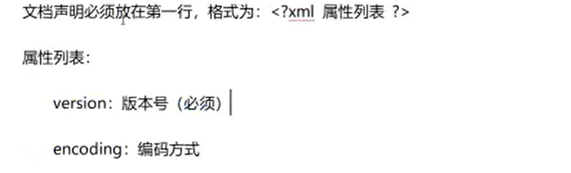
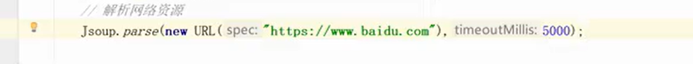

# XML概述


## xml的作用

配置文件：配置框架

传输数据：传输xm类型的字符串

## xml和html的区别


## xml的基本语法


```
<?xml version="1.0"?>  <!-- 第一行必须是文档声明 -->
<!-- 唯一的根标签 Students-->
<Students>
	<student>
		<!-- 属性值必须用单引号、双引号引用   -->
		<stuid id="001">1</stuid>
									<!-- 标签必须正确关闭 /标签名   大小写必须前后相同 -->
		<name sss='00a'>xiyangyang</name>
		<age>10</age>
	</student>
	
	<student>
		<stuid>2</stuid>
		<name>meiyangyang</name>
		<age>9</age>
	</student>
	
	<student>
		<stuid>3</stuid>
		<name>feiyangyang</name>
		<age>10</age>
	</student>
</Students>
```


## XML组成部分

### 文档声明



```
<?xml version="1.0" encoding="ISO-8859-1"?>
```

### 标签


<age.1> </age.1> 这种标签也是可以的


### 指令(了解)


### 属性


### 文本


CDATA区展示的文本不会被解析为 xml文件的代码

```
<![CDATA[ 要展示的文本  ]]>
```


# 约束


## 什么是约束


## DTD约束


文件的位置写文件的路径，一般是相对路径

例子


student.dtd文件的内容表明 

- students 是根结点，该根结点下可以放许多 student 结点
- student 结点 下能放且只能放一个name结点，一个age结点，一个sex结点，并且顺序必须是 name，age，sex
- name，age，sex 里面都是放 PCDATA,表示字符串
- student结点 有个 ID类型(ID类型表示不能重复)的 number属性，而且是必须的(#REQUIRED)

以此写一个 student.xml 文件 

```
<?xml version="1.0"?>
		<!--这里是根标签名-->
<!DOCTYPE students SYSTEM "student.dtd"> 
						<!-- 这个路径是相对路径，如果该student.xml文件和student.dtd在同一个文件夹下就这么写 -->
<students>
	<student id="001">
		<name>喜羊羊</name>
		<age>10</age>
		<sex>男</sex>
	</student>
	<student id="002">
		<name>喜羊羊</name>
		<age>10</age>
		<sex>男</sex>
	</student>
</students>
```


## Schema约束


Schema其实是用一个Schema文件去约束另一个Schema文件

Schema文件 是 xsd文件


例子：


这部分是命名空间


有一个结点 students，其类型是 studentsType

students结点内部有student，其类型是studentType，students内部的student结点个数最少0个，最大无限个(unbounded)


student结点内部还有 name age sex 结点，name是string类型，age是ageType类型，sex是sexType类型

student结点必须有number属性，其类型是numberType，并且这个属性是必须的


sexType ，值是字符串的，但是是一个枚举类型(enumeration)，其值有两种 male 和 female，非此即彼

ageType ，值是整数类型的(xsd:integer),最小值0，最大值256


numberType，其值是字符串类型，并且这个字符串要复合正则表达式 baizhan_\d[4]  bai_zhan 跟四位数字


写 student.xml 文档

```
<?xml version="1.0" ?>
<前缀:students
						版本
		xmls:xsi="http://www.w3.org/2001/XMLSchema-instance"
						        命名空间               具体路径
		xsi:schemaLocation="http://www.itbaizhan.cn/xml student.xsd"
					再写一遍命名空间
		xmls:前缀 = "http://www.itbaizhan.cn/xml">
		
		<前缀:student number="baizhan_001">
			<前缀:name>喜羊羊</前缀:name>
			<前缀:前缀:age>10</前缀:age>
			<前缀:sex>male</前缀:sex>
		</前缀:student>
</前缀:students>


```

上面， xmls:前缀，这里的前缀并非真的汉字"前缀"。

当我们对同一个 xml 文件需要引入多个 Schema 约束的时候，如果多个Schema约束标签出现了相同的，就需要添加前缀(起到命名空间的作用)，对这些相同的标签进行区分，分辨它们来自不同的Schema约束。我们需要给不同的约束添加不同的前缀


xmlns :xsd ，其中xsd 是前缀，所以所有标签前面都添加了 xsd:


xmlns:命名空间别名


# XML解析


DOM


## xml解析思想

## 常见解析器


# Jsoup解析器

## 使用方法


## 常用对象

### Jsoup




### Document


### Element


## XPath解析


# XML案例

## 使用Jsoup完成网络爬虫


## 配置爬虫程序的参数


因为每次都要编译太麻烦了，运行的是.java文件编译后的.class文件，试图修改.class文件中的内容很困难


