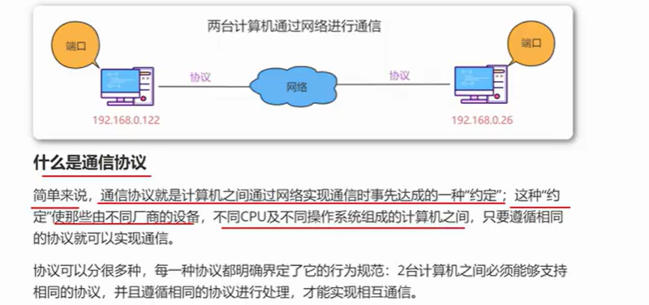
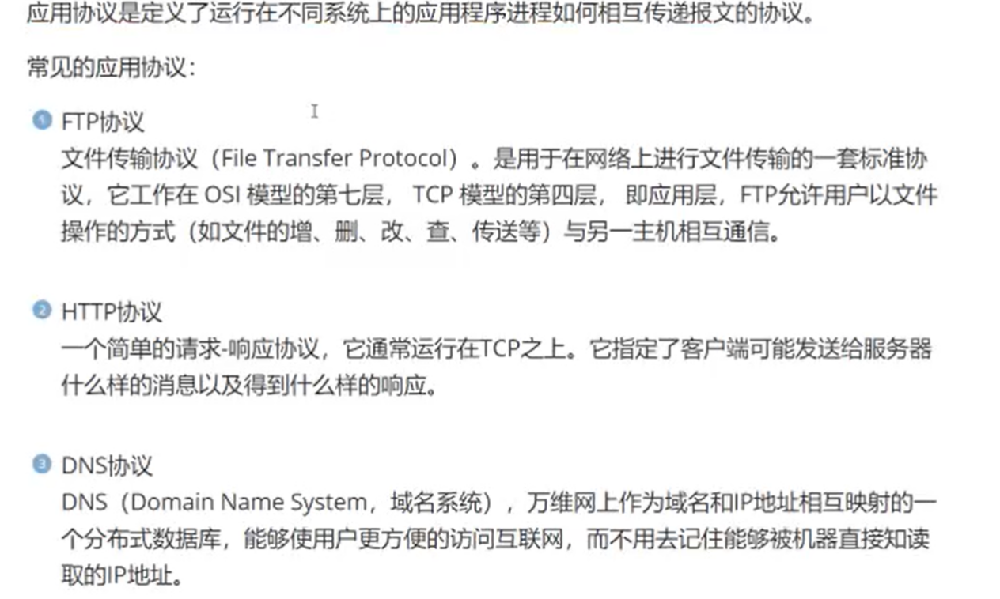
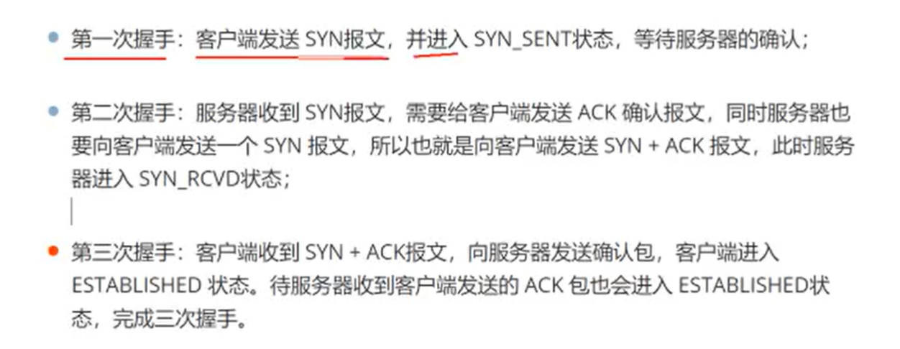
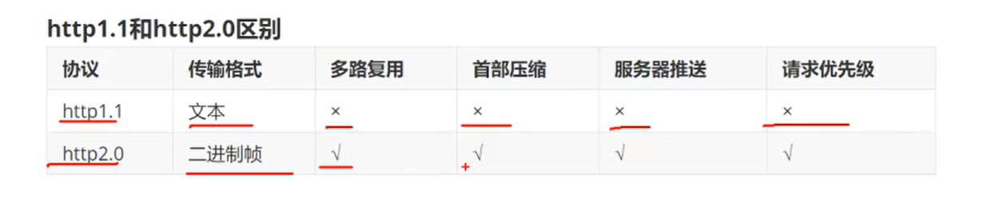
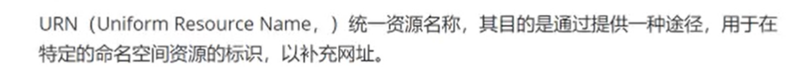
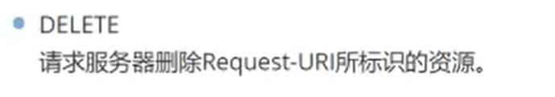
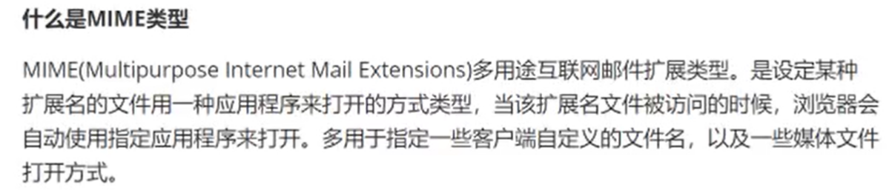
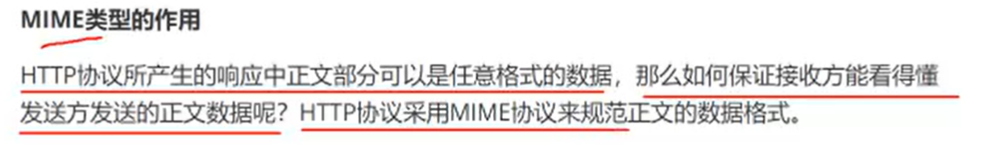

# 计算机网络通信

协议解决的是计算机硬件，操作系统之间的差异。

协议的标准化

# TCPIP协议群

## 什么是TCPIP协议群

应用层的协议与操作系统有关。传输层，网际层协议已经和操作系统无关了

## 什么是应用协议

应用协议是应用于 进程 与 进程 之间的。

## 什么是传输协议

## 什么是网际协议

网际协议的作用是寻找目标计算机

# **TCP**协议传输的特点

## 建立连接的三次握手

客户端与服务端互相总共发送三个包来确定连接的建立

## 断开连接四次挥手

ACK seq 这些全是协议头的内容，详见计算机网络

# 服务端口

## 端口作用

传输层协议利用端口号识别本机中的应用程序

## 端口分配

## 常见应用层协议端口分配

不允许两个应用去监听同一个端口

# 数据包的处理流程

## 什么是数据包

数据包是**通信传输中的数据单位**

数据包有两部分 ： 1   协议所要用到的首部    2 上一层传来的数据。

数据包的首部明确表明了协议如何读取数据

每一层都有每一层的首部。

## 数据包处理流程

# HTTP协议介绍

将来bs架构的软件，浏览器作为客户端，客户端用http去请求服务器端的网站。

## HTTP协议介绍

**什么是超文本**

html语言中的 a 标签

**什么是http协议**

# HTTP协议特点

http协议居于请求响应模式

# HTTP协议发展和版本

## HTTP1.0

## HTTP2.0

# **HTTP协议中的URI、URL、URN**

## URI统一资源标识符

## URL统一资源定位符

## URN统一资源名称

course/id/18.html 就是 URN

## URL编码

URL编码是将 URL中不可打印的字符或具有特殊含义的字符转换为Web浏览器和服务器普遍接受的字符的过程。

URL中的汉字都要进行URL编码。(把汉字字符串转成字节再转成URL字符串。浏览器会对URL编码进行解码并读取信息)。

原本的一个字符会被编码成 一个百分号和两个十六进制数字

# HTTP协议的请求Request

## HTTP协议中的请求信息

## 请求状态分析request

请求方式 get 没有请求体，其请求体的内容被拼接在URL(位于请求行)中

请求方式 post有请求体 ，不会直接暴露在url中

请求头是存储的浏览器的附件信息

# **HTTP协议的请求行、请求头、请求体**

## 请求行

## 请求头

## 请求体

html表单标签要上交的全部作为请求体

# **HTTP协议的请求方式**

## 多种请求方式

## Get和Post的区别

Post可以提交字符，也可以提交字节，而Get只能提交字符。

html的form标签中，Post方式默认是提交字符

# HTTP协议响应分析Response

## 响应消息分析

响应格式如下

响应体提供的就是 html页面的内容

# **HTTP协议的响应行、响应头、响应体**

## 响应行

### HTTP响应状态码

## 响应头

浏览器根据 content-type决定如何处理响应内容

## 响应体

提交方法为post时，参数放在响应体中。

# **MIME类型**

