 

# **Linux概述**


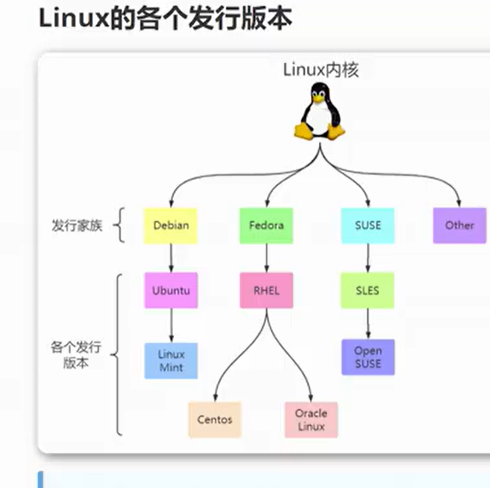


只要是 linux 内核的都一样，学1知其他


# **Linux下载安装**(VMWare虚拟机)


https://vault.centos.org


镜像文件 是 .iso文件


https://mirrors.aliyun.com/centos-vault/?spm=a2c6h.13651104.0.0.5f6612b2O7Cy9G


创建虚拟机


这一页不要动


稍后安装操作系统


路径选择你这台虚拟机要安装在哪里


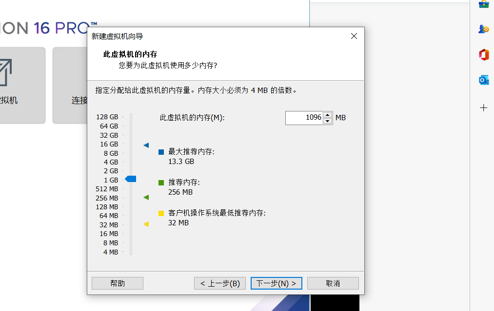

选择网络地址转换


选推荐的


选推荐的


至此为止一台虚拟机的硬件部分设置完毕，但是我们还需要给其安装操作系统


这里选择.iso文件


然后启动该虚拟机，开机的时候会释放这个 镜像文件.iso

选英文吧


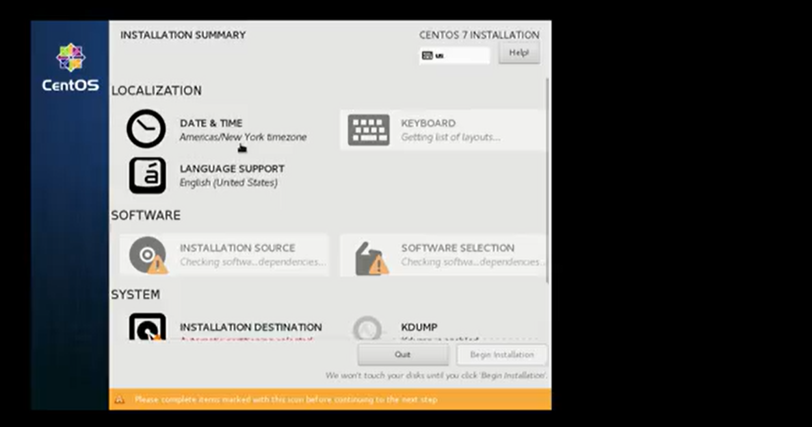

选择时区


安装标准服务版，基础环境第三个


点击 begin installation


给linux 创建用户名密码


## 用户名密码

设置用户名和密码都是**root**


我设置的红帽 linux 操作系统

账号是 linuxpro 密码  more@8899


注：centos 这里 ，输入Password的时候这里不会有显示，但确实是读入进来了


# Linux基本命令

## 关机和重启

关机

```
shutdown -h now        立刻关机
shutdown -h 5        5分钟后关机
poweroff            立刻关机
```


重启

```
    shutdown -r now        立刻重启
    shutdown -r 5        5分钟后重启
    reboot                立刻重启
```


# Linux 目录操作命令

## 目录切换cd

指令格式

cd /目录

```
cd /        切换到根目录
cd /usr        切换到根目录下的usr目录
cd ../        切换到上一级目录 或者  cd ..
cd ~        切换到home目录(当前用户的家目录)
cd -        切换到上次访问的目录
```

## 目录查看 ls [-al]

命令：ls [-al]

```
ls                查看当前目录下的所有目录和文件
ls -a            查看当前目录下的所有目录和文件（包括隐藏的文件）
ls -l 或 ll       列表查看当前目录下的所有目录和文件（列表查看，显示更多信息）
ls /dir            查看指定目录下的所有目录和文件   如：ls /usr
```

## 目录增删改查

### 创建目录【增】 mkdir

指令：

mkdir 目录

```
mkdir    aaa            在当前目录下创建一个名为aaa的目录
mkdir    /usr/aaa    在指定目录下创建一个名为aaa的目录
```


### 删除目录或文件【删】rm(删除指令)

指令：

rm [-rf] 目录


```
删除文件：
rm 文件        删除当前目录下的文件
rm -f 文件    删除当前目录的的文件（不询问）

删除目录：
rm -r aaa    递归删除当前目录下的aaa目录
rm -rf aaa    递归删除当前目录下的aaa目录（不询问）

全部删除：
rm -rf *    将当前目录下的所有目录和文件全部删除
rm -rf /*    【自杀命令！慎用！慎用！慎用！】将根目录下的所有文件全部删除

注意：rm不仅可以删除目录，也可以删除其他文件或压缩包，为了方便大家的记忆，无论删除任何目录或文件，都直接使用 rm -rf 目录/文件/压缩包
```

### 目录修改【改】mv 和 cp(重命名、剪切和移动指令)

```
一、重命名目录
    命令：mv 当前目录  新目录
    例如：mv aaa bbb    将目录aaa改为bbb
    注意：mv的语法不仅可以对目录进行重命名而且也可以对各种文件，压缩包等进行    重命名的操作

二、剪切目录
    命令：mv 目录名称 目录的新位置
    示例：将/usr/tmp目录下的aaa目录剪切到 /usr目录下面     mv /usr/tmp/aaa /usr
    注意：mv语法不仅可以对目录进行剪切操作，对文件和压缩包等都可执行剪切操作

三、拷贝目录
    命令：cp -r 目录名称 目录拷贝的目标位置   -r代表递归
    示例：将/usr/tmp目录下的aaa目录复制到 /usr目录下面     cp /usr/tmp/aaa  /usr
    注意：cp命令不仅可以拷贝目录还可以拷贝文件，压缩包等，拷贝文件和压缩包时不    用写-r递归
```


### 搜索目录【查】find

```
命令：find 目录 参数 文件名称
示例：find /usr/tmp -name 'a*'    查找/usr/tmp目录下的所有以a开头的目录或文件
```


# Linux 文件操作命令

## 文件操作【增，删，改，查】

### 新建文件【增】touch

```
命令：touch 文件名
示例：在当前目录创建一个名为aa.txt的文件     touch  aa.txt
```

### 删除文件 【删】 rm

命令：rm -rf 文件名

### 修改文件【改】 vi或vim(linux编辑器的模式)

基本上vi编辑器可以分为三种状态，分别是命令模式（command mode）、插入模式（Insert mode）和底行模式（last line mode），各模式的功能区分如下：

1) 命令行模式command mode）
      控制屏幕光标的移动，字符、字或行的删除，查找，移动复制某区段及进入Insert mode下，或者到 last line mode。
      命令行模式下的常用命令：
      【1】控制光标移动：↑，↓，j
      【2】删除当前行：dd 
      【3】查找：/字符
      【4】进入编辑模式：i o a
      【5】进入底行模式：:
2) 编辑模式（Insert mode）
         只有在Insert mode下，才可以做文字输入，按「ESC」键可回到命令行模式。
         编辑模式下常用命令：
         【1】ESC 退出编辑模式到命令行模式；
3)  底行模式（last line mode）
         将文件保存或退出vi，也可以设置编辑环境，如寻找字符串、列出行号……等。
         底行模式下常用命令：
         【1】退出编辑：  :q
         【2】强制退出：  :q!
         【3】保存并退出：  :wq


#### 编辑文件流程

打开文件

命令：vi 文件名
示例：打开**当前目录下**(如果打开的不是当前路径下的还要使用文件夹路径)的aa.txt文件     vi aa.txt 或者 vim aa.txt

注意：使用vi编辑器打开文件后，并不能编辑，因为此时处于命令模式，点击键盘i/a/o进入编辑模式。


编辑文件

使用vi编辑器打开文件后点击按键：i ，a或者o即可进入编辑模式。

i:在光标所在字符前开始插入
a:在光标所在字符后开始插入
o:在光标所在行的下面另起一新行插入

保存或者取消编辑

保存文件：

第一步：ESC  进入命令行模式
第二步：:     进入底行模式
第三步：wq     保存并退出编辑

取消编辑：

第一步：ESC  进入命令行模式
第二步：:     进入底行模式
第三步：q!     撤销本次修改并退出编辑


### 文件的查看【查】

文件的查看命令：cat more  less  tail  4个指令

cat：看最后一屏

示例：使用cat查看/etc/sudo.conf文件，只能显示最后一屏内容
cat sudo.conf

more：百分比显示

示例：使用more查看/etc/sudo.conf文件，可以显示百分比，回车可以向下一行，空格可以向下一页，q可以退出查看
more sudo.conf

less：翻页查看

示例：使用less查看/etc/sudo.conf文件，可以使用键盘上的PgUp和PgDn向上    和向下翻页，q结束查看
less sudo.conf

tail：指定行数或者动态查看

示例：使用tail -10 查看/etc/sudo.conf文件的后10行，Ctrl+C结束  
tail -10 sudo.conf

# **Linux三种网络模式**


## 桥接模式


桥接模式：物理机的网卡和虚拟机的网卡建立虚拟网桥。


网段：ipv4 的前24位，上面的例子中，192.168.1.101 192.168.1.105 192.168.1.106 192.168.1.107 前三位都是  192.168.1 

网关：计算机出子网通信的时候，必经过的路由器接口为网关，以ip地址的形式制定。

同子网内通信，不需要出网关，出子网通信(两个不同子网的设备通信)，必出网关


桥接模式，桥接模式就是将主机网卡与虚拟机虚拟的网卡利用虚拟网桥进行通信。在桥接的作用下，类似于把物理主机虚拟为一个交换机所有桥接设置的虚拟机连接到这个交换机的一个接口上，物理主机也同样插在这个交换机当中，所以所有桥接下的网卡与网卡都是交换模式的，相互可以访问而不干扰。在桥接模式下，虚拟ip地址需要与主机在**同一个网段**，如果需要联网，则网关与DNS需要与主机网卡一致。


## NAT


在NAT模式中，主机网卡直接与虚拟NAT设备相连，然后虚拟NAT设备与虚拟DHCP服务器一起连接在虚拟交换机VMnet8上，这样就实现了虚拟机联网。

VMware NetWork Adapter VMnet8 虚拟网卡主要是为了实现主机与虚拟机之间的通信


NAT模式虚拟机内部有一个路由器，该路由器需要网关


主机的是 192.168.62   虚拟机的是 192.168.1


## Host-only


Hostonly主机模式是NAT模式去除了虚拟NAT设备，然后使用 VMware Network Adapter VMnet1 虚拟网卡连接 VMnet1 虚拟交换机来与虚拟机通信


# 安装vim

安装完 contos后，默认安装了 vim编辑器，vim是没有安装的，所以我们在使用vim test.txt 时会提示：vim command not found


vim 编辑器安装需要三个包

vim-enhanced

vim-minimal

vim-common


输入 rpm -qa|grep vim命令

如果 vim 已经正确安装，则会显示上面三个包的名称

如果缺少了其中某个，比如说缺少了 vim-enhanced 命令，它会自动下载安装 


安装完成

# **Linux远程登录**


## 配置NAT模式网络连接


子网ip设置


点击NAT设置


给虚拟路由器设置网关


网关永远 不变 192.168.66.1 


点击确定


再打开之前创建的虚拟机，需要给虚拟机设置ip地址


登录完成后


我们需要进入 etc/sysconfig/network-scripts 这个文件夹下,找到其中的 ifcfg-ens33 文件

输入命令

```
cd /etc/sysconfig/network-scripts/
```

然后我们就能进入 network-scripts 这个文件夹

我们可以通过指令

```
ls
```


查看当前目录下的所有目录和文件


我们需要进入 ifcfg-ens33

输入命令

```
vi ifcfg-ens33
```

我们就可以进入该文件


我们需要对文件进行修改

当我们进入该文件时，文件不能修改。

我们按下a键 ，底部会出现文字 insert，此时就可以修改


当我们修改完毕，按键盘最左上角esc，底部insert消失，退出修改模式。

在退出修改模式后，我们先按:，冒号，然后输wq，即指令

```
:wq
```

该指令表示对文件的修改进行保存并退出

注意最下方会有


然后回车

它提示修改完成，并且退出该文件


我们需要把该文件改成下面的样子，具体修改如下


1. BOOTPROTO = dhcp 变成 BOOTPROTO = static
2. ONBOOT = no 变成 ONBOOT = yes
3. 添加 IPADDR = 192.168.66.100
4. 添加 NETMASK = 255.255.255.0
5. 添加 GATEWAY = 192.168.66.1
6. 添加 DNS1 = 223.5.5.5
7. 添加 DNS2 = 223.6.6.6 

启动 BOOTPROTO = static 是为了取消动态分配ip地址，我们给这台虚拟机设置成静态的ip地址

添加 IPADDR = 192.168.66.100是把这台虚拟机的ip地址设置为 192.168.66.100 进行固定

NETMASK 设置子网掩码 GATEWAY 设置网关

DNS1 DNS2 连接 阿里的DNS服务器让虚拟机能够解析域名


我们对虚拟机进行重启


至此，虚拟机内部网络配置完成


设置 VMwareNetwork Adapter


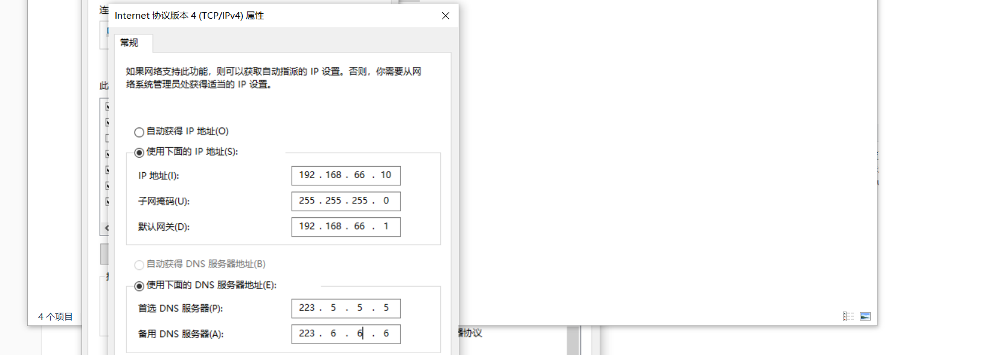


### 配置NAT模式网络连接总结


我们需要设置 

1. 虚拟机 的网络
2. windows中VMware NetWork Adapter VMnet8
3. vmware软件虚拟网络编辑器设置 vmnet8


### 设置XShell连接

远程连接到该虚拟机，依靠XShell

新建连接


主机是我们要连接的主机的ip，即我们设置的虚拟机的主机的ip


点击下面的连接


接收并保存


用户名 ：root 我们设置的


密码：root


点击确认，进入，就连接成功了


这里可以修改字体大小


通过 XShell 可以实现复制文本，光标不会丢失


# **Linux系统目录结构**


输入指令

```
cd / 
```

回车

再输入指令

```
ll 
```

再回车


这里 / 表示根目录


命令

```
cd bin
```

进入 bin 文件

进入该文件夹后，输入指令 ll，能够看到一些二进制文件，这些二进制文件都是我们可以输入的命令

输入指令 

```
cd .. 
```

退出bin文件夹，回到 根文件夹


boot文件夹放的是启动linux操作系统的核心文件

dev 放置linux 的外部设备

etc 是存放系统管理所需要的配置文件和子目录

home 是用户的子目录，windows里面是user


lib和lib64 放的是基本的动态链接共享库，类似于windows的 dll 文件

media放的是自动识别一些设备，并放入该目录

mnt 是存放临时挂载的文件

opt 是安装软件所在的目录，软件的安装包都会放入 opt

proc 是一个虚拟文件系统，总之不要动

root 系统管理员，超级管理员的路径

run 放临时文件，系统启动以来的一些信息

sbin 超级用户的二进制文件，系统管理员的命令

srv 服务启动后放置一些文件

sys linux2.6依赖才有，针对进程存储的文件

tmp 放置一些运行的临时文件

**usr 好多的应用程序，软件都放在这里**

var 放置一些不断扩增的数据


linux的根目录 是 /

usr文件夹 放置应用程序软件

# **Linux用户和用户组**

Linux 是一个**多用户、多任务**的操作系统

可以在linux上创建许多用户

每个用户可以**同时**在linux上**执行不同的任务**


**具有相同特征(比如都共有某个权限)的用户合成一个组**，这个组称为用户组


# **Linux用户管理**


我们能用的 从 1000开始，UID 1到999 是已经被占用了，如果我们还占用可能会出现冲突


## 用户添加 useradd 


```
指令 
useradd 选项1 参数1 选项2 参数2  ....    指定用户名
```

选项如下


创建完成后我们进入 home 文件夹 执行 ll 查看所有文件


我们还可以通过  id + 用户的名字查看该用户


例子


## 修改用户 usermod


```
指令 
usermod 选项1 参数1 选项2 参数2  ....    指定用户名
```


## 用户账号口令管理


```
指令 
passwd 选项1 参数1 选项2 参数2  ....    指定用户名
```


我上锁的密码是 asdjkl123


上锁和解锁


## 删除用户

```
指令
userdel 选项 用户名
```


## id username 

id username查看用户的UID、GID和用户所属群组的信息，如果不指定用户，则显示当前用户的相关信息。


# Linux用户组管理


## 用户组和用户的相关文件

### /etc/passwd文件

/etc/passwd文件：passwd文件的每一行用“：” 分隔为7个域，各域的内容如下：
用户名:加密口令:UID:GID:用户的描述信息:主目录:命令解释器（登录shell）


### /etc/shadow文件

存放用户经过加密的口令，用“：”分割为九个域：


### /etc/group文件

存放用户的组账户信息，对于该文件的内容任何用户都可以读取。

分为四个域：群组名称:群组口令（一般为空，用x占位）:GID:群组成员列表


### /etc/gshadow文件

用于存放群组的加密口令、组管理员等信息，该文件只有root用户可以读取。

4个域表示：群组名称:加密后的群组口令（没有就用！）:群组的管理员:群组成员列表


## 添加新组groupadd


```
groupadd 选项1 参数1 选项2 参数2 .... 组名
```


创建组名为 bigdata

## 修改群组 groupmod


```
groupmod 选项1 参数1 选项2 参数2 ...  组名
```


## 删除群组 groupdel


```
groupdel 组名
```


## 为群组添加用户 gpasswd 

gpasswd -a 用户 组 /-d 把用户从组删除/ -r取消组的密码 /-A 给组指派管理员

# **Linux超级用户和伪用户**


## 用户身份切换，指令 su，sudo

### su


通常su语法就是

```
su 指定用户名
```

小权限往大权限需要输入密码

大权限往小权限不需要输入密码


### sudo

 sudo是linux下常用的允许普通用户使用超级用户权限的工具，允许系统管理员让普通用户执行一些或者全部的root命令，如halt，reboot，su等等。这样不仅减少了root用户的登陆和管理时间，同样也提高了安全性。Sudo不是对shell的一个代替，它是面向每个命令的。

  它的特性主要有这样几点：

​    1、sudo能够限制用户只在某台主机上运行某些命令。

​    2、sudo提供了丰富的日志，详细地记录了每个用户干了什么。它能够将日志传到中心主机或者日志服务器。

​    3、sudo使用时间戳文件--日志 来执行类似的“检票”系统。当用户调用sudo并且输入它的密码时，用户获得了一张存活期为5分钟的票（这个值可以在编译的时候改变）。

​    4、sudo的配置文件是/etc/sudoers，属性必须为0440，它允许系统管理员集中的管理用户的使用权限和使用的主机。

sudo指令能够实现**让普通用户做超级管理员才能做的权限**


### visudo命令

visudo **编辑/etc/sudoers文件**(配置用户权限文件)的专属命令

​    注意：编辑sudo的配置文件/etc/sudoers是一般不要直接使用vi（vi /etc/sudoers）去编辑，因为sudoers配置有一定的语法，直接用vi编辑保存系统不会检查语法，如有错也保存了可能导致无法使用sudo工具，最好使用visudo命令去配置。虽然visudo也是调用vi去编辑，但是保存时会进行语法检查，有错会有提示。


visudo授予权限的编写方式

```
用户名 允许使用的主机 = (以谁的身份)   可以执行的命令的列表
```


输入


跳出来一堆


输入 

:set nu


出现行数


往99找

不要用鼠标滚轮滑动，用上下键进行上下文移动

找到后

:set nonu  去除行标

在 Allow root to run any commands anywhere这句话后面进行编写授予权限


root允许所有的命令，我们可以接着往下写

授予 njupt 所有权限，根据

用户名 允许使用的主机 = (以谁的身份)   可以执行的命令的列表

指令


 用户需要显示自己被授予了权限


每次执行越级权限的时候还需要输入 用户自身的密码

我们可以设置普通用户每次执行执行被授予的权限时不需要输入密码

还是root 模式 visudo 指令


# **Linux文件基本属性**

Linux 一切都是文件，包括目录(文件夹)也是文件

## 显示文件属性 指令ls


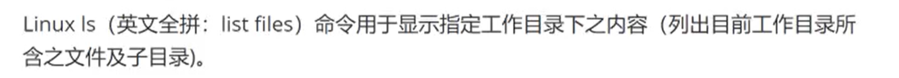

语法

```
ls 参数    参数用来表示显示什么属性
```

参数列表如下


重点使用前两个参数 -a 和 -l


例子


隐藏文件的文件名都是 以 . 开头的

ls -l 可以显示文件的具体属性

ls -l 就是 指令 ll(两个l) 的缩写 

```
-rw-------.   表示文件的权限
1             链接数
root          表示该文件是由谁创建的
root 		  表示该文件属于哪个组
1233 		  表示该文件的大小
Nov  8 06:41  表示文件什么时候被创建   
anaconda-ks.cfg   
    
```

ls -a -l 两个参数一起使用


波浪线表示 root 目录， 在root目录下 通过 指令

```
cd / 
```

回到主目录

## 文件与目录操作


## linux 文件类型


ll指令中查看最左边那一列的第一位是什么来辨别这是什么文件


## 文件权限


ll 中看到的 文件最左边的那一列，一共有10个字符，第一个表示文件类型，剩下9个也有各自作用


- 前三位，表示创建这个文件的用户能够操作这个文件的权限，三位 分别表示 r w x 读 写 执行，如果对应功能不允许就写成 - 取代 r w x
- 中间三位，表示属于该用户组的用户能够操作这个文件的权限，三位 分别表示 r w x 读 写 执行，如果对应功能不允许就写成 - 取代 r w x。用户组的用户不允许写，所以第二位 一定是 -
- 最后三位，表示非该用户组的用户能够操作这个文件的权限，三位 分别表示 r w x 读 写 执行，如果对应功能不允许就写成 - 取代 r w x。用户组的用户不允许写，所以第二位一定是-

查看该文件所属用户组和该文件由谁创建上面已经提过

```
-rw-------.   表示文件的权限
1             链接数
root          表示该文件是由谁创建的
root 		  表示该文件属于哪个用户组
1233 		  表示该文件的大小
Nov  8 06:41  表示文件什么时候被创建   
anaconda-ks.cfg   
```


# **Linux权限字与权限操作** 指令 chmod chgrp chown


chown 改变这个文件是谁创建的


## 改变所属组群chgrp


有两个用户 njupt2 和 baizhan2

使用 njupt2 创建文件，其所属组为 njupt2

切换为 root 用户把该文件从 njupt2 组变为 baizhan2

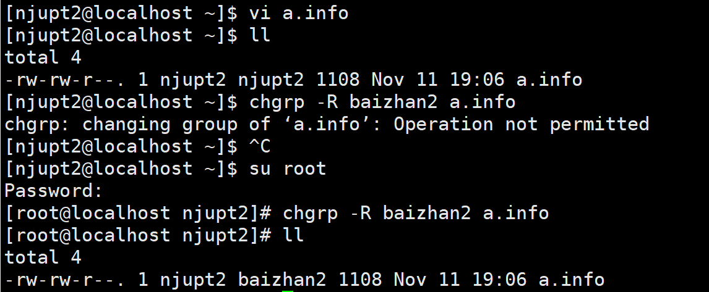


## 改变文件属性 chmod


### 文字设定法


```
chmod 哪个用户  + - =  读写执行的权限 文件或者目录
```


给这个文件的创建者添加执行权限

```
chmod u+x a.info
```


### 数字设定法


## 改变文件属主


# Linux 路径


## 绝对路径


## 相对路径


一切以 /开头的是 绝对路径，一切以.开头的是相对路径

# **Linux目录文件操作常用命令**

## 显示目前所在目录


## mkdir 创建新目录


递归创建文件夹，a文件夹里面有b文件夹，b文件夹里面有c文件夹，c文件夹里面有d文件夹

## rmdir 删除空目录


## 复制目录和目录下的文件


```
cp 添加参数 你要复制的文件的路径(可以绝对路径可以相对路径)   你要把文件复制到哪里(可以绝对路径可以相对路径)
```

要复制文件夹就添加-r的参数


## 删除文件或目录rm


使用多个参数的时候， 写成 -fir 和 -f -i -r 都可以


## 移动文件与目录或修改名称


# **Linux文件编辑工具vim**


## 命令模式


## 输入模式


## 底线命令模式


该模式下 按住 shift + 快速两次z(小写)也是保存退出


vim 比vi多了支持脚本语言命令，支持彩色

# **Linux文件内容查看命令**

该文件必须是文件而不是文件夹

## cat显示文件内容

由第一行开始显示内容


## tac(倒着显示文件的内容)


## nl显示行号


## more(一页一页显示)


## less(往前翻页)

一页一页翻动


/less 比 /more 多了搜索功能

## head(看一个文件的头几行)


```
head -n 数字 文件的路径
```


## tail(只看尾几行)


# **Linux打包压缩与搜索命令**

拓展名

linux 中打包文件：aa.tar

linux 中的压缩文件：bb.gz

linux中打包并压缩的文件：.tar.gz

一般情况下打包和压缩是一起进行的，打包并压缩后的文件的后缀名一般 .tar.gz

## 打包tar


你要打包的文件可以是多个

指令格式

```
tar -zcvf 打包压缩后的文件名 要打包的文件(如果是所有文件那就是*) 你希望解压到的文件路径

-C 希望解压到的文件路径是可选部分 ，如果不指定就默认解压到当前路径
```


## 解压tar

```
tar -zxvf 压缩的文件 -C 你希望解压到的文件路径

-C 希望解压到的文件路径是可选部分 ，如果不指定就默认解压到当前路径
参数中的x表示解压
```


## gzip和gunzip压缩


压缩后的文件文件后缀是 .gz


## 搜索命令 grep

grep用于在文本中执行关键词搜索，并显示匹配的结果

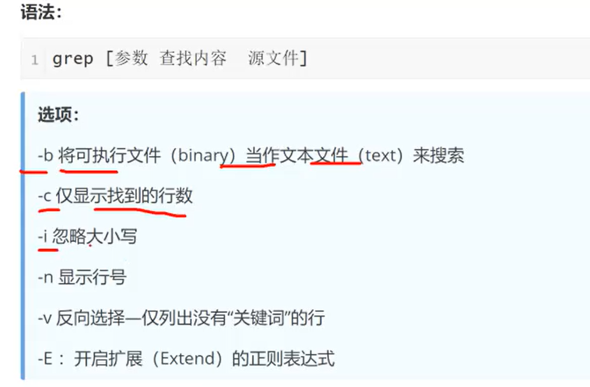

```
grep -n "test" a.info
在当前目录下的 a.info 文件中查找test字符串并且返回所在行号
```


## 搜索命令 find

find命令用来按照指定条件 查找文件


```
find /root/ "*.log" -ls 在/root目录查找以 .log 为结尾的文件并展示其详细信息
find . -user njupt2  在当前目录查找创建者为 njupt2的文件
```

# **Linux常用系统工作命令**

## reboot命令


## poweroff命令


## wget命令


使用 wget 必须电脑有网，获取下载地址


如果显示 command not found


执行命令

```
yum install wget -y
```


在哪个文件夹下调用该命令则文件下载在哪个文件夹下

# **Linux重定向、管道符和环境变量**


## 输入输出重定向


重定向：原本要写到屏幕的信息，写到文件里


重点是输出


覆盖信息是 > ，追加信息是 >>

## 管道命令符


把一个命令的输出结果变为另一个命令的输入(参数)


## 命令行通配符


## 重要的环境变量


### 系统级

需要在 /etc/profile 文件进行设置


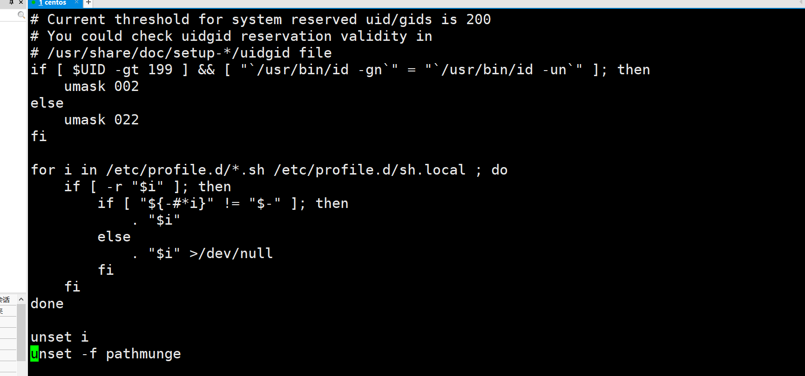

一定要在该文件的最下方进行编辑


举例子

这是tomcat 的目录


我们把 linux 版本的tomcat解压后放在 /usr/local 路径下


这是java的目录


linux 版本的java的路径为


下载方式就是通过 wget指令


配置java环境变量


通过 指令  source /etc/profile 让配置文件生效，如果不报错就成功


### 优先级环境变量


# 磁盘管理

## 磁盘基础知识

在磁盘中，文件存储的最小单位是扇区(Sector)，每个扇区可以存储 512Bytes 的数据。

但是为了提升系统效率，操作系统会一次连续读取多个Sector，我们把这一次性读取的多个Sector叫做Block(块)


## fdisk命令


通过 fdisk -l

有几个 Disk 开头的，就表示有几个磁盘

可以在Disk内查看该磁盘是否有分区


该磁盘   /dev/sda 有两个分区(看 Device Boot)


这两个磁盘都没有分区


给 /dev/mapper/centos-root 添加分区

fdisk 指定磁盘路径


Command 指定用 n 指令。再使用 p表示新增磁盘分区

Patition number 表示给这片分区编号，First sector 表示磁盘的起始扇区

# **Linux系统状态检测命令**

## ip addr 命令

```
ip addr
```


ens33 是一个网卡


## uname命令

uname 命令用来查看系统的内核版本


```
uname -a
```


也能通过指令

```
cat /etc/redhat-release
```


## free 命令

显示计算机当前内存使用情况

```
free -h
```


## last 命令

用来查看系统的登录记录

```
last 参数
```


## history命令

显示历史执行过的命令


## uptime命令


# **Linux软件安装命令**

三种安装方式

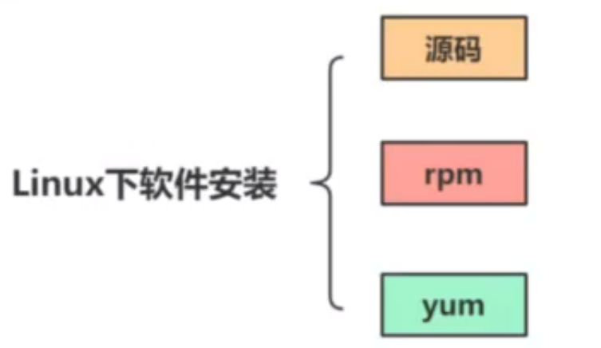

## 源码安装


## RPM软件包管理


该安装方式必须获取(从网站下载)软件的 rpm包


## YUM安装


### Yum配置文件


命令

```
yum repolist all
```

Yum源：阿里云


配置文件 /etc/yum.repos.d/CenOS-Base.repo 配置的就是 YUM源，即配置YUM服务器


配置YUM源为阿里云


1. 先进行文件的备份

   

   CentOS-Base.repo 备份成了CentOS-Base.repo.bak

2. 下载阿里云的 Centos-7.repo文件

   执行命令

   ```
   wget -O CentOS-Base.repo http://mirrors.aliyun.com/repo/Centos-7.repo
   ```

   

   

   又生成了新的CentOS-Base.repo ，这是阿里云的

   

3. 重新加载 yum

   ```
   yum clean all
   
   yum makecache
   ```

   

### YUM使用手册


# **Linux常用软件安装_JDK和Tomcat安装**

## JDK安装


通过xshell的方式把本机文件传输给虚拟机


我的java路径

/usr/java/jdk-19.0.1


校验是否配置成功 java -version


## Tomcat安装

路径

/tomcat/apache-tomcat-8.5.83


记得 source /etc/profile 更新环境变量

开启tomcat服务


希望能够访问虚拟机中搭建的网站

查看防火墙状态


```
firewall-cmd --state
```

把防火墙关闭


```
systemctl stop firewalld.service
```

我们设置的虚拟机的ip地址是 192.168.66.100


还是把项目放在 webapps中

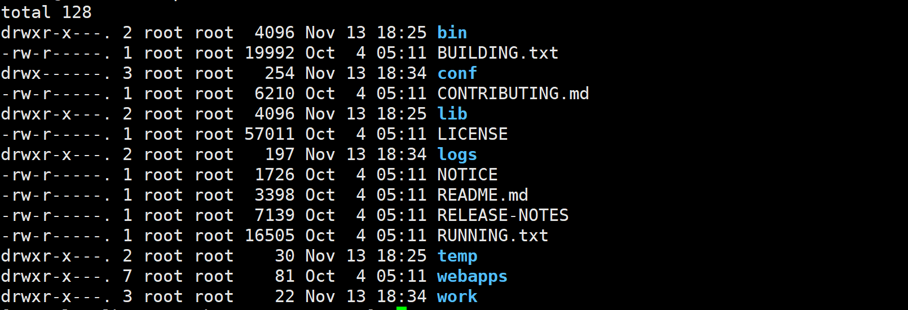


# **Linux常用软件安装_Mysql数据库安装**


```
wget http://dev.mysql.com/get/mysql57-community-release-el7-10.noarch.rpm
rpm -ivh mysql57-community-release-el7-10.noarch.rpm
yum -y install mysql-community-server
```


出现报错


yum安装的时候不要进行 gpg验证

```
yum -y install mysql-community-server --nogpgcheck
```


至此安装完成


```
systemctl  start mysqld 开启 mysql服务
systemctl  status mysqld 查看服务是否运行
```


搜索登录 mysql 需要用的密码

```
grep "password" /var/log/mysqld.log
```

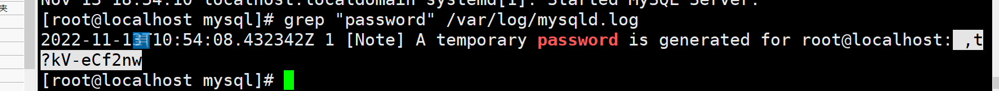

密码是,t?kV-eCf2nw


密码这里不会显示为了安全


```
alter USER 'root'@'localhost' IDENTIFIED BY '123456';
```

我们把密码设置成了 123456

每句最后必须要加上分号才算结束当前语句


```
set global validate_password_policy = 0;
set global validate_password_policy = LOW;
set global validate_password_length = 6;
```


## 通过windows上的 navicat 连接 虚拟机上的 mysql

一台计算机连接另一台计算机上的mysql


密码 123456

前提

- 需要把虚拟机的防火墙关闭

- 

  切换到 mysql数据库,执行sql语句

  ```
  select user,host from user;
  ```

  

  第三行表示 只有 localhost能连接 mysql连接，要改成所有的都能连接

  ```
  update user set host="%" where user = "root";
  ```

  


还不行就重启一下

连接成功


## **Mysql数据库卸载**


停止 mysql 服务


# **Linux进程管理**

进程：执行中的程序

## 指令ps


展示出信息的含义


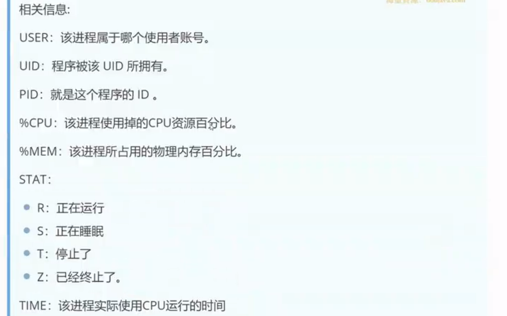


### ps命令通常要和管道命令联合使用

```
ps -aux|egrep '(cron|syslog)'
```


## 指令top


## 指令 htop


```
yum install epel-release -y
yum install -y htop
htop
```


## 指令 kill 终止进程


进程id 就是 pid

## 指令 netstat


# **Linux系统服务**


## Service 命令


## Systemd命令


### systemctl命令

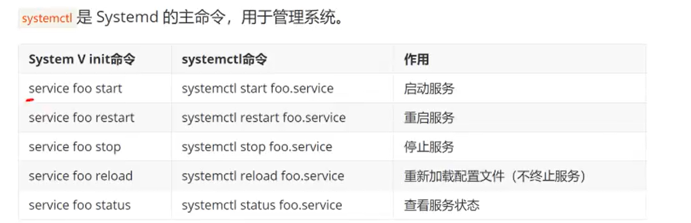

### systemd-analyze命令


### hostnamectl命令


### timedatectl命令


## Chkconfig


**设置电脑开机服务要不要自动启动**


```
chkconfig --add(del、level) 服务名
```


## 常用服务名


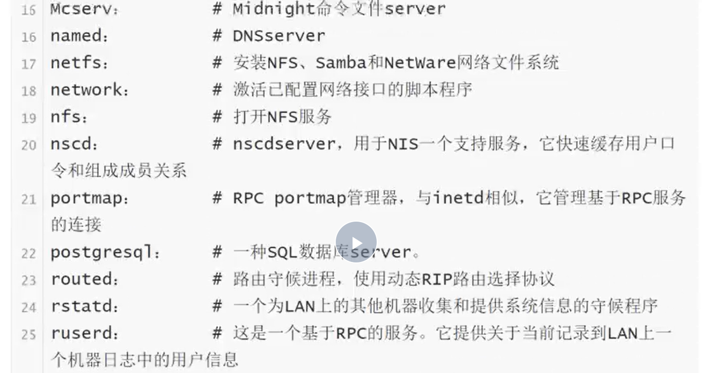


# **Linux定时任务**


## crontab配置文件

指令

```
vim /etc/crontab
```


5个星号

- 第一个是分钟数，每个小时的第几分钟
- 第二个是小时，几点的时候
- 第三个数是月的第几天
- 第四个数是月，这一年的第几个月
- 第五个是使用星期


## crontab命令


当前没有定时任务

 执行 crontab -e


我们可以把定时任务写入这里面


# **Linux网络防火墙**

## 什么是防火墙

防火墙可以根据协议或者目标的规则过滤请求

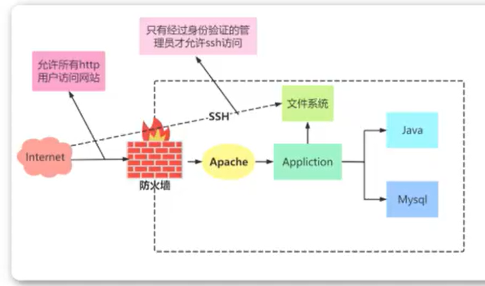

可以控制哪些流量允许来到我们的计算机，哪些不允许

根据源地址 端口号 协议阻隔流量

## firewalld

### firewalld概述


### firewalld常用区域

区域是**预先提供出的模板**，预先划定一些规定是哪些区域可以


public 是默认的

trusted 是全开

drop 是全关

### firewalld配置


### 终端管理工具


开启防火墙

获取当前的区域

获取全部的区域


设置全开


我又把区域设置成了 public

允许通过的协议


添加http协议允许通过


变多了


我们希望在区域中能够出现多的协议或者删除一些协议

在public区域中添加http服务


在public区域中移除 http服务


添加 通向8080端口的tcp协议的数据到public区域中


## SELinux


关闭 SElinux服务


enforcing 变成 disabled

# **Linux内核机制**
