# Maven简介

## 介绍


## 作用

maven两大作用：**一键构建** 和 **依赖管理**

### **一键构建** 

当然IDEA也可以编译


### 依赖管理


不管有多少项目，这些项目一定都只用一份jar包，jar包多次，反复导入各个项目中。


# Maven的安装

**在安装Maven前一定要安装java，因为maven是使用java开发的。**

要在环境变量中设置 javahome

下载地址：[Maven – Download Apache Maven](https://maven.apache.org/download.cgi)


## Maven文件的目录

安装好后的目录以及各目录存放的内容


文件mvn就是命令


引导文件


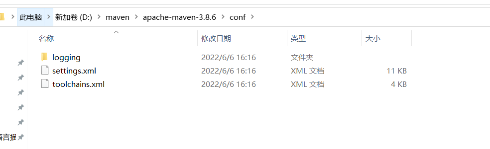

配置文件

logging是 日志文件 settings 是 核心配置文件


本身依赖用到的jar包

## 配置环境变量


mvn -v 注意空格


# Maven工程的类型和结构


## Maven工程类型

Maven 有 POM JAR WAR 三种工程类型

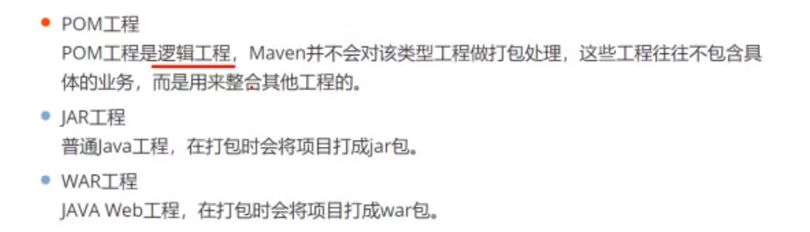

POM工程内部没有java代码，这种工程是用于整合其他工程的。

JAR工程，普通java工程。

WAR工程，JAVA Web 工程。


## Maven工程结构


src 源代码 .java 文件

target 编译后生成的文件，class文件


项目结构


webapp 存储的是 css js html 等的前端文件

注意 这个文件存放位置都是固定的。

如果是 .java文件就放在 java文件夹下，如果是 xml 等配置文件就放在 xml文件夹下。

test 文件夹下的都是用于测试的。由分为测试用的.java文件和测试用的配置文件(比如.xml)。


# **一键构建_项目的生命周期**


maven有三套生命周期，这里关注的是 构建声明周期。

# **一键构建_Maven常用命令**

Maven依赖插件执行命令


在Maven构建项目的每一步都可以使用一句简单的命令完成，接下来学习这些命令：


如何使用 mvn 命令


在资源管理器中打开maven项目。


在当前页面调出 cmd


此时 cmd 也进入到了 maven 项目当中

执行   **mvn clean**


每次重新编译之前都需要清除之前编译完成的，防止出现冲突。

validate命令，只能完成对项目编译期间的检查。很少使用。


mvn compile 对项目进行编译

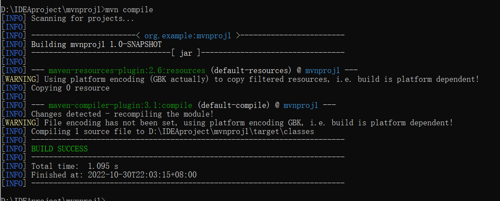

target文件夹再出现


内部有 class 文件


test 命令 会编译测试文件夹中的项目。


package 会进行编译等等一系列操作之后，还会打包

打包后的结果放在 target 文件夹中 。我这里是 jar  包 ，如果是网络的项目那么就是 war 包


## mvn install本地发布 pom.xml 中的坐标

pom.xml 中有两个属性， groupId 和 artifactId 


它发布的位置是：groupId中的值 + artifactId中的值。

如果别的项目想要使用这个项目 ，那么也是通过 groupId中的值 + artifactId中的值来引入。这是项目的坐标


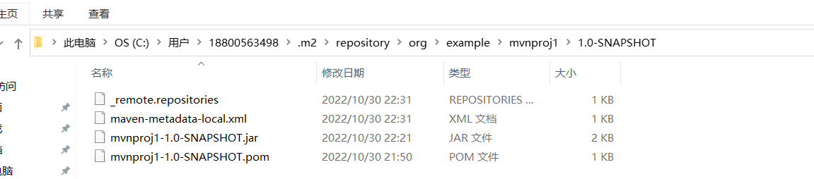

c盘的repository  就是maven的仓库


tomcat:7 使用 tomcat 运行项目

插件：plugins


# 依赖管理_Maven仓库类型


## 本地仓库


## 远程仓库


## 中央仓库


中央仓库服务器在**境外**

# 依赖管理_Maven配置文件


## 配置本地仓库

打开 settings.xml 配置文件


以管理员模式启动

修改方式 ，把 <localRepository>/path/to/local/repo</localRepository> 从注释中复制出来。并写成你设置的本地仓库(即文件夹)的路径


再打包发布到本地仓库来测试是否配置成功


以后依赖的下载和项目的打包上传都是这个文件夹

## 配置镜像

配置镜像语法规范是写死了


```
<mirror>
	<!--指定镜像ID-->
	<id>nexus-aliyun</id>
	<!--匹配中央仓库-->
	<mirrorOf>central</mirrorOf>
	<!--指定镜像名称-->
	<name>Nexus aliyun</name>
	<!--指定镜像路径-->
	<url>http://maven.aliyun.com/nexus/content/groups/public</url>
</mirror>	
```


## 配置JDK版本


```
<profile>
	<id>jdk11</id>
	<activation>
		<activeByDefault>true</activeByDefault>
		<jdk>11</jdk>
	</activation>
	<properties>
		<maven.compiler.source>11</maven.compiler.source>
		<maven.compiler.target>11</maven.compiler.target>
		<maven.compiler.compilerVersion>11<maven.compiler.compilerVersion>
	</properties>
</profile>
```

# **依赖管理_Idea配置Maven插件**

不要使用IDEA自带的Maven，要使用我们本地下载的Maven，版本通常更新一点


配置三个

Maven home path ：Maven的安装路径

User settings file：配置文件路径

Local repository：本地仓库路径

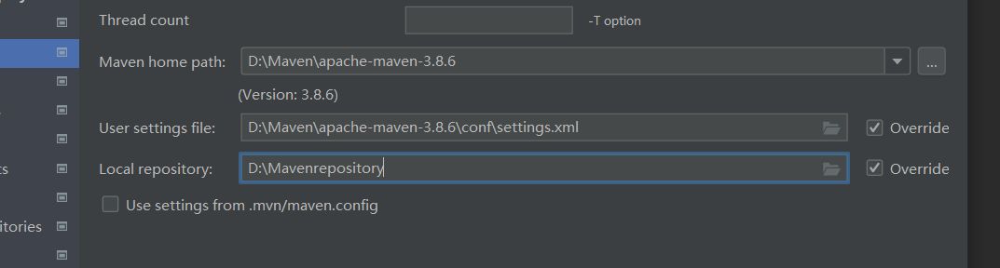

Maven配置文件有语法错误可以通过IDEA编译器进行检查


**注意，当前配置完了Maven插件的路径，只在当前创建的项目中生效。**

如果希望该配置还能在其他新创建的项目中生效，要打开 new project setup 再配置一遍。


# **Maven工程开发_IDEA构建Maven工程**

使用IDEA 创建 Maven工程的Web工程

使用**模板**(archetype)来构建工程


选择模板


点击next以后一定要配置坐标


GroupId 是项目组的名字，ArtifactId 是项目的名字

GroupId 通常是半个路径

Version 是 版本号


这一页基本不要变动，就是 Maven 插件的路径，之前已经配过了

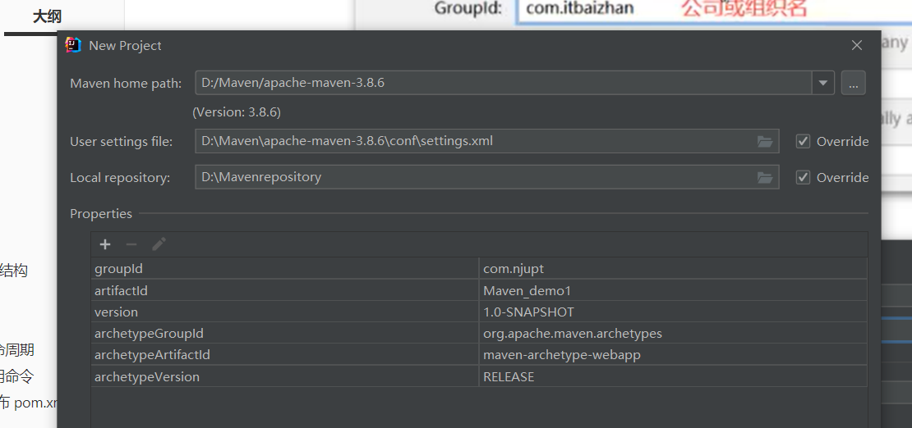


## 创建完成项目后配置

创建出来的工程 并没有 resource 等一系列更多文件夹，需要我们手动添加


java 和 resources都是我们手动创建的。

我要让工程知道文件夹的作用是什么


sources root 源代码文件夹，放 .java文件

test sources root 测试源代码文件夹

resources root 配置文件夹,放.xml啥的

test resources root 测试配置文件夹

 


# **Maven工程开发_pom文件配置**


groupid  如果项目上限 网址是 www.njupt.com，那么groupid 就是 com.njupt 

项目发布后，项目的坐标是 groupid + artifactid

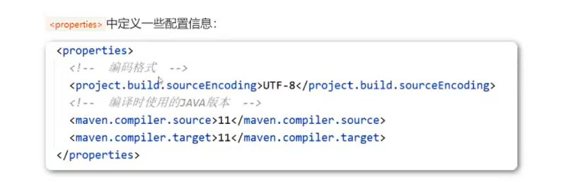

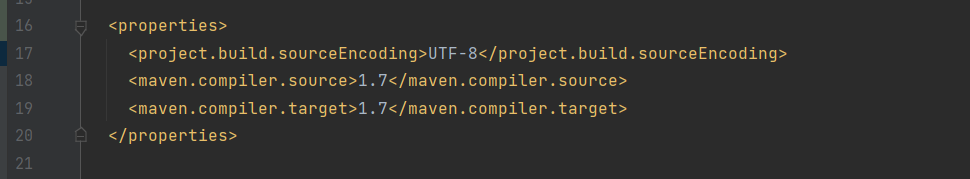

java版本改成


dependencies 放的就是坐标


https://mvnrepository.com/

搜索 servlet ，3.0.1


搜索jsp


点击刷新


字体不变红就引入成功


插件的配置放在 plugins 中

```
<plugin>
	<groupId>org.apache.tomcat.maven</groupId>
	<artifactId>tomcat7-maven-plugin</artifactId>
	<version>2.1</version>
	<configuration>
		<port>8080</port>
		<path>/</path>
		<uriEncoding>UTF-8</uriEncoding>
		<server>tomcat7</server>
	</configuration>	
</plugin>
```


# **Maven工程开发_编写代码**


```
package com.njupt;

import javax.servlet.ServletException;
import javax.servlet.annotation.WebServlet;
import javax.servlet.http.HttpServlet;
import javax.servlet.http.HttpServletRequest;
import javax.servlet.http.HttpServletResponse;
import java.io.IOException;

@WebServlet("/demo1")
public class demo1 extends HttpServlet {
    @Override
    protected void doPost(HttpServletRequest req, HttpServletResponse resp) throws ServletException, IOException {
        req.getRequestDispatcher("hello.jsp").forward(req,resp);
    }

    @Override
    protected void doGet(HttpServletRequest req, HttpServletResponse resp) throws ServletException, IOException {
        this.doPost(req, resp);
    }
}
```


点击 execute maven goal


maven使用 tomcat7运行项目命令

```
mvn tomcat7:run
```


在这里配置使用 maven 运行项目


# **Maven工程开发_依赖范围**


项目引入了 servlet 和 jsp 的jar包 而tomcat7 插件内部也有 这两个jar 包，造成jar包冲突。

但是我们不引入这两个jar包通不过编译。

我们希望这两个jar包编译的时候起作用，运行的时候不起作用。

我们可以设置其依赖的作用范围 scope 标签

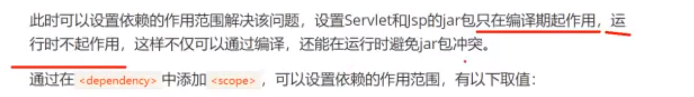

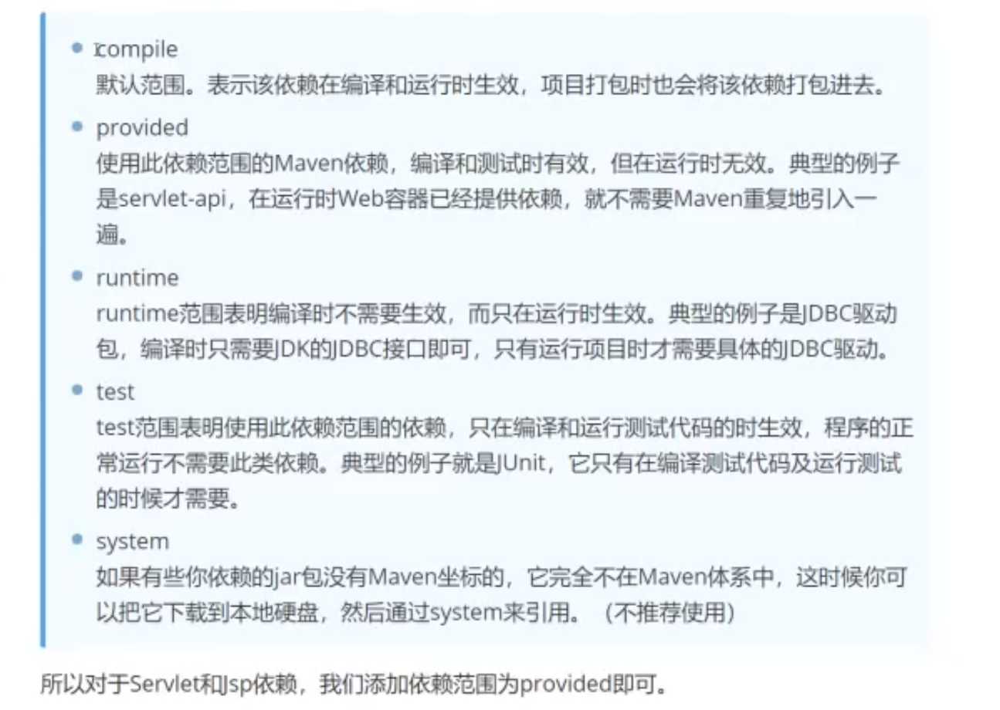

# **Maven工程测试_测试概述**


****


# **Maven工程测试_Junit使用步骤**


# **Maven工程测试_Junit结果判定**


右键run进行方法执行


```
package com.njupt;

import org.junit.Test;

public class demo2test {
    @Test
    public void testadd(){
        demo2 d1 = new demo2();
        int m  = d1.add(10,20);
    }
    @Test
    public void testdiv(){
        demo2 d1 = new demo2();
        int m = d1.add(10,0);

    }
}
```


Assert.assertEquals(参数1,参数2);   第一个 预期结果，第二个 实际结果


断言不一致会出现异常

# **Maven工程测试_@Before、@After**

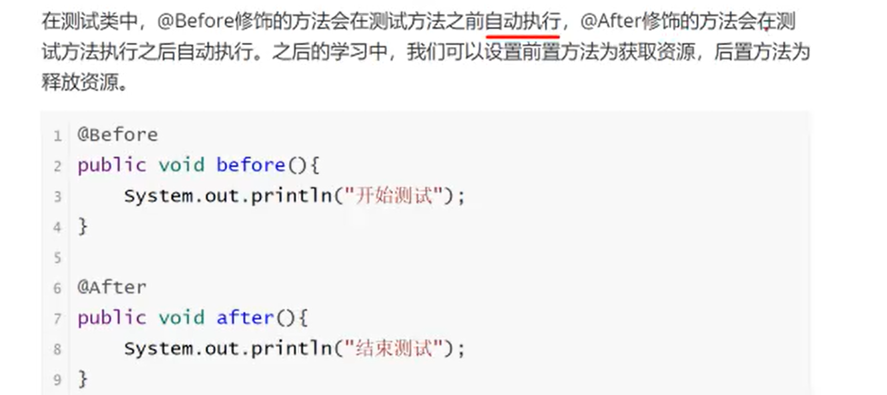

每个测试方法在执行之前和执行之后都会分别执行@Before 修饰的方法和@After修饰的方法


# **依赖冲突调解_依赖冲突的产生**


# **依赖冲突调解**

## 第一原则：**最短路径优先原则**


spring-context 比 spring-webmvc 离spring-aop近


## **第二原则：最先声明原则**


## 手动依赖冲突调解


### 指定取消一方的依赖


指定一方对冲突的包不进行传入


在 dependency 标签中使用 exclusions ，再在 exclusions标签中用 exclusion 指定什么标签不引入 


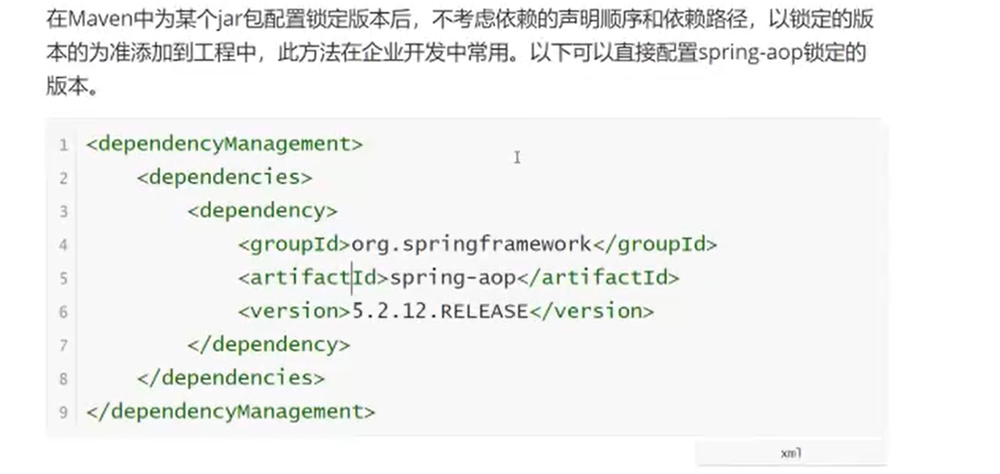

### 进行版本锁定


# **Maven聚合开发_聚合关系**


controller 进行前后端的交互

service domain dao controller 彼此之间相互使用，这些包需要放在同一个项目中。


两个项目中重复写了 dao 和 service 方法


两个项目控制层不同

 service包 是两个项目都可以用的。


# **Maven聚合开发_继承关系**


POM 类型工程是不写代码的，但会定义一些东西


多继承的写法本质上还是引入多个依赖

引入父项目，scope标签 必须写成import


# **Maven聚合案例_搭建父工程**


dao 负责数据库的交互 service 负责


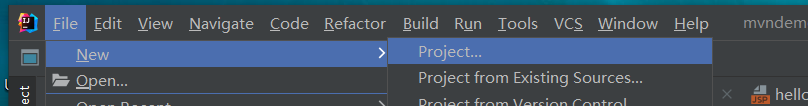

不需要根据任何模板创建


不需要写代码，父工程是虚拟工程，src目录可以直接删去


pom.xml 中 写 需要的依赖和需要的插件，因为子工程能继承父工程所有的依赖和插件

```
<?xml version="1.0" encoding="UTF-8"?>
<project xmlns="http://maven.apache.org/POM/4.0.0"
         xmlns:xsi="http://www.w3.org/2001/XMLSchema-instance"
         xsi:schemaLocation="http://maven.apache.org/POM/4.0.0 http://maven.apache.org/xsd/maven-4.0.0.xsd">
    <modelVersion>4.0.0</modelVersion>

    <groupId>com.njupt</groupId>
    <artifactId>mvn_demo3</artifactId>
    <version>1.0-SNAPSHOT</version>

    <properties>
        <maven.compiler.source>17</maven.compiler.source>
        <maven.compiler.target>17</maven.compiler.target>
    </properties>
    <dependencies>
        <dependency>
            <groupId>junit</groupId>
            <artifactId>junit</artifactId>
            <version>4.12</version>
            <scope>test</scope>
        </dependency>
<!--        jdbc连接器-->
        <dependency>
            <groupId>mysql</groupId>
            <artifactId>mysql-connector-java</artifactId>
            <version>8.0.27</version>
        </dependency>
        <dependency>
            <groupId>javax.servlet.jsp</groupId>
            <artifactId>javax.servlet.jsp-api</artifactId>
            <version>2.2.1</version>
            <scope>provided</scope>
        </dependency>
        <dependency>
            <groupId>javax.servlet</groupId>
            <artifactId>javax.servlet-api</artifactId>
            <version>3.0.1</version>
            <scope>provided</scope>
        </dependency>
<!--        引入jstl-->
        <dependency>
            <groupId>org.apache.taglibs</groupId>
            <artifactId>taglibs-standard-spec</artifactId>
            <version>1.2.5</version>
        </dependency>
        <dependency>
            <groupId>org.apache.taglibs</groupId>
            <artifactId>taglibs-standard-impl</artifactId>
            <version>1.2.5</version>
        </dependency>

    </dependencies>
    <build>
        <plugins>
            <plugin>
                <groupId>org.apache.tomcat.maven</groupId>
                <artifactId>tomcat7-maven-plugin</artifactId>
                <version>2.1</version>
                <configuration>
                    <port>8080</port>
                    <path>/</path>
                    <uriEncoding>UTF-8</uriEncoding>
                    <server>tomcat7</server>
                    <systemProperties></systemProperties>
                </configuration>
            </plugin>
        </plugins>
    </build>
</project>
```


# **Maven聚合案例_搭建dao模块**

dao模块是和数据库交互，就是普通的java工程


不用选择任何模板


该文件pom会有父工程配置


domain 是 存放实体类的包，dao包表示dao层


Test文件夹编写相应的测试类


# **Maven聚合案例_搭建service模块**

继续构建子模块


不用任何模板


注意取名


需要在service 中 引入 dao 的依赖

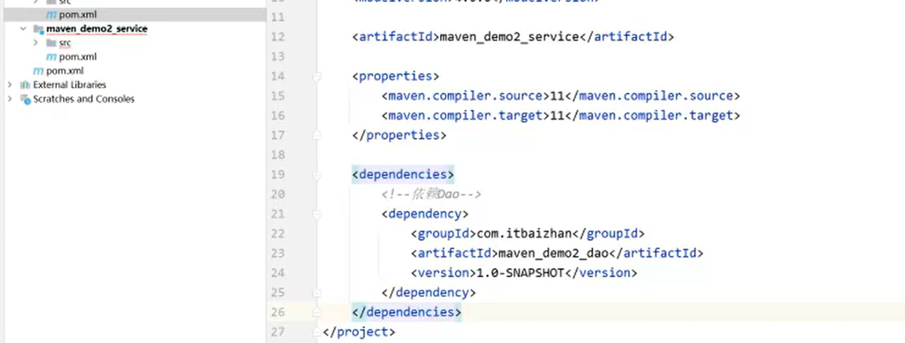


编写相应测试类


# **Maven聚合案例_搭建web模块**


要选择web工程模板


这两行删去，以及已经继承自父工程的依赖都不需要再写了


引入 service层的依赖


确认该 web 工程有没有真的继承父工程


service 引入 dao  web 引入 service ，那么 web也引入了 dao

# **Maven聚合案例_运行项目**


注意 working directory 选择父工程


会打包然后互相引入


父工程 dao模块 service 模块进行发布


父模块点击install


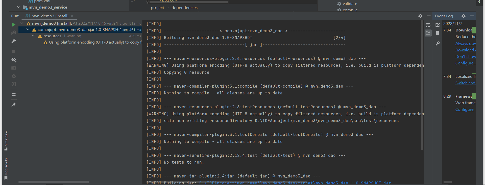


Working directory 要选择 web模块

这次只运行了web工程

# **依赖传递失效及解决方案**


scope 一般是不改的


