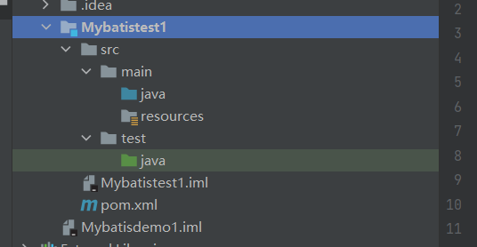
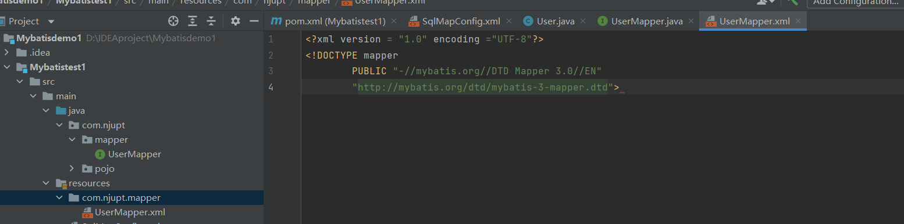
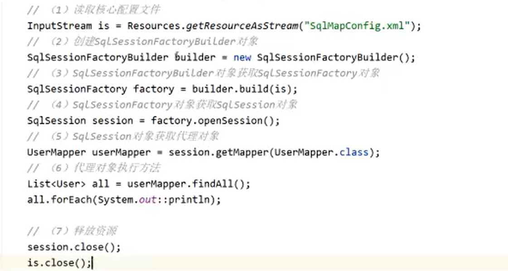
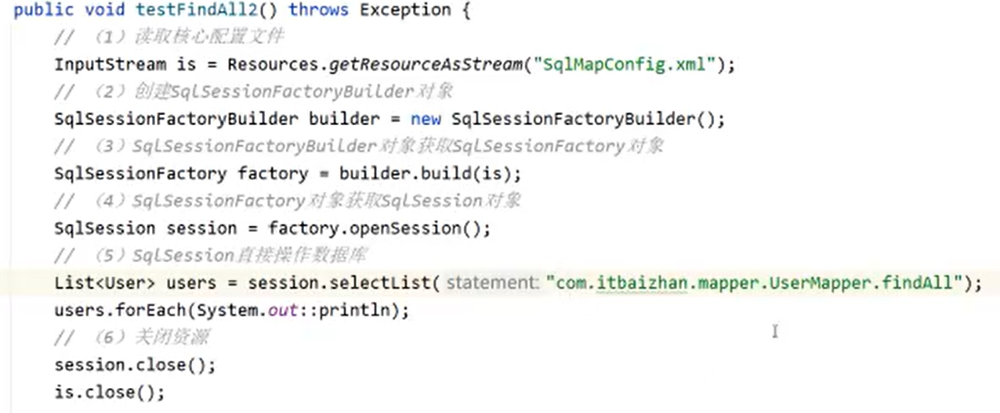
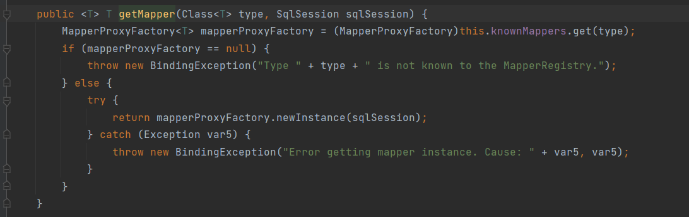
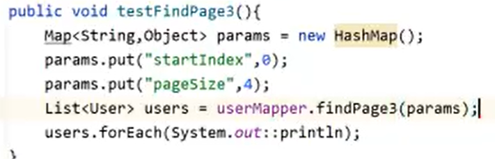

*什么是框架**


# 什么是ORM框架


ORM框架完成 数据库数据与对象数据转化(数据库数据封装成对象)


# 什么是 MyBatis


补充 全自动orm框架


# **入门案例_环境搭建**

创建Maven工程，引入依赖


创建一个空项目，但是内有一个Maven 模块





Maven引入依赖

这两个包必须引入

```
<!--        mybatis的依赖-->
        <dependency>
            <groupId>org.mybatis</groupId>
            <artifactId>mybatis</artifactId>
            <version>3.5.7</version>
        </dependency>
<!--        引入 mysql的驱动包-->
        <dependency>
            <groupId>mysql</groupId>
            <artifactId>mysql-connector-java</artifactId>
            <version>8.0.27</version>
        </dependency>
    </dependencies>

```


下面两个包不必要

```
<!--junit 单元测试-->
        <dependency>
            <groupId>junit</groupId>
            <artifactId>junit</artifactId>
            <version>4.12</version>
            <scope>test</scope>
        </dependency>
<!--        打印日志-->
        <dependency>
            <groupId>log4j</groupId>
            <artifactId>log4j</artifactId>
            <version>1.2.12</version>
        </dependency>
```


主要配置 MyBatis 如何连接数据库

SqlMapConfig.xml 配置文件命名是固定的

```
添加约束
<?xml version="1.0" encoding = "utf-8"?>
<!DOCTYPE configuration
		PUBLIC "-//mybatis.org//DTD Config 3.0//EN"
		"http://mybatis.org/dtd/mybatis-3-config.dtd">
```


下面进行配置环境编写


以及配置日志文件信息


```
log4j.appender.CONSOLE = org.apache.log4j.ConsoleAppender
log4j.appender.CONSOLE.layout = org.apache.log4j.PatternLayout
log4j.appender.CONSOLE.layout.ConversionPattern = [%d{MM/dd HH:mm:ss}] %-6r [%15.15t] %-5p %30
```


创建实体类

放在 pojo包下


并生成对应的 get 和 set


```
package com.njupt.pojo;

public class User {
    private int id;
    private String username;
    private String address;
    private String sex;

    public int getId() {
        return id;
    }

    public void setId(int id) {
        this.id = id;
    }

    public String getUsername() {
        return username;
    }

    public void setUsername(String username) {
        this.username = username;
    }

    public String getAddress() {
        return address;
    }

    public void setAddress(String address) {
        this.address = address;
    }

    public String getSex() {
        return sex;
    }

    public void setSex(String sex) {
        this.sex = sex;
    }

    @Override
    public String toString() {
        return "User{" +
                "id=" + id +
                ", username='" + username + '\'' +
                ", address='" + address + '\'' +
                ", sex='" + sex + '\'' +
                '}';
    }
}
```


实体类的创建，其属性就对应着数据表中的列（数据项）


# **入门案例_持久层接口和映射文件**

持久层接口 用来操作实体类和数据库的交互


     


- 每一个Mapper接口都要有与之对应的配置 mapper标签。

- 配置文件的名字需要与持久层接口的接口名同名
- 接口中的每一个抽象方法都需要有与之对应的 sql 语句


在resources文件夹中，持久层接口的配置文件需要与 java包中的持久层接口具有相同的目录结构，即需要有相同的包层

新建文件夹(目录)


创建的时候不要写 com.njupt.mapper，这样写是创建一个名为com.njupt.mapper的目录，要写成com/njupt/mapper才是创建目录


添加约束

```
<?xml version = "1.0" encoding ="UTF-8"?>
<!DOCTYPE mapper 
		PUBLIC "-//mybatis.org//DTD Mapper 3.0//EN"
		"http://mybatis.org/dtd/mybatis-3-mapper.dtd">
```





```
<?xml version = "1.0" encoding ="UTF-8"?>
<!DOCTYPE mapper
        PUBLIC "-//mybatis.org//DTD Mapper 3.0//EN"
        "http://mybatis.org/dtd/mybatis-3-mapper.dtd">
                    <!-- namespace：对应哪个持久层接口,写接口的全类名-->
<mapper namespace="com.njupt.mapper.UserMapper">
<!--    要进行查找的方法，就是使用select标签,id写方法的名字,resultType 写结果集的类型，即方法的返回类型l,就算是集合类型也写其中泛型类型-->
    <select id="findAll" resultType="com.njupt.pojo.User">
--      编写调用该接口的方法时要对数据库使用的sql语句
        select * from user
    </select>
</mapper>
```


写好后注册到核心配置文件当中

SqlMapConfig.xml 配置文件，配置mappers标签，就位于 configuration 标签下


resource 资源必须写成 / 表示路径


映射文件注意事项


写接口的映射文件流程

- 写实体类对应的接口
- 写接口对应的配置文件.xml
- 在核心配置文件中编写代码加载配置文件


# **入门案例_测试持久层接口方法**


编写测试类




流程

- 读取核心配置文件
- 创建 SqlSessionFactoryBuilder，直接new
- 根据核心配置文件(流)创建 SqlSessionFactory 对象
- 根据SqlSessionFactory对象获取 SqlSession 对象，使用openSession方法
- SqlSession对象调用 getMapper获取动态代理对象
- 代理对象执行方法。
- 释放资源

```
import com.njupt.mapper.UserMapper;
import com.njupt.pojo.User;
import org.apache.ibatis.io.Resources;
import org.apache.ibatis.session.SqlSession;
import org.apache.ibatis.session.SqlSessionFactory;
import org.apache.ibatis.session.SqlSessionFactoryBuilder;
import org.junit.Test;

import java.io.IOException;
import java.io.InputStream;
import java.util.List;

public class TestUserMapper {
    @Test
    public void testFindAll() throws IOException {
        InputStream is = Resources.getResourceAsStream("SqlMapConfig.xml");
        SqlSessionFactoryBuilder sfb = new SqlSessionFactoryBuilder();
        SqlSessionFactory factory = sfb.build(is);
        SqlSession session = factory.openSession();
        UserMapper userMapper = session.getMapper(UserMapper.class);
        List<User> users = userMapper.findAll();
        users.forEach(System.out::println);
        session.close();
        is.close();
    }
}
```


# **MyBatis核心对象和工作流程**


# **使用SqlSession操作数据库**


直接传入 全类名+接口名+方法名



# **Mapper动态代理原理**

getMapper() 按住ctrl点进去


获取SqlSession 的实现类


选第一个 DefaultSqlSession


找到这个 类的 getMapper方法点进去


继续点进去这个 getMapper方法



看  try里面的那个 return 后面的方法


点进去 newInstance


生成的代理对象是 new Class[]{this.mapperInterface}  中 mapperInterface类型的

mapperInterface是什么，是我们会传进去的参数，上面的那个例子是 UserMapper.class


mapperProxy 定义了动态代理的方式，怎么完成那个方法


这个类实现了 InvocationHandler 接口


invoke方法定义了代理做的函数


看 cachedInvoker.invoke 方法


这是一个内部接口


也有一个内部类实现了内部接口


重写了 invoke方法，看invoke方法里面调用了的 execute方法


即使生成代理对象底层依然是调用 SqlSession对象的方法


# **MyBatis增删改查_新增**

注意 user表中


id数据项是自动增长的。不需要传入 id


add 添加用户方法


在映射文件中定义相应方法

注意，不要在insert标签内部写任何注释，不然会报错

```
<insert id="add" parameterType="com.njupt.pojo.User">
     insert into user(username,address,sex)values(#{username},#{address},#{sex})
</insert>

```


其构造方法


```
    @Test
    public void testAdd() throws IOException {
        InputStream is = Resources.getResourceAsStream("SqlMapConfig.xml");
        SqlSessionFactoryBuilder sfb = new SqlSessionFactoryBuilder();
        SqlSessionFactory factory = sfb.build(is);
        SqlSession session = factory.openSession();
        UserMapper userMapper = session.getMapper(UserMapper.class);
        userMapper.add(new User("jacename","wuxi","male"));
//        要进行事务的提交
        session.commit();
        session.close();
        is.close();
    }
```


# 优化测试类


```
import com.njupt.mapper.UserMapper;
import org.apache.ibatis.io.Resources;
import org.apache.ibatis.session.SqlSession;
import org.apache.ibatis.session.SqlSessionFactory;
import org.apache.ibatis.session.SqlSessionFactoryBuilder;
import org.junit.After;
import org.junit.Before;
import org.junit.Test;

import java.io.IOException;
import java.io.InputStream;

public class TestUserMapper2 {
    InputStream is = null;
    SqlSession session = null;
    UserMapper us = null;

    @Before
    public void before() throws IOException {
        is = Resources.getResourceAsStream("SqlMapConfig.xml");
        SqlSessionFactoryBuilder sfb = new SqlSessionFactoryBuilder();
        SqlSessionFactory factory = sfb.build(is);
        session = factory.openSession();
        us = session.getMapper(UserMapper.class);

    }

    @After
    public void after() throws IOException {
    	session.commit();
        session.close();
        is.close();
    }
}

```


# **MyBatis增删改查_修改**

接口类中方法


配置文件中映射


```
update user set username = #{username},sex=#{sex},address=#{address} where id = #{id}
```


# **MyBatis增删改查_删除&根据id查询**


删除标签使用delete标签


id=1 被删除了


根据id查询


# **MyBatis增删改查_模糊查询**(#和$的区别)


```
<!--    parameterType也可以直接写 string -->
    <select id="findByAddressLike" parameterType="java.lang.String" resultType="com.njupt.pojo.User">
        select * from user where address like #{address}
    </select>
```


如果不希望在调用方法的时候在要查询的字符串中添加 % 占位符


```
<select id="findByAddressLike" parameterType="java.lang.String" resultType="com.njupt.pojo.User">
        select * from user where address like "${address}%"
    </select>
```


```
<select id="findByAddressLike" parameterType="java.lang.String" resultType="com.njupt.pojo.User">
        <bind name="likeAddress" value = "Address+'%'"/>
              select * from user where address like #{likeAddress}
    </select>
```

bind 标签的 value 属性中 的 Address 可以不一定取名Address，这个字符串代表的是我们调用该方法时传入的参数


# MyBatis分页查询 方法调用时多参传递


## 顺序传参


arg 是 从0开始，param 是 从1开始


```
<select id="findPage" resultType="com.njupt.pojo.User">
        select * from user limit #{arg0},#{arg1}
    </select>
    
也可以
<select id="findPage" resultType="com.njupt.pojo.User">
        select * from user limit #{param1},#{param2}
    </select>
```


## param传参


```
List<User> findPage(@Param("start") int startIndex, @Param("size")int pageSize);
```


```
<select id="findPage" resultType="com.njupt.pojo.User">
        select * from user limit #{start},#{size}
    </select>
```

注解中的值传递到了sql语句的 #{}中


## pojo传参


## Map传参


#{} 里面写的是 键的名字



# **MyBatis增删改查_聚合查询&主键回填**

## 使用聚合函数

接口层方法


```
<select id="findCount" resultType="int">
        select count(id) from user
    </select>
```


## 获取数据库自增的主键


要使用 selectKey 标签


```
 keyProperty="id" keyColumn="id" resultType="int" order="AFTER" 属性的含义
  keyProperty 代表主键属性名
  keyColumn  代表主键在数据库的列名
  resultType 代表主键的数据类型
  order 代表执行时机  表示插入完成后再执行查询主键的操作

```


```
<selectKey keyProperty="id" keyColumn="id" resultType="int" order="AFTER">
            select LAST_INSERT_ID()
        </selectKey>
```

select LAST_INSERT_ID() 是mysql 自带的函数


这里注意，一定要先插入，再提交事务，再获取返回的 id 才有效


# **MyBatis配置文件**


根标签 configuration


## properties标签


properties 标签引入


引入外部配置文件


以后只要在 properties 文件中进行修改即可


properties除了引入外部文件外，还可以直接在该标签内部配置


## **settings**标签


## plugins标签


## **typeAliases标签**


```
    <typeAliases>
<!--                type 是全类名  alias 表示 别名 -->
        <typeAlias type="com.njupt.pojo.User" alias="user"></typeAlias>
    </typeAliases>
    
今后使用 com.njupt.pojo.User 的地方都可以使用 user 替代
```


通过 package标签，一个包下所有的类的都会有别名，其别名就是其类名，而不是全类名(全类名 = 包名+类名)


## environments标签


type = "MANAGED" 那就没有事务提交的处理，不需要事务提交就立刻执行了


## mappers标签


# MyBatis映射文件

## **resultMap**标签


sql语句用于操作数据库    

```
数据库中的名字 as java实体类中的名字
```


```
<resultMap id = "teacherMapper" type="com.itbaizhan.pojo.Teacher">

	<id property="id" column="tid"></id>
	<result property="teacherName" column="tname"></result>
</resultMap>	

resultMap 标签内
  id 标签用于定义主键类， property标签用于表示 POJOjava实体类属性名，column表示其对应的数据库类名
  result 标签用于定义普通列 property标签用于表示 POJOjava实体类属性名，column表示数据库列名
 
 
当我们需要使用这个 resultMap 映射的时候，需要 insert delete select sql标签中的 resultMap属性引入我们想要引入的那个 resultMap 的标签

```

## **sql&include**

sql标签，用于等价替换某些 sql 语句sql标签内部写其指代的sql语句


include 标签引入 sql标签中的内容

sql标签必须有属性 id

include 中使用属性 refid  把对应sql标签的id引入，实现引入sql语句的功能


# **特殊字符处理**


# **MyBatis动态Sql**


## if标签


if 语句中的 **test 属性内部可以直接通过属性名获取 传入的实体类参数 POJO 的属性值**，并且该值可以调用方法


```
<select id="findByCondition" parameterType="com.njupt.pojo.User" resultType="com.njupt.pojo.User">
       select * from user where 1=1
       
        <if test="username!=null and username.length()>0">
            and username like #{username}
        </if>
        <if test="sex!=null and sex.length()>0">
            and sex = #{sex}
        </if>
        <if test="address!=null and address.length()>0">
            and address like #{address}
        </if>
   </select>
  
第一个 if 标签中的内容在满足传入的实体类 username属性 不为空且长度大于0的时候拼接上去
第二个 if 标签中的内容在满足传入的实体类 sex属性 不为空且长度大于0的时候拼接上去
第三个 if 标签中的内容在满足传入的实体类 address属性 不为空且长度大于0的时候拼接上去
```


```
    @Test
    public void testfindByCondition(){
//        这个对象作为条件传入查询语句
        User user = new User();
//       什么条件都没有添加   很普通的sql 语句，相当于查询所有
        List<User> byCondition = us.findByCondition(user);
        byCondition.forEach(System.out::println);


        System.out.println();
        System.out.println();


//        添加了对性别的选择 (select 语句中where后面进行了一个条件的拼接)
        User user2 = new User(null,null,"male");
        List<User> byCondition2 = us.findByCondition(user2);
       
// sql 语句变为 select * from user where 1=1 and sex = "male"
        
        byCondition2.forEach(System.out::println);

        System.out.println();
        System.out.println();


//        添加了对性别和地址的选择(select 语句中where 后面进行了两个条件的拼接
        User user3 = new User (null,"%an","male");
        List<User> byCondition3 = us.findByCondition(user3);
// sql 语句变为 select * from user where 1=1 and sex = "male" and address like "%an"
        byCondition3.forEach(System.out::println);
    }
```


## **where**标签


<where> = sql语句中 where 1=1 和 第一个 and


```
<select id="findByCondition" parameterType="com.njupt.pojo.User" resultType="com.njupt.pojo.User">
       select * from user where 1=1
       
        <if test="username!=null and username.length()>0">
            and username like #{username}
        </if>
        <if test="sex!=null and sex.length()>0">
            and sex = #{sex}
        </if>
        <if test="address!=null and address.length()>0">
            and address like #{address}
        </if>
   </select>   
   
   
   
使用 where 标签 之后
   <select id="findByCondition" parameterType="com.njupt.pojo.User" resultType="com.njupt.pojo.User">
       select * from user 
       <where>
        <if test="username!=null and username.length()>0">
           username like #{username}
        </if>
        <if test="sex!=null and sex.length()>0">
            and sex = #{sex}
        </if>
        <if test="address!=null and address.length()>0">
            and address like #{address}
        </if>
       </where>
   </select>
```


## **set**标签


set标签 = sql 语句中的 set + 去除if语句内部的sql多余的逗号

```
使用 if 标签实现，传入什么参数，修改什么字段
<update id="updateUser" parameterType="com.njupt.pojo.User">
        update user set
        <if test="username != null and username.length()>0">
            username = #{username},
        </if>
        <if test="sex != null and sex.length()>0">
            sex = #{sex},
        </if>
        <if test="address != null and address.length()>0">
            address = #{address},   
            		// 这里最后一个逗号，很难受
        </if>
        <where>
            id = #{id}
        </where>
    </update>
使用 set标签后
<update id="updateUser" parameterType="com.njupt.pojo.User">
        update user
        <set>
        <if test="username != null and username.length()>0">
            username = #{username},
        </if>
        <if test="sex != null and sex.length()>0">
            sex = #{sex},
        </if>
        <if test="address != null and address.length()>0">
            address = #{address}   
            			//没有最后一个标签
        </if>
        </set>
        <where>
            id = #{id}
        </where>
    </update>
```


```
    @Test
    public void testupdateUser(){
        User user1 = new User(7,"nihao","agsu",null);
        us.updateUser(user1);
        session.commit();

    }
```


## **when&choose&otherwise**


choose 是 多条件分支

choose 更 类似于 if else if ..... else 。

when 类似于 if 和 else if ，只会从上往下匹配，一旦匹配就进入执行，执行结束就不管之后 的 其他 when 标签了，直接退出，**多个 when 只能有其中一个 when 被执行。**

otherwise 类似于 else ，如果 if 和 else if 没有一个匹配的，那么执行 otherwise中的


例子

根据用户名查询用户

- 参数长度 小于 5：模糊查询
- 参数长度 5~10：精确查询
- 否则：返回 id 为 1 的用户


```
<select id="findByUsername" parameterType="string" resultType="com.njupt.pojo.User">
        select * from user
        <where>
        	
            <choose>
            // 如果用户名长度 小于 5，进行模糊查询
                <when test="username.length() &lt; 5">
                    <bind name = "likename" value = "'%'+username+'%'"/>
                    username like #{likename}
                </when>
            // 如果用户名长度 小于 10,进行精确查询
                <when test="username.length() &lt; 10">
                    username =#{username}
                </when>
            // 上面两个都不满足，返回 id = 1 的查询结果
                <otherwise>
                    id = 1
                </otherwise>
            </choose>
        </where>
    </select>
```


```
public void testFindByUsername(){
    List<User> nan = us.findByUsername("ace");
    nan.forEach(System.out::println);
}
```


```
public void testFindByUsername(){
        List<User> nan = us.findByUsername("jacename");
        nan.forEach(System.out::println);
    }
```


## **foreach遍历**


### 遍历数组

删除数组提供的id 


```
<delete id="deleteBatch" parameterType="int">
        delete from user
            <where>
                -- open 和 close 属性用于拼接 sql 语句  collection属性指明要遍历的是什么，array表示遍历的是数组数据类型，item用于给遍历出的每一项取名 separator是遍历出的各项用什么分隔符，这里是逗号
                <foreach open="id in (" close=")" collection="array" item="id" separator=",">
-- foreach 标签内部写 我们要遍历的每一项要呈现出什么形式
                    #{id}   
                </foreach>
            </where>
    </delete>
```


注：真正开发不要在 这里写注释，这里只是为了方便看。


```
delete from user where id in(2,3,4,5)
```


如果 foreach标签内 #{id} 写成 1#{id}，就变成了   每一项前面再拼上了1


变成

```
delete from user where id in(12,13,14,15)
```


### 遍历Collection

#### 遍历list


批量新增


```
insert into user(username,sex,address) values(),(),(); 
```

values 里面的东西需要依靠遍历


```
<insert id="insertBatch" parameterType="com.njupt.pojo.User">
    insert into user(username,sex,address) values
        -- 遍历的数据类型是列表 list，每一项取名 叫 user，分隔符为逗号
    <foreach collection="list" item="user" separator=",">
        --调用对象中的属性
        (#{user.username},#{user.sex},#{user.address})
    </foreach>
</insert>
```


```
public void testinsertBatch(){
        User user1 = new User("testp1","wuxi","male");
        User user2 = new User("testp2","wuhan","female");
        ArrayList<User> l1 = new ArrayList<>();
        l1.add(user1);
        l1.add(user2);
        us.insertBatch(l1);
        session.commit();
    }
```


#### 遍历Map


遍历 map，collection属性不能写 "map"，而要写我们自己定义的参数名(使用 @Param注解)。


${key} = #{value} 键是拼进来的，值是占位符


# **MyBatis缓存缓存介绍**

## 缓存介绍


## **MyBatis一级缓存**

一级缓存存在于 SqlSession当中


使用同一个 SqlSession 对象才能共享一级缓存


UserMapper 对象来源于同一个 SqlSession 对象

```
@Test
    public void testcache1() throws IOException {
        InputStream is = Resources.getResourceAsStream("SqlMapConfig.xml");
        SqlSessionFactoryBuilder builder = new SqlSessionFactoryBuilder();
        SqlSessionFactory factory = builder.build(is);
        SqlSession sqlSession = factory.openSession();
        UserMapper mapper = sqlSession.getMapper(UserMapper.class);
        User byId = mapper.findById(9);
        System.out.println(byId.hashCode());
        User byId2 = mapper.findById(9);
        System.out.println(byId2.hashCode());
    }
```


UserMapper对象分别来源于两个不同SqlSession 对象

```
public void testcache2() throws IOException {
    InputStream is = Resources.getResourceAsStream("SqlMapConfig.xml");
    SqlSessionFactoryBuilder builder = new SqlSessionFactoryBuilder();
    SqlSessionFactory factory = builder.build(is);
    SqlSession sqlSession = factory.openSession();
    SqlSession sqlSession2 = factory.openSession();
    UserMapper mapper = sqlSession.getMapper(UserMapper.class);
    UserMapper mapper2 = sqlSession2.getMapper(UserMapper.class);
    User byId = mapper.findById(9);
    System.out.println(byId.hashCode());
    User byId2 = mapper2.findById(9);
    System.out.println(byId2.hashCode());
}
```


## **清除一级缓存**


## 二级缓存

二级缓存存放在**SqlSessionFactory 对象当中**


## 开启二级缓存


实体类实现 Serializable 接口


配置文件 写 settings 标签，该标签下有 setting 标签，name值cacheEnabled value值true 表示开启缓存 


持久层接口对应的映射文件设置 cache 标签


测试二级缓存

```
@Test
public void testcache3() throws IOException {
    InputStream is = Resources.getResourceAsStream("SqlMapConfig.xml");
    SqlSessionFactoryBuilder builder = new SqlSessionFactoryBuilder();
    SqlSessionFactory factory = builder.build(is);
    SqlSession sqlSession = factory.openSession();
    SqlSession sqlSession2 = factory.openSession();

    UserMapper mapper = sqlSession.getMapper(UserMapper.class);
    UserMapper mapper1 = sqlSession2.getMapper(UserMapper.class);

    User byId1 = mapper1.findById(9);
    System.out.println(byId1.hashCode());
    // 关闭SqlSession让一级缓存失效
    sqlSession.close();
    User byId2 = mapper1.findById(9);
    System.out.println(byId2.hashCode());
}
```


# **MyBatis关联查询**


```
package com.njupt.pojo;

import java.util.List;

public class Classes {
    private int cid;
    private String className;
    private List<Student> students;

    @Override
    public String toString() {
        return "Classes{" +
                "cid=" + cid +
                ", className='" + className + '\'' +
                ", students=" + students +
                '}';
    }

    public Classes() {
    }

    public int getCid() {
        return cid;
    }

    public void setCid(int cid) {
        this.cid = cid;
    }

    public String getClassName() {
        return className;
    }

    public void setClassName(String className) {
        this.className = className;
    }

    public List<Student> getStudents() {
        return students;
    }

    public void setStudents(List<Student> students) {
        this.students = students;
    }

    public Classes(String className, List<Student> students) {
        this.className = className;
        this.students = students;
    }

    public Classes(int cid, String className, List<Student> students) {
        this.cid = cid;
        this.className = className;
        this.students = students;
    }
}


package com.njupt.pojo;

public class Student {
    private int sid;
    private String name;
    private int age;
    private String sex;
    private Classes classes;

    public Student() {
    }

    public Student(String name, int age, String sex, Classes classes) {
        this.name = name;
        this.age = age;
        this.sex = sex;
        this.classes = classes;
    }

    public Student(int sid, String name, int age, String sex, Classes classes) {
        this.sid = sid;
        this.name = name;
        this.age = age;
        this.sex = sex;
        this.classes = classes;
    }

    @Override
    public String toString() {
        return "Student{" +
                "sid=" + sid +
                ", name='" + name + '\'' +
                ", age=" + age +
                ", sex='" + sex + '\'' +
                ", classes=" + classes +
                '}';
    }

    public int getSid() {
        return sid;
    }

    public void setSid(int sid) {
        this.sid = sid;
    }

    public String getName() {
        return name;
    }

    public void setName(String name) {
        this.name = name;
    }

    public int getAge() {
        return age;
    }

    public void setAge(int age) {
        this.age = age;
    }

    public String getSex() {
        return sex;
    }

    public void setSex(String sex) {
        this.sex = sex;
    }

    public Classes getClasses() {
        return classes;
    }

    public void setClasses(Classes classes) {
        this.classes = classes;
    }
}


```


```
alter table student add constraint student_fk foreign key(classId)  references classes(cid)
```

先有班级再有学生


## **一对一关联查询**


如果只是 select * from student


进行关联的 classes 都是 null


需要进行多表查询

多表查询的sql语句

```
select * from student left join classes on student.classId = classes.cid;
```


我们还需要自定义映射关系，把从外表获得的属性能够映射进入实体类的对象属性中

使用resultMap 标签


```
<resultMap id="studentMapper" type="com.njupt.pojo.Student">
		id 表示数据表中的主键列， property 表示java实体类的属性名，column表示数据表中的列名，并把两者匹配
    <id property="sid" column="sid"></id>
    	result 表示数据表中的普通列，property 表示java实体类的属性名，column表示数据表中的列名，并把两者匹配
    <result property="name" column="name"></result>
    <result property="age" column="age"></result>
    <result property="sex" column="sex"></result>
    	association 表示实体类中，这个成员属性是一个对象 property 表示java实体类的属性名，column表示数据表中的列名(关联了外键的列)
    				javatype 表示这个成员对象的类是什么
    <association property="classes" column="classId" javaType="com.njupt.pojo.Classes">
    				这里property都是另一个实体对象的成员名		这里 column 的属性都是另一个表的列名
        <id property="cid" column="cid"></id>
        <id property="className" column="className"></id>
    </association>
</resultMap>
    
    
    
    
           
                       通过resultMap 属性指定使用哪个结果集对象
    <select id="findAll" resultMap="studentMapper">
        select * from student left join classes on student.classId = classes.cid;
    </select>
```


## 一对多关联查询


查询结果都封装到集合(一个成员对象)中


```
select * from classes left join student on classes.cid = student.classId
```


## 多对多关联查询


# MyBatis 分解式查询


