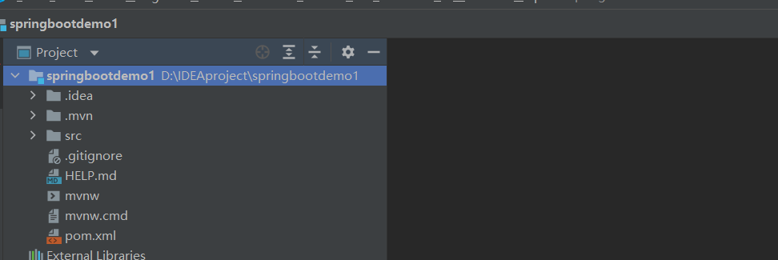
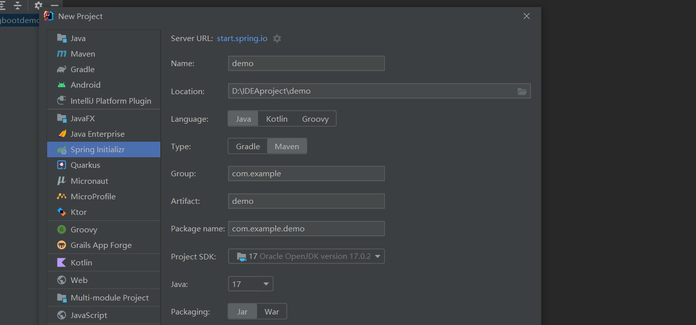
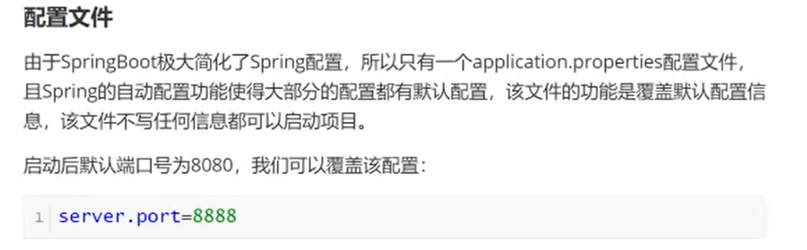

# Spring缺点分析

SpringBoot 是服务于 Spring框架的


举例：


# 什么是SpringBoot


# **SpringBoot核心功能**

核心功能是 **自动配置** 和 **起步依赖**


# **通过官网搭建项目**


start.spring.io 网址


generate 生成项目

会下载


项目结构


把这个项目导入 IDEA




# **通过IDEA脚手架搭建项目**

这种方式底层还是连接 SpringBoot 官网

新建项目


选择 Spring Initializr




这个**Server URL** 也可以写国内的阿里云的镜像

https://start.aliyun.com/


项目的配置


完成后项目结构


# **SpringBoot项目结构**

## **POM文件**

SpringBoot 有一个父项目


## **启动类、配置文件**


运行启动类能够运行spring boot 内部自带的 tomcat

启动内置 tomcat 运行项目

运行以后控制台界面





设置tomcat 监听端口号 8888

端口号设置成 8888 覆盖了 端口号 设置为8080的默认情况


控制台输出端口号改变了


# **SpringBoot入门**

## **通过Maven搭建项目**


通过maven 创建一个普通的 Java 项目


直接 next


项目信息


pom.xml 文件添加东西

1. 父工程

   ```
   <!--  父工程  -->
   <parent>
       <groupId>org.springframework.boot</groupId>
       <artifactId>spring-boot-starter-parent</artifactId>
       <version>2.7.5</version>
   </parent>
   ```

2. 起步依赖

   ```
   <!--  起步依赖 -->
   <dependencies>
       <dependency>
           <groupId>org.springframework.boot</groupId>
           <artifactId>spring-boot-starter-web</artifactId>
       </dependency>
   </dependencies>
   ```

3. 插件

   ```
    <!--    插件-->
       <build>
           <plugins>
               <plugin>
                   <groupId>org.springframework.boot</groupId>
                   <artifactId>spring-boot-maven-plugin</artifactId>
               </plugin>
           </plugins>
       </build>
   ```


添加启动类(类名随意)


```
package com.NJUPT.springbootdemo1;

import org.springframework.boot.SpringApplication;
import org.springframework.boot.autoconfigure.SpringBootApplication;

@SpringBootApplication
public class Springbootdemo1Application {

	public static void main(String[] args) {
		SpringApplication.run(Springbootdemo1Application.class, args);
	}

}
```


编写配置文件，配置文件的文件名是固定的 application.properties


## **编写JAVA代码**