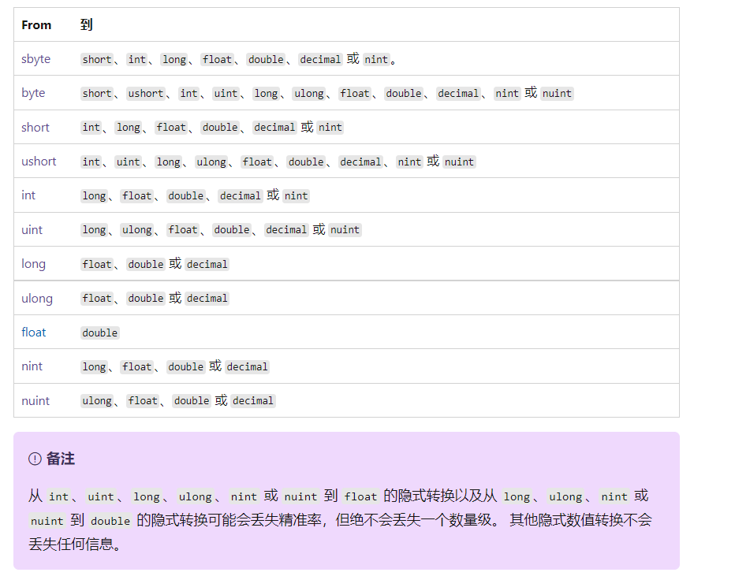

# 强制转换和类型转换

由于 C# 是在编译时静态类型化的，因此变量在声明后就无法再次声明，或无法分配另一种类型的值，除非该类型可以隐式转换为变量的类型。 例如，`string` 无法隐式转换为 `int`。


但有时可能需要将值复制到其他类型的变量或方法参数中。 例如，可能需要将一个整数变量传递给参数类型化为 `double` 的方法。 或者可能需要将类变量分配给接口类型的变量。 这些类型的操作称为类型转换。 在 C# 中，可以执行以下几种类型的转换：

- **隐式转换**：由于这种转换始终会成功且不会导致数据丢失，因此无需使用任何特殊语法。

  例子：从较小整数类型到较大整数类型的转换，从派生类到基类的转换。

- **显式转换（强制转换）** ：必须使用强制转换表达式，才能执行显式转换。 在转换中可能丢失信息时或在出于其他原因转换可能不成功时，必须进行强制转换。

  例子：包括从数值到精度较低或范围较小的类型的转换，从基类实例到派生类的转换。

- **用户定义的转换**：用户定义的转换是使用特殊方法执行，这些方法可定义为在没有基类和派生类关系的自定义类型之间启用显式转换和隐式转换。 有关详细信息，请参阅用户定义转换运算符。

- **使用帮助程序类进行转换**：若要在非兼容类型（如整数和 System.DateTime对象，或十六进制字符串和字节数组）之间转换，可使用 System.BitConverter类、System.Convert类和内置数值类型的 `Parse` 方法（如 Int32.Parse）

## 隐式转换

- 对于内置数值类型，如果要存储的值无需截断或四舍五入即可适应变量，则可以进行隐式转换。

- 对于引用类型，隐式转换始终存在于从一个类转换为该类的任何一个直接或间接的基类或接口的情况。 由于派生类始终包含基类的所有成员，因此不必使用任何特殊语法。

  ```
  Based b = new Deprived(); //这是ok的
  ```


隐式数值转换表



另请注意

- 任何**整型数值类型**都可以隐式转换为任何**浮点数值类型**。

- 不存在针对 `byte` 和 `sbyte` 类型的隐式转换。 不存在从 `double` 和 `decimal` 类型的隐式转换。

- `decimal` 类型和 `float` 或 `double` 类型之间不存在隐式转换。

- 类型 `int` 的常量表达式的值（例如，由整数文本所表示的值）如果在目标类型的范围内，则可隐式转换为 `sbyte`、`byte`、`short`、`ushort`、`uint`、`ulong`、`nint` 或 `nuint`。

  ```
  byte a = 11;//成立
  byte b = 300;//报错，300 大于 255(byte所能存储的值的最大值)
  ```

  

## 显式转换

如果进行转换可能会导致信息丢失，则编译器会要求执行显式转换。显式转换也称为强制转换。 

强制转换是显式告知编译器以下信息的一种方式：你打算进行转换且你知道可能会发生数据丢失，或者你知道强制转换有可能在运行时失败。 

- 数值类型强制类型转换若要执行强制转换，请在要转换的值或变量前面的括号中指定要强制转换到的类型。 

  ```
  double x = 1234.7;
  int a = (int)x;
  ```

- 对于引用类型，如果需要从基类型转换为派生类型，则必须进行显式强制转换

  ```
  Based b = new Based();
  Deprived d = (Deprived)b;
  ```

  

引用类型之间的强制转换操作不会更改基础对象的运行时类型；它**只更改用作对该对象引用的值的类型**(只更改静态类型)。参照**多态性**。


## 运行时的类型转换异常与处理办法

在某些引用类型转换中，编译器无法确定强制转换是否会有效。 正确进行编译的强制转换操作有可能在运行时失败。 如下面的示例所示，类型转换在运行时失败将导致引发 InvalidCastException。

对引用类型进行强制类型转换的时候，如果你试图把一个运行时类型不是该静态类型的转换成该静态类型，那么运行时就会报错。

解决方法是在强制类型转换前进行判断是否可以进行转换再决定要不要转换

### 如何使用模式匹配以及 is 和 as 运算符安全地进行强制转换


is运算符

`is` 运算符**检查 表达式结果的运行时类型 是否与 给定类型 兼容**。

 从 C# 7.0 开始，`is` 运算符还会对照某个模式测试表达式结果。

具有类型测试 `is` 运算符的表达式具有以下形式

```
E is T
```

其中 `E` 是返回一个值的表达式(或者本身是一个值)，`T` 是类型或类型参数的名称。 

`E` 不得为匿名方法或 Lambda 表达式。

如果表达式结果为非 null 并且满足以下任一条件，则 `is` 运算符将返回 `true`：

- E的**运行时类型**为 `T`。
- E的运行时类型派生自类型 `T`、实现接口 `T`，或者存在从其到 `T` 的另一种隐式引用转换。
- E的运行时类型是基础类型为 `T` 且 Nullable.HasValue为 `true` 的可为空值类型。
- 存在从E的运行时类型到类型 `T` 的装箱或取消装箱转换。


```
//继承
object b = new Base();
Console.WriteLine(b is Base);  // output: True
Console.WriteLine(b is Derived);  // output: False
object d = new Derived();
Console.WriteLine(d is Base);  // output: True
Console.WriteLine(d is Derived); // output: True


//装箱拆箱
int i = 27;
object iBoxed = i;
Console.WriteLine(iBoxed is int);  // output: True
Console.WriteLine(iBoxed is long);  // output: False 不会考虑数值转化，不会想到 int 可以隐式转换成long
```


`as` 运算符将**表达式结果显式转换为给定的引用 **或 **可以为 null 值的类型。** 

如果无法进行转换，则 `as` 运算符返回 `null`。

 与强制转换表达式不同，**`as` 运算符永远不会引发异常**。

```
E as T

也可以用 is 理解
E is T ? (T)(E) : (T)null
```


`as` 运算符仅考虑引用、可以为 null、装箱和取消装箱转换。 不能使用 `as` 运算符执行用户定义的转换。 为此，请使用强制转换表达式。

你需要将 `as` 表达式的结果与 `null` 进行比较，以检查转换是否成功。


# C#类型系统

C# 是一种强类型语言。 

每个变量和常量都有一个类型，每个求值的表达式也是如此。 每个方法声明都为每个输入参数和返回值指定名称、类型和种类（值、引用或输出）。 

.NET 类库定义了内置数值类型和表示各种构造的复杂类型。 其中包括文件系统、网络连接、对象的集合和数组以及日期。 典型的 C# 程序使用类库中的类型，以及对程序问题域的专属概念进行建模的用户定义类型。

类型中可存储的信息包括以下项：

- 类型变量所需的存储空间。
- 可以表示的最大值和最小值。
- 包含的成员（方法、字段、事件等）。
- 继承自的基类型。
- 它实现的接口。
- 允许执行的运算种类。

编译器使用类型信息来确保在代码中执行的所有操作都是类型安全的。 

编译器将类型信息作为元数据嵌入可执行文件(exe)中。 公共语言运行时 (CLR) 在运行时使用元数据，以在分配和回收内存时进一步保证类型安全性。

## 在变量声明中指定类型

声明变量后，不能使用新类型重新声明该变量，并且不能分配与其声明的类型不兼容的值。

 例如，不能声明 `int` 后再向它分配 `true` 的布尔值。 不过，可以将值转换成其他类型。例如，在将值分配给新变量或作为方法自变量传递时。 编译器会自动执行不会导致数据丢失的类型转换。 如果类型转换可能会导致数据丢失，必须在源代码中进行*显式转换*。

当在程序中声明变量或常量时，必须指定其类型或使用var关键字让编译器推断类型。


## var

从 C# 3.0 开始，在方法范围内声明的变量可以具有隐式“类型”`var`。

 隐式类型本地变量为强类型，用户已经自行声明该类型，**但编译器决定类型**。

 `a` 的以下两个声明在功能上是等效的

```
var a = 10; // Implicitly typed. 
int b = 10; // Explicitly typed.
```

`var` 关键字的常见用途是用于构造函数调用表达式。 使用 `var`则不能在变量声明和对象实例化中重复类型名称。

```
var xs = new List<int>();
```


## 内置类型

C# 提供了一组标准的内置类型。 这些类型表示整数、浮点值、布尔表达式、文本字符、十进制值和其他数据类型。 还有内置的 `string` 和 `object` 类型。 这些类型可供在任何 C# 程序中使用。 有关内置类型的完整列表，请参阅[内置类型。


## 自定义类型


## 通用类型系统

对于 .NET 中的类型系统，请务必了解以下两个基本要点：

- 它支持继承原则。 类型可以派生自其他类型（称为*基类型*）。 派生类型继承（有一些限制）基类型的方法、属性和其他成员。 基类型可以继而从某种其他类型派生，在这种情况下，派生类型继承其继承层次结构中的两种基类型的成员。 所有类型（包括 [System.Int32](https://learn.microsoft.com/zh-cn/dotnet/api/system.int32) (C# keyword: `int`) 等内置数值类型）最终都派生自单个基类型，即 [System.Object](https://learn.microsoft.com/zh-cn/dotnet/api/system.object) (C# keyword: [`object`](https://learn.microsoft.com/zh-cn/dotnet/csharp/language-reference/builtin-types/reference-types))。 这样的统一类型层次结构称为[通用类型系统](https://learn.microsoft.com/zh-cn/dotnet/standard/base-types/common-type-system) (CTS)。 若要详细了解 C# 中的继承，请参阅[继承](https://learn.microsoft.com/zh-cn/dotnet/csharp/fundamentals/object-oriented/inheritance)。
- CTS 中的每种类型被定义为值类型或引用类型。 这些类型包括 .NET 类库中的所有自定义类型以及你自己的用户定义类型。 使用 `struct` 关键字定义的类型是值类型；所有内置数值类型都是 `structs`。 使用 `class` 或 `record` 关键字定义的类型是引用类型。 引用类型和值类型遵循不同的编译时规则和运行时行为。

下图展示了 CTS 中值类型和引用类型之间的关系。


类(class)和结构(struct)是 .NET 通用类型系统的两种基本构造。 C# 9 添加记录(record)，记录是一种类。

 每种本质上都是一种数据结构，其中封装了同属一个逻辑单元的一组数据和行为。

 数据和行为是类、结构或记录的成员。 这些行为包括方法、属性和事件等。

类、结构或记录声明类似于一张蓝图，用于在运行时创建实例或对象。 如果定义名为 `Person` 的类、结构或记录，则 `Person` 是类型的名称。 如果声明和初始化 `Person` 类型的变量 `p`，那么 `p` 就是所谓的 `Person` 对象或实例。 可以创建同一 `Person` 类型的多个实例，每个实例都可以有不同的属性和字段值。

类是引用类型。 创建类型的对象后，向其分配对象的变量仅保留对相应内存的引用。 将对象引用分配给新变量后，新变量会引用原始对象。 通过一个变量所做的更改将反映在另一个变量中，因为它们引用相同的数据。

结构是值类型。 创建结构时，向其分配结构的变量保留结构的实际数据。 将结构分配给新变量时，会复制结构。 因此，新变量和原始变量包含相同数据的副本（共两个）。 对一个副本所做的更改不会影响另一个副本。

记录类型可以是引用类型 (`record class`) 或值类型 (`record struct`)。

一般来说，类用于对更复杂的行为建模。 类通常存储计划在创建类对象后进行修改的数据。 结构最适用于小型数据结构。 结构通常存储不打算在创建结构后修改的数据。 记录类型是具有附加编译器合成成员的数据结构。 记录通常存储不打算在创建对象后修改的数据。