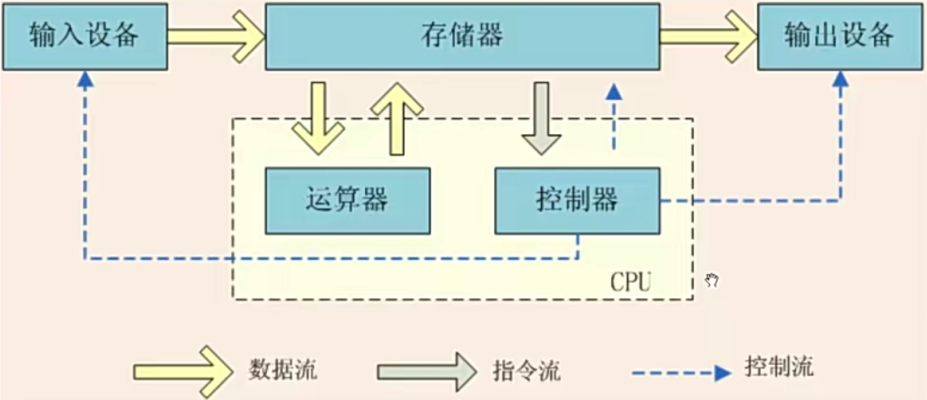
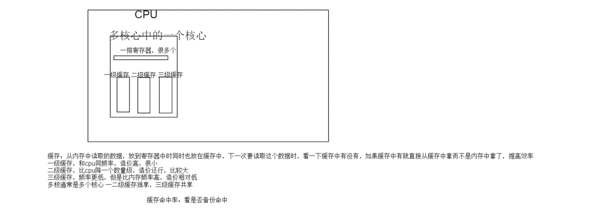
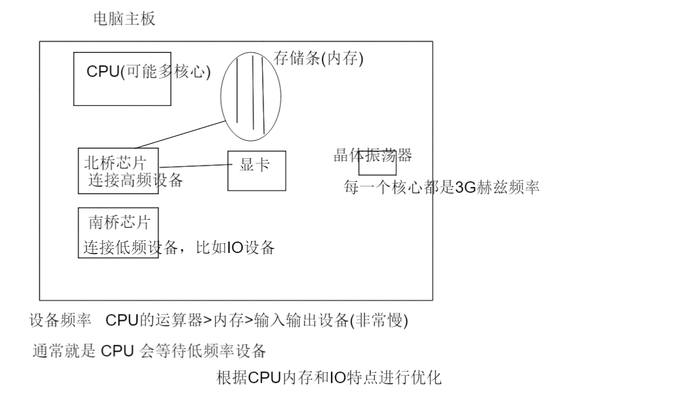
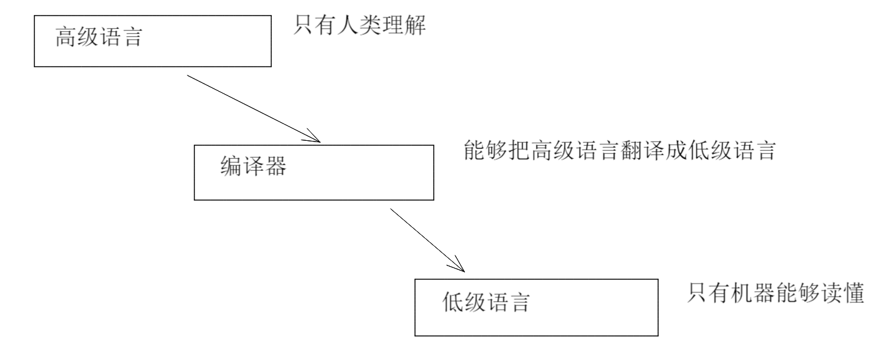
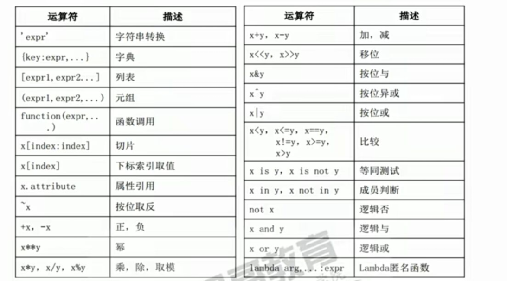
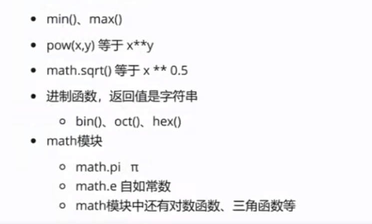
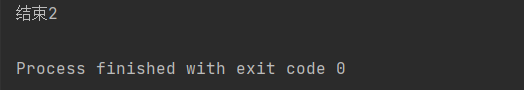

# 一、计算机基础知识

## 冯诺依曼体系结构

五大核心部件



五大核心部件

●中央处理器CPU

​	。运算器:用于完成各种算术运算、逻辑运算和数据传送等数据加工处理。

​	。控制器:用于控制程序的执行，是计算机的大脑。运算器和控制器组成计算机的中央处理器(CPU) .控制器根据存放在存储器中的指令		序列(程序)进行工作，并由一个程序计数器召控制指令的执行。控制器具有判断能力，能根据计算结果选择不同的工作流程。

●存储器:用于记忆程序和数据，例如:内存。程序和数据以二进制代码形式不加区别地存放在存储器中，存放位置由地址确定。内存是掉电	易失的设备。

●输入设备:用于将数据或程序输入到计算机中，例如:鼠标键盘。

●输出设备:将数据或程序的处理结果展示给用户，例如:显示器、打印机。


工作流程：输入设备输入数据存储在内存中，CPU从内存中获取待加工的数据，CPU并不直接和输入输出设备进行交互来获取数据。再将加工完的数据写回到内存中，如果此时我们再将数据保存在磁盘中，断电后内存中的数据没了，但是磁盘中的数据保存了，这个过程中，磁盘是输出设备(数据目的地)。如果将来要从磁盘获取数据放到内存中，那么就将磁盘作为输入设备(数据源)。


CPU中还有寄存器和多级缓存Cache.

●CPU并不直接从速度很慢的IO设备上直接读取数据，CPU可以从较慢的内存中读取数据到CPU的寄存器上运算

●CPU计算的结果也会写入到内存，而不是写入到I0设备上




电脑主板图片




## 计算机语言

计算机语言：人与计算机的沟通交互的方式

机器语言(二进制语言)，计算机唯一识别的语言

机器语言

●一定位数的二进制的0和1组成的序列，也称为机器指令

●机器指令的集合就是机器语言

●与自然语言差异太大，难学、难懂、难写、难记、难查错

不同公司生产的机器的**指令集**互不通用

指令集：所有指令的集合，通过指令可以让计算机做事


汇编语言

●用一些助记符号替代机器指令，称为汇编语言. ADD A,B指的是将寄存器A的数与寄存器B的数相加得到的数放到寄存器A中

●汇编语言写好的程序需要汇编程序转换成机器指令


需要对相应的CPU下载与之相匹配的汇编器，把汇编语言编译成适合各种CPU的机器语言


低级语言

●机器语言、汇编语言都是面向机器的语言，都是低级语言

●不同机器是不能通用的，不同的机器需要不同的机器指令或者汇编程序


高级语言

●接近自然语言和数学语言的计算机语言

●高级语言首先要书写源程序,通过编译程序把源程序转换成机器指令的程序

●1954年正式发布的Fortran语言是最早的高级语言， 本意是公式翻译

●人们只需要关心怎么书写源程序，针对不同机器的编译的事交给编译器关心处理





●语言越高级，越接近人类的自然语言和数学语言

●语言越低级，越能让机器理解

●高级语言和低级语言之间需要一个转换的工具:编译器、解释器


编译语言

●把源代码转换成目标机器的CPU指令

●C. C++等语言的源代码需要本地编译

解释语言

●解释后转换成字节码，运行在虚拟机上，解释器执行中间代码

●最近很多的语言 c# java python 都是解释语言，把源代码(程序员写的)，通过解释器编译成中间代码(字节码)，在虚拟机上运行，再通过虚拟机得到本地机器二进制代码实现控制电脑


## 高级语言的发展

●非结构化语言

。编号或标签、GOTO,子程序可以有多个入口和出口

。有分支、循环

●结构化语言

。任何基本结构只允许是唯一 入口和唯一 出口

。顺序、分支、循环，废弃GOTO

●面向对象语言

。更加接近人类认知世界的方式，万事万物抽象成对象，对象间关系抽象成类和继承。封装、继承、多态

●函数式语言

。古老的编程范式，应用在数学计算、并行处理的场景。引入到了很多现代高级语言中。函数是"一等公民"，高阶函数


## 程序Program


**算法+数据结构=程序**

算法：解决问题的方法

●数据是一切程序的核心

●数据结构是数据在计算机中的类型和组织方式，数据存放的方式

●算法是处理数据的方式，算法有优劣之分

只有选对了合理的数据结构，并采用合适的操作该数据结构的算法，才能写出高性能的程序。


算法必然和对应的数据结构相匹配才行。


写程序的难点

●理不清业务数据

●搞不清处理方法

●无法把数据设计转换成数据结构，无法把处理方法转换成算法

●无法用设计范式来进行程序设计


# 二、Python语言

## Python 的发展

1991 年   荷兰人 Gui van Rossum 发布了第一个公开发行版。由于他是英国BBC喜剧《Monty python's Flying Circus》的忠实粉丝，因此为这门语言取名 Python

import this 查看 Python 之禅


## Python的版本


# 三、Python基础

## Python解释器

## 基础语法

### 注释

### 数字

整数 int

- python3开始不再区分long，int，long被重命名为int，只有int类型了，int的长度没有上限，可以存储无限大的数直到计算机内存用完
- 进制表示：十进制10， 十六进制 <u>0x</u>a(十进制的10)，八进制<u>0o</u>10(十进制的8)，二进制<u>0b</u>10(十进制的2)      几进制就逢几进1
- bool类型，有唯一两个值True和False，都是整型值

浮点数

- 1.2，3.1415，-0.12，1.46e9等价于科学计数法1.46*10<sup>9</sup>、
- 本质上使用了 C 语言的double类型

复数

- 1+2j 或 1+2J


### 字符串

- 使用 ' ' " " 单双引号引用的字符的序列，引号是界定符

- 使用 """ """  和 ''' ''' 能够使字符串换行

  ```
  a = 'abc' #定义字符串
  b = "abcd" #也是定义字符串
  
  #如果字符串内还要使用' 或者 " 必须 交错开  不能出现 'ab'c ' 或者  "ab'c"
  a = 'ab"c'  
  b = "ab'c"
  也可以使用反斜杠变成转义字符， \'  \" 取消了单双引号的界定作用
  a = 'ab\'c'
  b = "ab\"c"
  
  也可以使用 """  """ 或者  内部放 ' 和 "
  a = """hello"'world""" 
  b = '''hello"'world'''
  
  """ """ 和 ''' ''' 更能够使字符串换行
  a =”hello
  world"
  
  a # 使用 ipython 打印
  print(c) #使用python中的print函数完成
  ```

- 使用 r前缀 忽略掉字符串内的转义字符  

  ```
  d = 'c:\windows\nt' #\n表示换行
  如果不做任何处理，字符串变量d会变成 'c:\windows换行t'
  可以 写成'c:\windows\\nt' 
  也可以写成
  d = r'c:\windows\nt'; r前缀使字符串忽视字符串内的转义字符，那么\n变成普通的\n了
  
  
  常见转义字符 \n \'  \"    \t:表示tab键   占8个位置  \t \n \t 是一个字符不能把 \和后面的拆开
  
  
  ```

- 使用 f 前缀创建格式化字符串   3.6才引入

  ```
  a = 'abc'
  b = 123
  c = f'{a}****{b}' #变量a和b填入对应位置   {}内部写变量名
  print(c)
  结果:abc****123
  用于构造字符串
  ```

  

### 缩进

- 未使用c等语言的花括号，而是采用缩进的方式表示层次关系

- 一个缩进4个空格

### 续行

- 在行尾使用\,注意\之后除了紧跟着换行之外不能有其他字符
- 如果使用各种括号，认为括号内是一个整体，其内部跨行不用\

```
a='abc'\
'efg'
本质上 a = 'abcefg'
```


### 标识符

1. 一个名字，用来指代一个值 
2. 只能是**字母、下划线和数字**
3. 只能以字母下划线开头
4. 不能是python的关键字，例如def、class就不能作为标志符
5. python大小写敏感

标识符约定

1. 不使用中文，也不建议使用拼音
2. 不要使用歧义单词，例如class_
3. 在python中不要随便使用下划线开头的标识符


可以变化其指向值的标识符称为变量

```
a = 100 
a='string' #a改变了 
```


### 常量

python没有常量定义，只有变量定义，什么标识符都可以改变其指向。

python只有字面量常量

### 字面量常量 

比如   1  123  'abc'

字面常量

```
a  = 1
a = a+1
1 这个值并没有被改变，只是新的字面量常量被创建了，并且使a指向了2，原来的1也没有消失
```

### 标识符本质

每一个标识符对应一个具有数据结构的值，但是这个值不方便访问，程序员就可以通过其对应的标识符来访问数据，标识符就是一个指代。


### 语言类型

静态语言：定义变量前必须声明类型   int a = 100 c 语言 a = "hello" 错误

动态语言： 定义变量不需要指定类型  a = 100 python，在赋值一刹那知道是什么类型 a="hello" 正确    数据类型没有任何约束

静态语言在编译的时候(比如java，编译后才生成字节码，编译通过字节码才能生成)做类型检查，提前发现问题，动态语言在运行时(比如python，字节码已经生成)才能发现类型不对   


type() python内置函数返回变量类型

```
type(1)   	 :int
type("hello"):str

type(1+2.1 )#int + float -> float  这是隐式转换

str(1)+'a' # 把1 强制转化成"1"  和 a 拼接，得到 1a，这是强制类型转化  
```

强类型语言：1 + 'a' 必须强制类型转化

弱类型语言：1+'a'  不用类型转化    比如java语言


### 进制

重点掌握二进制和十六进制

计算机中一切都是数字，指令都是数字

十六进制：1~9,a,b,c,d,e,f,10

十六进制前缀是0x    八进制前缀是0o  二进制前缀是0b

```
a = 10
b = 0xa
c = 0o12
d = 0b1010
a,b,c,d全表示10
```


2，8，16进制转化为10进制怎么转化
$$
对于n进制，其对应十进制 = ∑
第i位*n**(第i位的位数-1)
$$

```
0b1010 = 1*(2 ** 3) + 0 * (2**2) + 1 * (2 ** 1)+0*(2**0)
0o12 = 1*(8**1)+ 2*(8**0)
```


2进制转化成16进制
$$
把二进制数每4位一断，把每4位各自使用公式 ∑
第i位*n**(第i位的位数-1)
$$


十六进制、八进制转2进制

每一个十六进制位数拆成4个2进制数，每一个八进制位数拆成3个2进制位数

0x F8  -> 0b1111000

0o664 -> 0b1 1011 0100  


十进制转2进制，16进制

短除法，余数逆序


```
有符号数 无符号数

无符号数，没有符号位
有符号数，
对于其源码，其最高位是符号位
```


二进制数最低位为1一定是奇数，最低位为0一定是偶数


### 码值

python 内置

bin()函数   hex()函数 oct()函数   返回的都是字符串，分别返回一个整型的二进制 十六进制 八进制


原码：就是一种自然表达，把相应整数表示成二进制就是源码  ，如果是负数，那就把最高位设置成1

使用bin()函数查看某个数的源码

原码是给人看的，但是计算机不认识

```
1   原码   0000 0001
-1  原码   1000 0001   
```


反码：正整数和0的反码和原码一样。对于负数：先得到负数的原码，**然后符号位不变，将原码的其余各位按位取反**

```
1  反码   0000 0001
-1 反码   1111 1110
```


补码：正整数和0补码和原码一样。对于负数：先得到负数的原码，**然后符号位不变，将原码的其余各位按位取反并在最低位+1**

```
1  补码   0000 0001
-1 补码   1111 1111   0XFF  255是一个字节的有符号数，代表-1
```

得到补码后，如果再进行，符号位不变，将得到的补码的其余各位按位取反并在最低位+1，就能得到原码


0XFE 是1字节有符号数，十进制是 -2

FE是   1111 1110    再-1  1111 1101  再除符号位取反  1000 0010 就是 -2

​    

计算机内部在内存中，整数就是使用补码存放的。


补码有助于计算机运算


早期数字电路的CPU中的运算器实现了加法器，但是没有减法器，减法要转换成加法

比如

```
5 - 1   =  5+ (-1)

5的原码 0000 0101  补码   0000 0101
-1的原码 10000001  补码   1111 1111

	 0000 0101
    +1111 1111
结果: 1 0000 0100 由于是1字节数,最高位1溢出了，直接去掉，只剩下 0000 0100 就是4
```

### False 等价

python内置bool() 函数

bool(1) 得到 True

bool(0) 得到 False

bool(0.00000) 得到 False


python中

- 空字符串(里面啥都不写)""是False
- 非空字符串是True
- 0是False
- <=-1 和 >=1是真
- ()空元组  []空列表 {}空字典是假
- None是假

等价为False

- 空容器   ：空集合set  空字典dict 空列表list  空元组tuple
- 空字符串
- None
- 0

其他等效都是真


### 逻辑运算真值表

与 &     或  |   非 ~

具体看离散数学

### 运算符

python运算符 没有 ++ --

#### 算数运算符

1/2 = 0.5    / 是除法运算      1//2 = 0  //是整除运算

2**3   做次方运算    2\*\*0.5  做开放运算     \*\* 表示次数


+-*\   加减乘除   / 是除法有小数  //是向下取整整除 %取模运算(取余数)     **幂运算 

加号能够用于将两个字符串相加  比如 ： 'a' + 'b'

但不能 1+'1' 不像java


#### 位运算符

- &按位与、|按位或、^按位异或、<<左移、>>右移    按位运算 取整型原码进行运算
- ~按位取反，包括符号位
- 一个数左移n位就是 将这个数乘 2<sup>n</sup>
- 一个数右移n位就是 将这个数除 2<sup>n</sup>


<font color=red size=5>所有的位运算都是按照整型的补码形式进行运算，尤其是负数</font>


```
5&3
就是   
 0000 0101
&0000 0011
得到
0000 0001 

5&3 = 1

5|3
就是
 0000 0101
|0000 0011
得到
0000 0111

5|3 = 7

5^3

 0000 0101
^0000 0011
得到
0000 0110
5^3 = 6


1<<2
0000 0001  变为   0000 0100  得到4
1<<3
0000 0001  变为   0000 1000  得到8


~12 
0000 1100 //这是补码
变为 
1111 0011 // 这得到的是个补码  为了得到人看的原码，再次补一次码
1111 0011 得到 1000 1101 ，1000 1101才是原码 表示 -13


10 ^ 9
0000 1010
0000 1001^
---------------
得到  0000 0011  3

10 ^ -9
0000 1010
1000 1001	#这是原码，不能这么写，应该写成补码，虽然结果也是对的
-----------
得到  1000 0011 -3

应该写成
0000 1010
1111 0111 ^
-----------
得到 1111 1101 这是个补码，再进行一次补码的操作
1111 1101 变为  1000 0011得到-3
```


#### 比较运算符

- 比较运算符，返回一个bool值
- ==、!=、>、>=、<、<=
- 链式比较:4>3>2


类型不同可以用  == 和 != 比较，但是不能通过 > 和 <比较

```
1 == 'abc'  错误     'a' != 100 正确
1>'1' 报错
```

比较运算符尽量保证同类型进行比较

4>3>5 不常用


#### 逻辑运算符

 &  | ^ ~  是位运算符

and or not 是逻辑运算  c语言中  分别是 &&  || !  

and 和 or 都具有**短路现象**(偷懒)

**能够导致表达式短路的要往前放**


把所操作的数值当作真或假来进行逻辑运算，运算结束之后返回的是**表达式最后位置(也要考虑短路)的值**,<font color=red size=5>逻辑运算符返回的不一定是bool值</font>

```
a = 100
a > 200 and a<300 算到 a>200 就发生短路了，就算到了 a>200  就给出False


1 and 'abc'  算到 'abc' 才结束，所以给出的值是 'abc'

1 and 0.0 and 'xyz'  结果是 0.0  算到0.0就发生短路，已经确定结果了 所以返回的值是 0.0


a = 123
if a or 'abc' #a or 'abc'是 'abc', 'abc'等效为1
```


#### 赋值运算符

赋值语句： +=, -= ,*= ,/=,%=,//=

等式右边先做，然后赋值给等号左边


连等：x = y =z =10  右边给左边


#### 成员运算符 

in ，not in

列表，元组用的

#### 身份运算符

is ，is not


### 运算符优先级

运算符 的操作数 的结合先后顺序

比如 3-2，减号左右两个操作数 ，双目运算符

~ 12  单目运算符

1>2 双目

-2  负二   单目运算符

python没有三目运算符(c语言有 ? : ，但是python有三元表达式


单目 高于 双目

算数 高于 比较 高于 逻辑


### 表达式

由数字、符号、括号、变量等的组合。

有算数表达式，逻辑表达式，赋值表达式、lambda表达式等

Python 中，<font color=red size=5>赋值即定义。</font>Python是动态语言，只有赋值才会创建一个变量，并决定了变量的类型和值。

如果一个变量已经定义，那么变量相当于重新定义

```
a = 100 // 第一次定义
a ='abc'// 第二次定义，重新定义
```


### 内建函数

搜索 \__import__(built-in function)



hex()  bin() 已经讲过了

 bool() str()    int() 是强制类型转换

str 是一个类型(class) ，bool 也是类型  int 也是类型，这些都是类型转换  

``` 
int('1')  得到 1
int(2.1)  得到 2

int('a')  直接报错  valueerror的异常
int('a',base=16)  得到10   base=16的意思是，把这个数当成是16进制，十六进制中 a 是 10


python中任何东西都可以转化成字符串，目的是展示给人看
str([])  得到:'[]'  这是把列表转化成字符串

def a():
	print('aaaa')
str(a) 得到'<function a at 某个个地址>' 函数转化成字符串
```


type() 内置函数，得到某个数的类型

int str list tuple 都是一种类型(class)

type是元类，是构造所有类型的类

```
def a():
	print('aaaa')
type(1),type('abc'),type(a)，type(True)
得到 (int,str,function,bool)

type(1) == int 得到 True
type(1) == 'int' 得到 False
type(1) 返回的是int类型，而不是内容为int的字符串


type([])  得到 list
type(())  得到 tuple
list 和 tuple 都是类型，而不是字符串


type(int)  得到 type
type(str)  得到 type
type(list) 得到 type
type(type) 得到 type
type(类型) 得到的都是 type

type是元类，是构造所有类型的类
```


isinstance(某个值,某种类型(也可以写成多种类型，就变成多次比较))  ：是否是后面指定的那个类型的实例，返回 bool 值

```
isinstance(1,int) True
isinstance(1,str) False
isinstance(True,bool) True
isinstance(True,int)  True，True是int  但是   type(True) == int 是False ，==判断的是严格相等

isinstance(1,(str,list,tuple)) 得到False ，进行3次测试，一旦有一个成功就返回False
isinstance(1,(str,list,int,tuple)) 得到True ，进行4次测试，一旦有一个成功就返回True

type(1+True) 得到 int， True 隐式转换成 1

```


input(提示符) 用于让用户输入，会导致程序阻塞，形成一个交互式的界面

input函数具有返回值，返回 你输入的字符，类型是字符串形式

```
x = input("请输入数据") 用于接收用户输入的值，得到的肯定是字符串
```


print() 函数

print(value, .... , sep = ' ',end = '\n')  sep表示分隔符，end表示每一个print在打印完其所有元素之后再输出一个东西，默认输出'\n'

print函数能够打印所有的类型，print()函数会调用要打印元素的字符串表达

```
def a():
	print('aaaa')
print(1,2,3,[],[1,2,3],a) 
得到: 1 2 3 [] [1,2,3] <function a at 某个地址>
打印的元素之间具有分隔符，分割符是由 print 参数列表中的sep参数控制的的，默认是一个空格

print(1,2,3,[],[1,2,3],a,sep = '::')
得到: 1::2::3::[]::[1,2,3]::<function a at 某个地址>

end = '\n' 每一个print在打印完其所有元素之后再输出一个东西，默认输出换行符
print(1,2,3,sep = ',',end = ';') 得到:1,2,3;

```


## 数值型

### 类型转换

●int. float. complex. bool都是class, 1. 5.0、 2+3j都是对象即实例

●int: python3的int就是长整型，且没有大小限制，受限于内存区域的大小

●float: 由整数部分和小数部分组成。支持十进制和科学计数法表示。C的双精度型实现

●complex: 有实数和虚数部分组成，实数和虚数部分都是浮点数，3+4.2]

●bool: int的子类，仅有2个实例True、False对应1和0， 可以和整数直接运算

类型转换

●int. float. complex. bool也可以当做内建函数对数据进行类型转换●int(x) 返回-一个整数

●float(x) 返回一个浮点数

●complex(x)、 complex(x,y) 返回一一个复数

●bool(x) 返回布尔值，前面讲过False等价的对象

```
float(1) 得到 1.0
float('1e-2') 得到 0.01
```


### 整除

●round), 四舍六入五取偶

●math.floor()向下取整

●math.ceil()向 上取整

●int() 取整数部分

●// 整除且向下取整


round内建函数  

math.ceil 和 math.floor 函数  分别表示向上取整和向下取整


```
import math #导入math模块 为了使用 math模块中的函数
print(math.ceil(1.0),math.ceil(1.1),math.ceil(1.3),math.ceil(1.5),math.ceil(1.9)) 得到:1,2,2,2,2
math.ceil 是向上取整，往天花板靠
print(math.ceil(-1.0),math.ceil(-1.1),math.ceil(-1.3),math.ceil(-1.5),math.ceil(-1.9)) 得到:-1,-1,-1,-1,-1


print(math.floor(1.1),math.floor(1.3),math.floor(1.5),math.floor(1.9),math.floor(2.0)) 得到:1,1,1,1,2
math.floor 是向下取整，往地板靠
print(math.floor(-1.0),math.floor(-1.3),math.floor(-1.5),math.floor(-1.9),math.floor(-2.0)) 
得到:-1,-2,-2,-2,-2
```


// 符号表示整除:是向下取整   就是 math.ceil 函数 

```
1//2,3//2,5//2,7//2 得到(0,1,2,3) 向下取整

1//-2,-3//2,5//-2,-7//2 得到(-1,-2,-3,-4) 向下取整


int()强制类型转换的取整方式:向0取整,只截取整数部分

int(0.1),int(0.5),int(0.8),int(1.1),int(1.0),int(1.5),int(1.8) 得到(0,0,0,1,1,1,1)
int(-0.1),int(-0.5),int(-0.8),int(-1.1),int(-1.0),int(-1.5),int(-1.8) 得到(0,0,0,-1,-1,-1,-1)
```


round函数：如果某个数在0.5(x.5)的位置上，则找离它最近的那个偶数,其余的位置上，符合4舍6(实际上比5大一点都算)入

四舍六入五凑偶

```
round(0.1),roun(0.6),roun(1.2),roun(1.7),round(2.3),roun(2.6) 得到(0,1,1,2,2,3)
round(0.500000001) 得到1
round(1.5) 得到2
round(2.5) 得到2

round(1.5000001) 得到2
round(2.5000001) 得到3
round(-0.5),round(-1.5),round(-2.5),round(-3.5)
```


### 常用数值处理函数

 



```
max(interable,*[,default = obj,key = func)
对容器里面的元素进行迭代
max([1,2,3,4])

max(arg1,arg2,*args,*[,key = func])
传入一堆值进行迭代
max(1,2,3,4,5)

```


## 程序控制

- 冒号后面都需要语句块，就需要缩进
- pass 就是一个占位语句，并且用于结束当前缩进块
- 条件判断的部分不一定是True 和 False ，也可以是等效后得到的 True 和 False


● 顺序

按照先后顺序一条一条执行

例如，先洗手，再吃饭，再洗碗

● 分支

根据不同的情况判断，条件满足执行某条件下的语句

例如，先洗手,如果饭没有做好，玩游戏;如果饭做好了，就吃饭;如果饭都没有做，叫外卖

● 循环

条件满足就反复执行，不满足就不执行或不再执行

例如，先洗手，看饭好了没有，没有好，一会来看一次是否好了，一会儿来看一次,直到饭好了，才开始吃饭。这里循环的条件是饭没有好，饭没有好，就循环，饭好了就终止循环。

### 单分支

```
if condition:
	代码块
```

●condition必须是一 个bool类型，这个地方有一个隐式转换bool(condition), 相当于False等价

●if语句这行最后，会有一个冒号，冒号之后如果有多条语句的代码块,需要另起一行, 并缩进。if、 for. def. class等关键字后面都可以跟代码块

●如果只有一条语句,也可以跟在这一行后面。例如if 1>2: pass    这种写法不推荐

### 多分支


```
if condition1:
	代码块1
elif condition2:
	代码块2

elif condition3:
	代码块3
.....
else:
	代码块4

```

else可写可不写


●多分支结构，只要有一个分支被执行，其他分支都不会被执行

●前一个条件被测试过，下一个条件相当于隐含这个条件


if:

else:

保证无漏洞，else包含剩余情况


for循环、while循环都可以互相嵌套，形成多层循环。循环嵌套不易过深

### while循环

while循环多用于死循环，或者不明确知道循环次数的场景

```
while cond:
	block
```


### for循环

```
for element in iterable:
```

iterable 可迭代对象有：列表

可迭代对象：一个箱子，箱子里放小球，小球放的方式不知道。

for 循环就是遍历可迭代对象 遍历：不重复的取一遍


#### range内建函数

直接返回一个**range对象**，并不是立即直接返回数据，这是一个惰性对象.(range(3)，我们想拿0，1，2，但它给我们一个对象)。惰性对象必须使用一些方法去里面拿出数据(不拿就不给)。拨一下转一下，需要驱使惰性对象运转。

range对象是可以迭代的对象，它有内容，但你必须驱动它。通过for循环就能做到一次次驱动，直到可迭代对象内所有元素都被拨了一遍

一个参数：range(stop)  给终点  ，默认起点就是0  返回的是[0,stop) 前闭后开   即  [0,stop-1]    range(0) 里面空无一物

range(i)  i大于0，相当于计数器

二个参数：range(start,stop) 给起点和重点，返回的是 [start,stop) 即 [start,stop-1]   range(0,1) 只包含0

三个参数：range(start,stop,step) 给起点终点后，才能给步长，返回 [start,stop-1]  并且从 start开始，每step就取  但是 stop还是不取


**start stop  大小不一定  正序和逆序的问题，step也可以是负数，就变成了倒着走**

```
逆序打印10以内奇数
for(i in range(9,0,-2)):
	print(i)
```


### continue语句

作用于当前循环(当前循环：从该语句向外层找到的第一个while或者for)

用于终止当前循环的当此执行，转而取执行下次循环


continue  和 if 没有关系


### break 语句

终结当前循环    当前循环的意思也是上面提到的


break 和 if 没有关系


总结

●continue和break是循环的控制语句)只影响当前循环，包括while、 for循环

●如果循环嵌套，continue和break也只影响语句所在的那一层循环

●continue和break只影响循环所以if cond: break不是跳出if,而是终止if外的break所在的循环

●分支和循环结构可以嵌套使用，可以嵌套多层。

### else子句

如果循环正常结束，else子句会被执行，即使是可迭代对象没有什么元素可迭代

有上例可知，一般情况下，循环正常执行，只要当前循环不是被break打断的，就可以执行else子句.哪怕是range(0)也可以执行else子句。

这里的else子句 ，是和循环平级的

```
for i in range(1,10):
    break
    pass
else:
    print("结束1")

for i in range(0):
    pass
else:
    print("结束2")
```



## 字符串拼接

- str(1) + ',' + 'b' #都转换成字符串拼接到-一起

- "{}-{}" .format(1, 'a') # {}就是填的空， 有2个，就使用2个值填充

- \在3.6后，可以使用插值   字符串f前缀

  ```
  a = 100;
  b = 'abc'
  f'{a}-{b}' #一定要使用f前缀，在大括号中使用变量名
  ```

  


```
a=123
b="s11"
"{}*****{}".format(a,b)  {}内部没有值，因此按照顺序一一对应
"{1}*****{0}".format(a,b) {}内部有了索引  a填在0的位置，b填在1的位置
```


# 四、练习
