# 集合set

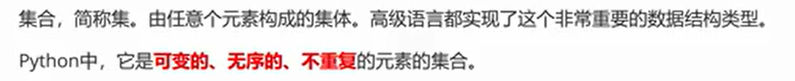

线性数据结构 是 有序的，可重复，可变的。

set 是 非线性结构，因为set结构无序，所以set结构无索引

## 初始化

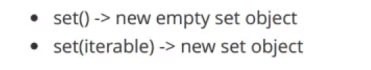

```
m1 = set()  #空集
set(range(5)) #可迭代对象
set("abcde") #可迭代
set(b'abc123') #可迭代
set(tuple("abc")) #可迭代

#使用 {} 定义的是字典
# {} 里面加元素定义的是set
print(type({}))   #dict
print(type({1,2,3})) #set

#print 每次打印出来的 set 的顺序都是不确定的，因为 set 集合元素是无序的

{("abc"),range(5),list("abc"),bytearray(b'abc'),{1,2,3}} 会报错
```

set 集合中的元素**不能是 不可哈希类型**，不可哈希类型有  bytearray，set，list

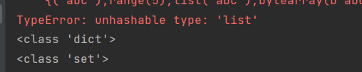


```
hash(list())
```

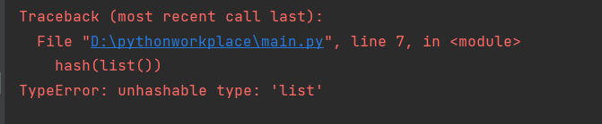


## 元素性质

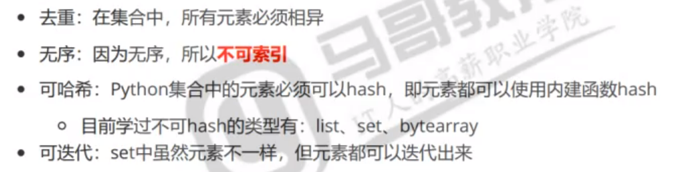

去重是根据 hash 值来决定的，如果两个值hash 值一样，那么就是重复的

## 增加

set 的 add 方法  ，加入单个元素

set 的 update 方法，加入多个可迭代对象，把可迭代对象中的的元素拿出来放入set 中


```
s = set()
s.update(range(5),"232",[2,4],{9,8},(1,2),[1,2,4])
print(s)
```

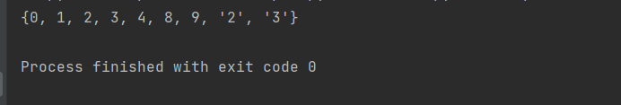


## 移除

set 中找的是 key，表示无序的值，再通过 key 去找 value

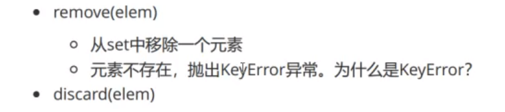


set集合.remove(要删除的值)

时间复杂度 O(1)  

```
s = {1,2,3,4,5,6,7,8,'a','b'}
s.remove(1)
print(s)
s.remove('c')  # 报错
```

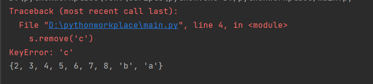

keyerror,key 找不到，key 是唯一的不重复的值


set 的 remove 方法不是像 list 一样要经过遍历，而是通过 hash 值来找是否匹配


set集合.discard(要删除的值)   有这个值就移除，没有这个值不报错

时间复杂度也是 O(1)


set集合.clear()  清除整个 set 集合。


set集合.pop() 并且返回弹出的值。随机pop


## 修改

集合类型没有修改，因为元素唯一。如果元素能够加入到当前集合中，就说明这个元素是不重复的。

修改就是删除旧元素加入新元素

## 索引

无索引

## 遍历

容器都可以遍历，时间复杂度 O(n)


## 成员运算符in

set 直接通过 hash值进行比较

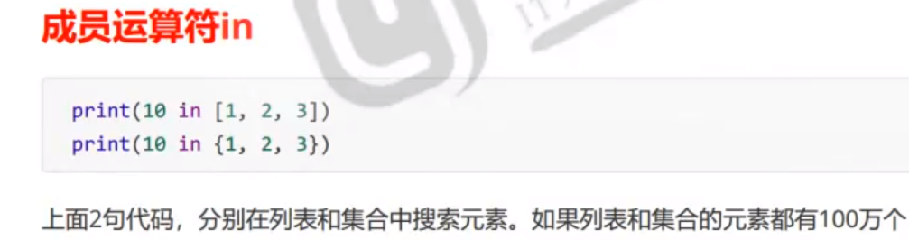

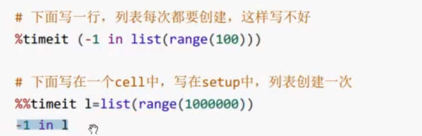

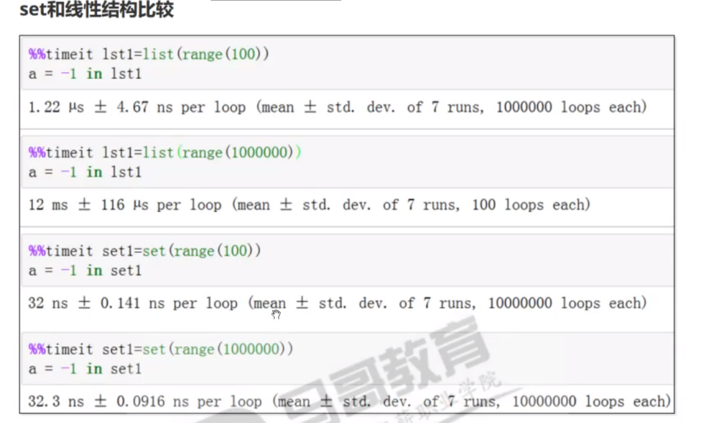


## 可哈希

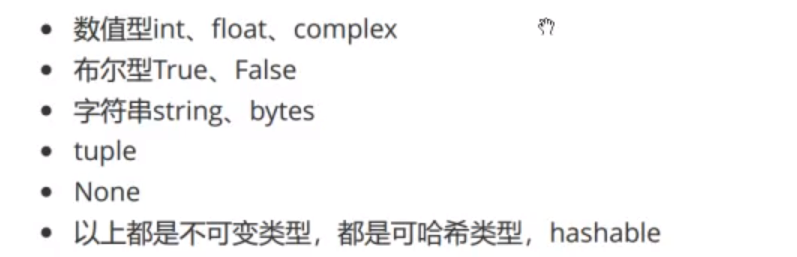

内建数据类型中，不可变类型都是 可 hash 的      bytearray list set 不可hash


将可哈希的值先哈希，再根据它们的哈希值决定哈希位置。值被存储在哈希表中。

哈希值是有序的。  


增 删 查(in运算符) 都是 要看元素哈希值。遍历不会使用 hash 值


## 集合

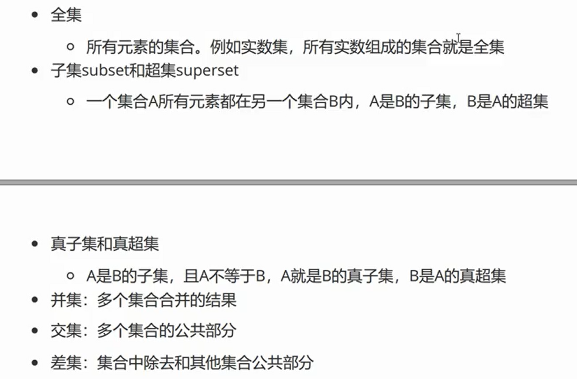

python中，空集是 set()


### 并集

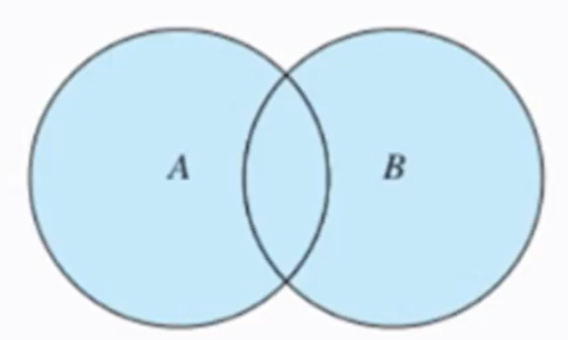

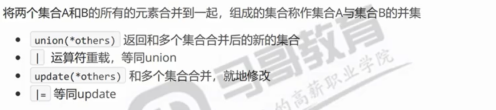

```
a = {1,2,3}
b = {2,3,4,5}
new = a|b  #返回新的，不作本地修改
new = a.union(b) #返回新的，不作本地修改
a.update(range(10,11))#在a的位置就地修改
a |={10,11} #也是在a的位置就地修改
```


### 交集

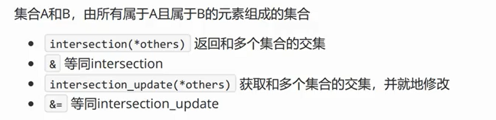

用 & 表示

```
a = {1,2,3}
b = {2,3,4,5}
new = a&b #生成新对象，非本地修改
new = a.intersection(b) #生成新对象，非本地修改
a.intersection_update(b) #a的位置本地修改
a &= b #a的位置本地修改
```


### 差集

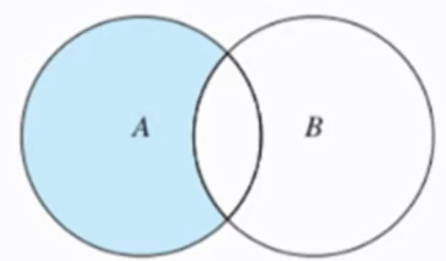

A-B 和 B-A是不同的

A-B 为 A-(A&B)

B-A 为 B-(A&B)

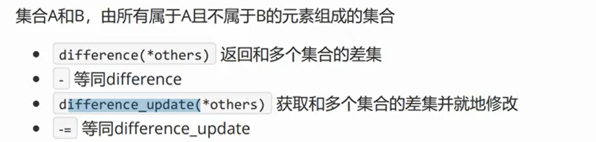


### 对称差集

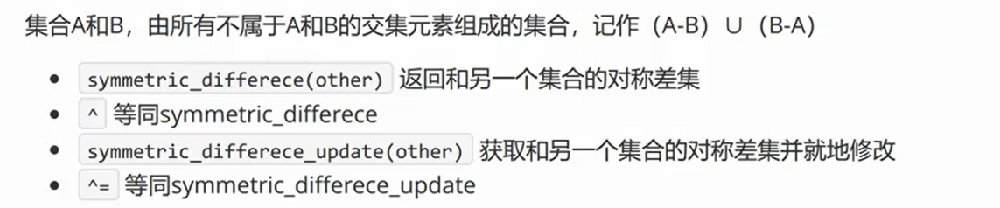


### 其他集合运算

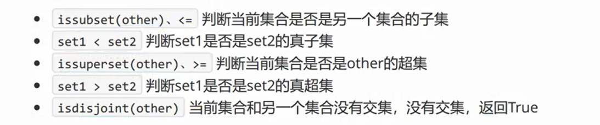


# 字典dict

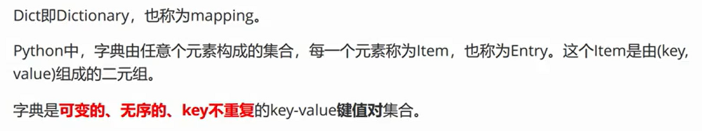

item 和 entry 都是指一个键值对


## 初始化

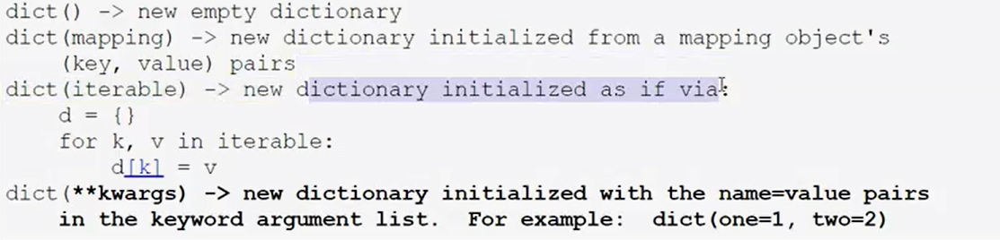

```
a = dict()
print(a)
m = {'a':100,'b':200}
n = dict(m)
print(m)
print(n)
使用二元组，即两个元素的集合，第一个元素作为 key 第二个元素作为value set是无序的因此不能确认哪个元素是第一个
h = dict([(10,20),['a','hello'],{9,20}])  
print(h)
n1 = dict(a=100,b=200,m=300,d=200);
print(n1)
```

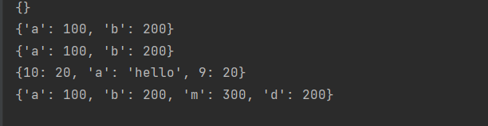

混搭

```
m = dict([(10,100),('a',200),('c',300)],a = 400)
print(m)
```

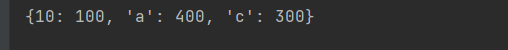

a = 400 把前面那个用 二元组赋值的变量给覆盖了


fromkeys初始化

```
m = dict.fromkeys(range(5))
print(m)
m = dict.fromkeys(range(5),1) #缺省值用什么填充
print(m)
m = dict.fromkeys(range(5),[])
print(m)
```


## 元素访问

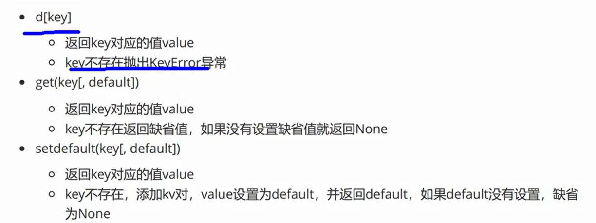


## 新增和修改

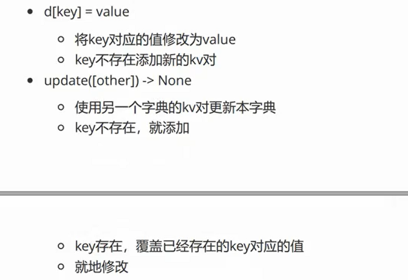

```
m = {'a':100,'b':200,'c':300,'d':400}
m['d']=900
print(m)
m['f'] = 1000
print(m)
n = {'c':600,'d':500,'m':4000}
m.update(n)
print(m)
```

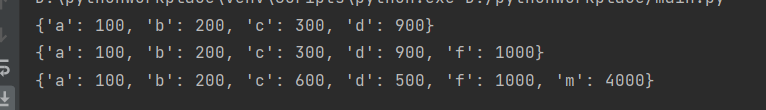

## 删除

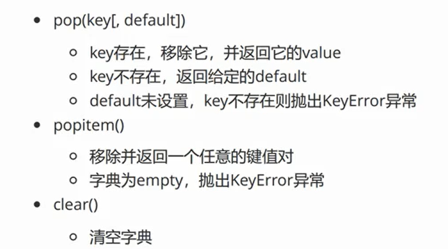


```
del 字典
```

把标识符取消了，如果这个字典的引用计数为0了，那么这个对象会被gc清理


```
字典.pop(key,[缺省值])   按照key弹出
如果找不到 key，没有写缺省值，就报错 keyerror
如果找不到 key，有缺省值，就返回缺省值
```


```
字典.popitem()  随机弹出item ，但是不能为空
```


```
字典.clear()  把这个字典长度改为0,字典内原来的各元素的引用计数都-1
```


## 遍历

```
m = {'a':100,'b':200,'c':300,'d':400,'e':500,2:220}
#遍历key 两种方式
for key in m:
    print(type(key),key)
for key in m.keys():
    print(key)

#遍历value
for value in m.values():
    print(type(value),value)
for key in m.keys():
    print(m[key])

for item in m.items(): #m.items 是字典中若干个键值对的二元组的形式
    print(type(item),item[0],item[1])
for k,v in m.items(): #把 items 结构成 k，v
    print(k,v)
for k,_ in m.items(): #下划线的位置是一个丢弃变量，这个变量的标识符是下划线表示这个变量我们不关心
    print(k)
for _,v in m.items(): #下划线的位置是一个丢弃变量，这个变量的标识符是下划线表示这个变量我们不关心
    print(v)
```


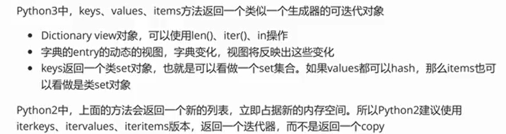

```
m = {'a':100,'b':200,'c':300,'d':400,'e':500,2:220}
200 in m.values()

字典变化的同时，该字典的keys，values，items也会同步变化
```

keys 返回的是类set对象，是可变的，无序的，去重的。就相当于把字典所有的key值都取出来构成一个新的集合

字典不能够使用 集合运算(并集、交集、差集..)，但是字典的keys 可以使用集合运算

```
m = {'a':100,'b':200,'c':300,'d':400,'e':500,2:220}
#遍历key 两种方式
n = {'a':400,'f':600,'g':700}
print(m.keys()|n.keys())
```

字典.keys() 是唯一的，不重复的，而且**必须可哈希**。字典.values() 是可能重复的，**不一定可哈希**，仅仅返回的是可迭代对象，但不是类set。

如果values中的所有值都可哈希，那么items()也是返回类set对象

keys,values,items方法返回的都是惰性对象


## 遍历与删除

字典.keys values item 都是 字典的 view，字典修改以后，其view也会跟着同步进行变化。

当我们正在对字典的view进行遍历的时候，不允许修改该字典的长度，即不能进行kv对的增减

```
dict = {'a':100,'b':200,'c':300,'d':400,'e':500,2:220,'m':900,'h':1000}
#下面三种遍历删除方式都会报错
for i in dict.keys():
    dict.pop(i)
for k,v in dict.items():
    dict.pop(k)    
for k in dict.values():
    dict.popitem()
```

这是运行时错误 runtime error

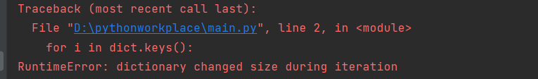


正确的写法：先取出所有要删除的键构成集合，然后再对该集合进行遍历然后删除字典中的元素

```
dict = {'a':100,'b':200,'c':300,'d':400,'e':500,2:220,'m':900,'h':1000}
dicttodel=[]  #这个集合用来存储要删除的键
for k,v in dict.items():
    dicttodel.append(k)
for k in dicttodel:
    dict.pop(k)
```


## key

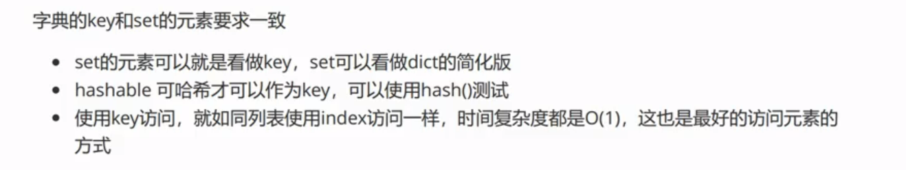

None值也是可哈希的

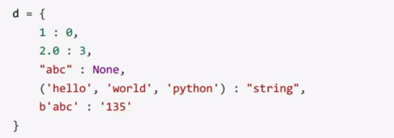

## 有序性

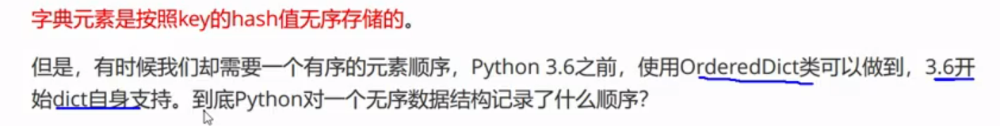

3.6开始字典记录录入顺序

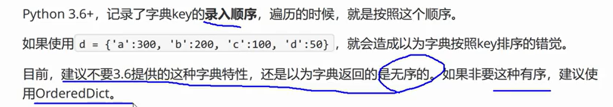


## 缺省字典defaultdict

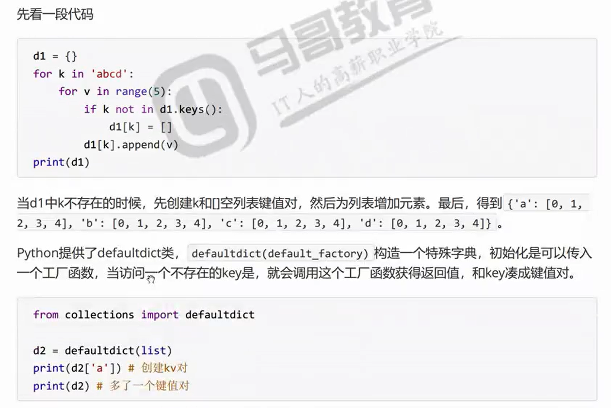

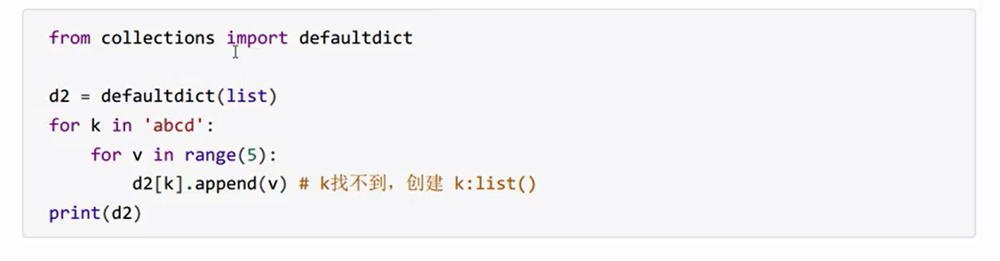


```
from collections import defaultdict
d2 = defaultdict(list)
for k in 'abcd':
        d2[k]
print(d2)
d3 = defaultdict(list)
for k in 'abcd':
    for v in range(5):
        d3[k].append(v)
print(d3)

#抛出异常 试图使用字典中不存在的键
#d4 = dict()
#for k in 'abcd':
#       d4[k]

d4 = dict()
for k in 'abcd':
        d4[k] = 1  #给字典增加元素，不报错
print(d4)
```

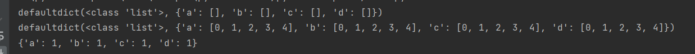


## 作业

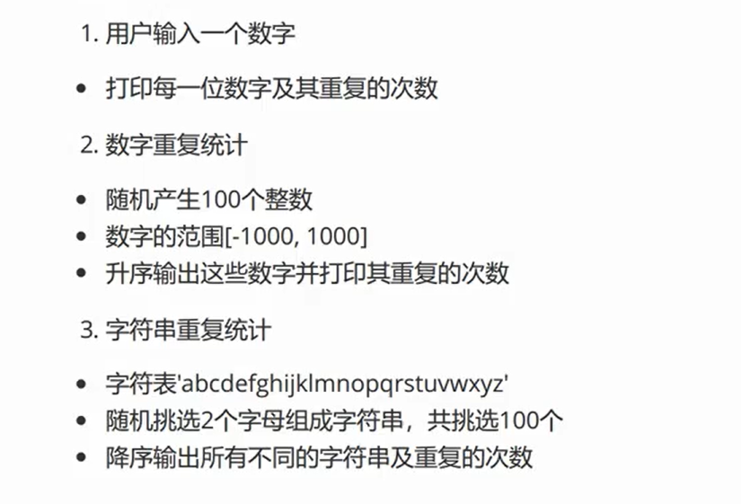


# 封装和解构

## 基本概念

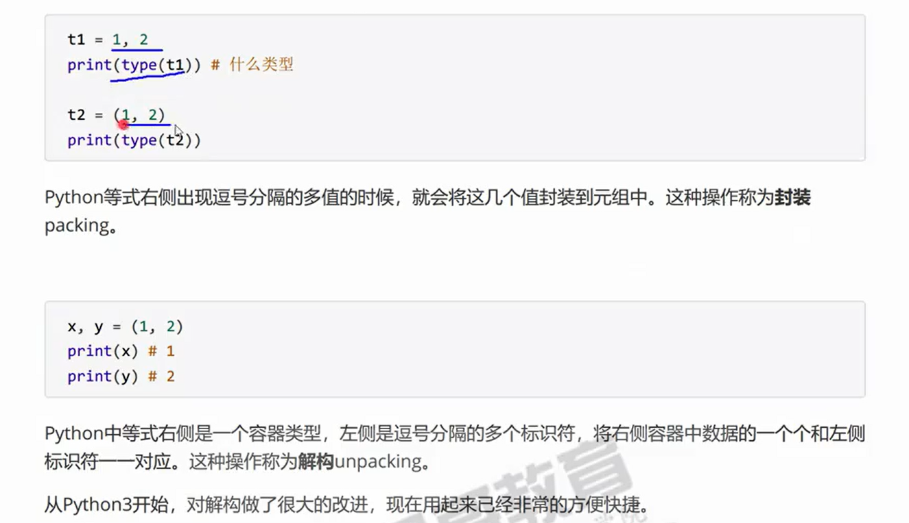

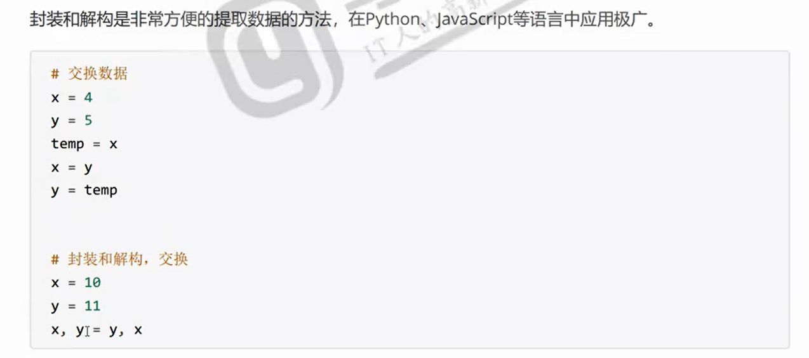


## 简单解构

解构，等号右边要求是可迭代对象 range 等也可以，只要是容器

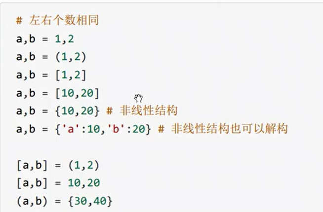


## 剩余变量解构

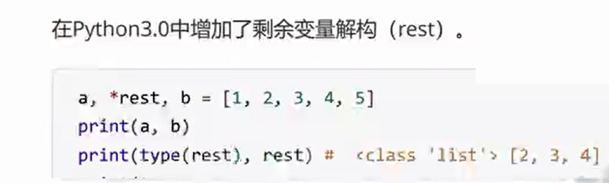

```
a,*b = range(5)
a 是1  b 是 1、2、3、4列表形式
a,*b,c = range(5)
a 是1  b 是 1、2、3列表形式  c 是 4
*b,c = range(5)
b 是 [0,1,2,3] ,c 是 4
*b = range(5) 会报错，因为不用加星号
a,*b,*c,d = range(10) 会报错 出现两个 * 了

_,*a,_ = range(5)
print(_)  4
print(a) [1,2,3]
print(_)  4
第二次解构，_ 变量已经被重置为4了，第一次的0被覆盖

```

*标识尽可能收集多的数据，收集后形成一个列表，如果 * 没有剩余，那就是啥都不拿


## 练习

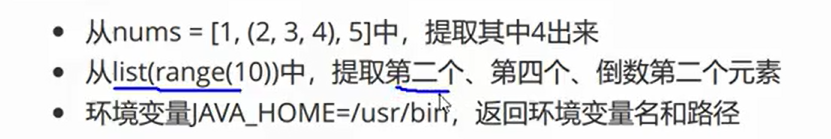

