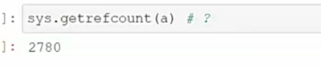

# 一、内建常用数据结构

- 序列sequence
  - 字符串str、字节序列bytes、bytearray
  - 列表list、元组、tuple
- 键值对
  - 集合set、字典dict


线性表在物理结构(物理结构就是内存地址上)上分为顺序表和链接表  前者物理结构连续，后者物理结构不连续。

链表在存储空间上是分散的。前一个元素还记录着下一个元素所在的位置。


python 中 列表list是用顺序表实现的。用的是一段连续的内存

链表简单示意图


# 二、线性数据结构

线性表

线性表(简称表),是一种抽象的数学概念,是一组元素的序列的抽象，它由有穷个元素组成(0个或任意个)

●顺序表:使用一大块连续的内存顺序存储表中的元素，这样实现的表称为顺序表，或称连续表。在顺序表中，元素的关系使用顺序表的存储顺序自然地表示

●链接表:在存储空间中将分散存储的元素链接起来，这种实现称为链接表，简称链表

列表如同地铁站排好的队伍，有序，可以插队、离队，可以索引。

链表如同操场上手拉手的小朋友，有序但排列随意。或者可以想象成-串带线的珠子，随意盘放在桌上。也可以离队、插队,也可以索引。

对比体会一下，这两种数据结构的增删改查。


# 三、列表list

列表list

●一个排列整齐的队伍，Python采用**顺序表**实现

●列表内的个体称作元素,由若干元素组成列表

●元素可以是任意对象(数字、字符串、对象、列表等)

●列表内元素有顺序，可以使用索引

●线性的数据结构

●使用[]表示

●列表是可变的

列表是非常重要的数据结构，对其内存结构和操作方法必须烂熟于心。


java 里面的List 是链表实现的。


python，顺序表实现，就是c语言中的数组。

列表里面可以放n多个元素。

列表是可索引的。

列表可以中间插入，中间删除。

列表不是惰性的。


## 列表初始化

1. list() -> new empty list
2. list(iterable) -> new list initialized fronriterable's items
3. [all items]
4. 还有一种构建方式，列表解析式，以后再说

列表不能一开始就定义大小 list(5) 这种写法是错的。

```
list1 = [] 空列表

list1 = list() 空列表  list() 相当于一种内建函数调用，返回一个列表类型

list1 = [1,2,3] #立即在内存中占用一部分构成列表

list1 = [1,2.1,True,[],(),"abc",None] 列表可以放入任何python支持的数据类型

list1 = list(range(5))      # list 括号里面必须写可迭代对象(可以被遍历的对象)。从可迭代对象中把所有元素中拿出来构成一个列表交给list1。可迭代对象(目前): range 惰性对象 ，list 列表容器

list1 = list([1,'a',1000]) #先立刻有了一个列表，list函数再遍历这个列表依次拿出各个元素并构建新列表，把新列表交给list1
```


列表是顺序表，有序的结构。(可遍历对象不一定有序，容器都可以遍历，有序才能够索引编号)


## 列表索引

列表索引分为两种，正索引和负索引。索引不能越界，越界出现 IndexError异常

正索引：0~length-1

负索引：-length ~ -1

使用索引，只要直到首元素地址，接着进行地址的加法就能得到接下来各个元素。这是最有效率的访问方式。其时间复杂度是常数时间复杂度O(1)。 这是最简单的方式。


## 列表查询

列表名.index(你要查找的值,start,stop)

1. 你要查找的值 是必须要写的参数，start和stop可写可不写
2. 返回的是该值的正索引，且是该值从左往右出现时的第一个位置。
3. 如果这个值找不到就返回异常 ValueError
4. start参数表示你要从哪个索引开始找，stop表示你要找到哪个索引结束    并且是 [start,stop)


列表名.count(你要计数的值)

1. 在列表中计数某个值存在多少个


index 方法可能需要遍历所有元素，如果运气好第1个就是，运气不好就是遍历所有元素

count 方法必须遍历所有元素

index 和 count效率不高，它们都要遍历元素


遍历元素都跟当前列表数据的个数有关，元素多称为**规模大**

index随着数据规模的增加而耗时增加，搜素效率随着index的增加而下降

count不管有多少元素，都需要完整遍历一遍

index 和 count 的事件复杂度都记作O(n) ,n越大，效率越低下

O(1)  与规模n无关，不会随着规模增大而变复杂


内建函数 len()   len(容器对象)

列表包装了c语言的数组，包装的时候并且包装了一个数据：数组的当前长度。在对数组元素进行元素增加元素减少时，同步进行数组长度的增加或减小。

所以 len(list对象)  时间复杂度时O(1)   直接报数报出来，不用数一遍。


## 修改

直接根据索引选中值然后进行值的覆盖


## 增加单个元素

append(object) -> None

- 列表尾部追加元素，返回None
- 返回None就意味着没有新的列表产生，就地修改。定位时间复杂度是O(1)


insert(index, object) -> None

- 在指定的索引index处插入元素object

- 返回None就意味着没有新的列表产生，就地修改。定位时间复杂度是O(n)


索引能超上下界吗?超越上界，尾部追加。超越下界，头部追加


append 内部元素的尾部增加。

容器名.append(item)      item:要添加的单个元素    list 是可变数据类型


append 函数没有返回值 或者返回 null，没有返回值往往表示它自己(容器本身)被改变了，自己改变称为就地修改。 


append 通常情况下效率是高的，但是如果容量不够就会进行扩大。python中列表会扩大：先给一个初始大小，刚开始如果容量不够了就扩增4倍，达到一定限度就变成两倍一翻。

扩容耗时，如果试图翻倍的时候内存不够就会牵扯到垃圾回收


append 函数 在列表不需要扩容的时候，事件复杂度是 O(1) ,直接由长度得尾部进行添加

append 函数在列表需要扩容的时候，可能还要涉及垃圾回收，垃圾回收的时候程序要暂停一段事件，比较耗时。单纯的扩容还好。


insert(index,object) index：插入点，一个索引，object：要插入的对象

insert方法没有返回值。是就地修改。

insert时间复杂度很高，因为要挪动元素


append 的时间复杂度比较低，推荐使用


## 增加多个元素


extend(可迭代对象)     没有返回值，就地修改。

在列表尾部后面扩展，全部添加到尾部后面


就是  for x in 可迭代对象   然后把这些元素append 到列表内

效率还可以，扩容是难免的。


列表1 + 列表2 将列表中的元素依次拿出来合成一个新的列表，并返回

```
m = [1,2,'hello']
n = [9,9]+m
print(n)
```


列表1 + 元素  没有这种语法。


某个列表*某个整型常量，将给出的列表的元素重复整型常量次，并且拼接生成全新的列表，不是就地修改，原列表不变

```
m = [1,2,'hello']
n = m*3
print(n)
```


- 加法是拼接出新的列表
- 乘法是使用给定的列表，重复其元素，生成新的列表。


```
[12,13] + [[14,15]]
生成的是 [12,13,[14,15]]


[1] * 3     1  是元素
得到 [1,1,1]
[[1]]*3    [1] 是元素
得到 [[1],[1],[1]]
```


```
m = [[1]]
n = m*3
n[1] = 100
print(n)  得到 [[1],100,[1]]


a = [[1]]
b = a*3     // b = [[1],[1],[1]]

b[1][0] = 100   // 先得到 b[1] 这个列表,修改的是3个[1]中中间那个[1] ，再在b[1] 这个列表里选索引1
     
print(b)  得到 [[100],[100],[100]]
本来希望是 [[1],[100],[1]] ，为什么会这样

```


在Python中一切都是对象，而对象都是引用类型，引用类型是存储了这个对象的地址。但是，字面常量字符串、数值等表现却不像引用类型，暂时可以称为简单类型，而列表、元组、字典，包括以后学习的类和实例都可以认为是引用类型。

这样理解：简单类型是直接存储在列表中，而引用类型只是把引用地址(对象的地址)存储在了列表中。


如果有一个列表[1,2,[3,4,5,6,7,8],"22"] 第三个元素是列表，它存储在列表中的不是它本体，而是它的地址，它的本体在堆的某一处。

而[1,2,[3,4,5,6,7,8],"22"] 这个列表本体也是在堆中的，变量中的也只是这个列表的地址.

字符串和整型字面常量也是引用类型，但和列表、字典等的有不同，现在为了简化模型，只把列表等对象当作是引用类型


 b = [1,2,[3,4,5,6,7,8],"22"]       b 变量记录了堆中这个列表的地址


```
a = [[1]]
b = a*3     
b[1][0] = 100  
print(b)  得到 [[100],[100],[100]]  为什么

[[1]] *3    [[1]] 存储的是 [1]  的地址，那么 [[1]]*3 就是把 [1] 的地址复制3次 并作为新列表的元素。
因此这列表的3个元素的引用都是存放 [1] 的地址
```


```
a =[1]
b =[a]
c = b*3
c[1][0] = 100
print(a,b,c)
得到([1],[[1]],[[1],[1],[1]])
```


而 

x= [1]

y = x * 3

y[1] = 200 

print(y)

得到 [1,200,1]


本质其实也是是地址，但我们暂时假设简单类型是直接把值放了进去


## 删除


列表对象.remove(要删除的值)  无返回值，就地修改，从左往右找第一个要删除的值，要诺挪值

时间复杂度O(n)  

如果 要删除的值找不到就报错。不建议用。


列表对象.pop(要移除的值的索引)  ，就地修改

效率也很低，只是找的快，但是还要挪值。

以后遇到了 pop这样的名字，都可以叫做弹出来。弹出返回值，把弹出的值返回。

如果 pop里面不指定参数 ，即不指定索引，就是直接把尾部的元素弹出，效率比较高。因为已经知道length，不用遍历。


列表对象.clear() ，就地修改，把这个列表对象清空。

内存是宝贵的，内存中好不容易算的结果放在列表，说不要就不要

效率比较高，标记不用了，length标记为0，但是clear操作是危险的操作。垃圾处理是垃圾回收机制做的。


## 反转


## 排序


```
list1 = [1,4,2,'a'] 
list1.sort() 是否报错
会报错，会报 整数和字符串 无法比较大小

list1.sort(key = str)  这相当于 把 list1的元素都变成字符串来进行排序   即 if str(元素1)  < str(元素2)
这里 key = str 中的 str 是个函数，不是函数调用，因为没有括号()


list2 = [1,4,2,'11']
list2.sort(key = int)  这相当于 把 list2的元素都变成 int类型 来进行排序 if int(元素1) < int(元素2)
```

效率还可以


## in 运算符

item in 某个列表  返回 bool 值

```
list1 = [0,1,2,3,99,100]
print(-1 in list1)  # 返回 false
```

效率不高，必须完全遍历一遍。如果找不到不会抛出异常而是返回false。少用

index 找不到会抛异常，几乎不用

```
[1] in [[1],[2]]   返回true    
[1] 和[[1],[2]]里的[1] 不是同一[1] ，是同一个类型，但是地址不同，接着会进行内容比较，内容比较符合那就是 true 

[1,2] in [1,2,'abc','m'] 返回false
[1,2] in [[1,2],'abc','m'] 返回 true

```


## 列表复制

```
x = [1,2,3]
y = x 
这是不是列表复制？
并不是
```


x 就是 y ，y就是x

可以使用 is运算符 和 == 运算符


怎么看地址，使用内建函数id()

id(某个对象)


使用 列表对象.copy()  方法生成和原列表一摸一样的列表但是地址不同

```
x = [1,2,3]

z = x.copy()
x is z // 这是 false，因为这两个对象地址不一样
```


```
a = list(range(4))
b = a.copy()
print(a==b) 相等
a[2] = 10
print(a==b) 不相等，比较的是内容
```


### 浅拷贝深拷贝

浅拷贝

```
a = [1,[2,3,4],5]
b = a.copy()
a[1][1] = 500
a == b  True
a is b  False
print(a)  [1, [2, 500, 4], 5]
print(b)  [1, [2, 500, 4], 5]
```


列表中还有列表这种引用元素的时候，就是存储其地址，对存储了地址的列表进行拷贝的时候，会把它存储的地址的值进行拷贝，使得有两个列表指向同一个列表元素。

a == b 是对的，因为比较的是内容，遇到引用类型还会跟进去进行比较

a is b 是错的，因为 a 和 b地址不同

这是浅拷贝


使用深拷贝

```
import copy  

a = [1,[2,3,4],5]
b = copy.deepcopy(a)
a[1][1] = 500
print(a == b)
print(a is b)
print(a)
print(b)
```

深拷贝，如果发现列表元素是引用类型，那么会追踪进去，直到发现不是引用类型为止，这种方法不会出现两个列表的引用元素指向同一个对象的情况，而是给复制而来的列表新开一片内存区域给它存储引用类型的对象。不会指向同一个


```
a = [2,3,4]
b = [2,3,4]
c = [1,a,4]
d = [1,b,4]
c == d  True  ==在遇到列表中有引用类型时会跟进去比较
c is d   False  比较的还是对象c和对象d的地址
```


## 常见线性结构比较

### 线性表


### 链接表


​		<font size=5>两种都行</font>


### 列表和链表


# 四、练习


​             <font size =5>11、打印99乘法表</font>

 


# 五、python 内存管理


新创建的元素，新创建的对象都存储在堆中

a = 一个列表    a存储的是 列表在堆中的地址

c 与 c++ 是 手动释放，python 有 GC，垃圾回收。

大多数虚拟机运行的语言都提供垃圾回收

内存管理就是防止内存的碎片化。整理后能得到连续的内存。

垃圾回收有不同的算法，是在适当的时间进行垃圾回收，并不是一旦遇到垃圾就立刻回收。


一个对象被**记住**一次，引用计数+1，一个对象被忘记一次，引用计数-1。

引用计数变为0，就彻底被遗忘，进行垃圾回收，内存碎片化达到一定程度会进行内存规整。


## 引用计数的问题


## 如何查看引用计数

import sys;

sys包下，sys.getrefcount(某个对象)    用来查看某个对象当前的引用计数

```
import sys;
x  = [];   空列表被x记住,+1
sys.getrefcount(x)  // 这里是2   因为传参数的时候 +1     函数结束后会-1 

y = x
sys.getrefcount(x)  // 这里是3

sys.getrefcount([])  // 这里是多少？    答案：这里是1  这里 [] 实际被记住为0 ，但是传参的时候 会被记住一次变成1
这里的 [] 不是 上面的 [],完全不是相同的对象，就不是一片地址。

```


```
a = 1  # 字面常量，数值，字符串等。简单类型，一旦创建，不允许改动，因此没有必要在内存中保存很多份数。
	
sys.getrefcount(a)  其结果至少为2
```



1 这个常量 在内存中只有1份，但是这1份被引了很多次。

```
b = a
```


```
c = [1,1,1]
```


比如 "abcde"   这个字符串字面量常量，在内存中也只有一份


# 六、随机数


```
import  random
for i in range(100):
    print(random.randrange(1,9,2))   # 返回值为 1 3 5 7 不能取到9


random.shuffle(某个列表)    把列表就地打乱，很少用
我们通常保证原有的列表不应该被打乱

random.choice(序列)   序列有 列表 元组。。。   每一次从序列中随机抽取出一个元素来。


```


```
random.choices(序列,你想要的采样数k)   从样本序列中多挑几个出来  返回的值是列表。k指定你想拿多少，是必须写的。
每一次拿都可以重复，相当于四次 choice
```


```
可以数列的每个元素设置权重，权重大的被选中的概率高，如果权重不写，机会是相等的
```


random.sample 是可能索引重复进行挑选


```
random.sample(样本列表,取的次数)    取的次数每次都是不一样的，从样本中不重复的挑选
```


random.sample 是 从不同索引位置上挑，每次挑选使索引不同

