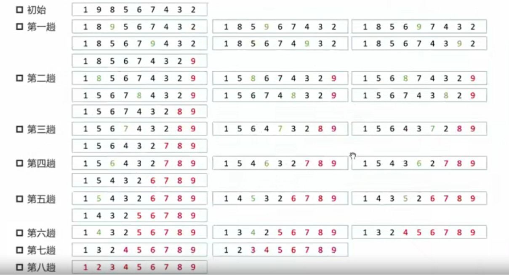
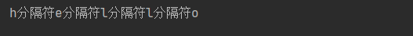
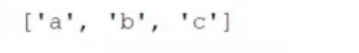
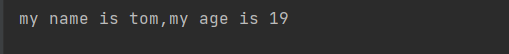

# 七、元组


元组一旦创建不可变，元组是不可变容器，列表可变，


```
t1 = 1,2    逗号分隔的表达式被封装成元组

t2 = (1,2)  直接定义为元组

()    一个空元组

t3 = tuple()  使用 tuple类的构造函数

t4 = (1,2,[1,2]) 有初始值的元组

t5 = (5)   这是创建数值5，而不是创建元组
t5 = (5,)   这是创建一个元素的元组，注意后面的逗号

tuple(可迭代对象) 
t6 = tuple([1,2,4])   得到 (1,2,4)

t7 = tuple(range(10))  得到(0,1,2,3,4,5,6,7,8,9)
t8 = tuple(5) 这是错的，括号内部必须写可迭代对象


t9 = (1,2)* 5  得到 (1,2,1,2,1,2,1,2,1,2)
t9 = (1,)* 5  得到 (1,1,1,1,1)

t10 = ([1])*5  还是没有讲清楚创建的是元组， 这种写法会省略括号，创建 [5,5,5,5,5]  列表
t11 = ([1],)*5   创建元组 ([1],[1],[1],[1],[1])   注意单元素元组的逗号

```


```
t3 = ()
t4 = tuple()
t3 == t4   内容是相等的  True
t3 is t4   是同一个地址  True
对于某些元组的某些东西会进行优化因为不一定要创建两个


列表中
t3 = []    内容是相同的  True 
t4 = list()是不同地址    False
```


企图修改元组中的元素 t[10] = 90  直接报错    

对于元组来说，增删改全是不行的，一旦创建好元组就不允许改变。 

```
t11 = ([1],)*10
t11[1][0] = 100  
t11 变为 
```


对于存储在元组中的引用类型，不可修改是指**地址的值不能修改**，但是内容可以更改

​	t11 = ([1],)*10 就是把 同一个列表 [1]  的地址的值复制10 份放到元组中。所以改 t11\[1][0] 所有的值都修改了


元组比列表安全，比列表更轻巧


查询

```
1 in t7      1 在 t7中吗
t7.index(1)  1 从左往右第一次出现的索引
t7.count(1)  计数 1 出现的次数
这三个 事件复杂度 都是 O(n)
```

 


# 八、冒泡排序

相邻两个元素两两比较，每一轮下来只有一个数排好了，前面的数不一定是排好的。

冒泡法是**交换法排序**。如果是升序，那就是每一轮把大数往最大的位置推过去


冒泡法是最简单的交换排序



升序排序，每一趟只解决一个最大的数

初始给到的区域都是无序区，每一趟增加一个有序区域


蓝色无序区，红色有序区

下一趟排列不再关系有序区域的元素。

第几趟结束有序区中的元素就有几个


外层循环，确定趟数


内层循环，确定无序区边界


# 九、字符串


## 初始化


## 索引


字符串中没有其他语言中的 char 类型。python 中单个字符也是字符串

索引的 可正也可负


## 连接


+和join **返回的都是全新的字符串，全新的就是新的字面量，原来的字面量并没有被修改**


```
'a' + 'b'  得到 'ab'  原来的 a 和 b 都没有被修改，新的字面量 ab 生成了
```


join 可以拼接字符串类型，也可以拼接出来是字符串类型的可迭代对象


```
t2 = "分隔符".join("hello")
print(t2)
```




```
t2 = "分隔符".join(["hello","world","food","good"])
print(t2)
```


字符串也是可迭代对象

所以 tuple('abc') 和 list('abc') 都是可以的

```
''.join(range(5)) 会报错，join本身不能拼接非字符串类型
可以写成
’'.join(map(str,range(5)))
```


## 字符查找

index 和 count 都少用，都需要遍历

count尽量少用，找子串是很难的算法题


字符串.index(子串) 寻找首次出现的子串的索引

```
x = '\n'.join('1234')
x = '1\n2\n3\n4'  这个字符串长度是 7
x.index(1)  // 直接报错，找的是数值1，找不到，字符串里只有字符串1
x.index('1') // 返回索引 0
x.index('12') // 报错找不到
x.index('\n4') // 能找到

```


字符串.count(字串)，寻找该字串出现的次数

前包后不包


```
x = '1\n2\n3\n4'  // 长度为7   x = r'1\n2\n3\n4' 长度为 10    
x.count('\n') 得到3
x.count(r'\n') 得到0

```


字符串.find(子串)   从左往右找找索引

字符串.rfind(子串) 从右往左找找索引

find 和 rfind 不会像 index 方法一样找不到返回异常。找不到就返回负数，返回负数代表没找到。

find 和 rfind 只要找到了就返回正索引

find 和 index 本质上是一样的。 


字符串.find(子串,寻找的起始位置,寻找的终止位置)，find 可以指定查找范围。其中寻找的终止位置可以不写表示直到结尾。

寻找范围 [寻找的起始位置，寻找的终止位置)。


字符串一旦定义以后就不能改变了，因为字符串是字面量不可修改


## 分割


字符串名.split(分隔符)   立即返回一个列表，其列表为被字符串切割后的版本。

```
a = '1,2,3,a,b,c'
a.split(',')
```


```
a = '1,2,3,a,b,c'
a.split('3')
```


```
a = '1,2,3,a,b,c'
a.split()
```


```
b = '\n\t\r\n a\nb\tc\t\n'  #换行符，空格，tab统称为 space空白字符
b.split()
```



把所有空白符全部删去了。

split不加参，开头结尾不会多出空串，切割的方式是：尽可能长的空白字符一刀切掉  \n\t 放在一起也是一刀切掉


```
b = '\n\t\r\n a\nb\tc\t\n'
b.split('\n')
```


列表最前和最后是空串，如果原本字符串最前面或者最后面恰好被切割，那么就会导致前和后空串的出现


rsplit 从右往左切


指定最大切割数，就是指定最多切多少刀，切到指定数量后就不切了


splitlines  按照切割符  \r   \r\n   \n   进行切割


partition 返回的是字符串被切割后的形式，元组形式(非惰性)。而且这个元组肯定是 3个部分

分隔符前面，分隔符，分隔符后面


如果这个分隔符完全没找到，会在字符串最后来一刀


## 替换


python 中的字符串替换不是就地修改，而是返回新的字符串

不支持模式匹配，放在 regex 中

字符串.replace(要替换的,替换后的,最多替换的次数)  最后一个参数可以不写


处理过的索引位置不再处理


## 移除

字符串.strip()   将两端的空白字符拿去 空白字符包括 \n \t 和空格 。别的语言是 trim

字符串.strip(指定字符(串))  只要该**字符串两端**有指定字符串中的字符，就删去，一直删到两端没有为止

```
字符串.strip('hello')  意思是，对字符串两边找有没有 h e l l o 这 5 个字符，如果有就删去，没有就停止
要把参数的字符串当成字符来看
```

对字符串左边进行 strip 操作

字符串.lstrip() 

字符串.lstrip(指定字符(串))

对字符串右边进行 strip 操作

字符串.rstrip()

字符串.rstrip(指定字符(串))


注意：strip 后生成的是全新的字符串，原来的字符串没有改变，因为python中字符串是字面量常量


## 首尾判断


字符串.startswith(某个字符串)  字符串是否以参数的字符串开头

字符串.endswith(某个字符串)   字符串是否以参数的字符串结尾

两个方法都返回 bool 值。

两个方法效率都很高。挨个字符比较，如果发现不一样就结束


字符串.startswith(某个字符串,index,stop)  从index处开始比较，到 stop 停止  ，注意前包后不包

 endswith也是


## 其它函数


## 格式化字符串

### c风格printf style

格式:  "有占位符  %d %s % f"  %占位符一一对应的值，只能使用元组  (值1,值2....) 

占位符和值依次对应

```
print("my name is %s,my age is %d"%("tom",19));
```




还有使用字典的方式

```
print("my name is %(name)s,my age is %(age)d"%{'name':'tom','age':19})
```


更多使用 f 字符串 格式化插入


### format函数


"{} {} {}".format(值)

如果 {} 里面没有 索引，那就是从左往右的顺序依次填入

如果 {} 里面有索引，那么 format 括号里的值，就会被分配索引，从0开始，填到对应位置里去

如果 format() 里面还可以指定值。

```
print("{} {} {} {}".format(0,1,4,9))  // () 里的数按顺序填入
                                
print("{0} {4} {2} {3} {1}".format(100,200,300,400,700)) // 100 是 索引0  200 索引1  300 索引2 400 索引3  700 索引 4，依次填入对应位置

print("{a} {b} {c}".format(a = 100,b = 200, c = 700))
```


```
print("{0} {0[0]}".format((1,12)))
```


参数结构


格式化日期字符串


```
"{:<5.1f}".format(1.23456)
'1.2  '  <表示左对齐，     默认是右对齐
```


为了保证精度，宽度可以被撑破


:2f 表示 宽度为2，但是默认是小数点后6位，所以宽度被撑破了


10表示宽度 ， 3 表示 小数点后 3 位， %就被添加到最后


```
print("{:m<7}".format(30))
print("{:m>7}".format(30))
print("{:m^7}".format(30))
30 是 format 括号内的参数
 ^ 30居中对齐 ，其余的地方用 m填充
 < 30左边对齐，其余的地方用 m填充
 > 30右边对齐，其余的地方用 m填充
```


## 作业


# 十、编码和解码


编码： 字符串  转化成 二进制 

把一个 字符串类型 encode 就对其进行编码，其得到的类型是 bytes 类型。

使用 decode 把一个 bytes 类型的数据进行解码 得到字符串类型的数据


decode 默认解码是 UTF-8    encode 默认编码方式是 UTF -8  

编码方式和解码方式要相同，否则就是乱码


**python 3中字符串使用的是 unicode**


gbk 一个汉字 两个字节     utf-8 一个汉字 三个字节

## ASCII


ASCII 是 **单字节**编码系统   0 到  255 一共 256 种状态。


编码表就是数值到字符的映射关系


<font color=red size=4>字符放入内存中的结果是:对其查表，把表中对应这个字符的整数存储在内存中。</font>

```
b = '\x00' 这是 None 字符
```

c语言中，字符串尾部都有结束符，就是 null 字符，abc 长度 3，字节数为4

```
b = '\x20'  这是空格
```


```
c = 1   存储方式 :  00000001 二进制形式
c = '1'  存储方式 : 十六进制 31 
```


字符串的比较方式就是每一个字符依次比较，字符比较就是通过 ascii码 值进行比较


ASCII 是最早的，通用的编码表。


UTF-8 和 GBK 都兼容了 ASCII。


gbk 是双字节系统，兼容ascii码，这台电脑的windows系统就是 ascii 编码。 

unicode  iso 兼容ASCII ，完成用双字节把全世界已知字符装进去。

2个字节 可能是 gbk 编码表，也可能是 unicode 编码表


unicode 的问题是浪费空间，ascii 的 部分都只要一个字节就行了，但是它依旧需要两个字节。

为了适应网络传输，且收录所有字符，就出现了 适合网络编码的，其中一种标准是 utf - 8 ，是在 unicode 基础上演化来的。

它是变字长表示。**能用 1 到 6 个字节表示一个字符。** 

utf - 8 种，ascii 是1字节。 中文字符绝大多数是3个字节。


字符在内存中的存储是要查表，用某个整数进行映射，这个整数是几个字节，如果是 ascii 是1字节，unicode 和 gbk 是 2 字节

unicode 是 1到6字节不确定，具体需要查表来知道是什么整数作为该字符的映射，然后把这个整数存储到内存中。


# 十一、字节序列


## bytes


```
b1 = bytes()  #空字节，不可变类型，不可修改

b3 = bytes(5) #初始化字节序列，全是 null \0x00元素

b4 = bytes('abc','utf-8')
b4 = b'abc'
b4 = 'abc'.encode(gbk)  
b4 = 'abc'.encode()
// gbk 和 utf-8 对ascii的部分都是兼容的

b5 = bytes(range(0,10))
b6 = bytes(range(0x30,0x3a))

```

通过索引访问，返回的是本字节对应的**十进制数**


### 类方法构造


没有 bytes 对象， 用 bytes 中的一个方法来构建 bytes 对象(不通过构造器)，写字符串的十六进制表达

用字符串的十六进制表达构建一个 bytes。空格可写可不写，会自动进行区分。


在已有的 bytes 对象上再调用它的 hex()方法，还原出它的字符串


## bytearray

类似于 list数组

和 bytes 最大的区别是 可变的。

可使用索引把值进行修改，但是赋值必须使用整型


b 前缀用来表示 bytes 类型了， bytearray相当于一层包装。加在最前面

bytearray(b'abcde')    表示 bytearray 类型。


```
b = bytearray()
b.append(99)
b.append(97)
print(b)
b.insert(1,98)
print(b)
b.extend([65,66,67])
print(b)
b.remove(66)
b.pop()
print(b)
b.reverse();
print(b)
```


# 十二、字节序

对于多字节数据存储需要考虑大端模式和小端模式


大端模式：数据的低位(尾巴)存储在低地址端，就是小端模式

大端模式：数据的低位(尾巴)存储在高地址端，就是大端模式

对于整型数据 1 ，其存储方式是 00000000  00000001    高位部分是 0 多的那一边，低位部分是 1 的那一边


python 中的字符串是大端模式，大多数语言中字符串都是大端模式。


byteorder 只有 'little' 和 'big' 两种类型字符串作为值

```
a  = 0x616263
print(a)
print(hex(a))

print(int.from_bytes(a.to_bytes(6,'big'),'big'))
print(a.to_bytes(6,'little'))   # 整型用小端模式展现
print(a.to_bytes(6,'big'))      #整型大端模式展现

```


# 十三、切片

## 线性结构的共同特征


range  也是线性结构，但是是惰性线性结构，只能够迭代一遍


## 切片


切片：拿一部分你想要的结构

<font size=6>前包后不包</font>

<font size=6>切片的结果是保持本类型不变</font>

```

x 是列表

x[0:] 从头到尾全部

x[1:] 把第一个去掉

x[0:-1] 把最后一个去掉

x[1:-1] 掐头去尾

```


## 切片本质

把切片取出来合成本类型的对象。

切片之后返回的是全新的本类型对象。

通过 内置函数 id 获取其地址都不一样了


```
x = [1,2,3,4,5]
y = x[:]
x == y # true
x is y # false
```


<font size=6>切片是浅拷贝，把你需要的元素进行复制再重新组装</font>


## 切片赋值


