](https://www.w3school.com.cn/html/index.asp)


# HTML基本标签1

```
<!DOCTYPE html> 文档类型的声明，让浏览器按照相应版本的HTML进行解析
html：网页的根标签，所有其它标签都被它包含
head：头部标签，关于网页的一些配置信息 <meta charset="utf-8">字符集设置或者编码设置
```


<meta>单标签

```
<meta>单标签
<html> </html> 双标签
<meta charset="utf-8"> 指定浏览器按照utf-8的形式解析网页
<body></body>中书写会直接展现到用户面前的信息
<head></head>中书写一些告诉浏览器的配置信息
```


## 注释

<!-- 注释的内容 -->

对选中的文本 按 ctrl +/ 快速加注释，再按 ctrl + / 取消注释

## 标签的属性

属性名 = 属性值

每个标签都有其属性，其是键值对的方式，键(属性名)是唯一的，值(属性值)可以有多个

对于双标签

```
<标签名 属性名1 = 属性值 属性名2 = 属性值,...>  <标签名/>

比如
<人 身高 = 196 体重 = 75> <人/>
```

对于单标签

<标签名 属性名1 = 属性值,属性名2 = 属性值,...>  


## 单双标签


## 标签的关系

ctrl + k 控制标签缩进层级关系

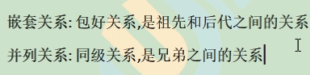

## seo搜索引擎优化


keyword关键字  description描述

```
<meta name = "keyword" content="你好,世界,你好世界"/>
<meta name = "description" content ="一所双非大学">
```


## 标题标签

```
<h1></h1>  到 <h6></h6>
```

hbuilder中输入 h1 到 h6 再按tab即可

## 换行标签

```
<br>
```

自结束标签    

## 段落标签

```
<p> </p>
```

一个段落会自动换行

## 水平线标签

```
<hr>
```

## 字体标签

```
<font></font>
```

## 图片标签

自结束标签

```

```

其属性

1. src 属性：指示图片资源的路径。其值写的是图片资源的路径

   如果图片和要引入该图片的网页资源在同一路径(同一文件夹)下，那么src的值就是图片的名称

   同一路径

   

   mm.jpg 和 t1.html 在同一路径下

2. width 属性

   网页中的基本单位是像素 px

   width 图片的宽度，单位是像素，px可写可不写，但都是指像素。

   ```
   <image src = "mm.jpg" width=500>
   ```

   当分别设置图片的宽度或者高度，图片的宽高(没有被控制的一方)会设置成等比例缩放。

3. border属性 图片的边框属性，设置**图片边框的宽度**

   ```
   <image src = "mm.jpg" width=500 border = 5>
   ```

4. title属性 提示文本，当鼠标悬停在图片上时，会显示的文本

   ```
   <image src = "mm.jpg" width=500 border = 5 title = "你好世界">
   ```

5. alt 属性 替换文本，如果这个图片没有加载成功，会显示提示文本以代替，如果图片加载成功就没有这段文字

   ```
   <image src = "1mm.jpg" width=500 border = 5 title = "你好世界" alt = "图片加载失败">
   //其中，src路径的图片是不存在的
   ```

   

### 路径

路径忽略大小写


路径是网页(html文件)和其他文件(其他资源文件，要引入的)的位置关系

路径有 相对路径 和 绝对路径

#### 相对路径

从自身位置开始去相对的寻找

例子：


相对路径有三种

1. <font size=4>同级相对路径</font>，是指网页和资源文件在同一目录下

   在上图中，mm.jpg 和 t3.html 是同级相对路径，t3.html想引入 mm.jpg资源，其 src 写 mm.jpg即可。

   ./表示在当前目录下

   

   也可以写成 src = "./1mm.jpg"

2. <font size=4>下一(多)级相对路径</font>，是指网页和资源文件的文件夹在同一目录下，而资源文件所处的位置更加深

   在上图中,mm.jpg 相对 t1.html来说是下一级相对路径，需要顺着其所在文件夹找进去(需要准确的写出进入的文件夹的名字，有几层写几层，从当前html文件的位置**往深处找**)

   

   

3. <font size=4>上(多)一级相对路径</font>，本身html文件所在位置比较深，而资源文件比较浅，要回到资源文件所在的浅的位置所在的文件夹

   <font color=red size=5>路径中，每一次 **../** 就表示往上一级</font>(当前目录所在的上一级更浅的位置的目录),要跳出几层就写几层../

   比如 t2.html 访问 mm.jpg

   

   

   

   

混合使用路径.html 引用 mm.jpg资源文件


分析：先往上一级，然后再往下深入


#### html中外部引入css时的相对路径和内联css的相对路径

如果css代码就写在html文件中，那么相对路径的起始点就是该html文件。

**如果css代码是单独写成.css文件然后再引入到.html文件中，那么相对路径的起始点是这个.css文件**


#### 绝对路径

绝对路径就是从盘符文件开始，文件在磁盘中的位置

出于安全的考虑，浏览器不能直接通过绝对路径访问磁盘中的文件

前端的资源(网站)全是暴露在外面，其资源能够通过网络的地址(网站的绝对地址)来获取(访问文件)。后台的东西(服务器)是编译之后的，看不懂。

网站就是服务器上一个文件夹有前端的文件有后端的文件。而前端的东西完全都可以拿到


使用绝对路径是在和网站交互的时候。


## 超连接标签

超连接标签是双标签

```
<a>  这里可以是文字或者图片 </a>
```

a标签的属性

1. href 网页的路径  href = "要跳转的网站的路径" 这里也要用到绝对路径相对路径  相对路径绝对路径都可以

   

2. target属性 其值有两种  _self 和 _blank  。_self 是默认值(不设置target属性的时候自动提供)，从当前选项卡直接跳转到目标页，\_blank 重新打开一个选项卡跳转到目标页

   target = "_self"

   

   始终跳转在同一页面

   target = "_blank"

   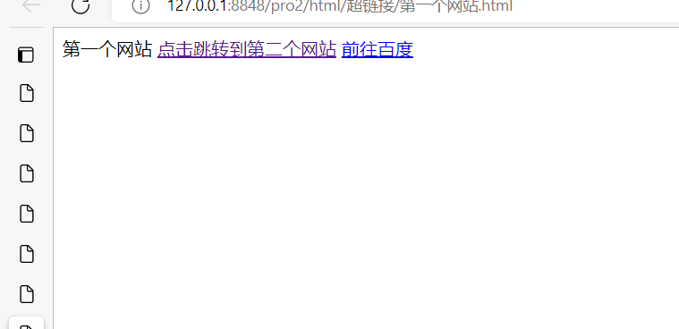

   选项卡变多

   

### 空链接

<a></a>标签的href 写"#" 表示会跳转到顶部，如果没有想好跳到哪个网页就这么写

写"##"表示点击不进行任何操作


### 锚点跳转

进行页面内部跳转

href = "#id值" 表示你要跳转到哪个标签去

需要提前给标签指定id属性的值。


要跳转的属性值


效果


点击后


## body标签

<body></body> 其内部包含要呈现给用户的信息

其属性

1. bgcolor = 指定颜色 

2. background = 要选择作为背景图片的路径。

   背景图片和图片标签的区别是，背景图片不作为body内部的标签，不占位置，**而是沉在所有文字和图片的最下面**

   


## 列表

列表分为无序列表、有序列表

### 无序列表

这种带左边小点的一列下来的


无序列表ul标签

```
<ul></ul>
```

无序列表的项li标签

```
<li></li>
```

**ul标签内部只能包含li标签**

**li标签内部能包含其他标签**

```
<ul>
	<li>
	....
	</li>
	<li>
	....
	</li>
	<li>
	....
	</li>
</ul>
```


### 有序列表

随着个数的增长增长

有序列表ol标签

```
<ol></ol>
```

有序列表的项li标签

```
<li></li>
```


```
<ol>
	<li>
	</li>
	
	<li>
	
	</li>
	<li>
	
	</li>
</ol>
```

ol标签内部只能包含li标签

**li标签内部能包含其他标签**

### 自定义列表

自定义列表dl标签

```
<dl></dl>
```

自定义列表的项dt 和dd

dt是主题，dd是列表项

dl 只能包含 dt 和 dd，dt 和 dd 可以包含其他标签

```
<dl>
	<dt>
	</dt>

	<dd>
	</dd>
	
	<dd>
	</dd>
	
	<dd>
	</dd>
</dl>
```

这些都是自定义列表


```
<!DOCTYPE html>
<html>
	<head>
		<meta charset="utf-8">
		<title></title>
	</head>
	<body>
		<ul>
			<li>
				<h1>你好世界</h1>
			</li>
			<li>
				<h2>你好世界</h2>
			</li>
			<li>
				<h3>你好世界</h3>
			</li>
			<li>
				<h4>你好世界</h4>
			</li>
			<li>
				<h5>你好世界</h5>
			</li>
		</ul>
		
		<ol>
			<li>
				<h1>你好世界</h1>
			</li>
			<li>
				<h2>你好世界</h2>
			</li>
			<li>
				<h3>你好世界</h3>
			</li>
			<li>
				<h4>你好世界</h4>
			</li>
			<li>
				<h5>你好世界</h5>
			</li>
		</ol>
		
		<dl>
			<dt>
				<h1>向世界问好</h1>
			</dt>
			<dd>
				<h2>你好世界</h2>
			</dd>
			<dd>
				<h3>你好世界</h3>
			</dd>
			<dd>
				<h4>你好世界</h4>
			</dd>
			<dd>
				<h5>你好世界</h5>
			</dd>
		</dl>

	</body>
</html>
```


## 表格

```
<caption></caption>表格的标题
<table></table>是表格  table标签管理表格
<tr></tr>   tr表示行标签，表格的一行
<td></td>   td表示列标签，算作表格的列(多个单元格组成一行)，
表的一列是以当前一列的单元格中最宽的一个为基准
<th></th> 表头标签(放在tr标签内)  表头标签的文本会在单元格中水平居中，加粗
```


**table属性(table有些属性赋值同时会控制其所有的子标签(所有的单元格))**

1.  有border 属性，设置表格边框
2. width height 设置宽度，高度
3. cellspacing 设置表格中相邻单元格的边框的间距为多少


**td属性**(很重要)

1. colspan 表示当前单元格要占几列
2. rowspan 表示当前单元格要占几行

**td和tr和table 的公共属性**

1.align属性，控制文本在表格中的位置，可以加在 table tr td 上，

- align 加在table标签上，只控制table表格在父容器(容纳了table表格的容器)中的位置。
- align 加在 tr 标签上，会把这个属性加在tr的内的td上，即作用于该行所有单元格。
- align 加在 td标签上，控制当前单元格文本居中。

align = "center"文本居中 align = "left" 左   "right"右

2.bgcolor 控制 表/行/单元格的颜色


```
<!DOCTYPE html>
<html>
	<head>
		<meta charset="utf-8">
		<title></title>
	</head>
	<body>
		<table border="1" height="300" width="600" align = center cellspacing = "0">
			<caption>
				<h1>课程表</h1>
			</caption>
			<tr align="center" bgcolor="red">
				<td >日期</td>
				<td colspan = "5">课程</td>
				<td colspan = "2">休闲</td>
			</tr>
			<tr align="center" bgcolor="yellow">
				<td>星期</td>
				<td>星期一</td>
				<td>星期二</td>
				<td>星期三</td>
				<td>星期四</td>
				<td>星期五</td>	
				<td>星期六</td>
				<td>星期日</td>
			</tr>
			<tr align="center">
				<td rowspan = "4">上午</td>
				<td>语文</td>
				<td>数学</td>
				<td>物理</td>
				<td>化学</td>
				<td>生物</td>	
				<td>电竞</td>
				<td rowspan = "4">休息</td>
			</tr>
			<tr align="center">
				<td>语文</td>
				<td>数学</td>
				<td>物理</td>
				<td>化学</td>
				<td>生物</td>	
				<td>电竞</td>			
			</tr>
			<tr align="center">
			
				<td>语文</td>
				<td>数学</td>
				<td>物理</td>
				<td>化学</td>
				<td>生物</td>	
				<td>电竞</td>		
			</tr>
			<tr align="center">	
				<td>语文</td>
				<td>数学</td>
				<td>物理</td>
				<td>化学</td>
				<td>生物</td>	
				<td>电竞</td>	
			</tr>
			<tr align="center">
				<td rowspan="2">下午</td>
				<td>语文</td>
				<td>数学</td>
				<td>物理</td>
				<td>化学</td>
				<td>生物</td>	
				<td>电竞</td>
				<td rowspan = "2">休息</td>
			</tr>
			<tr align="center">
				
				<td>语文</td>
				<td>数学</td>
				<td>物理</td>
				<td>化学</td>
				<td>生物</td>	
				<td>电竞</td>		
			</tr>
		</table>
	</body>
</html>
```


## 表单


这些要我们提交信息的都是表单，用于获取客户信息的


### form标签

```
<form></form>
```

form标签，如果希望一个表单标签被提交(给后台)，那么该表单标签必须放在form标签内

form标签的属性

- action  ，表示要把表单提交到哪个地方(提交目的地是服务器后台的网址)，这个属性的值是路径
- method 提交的方式，有 get 和 post 两种方式

### label标签

```
<label></label>
```

文本标签，就是标签显示的作用

label标签的属性

- for 属性，for = "指向标签的id"，该标签被点击后，for指向的标签的id就会获得焦点，如果 input 的文本框，那么文本框会获得焦点，如果是 input 的 按钮，那么按钮会被选中。使用前要给被指向的标签设置id值。

### input标签(很中要)

```
<input>
```

输入标签，就是供给用户进行交互和获取用户信息的。

input 标签的属性

- type属性，用于指定这是什么元素，可以取text(默认值),password,radio,checkbox,button,submit,reset

  - type = "text"

    这也是默认值(如果不设置type值默认)，此时该标签代表一个文本框

  - type = "password"，该标签代表密码框，输入的内容加密

  - type = "radio" ，该标签代表单选框。

  - type = "checkbox",该标签代表复选框。需要结合name属性使用

  - type ="submit"，该标签代表普通按钮。需要结合name属性使用

  - type = "submit"，该标签代表提交按钮，把当前表单中输入的所有数据提交

  - type = "reset"，该标签代表重置标签，把当前表单中已经输入的所有数据全部清空，或者恢复默认值

  - type = "hidden"，表示隐藏域

- name属性，如果这一项需要被提交，那么必须设置name属性，否则后台接收不到

  name属性作用于单选按钮，可以设置其单选性

- checked属性，作用于 type 是 单选框和多选框的时候，设置初始选中的选项是什么

- value属性，type 是 按钮的时候(button reset submit)，设置按钮的值是什么

### select标签

```
<select></select>
```

下拉菜单

下拉组属性


其内部标签有下拉项 option 和下拉组 optgroup

- option 下拉项

  ```
  <option></option>
  ```

  

- optgroup 下拉组

  ```
  <optgroup>
  	<option>
  	</option>
  	
  	<option>
  	</option>
  	
  	<option>
  	</option>
  	
  	<option>
  	</option>
  </optgroup>
  ```

  下拉组有属性 label 表示下拉组<optgroup></optgroup>标题


```
<select>
	<option>日本</option>
		<optgroup label="欧洲">
			<option>意大利</option>
			<option>法国</option>
			<option>德国</option>
			<option>匈牙利</option>
		</optgroup>
</select>
```


### textarea标签

```
<textarea></textarea>
```

表示文本域


# HTML基本标签2

## 8个修饰字的格式的标签


左边4个和右边4个**显示形式**上是一样的，但是右边4个具有语义

上图中，右边的4个更具有语义，爬虫会根据语义标签获取文本信息

右边4个常常用于文本

语义化标签就是，该标签的名字能反映它的作用，比如 strong，就是组装的英文

## 特殊字符标记


# ----------------分割线---------------


# Chrome浏览器调试CSS

页面右键检查


左边是样式，右边是原码(html css)

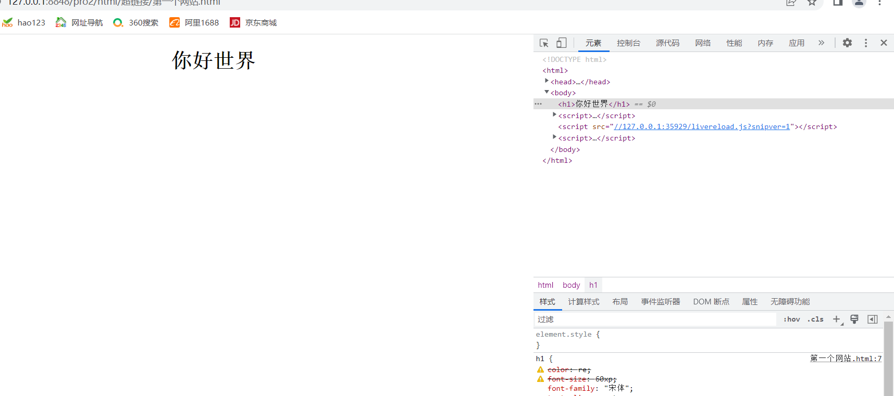

1. 样式 style 中出现叹号表示属性或其值出现语法错误

   

2. 即兴调试，打勾，设置哪些属性是否起作用

   

   

   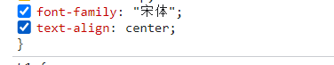

   

   也可以对属性进行临时修改

   

   但是这些修改不会对页面进行影响，刷新就回来了

3. 标签选择器{    }           出现问题

   


浏览器默认字号 16

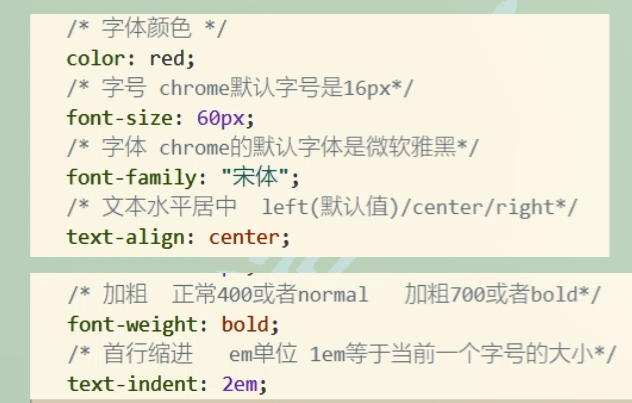


# 设置颜色的方式


# 盒子基本三属性

- 盒子就是标签，该标签在网页中呈现出盒子的样子。
- 盒子基本三属性就是标签的基本三属性
- 网页都是大大小小的盒子组成
- 盒子内部有 ul ，表单，表格等一系列元素


div标签就是没有语义的盒子

```
<div></div> 
```


div标签的三个属性 宽度 高度 背景色

```
<head>
		<meta charset="utf-8">
		<title></title>
		<style>
			div{
				/* 三属性 设置高度 宽度 背景色 */
				height:200px;
				width:200px;
				background:#FF0000;
			}
		</style>
	</head>
	<body>
		
		<div></div>


	</body>
```


# 显示模式

有的标签横着排，有的标签竖着排


div是块级显示模式

**块级显示模式**

- 独占一行

- 设置宽高起作用 height，width(

- 不设置宽度的时候和父元素一样宽

  html 和 body 也是 块元素，html 是 最大的

- 块元素有：html(我们不需要控制) body div h1到h6 p ul ol li dl dt dd hr form 


**行内显示模式**

- 一行有多个
- 设置宽高不起作用，尺寸由内容的文本决定
- 如果里面没有包裹任何文本，那么宽和高都是0
- 当行内元素有一个及以上的空格时，显示效果之间会有一个默认间距
- 行内元素有：span a b strong i em u ins s del
- 对齐方式是按照文本的下边线对齐


**行内块显示模式**

- 一行有多个
- 设置宽高起作用
- 行内块元素有 img 表单标签(select input .....)


# 显示模式转换

显示模式转换的属性

- **其他显示模式 **转换成 **行内块显示模式**：display:inline-block;

  ```
  	<head>
  		<meta charset="utf-8">
  		<title></title>
  		<style>
  			div{
  				/* 三属性 设置高度 宽度 背景色 */
  				height:200px;
  				width:200px;
  				background:#FF0000;
  				display:inline-block;
  			}
  			span{
  				height:200px;
  				width:200px;
  				background:#00FF00;
  				display: inline-block;
  			}
  		</style>
  	</head>
  	<body>
  		<div></div><div></div>
  		<span></span><span></span>
  	</body>
  ```

  

- **其他显示模式 **转换成 **块级显示模式**:display:block;


# 基础选择器

**标签选择器**

```
<head>
	<style>
		标签名1{
			属性:值;
			属性:值;
		}
		标签名2{
			属性:值;
			..
		}
		..
	</style>
</head>
```

标签名就是 div span 这一些


**类选择器**

- 定义类名称：.+类名称
- 标签中使用类名称： class = 类名称
- 类名称不能用数字开头，可以用字母和下划线开头。后面可以跟字母，数字，下划线，中划线。
- 类名用驼峰命名法：第一个单词首字母小写，第二个单词以及往后首字母大写

```
<head>
	<style>
		.类名1{
			属性:值;
			属性:值;
		}
		.类名2{
			属性:值;
			..
		}
		..
	</style>
</head>
<body>
	<div class = 类名1>
		
	</div>
	<div class = 类名2>
	</div>
</body>

```


```
<head>
		<meta charset="utf-8">
		<title></title>
		<style>
			.ni{
				font-size:100px;
				color:#00ff00;
			}
			.hao{
				font-size:200px;
				color:#00ffaa;
			}
			.shi{
				font-size:200px;
				color:#aabb00;
			}
			.jie{
				font-size:100px;
				color:#24ab01;
			}
			
		</style>
	</head>
	<body>
		<span class = "ni">你</span>
		<span class = "hao">好</span>
		<span class = "shi">世</span>
		<span class = "jie">界</span>
	</body>
```


## 多类名调用

标签的class属性写class = "类名1 类名2 类名3.."

需要重复用到的属性可以单独定义在一个类选择器中，然后多次进行调用，减少代码冗余

```
<head>
		<meta charset="utf-8">
		<title></title>
		<style>
			.ni{
				
				color:#00ff00;
			}
			.hao{
				
				color:#00ffaa;
			}
			.shi{
				
				color:#aabb00;
			}
			.jie{
				
				color:#24ab01;
			}
			
			.size100{
				font-size:100px;
			}
		</style>
	</head>
	<body>
		<span class = "ni size100">你</span>
		<span class = "hao size100">好</span>
		<span class = "shi size100">世</span>
		<span class = "jie size100">界</span>


	</body>
```


**id选择器**

- 定义id名称：用# + id 名称
- 调用id名称： id 属性 = id 名称
- id命名规范和类名是一样的
- 类名就像人的名字，可以重复调用，id名是人的身份证是唯一的。


id选择器和类选择器的区别

id选择器只能用于唯一标识某一个标签，不可重复。class选择器可以标识多个标签(用于标志某一类)。

id选择器在javascript中常用。


*{

}

就是选择所有标签


# CSS三种书写位置

- 第一种：内嵌式，是将css代码嵌入到html文件中，css代码和html代码相对分离，代码耦合度相对较低

  工作中偶尔使用，在将知识点时，为了方便会使用。

  

  

- 第二种：行内式，是将css代码写在html中，两种代码参杂在一起，代码耦合度很高，会有代码冗余，难以维护，在工作中偶尔使用

  

- 第三种方式：外联式，是将css代码单独写在css文件中，css和html绝对分离，代码耦合度极低，开发中经常使用。

  使用link标签，link标签中的 href 属性指定引入哪个css文件

  

  


# CSS层叠性

css层叠性：不同的属性的不同值都可以实现，但是会出现覆盖的情况

规律

- 相同属性的不同值相遇后

- 权重相同时后定义的会层叠(覆盖)先定义的

- 权重不同时，谁的权重高，实现谁的

  权重排序：标签选择器< 类选择器 <id选择器 <行内样式 <!important

  !important 是用于修饰属性，形容该属性非常重要，单独加在一个属性最后面。

权重值小的范围越大。

权重值高的范围越小。


```
<!DOCTYPE html>
<html>
	<head>
		<meta charset="utf-8">
		<title></title>
		<style>
			div{
				color:red;
			}		
		</style>
	</head>
	<body>
		<div>我是div1</div>
		<div>我是div1</div>
		<div>我是div1</div>	
	</body>
</html>
```


```
<!DOCTYPE html>
<html>
	<head>
		<meta charset="utf-8">
		<title></title>
		<style>
			div{
				color:red;
			}
			.cls1{
				color:blue;
			}
		</style>
	</head>
	<body>
		<div class = "cls1">我是div1</div>
		<div>我是div1</div>
		<div>我是div1</div>
		
	</body>
</html>
```


```
<!DOCTYPE html>
<html>
	<head>
		<meta charset="utf-8">
		<title></title>
		<style>
			div{
				color:red;
			}
				
			div{
				color:blueviolet;  -- blueviolet 覆盖了 red 
			}
			.cls1{
				color:blue;
			}
			#one{
				color:yellow;
			}
		</style>
	</head>
	<body>
		<div class = "cls1" id = "one">我是div1</div>  id 比 类 权重高，先生效
		<div class = "cls1">我是div1</div>
		<div>我是div1</div>
		
	</body>
</html>


```


上面的代码中 第二个div块的color 属性修改成 !important 修饰，那么瞬间最高权重


```

		-- 一个标签引用多个类的时候，决定的依旧是类在 style 标签中定义的顺序，而不是引用的顺序，也没有什么引用的顺序

<!DOCTYPE html>
<html>
	<head>
		<meta charset="utf-8">
		<title></title>
		<style>
			.cls1{
				color:blue;
			}
			
			
			.cls2{
				color:black;
			}
		</style>
	</head>
	<body>
			-- 一个标签引用多个类的时候，决定的依旧是类在 style 标签中定义的顺序，而不是引用的顺序，也没有什么引用的顺序
			id 值也同理
		<div class = "cls1 cls2" >我是div1</div>
		<div class = "cls1">我是div1</div>
		<div>我是div1</div>
		
	</body>
</html>

```

一个标签引用多个类的时候，决定的依旧是类在 style 标签中定义的顺序，而不是引用的顺序，也没有什么引用的顺序


link 能够引入css 文件，该语句就是桥梁，相当于在head头中将该处语句替换成css 文件中写在 style块中的结果。

因此层叠效果依旧发挥作用


# text-align:center 的作用

text-align:center能让标签中的文本，行内元素，行内块元素水平居中。

如果希望文本，行内元素，行内块元素水平居中，要给它们的父元素设置 text-align:center


# 常用文本属性

- color:字体颜色

- font-size:字号    浏览器默认字号 16px

- font-family:字体  

  字体可以设置多个,用逗号隔开,按照顺序依次识别,如果全不识别的话,系统会使用默认字体

- text-align:left/center/right   设置文本水平居中

- font-weight:一个数值 或者 normal 和 bold    normal是400,也是默认情况 bold是700,加粗.

- text-indent:多少em  表示首行缩进多少字符,单位是em,1em等于当前一个字号的大小

  首行缩进很大的负值，让文本飞出屏幕外

  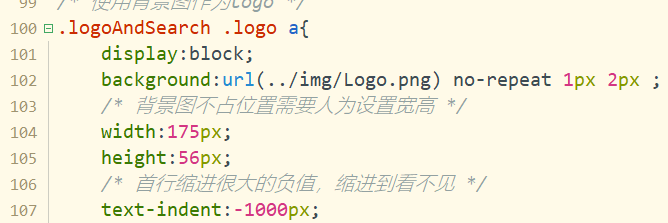

- text-decoration: underline  下划线出现  text-decoration: none 去除下划线 

- 强制换行属性： word-break:break-all;

- 强制不换行：white-space:nowrap

- 字间距：letter-spacing:0px


# 复合选择器

## 后代选择器

已知三种 id 标签 类

后代选择器是一种复合选择器：把三个基础的结合使用。

复合选择器本身也是基本选择器中的一种

语法

```
后代选择器 选择器 选择器 .....  (空格表示后代 ，第二个开始的选择器可以是三种基本选择器中的一种，子子孙孙)
```


后代选择器也具有权值

​		权签选择器 < 类选择器 <id 选择器 <行内样式 < !important 

 权值:       1                  10              100            1000              无穷大


后代选择器又称为包含选择器，可以选择父元素里面子元素。其写法就是把外层标签写在前面，内层标签写在后面，中间用空格分隔。当标签发生嵌套时，内层标签就成为外层标签的后代。

```
选择器1 选择器2 选择器3 ..{}
// 选择器1是祖宗级，选择器2是次祖宗级，依次往下
// 选择器1，2，3可以是 id 标签 类 选择器
```


```
<!DOCTYPE html>
<html>
	<head>
		<meta charset="utf-8">
		<title>
			
		</title>
		<style>
			.class1 .group1{
				color:red
			}
			.class1 .group2{
				color:blue;
			}
			.class1 .group1 #one{
				color:green;
			}
			.class1 .group2 #two{
				color:green;
			}
			
		</style>
	</head>
	<body>
		<div class = "class1">
			<div class = "group1">
				<i>学生1 </i>
				<i>学生2 </i>
				<i id ="one">学生3 </i>
				<i>学生4 </i>
			</div>
			<div class = "group2">
				<i>学生1 </i>
				<i>学生1 </i>
				<i id ="two">学生1 </i>
				<i>学生1 </i>
			</div>
		</div>
	</body>
</html>
```


### 一级后代选择器


父级选择器>子级选择器

- 父级和子级之间没有正好间隔，而是恰好相邻，就比如ul标签内部只能有li标签的临近关系
- 父级选择器和子级选择器可以是三种基本选择器 id class 和 标签


## 并集选择器

选择器1,选择器2,选择器3,.....{

​	属性

}

所有想要设置相同属性都这样放一起统一设置属性

```
<!DOCTYPE html>
<html>
	<head>
		<meta charset="utf-8">
		<title></title>
		<style>
			.box div,.box h1,.box span,.box a,.box #one{
				font:48px "宋体";
				color:red;
			}
		</style>
	</head>
	<body>
		<div class = "box">

			<div>你好世界</div>
			<h1>你好世界1</h1>
			<span>你好世界2</span>
			<a href="##">你好世界3</a>
			<h2 id ="one">你好世界4</h2>
		</div>
	</body>
</html>
```


## 清除标签默认样式

清除标签默认样式：标签会自带一些属性，需要对这些属性进行清0或者初始化工作。

第一种：星号是通配符，表示所有的html标签

```
*{
	属性设置
}
```


第二种,并集选择器，将用到的标签进行初始化，提高执行效率，在工作中使用

```
标签1,标签2,标签3,标签4...{
	属性设置
}
```

## 交集选择器

交集选择器，三个基本选择器两个连在一起中间不加空格 

使用格式

```
选择器1选择器2{

}
中间不加空格

也可以
选择器1选择器2选择器3选择器4....{

}
```

能够提权，很少使用


```
可以使用
后代选择器.普通选择器{

}

不能使用 
后代选择器.后代选择器{

}
这种无法识别

.one.current{

}
这种就是两个类选择器交集在一起
```


## 状态伪类选择器

```
选择器(id 标签 类 都可以) :状态{
	属性
}
```

就是设置状态的选择器


常见的状态：默认状态(什么都不做)和 hover 表示鼠标悬停在该标签上发生什么。

```
<!DOCTYPE html>
<html lang="en">
    <head>
        <meta charset="utf-8">
        <style>
			/* 伪类状态选择器 标签版本 */
		访问前状态
        a:link {   
        	font-size: 16px;
        	color: gray;
        	font-weight: 700;
        }
        访问后状态
        a:visited {  
        	font-size: 32px;
        	color: orange;
        	font-weight: 700;
        }
        悬停
        a:hover { 
        	font-size: 48px;
        	color: red;
        	font-weight: 700;
        }
        点击
        a:active {  
			font-size: 64px;
        	color: green;
        	font-weight: 700;
        }
		/* 伪类状态选择器 类版本 */
		.chao:hover{
			font-size:64px;
		}
		/* 伪类状态选择器 id 版本 */
		#one:hover{
			color:darkred;
		}
        </style>
    </head>
    <body>
      <div>  
	      <a href="#" >你好</a>   
	      <a href="#" >世界</a>   
      </div>
	  <div>
		  <span class = "chao">你好啊</span>
		  <span id = "one">可恶的</span>
	  </div>
    </body>
</html>
```

 默认

visited


hover 鼠标移动到该位置


active 点击下去


松开，又变成 hover


常见的状态就是 默认 和 hover(鼠标移动到该处)


指定让子元素做什么

.box .banner a:hover span  表示 当鼠标移动到 .box .banner a 这个元素的时候，其子元素 span 要做什么(属性做出什么改变)


# css继承性

```
<!DOCTYPE html>
<html>
	<head>
		<meta charset="utf-8">
		<title>
			
		</title>
		<style>
			.box{
				color:red;
				font-size:60px;
				width:600px;
				height:300px;
				background:pink;
			}
		</style>
	</head>
	<body>
		<div class = "box">
		   <!-- 以下3个标签的属性都继承自 box 的属性 -->
			<span>我是span</span>
			<i>我是i</i>
			<p>我是p</p>
		</div>
	</body>
</html>
```


chrome 检查中

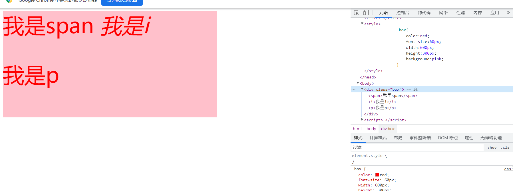

透明的属性表示没有继承自父属性中，透明的属性表示继承自父属性中。


标签可以继承父元素中修饰文本的属性


继承的权重是 0，就算父类中该属性被修饰了 !important，子标签中获取该属性后，该属性的权重是0

```
<!DOCTYPE html>
<html>
	<head>
		<meta charset="utf-8">
		<title>
			
		</title>
		<style>
			.box{
				color:red !important;
				font-size:60px;
				width:600px;
				height:300px;
				background:pink;
			}
			p{
				color: yellow;
			}
		</style>
	</head>
	<body>
		<div class = "box">
			<span>我是span</span>
			<i>我是i</i>
			<p>我是p</p>
			<!--  来自父属性，权重为0，p标签属性权重是1 -->
		</div>
	</body>
</html>
```


标签会默认自带一些css属性

- h标签默认设置了 font-size 和 font weight 等，继承的字号和加粗会被自身层叠

- a标签默认设置了 color 和 cusor ，继承的颜色被自身层叠了。


```
<!DOCTYPE html>
<html>
	<head>
		<meta charset="utf-8">
		<title>
			
		</title>
		<style>
			.box{
				color:red;
				font-size:60px;
			}
		</style>
	</head>
	<body>
		<div class = "box">
			<h1>你好1</h1>
			<h2>你好2</h2>
			<a href="##">你好3</a>
		</div>
	</body>
</html>
```


继承的属性各自被划去了


# 行高、行间距、文本的4条线

行高：设置文本在元素中垂直方向的位置，当盒子没有固定高度的时候，盒子的高度会随着行高的变化而变化，高度就是行高的值，因为文本始终要保持垂直居中于盒子。当盒子设置固定高度时，高度不会随着行高的变化而变化。

反推，当希望一个元素中的文本垂直居中于这个元素时，行高等于盒子(这个元素)的高度。


```
<!DOCTYPE html>
<html>
	<head>
		<meta charset="utf-8">
		<title></title>
		<style>
			div{
				line-height:30px;
				color:red;
				font-size:48px;
			}
		</style>
	</head>
	<body>
	/*div 盒子没有设置固定行高*/
		<div>
			文本
		</div>
	</body>
</html>
```


此时盒子高度没有固定，因此行高改变的时候，盒子的高度也会改变，盒子的高度必须保证 和 line-height 的值一样才能使文本垂直居中。


固定行高

```
<!DOCTYPE html>
<html>
	<head>
		<meta charset="utf-8">
		<title></title>
		<style>
			div{
				line-height:300px;
				color:red;
				font-size:90px;
				固定盒子高度300
				height:300px;
			}
		</style>
	</head>
	<body>
		<div>
			文本
		</div>
	</body>
</html>
```

height > line-height的时候，是偏盒子上方


height = line-height的时候，是偏盒子下方


height < line-height的时候，是正好垂直居中。


行间距是基线到基线的距离


行间距，基线到基线之间的距离。

多行的时候，line-height 也可以用于设置行间距，改变行间距的方式就是调节行高。

在不设置高度的时候，块元素的高度会随着 line-height 的改变而改变。把高度按照行数进行均分，让每一行都在对应一小块行高中垂直居中。


```
<!DOCTYPE html>
<html lang="en">
    <head>
        <meta charset="utf-8">
        <style>
			.cls1{
				line-height:50px;   
				行间距设置50
				background-color: yellow;
				height:300px;
			}
        </style>
    </head>
    <body>
      <div class = cls1>
		  <p>你好世界你好世界你好世界你好世界你好世界你好世界你好世界你好世界你好世界你好世界你好世界你好世界你好世界你好世界你好世界你好世界你好世界你好世界你好世界你好世界你好世界你好世界你好世界你好世界你好世界你好世界你好世界你好世界你好世界你好世界你好世界你好世界你好世界你好世界你好世界你好世界你好世界你好世界你好世界你好世界你好世界你好世界你好世界你好世界你好世界你好世界你好世界你好世界你好世界你好世界你好世界你好世界你好世界你好世界你好世界你好世界你好世界你好世界你好世界你好世界你好世界你好世界你好世界你好世界你好世界你好世界你好世界你好世界你好世界你好世界你好世界你好世界你好世界你好世界你好世界你好世界你好世界你好世界你好世界你好世界你好世界你好世界你好世界你好世界你好世界你好世界你好世界你好世界你好世界你好世界你好世界你好世界你好世界你好世界你好世界你好世界你好世界你好世界你好世界你好世界你好世界你好世界你好世界你好世界你好世界你好世界你好世界你好世界你好世界你好世界你好世界你好世界你好世界你好世界你好世界你好世界你好世界你好世界你好世界你好世界你好世界你好世界你好世界你好世界你好世界你好世界你好世界你好世界你好世界你好世界你好世界你好世界你好世界你好世界你好世界你好世界你好世界你好世界你好世界你好世界你好世界你好世界你好世界你好世界你好世界你好世界你好世界你好世界你好世界你好世界你好世界你好世界你好世界你好世界你好世界你好世界你好世界你好世界你好世界你好世界你好世界你好世界你好世界你好世界你好世界你好世界你好世界你好世界你好世界你好世界你好世界你好世界你好世界你好世界你好世界你好世界你好世界你好世界你好世界你好世界你好世界你好世界你好世界你好世界你好世界你好世界你好世界你好世界你好世界你好世界你好世界你好世界你好世界</p>
	  </div>
    </body>
</html>
```


如果同一块中的行内块或者行内元素中文本字体大小不一致，那么会出现上方空缺的情况，其原因是为了保持字体的基线对齐

```
<!DOCTYPE html>
<html>
	<head>
		<meta charset="utf-8">
		<title></title>
		<style>
			.box{
				height:41px;		
			}
			.box .a1{
				font-size:16px;
				background-color: aqua;
			}
			.box .a2{
				font-size:20px;
				background-color: #ff8500;
			}		
		</style>
	</head>
	<body>
		<div class = "box">
			<a class ="a1">一号</a>
			<a class ="a2">二号</a>	
		</div>
	</body>
</html>
```


# a标签导航(案例)

```
<!DOCTYPE html>
<html>
	<head>
		<meta charset="utf-8">
		<title></title>
		<style>
			.box{
			   /*text-align 和 line-height 属性设置在盒子属性中，用于让文本标签 a 继承*/
				text-align: center;
				line-height:30px;
			}
			.box a{
				width:100px;
				height:30px;	
				background:yellow;
				color:green;
				/* 转换成行内块 */
				display:inline-block;					
			}
			.box a:hover{
				color:orange;
				text-decoration: underline;
				background:yellowgreen;
			}
		</style>
	</head>
	<body>
		<div class = "box">
			<a href="##">导航</a>
			<a href="##">导航</a>
			<a href="##">导航</a>
			<a href="##">导航</a>
			<a href="##">导航</a>
		</div>
	</body>
</html>
```


# 复合属性

## 复合属性值font

```
font: 是否倾斜 是否加粗 字号(必填项)/行高 字体(必填项)


举例
font: italic 700 40px/500px "宋体"

该属性就代表
font-size:40px;
font-weight:700;
font-family:"宋体"
font-style:"italic"   font-style 的属性值有 normal 和 italic
line-height:500px;


当复合属性和单属性同时存在，要把单属性放在复合属性下方以此来利用css层叠性把复合属性中的没有设置的属性给覆盖掉
```


```
<!DOCTYPE html>
<html>
	<head>
		<meta charset="utf-8">
		<title></title>
		<style>
			.box{
				font:italic 700  40px/100px "宋体";
				font-style属性 italic值 被 normal值 覆盖
				font-style:normal;
			}
			
		</style>
	</head>
	<body>
		<div class = "box">	
		你好世界
		</div>
	</body>
</html>
```


## 复合属性值 border

```
border:粗细 样式 颜色


例子:
border:5px solid red;
可以分解为
border-width:5px; 
border-style:dashed;边框样式 属性值有 solid实线 dashed虚线 dotted点状线 
border-color:red; 	边框颜色


也可以指定border 之中任意一条边设置属性
border-left/border-right/border-top/border-bottom:粗细 样式 颜色
设置没有边框属性值就是 null

单属性一样要放在复合属性下面，实现层叠覆盖功能
```


边框的粗细是在块的基础大小(height 和 width)上的延展。

```
<!DOCTYPE html>
<html>
	<head>
		<meta charset="utf-8">
		<title></title>
		<style>
			.box{
				background: gold;
				width:100px;
				height:100px;
				border-left:5px solid red;
				border-top:10px dotted green;
				border-bottom:15px dashed blue;
				border-right:null;
			}
			
		</style>
	</head>
	<body>
		<div class = "box">	
		
		</div>
	</body>
</html>
```


## 复合属性 background

```
background: 背景色 背景图路径 平铺方式 水平位置 垂直位置


分解为
background-color: 颜色值 
background-image:url(图片的相对路径) 
background-repeat: 平铺方式属性的值    默认值:repeat平铺   repeat-x 水平平铺 repeat-y 垂直平铺 no-repeat 不进行重复
background-position:水平位置 垂直位置 、
水平位置可以写left right center，垂直位置可以写top center bottom 
两个值也可以写像素值，像素值是以左上角为坐标原点，纵向是y值，横向是x值，向右边为 x 正向，向下边为y正向。

背景图片会覆盖背景颜色
```

```
<!DOCTYPE html>
<html>
	<head>
		<meta charset="utf-8">
		<title></title>
		<style>
			.box{
				width:500px;
				height:500px;
				border:5px;
				
				background:yellow url(mm1.png) no-repeat 0px 0px;
			}
		</style>
	</head>
	<body>
		<div class = "box">
			
		</div>
	</body>
</html>
```


修改位置值以后


# 盒子模型


## 内边距

内边距 padding :设置盒子与内容之间的距离

当盒子设置内边距后，会撑大盒子的尺寸，为了保证盒子尺寸不变，又需要有内边距的效果，要相应的从盒子的宽高减去撑大的尺寸


盒子在网页中的尺寸 = content 区域(我们在块中设置的宽高属性 width 和 height) + padding 区域 + border 区域。

```
padding : 一个像素值    (设置上下左右 padding 都为这个像素值)

padding :第一个像素值 第二个像素值  (上下padding 为 第一个像素值  左右padding 为 第二个像素值)

padding :第一个像素值 第二个像素值  第三个像素值 (上padding 为 第一个像素值  左右padding 为 第二个像素值 下padding 为第三个像素值)

padding :第一个像素值 第二个像素值  第三个像素值 第四个像素值  (上padding 为 第一个像素值  右padding 为 第二个像素值 下padding 为第三个像素值  左padding为第四给像素值)
```


```
<!DOCTYPE html>
<html>
	<head>
		<meta charset="utf-8">
		<title></title>
		<style>
			.box{
				width:500px;
				height:500px;
				border:5px;
				padding:10px 15px 20px 25px;
				border-left 10px;
				border-right:20px;
				border-top:30px;
				border-bottom:40px;
				border-style: dashed;
				background-color: crimson;			
			}
			.box .phone{
				width:50px;
				height:100px;
				background-color: blue;		
			}
		</style>
	</head>
	<body>
		<div class = "box">
			<div class="phone">
				
			</div>
		</div>
	</body>
</html>
```


盒子 的 width 和 height 的属性只规定了其 content 区域的宽和高，而一个盒子显式的大小是有 content padding border 共同作用


```
height:41px;
background:#fcfcfc;
border-top:3px solid #ff8500
border-bottom:1px solid #edeef0
font-size:14px;

color:#4c4c4c;
text-decoration:none;
height:41px;
line-height:41px;
display:inline-block;
padding:0 16px;
```


padding 对 展示出来的宽度(这里的宽度并不是我们设置属性时候的width属性)的影响。

- 当块元素没有设置固定宽度时，宽度和父元素一样，给该元素设置水平方向的padding时，不会撑宽盒子，会从content(我们设置的width属性)自动减去padding值，宽度的尺寸是不变的(始终充满父容器)

  ```
  <!DOCTYPE html>
  <html>
  	<head>
  		<meta charset="utf-8">
  		<title></title>
  		<style>
  			.box{
  				height:400px;
  				background:pink;
  			}
  			.phone{
  				height:200px;
  				font-size:60px;
  				background-color:green;
  			}
  		</style>
  	</head>
  	<body>
  		<div class = "box">
  			<div class="phone"></div>
  		</div>
  	</body>
  </html>
  ```

  

  

  

- 当块元素设置固定宽度时，此时设置水平方向的padding，盒子的尺寸(网页上看)会变大

  

  

案例 导航

```
<!DOCTYPE html>
<html>
	<head>
		<meta charset="utf-8">
		<title></title>
		<style>
			.box{
				height:41px;
				background:#fcfcfc;
				border-top:3px solid #ff8500;
				border-bottom:1px solid #edeef0;
				font-size:14px;
				padding-left:640px;
			}
			.box a{
				color:#4c4c4c;
				text-decoration:none;
				height:41px;
				line-height:41px;
				display:inline-block;
				padding:0 16px;
				
			}
			.box a:hover{
				color:orange;
				
				background-color: #edeef0;
			}	
				
		</style>
	</head>
	<body>
		<div class = "box">
			<a href="##">一号</a>
			<a href="##">二号</a>
			<a href="##">三号</a>
			<a href="##">四号</a>
			
		</div>
	</body>
</html>
```


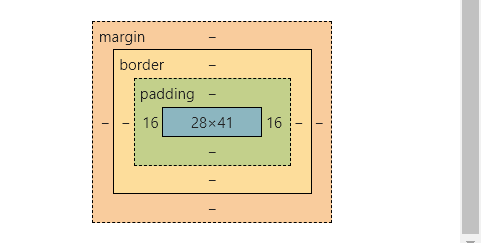


## 外边距

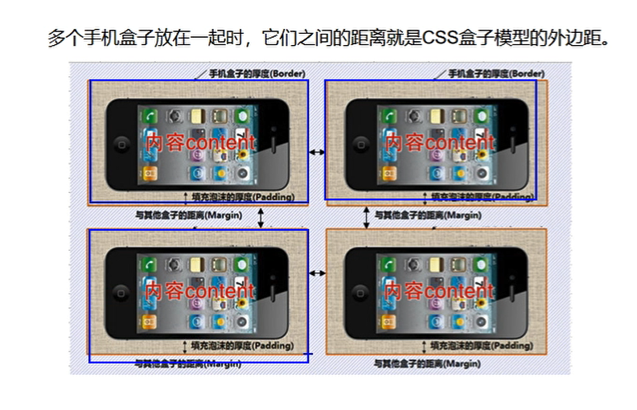

外边距：相邻两个盒子之间的距离

margin: 1 2 3 4  设置顺序就是上右下左


### 外边距合并

外边距合并：垂直排列的两个块元素，分别给上面的盒子设置向下的外边距和给下面的盒子设置向上的外边距，此时会形成外边距的合并:两个值相同时，就是这个值，当两个值不同时，取大的那个值。


### 外边距塌陷

嵌套的两个块元素，给第一个子元素设置向上的外边距，此时父元素会跟着掉下来，形成了外边距塌陷。

解决方案

1. 给父元素上边框
2. 给父元素设置overflow属性 overflow中的hidden 属性
3. 给父元素设置浮动
4. 给子元素设置浮动


```
<!DOCTYPE html>
<html>
	<head>
		<meta charset="utf-8">
		<title></title>
		<style>
			.box{
				height:400px;
				width:400px;
				background:grey;
			
				
			}
			.box .a1{
				width:100px;
				height:150px;
				background: yellow;
				margin-top: 50px;
			}
				
		</style>
	</head>
	<body>
		<div class = "box">
			<div class ="a1">一号</div>
			<div class ="a1">二号</div>
			
			
		</div>
	</body>
</html>
```

塌陷现象


设置上边框

border-top: 1px solid blue;


overflow hidden属性

overflow:hidden;


### 溢出属性

overflow:属性值

overflow的属性值有：hidden scroll auto 分别是 溢出隐藏 溢出滚动    在溢出的时候自动设置滚动条


强制换行属性： word-break:break-all;

强制不换行：white-space:nowrap

字间距：letter-spacing:0px


```
<!DOCTYPE html>
<html>
	<head>
		<meta charset="utf-8">
		<title></title>
		<style>
			.box{
				overflow:scroll;			
				height:400px;
				width:400px;
				background:grey;	
				letter-spacing:0px;
			}		
		</style>
	</head>
	<body>
		<div class = "box">
			你好世界你好世界你好世界你好世界你好世界你好世界你好世界你好世界你好世界你好世界你好世界你好世界你好世界你好世界你好世界你好世界你好世界你好世界你好世界你好世界你好世界你好世界你好世界你好世界你好世界你好世界你好世界你好世界你好世界你好世界你好世界你好世界你好世界你好世界你好世界你好世界你好世界你好世界你好世界你好世界你好世界你好世界你好世界你好世界你好世界你好世界你好世界你好世界你好世界你好世界你好世界你好世界你好世界你好世界你好世界你好世界你好世界你好世界你好世界你好世界你好世界你好世界你好世界你好世界你好世界你好世界你好世界你好世界你好世界你好世界你好世界你好世界你好世界你好世界你好世界你好世界你好世界你好世界你好世界你好世界你好世界你好世界你好世界你好世界你好世界你好世界你好世界好世界你好世界你好世界你好世界你好世界你好世界你好世界你好世界你好世界你好世界你好世界你好世界你好世界你好世界你好世界你好世界你好世界你好世界你好世界你好世界你好世界你好世界你好世界你好世界你好世界你好世界你好世界你好世界你好世界你好世界你好世界你好世界你好世界你好世界你好世界你好世界你好世界你好世界你好世界你好世界你好世界你好世界你好世界你好世界你好世界你好世界你好世界你好世界你好世界你好世界你好世界你好世界你好世界你好世界你好世界你好世界你好世界你好世界你好世界你好世界你好世界你好世界你好世界你好世界
		</div>
		</div>
	</body>
</html>
```


overflow:hidden; 隐藏溢出部分


white-space:nowrap 强制不换行，并且溢出模式为滚动条


### 块元素水平居中于父元素

设置 margin 的方式来实现水平居中于父元素

margin:0 auto  表示上下 ， auto 表示左右(宽度)，左右宽度设置 auto 会自动调节  

你企图居中的子元素必须具有固定的已经设置的宽度


```
<!DOCTYPE html>
<html>
	<head>
		<meta charset="utf-8">
		<title></title>
		<style>
			.box{
				
				height:400px;
				width:400px;
				background:grey;
				white-space:nowrap;
				letter-spacing:0px;
			}		
			.box .a1{
				height:100px;
				width:100px;
				background-color: blue;
				margin: 0 auto;
			}
		</style>
	</head>
	<body>
		<div class = "box">

			<div class="a1">
				
			</div>
		</div>
	</body>
</html>
```


# 块元素默认宽度

不设置宽度，其宽度默认和父元素(父容器宽度一样)

块元素的默认宽度：块元素不设置不固定宽度(width属性)时，宽度和父元素(父元素的content区域)一样。

块元素的默认面积(显式面积)组成：margin + border + padding + content。


父元素content的宽度是 1520


```
.box{
				height:300px;
				background-color: blue;
				margin-left:100px;
				border-left:50px solid wheat;
				padding-left:100px;
			}
```


100 + 50 + 100 + 1270 得到的是 1520

动他调节 padding border margin 它们的增加或者减少会从 content 的宽度减去，始终保持 1520


```
.box{
				height:300px;
				background-color: blue;
				margin-left:100px;
				border-left:50px solid wheat;
				padding-left:100px;
				width:1000px;
			}
```


设置固定宽度后，内容content的宽度就不变了，修改 margin 和 border 和 padding 不会影响content的宽度，而会影响

margin + border + padding + content显示面积


# 爱宠贴士(案例)

```
<!DOCTYPE html>
<html>
	<head>
		<meta charset="utf-8">
		<title></title>
		<style>
			*{
				margin:0;
				padding:0;
				list-style:none;
				/* 列表样式取消 ，没有小圆点了*/
				
			}
			body{
				background:#333 ;
			}
				
			.box{
				width:260px;
				 /* height:358px; */
				background:url(img/bg.gif);
				margin:50px auto 0 ;
				padding:10px;
			}
			.box h3{
				color:#fff;
				font-family: "黑体";
				font-size:20px;
				border-left:4px solid #c9e143;
				margin-bottom:10px;
				padding-left:4px;
			}
			.box .list{
				/* height:320px; */
				background:#fff;
				padding:0 10px;
			}
				
			.box .list li{
				border-bottom:1px dashed #666;
				height:30px;
				line-height:30px;
				background:url(img/tb.gif) no-repeat 6px center;
			}
			.box .list li a{
				/* 取消下划线 */
				text-decoration: none;
				color:#06c;
				font-size:12px;
				display:block;
				padding-left:19px;
			}
			.box .list li a:hover{
				/* 设置下划线 */
				text-decoration: underline;
				color: red;
			}
		</style>
	</head>
	<body>
		<div class = "box">
			<h3>爱宠知识</h3>
			<ul class ="list">
				<li>
					<a href="##">养狗比养猫更有利于身体健康</a>
				</li>
				<li>
					<a href="##">养狗比养猫更有利于身体健康</a>
				</li>
				<li>
					<a href="##">养狗比养猫更有利于身体健康</a>
				</li>
				<li>
					<a href="##">养狗比养猫更有利于身体健康</a>
				</li>
				<li>
					<a href="##">养狗比养猫更有利于身体健康</a>
				</li>
				<li>
					<a href="##">养狗比养猫更有利于身体健康</a>
				</li>
				<li>
					<a href="##">养狗比养猫更有利于身体健康</a>
				</li>
				<li>
					<a href="##">养狗比养猫更有利于身体健康</a>
				</li>
				<li>
					<a href="##">养狗比养猫更有利于身体健康</a>
				</li>
				
				<li>
					<a href="##">养狗比养猫更有利于身体健康</a>
				</li>
				<li>
					<a href="##">养狗比养猫更有利于身体健康</a>
				</li>
				<li>
					<a href="##">养狗比养猫更有利于身体健康</a>
				</li>
				<li>
					<a href="##">养狗比养猫更有利于身体健康</a>
				</li>
				
				<li>
					<a href="##">养狗比养猫更有利于身体健康</a>
				</li>
			</ul>
		</div>
	</body>
</html>
```


# img底部留白

img 底部留白出现的原因：由于img 是行内块元素，底部和文本的基线对齐，所以会有一部分留白

解决方案：

1.将img转换成块元素,display:block;

2.将box的字体设置成0

img 底部留白出现的原因：由于img 是行内块元素，底部和文本的基线对齐，所以会有一部分留白


原因是和文本基线对齐


# 新浪图片博客(案例)

```
<!DOCTYPE html>
<html>
	<head>
		<meta charset="utf-8">
		<title></title>
		<style>
			*{
				margin:0px;
				padding:0px;
				list-style:none;
			}
			.box{
				width:238px;
				height:212px;
				/* background:pink; */
				margin:100px auto 0;
				border: 1px solid #d9e0ee;
				border-top: 3px solid #85ff00;
			}
			.box h3{
				border-bottom:1px solid  #d9e0ee;
				height:35px;
				line-height:35px;
				font-size:16px;
				padding-left:12px;
			}
			.box h3 a{
				text-decoration: none;
				color:#000;
				font-family:"Microsoft YaHei","微软雅黑";
				
			}
			.box h3 a:hover{
				color:#f40;
			}
			.box .banner{
				width:180px;
				height:108px;
				background:pink;
				margin:7px auto 0px ;
			}
			.box .banner a{
				display:block;
				height:108px;
				background:yellow;
				text-decoration: none;
				
			}
			.box .banner a span{
				display:block;
				background-color: #f40;
				COLOR: #fff;
				line-height:21px;
				height:21px;
				font-size:14px;
				text-align:center;

			}
			.box .banner a img{
				display:block;
			}
			/* 鼠标移入a时让后代的span做什么 */
			.box .banner a:hover span {
				color:green;
			}
			.box .list{
				margin-top: 10px;
			}
			.box .list li{
				/* margin-top:10px; */
				/* border:1px solid pink; */
				line-height:24px;
				background: url(img/dian.png) no-repeat 9px;
				font-size: 12px ;
				padding-left: 19px;
				height:24px;
			}
			.box .list li a{
				color:#616;
				text-decoration: none;
				
			}
		</style>
	</head>
	<body>
		<div class="box">
			<h3>
				<a href="">图片博客</a>
			</h3>
			<div class="banner">
				<a href="##">
					
					<span>0826高新就业</span>
				</a>
			</div>
			
			
			<ul class="list">
				<li>
					<a href="##">请输入您搜索的内容</a>
				</li>
				<li>
					<a href="##">请输入您搜索的内容</a>
				</li>
			</ul>
		</div>
	</body>
</html>
```


# 浮动

之前学习的三种显示模式被称为标准流

浮动：是一个属性float，浮动是一个脱离标准流的状态，也叫浮动流。

当元素设置浮动后，**按照标签的书写顺序，依次排列在包含块(父元素)的左上**。

```
<!DOCTYPE html>
<html>
	<head>
		<meta charset="utf-8">
		<title></title>
		<style>
			/* 浮动float是一个属性 */
			/* 三种显示模式(行内块 行内 块)是标准流 ，浮动脱离了标准流 */
			.one{
				width:100px;
				height:100px;
				background: red;
				/* float: left; */
			}
			.two{
				width:200px;
				height:200px;
				background: blue;
				/* float:left; */
			}
			.three{
				width:300px;
				height:300px;
				background: green;
			}
		</style>
	</head>
	<body>
		<div class ="one"></div>
		<div class ="two"></div>
		<div class ="three"></div>
	</body>
</html>
```


one 设置属性 float left


two也设置属性floatleft


three也设置属性floatleft


## 浮动元素的宽高

行内元素和块级元素都可以设置浮动。

设置为浮动后，浮动元素不再具有块级显示模式，**不设置宽高的时候，其宽高是由其内容撑开多大决定的**。

我们可以人为的给浮动元素(即使原来是行内元素)设置 width 和 height属性，会生效


## 行内块和行内元素横向布局(浮动布局)

行内块元素布局问题

代码换行会有默认间距，行内块是沿基线对齐(底边对齐)，当给元素设置垂直方向的内外边距时，会影响周围的元素


```
<!DOCTYPE html>
<html>
	<head>
		<meta charset="utf-8">
		<title></title>
		<style>
			/* 浮动float是一个属性 */
			/* 三种显示模式(行内块 行内 块)是标准流 ，浮动脱离了标准流 */
			.one{
				width:100px;
				height:100px;
				background: red;
				display:inline-block;
				/* float: left; */
			}
			.two{
				width:200px;
				height:200px;
				background: blue;
				display:inline-block;
				/* float:left; */
			}
			.three{
				width:300px;
				height:300px;
				background: green;
				display:inline-block;
				/* float:left; */
			}
		</style>
	</head>
	<body>
		<div class ="one"></div>
		<div class ="two"></div>
		<div class ="three"></div>
	</body>
</html>
```

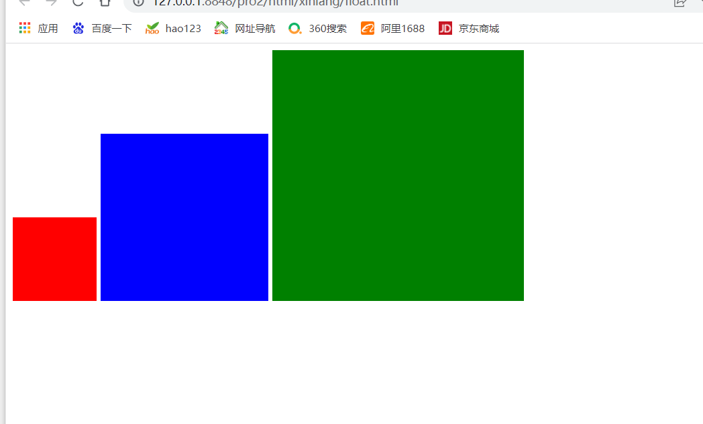

这里的间隔就是代码的换行导致的


padding和 margin变大触顶后会导致其他行内块元素的位置改变，原因是必须维持同一基线，其他行内块元素会被拉下去

padding过大


margin变大


行内元素布局问题：

代码换行会导致默认间距，行内元素是沿基线对齐(底边对齐)，当给元素设置垂直方向的内外边距时，由于受基线对齐的限制，垂直方向的内外边距是不起作用的。


```
<!DOCTYPE html>
<html>
	<head>
		<meta charset="utf-8">
		<title></title>
		<style>
			/* 浮动float是一个属性 */
			/* 三种显示模式(行内块 行内 块)是标准流 ，浮动脱离了标准流 */
			.one{
				background-color: red;
				margin:0px;
				padding:0px;
			}
			.two{
				background-color:green;
			}
			.three{
				background-color: yellow;
			}
		</style>
	</head>
	<body>
		<span class="one">你好1</span>
		<span class="two">你好2</span>
		<span class="three">你好3</span>
	</body>
</html>
```


margin变大


padding变大


浮动横向布局：没有代码换行所导致的间距，设置内外(垂直边距)不会影响周围的元素


```
<!DOCTYPE html>
<html>
	<head>
		<meta charset="utf-8">
		<title></title>
		<style>
			/* 浮动float是一个属性 */
			/* 三种显示模式(行内块 行内 块)是标准流 ，浮动脱离了标准流 */
			.one{
				width:100px;
				height:100px;
				background: red;
				margin:0px;
				padding:0px;
				 float: left; 
			}
			.two{
				width:200px;
				height:200px;
				background: blue;
				 float:left; 
			}
			.three{
				width:300px;
				height:300px;
				background: green;
				float:left; 
			}
		</style>
	</head>
	<body>
		<div class ="one"></div>
		<div class ="two"></div>
		<div class ="three"></div>
	</body>
</html>
```


margin变大


padding变大

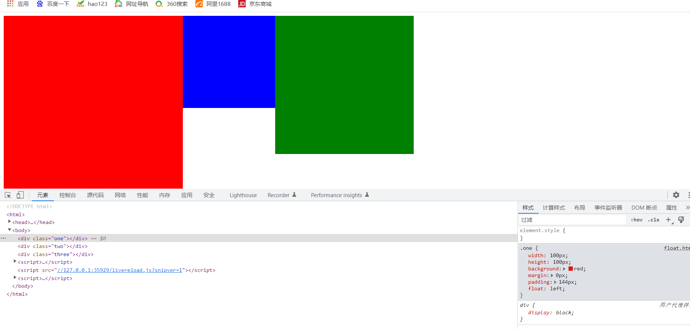


## 浮动横向距离

通常把浮动元素再放入一个块元素中。通过这个块元素对浮动元素的位置进行调控

```
<!DOCTYPE html>
<html>
	<head>
		<meta charset="utf-8">
		<title></title>
		<style>
			/* 浮动float是一个属性 */
			/* 三种显示模式(行内块 行内 块)是标准流 ，浮动脱离了标准流 */
			.one{
				width:100px;
				height:100px;
				background: red;
				float: left; 
			}
			.two{
				width:200px;
				height:200px;
				background: blue;
				float:left; 
			}
			.three{
				width:300px;
				height:300px;
				background: green;
				float:left; 
			}
			.main{
				background: grey;
				height:500px;
			}
		</style>
	</head>
	<body>
		<div class ="one"></div>
		<div class ="two"></div>
		<div class ="three"></div>
		<div class = "main"></div>
	</body>
</html>
```

调节margin会导致浮动在上方的元素也被拖下去。

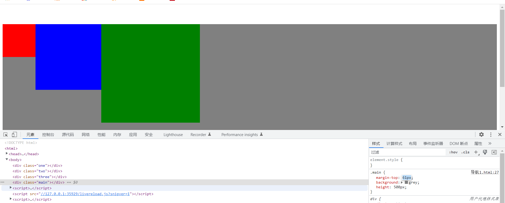


解决方案：把浮动着的元素放在一个父容器当中。

```
.box{
				height:400px;
				border:4px solid gold;
			}
			
		</style>
	</head>
	<body>
		<div class="box">
			<div class ="one"></div>
			<div class ="two"></div>
			<div class ="three"></div>
		</div>
		<div class = "main"></div>
	</body>
```


## 浮动造成的影响


```
<!DOCTYPE html>
<html>
	<head>
		<meta charset="utf-8">
		<title></title>
		<style>
			/* 浮动float是一个属性 */
			/* 三种显示模式(行内块 行内 块)是标准流 ，浮动脱离了标准流 */
			*{
				margin:0px;
				padding:0px;
			}
			.one{
				width:100px;
				height:100px;
				background: red;
				float: left; 
			}
			.two{
				width:200px;
				height:200px;
				background: blue;
				float:left; 
			}
			.three{
				width:300px;
				height:300px;
				background: green;
				float:left; 
			}
			.main{
				margin-top:0px;
				padding-top:0px;
				background: grey;
				height:400px;
			}
			.box{
				height:500px;
				width:1000px;
				border:2px solid gold;
				margin:0 auto;
			}
			
		</style>
	</head>
	<body>
		<div class="box">
			<div class ="one"></div>
			<div class ="two"></div>
			<div class ="three"></div>
		</div>
		<div class = "main"></div>
	</body>
</html>
```

把 .box 的 height 属性去掉


存放浮动元素的盒子没有设置高度，就认为没有内容(因为该父元素内的子元素全是浮动元素，子元素是浮动的无法撑开内容)，高度为0，那么下面的盒子就会往上移。这种现象是父元素**高度塌陷**。


解决方案

1. 给父元素设置overflow属性 overflow:hidden

   这种设置方式让父元素认为子元素虽然是浮动元素但是依旧占位置。

   通过这种方式，父元素的高度由最高(height)的那个浮动元素决定

   上面的代码中，.box 属性 加上 overflow:hidden 属性。

   

   这种方法的副作用是不能有溢出

2. 额外标签法

   在父元素中添加一个额外的标签。这个标签要有 clear:both;属性

   ```
   .four{
   				/* 清除之前浮动元素造成的影响，让浮动元素占位置 */
   				/* height:50px; */
   				background-color: yellow;
   				clear:both; 
   			}
   ```

   

3. 父元素调用 clearFix 类名。作用是清除浮动造成的影响

   .clearFix 是一种取名规范。 这是一种伪元素。

   这个类需要由包含浮动元素的父元素，并且首次想要清除浮动元素造成影响的标签调用。

   不能子元素是浮动，父元素包含子元素，爷爷元素包含父元素并且恰好和父元素宽高一样，此时该类需要由父元素调用，再由父元素把爷爷元素撑开

   ```
   .clearFix::after{
   				content:"";
   				display:block;
   				clear:both;
   			}
   			
   ```

4. 给父元素设置浮动，子元素父元素一起浮动，那么父元素会被子元素撑开

   .box 元素设置 float:left;

   

   在恰好也需要父元素浮动的时候使用。
   
5. 父元素开启绝对定位后，也可以解决子元素浮动导致的高度塌陷的问题 


## 左浮动和右浮动

左浮动：浮动元素按照标签的书写顺序在父元素的左上由左向右依次排开。

右浮动：浮动元素按照标签的书写顺序在父元素的右上由右向左依次排开。


```
<!DOCTYPE html>
<html>
	<head>
		<meta charset="utf-8">
		<title></title>
		<style>
			/* 浮动float是一个属性 */
			/* 三种显示模式(行内块 行内 块)是标准流 ，浮动脱离了标准流 */
			*{
				margin:0px;
				padding:0px;
			}
			.one{
				width:100px;
				height:100px;
				background: red;
				float: left; 
			}
			.two{
				width:200px;
				height:200px;
				background: blue;
				float:left; 
			}
			.three{
				width:300px;
				height:300px;
				background: green;
				float:right; 
			}
			.main{
				margin-top:0px;
				padding-top:0px;
				background: grey;
				height:400px;
			}
			.box{
				/* height:500px; */
				width:1000px;
				border:2px solid gold;
				margin:0 auto;
			}
			.clearFix::after{
				content:"";
				display:block;
				clear:both;
			}
		</style>
	</head>
	<body>
		<div class="box clearFix">
			<div class ="one"></div>
			<div class ="two"></div>
			<div class ="three"></div>	
		</div>
		<div class = "main"></div>
	</body>
</html>
```


## 浮动元素换行

浮动元素当父元素宽度不够时会自动换行。

先是排一行，一行不够了就换行

## 浮动实现文字环绕

浮动在最初是为了实现文本环绕效果。

浮动在实现文本环绕效果：当元素设置浮动后，后面的文本不会被浮动元素盖住，而是对浮动元素进行文本环绕。


```
<!DOCTYPE html>
<html>
	<head>
		<meta charset="utf-8">
		<title></title>
		<style>
			/* 浮动float是一个属性 */
			/* 三种显示模式(行内块 行内 块)是标准流 ，浮动脱离了标准流 */
			.one{
				width:100px;
				height:100px;
				background: red;
			}
			.box{
				width:200px;
				height:200px;
				border:3px solid yellow;
			}
		</style>
	</head>
	<body>
		<div class ="box">
			<div class ="one">
			</div>
			你好世界你好世界你好世界你好世界你好世界你好世界你好世界你好世界你好世界你好世界你好
		</div>	
	</body>
</html>
```


给 one 类 加上 float:left;


## 列表+浮动实现a标签导航

```
<!DOCTYPE html>
<html>
	<head>
		<meta charset="utf-8">
		<title></title>
		<style>
			*{
				margin:0px;
				padding:0px;
				list-style:none;
			}
			.box ul li{
				float:left;
				margin-right:10px;
				margin-bottom:10px;
				margin-top:10px;
			}
			.box ul li a{
				display: block;
				width:100px;
				height:30px;
				background-color: yellow;
				line-height: 30px;
				text-decoration: none;
				text-align:center;
			}
			.box ul li a:hover{
				background:yellowgreen;
				color:red;
			}
			.box{
				background-color: pink;
			}
			.clearFix::after{
							content:"";
							display:block;
							clear:both;
						}
			.box ul{
				width:550px;
				margin:0px auto;
			}
		</style>
	</head>
	<body>
		<div class = "box">
			<ul  class="clearFix">
				<li>
					<a href="##">导航</a>
				</li>
				<li>
					<a href="##">导航</a>
				</li>
				<li>
					<a href="##">导航</a>
				</li>
				<li>
					<a href="##">导航</a>
				</li>
				<li>
					<a href="##">导航</a>
				</li>
				<li>
					<a href="##">导航</a>
				</li>
				<li>
					<a href="##">导航</a>
				</li>
				<li>
					<a href="##">导航</a>
				</li>
				<li>
					<a href="##">导航</a>
				</li>
				<li>
					<a href="##">导航</a>
				</li>
				<li>
					<a href="##">导航</a>
				</li>
				<li>
					<a href="##">导航</a>
				</li>
				<li>
					<a href="##">导航</a>
				</li>
				<li>
					<a href="##">导航</a>
				</li>
				<li>
					<a href="##">导航</a>
				</li>
			</ul>
		</div>
	</body>
</html>
```


## 浮动布局中的问题


当子元素设置浮动后，高度超出父元素时，会影响到下面父元素的浮动元素


# 特殊属性

## 占位隐藏和不占位隐藏属性


占位隐藏：visibility:hidden  设置无法看到，但是还是在那个位置

视觉上看不到但是占着位置，仅仅是看不到


不占位隐藏 display:none 就是让整个元素消失


## 透明属性

第一种

opacity:取值范围 0到1，0.5 表示半透明，0.5可以写成.5

opacity 会导致 内容(字体)和背景一起透明。


第二种

css3中的属性,IE低版本不起作用

background:rgba(0,0,0,.5) 设置背景颜色(前三个值)，最后一个值，设置背景颜色透明度.不会导致字体一起透明


## 溢出属性

给哪个元素设置,就表示:当这个元素的子元素或者是写在其内部的文本溢出该元素时,就会进行哪些处理操作.


overflow:属性值

overflow的属性值有：hidden scroll auto 分别是 溢出隐藏 溢出滚动    在溢出的时候自动设置滚动条

overflow-x 表示水平方向溢出时做什么处理

overflow-y 表示垂直方向溢出时做什么处理

## border圆角属性

border-radius: 20px 0 0 20px;    /* 左上 右上 右下 左下 */

也可以设置一个百分比  border-radius :50% 

可以让边框呈现出弧形

## cursor改变鼠标

 鼠标悬浮到该元素上后改变鼠标的图标 
cursor:pointer;   鼠标移动到该元素上后出现点击键 


## 开启BFC的属性

开启bfc(是一个独立的渲染区域，脱离了标准流)的方式：能够解决**高度塌陷，外边距塌陷** block formatting context 开启格式化上下文

1. overflow:hidden,scroll
2.  float:left/right
3. position:absolute,fixed


# 渐近增强和优雅降级


# 定位

定位：将元素设置在网页的一个具体坐标位置

## 相对定位

相对定位，也叫占位定位，通过偏移量根据当前在标准流自身的位置为参考点移动，在移动时，是在z轴的空间移动(飞在空中，不会影响周围元素)，此时不会影响周围的元素。但是还是会在原地(原来的标准流处)留下位置。

水平偏移量：left 和 right    left：正值向右，负值向左 right：正值向左，负值向右   left和right都存在，left优先级更高

垂直偏移量：top 和 bottom  top：正值向下，负值向上 bottom：正值向上，负值向下 top和bottom都存在，top优先级更高


使用方式：选择器中先写 position：relative;属性，然后 left top 属性指定其位置。


```
<!DOCTYPE html>
<html>
	<head>
		<meta charset="utf-8">
		<title></title>
		<style>
			*{
				margin:0px;
				padding:0px;
			}
			div{
				background-color: yellow;
				height:100px;
				width:100px;
			}
			img{
				position: relative;
				left:10px;
				top:10px;
			}
			
		</style>
	</head>
	<body>
		<div>
			
		</div>
		
		<div></div>
	</body>
</html>
```


你会发现改变 left和top的值，会改变该元素的位置但是不会影响其他元素，飘在所有元素上方，并且 left:0px 和 top:0px 的位置被占着。

这就是上面说的:不会影响周围的元素。但是还是会在原地(原来的标准流处)留下位置。


相对定位通常不单独使用，因为是占位的。

## 绝对定位

绝对定位：是一个完全脱离标准流的状态，默认起始参考点是 **浏览器的第一屏 或者 初始包含块 **

水平偏移量：left 和 right    left：正值向右，负值向左 right：正值向左，负值向右   left和right都存在，left优先级更高

垂直偏移量：top 和 bottom  top：正值向下，负值向上 bottom：正值向上，负值向下 top和bottom都存在，top优先级更高

```
<!DOCTYPE html>
<html>
	<head>
		<meta charset="utf-8">
		<title></title>
		<style>
			*{
				margin:0px;
				padding:0px;
			}
			div{
				background-color: yellow;
				height:100px;
				width:100px;
			}
			body{
				width:2000px;
				height:2000px;
			}
			img{
				position: absolute;
				left:0px;
				top:0px;
			}		
		</style>
	</head>
	<body>
		<div>	
		</div>
		
		<div></div>
	</body>
</html>
```

left:0px top:0px 贴紧初始容器左上角。


right:0px bottom:0px; 贴紧初始容器右下角。

如果 body 的宽和高足够大以至于出现了滚动条，滑动滚动条的时候，设置绝对定位的元素不会跟随着移动，而是保留在原来初始容器右下角的位置


最开始的那个窗口就是初始容器。


绝对定位应用于 **轮播图两边的按钮** 还有**希望出现盒子压盒子的情形**


## 固定定位

position:fixed;

固定定位:将元素设置到浏览器窗口的一个具体坐标位置，固定定位的参考点永远是浏览器窗口

永远是以浏览器当前页面的窗口为参照进行定位的。

它不会找最近的相对定位的元素做出那种操作。就算你把position:fixed属性的元素加入在别的元素内，该元素依旧是以当前浏览器窗口进行定位。


### 浏览器窗口大小改变的时候保持固定定位不变

设计网页的时候有通栏，通栏的宽度通常是固定的。

先走浏览器宽度的一半，靠百分比解决不固定的窗口的大小，再走通栏宽度的一半+自身的宽度，通栏宽度是我们固定好的所以写具体数值即可 。

```
.advLeftButtom{
	width:360px;
	height:570px;
	background: url(../img/qiuLeft.png) no-repeat 0 0;
	绝对定位
	position:fixed;
	/* 先走浏览器宽度的一半，靠百分比解决不固定的文件，再走通栏宽度的一半+自身的宽度，通栏宽度是我们固定好的所以写具体数值即可 */
	left:50%;
	margin-left:-960px;
	top:0px;
	z-index:-1;
}
```


## 设置相对定位与绝对定位与固定定位后元素的宽高

- 块级元素设置相对定位后,其默认宽度依旧是其父元素宽度,高度看撑开高度,也可以直接设置width和height
- 块级元素设置绝对定位后,其默认宽度,高度都是0,取决于其内容撑开的,也可以设置width和height生效
- 行内元素设置相对定位后,设置宽高不会生效,依旧要看其撑开多高
- 行内元素设置绝对定位后,设置宽高会生效,默认宽度高度都是0
- 相对定位不改变各自(行内元素和块级元素)显示模式,绝对定位让两个默认宽高都是0,都可以设置width和height生效,不设置width和height就看其内容多大
- 原本的块级元素，行内块元素，行内元素设置固定定位后。其宽和高都变成其撑开的内容决定，也可以width和height控制其宽高


## 绝对定位和相对定位结合使用

- 设置绝对定位的元素(就算原本是行内元素)宽高有效

- 绝对定位的起始参考点是设置了定位**(绝对定位，相对定位，固定定位**都可以)的父元素(离自身最近的)，父元素必须设置三种中一种的定位属性，不然默认以 body 作为起始参考点 。

  如果离自身最近的块没有设置定位那么，往远一点的找，找到为止，找不到就是body为起始参考点

子绝对父相对，子绝对父绝对，子元素都会把父元素当作绝对位置的开始处

```
<!DOCTYPE html>
<html>
	<head>
		<meta charset="utf-8">
		<title></title>
		<style>
			*{
				margin:0px;
				padding:0px;
			}
			.box{
				width:1000px;
				height:500px;
				border:1px solid #000;
				margin:0 auto;
				position: relative;
			}
			span{
				width:100px;
				height:30px;
				background-color: red;
				position:absolute;
				left:0px;
				top:0px;
			}
			.box1{
				width:500px;
				height:250px;
				margin:auto auto;
				border:1px solid #000;
				/* position: relative; */
			}
		</style>
	</head>
	<body>
		<div class = "box">
			<div class="box1">
				<span></span>
				你好世界你好世界你好世界你好世界你好世界你好世界你好世界你好世界你好世界你好世界你好世界你好世界你好世界你好世界你好世界你好世界你好世界你好世界你好世界你好世界你好世界你好世界你好世界你好世界你好世界你好世界你好世界你好世界你好世界你好世界你好世界你好世界你好世界你好世界你好世界111111你好世界你好世界你好世界你好世界你好世界你好世界
			</div>
		</div>
		
	</body>
</html>
```


box 嵌套 box1 ，box1 嵌套 span 。

span本来行内元素不能设置宽高，但是现在绝对定位可以了。

如果 是 box1 设置 position:relative;


box 设置 box1不设置


两个都设置


两个都不设置


用到项目中能做出来的效果


## 设置元素生效

某元素已经设置定位,先设置了left值,再设置right值,right值无法其作用 

我们需要让left 值失效，原本 left 是比right地位高的，把left去掉，才能让right生效.层叠无法实现就进行失效处理 

办法,left:auto让left属性恢复自适应,相当于把left属性废除掉了只剩下right 


## 定位的层级

层级：

- 也是属性，是属性 z-index z-index 取值范围是整数，默认层级是0
- 当层级相同时，后写的标签会写在先写标签的上面。
- 层级不相同还发生重叠。就是 层级高的压层级低的。
- 当层级是负数时低于标准流。层级为0还是压在标准流上方

```
<!DOCTYPE html>
<html>
	<head>
		<meta charset="utf-8">
		<title></title>
		<style>
			.box{
				width:800px;
				height:500px;
				border:1px solid #000;
				margin:0 auto;
				position: relative;
			}
			.s1{
				width:100px;
				height:30px;
				background:red;
				position:absolute;
				left:0px;
				top:0px;
			}
			.s2{
				width:100px;
				height:30px;
				background:blue;
				position: absolute;
				left:0px;
				top:0px;			
			}
		</style>
	</head>
	<body>
		<div class = "box">
			<span class = "s1">s1</span>
			<span class = "s2">s2
			</span>
		</div>	
	</body>
</html>
```


当s1 的 left top 都设置成 20


设置z-index s2 设置为 1 ，s1设置为2


### 定位层级与子元素

- 当层级相同时，后写的标签连同子元素，都会压在先写的标签连同其子元素的上面，父元素的层级将决定子元素的层级的高低.
- 当层级不同时，较大层级的标签连同子元素，都会压在较低层的标签连同其子元素的上面，父元素的层级将决定子元素层级的高i的。

- 当不设置 z-index，后面的标签连同子元素会压在先写的标签连同其子元素的上面，但是此时子元素层级的高低，将决定自身是否能压在后面标签的上面。


```
<!DOCTYPE html>
<html>
	<head>
		<meta charset="utf-8">
		<title></title>
		<style>
			*{
				margin:0px;
				padding:0px;
			}
			.box1{
				width:300px;
				height:400px; 
				background:red;
				position:relative;
				top:100px;
				left:0px;
				
			}
			.box1 span{
				position: absolute;
				width:100px;
				height:100px; 
				background:yellow;
				left:0px;
				top:300px;
			}
			.box2{
				width:300px;
				height:400px;
				background:blue;
				position:relative;
				top:10px;
			}
			.box2 span{
				position:absolute; 
				width:100px;
				height:100px;
				background:green;
				left:10px;
				top:10px;
			}	
		</style>
	</head>
	<body>
		
		<div class = "box1">
			<span></span>
		</div>
		<div class = "box2">
			<span></span>
		</div>
	</body>
</html>
```

box1 是写在 box2 前面的.

下面的例子中,没提到对子元素 z-index 的设置就是没设置

- 当box1和box2都不设置z-index,那么就相当于z-index=z-index=0

  设置z-index=z-index=1 ,也是这个效果,只要z-index box1=z-index box2 

  z-index box1<z-index box2 都是下面这个效果(写在后面的压在写在前面的上面)

  

- 当设置 box1 的 z-index 大于 z-index  就是下面这个效果

  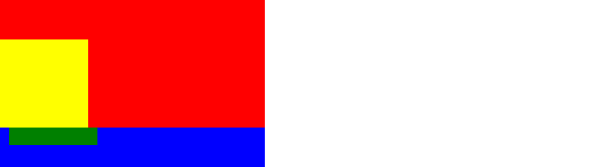

- 当box1 z-index<box2 z-index(这两个父元素的z-index都设置了)   而 span1 z-index > span2 z-index

  父元素比别人低,子元素一定比对方低

  

- 当两个父元素的z-index都不设置,而span1 z-index > span2 z-index

  


## 定位的自适应水平垂直居中

浮动无法做到水平垂直居中


定位元素的水平垂直居中。

水平居中：设置left：50% 走父元素宽度的一半。  margin-left:-自身宽度的一半，往回走自身的一半

垂直居中：设置top：50% 走父元素高度的一半。  margin-left:-自身高度的一半，往回走自身的一半


## 轮播图


```
<!DOCTYPE html>
<html>
	<head>
		<meta charset="utf-8">
		<title></title>
		<style>
			* {
				margin: 0px;
				padding: 0px;
				list-style: none;
			}

			.box {
				width: 1226px;
				height: 460px;
				margin: 100px auto;
				background: pink;
				position: relative;
				
			}

			/* .box .three{
				/* 占位隐藏 */
			/* visibility: hidden; */
			/* 不占位隐藏 */
			/* display: none; */
			/* } */
			.box .leftNav {
				width: 234px;
				height: 460px;
				/* background:#000 ; */
				position: absolute;
				left: 0px;
				top: 0px;
				color: red;
				/* opacity:0.5; */
				background: rgba(0, 0, 0, 0.5);
			}

			.box>span {
				width: 41px;
				height: 69px;
				background: pink;
				position: absolute;
				left: 234px;
				top: 50%;
				margin-top: -35px;
				text-align: center;
				line-height: 69px;
				font-size: 30px;
			}

			.box .rightBtn {
				/* 让上面设置的 left 值失效，原本 left 是比right地位高的，把left去掉，才能让right生效，层叠无法实现就进行失效处理 */
				/* auto让属性恢复自适应 */

				left: auto;
				right: 0;
			}

			.box ol {
				position: absolute;
				right: 30px;
				bottom: 30px;
			}

			/* 开启bfc(是一个独立的渲染区域，脱离了标准流)的方式：能够解决高度塌陷，外边距塌陷 block formatting context 开启格式化上下文
			 1. overflow:hidden,scroll
			 2.float:left/right
			 3.position:absolute,fixed
			*/
			.box ol li {
				/* 父元素开启绝对定位后，也可以解决子元素浮动导致的高度塌陷的问题 */
				float: left;
				width:6px;
				height:6px;
				background:rgba(0,0,0,.4);
				/* 色饱和度 */
				border-color:hsla(0,0%,100%,.3);
				border:2px solid #fff;
				border-radius:50%;
				margin-left:8px;
			}
				
			.box ol .current{
				background:#fff;
				/* 背景裁剪属性 */
				background-clip: content-box;
			}
			.box ol li:hover{
				background:#fff;
				background-clip: content-box;
			}
			.box .leftNav>ul{
				margin-top:20px;
			}
			.box .leftNav>ul>li a{
				display: block;
				height:42px;
				line-height:42px;
				color:#fff;
				
				text-decoration: none;
				font-style:normal;
				padding:0 24px 0 29px;
			}
			.box .leftNav>ul>li a>span{
				float:left;
			}
			.box .leftNav>ul>li a>i{
				float:right;
			}
			.box .leftNav>ul>li a:hover{
				background-color: #ff6700;
			}
			.box .leftNav>ul>li>div{
				width:992px;
				height:460px;
				background: greenyellow;
				position: absolute;
				left:234px;
				top:0px;
				z-index:1;
				/* 鼠标不移入消失 */
				display:none;
				
			}
			/* 鼠标移入后让后代显示 */
			.box .leftNav>ul>li:hover div{
				/* 块级元素显示 */
				display:block;
			}
			.box .imgList{
				border:5px solid orangered;
				width:6130px;
				/* 绝对定位 */
				position:absolute;
				left:0px;
				top:0px;
				
			}
			.box .imgList li{
					float:left;
			}
			.box{
				overflow:hidden;
				/* 处于box元素内部并且溢出box元素的全部隐藏 */
			}
			
		</style>
	</head>

	<body>
		<div class="box">
			<!-- 图片 绝对定位 -->
			<ul class = "imgList">
				<li>
					<a href="##">
						
					</a>
				</li>
				
				<li>
					<a href="##">
						
					</a>
				</li>
				
				<li>
					<a href="##">
						
					</a>
				</li>
				
				<li>
					<a href="##">
						
					</a>
				</li>
				
				<li>
					<a href="##">
						
					</a>
				</li>
				
				
			</ul>
			<!-- 侧导航要放在 div中，滚动的时候是ul滚动 -->
			<!-- leftNav是绝对定位 -->
			<div class="leftNav">
				<ul>
					<li>
						<a href="##">
							<span>手机 电话卡</span>
							<i>></i>
						</a>
						<!-- 绝对定位，参考点 是 leftNav -->
						<div></div>
					</li>
					<li>
						<a href="##">
							<span>手机 电话卡</span>
							<i>></i>
						</a>
						<div></div>
					</li>
					<li>
						<a href="##">
							<span>手机 电话卡</span>
							<i>></i>
						</a>
						<div></div>
					</li>
					<li>
						<a href="##">
							<span>手机 电话卡</span>
							<i>></i>
						</a>
						<div></div>
					</li>
					<li>
						<a href="##">
							<span>手机 电话卡</span>
							<i>></i>
						</a>
						<div></div>
					</li>
					<li>
						<a href="##">
							<span>手机 电话卡</span>
							<i>></i>
						</a>
						<div></div>
					</li>
					<li>
						<a href="##">
							<span>手机 电话卡</span>
							<i>></i>
						</a>
						<div></div>
					</li>
					<li>
						<a href="##">
							<span>手机 电话卡</span>
							<i>></i>
						</a>
						<div></div>
					</li>
					<li>
						<a href="##">
							<span>手机 电话卡</span>
							<i>></i>
						</a>
						<div></div>
					</li>
					<li>
						<a href="##">
							<span>手机 电话卡</span>
							<i>></i>
						</a>
						<div></div>
					</li>
				</ul>
				
				
				
			</div>
			<!-- 按钮 -->
			<span class="leftBtn">&lt;</span>
			<span class="rightBtn">&gt;</span>
			<!-- 小圆点 -->
			<ol>
				<li class = "current"></li>
				<li></li>
				<li></li>
				<li></li>
			</ol>
		</div>
	</body>
</html>

```


​			


# css精灵

css精灵：也叫 css sprite 雪碧图 ，是背景图的技术。

如今网速很快，下载一张大图和一张小兔所用的时间差不多，但是服务器连接资源是有限的，将一张张的小图合成一张大图，一次性下载，只需要连接一次服务器，能够减少对服务器的压力，提高网站的访问效率


把整张图都移入但是只展示其中一个切片，通过改变background-position实现，指定具有背景图的块的宽和高来让其只呈现背景图的一个局部。其余的页面都会被覆盖掉，但是如果宽高设置不恰当可能会露馅.

```
<!DOCTYPE html>
<html>
	<head>
		<meta charset="utf-8">
		<title></title>
		<style>
			/* 该图片只加载一次 */
			.bg{
				background:url(img/abcd.jpg) no-repeat ;
			}
			.one{
				width:108px;
				height:108px;
				background-position:-372px -277px; 
			}
			.two{
				width:103px;
				height:105px;
				border:1px solid #000;
				background-position: -254px -562px;
			}
		</style>
	</head>
	<body>
		<div class="one bg"></div>
		<div class="two bg"></div>
	
	</body>
</html>
```


把宽度设置大就会露馅


## 创建精灵图片


## 轮播图精灵版

```
<!DOCTYPE html>
<html>
	<head>
		<meta charset="utf-8">
		<title></title>
		<style>
			* {
				margin: 0px;
				padding: 0px;
				list-style: none;
			}

			.box {
				width: 1226px;
				height: 460px;
				margin: 100px auto;
				background: pink;
				position: relative;
				
			}

			/* .box .three{
				/* 占位隐藏 */
			/* visibility: hidden; */
			/* 不占位隐藏 */
			/* display: none; */
			/* } */
			.box .leftNav {
				width: 234px;
				height: 460px;
				/* background:#000 ; */
				position: absolute;
				left: 0px;
				top: 0px;
				color: red;
				/* opacity:0.5; */
				background: rgba(0, 0, 0, 0.5);
			}

			.box>span {
				width: 41px;
				height: 69px;
				background: url(pict/icon-slides.png) no-repeat -84px 0px;
				position: absolute;
				left: 234px;
				top: 50%;
				margin-top: -35px;
				text-align: center;
				line-height: 69px;
				font-size: 30px;
			}

			.box .rightBtn {
				/* 让上面设置的 left 值失效，原本 left 是比right地位高的，把left去掉，才能让right生效，层叠无法实现就进行失效处理 */
				/* auto让属性恢复自适应 */

				left: auto;
				right: 0;
				/* 设置背景图的位置，不设置块的位置 */
				background-position-x:-126px;
			}
			.box .leftBtn:hover{
				background-position-x:0px;
			}
			.box .rightBtn:hover{
				background-position-x:-42px;
			}

			.box ol {
				position: absolute;
				right: 30px;
				bottom: 30px;
			}

			/* 开启bfc(是一个独立的渲染区域，脱离了标准流)的方式：能够解决高度塌陷，外边距塌陷 block formatting context 开启格式化上下文
			 1. overflow:hidden,scroll
			 2.float:left/right
			 3.position:absolute,fixed
			*/
			.box ol li {
				/* 父元素开启绝对定位后，也可以解决子元素浮动导致的高度塌陷的问题 */
				float: left;
				width:6px;
				height:6px;
				background:rgba(0,0,0,.4);
				/* 色饱和度 */
				border-color:hsla(0,0%,100%,.3);
				border:2px solid #fff;
				border-radius:50%;
				margin-left:8px;
			}
				
			.box ol .current{
				background:#fff;
				/* 背景裁剪属性 */
				background-clip: content-box;
			}
			.box ol li:hover{
				background:#fff;
				background-clip: content-box;
			}
			.box .leftNav>ul{
				margin-top:20px;
			}
			.box .leftNav>ul>li a{
				display: block;
				height:42px;
				line-height:42px;
				color:#fff;
				
				text-decoration: none;
				font-style:normal;
				padding:0 24px 0 29px;
			}
			.box .leftNav>ul>li a>span{
				float:left;
			}
			.box .leftNav>ul>li a>i{
				float:right;
			}
			.box .leftNav>ul>li a:hover{
				background-color: #ff6700;
			}
			.box .leftNav>ul>li>div{
				width:992px;
				height:460px;
				background: greenyellow;
				position: absolute;
				left:234px;
				top:0px;
				z-index:1;
				/* 鼠标不移入消失 */
				display:none;
				
			}
			/* 鼠标移入后让后代显示 */
			.box .leftNav>ul>li:hover div{
				/* 块级元素显示 */
				display:block;
			}
			.box .imgList{
				border:5px solid orangered;
				width:6130px;
				/* 绝对定位 */
				position:absolute;
				left:0px;
				top:0px;
				
			}
			.box .imgList li{
					float:left;
			}
			.box{
				overflow:hidden;
				/* 处于box元素内部并且溢出box元素的全部隐藏 */
			}
			
		</style>
	</head>

	<body>
		<div class="box">
			<!-- 图片 绝对定位 -->
			<ul class = "imgList">
				<li>
					<a href="##">
						
					</a>
				</li>
				
				<li>
					<a href="##">
						
					</a>
				</li>
				
				<li>
					<a href="##">
						
					</a>
				</li>
				
				<li>
					<a href="##">
						
					</a>
				</li>
				
				<li>
					<a href="##">
						
					</a>
				</li>
				
				
			</ul>
			<!-- 侧导航要放在 div中，滚动的时候是ul滚动 -->
			<!-- leftNav是绝对定位 -->
			<div class="leftNav">
				<ul>
					<li>
						<a href="##">
							<span>手机 电话卡</span>
							<i>></i>
						</a>
						<!-- 绝对定位，参考点 是 leftNav -->
						<div></div>
					</li>
					<li>
						<a href="##">
							<span>手机 电话卡</span>
							<i>></i>
						</a>
						<div></div>
					</li>
					<li>
						<a href="##">
							<span>手机 电话卡</span>
							<i>></i>
						</a>
						<div></div>
					</li>
					<li>
						<a href="##">
							<span>手机 电话卡</span>
							<i>></i>
						</a>
						<div></div>
					</li>
					<li>
						<a href="##">
							<span>手机 电话卡</span>
							<i>></i>
						</a>
						<div></div>
					</li>
					<li>
						<a href="##">
							<span>手机 电话卡</span>
							<i>></i>
						</a>
						<div></div>
					</li>
					<li>
						<a href="##">
							<span>手机 电话卡</span>
							<i>></i>
						</a>
						<div></div>
					</li>
					<li>
						<a href="##">
							<span>手机 电话卡</span>
							<i>></i>
						</a>
						<div></div>
					</li>
					<li>
						<a href="##">
							<span>手机 电话卡</span>
							<i>></i>
						</a>
						<div></div>
					</li>
					<li>
						<a href="##">
							<span>手机 电话卡</span>
							<i>></i>
						</a>
						<div></div>
					</li>
				</ul>		
			</div>
			<!-- 按钮 -->
			<span class="leftBtn"></span>
			<span class="rightBtn"></span>
			<!-- 小圆点 -->
			<ol>
				<li class = "current"></li>
				<li></li>
				<li></li>
				<li></li>
			</ol>
		</div>
	</body>
</html>

```


# 图标字节

[iconfont-阿里巴巴矢量图标库](https://www.iconfont.cn/) 阿里巴巴矢量字体库

下载


点击之后看右上角


选择关键字进行图标搜索


要结账

点击购物车选择添加至项目


可以选择GitHub 账号进行登录


新建项目


这里有三种引入方式


下载


下载完成后并解压


这里所有的文件都要拿过来


整个都复制粘贴到项目文件夹


该字体文件夹中有一个 demo_index.html 会根据你本次添加的图标字体来生成告诉你怎么引入的指引，每次都不一样


下面的引入方式介绍以下图为例子


## unicode方式引入


- 这是css的代码

- @font-face标签是在定义一种字体。

- 其中 font-family 是该字体的名字，所有字体的名字都不能重复，所以我们可以对其重命名

- src: 后面凡是跟着url的都是在引入文件夹中的文件，但是路径不一定正确，我们要改成相对路径。

  


```


@font-face {
			  /*font-family: 'iconfont';*/
			    font-family: 'myfont1';
			 /* src: url('iconfont.woff2?t=1667556025154') format('woff2'),
			       url('iconfont.woff?t=1667556025154') format('woff'),
			       url('iconfont.ttf?t=1667556025154') format('truetype');*/
			       改成
			   src: url('font/iconfont.woff2?t=1667556025154') format('woff2'),
			       url('font/iconfont.woff?t=1667556025154') format('woff'),
			       url('font/iconfont.ttf?t=1667556025154') format('truetype');
			}
```


第二步是在定义类名，通过调用类名的方式即可实现所有的属性。

font-family 我们为了避免字体名称重复我们会对其进行重命名，这里也要跟着进行重命名

```
.myfont1 {
			/*font-family: "iconfont" !important;*/
			改成
			  font-family: "myfont1" !important;
			  font-size: 16px;
			  font-style: normal;
			  -webkit-font-smoothing: antialiased;
			  -moz-osx-font-smoothing: grayscale;
			}
```

-webkit-font-smoothing: antialiased; 代码的作用对字体进行抗锯齿渲染让字体看起来更加圆润,字体会更加清晰舒适。

这两句代码通常啥图标字体都会用上

```
 -webkit-font-smoothing: antialiased;
-moz-osx-font-smoothing: grayscale;
```


```
会用 &#xe98b; 这种特殊字符串来替代字体
```


```
<!DOCTYPE html>
<html>
	<head>
		<meta charset="utf-8">
		<title></title>
		<style>
			/*@font-face 是在定义一种字体 */
			@font-face {
			  font-family: 'myfont1';
			  src: url('font/iconfont.woff2?t=1667556025154') format('woff2'),
			       url('font/iconfont.woff?t=1667556025154') format('woff'),
			       url('font/iconfont.ttf?t=1667556025154') format('truetype');
			}
			.myfont1 {
			  font-family: "iconfont" !important;
			  font-size: 16px;
			  font-style: normal;
			  -webkit-font-smoothing: antialiased;
			  -moz-osx-font-smoothing: grayscale;
			}
			
		</style>
	</head>
	<body>
		<span class="myfont1">&#xe98b;</span>
	</body>
</html>
```


图标字体本质还是字体，所以可以用修饰字体的属性来修饰

```
.myfont1{
	font-size: 30px;
	color:red;
}
```


## font-class 方式引入(主流方式)

unicode 路径引入可能出问题


根据名称分辨icon是什么


link不要放在 style标签下


引入这个文件也要改文件路径


```
<!DOCTYPE html>
<html>
	<head>
		<meta charset="utf-8">
		<title></title>
	
		<link rel="stylesheet" href="font/iconfont.css">
		
	</head>
	<body>
		<span class="iconfont icon-anquanyinsi"></span>
	</body>
</html>
```


## Symbol引用


渲染速度很慢，通常不会用这种方式。

用到图标字体的地方通常是彩色的


# 尚品汇主页项目


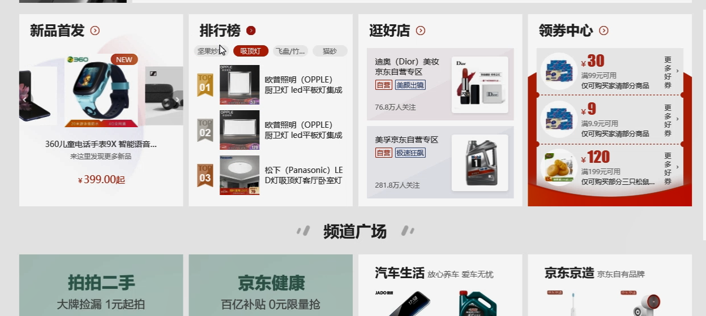

