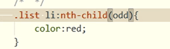
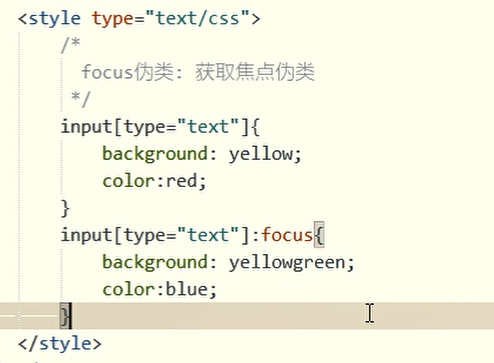

# ICO图标

ico是一种图片格式，通常用在浏览器选项卡中

## 制作ico

www.bitbug.net


当成功生成*favicon.ico*图像文件后,浏览器会自动弹出一个zip的压缩文件
将压缩文件中的*favicon.ico*图像放在根目录下(也可以是其他目录)
在页面源文件的<head></head>标签之间插入
**<link rel="shortcut icon" href=" /favicon.ico" />**


生成以后 通过link标签把ico图标引入    <link rel="shortcut icon" href="favicon.ico">

其中href 要看具体的相对路径，直接引入到 html文件中，该html对应的网页的图标就会改变


# html5简介


# h5新增语义标签

```
<!DOCTYPE html>
<html>
	<head>
		<meta charset="utf-8">
		<title></title>
		<style>
			header{
				width:1200px;
				height:50px;
				
				margin:0 auto;
				background-color: black;
				
			}
			nav{
				width:1200px;
				height:40px;
				background-color: blue;
				margin:0 auto;
			}
			section{
				width:1200px;
				height:1000px;
				border:2px solid red;
				margin:0 auto;
			}
			aside{
				float:left;
				width:300px;
				background: greenyellow;
				height:1000px;
			}
			article{
				float:left:
				width:900px;
				height:1000px;
				background-color: grey;
			}
			footer{
				height:30px;
				width:1200px;
				background: gold;
				margin:0 auto;
			}
		</style>
	</head>
	<body>
		<header>头部标签</header>
		<nav>导航标签</nav>
		<section>
			<aside>侧边栏</aside>
			<article>文章标签</article>
		</section>
		<footer>底部标签</footer>
	</body>
	
</html>
```


用的都不多，只有 nav相对多一点

# h5新增标签属性

- 禁用属性disabled ，给输入框加就是直接进不去，给按钮使用就是按钮点不下去
- 属性required 必须被填上
- 自动获取焦点 autofocus ，其值也是autofocus ，在第一次进入该页面或者刷新页面的时候文本框自动获取焦点
- 提示文本 placeholder
- 自动补全 autocomplete 默认是off  该属性还需要配合name属性，将成功提交的文本存储到下拉列表

```
<!DOCTYPE html>
<html>
	<head>
		<meta charset="utf-8">
		<title></title>
		<style>
		</style>
	</head>
	<body>
		<input type="text" disabled="disabled">
		<input type="value" disabled="disabled">
		<br>
		<hr>
		<form action="www.baidu.com">
			<input type="text" required="required">
			<input type="text" placeholder="请输入">
			<input type="text" autofocus="autofocus">
			<input type="text" autocomplete="on" name="zzz">
			<input type="submit" value="提交">
		</form>
	</body>
	
</html>
```


刷新后


试图空文本框提交


## 新增表单类型

type = 什么 变多了

type=

- "email" 邮箱数据类型，会进行部分正则表达式匹配
- "url"   网址类型，会进行部分正则表达式匹配
- "datetime-local" 本地时间类型
- "month" 月类型
- "date" 日类型
- "week" 周类型
- "color" 颜色
- "range" 滑块

```
<!DOCTYPE html>
<html>
	<head>
		<meta charset="utf-8">
		<title></title>
		<style>
		</style>
	</head>
	<body>
		<input type="email">
		<input type="url">
		<input type="datetime-local">
		<input type="color">
		<input type="range">
		<input type="month">
		<input type="date">
		<input type="week">
		<input type="submit" value="提交">
	</body>
</html>
```


## 音频标签


音频标签：audio 

属性 

src = 音频文件相对路径

controls = "controls"  控制面板

loops = "loop" 控制循环播放

autoplay = "autoplay" 控制自动播放


```
<!DOCTYPE html>
<html>
	<head>
		<meta charset="utf-8">
		<title></title>
		<style>
		</style>
	</head>
	<body>
		<!-- 引入单个音频 -->
		<audio src="music/yinyue.mp3" controls = "controls" loop = "loop" autoplay="autoplay"></audio>
		<!-- 引入多个音频 -->
		<audio controls = "controls" loop="loop" autoplay="autoplay">
			<source src = "music/yinyue.ogg"></source>
			<source src = "music/yinyue.MP3"></source>
		</audio>
	</body>
</html>
```


## 视频标签

视频标签：video

属性 

src = 视频文件相对路径

controls = "controls"  控制面板

loops = "loop" 控制循环播放

autoplay = "autoplay" 控制自动播放


```
<!DOCTYPE html>
<html>
	<head>
		<meta charset="utf-8">
		<title></title>
		<style>
		</style>
	</head>
	<body>
		<!-- 引入单个音频 -->
		<video src="music/movie.mp4" controls = "controls" loop = "loop" autoplay="autoplay"></video>
		<!-- 引入多个音频 -->
		<video controls = "controls" loop="loop" autoplay="autoplay">
			<source src = "music/movie.mp4"></source>
			<source src = "music/movie1.mp4"></source>
		</video>
	</body>
</html>
```


# 兄弟选择器


凡是普通选择器都是 id class 标签选择器三种都可以


兄弟选择器格式

兄弟的含义是：处于同一个层级的标签彼此之间称为兄弟，他们具有相同的缩进，**具有相同的父元素(标签)**

选择器的作用施加于后面那个选择其

第一种

```
普通选择器1+普通选择器2{
}
```

该属性作用于**普通选择器2**，但是该普通选择器2前面必须紧紧贴着一个普通选择器1，之间不能有任何其他元素参杂。


第二种 

```
普通选择器1~普通选择器2{
}
```

该属性作用于普通选择器2，该普通选择器2前面必须要有普通选择器1，只要有即可，不用紧贴着


```
<!DOCTYPE html>
<html>
	<head>
		<meta charset="utf-8">
		<title></title>
		<style>
			div~p{
				background-color: aqua;
			}
		</style>
	</head>
	<body>
		
		<div>
			div
			<p>p在div内部</p>
		</div>
		<p>para</p>

		<p>para2</p>
		<p>para3</p>
	</body>
</html>
```


改成div+p{background-color: aqua;}


```
<!DOCTYPE html>
<html>
	<head>
		<meta charset="utf-8">
		<title></title>
		<style>
			.cls1+.cls2{
				background-color: aqua;
			}
		</style>
	</head>
	<body>
		
		<div class="cls1">
			div
			<p class="cls2">p在div内部</p>
		</div>
		<p class="cls2">para</p>

		<p class="cls2">para2</p>
		<p class="cls2">para3</p>
	</body>
</html>
```


变为.cls1~.cls2{background-color: aqua;} 选择器


# 属性(class)选择器

属性选择器，按照 class属性进行选择

第一种

标签[某个属性]{

}

表示选择具有这“某个属性”的标签


第二种

标签[class="属性名"]{
}

表示选择具有 class = "属性名" 的标签，class必须恰好等于该属性名，不能再有别的属性名


第三种

标签[class$="属性名"]{

}

表示选择属性值 以 该属性名结束的标签  。


第四种

标签[class^="属性名"]{

}

表示选择属性值 以 该属性名起始的标签  。


第四种和第三种情况会包含第一种和第二种


```
<!DOCTYPE html>
<html>
	<head>
		<meta charset="utf-8">
		<title></title>
		<style>
			div[title]{
			  具有属性 title 的标签
				width:100px;
				height:100px;
				background: pink;
			}
			div[class = "box2"]{
				恰好 class = "box2" 的标签
				height:50px;
				border:2px solid green;
			}
			div[class$="box5"]{
			  class属性以 box5 结束
				height:70px;
				background-color: blue;
			}
			div[class^="box2"]{
			   class属性以 box5 开始
				background:gold;
				height:70px;
			}
		
		</style>
		
	</head>
	<body>
		
		<div class="box1" title>
			
		</div>
		<div class="box2">
			
		</div>
		<div class="box2 box3 box4">
			
		</div>
		<div class="box4 box5">
			
		</div>
		<div class=" box2 box5">
			
		</div>
		<div ></div>
	</body>
</html>
```


# 伪类选择器

```
父亲选择器 孩子选择器:伪类选择器{

}
```


## 受其他标签影响的

受其他标签影响的是指：伪类选择器不止作用于孩子选择器，如果中间参杂了其他的非指定的孩子选择器的选择器，也会作用上去




:nth-child(写序号)

 

:nth-child(1)  表示第一个子元素 

:nth-child(odd) 表示子元素中第**奇数**个  

:nth-child(even) 表示子元素中第**偶数**个 


:nth-child(n)  n 从 0 开始   0 1 2 3 4 以及往后都代入表达式


必须 .box 标签里面有 span元素，并且该span 元素是唯一的，这种情况选择器才生效

.box 不允许有多个span元素或者只有一个span但是又有其他的非span元素。


## 不受其他标签影响的


对应的

.list li:last-of-type{

}


不受其他标签影响的是指：无视除了指定的子类选择器以外的其他选择器，伪类选择器的效果只作用于指定的子类选择器。


:nth-of-type(可以数字 odd even 表达式 ) 和上面一样


.box 标签内只能有唯一一个span标签，不能有多个span标签，但是内部有没有其他杂质标签无所谓，因为不受其他标签影响


# 状态选择器


## focus伪类

鼠标悬停在该元素上时要做出什么反应。





## checked伪类


