# JavaScript简介


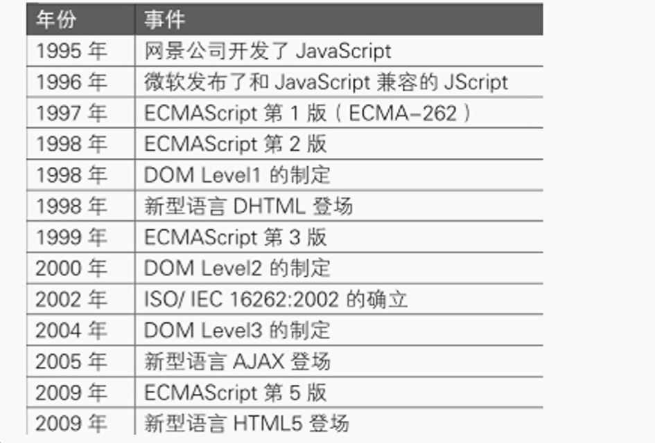


JavaScript由3部分组成


# JS输出语句

js脚本语言，直接在浏览器运行

脚本语言需要写在 script标签内 


- alert() 通过警告框的方式显示语句
- console.log()   打印日志显示到浏览器控制台
- document 表示当前这个网页，一个网页就是一个document  document.write()  就是在网页中显示语句


alert(值1,值2,...)   只会有第一个值弹出警告框

console.log(值1,值2,...)  日志语句  所有在() 内的值都会输出到控制台，并且用空格间隔

document.write(值1,值2,...)    () 内的所有值都会打印到页面不进行分隔


```
<!DOCTYPE html>
<html lang="en">
<head>
    <meta charset="UTF-8">
    <title>Title</title>
</head>
<body>
<script>
<!--    浏览器弹出警告框-->
    alert("今天天气真不错")
    //在控制台显示日志
    console.log("你好世界")
    //document 表示当前这个网页，一个网页就是一个document
    document.write("这个世界真美好")
</script>
</body>
</html>
```


# JS编写位置

- 和html写在一起，html标签有且只有 head 和 body标签。script标签只能写在head标签和body标签内部

  

  这么写语法上不对，但是浏览器会帮我们矫正但是还是不建议

- js代码编写在外部.js文件中通过**script**标签引入

  给script标签设置属性 src ，src 表示本html文件相对于要引入的.js文件的相对路径 

  

  不允许script 既src引入又在 script标签中写  ，可以写多个js标签

  

- 可以将js标签编写在特定标签的特定属性中。

  满足某些事件再执行js代码

  ```
  <!DOCTYPE html>
  <html lang="en">
  <head>
      <meta charset="UTF-8">
      <title>Title</title>
  </head>
  <body>
  点击按钮后弹出 警告框
  <button onclick=alert("你点我干嘛")></button>
  </body>
  <!--<scipt></scipt>-->
  </html>
  ```

- 可以将js代码编写在href属性后面 前面加上 javascript:

  ```
  <!DOCTYPE html>
  <html lang="en">
  <head>
      <meta charset="UTF-8">
      <title>Title</title>
  </head>
  <body>
  点击该超链接后弹出对话框而不是跳转
  <a href=javascript:alert("你好世界")>好耶</a>
  </body>
  <!--<scipt></scipt>-->
  </html>
  ```

  

# 基本语法

单行注释 //

多行注释 /**/

- Js中每一个语句都应该以分号结尾
- JS中严格区分大小写
- JS会忽略多个空格和换行，所以可以通过空格和换行来对代码进行格式化

# 变量和字面量和常量

字面量

字面量就表示的是一个值，它所表示的意思就是它的字面意思

比如：1，2，3，‘’hello“  true ....

字面量可以在js中直接使用，但是通常不会这么做


变量

变量可以用在存储字面量，一个变量可以存储任意类型的字面量

我们一般都是通过变量去存储字面量而不是直接使用字面量

const

用来声明一个常量，常量只能进行一次赋值无法修改


声明变量，我们用let(var 已经不用了)，进行声明。

javascript是一个弱类型的语言，和python一样，编译时没有数据类型

不会写成 string s = "你好"  而是写成 let s = "你好"


```
<!DOCTYPE html>
<html lang="en">
<head>
    <meta charset="UTF-8">
    <title>Title</title>
</head>
<body>
<script>
    let a = 100;
    a="你好世界";
    alert(a)
    alert("你好世界")
    const b = 200;
    // b= 40  无法进行修改
</script>
</body>
<!--<scipt></scipt>-->
</html>
```


# MDN的使用

网站

[MDN Web Docs (mozilla.org)](https://developer.mozilla.org/zh-CN/)

# 标识符

1. 在程序中所有的可以自主命名的内容都可以认为是标识符

   比如：变量名、函数名、类名

2. 标识符需要遵循如下规范

   - 标识符中可以含有字母、数字、_、$，但是不能以数字开头
   - 标识符不能是 JS 中的关键字和保留字

3. 标识符需要遵循驼峰命名法

   驼峰命名法：首字母小写，每个单词开头字母大写


# 基本数据类型

基本数据类型：

基本数据类型是整个js世界的基石

- 数值(number)
- 字符串(string)
- 布尔值(boolean)
- 空值(null)
- 未定义(undefined)


## typeof 内置运算符号

typeof 是一种运算符，得到数值对应的的基本数据类型


## 数据类型-字符串

数据类型(值的类型)

字符串(string)

- js中的字符串需要使用引号引起来

- 双引号或单引号都行但是不能混合使用

- 引号不能跨行使用，同类型的引号不能嵌套

- js中使用 \ 作为转义字符

  ```
  \' 表示 '
  \" 表示 "
  \n 表示 换行
  \t 表示 制表符
  \\ 表示 \
  ```


```
<!DOCTYPE html>
<html lang="en">
<head>
    <meta charset="UTF-8">
    <title>Title</title>
</head>
<body>
<script>
    let s1 = "nihao"
    let s2 = 'nihao1'
    let s3 = 'niha"o1'
    let s4 = "niha'o1"
    let s5 = "niha\"o"
    let s6 = 'nih\nnao'
    console.log(s6)
    document.write(s6)
</script>
</body>
<!--<scipt></scipt>-->
</html>
```


### 模板字符串

使用反单引号`来创建模板字符串

```
let s1 = `nihao世界${a}`;
{a} a是变量
我的代码中后面那个 ` 不需要
```

特点

1. 可以换行，并保留字符串中的格式
2. 在模板字符串中可以直接嵌入变量

```
<!DOCTYPE html>
<html lang="en">
<head>
    <meta charset="UTF-8">
    <title>Title</title>
</head>
<body>
<script>
    let a = 111;
    let s1 = `nihao世界${a};

             `
    console.log(s1);
    document.write(s1);

</script>
</body>
<!--<scipt></scipt>-->
</html>
```


## 数据类型-数值

在 JS 中，所有数值包含整数和浮点数(小数)都属于number类型

在JS中可以确保大部分的整数运算得到一个精确的结果

在JS中，小数运算有可能得到一个不精确的结果。所以JS中不要直接对精度要求高的运算，尤其是涉及钱的

当数值超过一定范围后，会使用Infinity来表示 Infinity 表示正无穷

NaN也是一个特殊数字，表示Not a Number 非法数字


 Infinity  和任何其他数字做运算是  Infinity 

NaN 和任何其他数字运算是 NaN

 Infinity  和 NaN 运算结果是 NaN


```
<!DOCTYPE html>
<html lang="en">
<head>
    <meta charset="UTF-8">
    <title>Title</title>
</head>
<body>
<script>
    let n1 = 111;
    let n2 = 10.124;
    let n3 = 'str';
    let n4 = 5432145323564532546545344235466543;
    let n5 = 0.3;
    let n6 = 3546432456435676453546576434675645364;
    let n7 = Infinity;
    let n8 = Infinity + 10;
    let n9 = NaN;
    document.write(n1);
    document.write('<br>');
    document.write(n2);
    document.write('<br>');
    document.write(n3);
    document.write('<br>');
    document.write(n4);
    document.write('<br>');
    document.write(n5);
    document.write('<br>');
    document.write(n6);
    document.write('<br>');
    document.write(n7);
    document.write('<br>');
    document.write(n8);


    document.write('<br><br>');


    document.write(typeof n1)
    document.write('<br>');
    document.write(typeof  n2);
    document.write('<br>');
    document.write(typeof n3);
    document.write('<br>');
    document.write(typeof n4);
    document.write('<br>');
    document.write(typeof n5);
    document.write('<br>');
    document.write(typeof n6);
    document.write('<br>');
    document.write(typeof n7);
    document.write('<br>');
    document.write(typeof n8);
    document.write('<br>');
    document.write(typeof n9);
</script>
</body>
</html>
```


其他进制的数字：

- 二进制 0b 开头
- 八进制 0o 开头
- 十六进制 0x 开头


ES2020 最新标准中，提供了一个新数字类型 bigint 表示大整数。需要在数值后面加上n

大整数运算只能在大整数之间进行。

let num10 = 100n;


## 数据类型-bool和undefined和null

布尔值(boolean)

- 布尔值用来进行逻辑判断

- 布尔值只有两个

  true 真

  false 假


内置函数 typeof 

使用typeof 检查一个数值的数据类型


**null 通常用来表示一个空的对象**，一个不存在的东西。null类型只有一个值，就是null。

使用 typeof 检查一个null时，它会返回'object'


undefined 表示未定义，当我们**定义一个变量但是没有进行赋值**时它就是 undefined。undefined类型的值只有一个，就是 undefined

使用 typeof 检查一个undefined 时，会返回 'undefined'


如果希望 表示一个值是空的，要用 null表示而不是 undefined


```
<!DOCTYPE html>
<html lang="en">
<head>
    <meta charset="UTF-8">
    <title>Title</title>
</head>
<body>
<script>
    let a1 = true
    let a2 = null
    let a3 = undefined
    document.write(a1)
    document.write('<br>');
    document.write(a2)
    document.write('<br>');
    document.write(a3)
    document.write('<br>');
    document.write(typeof a1)
    document.write('<br>');
    document.write(typeof a2)
    document.write('<br>');
    document.write(typeof a3)
    document.write('<br>');
</script>
</body>
</html>
```


## 变量内存分配

变量存储的并不是值本身，而不是值的地址。

值本身是不可变的.  

- 数值(number)
- 字符串(string)
- 布尔值(boolean)
- 空值(null)
- 未定义(undefined)

这五个基本数据类型都是不可变的值类型

a = a + 1  数值 10 没有改变，而是新创造出来了 数值11， 10依旧在那个位置，但是没有被任何变量引用了  


# 类型转换—转换成字符串


# 类型转换—转换成数值


# 类型转换—转换成bool型


# 运算符


# 算数运算符


# 拼串


# 一元+-运算符


# ++ -- 运算符


# 赋值运算符


# 逻辑运算符


# WS模板设置


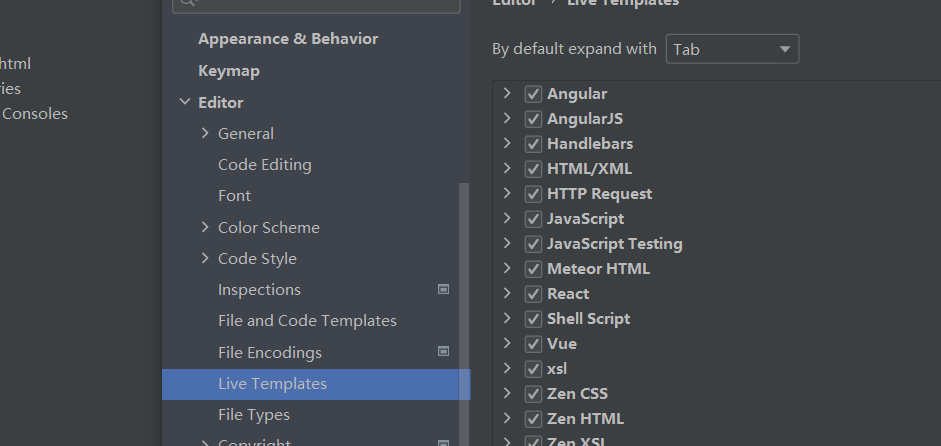


创建一个模板组


输入 Abbreviation 中的值会出现 template text 中的值

我们 输入 sc 再按 tab 就会出现 <script></script>


# 关系运算符


## 相等运算符

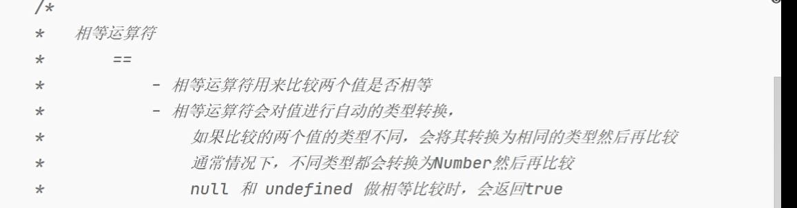


# 条件运算符


# 运算符的优先级


# 可选链操作符


# 获取用户输入函数


# 代码块


# 流程控制语句


# 条件判断语句if


if默认只控制紧跟其后的那条语句(如果不加大括号)，我们一般都是要加大括号


if(){


# 条件分支语句switch


# 循环语句


# while语句


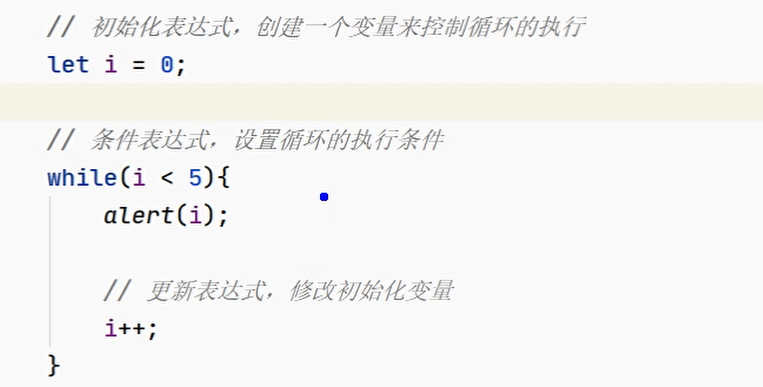

# dowhile循环


# for循环


# 循环嵌套


# break和continue


# 计时器函数


console.time()

console.timeEnd() 计时器取名 括号内可以写计时器的名字


# 对象


# 对象的属性


# 改对象和改变量


# 对象补充


不允许修改 句柄的引用的那个地址值


# 对象属性枚举


# 对象字面量


# 垃圾回收


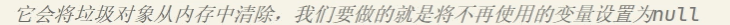

# 函数简介


# 函数的语法和参数


# 函数返回值


# 函数补充


参数可以是任何类型的值，甚至是一个匿名函数


对参数修改会不会影响主函数中的参数

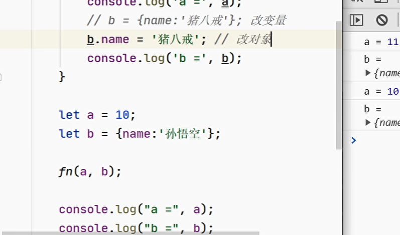

返回对象


返回一个匿名函数


调用匿名函数


该函数只能调用一次，这是立即执行函数，IIFE 函数


# 作用域

# 全局作用域


# 变量的提升


函数提升的同时该函数也同时被创建了，变量提升只会让这个变量被声明但是还没有进行赋值操作


直接报错

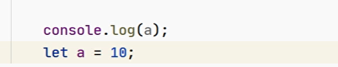


function开头也会被提升，是函数提升

var n2 = function(){} 是变量提升,但是此时 n2 还是undefined ，因此不能 n2() 调用函数会报错


# 调试

不让程序瞬间跑完。


打开浏览器开发者工具，源代码


作用域就是变量的作用域

监视能够监视变量

设置断点


我们再进行刷新


看一眼全局作用域


添加监视


进行调试模式下的控制


webstorm 内部也可以进行调试


# 函数作用域


函数作用域是小的全局作用域


# 作用域链


函数一旦定义完，其作用域就在函数体的大括号中


变量查找要从函数定义位置开始寻找


# this


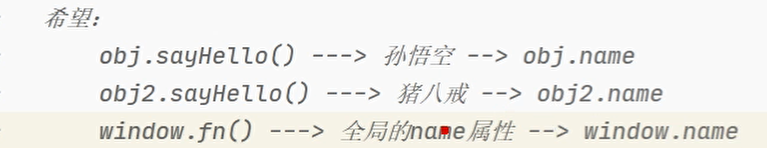

我们希望让方法能够获取谁调用了这个方法(获取调用了这个方法的对象)


```
以函数形式调用   函数名(),这个函数被定义在全局作用域中
以方法形式调用  对象名.方法名()
```


不写this.  ，name 按照作用域找，可能找到全局作用域的同名变量。

使用this.明确调用本对象的name属性


# 工厂方法创建对象


# 构造函数


区别就是 new 的关键词使用，用到new 关键字的一定是调用了构造函数


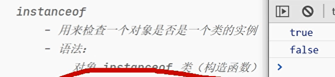


添加方法，三个对象各有三个sayHello方法


将sayHello() 定义为全局，并且类的内部添加一个指向该方法的变量


我们只希望这个函数被对象调用，并且全局函数命名导致别的全局变量无法使用这个命令


规避用原型

# 原型


prototype 也是对象


前面双下划线表示隐含属性


值可以是变量也可以是函数


# 检查对象有没有某个属性


第一个 true ，第二个 false


hasOwnProperty 方法(属性)是哪里来的，我们为什么能调用？

# 原型链

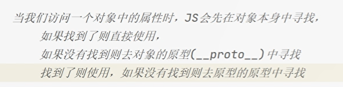


true

hasOwnProperty 存在于原型的原型中


null


检查 p1 的原型链上 有没有 Person


Object 是所有对象的祖先


找变量用作用域链，找属性(对象的属性和对象的方法)用原型链


创建对象时候，独有的，在构造函数内通过this添加，公共的，在构造函数 prototype属性中添加


文档中，这种写法的叫做实例方法，要通过对象调用的方法


静态方法，直接通过 类名(构造函数)调用


# toString方法


如何让 toString 方法打印有效信息

进行toString方法重写


# js中的对象


# 数组


# 数组字面量


确保数组存储的是同种数据类型


# 数组遍历


正着和倒着


使用for in


# 数组四种方法


unshift ：数组看成队列，队首添加


shift：删除并返回队首第一个元素

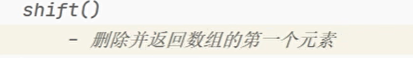


# slice 和 splice


如果不写第二个参数，则表示一直截取到数组结束。


第三个参数以及往后就是要进行替换的元素


进行元素插入


# 浅拷贝深拷贝


深层的对象没有进行复制

只复制了数组对象本身


深复制通常会限制复制多少层


# forEach


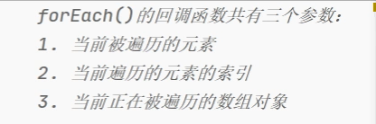


# 数组的方法

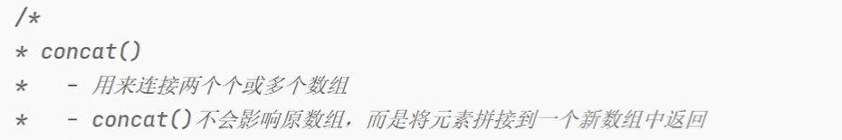

arr.concat(可以有多个参数)

arr.concat(参数1,参数2,参数3,参数4...),会全部拼接成新的数组，而对每一个原数组都没有影响


indexOf函数

indexOf(你要查询的元素,从哪个索引开始查找)


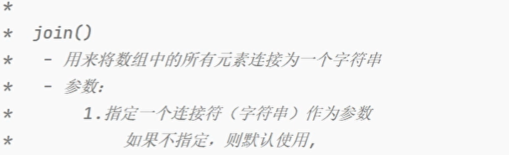


# 函数的arguments参数


实参的存储和定不定义形参没有任何关系


# call和apply


call和 apply的作用都是指定函数中的this

这样写this是 window

其中，obj是对象，fn是该对象的方法


# 函数递归


注意左边标志


# 快速排序


第一次快速排序

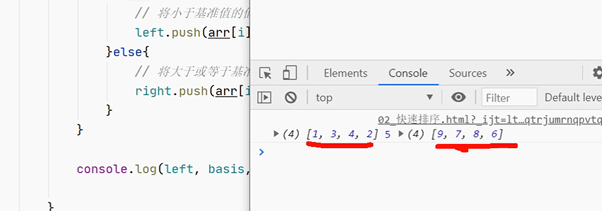


尾递归


设置递归出口


# Math类


