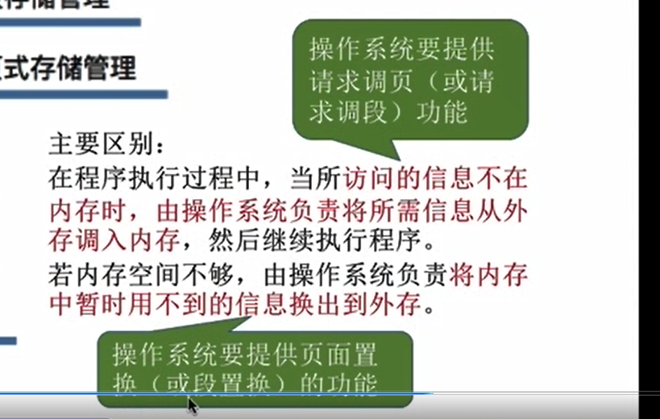
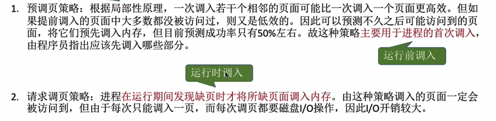
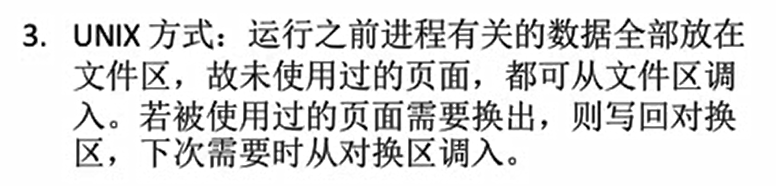

# 九、两级页表

## 单级页表的问题

页表页存在内存中，而且需要连续存储，一整个完全放进内存去。

**也可以把页表进行非连续存储**

## 两级页表的的原理，逻辑地址结构

进程最多有 2 的 20次方 个页面，用 20 位 二进制刚好可以表示 0 到 2的20次方 - 1 个 页号。

每个页面(该内存中的页面用于存储页表)存放 4KB/4B = 1k = 1024 个页表项。

整个完整的页表是 2 的 20 次方项，可以把 这 2的 20 次方 切分成 1024个部分，得到 1024个小的页表

每个小的页表都有自己的编号，以及它们各自的页号都从0开始。小的页表刚好就是1个页框的大小

1 个 完整 页表 = 1024个小页表 = 1024*1024个页表项 = 2 的 20次方

可以为每个小页表建立一个**页目录表**

小页表就变成了2级页表

页目录表记录了 ：**二级页表的页号** 和 **存储其的内存块号**

逻辑地址可拆分为3部分

为什么可以切割为 3 部分

大页表表长 = 内存总数 / 页面长度 ，页面长度 是 2 的多少次方形式，相当于把内存总数位运算右移。高字节部分就表示大页表表长

页目录表表长 =小页表的个数 =  大页表表长 / 1024 (上面说过每个页面存放1024个页表项) 

## 注意

# 十、基本分段存储管理

## 分段

## 段表

段表记录了这个段有多长，以及这个段的始址。

k 号段 的段表项 = 段表的起始地址 + k * 段表项的长度    段表项的长度是相同的。

## 地址变换

CPU执行指令需要将逻辑地址变换为物理地址。

段号 和 段内地址 由逻辑地址得到。

段的长度大小是不相等的，因此段表需要记录段长。页的长度大小是相等的。

## 分页和分段对比

为什么分页管理不适合共享和保护

# 十一、 段页式管理方式

## 分页、分段各自的优缺点

## 段页式管理

唯一段表：针对一个进程的所有段

多个页表：对每一个段设置一个页表。每一个段是连续的放在相邻页框中。

## 段页式管理的地址分配

## 段表和页表

段式管理中，段表由段的起始地址，段的长度组成。

段页式管理中，段表由**页表长度**、**页表存放块号**(即这个段起始存放在哪个页内)组成。页表长度：一个段用了多少个页表组成。

一个进程会对应一个段表。但是一个进程可能会对应多个页表

## 段页式管理地址转换

用户只需要显式地给出段号和段内地址。系统会自动把段内地址拆分为页号和页内偏移量。

# 十二、虚拟内存的基本概念

## 传统存储管理方式的特征、缺点

使用 传统存储管理方式，很多暂时用不到的数据也会长期占用内存，导致内存利用率不高

传统存储管理方式的两个特征

这些问题都可以用虚拟存储技术解决

## 局部性问题

虚拟内存的三个特征

## 如何实现虚拟内存技术

虚拟内存技术必须建立在非连续分配存储管理之上。

主要区别：

- 在程序执行过程中，当所访问的信息不在内存时，由操作系统负责将所需信息从外存调入内存，然后继续执行程序。

  操作系统要提供**请求调页**(或请求调段)功能

- 若内存空间不够，由操作系统负责将内存中暂时用不到的信息换出外存。

  操作系统要提供**页面置换**(或段置换)功能

# 十三、请求分页管理方式

操作系统要判断内存中有没有这个页，如果没有就是缺页，就要把这个页从外存中调入内存

## 页表机制

- 为了实现请求调页，操作系统需要知道每个页面是否已经调入内存；如果还没调入，那么也需要知道该页面在外存中存放的位置。
- 当内存空间不够时，要实现"页面置换"，操作系统需要通过某些指标来决定到底换出哪个页面；有的页面没有被修改过，就不用再浪费时间写回外村。有的页面修改过，就需要将外中的旧数据覆盖，因此，操作系统也需要记录各个页面是否被修改的信息。

请求分页存储管理的页表。每一页表项需要有：

- 状态位：是否已调入内存
- 访问字段：可记录最近被访问过几次，或记录上次访问的时间，供置换算法选择换出页面时参考。
- 修改位：页面调入内存后是否被修改过。
- 外存地址：页面在外存中的存放位置。

## 缺页中断机构

## 地址变换机构

# 十四、页面置换算法

## 最佳置换算法(OPT)

缺页中断后未必发生页面置换

## 先进先出置换算法(FIFO)

## 最近最旧未使用置换算法(LRU)

## 时钟置换算法(CLOCK)

1 3 4 2 5 访问位都为1，扫描后都为0，再扫描 6 3 4 7。 

1变为0，6存放在1的地方，访问位为1

3号又被访问，访问位由0变成1

4号也是又被访问，访问位由0变成1

2号为0，被换出，7号放入其位置

这个过程像时钟转圈。

### 改进型时钟置换算法

如果页面没有被修改过，那么不需要进行覆盖在外存上的操作，外村和内存中的数据是一样的。

# 十五、页面分配策略 抖动

## 页面分配置换策略

## 何时调入页面

## 何处调入页面

## 抖动现象

## 工作集

