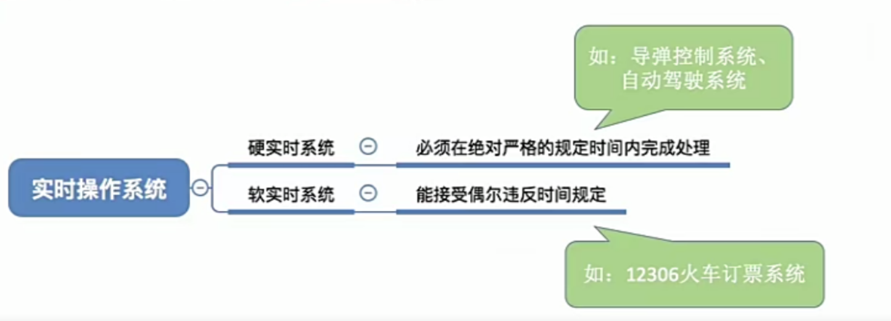
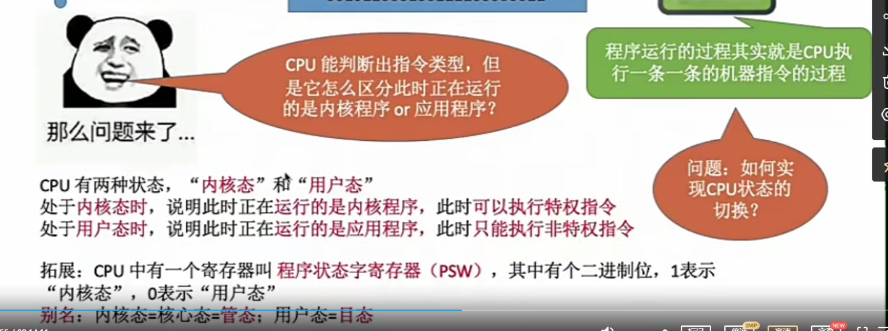

绍操作系统的概念，功能和目标

# 一、操作系统的概念和定义

一台电脑的产生过程：

步骤1，组装裸机，由CPU等硬件设施组成。

步骤2，在裸机上安装操作系统(windows,mac,Andriod)

步骤3，用户拿到电脑，在电脑上安装想要的应用程序

操作系统定义:

操作系统是指控制和管理整个计算机系统的硬件和软件资源，并合理地组织调度计算机的工作和资源的分配，以提供给用户其他软件方便的接口和环境，它是计算机系统中最基本的系统软件

操作系统管理作用的最直观例子：任务管理器

操作系统功能总结：

1. 操作系统是系统资源的管理者
2. 操作系统向上层软件提供方便易用的服务
3. 操作系统是最接近硬件的一层软件

## 系统资源的管理者

执行程序之前，需要将数据从磁盘放入到内存中

能够通过文件夹找到应用软件，点击exe文件执行，就可以做想要的事情

这体现出操作系统的功能：

1. 处理机管理：程序的运行需要对应的进程被CPU处理执行
2. 存储器管理：把要打开的文件的数据从磁盘拷贝到内存中
3. 文件管理：文件夹中找到文件
4. 设备管理：使用电脑的各个部件比如摄像头，喇叭等

## 向上层提供方便应用的服务

硬件只能懂二进制，机器语言，接口效果很差，人看不懂

操作系统对硬件进行一层封装，屏蔽了一些细节

封装思想日常生活中也常用：比如汽车，拆去外壳很复杂，但是用户上手只有刹车，油门，方向盘，不用知道内部怎么工作的

提供的服务举例：

GUI用户化图形接口

现代操作系统都是提供GUI，早期操作系统并没有GUI，而是通过命令接口，即命令行的方式，实现操作系统与人进行交互

### 命令接口

命令接口分为两种：联机命令接口和脱机命令接口

第一种：联机命令接口，又叫交互式命令接口：**用户说一句，系统做一句，有互动**

以windows 为例子：

第二种：脱机命令接口，又叫批处理命令接口

以windows 为例子：

使用windows的搜索功能，搜索C盘中的 *.bat 文件 (表示搜索所有文件格式为 bat 的文件)，用记事本任意打开一个

把一系列要求电脑要做的罗列在清单里，一次提出一堆的请求，然后操作系统一次执行

### 程序接口

**程序接口**：可以在程序中进行**系统调用**来使用程序接口。普通用户不能直接使用程序接口，只能通过使用程序代码间接使用程序接口

比如：我们写c语言 使用 printf 函数打印 helloworld ，printf函数底层就用到了操作系统提供的显示相关的"系统调用"  

系统调用：类似于函数调用，是应用程序请求操作系统服务的唯一方式

有的教材中，系统调用也称为广义指令

有的教材中，会把命令接口和程序接口统称为用户接口

## 最接近硬件的层次

总结

# 二、操作系统的特征

## 并发

并发：实际上是交替进行的

并行：实际上是同时进行的

操作系统的并发性：指计算机系统中同时存在着多个运行着的程序

操作系统就是伴随着"多道程序技术"而出现的。因此，操作系统和程序并发是一起诞生的

注：

单核CPU同一时刻只能执行一个程序，各个程序之间只能并发地执行

多核CPU同一时刻可以同时多个程序，多个程序可以并行地执行，但是并发依旧必不可少

比如 Intel 第八代 i3 处理器就是 4 核CPU，意味着可以并行地执行4个程序。当出现第5个以及往上要执行的程序时，由于最多能够同时处理4个，就需要使用并发了

并发性是操作系统最基本的特征

## 共享

## 并发与共享的关系

## 虚拟

虚拟是指把一个物理上的实体变为若干个逻辑上的对应物。物理实体(前者)是实际存在的，而逻辑上对应物(后者)是用户感受到的。

例子：

一个程序需要放入内存并给它分配CPU才能执行：

GTA5需要4GB的运行内存，QQ需要256MB的内存，迅雷需要256MB的内存，网易云需要256MB

但是电脑的内存为4GB ，物理(实际)内存为4GB

为什么这些程序同时运行需要的内存远大于4GB，那么还可以在电脑上同时运行。

因为虚拟存储器技术，实际只有4GB，在用户看来似乎内存远远大于4GB

虚拟技术中的**空分复用技术**

虚拟技术中的**时分复用技术**，微观上处理机在各个微小的时间段内交替着为各个进程服务

## 异步

由于并发运行的程序会争抢着使用系统资源，而系统中的资源有限，因此进程的执行不是一贯到底的，而是走走停停的(CPU把这个程序执行到一点可能就跳到另一个程序去执行了，这个程序就是暂时闲置)，以不可预知的速度向前推进

如果失去了并发性，即系统只能串行地运行各个程序，那么每个程序的执行会**一贯到底**(非常慢)。

只有系统拥有了并发性，才有可能导致异步性，并发是异步的前提

# 三、操作系统的发展与分类

## 手工操作阶段

完全独占使用，第一个程序没跑完之前绝对不能让第二个程序运行

## 单道批处理系统

监督程序(操作系统的雏形)控制从磁带的输入，和输出到磁带

主要优点：缓解了一定程度的人机速度矛盾，资源利用率有所提升。

主要缺点：内存中仅能有一道程序运行，只有该程序运行结束之后才能调入下一道程序

CPU有大量时间是在空闲等待I/O完成。资源利用率依然很低

一定要让CPU在某个程序需要占据I/O的时候，CPU不是等在那里而是去执行其他程序

## 多道批处理系统

操作系统正式诞生：用于支持多道程序并发运行

主要优点：多道程序并发执行，共享计算机资源。资源利用率大幅提升，CPU和其他资源更能保持"忙碌"状态，系统吞吐量增大。

主要缺点：用户响应时间长，没有人机交互功能(用户提交自己的作业之后就只能等待计算机处理完成，中间不能控制自己的作业的执行

比如：无法调试程序/无法在程序运行过程中输入一些参数)

## 分时操作系统

分时操作系统：计算机以时间片为单位轮流为各个用户/作业服务，各个用户可通过终端与计算机进行交互。

主要优点：用户请求可以被即时响应，解决了人机交互问题。允许多个用户同时使用一台计算机，并且用户对计算机的操作相互独立，感受不到别人的存在。

主要缺点：不能优先处理一些紧急任务。操作系统对各个用户/作业都是完全公平的，循环地为每个用户/作业服务一个时间片，不区分任务的紧急性

## 实时操作系统

## 其他操作系统

# 四、操作系统的运行机制

## 程序是怎么运行的

## 内核程序和应用程序

操作系统内核包含操作系统最必不可少的部分。

## 特权指令和非特权指令

在CPU设计和生产的时候就划分了特权指令和非特权指令，因此CPU执行一条指令(二进制机器码)就能判断出它是条件指令还是非条件指令。

## 用户态和内核态(很重要)

CPU能判断出指令类型，但是怎么区分此时正在运行的是内核程序 or 应用程序？

通过CPU的状态，判断运行的是内核程序还是应用程序。

CPU有两种状态，”内核态“和”用户态“

处于**内核态时**，说明此时正在**运行的是内核程序**，此时可以执行**特权指令**。

处于**用户态时**，说明此时正在**运行的是应用程序**，此时只能执行**非特权指令**

如何切换CPU的状态? 通过寄存器的位

扩展：CPU中有一个寄存器叫 程序状态字寄存器(PSW)，其中有个二进制位，1表示"内核态"，0表示"用户态"

别名：内核态 = 核心态 = 管态 用户态 = 目态

### 用户态和内核态的切换

内核态 切换为 用户态：执行一条特权指令--修改PSW的标志位为"用户态"，这个动作意味着操作系统将主动让出CPU使用权

用户态 切换为 内核态：由"中断"引发,硬件自动完成变态过程，触发中断信号意味着操作系统将强行夺回CPU的使用权

触发中断信号：非法使用特权指令等许多事件都会触发中断指令。这些事件的共性是,但凡需要操作系统介入的地方，都会触发中断信号。

举个例子：
①**刚开机时，CPU为“内核态”**，操作系统内核程序先上CPU运行

②开机完成后，用户可以启动某个应用程序

③操作系统内核程序在合适的时候主动让出CPU,让该应用程序上CPU运行

注：在交出CPU之前，内核程序会用一条特权指令把PSW的标志位设置为“用户态”

④应用程序运行在“**用户态**”

⑤此时，一位黑客在应用程序中植入了一条特权指令，企图破坏系统...

⑥CPU发现接下来要执行的这条指令是特权指令，但是自己又处于“用户态”(看标志位是用户态，说明自己处于用户态)

⑦这个非法事件(用户态妄图执行特权指令是非法的)会引发一个中断信号.

注：CPU检测到中断信号后，会立即变为“核心态”，并停止运行当前的应用程序，转而运行处理中断信号的内核程序

⑧“中断”使操作系统再次夺回CPU的控制权

⑨操作系统会对引发中断的事件进行处理，处理完了再把CPU使用权交给别的应用程序

# 五、中断和异常

## 中断的作用

"中断"会使CPU由用户态变为内核态，使操作系统重新夺回对CPU的控制权。

## 中断的类型

内中断例子

内中断原因：与当前执行的指令有关，中断信号来源于**CPU内部**

- 例子1：试图在用户态下执行特权指令
- 例子2：执行除法指令时发现除数为0
- 例子3：有时应用程序想请求操作系统内核的服务，此时会执行一条特殊的指令——陷入指令(并不是特权指令)，该指令会引发一个内陷中断信号。陷入指令意味着应用程序主动将CPU执行权让了出去，让给内核程序。

外中断例子：

外中断：与当前执行的指令无关，中断信号来源于**CPU外部**

- 例子1：时钟中断——由时钟部件发来的中断信号(时钟部件是计算机的一个硬件)

  

  比如：CPU在执行应用程序一的指令时，时钟部件发出了一个中断信号，CPU就会停止执行当前正在执行的应用程序一，转而去执行处理时钟中断的**内核程序**。执行内核程序的时候发现执行前一个应用程序(即应用程序一)，已经执行一定时间了。该切换执行下一个程序了。然后操作系统内核决定让另一个应用程序上CPU运行，接着切换为用户态，应用程序二上CPU执行。再过一个时间片就又切换回去了。

- 例子2：I/O中断，由输入输出设备发来的中断信号

  比如说，某个应用程序请求打印机打印，当打印机打印完成后，就向CPU发送中断信号，告诉CPU任务完成。

  然后CPU执行处理IO中断的内核程序

  

  每一个指令执行结束之后，CPU都会例行检查有没有外中断信号

  

在一些书中

狭义的中断：外中断        内中断会被直接称为异常。

这里讲的是广义中断。广义中断又分外中断，内中断。

陷阱、陷入：由陷入指令引发的，是应用程序故意引发的。(系统调用实现的原理)

故障：由错误条件引起的，可能被内核程序修复。内核程序修复后会把CPU使用权还给应用程序。让它继续执行下去。比如：缺页故障

终止：由致命错误引起，内核程序无法修复该错误，不会将CPU使用权还给引发终止的应用程序，而是直接终止该应用程序。比如：除数是0，和非法执行特权指令。

## 中断机制的基本原理

# 六、系统调用

## 什么是系统调用

操作系统作为计算机硬件和用户之间的接口，需要向上提供一些简单易用的服务。主要包括命令接口和程序接口。其中，程序接口由一组**系统调用**组成。

## 系统调用与库函数调用的区别

应用程序如果不借助库函数，那么也能通过汇编语言的方式实现系统调用，但很复杂。

高级语言的库函数本质上也是使用了系统调用，是对系统调用的一层封装。

但高级语言的库函数有一些也没有使用系统调用，因为不需要系统调用，比如c语言的Math.h 取绝对值，不需要特权指令也可以完成。

但是有一些就需要特权指令，比如c语言使用库函数进行文件的创建。

## 为什么系统调用是必须的

例子：

## 什么功能要用到系统调用

共享资源的使用都需要系统调用来实现协调

## 系统调用的过程

过程

1. 一个应用程序运行在用户态，执行一系列指令。

2. 当它想要发出系统调用的时候，就使用传参数的指令，向CPU中的寄存器中传递一些必要的参数。

   比如说向某个寄存器中传入参数1，这是用于指明系统调用的类型(比如fork类型系统调用)。以及可能还有更多参数，根据什么类型的系统调用传递。

   操作系统会根据传递的参数来判断程序希望的是哪种类型的服务

   

3. 所需的参数都放到了寄存器当中之后。应用程序就会执行**陷入指令**

   CPU执行陷入指令后会引发内中断。暂停当前应用程序的执行，转而去执行处理陷入指令的内核程序，即相应的中断处理程序，也即系统调用的入口程序。

4. 系统调用入口程序会检查寄存器内的参数，根据寄存器中的参数判断用户需要哪种系统调用服务。

   系统调用入口程序根据用户想要调用的服务对应的处理程序(比如fork系统调用的处理程序)。然后让这段程序上CPU运行。

5. 系统调用处理程序结束后，切换回用户态执行其他程序。

### 结合和库函数

# 七、操作系统的体系结构

## 操作系统的内核

这是计算机的层级结构，以及把操作系统部分进行细化

大内核：把所有功能：不直接涉及硬件的和涉及硬件的都放入操作系统内核里，那么就是大内核。

微内核：只把与硬件关联紧密的模块放入操作系统内核，那么就是微内核。

操作系统内核需要运行在内核态，操作系统非内核功能需要运行在用户态。

对于大内核来说，运行在内核态的功能更多，对于微内核，运行在内核态的功能更少。

## 操作系统的体系结构

变态：CPU状态转换

假如一个应用程序想要请求操作系统的服务，这个服务的处理同时涉及的到进程管理、存储管理、设备管理。

大内核两次变态     微内核六次变态。

