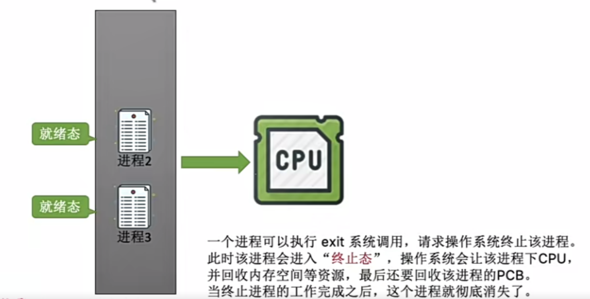
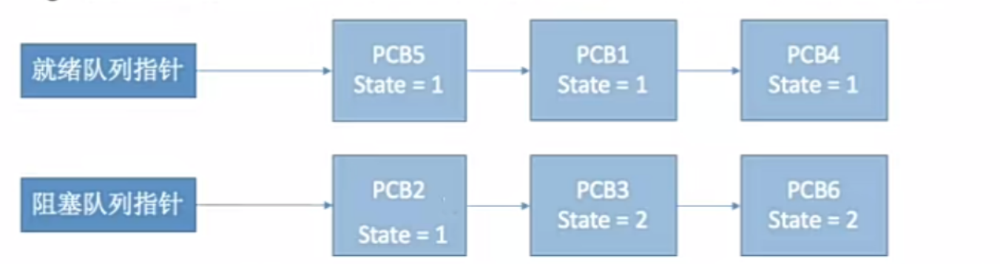
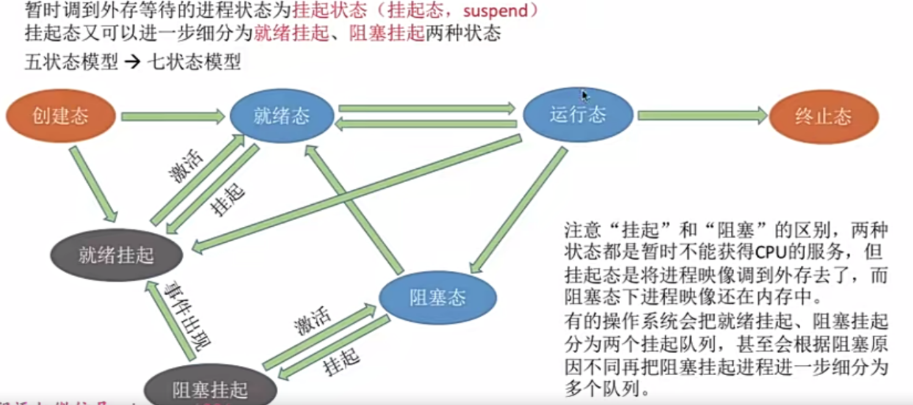
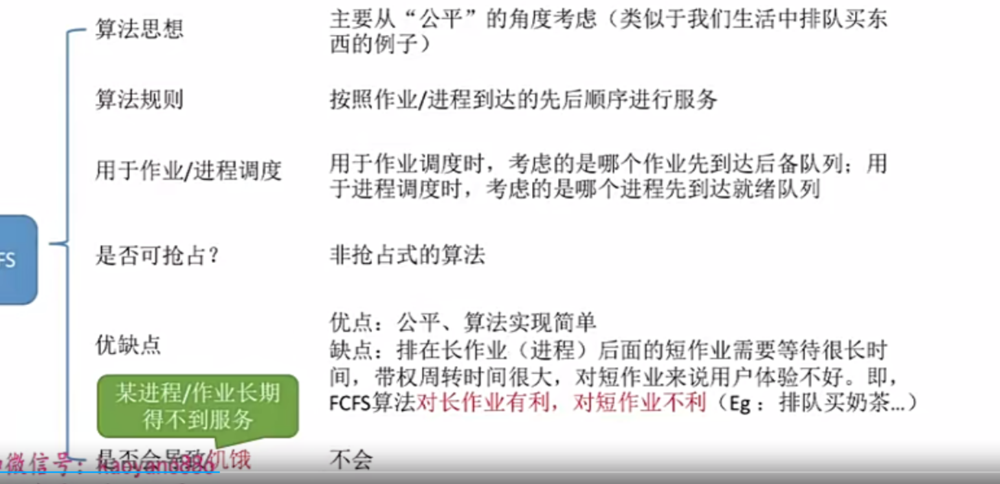
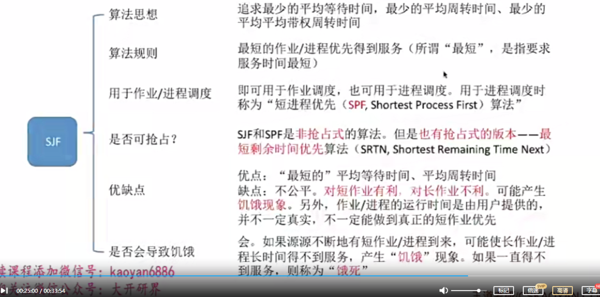
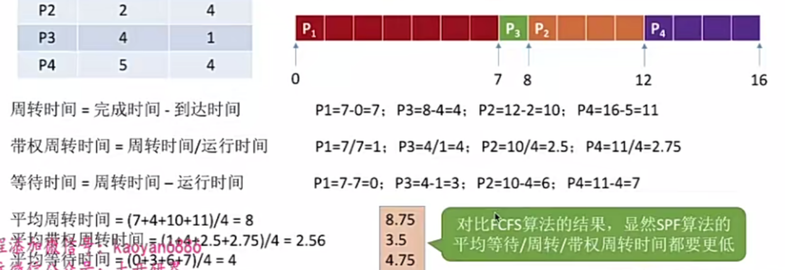
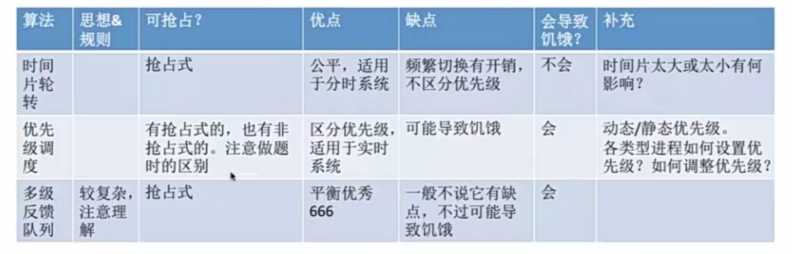

# 一、进程的概念和特征

## 进程的概念

程序：是静态的，就是个存放在磁盘里的可执行文件，就是一系列的指令集合。

进程(Process)：是动态的，是程序的一次执行过程。(同一个程序的多个执行会对应多个进程，如下图)

## 进程的组成PCB

当进程被创建时，操作系统会为该进程分配唯一的，不重复的"身份证号" ——PID (Process ID) 进程ID

每一次新建进程都会分配不重复，新的ID 。PID 是递增的分配的。

操作系统需要对各个并发运行的进程进行管理，但凡管理时所需要的信息，都会被放在**PCB**中。

linux 的 PCB 是 task_struct

## 程序是如何运行的

## 进程的组成

写完一个程序之后经过编译链接等一系列的步骤，最终形成一个可执行文件，windows里就是exe文件，其保存的是一系列指令序列。

在程序运行之前需要把它从硬盘读入到内存当中，操作系统建立与之相对应的进程和PCB。那一系列的指令序列读入到内存当中就形成了程序段。进程执行的过程就是CPU读入一条条指令并执行。执行指令的过程中也有中间的数据。数据段包含运行过程中产生的各种数据。我们定义的变量就是放在数据段里的

一个**进程实体**(进程映像)由PCB、程序段、数据段组成。

进程是动态的，进程实体是静态的。进程实体理解成是进程的进行过程中某一时刻的快照，是进程某一个时刻的状态。

PCB是进程存在的**唯一标志**

## 进程的特征

# 二、进程的状态

## 创建态、就绪态

创建态：进程正在被创建时，它的状态是"创建态"，在这个阶段操作系统会为进程分配资源、初始化PCB

就绪态：当进程创建完成后，便进入就绪"态"，处于就绪态的进程已经具备运行条件、但由于没有空闲CPU，就暂时不能运行。

## 运行态

运行态：如果一个进程此时在CPU上与逆行，那么这个进程就处于"运行态"。

## 阻塞态

在进程运行的过程中，可能会请求等待某个事件的发生(如等待某种系统资源的分配，或者等待其他进程的响应)，如果这一步不完成接下来的步骤都无法继续往下执行。此时操作系统会让这个进程下CPU(剥夺使用权)，并让它进入"**阻塞态**"。CPU空闲时，会选择另一个就绪态进程上CPU运行。

比如某个程序请求打印机，打印机忙，这个程序就下CPU阻塞了

如果阻塞态进程请求的事件但是由于正在被其他进程占用而需要等待(比如：请求打印机)发生了，操作系统就让**阻塞态**进程变成**就绪态**就能够上CPU了。

## 终止态

## 进程状态转换

如果时间片到了，尽管有继续往下执行的条件(不需要请求系统资源)，也会被剥夺CPU执行权，从运行态变为就绪态

为了对同一个状态下的各个进程进行统一的管理，操作系统会将各个进程的PCB组织起来。

如何组织进程的PCB有两种方式 链式方式和索引方式，链式方式更多一点

## 进程的组织——链式方式

很多操作系统会根据堵塞原因的不同再分为多个阻塞队列。

## 进程的组织——索引方式

# 三、进程控制

进程控制的主要功能是对系统中的所有进程实施有效的管理，它具有创建新进程，撤销已有进程、实现进程状态转换等功能。

简化理解：进程控制就是要实现进程控制转化。

## 如何实现进程控制

用**原语**实现

进程状态转换用原语实现，就是说进程控制转化要一气呵成。

思考为什么进程控制转化要一气呵成。

已经知道 PCB中 有state变量，state 为相应值的进程要放入对应队列里。

假设有一个进程(上图中的PCB2为例子)，它处于堵塞状态，某个瞬间，它的事件发生了。则它要从堵塞态转变为就绪态，则负责进程控制的内核程序需要干两件事情。

1. 将该进程的PCB的state设置为就绪态的state
2. 将该进程的PCB从阻塞队列放到就绪队列。

假如完成第一步后收到中断信号，那么就会导致state值改变成就绪队列的state值了，但是还是留在阻塞队列里面,如下图PCB2

如果不能一气呵成，就有可能导致操作系统中的某些关键数据结构的信息不统一的情况，这会影响操作系统进行别的管理工作。

用原语实现一气呵成

## 如何实现原语的一气呵成

**关中断 和 开中断 两个特权指令实现原子性**

正常情况下，CPU每执行完一条指令都会例行检查是否有中断信号进行处理，如果有，则暂停运行当前这段程序，转而执行相应的中断处理程序。

如果执行到了关中断指令，CPU就不再执行例行检查中断信号，直到一直执行到了开中断指令，CPU才会再次进行例行检查。

关中断和开中断之间的指令序列是不可被中断的。

如果关中断，开中断指令允许了应用程序使用，那么应用程序上CPU就可能一直霸占CPU。

关中断，开中断指令只能让内核程序使用。

## 进程控制相关的原语

### 创建原语

作业调度：从外存中挑选一个程序(外存中的程序叫做作业)放入内存中让它运行。

### 撤销原语

### 阻塞原语和唤醒原语

一个进程被什么阻塞就该被什么唤醒

### 切换原语

#### 什么是运行环境

CPU当中会设置很多的寄存器来存放程序运行过程当中所需要的某些数据

CPU当中会有各种各样的寄存器  比如PSW状态字寄存器。CPU状态内核态还是用户态保存在寄存器当中。

PC程序计数器寄存器：存放接下来要执行的指令的地址。

IR指令寄存器：存放当前正在执行的指令。

通用寄存器：其他一些必要信息

假设下图是某个程序的执行

这些指令顺序执行的过程中，很多结果是放在各种寄存器中的。

但注意：这些寄存器并不是只服务于一个进程的。如果其他进程上CPU运行，那么寄存器会服务于其他的进程

后一个进程在上CPU运行后可能会覆盖掉前一个进程运算出来存储在寄存器上的中间结果。

解决方法：在进程切换时先**在PCB中保存这个进程的运行环境**(保存一些必要的寄存器信息)，比如psw，pc，通用寄存器内的信息。当需要重新切换到当前进程时，再把这些数据写到寄存器上就行了。

运行环境：就是运行后寄存器中得到的中间结果。

保存了先前的运行环境才能保证切换进程后又执行这个程序时能够成功。

# 四、进程通信

## 什么是进程通信

进程1可以访问进程1的地址空间，进程2可以访问进程2的地址空间，但是进程1不能直接访问进程2的地址空间。

但是进程间的交互是必不可少的，因此操作系统提供了一些方法。

## 共享存储

两个内存不能互相访问对方的地址空间，但是操作系统会为它们分配一块共享空间。

两个进程的通信就能通过共享空间。但是两个进程对共享空间的访问必须是**互斥**的(互斥是操作系统提供的同步互斥操作)。

共享存储有两种：数据结构的共享，存储区的共享。

## 管道通信

"管道"是指用于连接读写进程的一个共享文件，又名pipe文件。其实就是在内存中开辟一个大小固定的缓冲区。

管道通信要注意：

读进程只能有一个进程进行

## 消息传递

进程间的数据交换以格式化的消息(Message)为单位。进程通过操作系统提供的"发送消息/接收消息"两个原语进行数据交换

消息:

消息传递有两种方式

1. 直接通信方式：消息直接挂起到接收进程的消息缓冲队列上
2. 间接通信方式：消息要先发送到中间实体(信箱)中，因此也称"信箱通信方式"。例子:计网中的电子邮件系统。

间接通信方式

进程1通过发送原语发送消息到信箱

进程2通过接收原语接收消息

# 五、线程、多线程模型

## 什么是线程，为什么需要

还没有引入线程之前，系统的各个程序是只能串行(从头到尾)执行的。

进程是程序的一次执行，但这些功能显然是不可能就由一个程序顺序处理就能实现的。

有的进程同时需要做很多事，而传统的进程只能串行执行一系列程序。为此，引入了线程来增加并发度

传统的进程是程序执行流的最小单位

引入线程后，CPU的服务对象不再是进程而是进程中的线程

比如：qq聊天和qq接收文件，在引入线程两件事后，就可以并发的完成

引入线程之后，线程成为了程序执行流的最小单位

线程以前，一段程序就对应了一段进程，这段程序只能依次往下执行，是串行的。引入了线程后，这些线程都会被并发的执行下去。

现在CPU的服务对象以线程为单位，线程是CPU基本执行单元，实现一个进程内也可以并发处理各个任务。

## 带来的变化

## 线程的属性

# 六、线程

## 线程的实现方式

### 用户级线程

早期的操作系统是用户级线程，操作系统视角来看依旧是只有进程没有线程。

早期操作系统只支持进程不支持线程，当时的线程是由线程库实现的。

比如qq 能够聊天 能够下载文件等同时实现多种功能。在不支持操作系统的时候，就建立多个进程

这3段代码可以并发的运行统一的管理

从代码的角度看，线程就是一段代码逻辑。上述三段代码逻辑上可以看作三个"线程"。while 循环就是一个最简单的"线程库"。线程库完成了对线程的管理工作(如调度)。很多编程语言提供了强大的线程库，可以实现线程的创建，销毁调度等功能。

程序员自己写了线程库来模拟逻辑线程。

总结

- 线程的管理不是操作系统负责的而是用户负责的。
- 线程切换的管理不需要由用户态变化到内核态。
- 操作系统意识不到线程的存在。
- 用户级线程CPU调度基本单位依旧是进程，操作系统是给进程分配CPU，每个进程只能获得一个核心。

优缺点

### 内核级线程

## 多线程模型

在支持内核级线程的系统中：根据用户级线程和内核级线程的映射关系，可以划分为几种多线程模型。

一对一模型：一个用户级线程映射到一个内核级线程。每个用户进程有与用户级线程同数量的内核级线程。

优点：当一个线程被阻塞后，别的线程还可以继续执行，并发能力强。多线程可在多核处理器上并行执行。

缺点：一个用户进程会占用多个内核级线程，线程切换由操作系统内核完成，需要切换到和心态，因此线程管理的成本高，开销大。

一对多模型

退化成用户级线程

这种情况下该进程只会被分配一个CPU

多对多模型

上图中，一个进程有两个内核级线程，因此其中一个内核级线程被阻塞，另一个内核级线程是可以运行下去的。它克服了多对一模型并发度不高的缺点

内核级线程要比用户级线程数量更小，因此操作系统对线程的管理开销也会更小。(克服了1对1模型的要创建过多内核级线程的问题)

用户级线程和内核级线程的区别和联系

用户级线程是"代码逻辑"的载体   代码逻辑:处理业务的，比如qq的消息发送，视频聊天

内核级线程是"运行机会"的载体   

运行机会：内核级线程才是处理器分配的单位。例如：多核CPU环境下，你的内核级线程有多少个，该**进程**最多可能被分配多少核。

该进程最多被分配两个核

一段"代码逻辑"只有获得了"运行机会"才能被CPU执行

内核级线程中可以运行任意一个有映射关系的用户级线程代码，只有两个内核级线程中正在运行的代码**逻辑都阻塞**时，这个进程才会阻塞。

# 七、处理机调度

## 调度的基本概念

调度是什么：当有一堆任务要处理，但是由于资源有限，这些任务没办法同时处理。这就需要确定**某种规则**(比如先到先得或者某种特权)来决定处理这些任务的顺序，这就是 **调度** 研究的问题。

某种规则就是调度算法研究的问题。

## 调度的3个层次

### 高级调度

高级调度也称为作业调度

作业：就是某一个具体的**任务**。 用户向操作系统提供作业就是用户让操作系统启动一个程序(来处理一个具体任务)

启动一个程序就要把这个程序从外存放到内存里面，但这个程序又是有限的，所以有时候内存已经满了，内存资源不足。那我们想让操作系统完成的作业(或者我们想要操作系统启动的程序)有可能没办法把它们放入内存，没办法马上启动。

所以此时操作系统就会进行高级调度

操作系统决定作业调入顺序，程序声明周期中调入调出各一次。程序声明周期结束后调出

### 低级调度

又叫进程调度，处理机调度

操作系统在进程就绪队列当中挑选进程把处理机资源分配给它。

进程调度是操作系统中最基本的一种调度，频率很高

### 中级调度

挂起队列，就类似于 就绪队列，阻塞队列啥的。

#### 进程的挂起状态和七状态模型

把五状态模型扩展到七状态模型

一个处于就绪态的进程，如果此时系统负载比较高，内存要不够用了，它可能把进程进行就绪挂起，一直到内存空间空闲或者进程需要继续执行，就进行激活，回到就绪态。阻塞态类似。

阻塞挂起的状态在它等待的事件完成后可以直接进入就绪挂起的状态。再回到内存就是直接进入就绪态。

运行态的进程下处理器就有可能直接进入就绪挂起状态。创建态创建完PCB内存空间不够也可能进入就绪挂起。

挂起和阻塞有区别：阻塞态在内存，挂起在外存。

### 3层调度联系对比

# 八、进程调度的时机 切换与过程 进程调度方式

## 进程调度的时机

进程调度(低级调度)，就是按照某种某种算法从就绪队列中选择一个进程为其分配处理机

需要进行进程调度与切换的情况

- 当前运行的进程**主动放弃**处理机
  - 进程正常终止
  - 运行过程中发生异常而终止
  - 进程主动请求阻塞(如 等待I/O)
- 当前运行的进程**被动放弃**处理机
  - 分给进程的时间片用完
  - 有更紧急的事需要处理(如 I/O中断)
  - 有更高优先级的进程进入就绪队列

不能进行进程调度与切换的情况

临界资源：一个时间段内**只允许一个进程**使用的资源。各进程需要**互斥地**访问临界资源。

临界区：访问**临界资源**的那段代码。  进程只能互斥地进入临界区，互斥地执行访问临界资源的那些代码。

内核程序临界区(进程的一部分)一般是用来访问某种内核数据结构(内核资源)的，比如进程的就绪队列(由各就绪进程的PCB组成)就是一种内核数据结构。

当一个进程处于**内核程序临界区**，并且这个临界区是要访问内核资源，这里是就绪队列，那么在访问之前，它会对这个就绪队列进行上锁。如果这个进程当前还没有退出内核程序临界区，也就意味着这个临界资源(这里是就绪队列)还没有被解锁。如果在没有解锁的那段时间，如果我们要发生进程调度，那么进程调度相关的程序也需要访问 **就绪队列这个临界资源**，因为它要从就绪队列中挑选一个进程给它分配处理机。由于它被上锁了，因此进程调度没法进行，因为没有解锁。内核程序临界区访问的 临界资源(即内核数据结构)如果临界资源被上锁了并且没有被尽快释放的话，极有可能会影响到操作系统其他的内核管理工作(比如进程切换)。因此在访问内核程序临界区的期间不能进行进程的调度和切换，必须让进程快速的执行完 内核程序临界区部分的代码，执行完后就把内核资源的锁给解除，其他操作系统内核才能进行有序管理操作。

如果进程访问**普通的临界资源**，比如打印机，会对这个临界资源进行上锁，在打印机打印完成之前，进程一直处于临界区内，临界资源不会解锁。但打印机又是慢速设备，此时如果一直不允许进程调度的话就会导致CPU一直空闲(因为进程必须等待把打印机打印这个操作进行完才能继续往下，此时CPU无法继续往下执行而是卡在那里不执行任何指令)

普通临界区访问的临界资源不会直接影响操作系统内核的管理工作。因此在访问普通临界区时可以进行进程的调度和切换。

因此有：

## 进程调度的方式

“狭义的进程调度”与“进程切换”的区别:

**狭义的进程调度**指的是从就绪队列中选中一个要运行的进程。(这个进程可以是刚刚被暂停执行的进程，也可能是另一个进程(普通的就绪队列中的进程)，后一种情况就需要进程切换)

进程切换是指一个进程让出处理机，由另一个进程占用处理机的过程。

**广义的进程调度**包含了 选择一个进程(就绪队列中选择) 和 进程切换 两个步骤。

进程切换的过程主要完成了:

1.对原来运行进程各种数据的保存 （保存在PCB中)

2.对新的进程各种数据的恢复

(如:程序计数器、程序状态字、各种数据寄存器等处理机现场信息，这些信息一般保存在**进程控制块**)

注意:进程切换是有代价的，因此如果过于频繁的进行进程调度、切换，必然会使整个系统的效率降低,使系统大部分时间都花在了进程切换上，而真正用于执行进程的时间减少。

# 九、调度算法的评价指标

## CPU利用率

## 系统吞吐量

## 周转时间

周转时间包括

1. 作业在外存后备队列上等待**作业调度**的时间
2. 进程在就绪队列上等待**进程调度**的时间
3. 进程在**CPU上执行**的时间
4. 进程等待**I/O操作完成**的时间

后三项在一个作业的整个处理过程中，可能发生多次。

有的作业运行时间短，有的作业运行时间长，运行时间长的作业给用户的感觉更好。

比如排队等厕所，本来只要自己只要用1分钟，但是要闻别人的10分钟臭味，整个周转过程是11分钟

如果另一个人，排队只要排1分钟，使用10分钟，周转过程也是11，只不过只有1分钟是等待的，这一分钟等待没有这么糟糕。

平均啥的都是系统关心的

## 等待时间

## 响应时间

# 十、FCFS SJF HRRN调度算法

这3个算法只适合批处理系统

算法提出是为了解决什么问题，采用了什么算法规则，应用于进程调度还是作业调度，各个算法也有抢占式和非抢占式的版本。算法的优点和缺点。是否会导致饥饿

饥饿：某进程/作业长期得不到服务

## FCFS先来先服务

First Come First Service

- 算法思想：主要从"公平"的角度考虑(生活中排队先来先得)
- 按照作业/进程到达的先后顺序进行服务
- 用于作业调度时，考虑的是哪个作业先到达后备队列。用于进程调度时，考虑的是哪个进程先到达就绪队列
- 非抢占式算法
- 优点：公平、算法实现简单
- 缺点：排在长作业(进程)后面的短作业需要等待很长时间，带权周转时间很大，对短作业来说用户体验不好。即FCFS算法对长作业有利，对短作业不利
- 是否会导致饥饿：不会

这几个时间去看 调度算法的评价指标

短作业 P3 带权周转时间 为8，用户体验很不好

## SJF短进程优先算法

短进程优先算法。

- 算法思想：追求最少的平均等待时间，最少的平均周转时间、最少的平均带权周转时间
- 算法规则：最短的作业/进程优先得到服务(所谓"最短"，就是指要求服务时间最短，离运行终止程序结束剩余的时间最短)
- 用于作业/进程调度：即可用于作业调度，也可用于进程调度。用于进程调度时称为"短进程优先(SPF,Shortest Process First)算法"
- 是否可抢占:SJF和SPF是非抢占式的算法。但是也有抢占式的版本——最短剩余时间优先算法(SRTN,Shortest Remaining Time Next)
- 优点："最短的"平均等待时间，平均周转时间
- 缺点：不公平。对短作业有利，对长作业不利。可能产生饥饿现象。另外，作业/进程的运行时间是由用户提供的，不一定真实，不一定能做到真正的短作业优先。
- 是否会导致饥饿：会。如果源源不断地有短作业/进程到来，可能会使长作业进程长时间得不到服务，产生"饥饿现象"。如果一直得不到服务，则称为"饿死"。

最短剩余时间优先算法：每当 **有进程加入就绪队列导致就绪队列改变时就需要调度**，如果新到达的进程运行的剩余时间比当前运行的进程的运行剩余时间**更短**(运行的剩余时间：所需要运行到终止的时间)，则由新进程抢占处理机，当前运行进程重新回到就绪队列。另外，**当一个进程完成时也需要调度**

### 这是非抢占式的

调度顺序 为什么是 P1->P3->P2->P4  

P1 是到的最早的，只有P1能运行。P1运行完后 ,P2,P3,P4全都到了，然后按照 需要的运行时间最短的作业(进程)，所以运行P3。p3运行完后，P2,P4先到达的先运行。

### 这是抢占式的。

规则，即 最短剩余时间优先算法：每当 **有进程加入就绪队列导致就绪队列改变时就需要调度**，如果新到达的进程运行的剩余时间比当前运行的进程的运行剩余时间**更短**(运行的剩余时间：所需要运行到终止的时间)，则由新进程抢占处理机，当前运行进程重新回到就绪队列。另外，**当一个进程完成时也需要调度**

一定要记住：新进程到达就绪队列时就绪队列就会发生改变，就要按**上述规则**进行检查。以下 Pn(m) 表示当前 Pn 进程剩余时间为m。各个时刻（时间轴的时刻）的情况如下：

- 0时刻(P1到达)：P1(7)
- 2时刻(P2到达)：P1(5)：表示P1进程还需要运行5个单位的时间才能结束、P2(4)：表示P2需要运行4个单位的时间才能结束  P2上处理机
- 4时刻(P3到达)：P1(5)、P2(2)、P3(1)   P3 上处理机
- 5时刻(P3到达 并且 P4刚好完成)：P1(5)、P2(2)、P4(4)  P2上处理机
- 7时刻(P2完成)：P1(5)、P4(4)	P4上处理机
- 11时刻(P4完成)：P1(5)    P1上处理机

这些进程的执行是断断续续的。

### 注意几个小细节:

1. 如果题目中未特别说明，所提到的“短作业/进程优先算法”默认是非抢占式的

2. 很多书上都会说“SJF调度算法的平均等待时间、平均周转时间最少”。严格来说，这个表述是错误的，不严谨的。

   之前的例子表明，**最短剩余时间优先算法**(抢占式)得到的平均等待时间、平均周转时间还要更少。应该加上一个条件“在所有进程同时可运行时，采用SJF调度算法的平均等待时间、平均周转时间最少”;或者说“在所有进程都几乎同时到达时，采用SJF调度算法的平均等待时间、平均周转时间最少”;如果不加上述前提条件，则应该说“抢占式的短作业/进程优先调度算法（最短剩余时间优先, SRNT算法）的平均等待时间、平均周转时间最少”

3. 虽然严格来说，SJF的平均等待时间、平均周转时间并不一定最少但相比于其他算法（如FCFS） ,SJF依然可以获得较少的平均等待时间、平均周转时间

4. 如果选择题中遇到“SIF算法的平均等待时间、平均周转时间最少”的选项，那最好判断其他选项是不是有很明显的错误，如果没有更合适的选项，那也应该选择该选项

## HRRN高响应比优先算法

高响应比优先算法

相应比 = (等待时间+要求服务时间)/要求服务时间   要求服务时间：还需要上CPU跑的运行时间

# 十一、调度算法 时间片轮转 优先级调度 多级反馈队列调度算法

各种调度算法的学习思路

1. 算法思想
2. 算法规则
3. 这种调度算法是用于 作业调度 还是 进程调度
4. 抢占式 非抢占式
5. 优点和缺点
6. 是否会导致饥饿

## RR时间片轮转

时间片轮转  Round—Robin

​										补充                                         时间片太小太大会有什么影响

 

### 例子

时间片轮转：用于分时操作系统，这种类型操作系统更关心内存的响应时间

时间片轮转调度算法：轮流让就绪队列中的进程依次执行一个时间片(每次选择额都是排在就绪队列头的进程)

**时间片大小为2**(注：以下括号内表示当前时刻就绪队列中的进程、进程的剩余运行时间)

1. 0时刻(P1(5))：0时刻只有P1到达就绪队列，让P1上处理及运行一个时间片

   

2. 2时刻(P2(4)->P1(3))：2时刻P2到达就绪队列，P1运行完一个时间片，被剥夺处理机，重新放到队尾。此时P2排在队头，因此让P2上处理机(注意：2时刻，P1下处理机，同一时刻新进程P2到达，如果在题目中遇到这种情况，**默认新到达的进程先进入就绪队列**)

   

3. 4时刻(P1(3)->P3(1)->P2(2)) 4时刻，P3到达，先插到就绪队尾，紧接着，P2下处理机也插到队尾

   

4. 5时刻(P3(1)->P2(2)->P4(6)):5时刻，P4到达插到就绪队尾(注意：由于P1的时间片还没有用完，因此暂时不调度，另外，此时P1处于运行态，并不在就绪队列中)。

   

5. 6时刻(P3(1)->P2(2)->P4(6)->P1(1))：6时刻，P1时间片用完，下处理机，重新放回就绪队尾，发生调度。P3上处理机

   

6. 7时刻(P2(2)->P4(6)->P1(1))：虽然P3的时间片没用完，但是由于P3只需运行1个单位的时间，运行完了会主动放弃处理机，因此也会发生调度。队头进程P2上处理机

   

7. 9时刻(P4(6)->P1(1))：进程P2时间片用完，并刚好运行完，发生调度，P4上处理机

   

8. 11时刻(P1(1)->P4(4))：进程 P4 时间片用完，发生调度，回到就绪队列，P1上处理机

   

9. 12时刻 (P4(4)) ：P1运行完了，主动放弃，P4上

10. (14 时刻) 16 时刻   P1下了没东西上，继续P1 ，所以一直运行给你到16时刻。P1结束

**时间片大小为5**

如果按照先来先服务 FCFS

其得到的结果和时间片大小为5的情况差不多

结论：

- 如果时间片太大，使得每个进程都可以在一个时间片内就完成，则 **时间片轮转调度算法** 退化为 **先来先服务调度算法**，并且会**增大进程响应时间**。因此**时间片不能太大**。

  增加进程响应时间例子：系统中有10个进程在并发执行，如果时间片为1秒，则一个进程被响应可能需要等9s...也就是说，如果用户在自己进程的时间片外通过键盘发出调试命令，可能需要等待9秒才能被系统响应。(10个进程，时间片1s，每个进程能跑1秒，一轮下来除了自己以外的别的进程就是9秒)

- 另一方面，进程调度、切换是有时间代价的(保存、恢复运行环境)，因此如果时间片太小，会导致进程切换过于频繁，**系统会花大量的时间来处理进程切换，从而导致实际用于进程执行的时间比例减小**。可见时间片也不能太小。

  一般来说，设计时间片大小的时候，要让切换进程的开销占比不超过1%

  

## 优先级调度

​								是否会导致饥饿                                   会

### 非抢占式优先级调度例子

有的题目也可能时优先数越小，优先级越高。

**非抢占式的**优先级调度算法：每次调度时选择当前已到达且优先级最高的进程。**当且仅当当前进程主动放弃处理机时发生调度**。

### 抢占式优先级调度例子

**抢占式**的优先级调度算法：每次调度时选择当前已到达且优先级最高的进程。**当前进程主动放弃处理机时发生调度**。另外，**当就绪队列发生改变时，也需要检查是否应该发生抢占**

​     11时刻(P1)：P4完成，P1上处理机

​     16时刻（）：P1完成，所有进程均完成。

### 补充

如果采用动态优先级，应该什么时候调整。

## 多级反馈队列调度算法

​								是否会导致饥饿                              会(如果源源不断断进程最高级队列一直有进程，低级队列就无法分配时间片)

### 结合例子理解

1. 设置多级就绪队列，各个队列的优先级从高到低，各个队列的时间片从小到大

   

2. 新进程到达时先进入第1级队列，按FCFS原则排队等待被分配时间片。若用完时间片进程还没有结束，则进程进入下一级队列队尾。如果此时已经在最下级的队列，则重新放回最下级队列队尾。

   例子中：P1先到达，会放入第一级队列，第一级时间片只有1，执行完后P1运行时间还有 7。接着它会进入第二级队列的队尾。

   

   

3. 只有第k级队列为空时，才会为 k+1 级队头的进程分配时间片(优先级更高的进程全都执行完了才执行优先级更低的进程)。

   

   P2进入 执行一个时间片时间   放入第二级队列的队尾

   此时第一级队列为空，开始为第二级队列分配时间片

   

4. 在P1运行完后，进入第三级别队列。P2运行了1个单位时间后，P3来了

   

   此时会发生抢占处理机的情况。P2进程被剥夺处理机，**放回原来队列的队尾**，这里就是第二级队列。

   P3只需要一个时间片，执行完后直接调出内存。

   再给第二队列分配时间片，2个单位时间正好运行完。

   P1在第三队列才分配时间片，运行4个单位时间后还不行，由于它已经处于最下面的队列了，所以回到原队列尾部，再执行依次就执行完成。调出内存
