# 十二、进程同步进程互斥

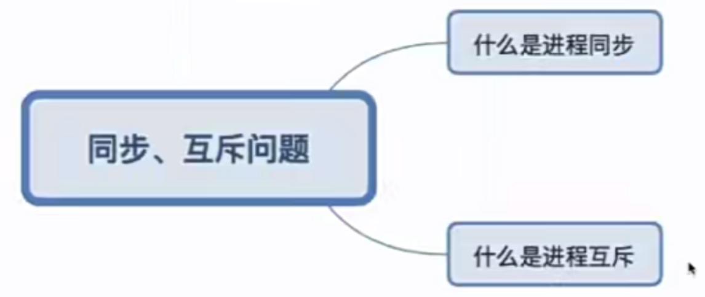

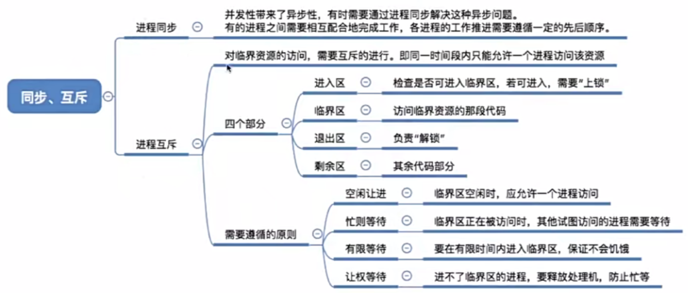

## 什么是进程同步

进程具有异步性的特征。异步性：各并发进程以独自的，不可预知的速度向前推进

举例子

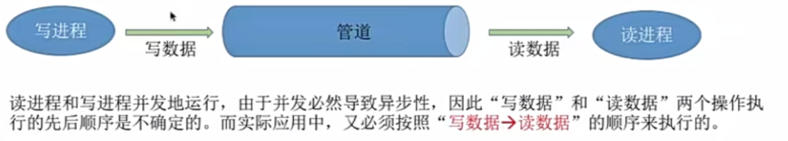

写数据必须发生在读数据之前


同步也称为直接直接制约关系，它是指为完成某种任务而建立的两个或多个进程，这些进程因为需要在某些位置上协调它们的工作次序而产生制约关系。进程间的直接制约关系就是源于它们之间的相互合作


## 什么是进程互斥


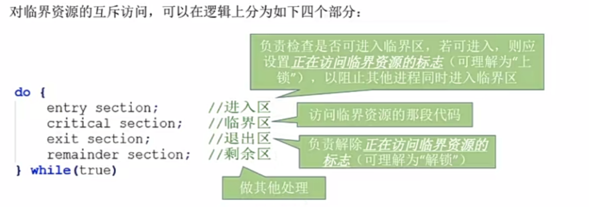


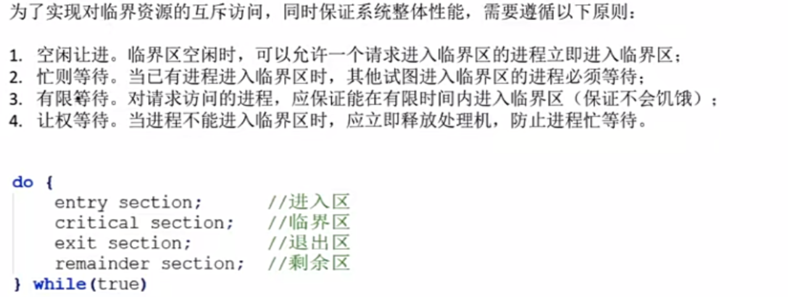


# 十三、进程互斥的软件实现方法


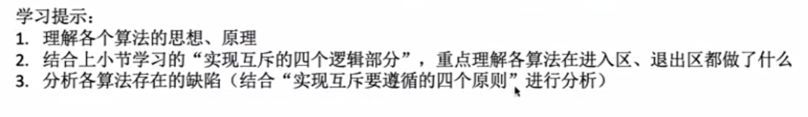

## 如果没有注意进程互斥

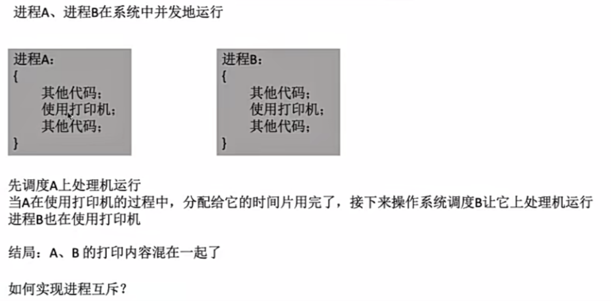

能不能用软件、代码的方式实现两个进程互斥地访问某个资源


## 单标志法

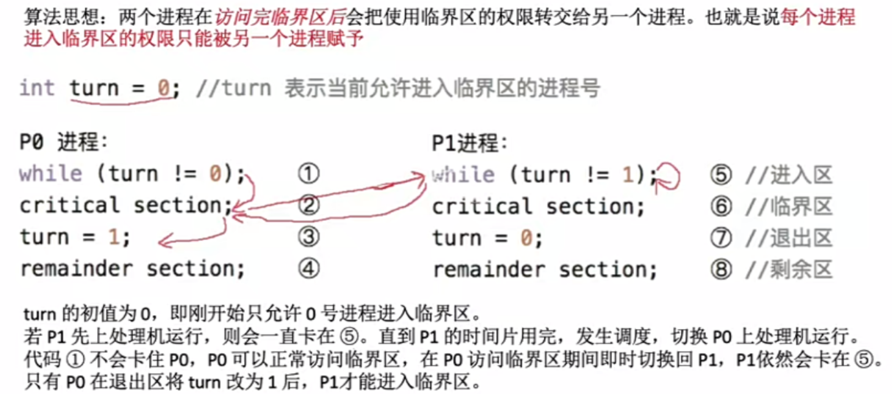


<font  size=5>该算法可以实现同一时刻最多只允许一个进程访问临界区</font>


turn = 0 0号进程能进去

turn = 1 1号进程能进去


turn变量表现出一种谦让，其实是 P0 进程 把临界资源谦让给了 turn(把turn的值变为1了 )


<font  size=4>只能按 P0->P1->P0->P1这样轮流访问。这种必须"轮流访问"带来的问题是，如果此时允许进入临界区的进程是P0，而P0一直不访问临界区，那么虽然此时临界区空闲，但是并不允许P1访问(因为P1刚刚谦让出去了)。因此，</font><font color=red size=4>单标志法的主要问题是：违背"空闲让进"原则</font>

空闲让进原则：临界区空闲时，可以允许一个请求进入临界区的进程立即进入临界区


## 双标志先检查法

检查别人想不想进入临界区，如果没人想进去，就表达自己想要进入的意愿

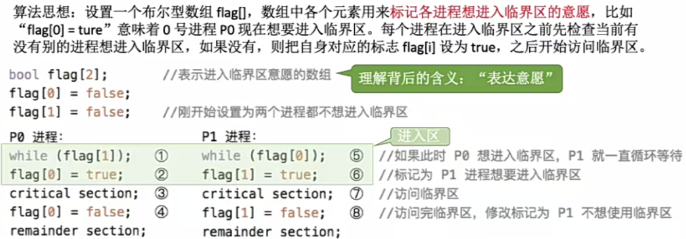


问题：如果P0和P1 同时进入临界区  下图中如果 P0进程和P1进程 并发运行，按照 1(进程切换) 5 6 7(进程切换) 2 3  就造成了 P0和P1进程同时进入临界区 

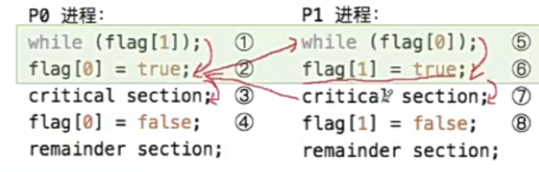

问题：违背了"忙则等待"


## 双标志后检查法

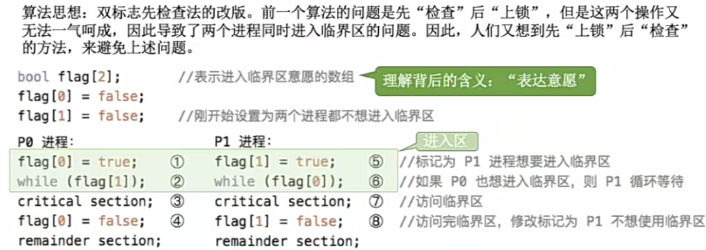

P0和P1 并发进程，如果 按照  1  5  2  6。 P0和P1 都进入不了临界区。

问题:违背了”空闲让进“原则，"有限等待"原则

## Peterson 算法

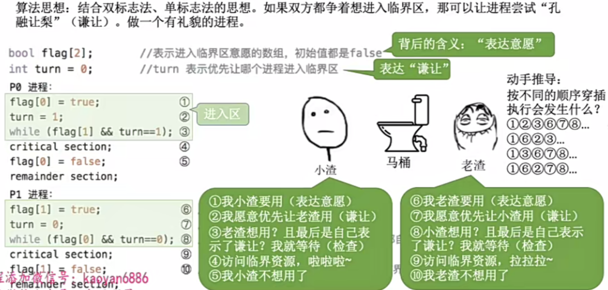

流程

- 先表示本进程想要使用这部分临界资源   flag值对应位置设置
- 然后表示自己愿意谦让   turn值设置为别的进程的编号
- 然后时刻监测别的进程是否愿意谦让，或者是否不想使用	while循环，这两个有其中一个满足，就进入
- 访问完后，表示自己不想使用了。

考虑并发运行的环境

1 2 3 6 7 8    P0  切换到 P1   在P1 执行不下去，卡在while循环 ，会回到 P0，P0可以执行

1 6 2 3     P0可以 执行

1 6 2 7 8  可以在 P1运行下去


但是依然不够好，因为  while 循环那句一直在运行，也在一直占用CPU

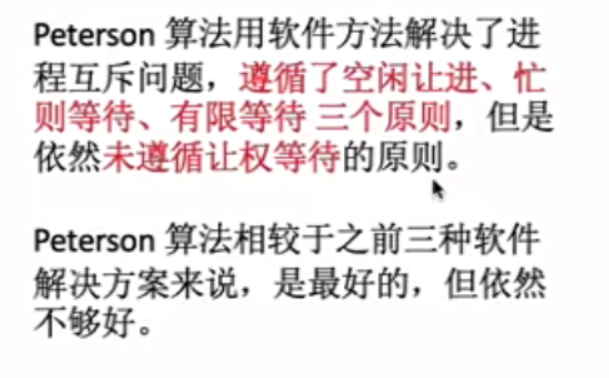

## 总结

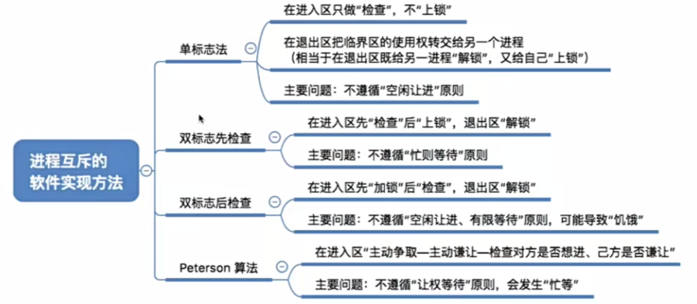

双标志先检查其实比较好的，问题是 **检查和上锁两步不能做到一气呵成**。


# 十四、进程互斥的硬件实现方法

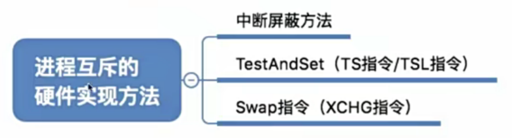

## 中断屏蔽方法

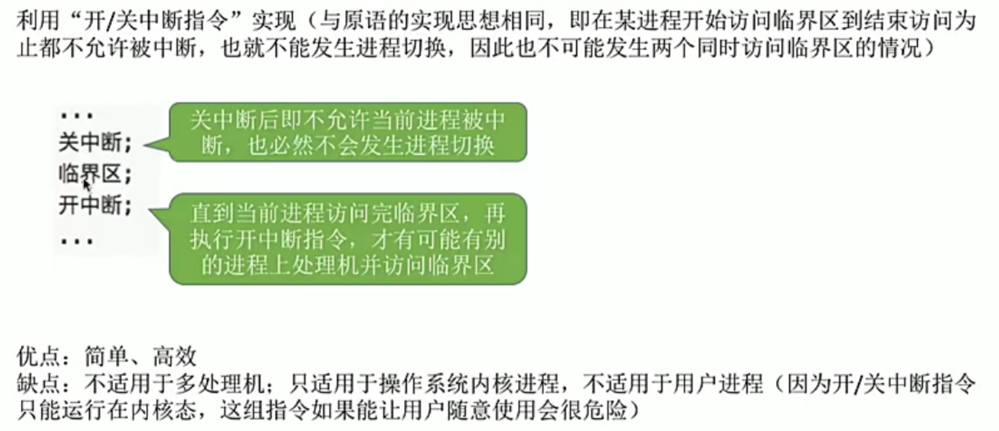

## TestAndSet(TS指令/TSL指令)

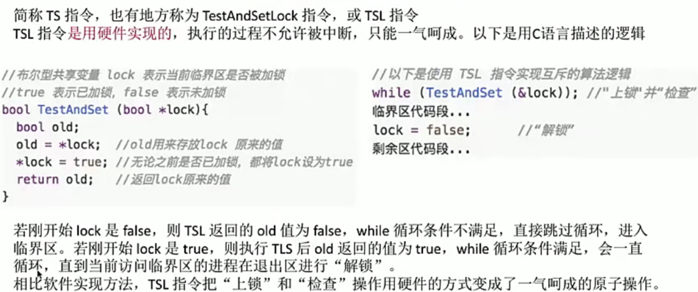

<font size = 4>优点：实现简单，无需像软件实现方法那样严格检查是否会有逻辑漏洞；适用于多处理机环境</font>

<font size= 4>缺点：不满足“让权等待”原则，暂时无法进入临界区的进程会占用CPU并循环执行TSL指令，从而导致"忙等"</font>


## Swap指令(XCHG指令)

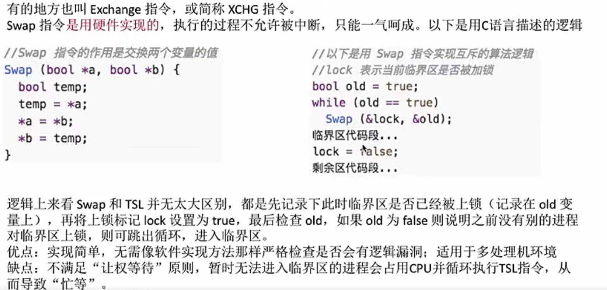

## 总结

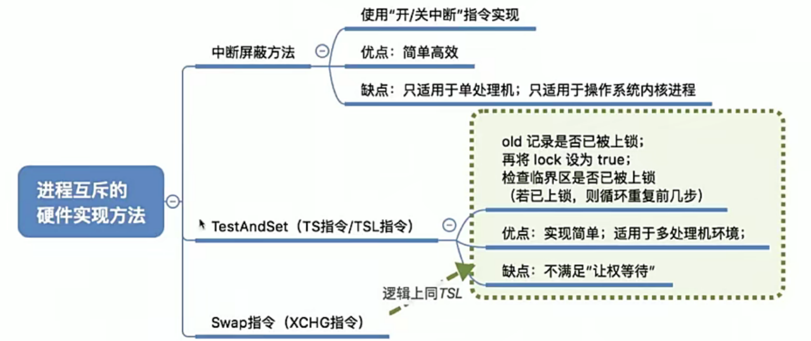


# 十五、信号量机制


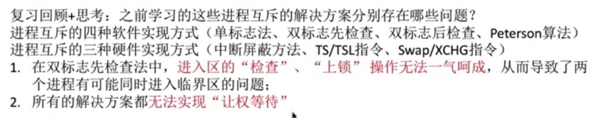

无法实现"让权等待"，就都是"忙等"


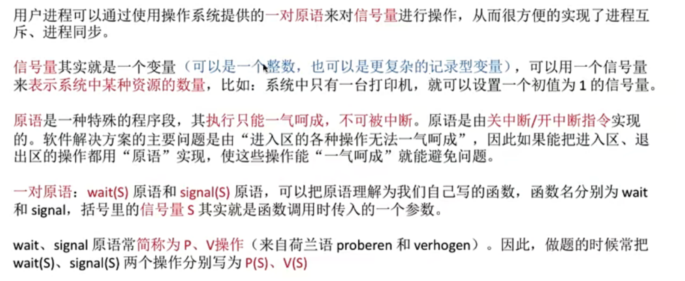

信号量是一种变量，用来表示系统中某种资源的数量。

可以用系统提供的一对原语(wait 原语 和 Signal 原语)来对信号量进行操作


## 整型信号量

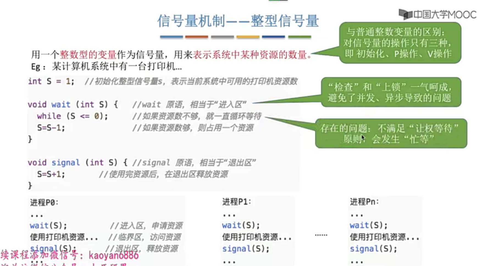

存在的问题，不满足让权等待，会发生 忙等


## 记录型信号量

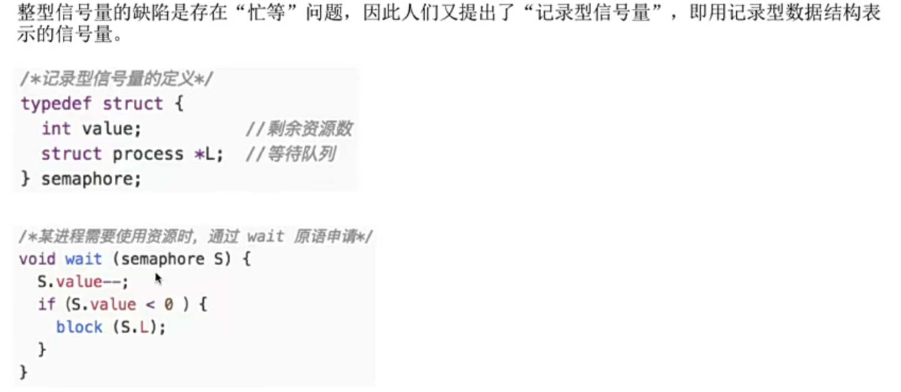


如果剩余资源数不够，使用 block 原语使进程从运行态进入阻塞态，并把进程挂到信号量S的等待队列(即阻塞队列)中。

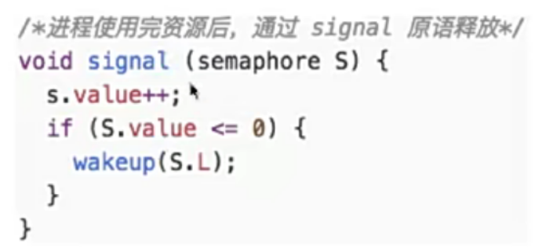

释放资源后，若还有别的进程在等待这种资源，则使用 wakeup 原语唤醒等待队列中的一个进程，该进程从阻塞态变为就绪态


### 例子

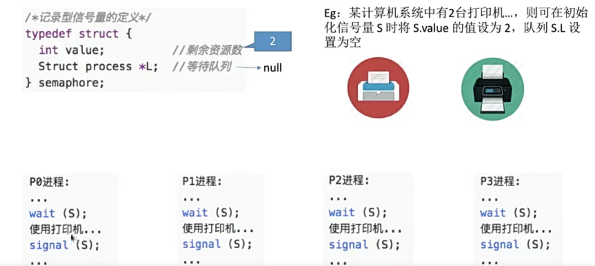

1. 首先，CPU执行P0进程

   会执行value -- ，value 从2变成1

   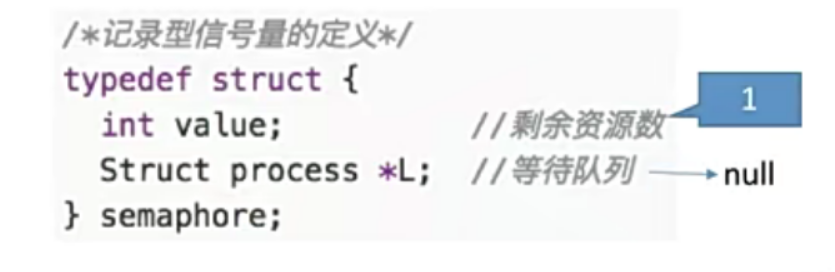

   系统判断当前是有打印机资源的，会把其中一个打印机分配给P0进程，P0进程往下使用打印机

2. 接着，CPU执行 P1进程

   也会执行 value--，value 数量从1变成0

   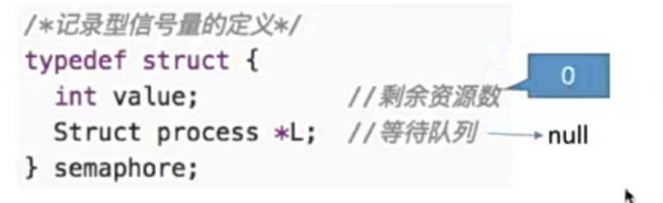

   系统判断有打印机资源，分配给P1一个打印机，此时两个打印机全部被分配完了

3. 接着，CPU执行 P2 进程

   执行wait时，也 value --，value由0变成 -1   value < 0 了 ，表示系统中没有多余资源用来分配了，那么会在wait原语中主动执行一个 block 原语，这个进程会被挂到打印机资源的等待队列时，value  = -1 表示有一个进程等待这个资源，-1的绝对值刚好是1，表示有1个进程在等待

4. 接着，CPU执行 P3 进程

   执行wait时，也 value --，value由-1变成 -2   value < 0 了 ，表示系统中没有多余资源用来分配了，那么会在wait原语中主动执行一个 block 原语，这个进程会被挂到打印机资源的等待队列时，value  = -2 表示有一个进程等待这个资源，-2的绝对值刚好是2，表示有2个进程在等待

   

   接着CPU只能执行 P0进程或者P1进程

5. 假设 P0进程先使用完打印机，signal原语会执行一个 value ++ 进程，value从-2变成-1

   如果 value 还是 小于等于 0，那就表示等待队列中还有进程在等待该资源，那么signal原语会调用wakeup原语，队头的进程，P2进程会离开阻塞队列，得到这个分配的资源

   

6. 加入接下来CPU为P2进程服务，P2使用完了打印机资源，就signal原语  value++ 从 -1 变成 0，value小于等于0，就wakeup原语唤醒一个进程，即P3进程，P3从等待队列消失，P3获取打印机资源

7.  P3 与 P1  都会 各自 ++   0 变成  1   1变成2   都不用执行 wakeup原语


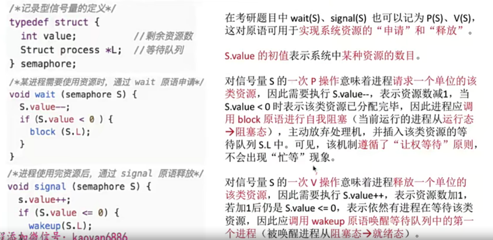 


## 总结

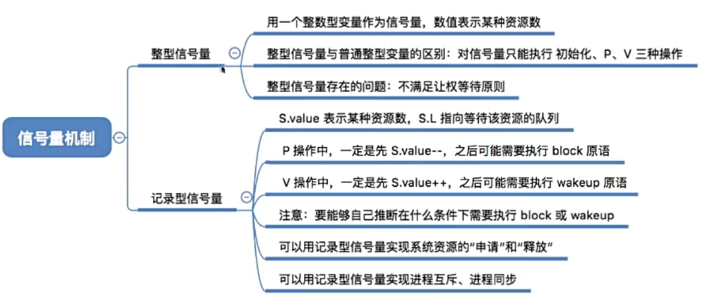


# 十六、信号量机制同步、互斥、前驱

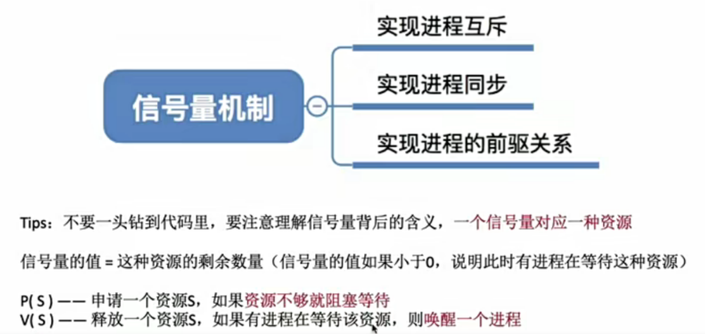

## 信号量机制实现进程互斥

1. 分析并发进程的关键活动，划定临界区(临界区在进程内，每个进程有访问不同资源的临界区，如，对临界资源打印机的访问就应放在临界区)

2. 设置互斥信号量 mutex，初值为1。

   把信号量 mutex(意思是互斥的) 表示为 "进入临界区的名额"

3. 在进入区 P(mutex) 申请资源

4. 在推出去 V(mutex) 释放资源

注：对不同的临界资源需要设置不同的互斥信号量。P、V操作必须成对出现。缺少 P(mutex) 就不能保证临界资源的互斥访问。确实 V(mutex) 会导致资源永不被释放，等待进程永不被唤醒。

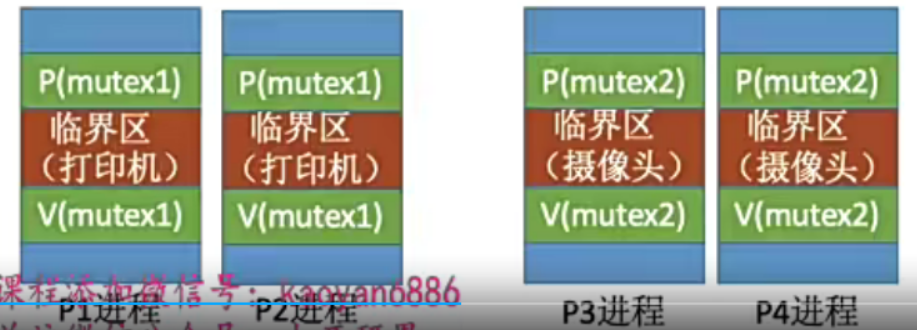


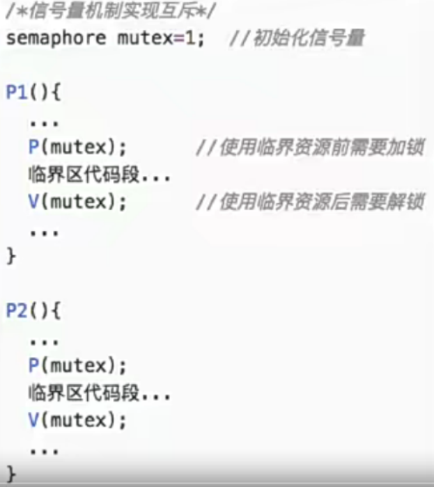


信号量的简单定义方式

```
typedef struct{
	int value;    // 剩余资源数
	struct process*L; // 等待队列
}semaphore
```


## 信号量机制实现进程同步

回忆什么是进程同步

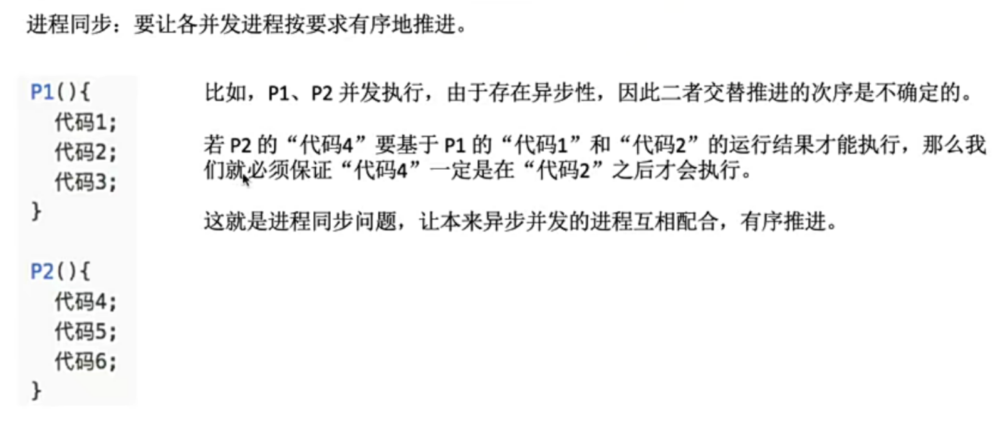

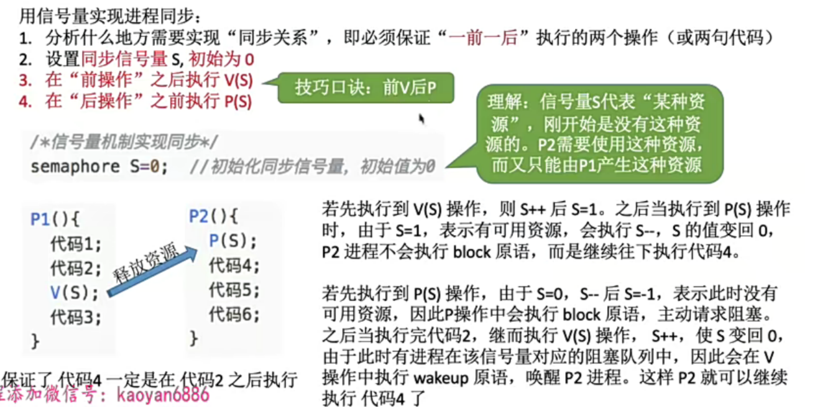

前V后P，后面的P要申请资源，如果申请不到就阻塞，等待前面的V进行唤醒


复杂的例子


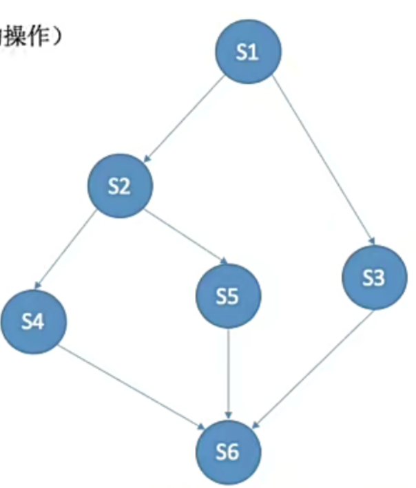

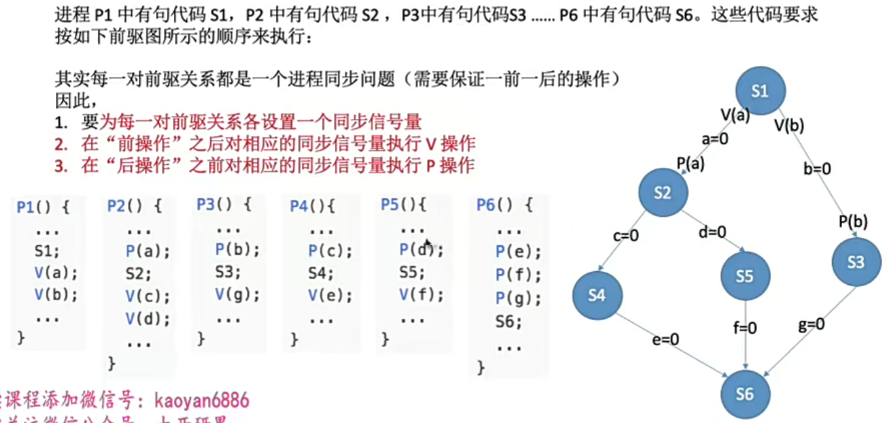

必须在前面执行的代码的后面要加上V操作，为的是唤醒之前没有获取到资源而堵塞的其他代码

必须在后面执行的代码的前面要加上P操作，为的是在没有这个资源时将该进程堵塞。

- V(a) 和 P(a) 保证 S1 一定是在 S2 之前执行的。
- V(b) 和 P(b) 保证 S1 一定是在 S3 之前执行的。
- .....

## 总结

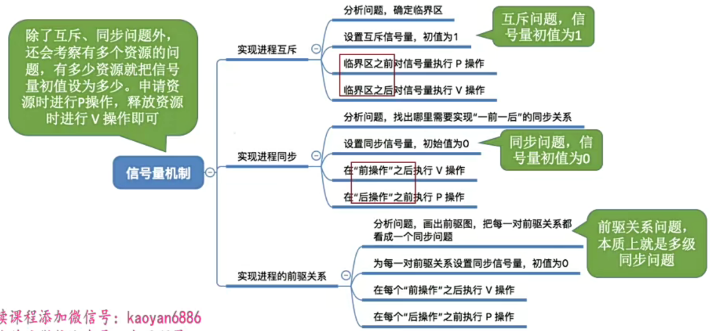


# 十七、生产者-消费者问题

