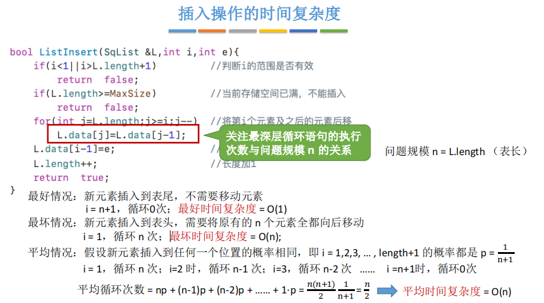
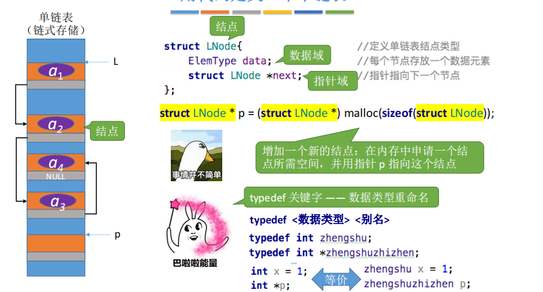
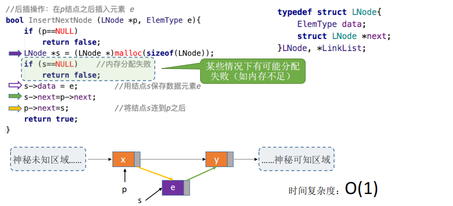
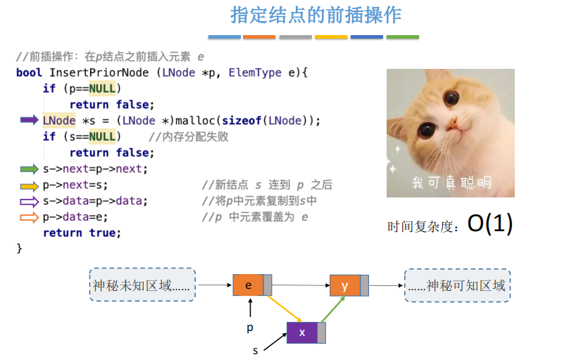
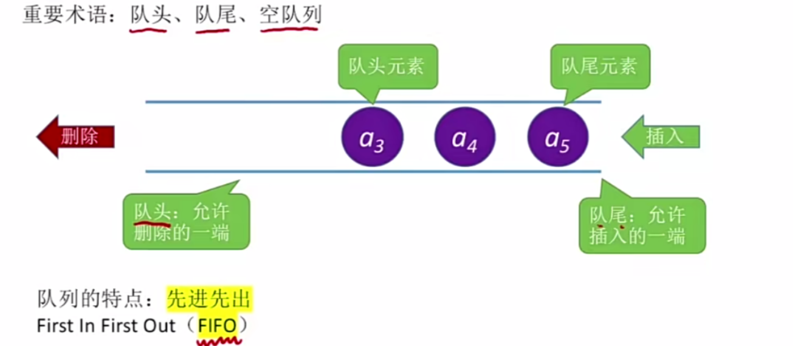
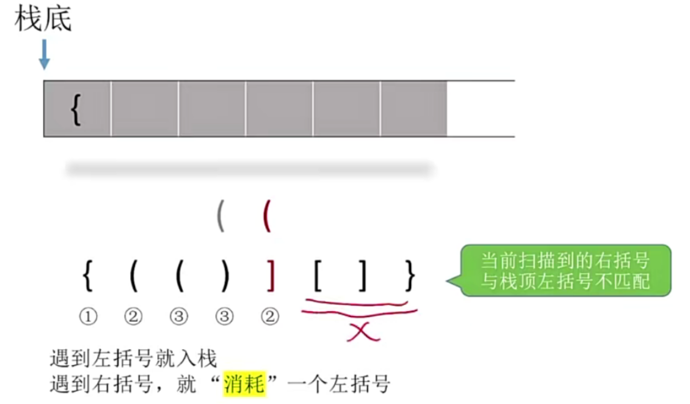
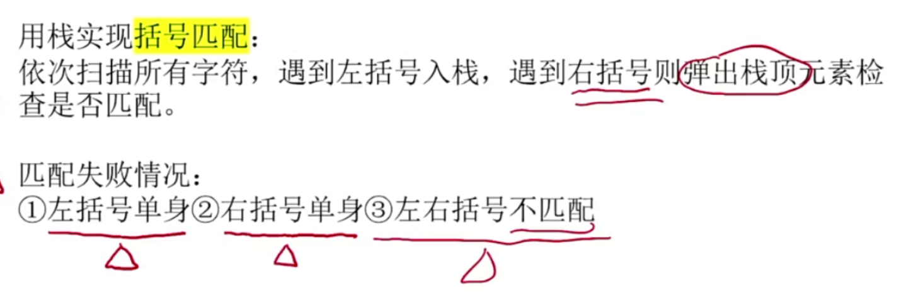

# 第一章 概述

数据结构在学什么？

• 如何用程序代码把现实世界的问题信息化 

• 如何用计算机高效地处理这些信息从而创造价值


## 1.1 什么是数据结构

### 1.1.1 基本概念

数据：计算机加工处理的对象

数据元素：组成数据的成分数据是数据元素

数据项：用于组成数据元素

数据项<数据元素<数据


一个数据结构是由数据元素依照某种逻辑联系组织起来的。

对数据元素间的逻辑关系的描述称为数据的**逻辑结构**

数据在计算机以何种方式存储称为数据的**存储结构**

讨论一个数据结构必须同时讨论在该类数据上执行的运算才有意义


### 1.1.2 数据的逻辑结构


小圆圈：数据元素

边：两不同元素的连线称为边，边之间有箭头表示

前驱：边的起点

后继：边的终点

四类基本逻辑结构是

1.集合结构

​	特点：（1）元素间次序随意（2）元素之间除了属于同一个集合外，没有其他关系

2.线性结构

​	特点：（1）有序序列（2）第一个元素没有前驱只有后继，最后一个元素只有前驱没有后继，其余元素有且仅有一个前驱和一个后继

​	（3）数据元素之间形成一对一的关系

3.树形结构

​	特点：（1）根元素没有前驱只有后继，其余元素有且仅有一个前驱，后继数量不限（2）非根元素都存在着一条从根到该元素的路径        	（3）数据元素存在一对多的关系（4）树是层次数据结构

4.图状结构

​	特点：（1）每个元素的前驱和后继数目都不限（2）数据元素之间是多对多的关系


这四种基本结构关系可分为两类：线性结构和非线性结构

树、图、集合都归入非线性结构一类


### 1.1.3 数据的存储结构

存储结构：数据在计算机内的组织方式，逻辑结构的存储印象

常见存储结构有顺序和链接


顺序存储结构：需要一块连续的存储空间，并把逻辑上相关的数据元素依次存储在该连续的存储区中。


链接存储结构：存储一个元素，除了需要存放该元素本身的信息外，还需要存放与该元素相关的其他元素的位置信息。这两部分信息组成存放一个数据元素的结点。   链：关于其他结点的位置信息


还有其他存储数据的方法：索引和散列


### 1.1.4 数据结构的元素

还要讨论在数据结构上执行的运算以及实现这些运算的算法

数据结构最常见的运算有

（1）创建运算（2）清楚运算（3）插入运算（4）删除运算（5）搜索运算（6）更新运算（7）访问运算（8）遍历运算

数据结构一旦创建不发生改变称为静态数据结构，否则称为动态数据结构


## 1.2 数据抽象和抽象数据结构

### 1.2.1 抽象、数据抽象和过程抽象

抽象：一种机制，抽取共同的本质的内容，忽略非本质的细节。

抽象可以使一个问题的求解过程采用自顶向下的方式分步进行：首先考虑最主要方面，然后再逐步细化，进一步考虑问题的细节，并最终实现


数据抽象：一种手段，该手段使程序设计者可以将数据元素间的逻辑关系和数据在计算机内的具体表示分开考虑。

过程抽象：一种手段，该手段可使程序设计者将一个运算的


### 1.2.2 封装与信息隐蔽

封装：把数据和操纵数据的运算组合在一起的机制。封装对使用者隐藏了数据结构以及程序的实现细节

信息隐蔽：对使用者隐藏了数据结构以及程序的实现细节


模块：将数据和操纵数据的运算组合在一起的机制。一个模块的接口是实现运算的一组函数。这样的模块被称为黑盒子

客户：调用某个模块的其他程序


### 1.2.3 数据类型和抽象数据类型


一个抽象数据类型（ADT）是一个数据类型，其主要特征是数据对象及其运算的规范独立于它们的实现，实行封装和信息隐蔽，使ADT的使用与实现分离。


c语言的int就是一个抽象数据类型，我们只能通过类型int所规定的运算操纵整型变量或常量。然而在面向对象程序设计语言出现后，才提供了必要的机制，如 c++语言的类（class），使用户有可能实现抽象数据类型。


### 1.2.4 数据结构与抽象数据类型

逻辑结构和运算的定义组成了数据结构的规范

数据的存储表示和运算算法的描述构成了数据结构的实现


## 1.3 描述数据结构

### 1.3.1 数据结构和规范

描述运算的方式

（1）使用 c 语言的函数原型规定该运算的使用格式，包括运算名称，运算的输入参数，输出参数和返回值

（2）规定了使用一个运算应当满足的先决条件和运算执行后应有的结构，即运算的功能


下面以复数数据结构为例子，说明数据结构的描述方法


抽象数据类型 Complex

```c++
ADT Complex{
数据:
	由一对实数（x,y）构成，x为实部，y为虚部
运算:设两个复数分别为 a = (a1,a2) 和 b = (b1,b2)
	Complex CreateComp(float x,float y)// 创建复数 并返回该复数
	
	Complex Add(Complex a,Complex b)	// 复数加法运算
	
	Complex Sub(Complex a,Complex b)	// 复数减法运算
		
	Complex Mul(Complex a,Complex b)	// 复数乘法运算
	
	Complex Div(Complex a,Complex b)	// 复数除法运算
	
}
```


### 1.3.2 实现数据结构


实现一个数据结构必须首先确定数据的存储表示，然后在给定的存储方式下实现相应的运算。


1.3.1中Complex的实现

```
#include<stdio.h>
#include<stdlib.h>

typedef struct complex
{
	float x,y;
}Complex;

Complex CreateComp(float x,float y)
{
		Complex c;
		c.x = x ;
		c.y = y ;
		return c;
}
Complex Add(Complex a , Complex b)
{
	Complex c;
	c.x = a.x + b.x;
	c.y = a.y + b.y;
	return c;
}
```

一旦实现 Complex 的 全部的全部运算，我们就可以在主函数或其他应用程序中使用 Complex 的运算进行复数计算。


## 1.4 算法以及算法分析

### 1.4.1 算法以及性能标准


算法：是对特定问题的求解步骤的一种描述，它是指令的有限序列。是处理信息的步骤


算法具有下列五个特征

1. 输入：算法有零个或多个输入
2. 输出：算法至少产生一个输出
3. 确定性：算法的每一条指令都有确切的定义，没有二义性
4. 能行性：算法的每一条指令都足够基本，它们可以通过执行有限次已经实现的基本运算来实现
5. 有穷性：算法总能在执行有限步之后终止


衡量算法的性能，有以下几个标准

正确性：算法应能够正确地解决求解问题。

可读性：算法应具有良好的可读性，以帮助人们理解。

健壮性：输入非法数据时，算法能适当地做出反应或进行处理，而不会产生莫名其妙的输出结果。

效率：高效率与低存储量需求


### 1.4.2 算法的时间复杂度

程序的时间复杂度：程序运行从开始到结束所需的时间。


问题实例：表示问题的某一种特定情况

问题实例的规模：判断算法性能要考虑的一个基本特征。规模一般是指输入量（有时也涉及输出量）


事前分析：在排除程序运行环境的因素后再来讨论算法的时间效率，算法时间复杂度是对程序**事前分析**用到的

事前预估算法时间开销T(n)与问题规模 n 的关系（T 表示 “time”）


程序步：是指在语法上或语义上有意义的程序段，该程序段的执行时间与问题实例的特征无关

当我们认定某段程序是用于完成特定算法作用后，不是用来完成该算法的语句就都可以去掉忽略


例子：下面这个程序是用于完成数组元素的累加运算

数组元素的累加运算并不针对某一特定数组，而是针对所有数组而言的。数组元素的累加运算就是一种算法

该程序如下

```
float Sum(float list[],int n)
{
	float tempsum = 0.0;
	count ++;
	for(int i = 0 ; i< n ;i++){
		count++;
		tempsum+=list[i];
		count++:
	}
	count++;
	count++;
	return tempsum;
}
```

其中所有的 count++; 语句都是与数组元素累加运算无关的，所以都可以去掉，得到

```
float Sum(float list[],int n)
{
	float tempsum = 0.0;
	for(int i = 0 ; i< n ;i++){
		
		tempsum+=list[i];
	}
	return tempsum;
}
```

该程序中

float tempsum = 0.0;    return tempsum;   for里面的int i = 0； 是 1步

  tempsum+=list[i];  i++ ； 是 n步（循环了n次）

所以数组累加运算的程序步数是 2n+3


递归的程序步骤：

```
float RSum(float list[],int a){
	count ++;
	if(n){
		count++:
		return RSum(list,n-1)+list[n-1];
	}
	count ++;
	return 0;
}
```

去掉所有 count++； 语句 得到  

```
float RSum(float list[],int a){
	if(n){
		return RSum(list,n-1)+list[n-1];
	}
	return 0;
}
```


如果 n = 0   只执行if 条件语句和第二条return 语句 ，2步

如果 n不等于0       执行if 条件语句 和 第一条 return 语句

设程序的执行步数为T(n)，则有   T(n) = 2  n = 0    ;   T(n) = 2 + T(n - 1)  n不等于0

T(n)这个递推公式可以用下面的方式计算

T(n)= 2 + T(n - 1) = 2 + 2 + T(n-2) = 2 + 2 + 2 + T(n-3) = ..... = 2*n +2  


### 1.4.3 渐进时间复杂度


定义：设 f(n)  和 g(n) 是定义在正整数上的正函数，如果存在两个正常数 c 和 n<sub>0</sub>,使得当 n >= n<sub>0</sub>时 ，有f(n)<= c*g(n)，则记作 f(n)  = O(g(n)) ，被称为大 O 记号。

大 O 记号用以表达一个算法运行时间的上届(最多需要多少时间)。当我们说一个算法具有 O(g(n)) 的运行时间时，是指该算法在计算机的时间运行时间不会超过 g(n) 的一个常数倍


**大O表示“同阶”，同等数量级。即：当 n->∞时，二者之比为常数**


例如，设一个程序的实际执行时间 T(n) = 3.6*n<sup>3</sup> + 2.5*n<sup>2</sup> + 2.8   ， 则 T(n) = O(n<sup>3</sup>) . 如果我们只能够知道 T(n) = O(n<sup>3</sup>)，并不能得到  T(n) = 3.6*n<sup>3</sup> + 2.5*n<sup>2</sup> + 2.8 的计算公式，从事前分析的角度，我们认为已经有了满意的对算法时间复杂度的估计结果。


T1(n)=3n+3  简化为  T1(n) = O(n)

T2(n)=n<sup>2</sup>+3n+1000  简化为 T2(n) = O(n<sup>2</sup>)

T3(n)=n<sup>3</sup> + n<sup>2</sup> +9999999 简化为 T3(n) = O(n<sup>3</sup>)


渐近时间复杂度：使用大 O 记号表示的算法的时间复杂度，称为算法的渐近时间复杂度。


时间复杂度的加法规则（两段程序是顺接关系）

*T*(*n*) = *T*1(*n*) + *T*2(*n*) = *O*(*f*(*n*)) + *O*(*g*(*n*)) = *O*(max(*f*(*n*), *g*(*n*)))  多项相加，max表示只保留最高阶的项，且系数变为1

时间复杂度的乘法规则 

*T*(*n*) = *T*1(*n*)×*T*2(*n*) = *O*(*f*(*n*))×*O*(*g*(*n*)) = *O*(*f*(*n*)×*g*(*n*))         多项相乘，都保留


#### 常见算法时间复杂度

O(1) < O(log<sub>2</sub>n) < O(n) < O(nlog<sub>2</sub>n) < O(n<sup>2</sup>) < O(n<sup>3</sup>) < O(2<sup>n</sup>) < O(n!) < O(n<sup>n</sup>)


#### 速得算法时间复杂度

程序时间复杂度有如下结论

结论1：顺序执行的代码只会影响常数项，可以忽略

结论2：只需挑循环中的一个基本操作分析它的执行次数与 n 的关系即可

结论3：如果有多层嵌套循环，只需关注最深层循环循环了几次


#### 常见程序段的时间复杂度

1.逐步递增型


```
void loveYou (int n ){
(1)	int i = 1;
(2)	while(i<=n){
(3)		i++;
(4)		printf("helloworld");
	}
(5)	printf("love");
}
```

(1) (5) 执行 1 次        (3) (4)执行n次   (2) 执行 n+1 次

一共 3n+3 次 T(n) = 3*n+3     = O(n) 


2.嵌套循环型

```
void loveYou(int n ){
	int i =1;
	while(i<=n){
		i++;    // 执行 n 次
		printf("I love you %d\n",i);
		for(int j =1;j<=n;j++){	// 嵌套循环
			printf("I am Iron Man\n");   // 执行 n方次
		}
	}
}
```

结论2：只需挑循环中的一个基本操作分析它的执行次数与 n 的关系即可


T(n) = O(n) + O(n<sup>2</sup>) = O(n<sup>2</sup>)


3.指数递增型

```
void loveYou (int n ){
	int i = 1;
	while(i<=n){
		i=i*2;
		printf("I Love You %d\n",i);
	}
	printf("I Love You More Than %d\n",i);
}
```

设置上述算法时间复杂度为 T(n)

设最深层循环的语句频度(总共循环的次数)为 x，则由循环条件可知，循环结束时刚好满足 2<sup>x</sup> > n

x = log<sub>2</sub>n + 1

T(n) = O(x) = O(log<sub>2</sub>n)


4.数字搜索型


### 1.4.4  最坏、最好情况与平均时间复杂度

对于某些算法，即使问题实例的规模相同，如果输入数据不同，算法所需的时间开销也会不同。

例如，有一个程序，其功能是在一个有 n 个元素的数组中找一个给定的元素，从第一个元素开始依次检查数组元素。

1. 如果我们要找的元素是第一个元素，所需的查找时间最短，这就是算法的最好情况
2. 如果要找的元素是最后一个元素，则是算法的最坏情况
3. 如果我们多次在数组中查找元素，并且假定以某种概率查找每个数组元素，最典型的是以相等的概率查找每个元素(每个都是 1/n)，这种情况下，程序需要平均检索 n/2 个元素， 这是算法的平均情况


### 1.4.5 算法的空间复杂度

一个程序的空间复杂度是程序运行从开始到结束所需的存储量

程序运行所需的存储空间包括两部分

(1) 固定部分。

这部分空间与所处理数据的大小和个数无关，或者说与问题的实例的特征无关。它主要包括程序代码、常量、简单变量、定长成分的结构变量所占的空间

(2) 可变部分。

这部分空间大小与算法在某次执行中处理的特定数据的大小和规模有关。例如，将有100个元素的两个数组相加，与将有10个元素的两个数组相加，所需的存储空间显然是不同的。这部分存储空间包括数据元素所占的空间，以及算法执行所需的额外空间，如递归栈所用的空间


# 第二章 数组与链表


## 2.1 结构与联合

### 2.1.1 结构

结构是 c 语言提供的聚合数据的机制。

使用结构可以将不同类型的数据组合成一个整体，便于使用

一个结构是数据项的聚集，每个数据项有名称和类型，它们可以是不同的数据类型

例如

```
struct student
{
	char name[20];
	char sex;
	int age;
}
```

定义了一个结构类型 struct student，其地位相当于 int 数据类型 ，可以使用它作为定义结构变量的类型，

比如 struct student studA；   就相当于 int studA

再用成员运算符"." 对结构变量进行赋值

```
studA.age = 19

studA.sex = 'M'

```


为了把 struct 这个单词省略  ，可以使用 typedef 创建自己的结构类型 Student 

```
typedef struct student
{
	char name[20];
	char sex;
	int age;
}Student
```

Student就是结构类型名，其地位相当于 int double等结构类型

定义变量   ：  Student studA  


### 2.1.2 联合

联合是一个变量，它可以存放不同类型的数据对象。

联合的使用目的是使用单一变量，存放多个类型的值,但是显示只能显示一种

联合变量使用的存储块的大小是它的最大变量所需的存储块大小    int char double 中，  最大的是double ， **其余的int 和 char 是double的低字节部分**。


```
#include<stdio.h>
union t1{
    char m1;
    int age;
};
int main()
{
    union t1 mwe;
    mwe.age = 65377;
    printf("%c,%d",mwe.m1,mwe.age);
    
    return 0;
}
```


因为  65377二进制表示为 00000000 00000000 11111111 01100001  char是一个字节所以只用int 的最低的那个字节   01100001 就是 97 就是字符 a


```
union u_tag {
	int ival;
	float fval;
	char chval;
};
```

这里 union u_tag 是一个联合类型，可以用来定义联合变量，如 union u_tag a

联合可以放在结构或数组中，结构和数组也可以放在联合中

```
struct{
	char name[20];
	int flags;
	int utype;
	union{
		int ival;
		float fval;
		char chval;
	}u;
}symtab[maxsize]
```

访问联合的成员ival的方式是 ： symtab[i].u.ival


用typedef 可以创建新的数据类型把 union关键词去掉

```
typedef union u_tag{
	int ivals;
	float fvals;
	char cvals;
}Con
```

这样 Con 就相当于 int 的地位，是一个数据类型


## 2.2 数组(略)

## 2.3 线性表


### 线性表的定义


## 2.4 顺序表

顺序表：把逻辑上相邻的元素存储在物理位置上也相邻的存储单元中，元素之间的关系由存储单元的邻接关系来体现。


### 顺序表的实现

#### 静态分配


```
#define MaxSize 10 //定义最大长度
typedef struct{
ElemType data[MaxSize]; //用静态的“数组”存放数据元素
int length; //顺序表的当前长度
}SqList; //顺序表的类型定义（静态分配方式）
```


```
#include<stdio.h>
#define MaxSize 10
typedef struct {
	int data[MaxSize];
	int Length;
}SqList;  // 顺序表数据结构 

void InitList(SqList& L){   // SqList& L 是c++ 中的引用 
	L.Length = MaxSize;
	int i = 0;
	for(i = 0;i<L.Length;i++){
		L.data[i] = 0;
	} 
	
}

int main(){
	SqList L;
	InitList(L);
	return 0;
}

```


静态分配的顺序表存储空间固定的，如果不够用就完蛋了，因为没法进行扩容。

如果分配太多就太浪费内存了。


#### 动态分配

动态分配就支持在线性表长度不够的时候进行扩容


Increase：生成一个新的，更长的数组，将原数组的内容都复制到新数组，然后把原数组内存释放掉。

```
#include<cstdio>
#include<cstdlib> 
#define InitSize 10

typedef struct{
	int * data;
	int MaxSize;
	int Length;
}SeqList;

void InitList(SeqList& L){
	L.data = (int*)malloc(sizeof(int)*InitSize);
	L.Length = 0;
	L.MaxSize = InitSize;
}

void IncreaseSize(SeqList& L,int len)
{	// 数组扩容的函数 
	int * p = L.data;
	L.data = (int*)malloc((L.MaxSize+len)*sizeof(int)); // 申请一个新的数组，获得更大的空间 
	int  i = 0; 
	for(i = 0;i<L.Length;i++){
		L.data[i] = p[i];
	}
	L.MaxSize = len+L.MaxSize; // 增加最大长度
	free(p);   // 释放原数组内存  
}
int main()
{
	SeqList L;
	InitList(L);
	IncreaseSize(L,5);
	return 0;
	
}

```


#### 总结


### 顺序表的插入与删除


<font color=red size=5>本节代码建立在顺序表的“静态分配”实现方式之上，“动态分配” 也雷同。</font>


#### 插入

插入：插入原位置前，要把往后的每个数据都往后挪动一格给这个要插入的元素腾出位置来，从后往前操作不会导致元素覆盖。


```
bool ListInsert(SqList &L,int i,int e){
	if(i<1||L.Length+1){    // i位置是否有效
		return false;
	}
	if(L.Length>=MaxSize){   // 存储空间已经满了就不能插入，这里是静态空间，如果是动态空间就先扩容
		return false;
	}
	for(int j = L.Length;j>=i;j--){ // 依次往后挪
		L.data[j] = L.data[j-1];
	}
	L.data[i-1] = e;   // 在位置i处放元素
	L.Length++;  // 长度+1
	return true;
}
```




#### 删除

把每个元素依次往前挪动


```
bool ListDelete(SqList &L,int i ,int &e){
	if(i<1||i.Length){
		return false;
	}
	e = L.data[i-1]; // 取出要删除的元素
	for(int j = i ;j<L.Length;j++){ // 依次往前挪动
		L.data[j-1] = L.data[j];
	}
	L.Length--;
	return true;
}
```


#### 总结


### 顺序表查找


#### 按位查找

就和数组索引一个道理

知道数组首地址再计算出偏移量就可以得到这个位置的地址，就能得到值


```
ElemType GetElem(SeqList L,int i){
	return L.data[i-1];
}
```


时间复杂度就是根据一步，即计算其偏移地址就能得到，时间复杂度是O(1)


#### 按值查找


```
int LocateElem(SeqList L,ElemType e){
	for(int i = 0;i<L.length;i++)
		if(L.data[i] == e) // 对于一些复杂类型的数据结构，判断它们是否相等最好使用一个函数来进行
			return i+1; // 返回其索引
	return 0;				
}

```


#### 总结


## 2.5 链表


### 2.5.1 单链表


#### 单链表的定义

单链表示意图


优点：不要求大片连续空间，改变容量方便

缺点：不可随机存取，要耗费一定空间存放指针


##### 用代码定义单链表





```
typedef struct LNode{
	ElemType data;
	struct LNode *next;
}LNode,*LinkList;

typedef struct LNode LNode;      //struct LNode 变为 LNode
typedef struct LNode * LinkList; //struct LNode * 变为 LinkList

LNode* L 和 LinkList L 都是表示指向结点的指针，只是名字不同

```


```
LinkList List_HeadInsert(LinkList&L){
	LNode * s;
	int x;
	L =(LinkList)malloc(sizeof(LNode)); // 创建头结点
	L->next = NULL;    // 头结点指针域设置为null
	scanf("%d",&x);
	while(x!=9999){  // x输入为 9999 表示停止创建结点
		s = (LNode*)malloc(sizeof(LNode)); // 用于接收新申请出的空间
		s -> data = x;
		s -> next = L -> next; // s ->next 域设置为null
		L -> next = s;     // 新的结点放在链表的尾巴处
		scanf("%d",&x);
	}
	return L;
}
```


##### 不带头结点的单链表


##### 带头结点的单链表


##### 总结


#### 插入和删除


##### 插入(带头结点)


##### 插入(不带头结点)


##### 插入(指定结点后插)




##### 插入(指定结点前插)





##### 删除(按索引)


##### 删除(指定结点删除)


##### 总结


#### 查找

##### 按位查找


##### 按值查找


##### 求表的长度


##### 总结


#### 单链表的建立


##### 尾插法


##### 头插法


##### 总结


### 2.5.2 双链表


#### 初始化(有头结点)


#### 双链表插入


#### 双链表删除结点


#### 双链表遍历


#### 总结


### 2.5.3 循环链表

#### 循环单链表


#### 循环双链表


##### 循环双链表初始化


##### 双链表插入


##### 双链表删除


#### 总结


### 2.5.4 静态链表


### 2.5.5 顺序表与链表的区别

### 2.3.4 循环链表

单链表的另一种表示是单循环链表。

单循环链表是将单链表尾结点的指针域置为第一个结点的地址，而不再是NULL。

单循环链表可以从表中任一结点出发，均可访问到表中所有结点。

单循环链表也可以带表头结点


### 2.3.5 双向链表

单链表，在我们想要知道一个结点的前驱结点时，需要从头开始找，很不方便。

在实际应用中，有时需要逆向访问表中元素，单链表做不到。

为了解决这些问题，链表设计为双向链表


双向链表每个结点包含三个域：Element、LLink、RLink。

其中，Element 域为元素域，RLink 域为指向后继结点的指针，新增的 LLink 域用以指向前驱结点


双向链表也可以带表头结点，并且也可构成双向循环链表 。此时，表头结点的 RLink 和 LLink 分别指向双向循环链表的头结点(或表头结点)和尾结点。


双向链表的每个结点的结构具有如下定义的结构类型

```
typedef struct dnode{

	T Element;

	struct dnode *RLink,*LLink; //LLink 前驱   RLink 后继

}DNode;
```


#### 双向链表进行结点的插入和删除


插入：在 p 所指示的结点前插入一个新结点 *q 

核心步骤：

```
q->LLink = p->LLink;
q->RLink = p;
p->LLink->RLink = q;
p->LLink = q;
```


删除：删除 p 所指示的结点

```
p->LLink->RLink = p->Rlink;
p->RLink->LLink = p->LLink;
free(p);
```


# 第三章 栈和队列

## 3.1 栈的基本概念


### 栈的定义


栈：手枪弹夹，只能在上方添加和删除元素


特点：后进先出       后进入栈的元素先出栈

栈的逻辑结构和线性表逻辑结构是一样的，数据的插入，删除操作有区别


### 栈的基本操作


## 3.2 栈的顺序存储结构


### 顺序存储方式实现的栈


```
typedef struct{
	ElemType data[MaxSize];
	int Top;    
}SqStack;

Top 存储的是栈顶指针，对于顺序栈，Top存储的是栈顶元素在数组中的索引。
静态数组 data 存储的是栈中的元素。
```

刚开始，栈是一个空栈，可以让 Top 的值等于 -1


### 基本操作

#### 判断空栈

根据Top的值判断这个栈是否是空栈


#### 进栈操作

先把Top指针的值+1，然后再把数据放入。时刻保证Top指针指向栈顶


#### 出栈操作

先把栈顶的值放入x中，然后 Top指针的值-1，把元素出栈，但是该元素任然在原位置处，需要等下一次入栈把这个元素覆盖，这个元素才消失


#### 读取栈顶元素


#### 另一种方式

另一种方式是，把 Top 指针指向的地方设置为下一个要压入元素的地方，即栈顶的上一格。


顺序栈的缺点是静态的，不可以扩容。


#### 共享栈(补充)

两个栈共享一片存储空间


一个从下往上  一个从上往下

栈满的条件 top0 + 1 == top1


### 总结


### 顺序栈 njupt版


```
#include<stdio.h>
#include<stdlib.h>
#define MaxSize 50
#define FALSE 0
#define TRUE 1
typedef int BOOL;
typedef int T;
typedef struct stack{
	int Top;
	int MaxStack; //栈的最大长度
	T Elements[MaxSize];
}Stack;

void CreateStack(Stack*s,int maxsize){
	s->Top = -1;
	s->MaxStack = maxsize;
}
BOOL IsEmpty(Stack s){
	return s.Top<0;  // Top = -1 时为空
}
BOOL IsFull(Stack s){  //判断栈有没有满，
	return s.Top>=s.MaxStack-1;
}
void Push(Stack*s,T x){
	if(IsFull(*s)) printf("OverFlow")
	else {
		s->Elements[++s->Top] = x;
		//这句代码可以写成
		// ++(s->Top)
		// s->Elements[s->Top] = x
		//先移动指针，后赋值
	}
}
void Pop(Stack*s){
	if(IsEmpty(*s)) printf("Underflow");
	else s->Top--; //弹出只需要移动指针
}
void StackTop(Stack s,T*X) //得到当前栈顶指针指向的值
{
	if(IsEmpty(s))
		printf("Underflow");
	else *s = s.Elements[s.Top];
}
int main(){
	Stack s;
	T x;
	CreateStack(&s,10); //最大长度10
	Push(&s,10);
	Push(&s,15);
	PrintStack(s);
}
```


## 3.3 链栈的实现


### 链栈的定义


### 链栈基本操作

链栈就是一个规定了只能以一端作为添加和删除的单链表


### 总结


### 链栈 njupt 版


## ---------------------------------

## 3.4 队列的基本概念

### 队列的定义




### 队列的基本操作


### 总结


## 3.5 队列顺序存储方式


### 用顺序存储实现队列


队列数据结构有两个指针：队头指针和队尾指针

front：指向队头元素，rear：指向队尾元素的后一个位置(即将到来的元素插入的位置)


### 基本操作

#### 初始化队列


#### 判断队列是否为空


#### 入队操作


这里使用了取模操作： 

- 如果 Q.rear+1  <  MaxSize    那么 Q.rear+1 == (Q.rear+1)%MaxSize    就是i  Q.rear = Q.rear +1
- 如果 Q.rear+1  == MaxSize  那么   (Q.rear+1)%MaxSize == (Q.rear+1)-MaxSize = 0   即   Q.rear = 0 回到表头了
- 不可能出现 Q.rear+1  > MaxSize  因为Q.rear+1  == MaxSize 会让 Q.rear = 0 重置，不可能让大于的情况出现。


{0,1,2,....,MaxSize-1}将存储空间在逻辑上变成了"环状" 

模运算将无限的整数域映射到有限的整数集合{0,1,2,3,...,b-1}上

从下往上又回到下面

这种叫做循环队列


队列满的条件：队尾指针的再下一个元素是队头。尽管此时还有一个空间，但这个空间必须牺牲。

#### 出队操作


Q.front = (Q.front+1)%MaxSize   保证转着圈圈前进。


#### 判断队满和队空队列元素个数

如果队尾指针指向队尾元素后一个位置

队列元素个数： (rear + MaxSize - front)%MaxSize

队满条件： (Q.rear+1)%MaxSize == Q.front

队空条件：Q.rear == Q.front  这也是初始化条件

这种情况下要牺牲一个队列中的存储空间


##### 特殊处理1

如果出题老师把所有空间都用上了，就是一个空间都没留，rear 就把当前所指位置填上元素然后再往前一格。导致 rear 指针 和 front 指针重合。队满和队空表现出来的就是一样的，无法通过代码逻辑来判断队列是满的还是空的。


可以在队列中设置一个元素 size

```
typedef struct{
	ElemType data[MaxSize];
	int front,rear;
	int size;
}SqQueue;
// 初始化时，rear = front = 0   size = 0 
// 插入成功 size++;   删除成功 size--;
```


##### 特殊处理2

```
typedef struct{
	ElemType data[MaxSize];
	int front,rear;
	int tag;
}SqQueue;


// tag是标志位，用来标志最近进行的操作是删除还是插入
每次删除操作成功时,都令 tag = 0
每次插入操作成功时,都令 tag = 1

```


只有删除操作，才可能导致队空


只有插入操作，才可能导致队满


#### 其他情况

rear 直接指向队尾元素 (通常情况是 rear 指向 队尾元素的后一个)


### 总结


### 顺序循环队列 njupt 版

```
typedef int ElemType;
typedef struct queue
{
	int front;
	int rear;
	int maxSize;
	ElemType*element;
}Queue;

// 能容纳 mSize 个单元的空队列
void create(Queue*Q,int mSize){
	Q->maxSize = mSize;
	Q->element = (ElemType*)malloc(sizeof(ElemType)*mSize);
	Q->front = Q->rear = 0; //初始化
}

void Destroy(Queue*Q){
	Q->maxSize = 0;
	free(Q->element);
	Q->front = Q->rear = -1;
}
BOOL IsEmpty(Queue*Q){
	return Q->front == Q -> rear;
			//队首队尾指向相同		
			
}
BOOL IsFULL(Queue * Q){
	return (Q->rear + 1)%Q -> maxSize == Q->front;
}
BOOL Front(Queue*Q,ElemType*x){
	if(IsEmpty(Q)){
		return FALSE;
	}
	*X = Q->element[ (Q->front + 1)%Q->maxSize ];
	return TRUE;
}
// 入队 队尾插入元素x
BOOL EnQueue(Queue*Q,ElemType x){
	if(IsFull(Q)){
		return FALSE;
	}
	Q->rear = (Q->rear + 1)%(Q->maxSize);
	Q->element[Q->rear] = x;
	return TRUE;
}
// 出队 删除队头元素
BOOL DeQueue(Queue*Q){
	if(IsEmpty(Q)){
		return FALSE;
	}
	Q->front = (Q->front+1)%(Q->maxSize);
	return TRUE;
}
void Clear(Queue*Q){
	Q->front = Q->rear = 0;
}
```


## 3.6 队列链式存储方式


队列和单链表操作 是差不多的

### 链式存储实现队列


### 基本操作

#### 带头结点

初始化


判断是否为空


入队：只能在尾部进行插入


出队


队列满的情况


#### 不带头结点

初始化和是否为空


入队

要考虑 在空队列中插入第一个元素


出队


#### 队列满的条件


#### 求长度

你可以整一个长度属性，每次添加去除元素时同步修改

### 总结


## 3.7 双端队列


### 判断输出序列的合法性


红色合法，绿色非法


**栈中合法的输出序列**，在输出受限双端队列中也是合法的。


输出受限的双端队列


### 总结


在栈中合法的，双端队列中也必定合法

还有共享栈


## 3.8 括号匹配问题(栈)

数量上匹配，形状上匹配


### 失败情况

遇到左括号(不管什么形状)就压栈，遇到右括号就弹栈，如果弹栈出来不匹配就不匹配，
或者整个流程结束了栈还有剩余也不匹配





### 逻辑与代码


### 总结




## 3.9 前缀中缀后缀表达式(栈)


# 第四章 数组

## 4.1 数组(略)

## 4.2 稀疏矩阵

### 稀疏矩阵定义


### 稀疏矩阵ADT


### 稀疏矩阵顺序表示


例子：


```
#define MaxSize 101 //最多可能的非0元素个数
typedef int T;
typedef struct term{
	int Row,Col;
	T value;
}Term;
typedef struct triples{
	int Rows,int Cols,NonZeros
	Term Elements[MaxSize];
}Triples
typedef Triples SparseMatrix;

```


### 矩阵转置以及稀疏矩阵的转置


普通矩阵转置


#### 稀疏矩阵转置方法

##### 第一种方法


一共两步

1. 三元组中行和列交换

2. 把三元组中行(如果是原来三元组是按照列创建的就按照列)的序号进行排列，数组下标越大，行号越大。

第一种算法的时间复杂度分析


##### 第二种方法


待转置的三元组是 A，我们需要新开辟一块空间B，对三元组A扫描n次，每次找到列下标为n-1的，进行行列交换，然后再放入数组B中(把数组的低索引处当做栈底，把A中交换后的三元对放入)。


上述算法对A的行三元组表进行了最多n次扫描，每次扫描都要访 问所有t个非零元，时间复杂度为O(nt）


