第五章 树

## 5.1 树的基本概念


树也有前驱和后继，右图中，C，B，D都是A的后继，反过来，A是C，B，D的前驱


空树：结点数为0的树


非空树的特点：

1. 有且仅有一个**根节点**，根节点没有前驱
2. 没有后继的结点称为**叶子结点**(终端结点)
3. 有后继的结点称为**分支结点**(非终端结点)
4. 每个结点都可以有0个或多个前驱
5. 除了根节点外，任何一个结点都有且仅有一个前驱


一个结点有两个前驱就不是树了


这两张图是 图 ，网了。


树是*n*（*n*≥0）个结点的有限集合，*n* = 0时，称为空树，这是一种特殊情况。

在任意一棵非空树中应满足：

1）有且仅有一个特定的称为**根结点**。

2）当*n* > 1时，其余结点可分为 *m*（*m* > 0）个**互不相交**(每个结点只有一个前驱)的有限集合*T*<sub>1</sub>, *T*<sub>2</sub>,…, *T<sub>m</sub>*，其中每个集合本身又是一棵树，并且称为根结点的子树。


什么叫 "其余结点可分为m个互不相交的子树"

A结点有3棵子树


B为根节点，B结点有2棵子树


F为根结点，其没有子树，或者说，子树是空树


<font color = red size=4>树是一种递归定义的数据结构</font>


树型结构的典型例子

电脑里的文件


思维导图都是数据结构


## 5.2 树的基本术语

### 结点之间的关系描述


1. **祖先结点**：从当前结点不断找其前驱，一直找到根节点为止，找到的所有前驱都是当前结点的祖先结点

   对于 图中的 **你**这个结点 来说，   父亲 爷爷是祖先结点

   对于 图中的 **G**这个结点 来说，   二叔 爷爷是祖先结点

2. **子孙结点**: 从当前结点不断找后继，一直找到叶子结点位置，找到的所有后继都是当先结点的子孙结点

   对于 图中的 **你**这个结点 来说，K和L 是后继结点

   对于 图中的 **爷爷**这个结点 来说，图上所有的结点都是子孙结点

3. **双亲结点**(父结点)：当前结点的直接前驱，是双亲结点

   对于 图中的 **你**这个结点 来说，**父亲**是双亲结点

   对于 图中的 **爷爷**这个结点 来说，没有双亲结点

4. **孩子结点**：当前结点的直接后继，是孩子结点

   图中的 **你**这个结点 来说， K 和 L 是 孩子结点

   图中的 **爷爷**这个结点 来说，父亲，二叔，三叔是孩子结点

   

5. **兄弟结点**：拥有同一个直接前驱的结点，彼此之间是兄弟结点的关系

   图中    你 和 F ，  H 和 I ，I 和 J 彼此之间都是兄弟结点

6. **堂兄弟结点**：拥有的直接前驱不是同一个，但是拥有的直接前驱是**处于同一层次**，彼此之间是堂兄弟结点

   图中   GH GI GJ  彼此之间是堂兄弟结点

7. **两个结点之间的路径**：从祖先结点找到子孙结点，方向不能反过来，是单向的

   爷爷结点 到 你结点  的 唯一路径是     爷爷-> 父亲 -> 你  而不能是    你->父亲->爷爷

8. **边**：两个结点间的连线称为边

9. **路径长度**：路径经过了几条边

   爷爷-> 父亲 -> 你  边数是 3

   


### 结点的属性和树的属性描述

结点的层次(深度)


1. **结点的层次(深度**)：从上(根节点)往下(叶子结点)数，根节点所在层数是第 1 层，看当前结点的深度

   A的深度是 1   B C D 是 2     E F G H I J 是 3   K L M 是 4

2. **结点的高度**：从下往上数，叶子结点所在层数是第 1 层，看当前结点的高度

   K L M 的高度是 1    E F G H I J 高度是 2     A的高度是4

3. **树的高度**(**深度**):根节点到叶子结点，最大多少层

   上图中，数的高度 是 4 层

4. **结点的度**：一个结点有几个孩子(分支)就有 几个度，**叶子结点度为0，非叶子节点度>0**

   A有 3 个 度    H 只有一个度，    G没有度

5. **树的度**：各结点的度中，最大的那个度作为该数的度

   该数的度 为 3

   

#### 有序树和无顺树

**有序树**：逻辑上看，树中结点的各子树从左至右是**有次序**的，不能互换

比如：家谱树


家谱的顺序是按出生顺序决定的，不能交换


**无序树**：逻辑上看，树中结点的各子树从左至右是**无次序**的，可以互换


只反映各个省有哪些市，无所谓顺序


具体看这个树存的是什么，是否需要用结点的左右位置反应某些逻辑关系


#### 树和森林

**森林**：森林是 m(m >= 0) 棵互不相交的树的集合 , m = 0时，此时是空森林


 


## 5.3 树的性质


性质一：对于一棵树来说，   **该树的所有结点数 = 该树所有的结点的度数 + 1**   

+1 是因为根节点没有前驱


性质二：**度数为 m 的数** 和  **m叉树**的区别


度数为 m 的树满足：

1. 该树内所有结点的度都小于等于 m
2. 该树内的结点中，至少有一个结点的度数是m(有 m 个孩子)
3. 一定是非空树，至少有 m + 1 个结点


m 叉树满足：

1. 该树内所有结点的度都小于等于 m
2. 允许所有的结点的度都小于m
3. 可以是空树，此时即为m叉空树


性质三

度为 m 的树第 i 层至多有 **m<sup>i-1</sup>**个结点 i>=1

m 叉树第 i 层至多有 m<sup>i-1</sup>个结点 i>=1

因为这两个都有 **该树内所有结点的度都小于等于 m** 这条性质


性质四

在性质三的基础上得到的，用等比数列求和公式


性质五

高度为h的**m叉树**至少有 h 个结点。(此时每个结点只有一个前驱，一个后继)


**高度为h、度为m的树**至少有 h+m-1 个结点(此时只有一个结点的度为m，叶子结点度为0，其余结点度为1)


性质六

常见考点6：具有n个结点的m叉树的最小高度为 **log<sub>m</sub>(n(m - 1) + 1)<sub>向上取整</sub>**

高度最小就是要这棵树尽可能宽


## 5.4 二叉树


### 5.4.1 二叉树的基本概念

二叉树是*n*（*n*≥0）个结点的有限集合：

① 二叉树可以是空二叉树，即*n* = 0。 

② 非空二叉树看成由 **一个根结点** 和 **两个互不相交的被称为根的左子树和右子树** 组成。**左子树和右子树**

**又分别是一棵二叉树。**(二叉树是一种递归定义的数据结构)

特点：①每个结点**至多只有两棵子树** ②左右子树不能颠倒（**二叉树是有序树**）

二叉树和度数为2的树不同


非空树总是可以看成一个结点和两个子树，其子树可以是一个空树


二叉树的5种状态


### 5.4.2 几种特殊的二叉树

**满二叉树**(完全填满，没有空间)

一棵高度为 *h*，且含有 2<sup>*h*</sup> - 1个结点的二叉树

除了叶子结点外的所有结点(及所有分支结点)都有两个度


特点：

①只有最后一层有叶子结点

②不存在度为 1 的结点，只有度为0的结点(叶子结点)，和度为1的结点(分支结点)

③按**从上往下，从左往右**的顺序从 1 开始编号，结点 i 的左孩子为 2i，右孩子为 2i+1；结点 i 的父节点为 (i/2)<sub>向下取整</sub> （如果有父结点的话）

**从上往下，从左往右**


 

**完全二叉树**

完全二叉树。

当且仅当其每个结点都与高度为*h*的满二叉树中编号(从上往下，从左到右)为1～*n*的结点一一对应时，称为

完全二叉树


特点：

①只有最后两层可能有叶子结点

②最多只有一个度为1的结点

③按**从上往下，从左往右**的顺序从 1 开始编号，结点 i 的左孩子为 2i，右孩子为 2i+1；结点 i 的父节点为 ?/2 （如果有的话）

④ i≤ (n/2)<sub>向下取整</sub> 为分支结点， i> (n/2)<sub>向下取整</sub> 为叶子结点


满二叉一定是完全二叉，完全二叉不一定是满二叉树


这个图不是完全二叉树


满二叉


完全二叉


不是完全二叉


由满二叉得到完全二叉树，必须从满二叉的右下角开始，**向左向上依次擦去结点，不能跳着擦去**，一定要依次擦去，一层全部擦完了才能到上面一层


**二叉排序树**

一棵空二叉树是二叉排序树，非空二叉树具有如下性质也是二叉排序树：

1. 左子树上所有结点的关键字均小于根结点的关键字；

2. 右子树上所有结点的关键字均大于根结点的关键字。

3. 左子树和右子树又各是一棵二叉排序树。（递归定义)


二叉排序树可用于元素的快速排序、搜索


根据当前这个树的根节点，如果比根节点大就往右找，比根结点小就往左找

到达当前树的子树，也是这样来找，(递归)


**平衡二叉树**

树上**任一结点的左子树和右子树的深度之差不超过1**

平衡二叉树有**更高的搜索效率**，路径长度不会太离谱


平衡二叉树比较胖

该树是二叉平衡排序树，找70，50 66 70 只要找3次


非平衡二叉树比较瘦


该树是二叉排序树，但不平衡，甚至长短脚，找70 ，26 30 50 60 66 68 70 需要找 7 次


### 5.4.3 二叉树的性质


**性质一：**

设非空二叉树中，度为0、1和2的结点个数分别为*n*0、*n*1和*n*2，*则* *n*0 = *n*2 + 1（叶子结点比二分支结点多一个）

假设树中结点总数为 n，则

① n = *n*0 + *n*1 + *n*2 

② n = *n*1 + 2*n*2 +1  (树的结点数=总度数( *n*1 + 2*n*2)+1)

② - ① 得到

***n*0 = *n*2 + 1**（对所有二叉树都有)


性质二：

**二叉树第 i 层至多有 2<sup>i</sup>-1 个结点**（i≥1）

……

第 1 层：m0 

第 2 层：m1 

第 3 层：m2 

第 4 层：m3 

m叉树第 i 层至多有 m<sup>i-1</sup> 个结点（i≥1）这是树的性质  m =2带进去就是二叉树的性质


性质三：


m = 2 带进去


性质四：

具有*n*个（*n* > 0）结点的**完全二叉树**的高度h为 (log<sub>2</sub>(*n* + 1))<sub>向下取整</sub>   或  (log<sub>2</sub>*n*)<sub>向上取整</sub>+1


证明过程


附加结论：

第 *i* *个结点*所在层次为    (log2(*n* + 1))<sub>向上取整</sub>   或     (log(2*n*)+ 1)<sub>向下取整</sub>


**性质五：**

对于**完全二叉树**，可以由树的结点数 n 推出度为0、1和2的结点个数为*n*0、*n*1和*n*2 

过程：

完全二叉树**最多只有一个度为1的结点**  *n*1=0或1

*n*0 = *n*2 + 1(性质一) 推出  *n*0 + *n*2 一定是奇数

n0+n1+n2 = n

若完全二叉树有 2k 个（偶数）个结点，则

必有 *n*1 = 1， *n*0 = k， *n*2 = k-1

若完全二叉树有2k-1个（奇数）个结点，则

必有 *n*1=0， *n*0 = k， *n*2 = k-1


### 5.4.4 二叉树的存储结构


####  顺序存储结构

##### <u>完全二叉树</u>的顺序存储结构

1. 二叉树**一个结点的定义**方式：

   ```
   struct TreeNode{
   	ElemType value;  // 该结点存储的数据元素是什么
   	bool isEmpty ;	 // 用于判断该结点是否为空
   }
   ```

2. 定义一个数组，长度为 MaxSize，数据的元素类型为 TreeNode

   ```
   TreeNode t[MaxSize]
   ```

3. 对这个数组进行初始化，一开始是空树，那么每个结点都是空结点**，每个结点的 isEmpty 都是 true**

   ```
   for(int i = 0 ;i<MaxSize;i++){
   	t[i].isEmpty = true
   }
   ```

4. 根据一个完全二叉树

   

   按照**从上至下，从左至右**的顺序依次存储完全二叉树中的各个结点，要求**结点的标号和数组的索引一一对应**

   

   得到这样一个数组      数组的第一个元素索引为0，所以直接空出来

   

   

几个重要的基本操作

已知完全二叉树中的一个结点的编号为 i ,(完全二叉树按照标准的方式编号)

TreeNode t[MaxSize]  数组为 t

1. 怎么取到 i ？    答： **t[i]** 一次找到
2. 找到 i 的左孩子   答： **t[2i]**   由完全二叉树的性质
3. 找到 i 的右孩子   答：**t[2i+1]**  由完全二叉树的性质 
4. 找到 i 的 父结点    答:    t[**（i/2）<sub>向下取整</sub>]**    由完全二叉树的性质 
5. 找到 i 所在的层次   答：  (log<sub>2</sub>(n+1))<sub>向上取整</sub>    或者    (log<sub>2</sub>n)<sub>向下取整</sub>+1


假设完全二叉树中共有n个结点，已知 一结点编号为 i

则  如何判断 i 是否有左孩子：  如果  2*i 小于等于 n 就有左孩子

则  如何判断 i 是否有右孩子：  如果  2*i+1 大于等于 n 就有右孩子

则  如何判断 i 是否 是 叶子 或者 分支结点       i>(n/2)<sub>向下取整</sub>就是叶子结点    i<(n/2)<sub>向下取整</sub>就是分支结点


##### 非完全二叉树的顺序存储结构

二叉树的顺序存储中，一定要把**二叉树的结点编号与完全二叉树对应起来**


这是 完全二叉


这是普通二叉(透明部分是没有的)，**但是编号方式和完全二叉树一摸一样**


然后 还是  结点的编号和索引的编号要保持一致


没有的地方就置空


已知普通二叉树中的一个结点的编号为 i ,(完全二叉树按照标准的方式编号)

TreeNode t[MaxSize]  数组为 t

1. 怎么取到 i ？    答： **t[i]** 一次找到
2. 找到 i 的左孩子   答： **t[2i]**   由完全二叉树的性质
3. 找到 i 的右孩子   答：**t[2i+1]**  由完全二叉树的性质 
4. 找到 i 的 父结点    答:    t[**（i/2）<sub>向下取整</sub>]**    由完全二叉树的性质 
5. 找到 i 所在的层次   答：  (log<sub>2</sub>(n+1))<sub>向上取整</sub>    或者    (log<sub>2</sub>n)<sub>向下取整</sub>+1

1，2，3，4，5结论，如果那个位置不为空才能找到，如果为空就找不到了


假设普通二叉树中共有n个结点，已知 一结点编号为 i

则  如何判断 i 是否有左孩子：  如果  **2*i 小于等于 n** 并且 **isEmpty为false**  就有左孩子

则  如何判断 i 是否有右孩子：  如果  **2*i+1 大于等于 n**  并且  **isEmpty为false**     就有右孩子

则  如何判断 i 是否 是 叶子 或者 分支结点 :   普通二叉树无法判断


顺序存储普通二叉树非常浪费内存

最坏情况：高度为 h 且只有 h 个结点的单支树（所有结点只有右孩子），也至少需要 2<sup>h</sup>-1 个存储单元

结论：**二叉树的顺序存储结构，只适合存储完全二叉树**


#### 链式存储结构

1. 链式存储结构，二叉树的结点

   ```
   typedef struct BiTNode{
   	ElemType data;     // 数据域
   	struct BiTNode * lchild , * rchild // 左、右孩子结点
   } BiTNode,*BiTree
   BiTNode代表树结点  , BiTree代表指向树结点的指针
   ```

   

   

2. 假设 ElemType 就是一个 int 类型的数据

   ```
   struct ElemType{
   	int value;
   }
   ```

   创建一颗二叉树

   ```
   BiTree root = NULL // 首先创建一棵空二叉树   root 指向根节点
   
   //插入根结点
   root = (BiTree)malloc(sizeof(BiTNode))
   root->data={1}//存储数据
   root -> lchild = NULL //还没有左子树，设置为Null
   ROOT -> rchild = NULL //还没有右子树，设置为Null
   
   
   
   // 设置根节点的左子树
   
   BiTNode * p = (BiTNode*)malloc(sizeof(BiTNode));
   p -> data = {2}
   p-> lchild = NULL
   P-> rchild = NULL
   
   
   root - > lchild = p  设置该新创建的结点为根结点的左子树 
   
   ```

   


想要找到当前结点的两个子结点很简单

想要找到当前结点的父结点，必须从根节点开始遍历，


也可以创建一种三叉链表，即 还有一个直线父节点的指针

```
typedef struct BiTNode{
	ElemType data;     // 数据域
	struct BiTNode * lchild , * rchild // 左、右孩子结点
	struct BiTNode * parent  // 指向父结点的指针
} BiTNode,*BiTree
BiTNode代表树结点  , BiTree代表指向树结点的指针
```


### 5.4.5 二叉树的遍历

遍历：按照某种次序把所有的结点都访问一边


#### 先序中序后序遍历

先序遍历，中序遍历，后序遍历，先 中 后 都是指的根结点


在 先\中\后序遍历时，**如果访问到其左右子树发现不是空树时，那么立刻停止当前树的结点访问并且进入到<u>子树的结点访问</u>中去。**


分支结点逐层展开法，非常好用

如果 其子树为非空，那就将其作为一个整体带入


例子


##### 先\中\后序遍历代码


先序遍历（PreOrder）的操作过程如下：

1. 若二叉树为空，则什么也不做

2. 若二叉树非空

   (1) 访问根节点

   (2) 先序遍历左子树

   (3) 先序遍历右子树


```
typedef struct BiTNode{
	ElemType data;     // 数据域
	struct BiTNode * lchild , * rchild // 左、右孩子结点
	struct BiTNode * parent  // 指向父结点的指针
} BiTNode,*BiTree
BiTNode代表树结点  , BiTree代表指向树结点的指针

void PreOrder(BiTree T){
	if(T!=NULL){
		visit(T);//访问根节点的操作  可以printf等等
		PreOrder(T->lchild);
		PreOrder(T->rchild);
	}
}
```


中序遍历（InOrder）的操作过程如下：

1. 若二叉树为空，则什么也不做

2. 若二叉树非空

   (1) 中序遍历左子树

   (2) 访问根节点

   (3) 中序遍历右子树


```
typedef struct BiTNode{
	ElemType data;     // 数据域
	struct BiTNode * lchild , * rchild // 左、右孩子结点
	struct BiTNode * parent  // 指向父结点的指针
} BiTNode,*BiTree
BiTNode代表树结点  , BiTree代表指向树结点的指针

void InOrder(BiTree T){
	if(T!=NULL){
		InOrder(T->lchild);
		visit(T);
		InOrder(T->rchild);
	}
}
```


后序遍历（AfterOrder）的操作过程如下：

1. 若二叉树为空，则什么也不做

2. 若二叉树非空

   (1) 后序遍历左子树

   (2) 后序遍历右子树

   (3) 访问根节点

```
typedef struct BiTNode{
	ElemType data;     // 数据域
	struct BiTNode * lchild , * rchild // 左、右孩子结点
	struct BiTNode * parent  // 指向父结点的指针
} BiTNode,*BiTree
BiTNode代表树结点  , BiTree代表指向树结点的指针

void AfterOrder(BiTree T){
	if(T!=NULL){
		AfterOrder(T->lchild);
		AfterOrder(T->rchild);
		visit(T);
	}
}
```


<font color=red size=4>红色箭头表示第一次路过该结点</font>

<font color=green size=4>绿色箭头表示第二次路过该结点</font>

<font color=blue size=4>蓝色箭头表示第二次路过该结点</font>


脑补出空结点，从根节点出发，画一条路；

如果左边还有没走，优先往左边走到路的尽头(空结点)就往回走

如果左边没有路了，就往右走

如果左、右都没路了，就往上走


先序遍历-第一次路过时访问结点

中序遍历-第二次路过时访问结点

后序遍历-第三次路过时访问结点


#### 二叉树层次遍历


#### **由遍历序列构造二叉树**


已知一个前序遍历的结果，能画出多种二叉树

已知一个中序遍历的结果，也能画出多种二叉树

已知一个后序遍历的结果，能画出多种二叉树


<font color=blue size=5>已知前序遍历和中序遍历</font>

前序遍历：根结点是第一个

中序遍历：根结点是中间的那个


例1：


例2：


<font color=blue size=5>已知后序遍历和中序遍历</font>


<font color=blue size=5>已知层次遍历和中序遍历</font>


##### 总结


##### 为什么一定需要中序遍历


### 5.4.6 线索二叉树


#### 普通二叉树的问题

1. 如果希望遍历这棵树，必须从根节点开始进行遍历

2. 已知一个结点无法知道它的前驱，如果想要知道需要再进行一次遍历

   


#### 中序线索二叉树

结点的空链域用来指向该结点的前驱和后继

线索的指向是按照中序遍历序列结果的前驱后继的顺序决定的


线索二叉树的左右孩子指针有两个用于1.要么指向左右子树(左右孩子指针的本来用途) 2.要么指向前驱后继(如果该结点不是左右子树的延申用途)

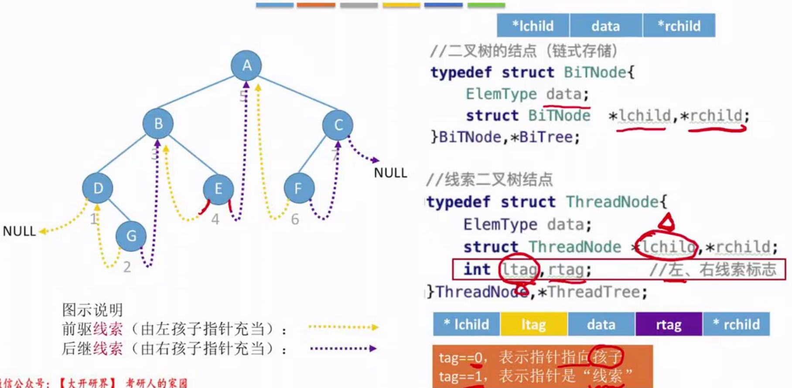


ltag rtag用来指示这个结点的左右指针是真的指向左右子树还是线索


#### 先序线索二叉树


#### 后序线索二叉树


#### 总结


### 5.4.7 二叉树的线索化

#### 中序线索化

找前驱结点的土方法

- 对二叉树进行中序遍历，中序遍历过程中有两个指针m1,m2，m1记录当前访问的结点，m2记录当前访问的结点的前驱结点

- m1总是比m2先行一步

- 如果当前m1访问的结点不是要找的结点，那么让m2指向和m1指向同一个结点

  如果当前m1访问的结点就是要找的结点，那么保存当前m2的结点，就能得到目标结点的前驱结点


二叉树中序线索化方法

- 对二叉树进行中序遍历，中序遍历过程中有两个指针m1,m2，m1记录当前访问的结点，m2记录当前访问的结点的前驱结点
- m1总是比m2先行一步
- 如果m1指向的结点左子树为空，那么建立前驱线索，由m1指向m2
- 如果m2不为空，且m2指向的结点右子树为空，那么建立后继线索，由m2指向m1
- m2 往后一步，m1往后一步，再次完成上述操作


中序线索化完整代码


#### 先序线索化


#### 后序线索化


#### 总结


### 5.4.8 线索二叉树找前驱后继


#### 中序线索二叉树


## 5.5 树的存储结构


### 双亲表示法(顺序结构)


- 新增结点的方法：在数组中添加这个元素，和该元素的双亲结点的索引，添加过程无需按照逻辑上的次序存储

  

  

- 删除叶子结点的方法

  1.把相应位置数组的数据域置空，双亲位置域置成-1，表示这里已经空了，然后把结点数-1(不要用)

  2.把数组尾部元素移上去，填充这个空了的地方

  如果要删除的不是叶子结点怎么办，那就是删除了以该结点为根的子树，就是要查询

  

  

  

  

- 查询(查找)结点

  已知一个结点要查询其双亲结点很简单，看双亲位置域即可。

  要查找孩子结点，必须对数组从头到尾进行遍历，判断当前访问的结点的双亲位置域是否指向本结点

  


### 孩子表示法(顺序+链式存储)


### 孩子兄弟表示法(纯链式存储)

树的结点有两个指针域，一个用来指向其第一个孩子，另一个指向其亲兄弟(注：不指向堂兄弟，必须是同一个父母)


### 森林和二叉树的转化

本质：孩子兄弟表示法存储森林


### 总结


## 5.6 树和森林的遍历

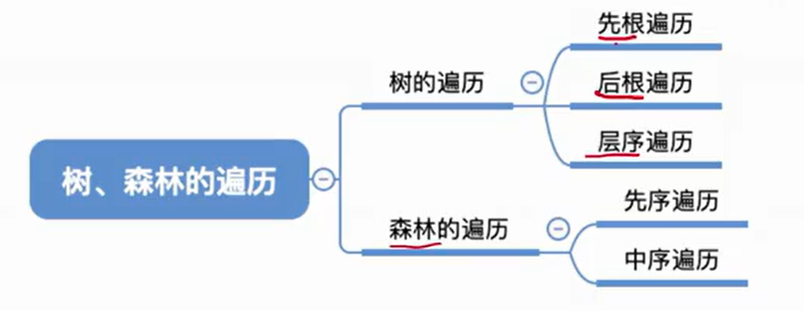

树是一种递归定义的数据结构


### 树的遍历

#### 先根遍历


#### 后根遍历


#### 层次遍历

树的广度优先遍历


### 森林的遍历

#### 森林先序遍历

森林的先序遍历就是对其内部的各个树的依次先序遍历


#### 森林中序遍历

森林中序遍历相当于 对森林中的**各个子树**执行后根遍历(后序遍历)


#### 总结


## 5.7 堆

### 堆的概念和存储表示


堆的定义


堆一定是**完全二叉树**，采用顺序存储结构


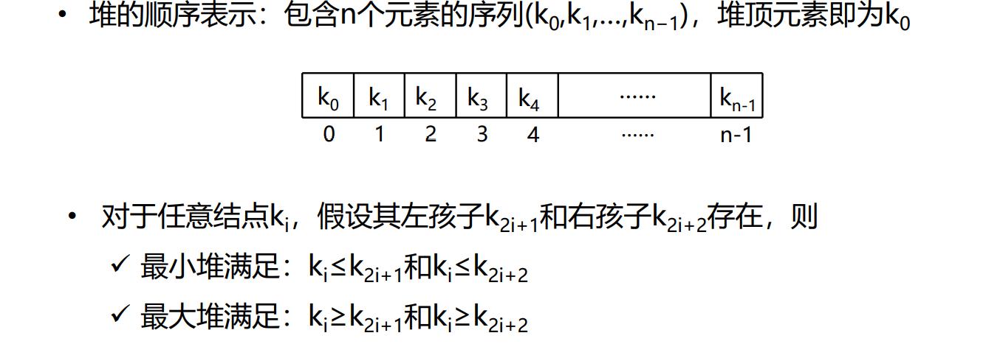


### 建堆运算


例子：

从 46 开始，因为 46 是


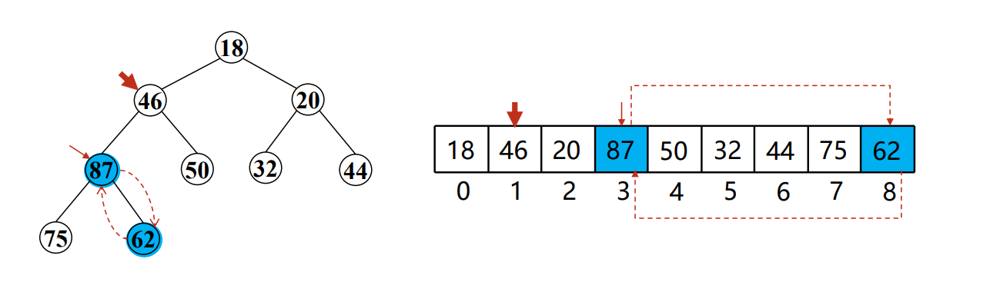


### 优先权队列


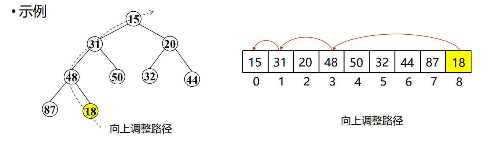


## 二叉排序树


对二叉排序树进行中序遍历，可以得到递增的有序序列

### 查找


循环的代码空间复杂度 是 O(1)

递归的代码空间复杂度是 O(n)

'

### 插入

每一次结点都是叶子结点


按照给定序列构造二叉排序树


序列内部元素相同，但是这些元素顺序不同，构造出来的二叉排序树可能是不同的。

### 删除

#### 删除叶子结点

叶子结点可以直接删除


#### 删除的结点只有左子树或者只有右子树

删除的结点的子树往上接


#### 删除的结点有左右子树

要删除的结点为z，那么就让z的直接前驱或者直接后继代替z的位置，然后从二叉排序树中删除这个直接前驱或直接后继

如果其直接前驱或直接后继也是有左右子树，那么递归，也是让直接前驱(后继)的前驱(后继)代替，并且删除


### 查找效率


如果一棵树高为h，那么找到最下层的结点需要对比h次(第几层就对比几次)

最好情况：n个结点的二叉树最小高度为 (log<sub>2</sub>n)向下取整 + 1   平均查找长度 = O(log<sub>2</sub>n) 

最坏情况：每个结点只有一个分支，树高h = 结点数n。平均查找长度 O(n)


### 总结


## 平衡二叉树


### 定义


### 插入后为了再次平衡的调整


不平衡的结点即，平衡因子不为+1 -1 0 的结点


只需要调整最小不平衡子树，其他的祖先结点也会恢复平衡


### 调整最小不平衡子树


平衡二叉树表示为下图，我们设置A为最小不平衡子树的根结点


只要A结点的右子树高度是 H，那么 B结点的左右子树高度一定也是 H，因为我们设置A为最小不平衡子树的根结点

调整目标

1. 恢复平衡

2. 保持二叉排序树特性

   


#### LL


解决方案


代码思路


#### RR


解决方案


代码思路


#### LR


c要旋转两次


#### RL


#### 总结


### 为什么只需要调整最小不平衡子树


### 练习

1


2


### 时间复杂度


### 总结


## 哈夫曼树(最优二叉树)

### 带权路径长度


### 哈夫曼树的定义


### 哈夫曼树的构造


哈夫曼树性质


哈夫曼树不唯一，但是只要是通过这种方法构造出来的哈夫曼树WPL必然相同

### 哈夫曼编码


固定长度编码：每个字符用相等长度的二进制位表示

如果要传递的字符只有 ABCD 那么可以用长度为2的二进制表示，用ascii码表示需要8位太麻烦了

可以把 ABCD作为4个结点构造成一颗树。左路径就是0，右路径就是1


可变长度编码：允许对不同的字符用不等长的二进制位表示

选c的题为80，我们希望用更少的字符表示


前缀编码：若没有一个编码是另一个编码的前缀，则称这样的编码为前缀编码


哈夫曼编码

- 字符集中的字符作为叶子结点
- 字符出现的频度(出现的多少)作为权值


英文字母频次：在社会广大文章中，统计出哪些英文字母用的最多


### 总结


## B树

### M叉搜索树

#### M叉搜索树递归定义

m叉搜索树的m表示的是一个结点最多可以有多少子树

m叉的m是取决于**整个树中子树最多的结点的子树的数量是多少**


空树是失败结点，失败结点不是叶子结点


#### M叉搜索树的作用(内搜索外搜索)


为什么内存不用二叉搜索树


举例

63个结点的二叉搜索树


这原本是一颗二叉树

我们用多叉树代替二叉树，在一个结点中存放多个元素而非一个元素

可将7个结点放在一起组成一个元素，就形成了一个页

变成一个高度为2的八叉树


#### M叉搜索树性质


先算出最多结点，再一个结点最多能放多少个元素*最多结点


### B树定义

#### B树的定义


m/2 这个符号表示向上取整

B树是一颗M叉搜索树，并且满足更特殊的性质


#### B树判定


例子


这是3阶B树也可能是4阶B树


#### B树性质


#### B树的搜索


#### B树中插入操作


在4阶B树中插入新元素59

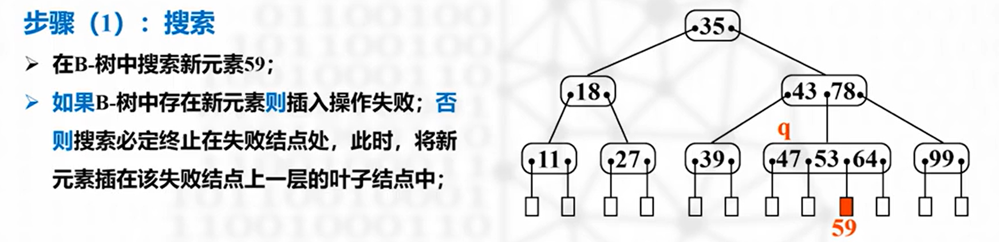


溢出：因为结点的子树个数大于了m叉树的m


插入运算结束


##### 插入操作总结


#### B树中删除操作


处理下溢出


又创造了其他下溢出


先并


再借


##### 删除操作总结


# 图

## 图的定义


注：

1. G：graph  图  V：Vertex  顶点  E：Edge 边
2. V一定不能为空，但是E，即边可以为空
3. 图中顶点的个数称为图的**阶**


### 图逻辑的应用


### 有向图和无向图


无向图： A到B 就是 B到A   有向图：B到A 不等于 A到B


### 简单图和多重图


数据结构**不讨论多重图**。


### 有向图无向图的度


### 顶点——顶点关系的描述


### 连通图和强连通图


连通图是针对 无向图 说的。

强连通图是针对 有向图 说的。


### 子图


子图：具有原图中的结点和原图中的边，并且还要能构成图

生成子图：具有原图中所有结点的子图


### 连通分量和强连通分量

连通分量：无向图中的极大连通子图称为连通分量。

连通分量一定是针对无向图而言的。


极大连通子图：子图必须**连通**，并且**包含尽可能多的顶点和边**


强连通分量：有向图中的极大强连通子图称为强连通分量。

强连通分量一定是针对有向图而言的


极大强连通子图：子图必须强连通，并且尽可能包含多的边


### 生成树

生成树是针对无向图的

极小连通子图：边尽可能小，但要保持连通。


### 生成森林


### 边的权、带权图、网


### 特殊形态的图

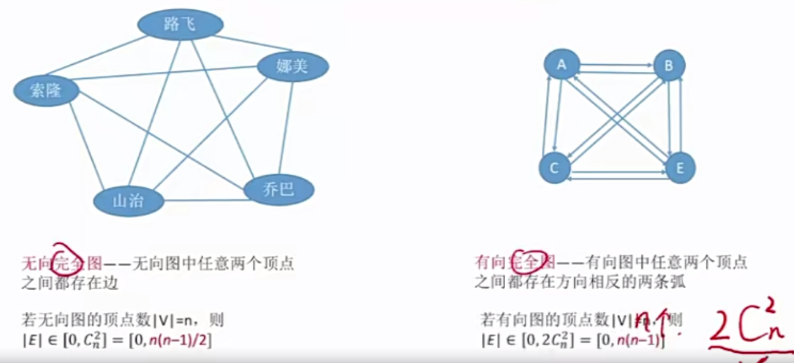


树是特殊形态的图


树是连通图，有向树不是连通图。


### 总结


## 图的存储—邻接矩阵表示法


无向图的邻接矩阵一定是关于主对角线对称的。无向图一条边对应一个1，有向图一条边对应两个1


一维数组用来存放结点。

二维数组用来表示两结点中一个边


邻接矩阵表示法如何求顶点的度，入度，出度

对于无向图


对于有向图


邻接矩阵表示法存储网

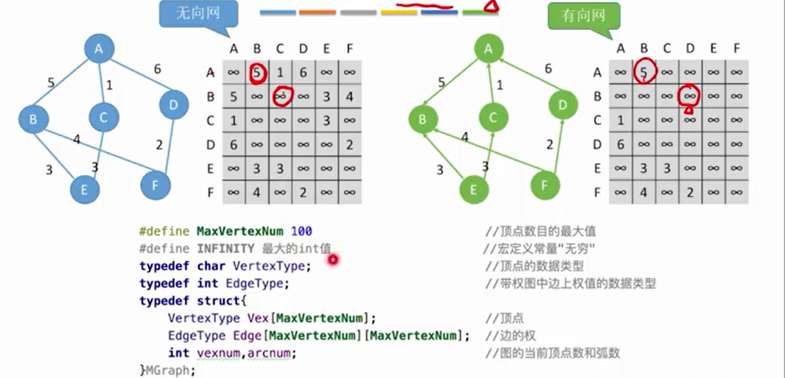

邻接矩阵中的值不再是 0 和 1 ，而是权重值，如果两个结点之间没有边，那么就存储无穷，权值无限大


有时候 自回路权重会表示成0


邻接矩阵法性能分析


邻接矩阵法的性质，离散数学


离散数学公式：


总结


## 图的存储—**邻接表法**

邻接表法：顺序表+链表，类似于拉链法


链表存储的边的起点都是**指向了该链表的数组元素存储的顶点**，终点不一定


顶点使用数组来存储，边(连接顶点和顶点的)，使用链表存储


ArcNode * first 指针用来指向链表的首结点


adjvex 数据存储的是这个边的另一个顶点在数组中的索引


vexnum是顶点的数量，arcnum边的数量。

AdjList vertices 是用来存储顶点的一维数组


存储有向图

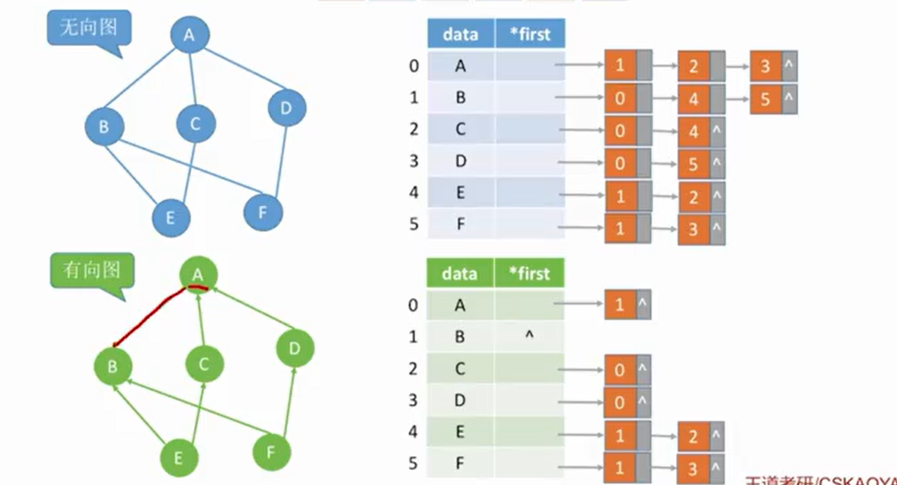


图邻接表表示方法不唯一，链表前后顺序可以不同


求顶点入度，出度

无向图根据邻接表找度很方便，

有向图根据邻接表找出度很方便，找入度不方便，需要遍历整个邻接表


总结


## 图的存储—**十字链表、邻接多重表**

十字链表存储有向图

临界多重表存储无向图


十字链表存储有向图解决邻接表存储有向图求顶点入度不方便的问题


十字链表性能分析


**邻接多重表**


## 图的基本操作和邻接矩阵、邻接表怎么实现


### 判断图中是否存在某条边

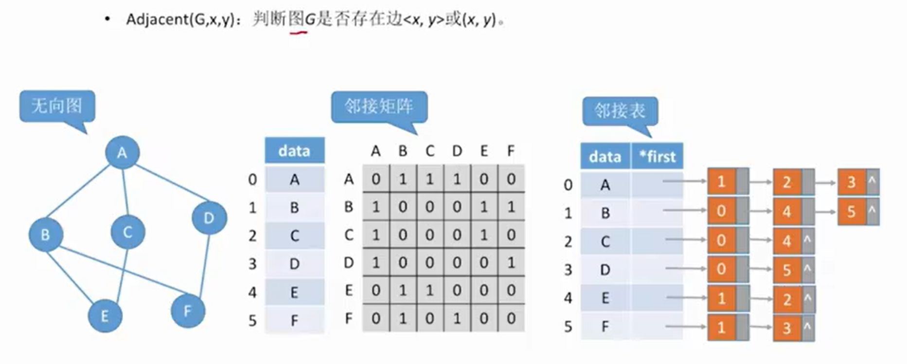

邻接矩阵，找到 x，y 位置处那个值是否为1   时间复杂度 O(1)

邻接表，检查边的起始顶点的链表(遍历链表)有没有另一个顶点  时间复杂度 O(1)~O(n)


### 列出图G中的与结点x邻接的边


邻接矩阵，只需要进行遍历顶点所在的那一行， 时间复杂度 O(n)

邻接表，遍历顶点x所指向的链表，用时多少取决于链表长度 ，时间复杂度 O(1) ~O(n)


### 插入新顶点


### 删除顶点


邻接矩阵，把那一行那一列的元素全部都变成，可以再在顶点数据类型加上bool型来判断是不是空结点

邻接表，删除数组的那个对应的顶点元素，并且删除该链表


### 添加边


邻接矩阵对应位置 0 变成 1

邻接表使用头插法添加元素，

两个方法时间复杂度都是O(1)

### 删除边


### 找到顶点x第一个邻接点

FirstNeighbor

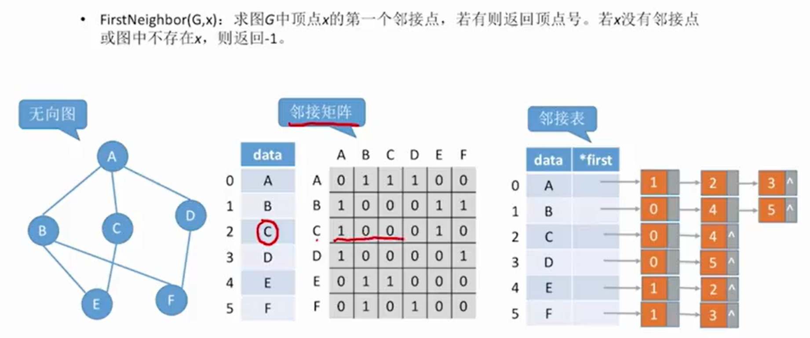

邻接矩阵，找到矩阵相应那一行，从左往右找第一个1


邻接矩阵，出边找行，入边找列

邻接表，找入边很难，找出边就是遍历链表

### 找第一个临界点之后的临界点

NextNeighbor


### 获取权值设置权值


## **图的广度优先遍历**

### 树和图遍历对比


广度优先遍历是先获取一个结点后，再遍历其邻接的结点

### 图的广度优先遍历代码实现


**访问标记数组**标记某个顶点有没有被访问过


数组遍历初始位置从1开始


先访问元素2，2入队列，然后让与其邻接的顶点入队


2号出队，让与1号结点和5号结点相邻的并且没有被访问过的入队


1 号 和 6号 出队。

访问5号结点的时候，会把和5号结点邻接(但是没有访问过)的结点加入到队列中，但是没有，然后5号出队

访问3号结点的时候，会把和5号结点邻接(但是没有访问过)的结点加入到队列中，即4号结点，然后3号出队

访问7号结点的时候，会把和5号结点邻接(但是没有访问过)的结点加入到队列中，即8号结点，然后7号出队


4 和 8 的与其邻接的都是被访问过的，所以不会再操作了


一个结点与多个结点邻接，那么下一层遍历的顺序是**按照从小到大的顺序进行遍历**


但是如果邻接表存储结构不一样，从一个点出发，找到别的顶点的顺序可能不同(链表元素的位置不同)。

但是邻接矩阵存储遍历肯定是每一次从小到大排列


对于无向图，调用BFS函数的次数=连通分量数目


性能分析


### 广度优先生成树

广度优先生成树根据遍历的顺序得来的


广度优先生成树顺序不唯一

### 广度优先生成森林


### 有向图BFS


### 总结


##  **图的深度优先遍历**

类似于树的先根遍历


### 图的深度优先遍历代码实现


先访问 2号结点


5号执行完没了，以及最深了，那么触底反弹，到1号结点，1号结点周围也都被访问过，也执行完了，那么回到执行2号结点

接着执行2号结点的 for 循环


访问6号结点


再往深处，3号结点


再往深处，4号结点


再往深处，7号，7号完了8号


8号执行完了周围都没有没被访问的了，同样对于  7 号 4号 3号 6号 2号周围也都没有没被访问的了


考虑非连通图，完整代码


算法性能分析


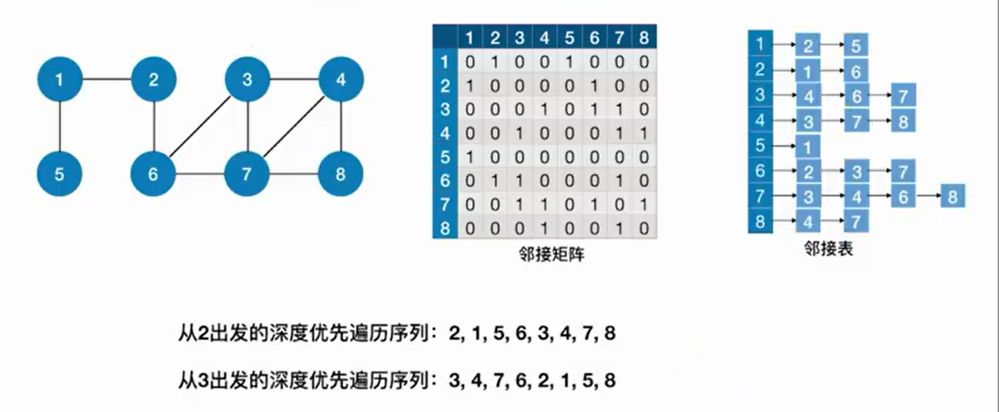


### 深度优先生成树


### 深度优先生成树


### 图的遍历与图的连通性


### 总结


## 拓扑排序

### aov网、拓扑排序、拓扑序列


拓扑序列不唯一

### 给定 aov网如何拓扑排序


可以用堆栈或者队列保存新产生的入度为0的顶点

举例


得到拓扑序列


### 实现拓扑排序算法的程序


算法具体实现


计算各顶点入度


## 关键路径

### AOE网

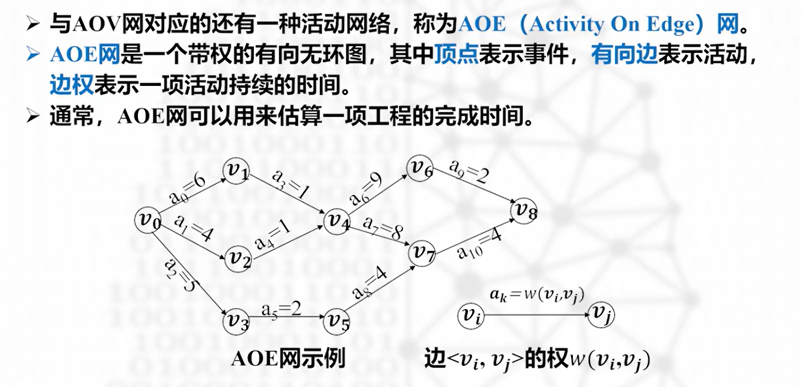


### 关键路径，关键活动


AOE网上各个活动是可以并行的。

### 事件相关的两个基本概念


### 活动相关的两个基本概念


### 关键路径的求解过程


每个事件(结点)的最早发生时间是，从源点(入度为0的点)，到该事件(结点)的各路径中，所用最长的时间(权重最大的那种走法)。


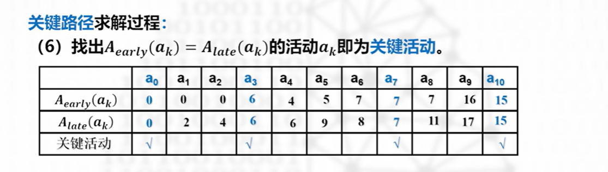

### 关键路径算法的实现


## 最小代价生成树

### 概念


最小代价生成树：带权的连通图，寻找一棵生成树(极小连通子图)，使得各条边上的权值之和最小


G4代价是该图所有生成树中最小的


### 普里姆算法


’

案例


无向图，T的入边指的是**一个顶点属于T，另一个顶点不属于T的边。**(不能两个顶点都属于和两个顶点都不属于)

- 初始状态仅包含0，T的入边有 1-0 2-0 3-0 其中 2-0权重最小

  

  将边 2-0 和 不属于 T的顶点 顶点2 加入

   T现在有 两个顶点 顶点 0 和 2

-  T现在有 两个 顶点 0 和 2    T的入边有 1-0  3-0 1-2 4-2 3-2 5-2   其中 5-2 权值最小

  

  边 和 顶点 5 加入

  T 现在有 三个顶点 顶点 0 2 5

- T 现在有 三个顶点 顶点 0 2 5 T的入边有  0-3 2-3 5-3 0-1 2-1 2-4 5-4 其中 5-3 权值最小

  

  边和另一头顶点 3加入

  T现在有 四个顶点 顶点 0  2  3  5

- T现在有 四个顶点 顶点 0  2  3  5   T的入边有 1-0 1-2 4-2 4-5    1-2 权值最小

  

  边和另一头结点 1 加入

  T现在有 五个顶点，顶点 0 1 2 3 5

- T现在有 五个顶点，顶点 0 1 2 3 5   T的 入边有 4-1 4-2 4-5   4-1权值最小

  

  顶点全部包含，结束


#### 存储结构


#### 过程分析


以上表中第二列作为讲解，

- 因为 生成树中距离顶点1最近的结点是生成树中的顶点0，因此 nearest[1] = 0
- 因为 生成树中距离顶点1最近的结点(即顶点0)和顶点1的边的权是2，所以 lowcost[1] = 2

​                                 

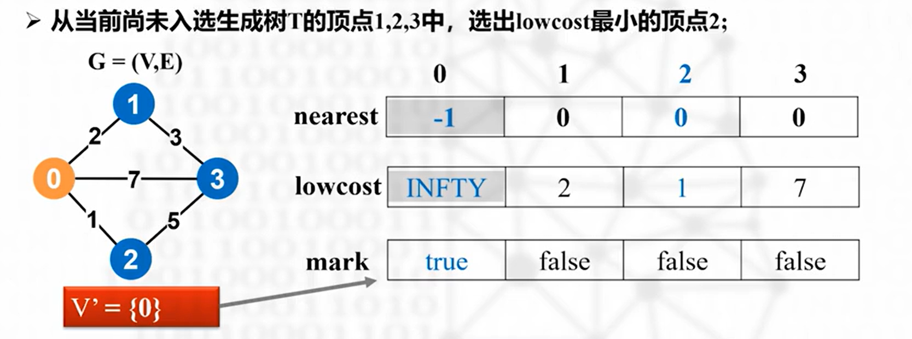


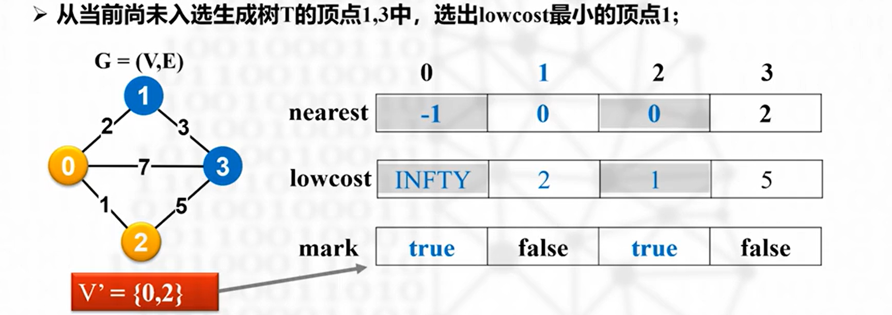


‘

#### 核心步骤


#### 程序实现


### 克鲁斯卡尔算法


- 把 G中 0-2 删除，加入 T ，未形成回路

  

- 把 G 中 3-5删除，加入 T，未形成回路

  

- 把 G 中 1-4删除，加入 T，未形成回路

  

- 把 G中 2-5删除，加入 T ，未形成回路

  

- 

  不能 0-3   会形成回路，选择 1-2

  

  结束(已经有 n-1 条边)


#### 存储结构


#### 核心步骤


#### 程序实现


## 单源最短路径


单源最短路径问的是什么问题


### 迪杰斯特拉算法


1. 每次在加入新结点到S中的时候都需要检查是否从 v0 开始(并且只允许通过 S集合 中的顶点),是否有到达其他结点更短的路径。
2. 每一轮检查完后都标注出到S集合以外的各个结点的路径长度(已经在S集合以内的就固定了，不会再改变了)。
3. 再从v0到各个结点的路径长度中选择最短的路径的另一头的终点顶点加入到 S集合中
4. 重复以上步骤


#### 存储结构


#### 算法实际举例

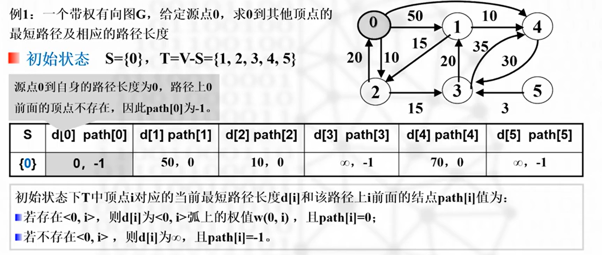


#### 程序实现


