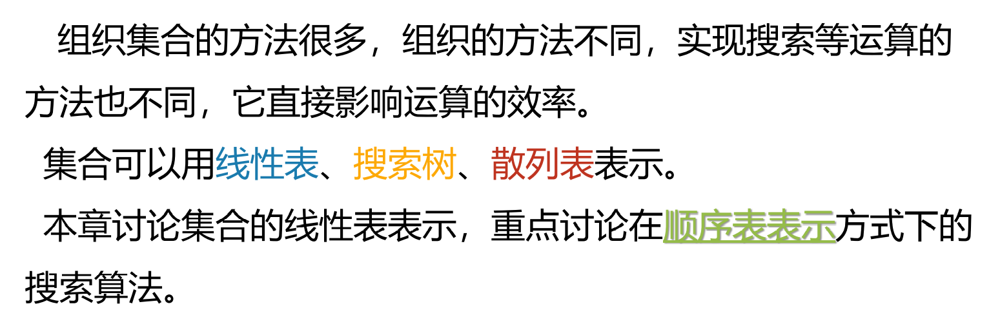
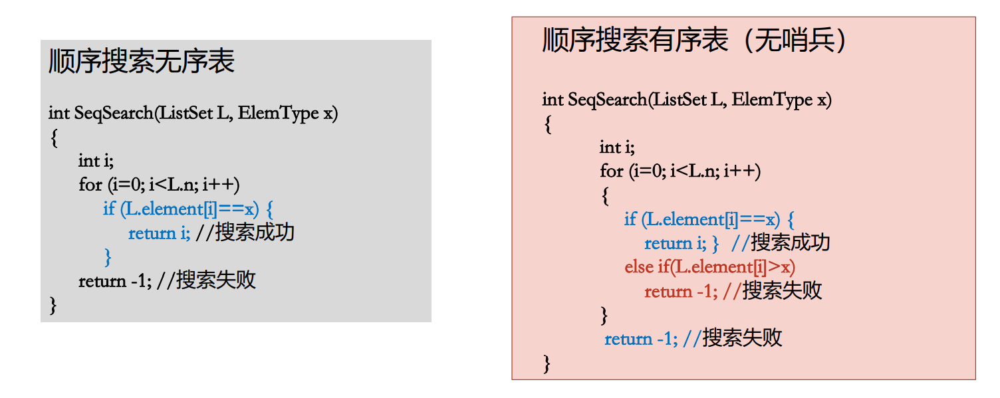
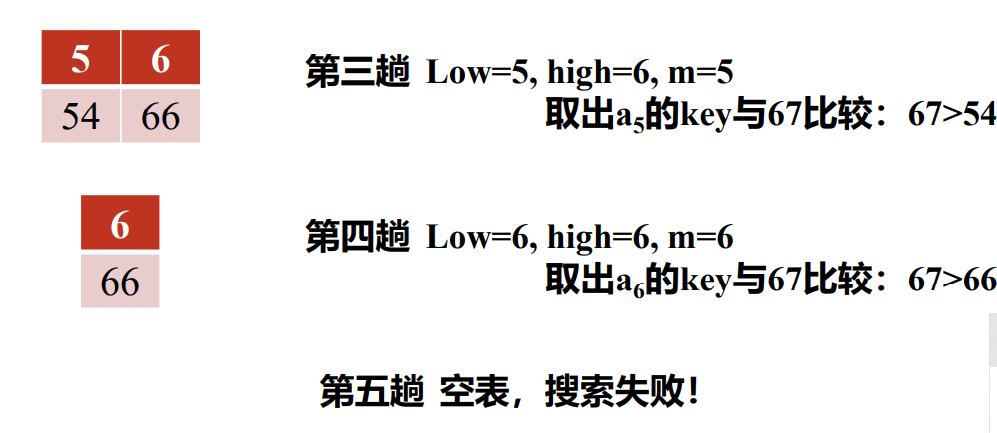
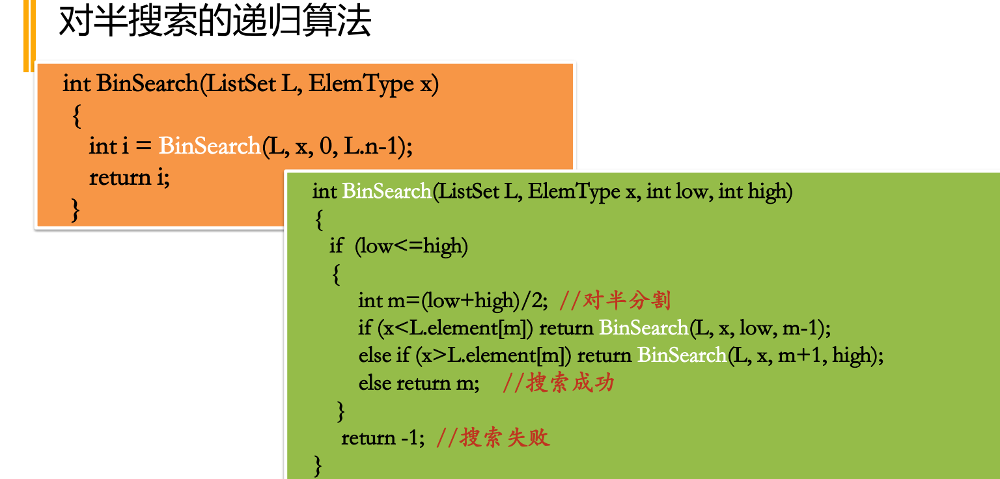

# 第七章 集合和搜索

## 7.1 集合的抽象数据类型





```
typedef struct
{
int n; 
int maxLength; 
ElemType *element;
} ListSet;
```


## 7.2 顺序搜索

### 无序表的顺序搜索


```
int SeqSearch(ListSet L, ElemType x)
{ 
	int i;
	for (i=0; i<L.n; i++)
		if (L.element[i]==x) {
			return i; //搜索成功
		}
	return -1; //搜索失败
}
```

### 有序表顺序搜索


搜索无序表表时，先是顺序进行，如果先前没有找到，一旦遇到一个比自己想要搜索的值更大的值，就说明肯定没有




## 7.3 二分搜索


例子







## 平均搜索长度分析


### 无序表的顺序搜索


### 有序表顺序搜索


### 对半搜索的平均搜索长度分析


# 第八章 散列表


## 散列的基本概念 散列函数


、

冲突不允许发生


散列函数无法避免冲突


将大范围的关键字投射到小范围的关键字，本质上是**压缩映像**


## 好的散列函数(常见散列余数)


### 除留余数法


### MAD


### 平方取中法


### 折叠法


### 数字分析法


# 冲突处理技术

## 拉链法


