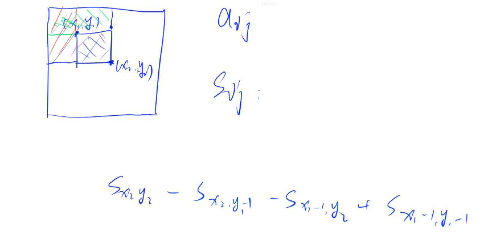

## 快速排序


快速排序使用分治法（Divide and conquer）策略来把一个序列（list）分为较小和较大的2个子序列，然后递归地排序两个子序列


在计算机科学中，分治法（英语：Divide and conquer）是建基于多项分支递归的一种很重要的算法范型。字面上的解释是“分而治之”，就是把**一个复杂的问题分成两个或更多的相同或相似的子问题，直到最后子问题可以简单的直接求解，<u>原问题的解即子问题的解的合并</u>**。


快速排序步骤为：

1. 挑选基准值：从数列中挑出一个元素，称为“基准”（pivot)。基准值即分界点

   分界点可以是当前序列 最左边的值，最右边的值，序列中间的值，也可以是随机值。

   选取基准值有数种具体方法，此选取方法对排序的时间性能有决定性影响。

2. 分割：重新排序数列，所有比基准值小的元素摆放在基准前面，所有比基准值大的元素摆在基准后面（与基准值相等的数可以到任何一边）。在这个分割结束之后，对基准值的排序就已经完成，

   

   已知基准值x，要保证所有<x的值在x左半边，所有>x的值在x右半边，=x的值在哪边都可以。注意：分割出的两个子序列长度可以不相等

3. 递归排序子序列：递归地将小于基准值元素的子序列和大于基准值元素的子序列排序。


递归到最底部的判断条件是数列的**大小是0或1**，此时该数列显然已经有序。


其伪代码，算法表示为

```
function quicksort(q)
 {
     var list less, pivotList, greater
     if length(q) ≤ 1 
         return q
     else 
     {
         select a pivot value pivot from q  // pivot 基准值
         for each x in q except the pivot element
         {
             if x < pivot then add x to less
             if x ≥ pivot then add x to greater
         }
         add pivot to pivotList
         return concatenate(quicksort(less), pivotList, quicksort(greater))
     }
 }
```

第一种方法：

1. 生成两个额外的数组 a[],b[]
2. 扫描原数组的每个数，选取一个基准值x
3. 如果当前数小于等于x，就插入a，如果当前数大于等于x，就插入b
4. 再把 a 和 b 放入 原数组


时间复杂度 O(n) ，需要额外空间


优美的做法:

对数组的快速排序

```
void quick_sort(int q[], int l, int r)
{
    if (l >= r) return; // 如果当前数组长度为1或者0

    int i = l - 1, j = r + 1, x = q[l + r >> 1];
    while (i < j)
    {
        do i ++ ; while (q[i] < x);
        do j -- ; while (q[j] > x);
        if (i < j) //swap(q[i], q[j]);
        {
        	int t = q[i];
        	q[i] = q[j];
        	q[j] = t;
		}
    }
    quick_sort(q, l, j), quick_sort(q, j + 1, r);
}
int main(){
	quick_sort(要排列的数组,0,数组长度-1(即右边界));
}

```


## 归并排序

归并排序（英语：Merge sort，或mergesort），是创建在归并操作上的一种有效的排序算法，效率为O(nlog n)（大O符号）。1945年由约翰·冯·诺伊曼首次提出。该算法是采用分治法（Divide and Conquer）的一个非常典型的应用，且各层分治递归可以同时进行。


为什么归并排序时间复杂度是nlog(n)


递归法

1. 申请空间，使其大小为两个已经排序序列之和，该空间用来存放合并后的序列
2. 设定两个指针，最初位置分别为两个已经排序序列的起始位置
3. 比较两个指针所指向的元素，选择相对小的元素放入到合并空间，并移动指针到下一位置
4. 重复步骤3直到某一指针到达序列尾
5. 将另一序列剩下的所有元素直接复制到合并序列尾

```
const int N = 1000010
int q[N];
int tmp[N];


void merge_sort(int q[], int l, int r)
{
    if (l >= r) return;//当前区间只有一个数或者没有数

    int mid = l + r >> 1;
    merge_sort(q, l, mid);
    merge_sort(q, mid + 1, r);
		// k用于表示指向 tmp 数组的指针  i 用于表示指向边界左侧数组的指针，j 用于表示指向边界右侧数组的指针							
    int k = 0, i = l, j = mid + 1;
    while (i <= mid && j <= r)
        if (q[i] <= q[j]) tmp[k ++ ] = q[i ++ ];
        else tmp[k ++ ] = q[j ++ ];
		//把另一边剩下的部分全部加到后面
    while (i <= mid) tmp[k ++ ] = q[i ++ ];
    while (j <= r) tmp[k ++ ] = q[j ++ ];

    for (i = l, j = 0; i <= r; i ++, j ++ ) q[i] = tmp[j];
}


```


## 整数二分查找

在计算机科学中，二分查找算法（英语：binary search algorithm），也称**折半搜索算法**（英语：half-interval search algorithm）[1]、对数搜索算法（英语：logarithmic search algorithm）[2]，是一种在**有序数组中查找某一特定元素的搜索算法**。

1. 搜索过程从数组的中间元素开始,如果中间元素正好是要查找的元素，则搜索过程结束；
2. 如果某一特定元素大于或者小于中间元素，则在数组大于或小于中间元素的那一半中查找，而且跟开始一样从中间元素开始比较。
3. 如果在某一步骤数组为空，则代表找不到。

这种搜索算法每一次比较都使搜索范围缩小一半。


数组具有单调性一定可以二分，但是即使没有单调性也有可能二分

二分就是时刻保证我们要找的答案在区间内部

```
bool check(int x) {/* ... */} // 检查x是否满足某种性质

// 区间[l, r]被划分成[l, mid]和[mid + 1, r]时使用：
int bsearch_1(int l, int r)
{
    while (l < r)
    {
        int mid = l + r >> 1;
        if (check(mid)) r = mid;    // 如果满足性质，因为mid 也满足，因此要把 mid 也加入接下来的范围

        else l = mid + 1;
        // check(mid) 条件不满足
    }
    return l;
}
// 区间[l, r]被划分成[l, mid - 1]和[mid, r]时使用：
int bsearch_2(int l, int r)
{
    while (l < r)
    {
        int mid = l + r + 1 >> 1;   // 这里 不补+1会发生死循环
        if (check(mid)) l = mid; // 如果满足性质
        else r = mid - 1;
    }
    return l;
}


```


如果更新方式是 ： l = mid  r = mid -1      mid 的 取值方式就是 (l+r+1)/2  

如果更新方式是 ： r = mid l  =  mid +1    mid 的取值方式就是  (l+r)/2


## 浮点数二分

```
bool check(double x) {/* ... */} // 检查x是否满足某种性质

double bsearch_3(double l, double r)
{
    const double eps = 1e-6;   // eps 表示精度，取决于题目对精度的要求
    while (r - l > eps) // 当这个区间长度足够小的时候，循环终止，就找到这个值了
    {
        double mid = (l + r) / 2;
        if (check(mid)) r = mid;
        else l = mid;
    }
    return l;
}
```


## 高精度

### <font color=red size=5>高精度加法</font>

列竖式计算


```
// C = A + B, A >= 0, B >= 0
vector<int> add(vector<int> &A, vector<int> &B)
{
    if (A.size() < B.size()) return add(B, A); 保证 A的位数比B的位数大

    vector<int> C;
    int t = 0;
    for (int i = 0; i < A.size(); i ++ )
    {
        t += A[i];
        if (i < B.size()) t += B[i];
        C.push_back(t % 10); //取余数
        t /= 10; // t>10 t=/=10   t<10  t=0
        
    }
	// 循环最后结束时，还会对 t 进行一次 t/=10 如果 得到的t>0，说明有位溢出，如果=0，说明没有位溢出 
    if (t) C.push_back(t); //如果溢出，把溢出的位压入
    return C;
}
int main()
{
	string a,b;
	vector<int>A,B;
	cin>>a>>b;           // 加入a是 123456   那么 A数组的存储方式就是(低索引到高索引) 6 5 4 3 2 1
	for(int i = a.size() - 1;i>=0;i--) A.push_back(a[i]-'0');// -'0' 是为了把字符类型的数字转化成真正的数字
	for(int i = b.size() - 1;i>=0;i--) B.push_back(b[i]-'0');
			// 这里是倒着传入	
				
				
	auto C = add(A,B);
	for(int i = C.size()-1;i>=0;i--) printf("%d",C[i]);
}

```


Vector 是数组数据结构

push_back 方法 ：把数组头当作栈底，把指定元素压栈

size 方法，返回当前数组元素的个数

auto 是一种数据类型，编译器会自己推断这是什么数据类型


### <font color=red size=5>高精度减法</font>


不够减就向高位借一位。t 标志着当前位是否被之前的一位借过，t=1 表示被借了，t=0表示没有被借


高精度减法分两种情况

1.  A>B 直接算
2. A<B 算 B-A，再加上负号


这里的减法只考虑两个正数做减法

```
// C = A - B, 满足A >= B, A >= 0, B >= 0
vector<int> sub(vector<int> &A, vector<int> &B)
{
    vector<int> C;
    for (int i = 0, t = 0; i < A.size(); i ++ )
    {
        t = A[i] - t;
        if (i < B.size()) t -= B[i];
        C.push_back((t + 10) % 10);
        if (t < 0) t = 1;
        else t = 0;
    }

    while (C.size() > 1 && C.back() == 0) C.pop_back();
    return C;
}


```


```
using namespace std;

// 我们希望能出现 A>=B,这个方法用于判断是否能出现 A>=B
bool cmp(vector<int> &A,vector<int> &B){
	if(A,size()!=B.size()) return A.size()>B.size();
	for(int i = A.size()-1;i>=0;i--){
		if(A[i] != B[i])
			return A[i] > B[i];
	}
	return true
}

// C = A-B
vector<int> sub(vector<int>&A,vector<int>&B){
	vector<int> C;
	for(int i = 0,t=0;i<A.size();i++){
		
		t = A[i] - t; //先考虑有没有被借位
		if(i<B.size())// 如果 B还有长度
			t -=B[i];// A的位减去B的位 如果 t<0 不够减，就需要借位了
		C.push_back((t+10)%10); 如果 t>0  (t+10)%10 = t   如果 t<0，就需要借位  (t+10)%10 = t					// 这里压入的值是该位减出来的结果
		
        // t又作为标志位表示该位的更高一位有没有被借，如果有被借那么t = 1 ，高位将减去1，t = 0 ，高位没有被借
        if(t<0) t=1;
        else t=0;        
	}
    
 	//这段是为了防止前导0的出现，避免出现000100这种数
    //back 方法获取数组最后一位
	while(C.size()>1&&C.back()==0){
		C.pop_back(); // 把最后一位弹出
	}
	return C;
}
int main()
{
	string a,b;
	vector<int> A,B;
	cin>>a>>b;
	for(int i = a.size();i>=0;i--) A.push_back(a[i]-'0');
	for(int i = b.size();i>=0;i--) B.push_back(a[i]-'0');
	
	if(cmp(A,B)){//如果符合 A>=B
		auto C = sub(A,B);
		for(int i=C.size()-1;i>=0;i--) printf("%d",C[i]);
	} else{
		auto C = sub(B-A);
		printf("-");
		for(int i=C.size()-1;i>=0;i--) printf("%d",C[i]);
	}
}
```


### <font color=red size=5>高精度乘法</font>

高精度正数 * 低精度整数


把其中那个 位数低的数当成一个整体

```
// C = A * b, A >= 0, b >= 0
vector<int> mul(vector<int> &A, int b)
{
    vector<int> C;

    int t = 0;
    for (int i = 0; i < A.size() || t; i ++ )
    {
        if (i < A.size()) t += A[i] * b;
        C.push_back(t % 10);
        t /= 10;
    }

    while (C.size() > 1 && C.back() == 0) C.pop_back(); //去除 高位为0的情况避免出现 0001000这种数字

    return C;
}


```


```
vector<int> mul(vector<int> &A,int b){
	vector<int> C;
	int t = 0;
	for(int i = 0;i<A.size()||t;i++)
	{
		if(i<A.size()) t +=A[i]*b;
		C.push_back(t%10);
		t/=10;
	}
	return c;
}

int main()
{
	string a;
	int b;
	cin>>a>>b;
	vector<int> A;
	for(int i  = a.size()-1;i>=0;i--)  A.push_back(a[i]-'0');
	auto c = mul(A,b);
	for(int i = C.size()-1;i>=0;i--) printf("%d",c[i]);
}
```


### <font color=red size=5>高精度除法</font>

```
// A / b = C ... r, A >= 0, b > 0
vector<int> div(vector<int> &A, int b, int &r)
{
    vector<int> C;
    r = 0;
    //从高位开始
    for (int i = A.size() - 1; i >= 0; i -- )
    {
        r = r * 10 + A[i];
        C.push_back(r / b);
        r %= b;
    }
    reverse(C.begin(), C.end());//进行逆置
    while (C.size() > 1 && C.back() == 0) C.pop_back();//去除前导0
    return C;
}


```

c++ stl 中 begin() 和 end()方法

容器.begin();返回指向容器 最开始位置数据的指针

容器.end(); 返回指向容器 最后一个数据单元+1的指针

reverse(a,b) 把容器按照起始索引终止索引进行逆置


```
vector<int> div(vector<int> &A, int b, int &r)
{
    vector<int> C;
    r = 0;
    //从高位开始
    for (int i = A.size() - 1; i >= 0; i -- )
    {
        r = r * 10 + A[i];
        C.push_back(r / b);
        r %= b;
    }
    reverse(C.begin(), C.end());//进行逆置
    while (C.size() > 1 && C.back() == 0) C.pop_back();//去除前导0
    
    return C;
}

int main()
{
	string a;
	int b ;
	cin>>a>>b;
	vector<int> A;
	for(int i = a.size()-1;i>=0;i--) A.push_back(a[i]-'0');	
	int r;
	auto C = div(A,b,r);	
	for(int i = C.size()-1;i>=0;i--) printf("%d",C[i]);
	cout<<endl<<r<<endl;
	return 0;	
}
```


## 数组区间和(前缀和)

### 一维前缀和


已知 一个数组 a<sub>1</sub> 到 a<sub>n</sub>

前缀和  S<sub>i</sub> = a<sub>1</sub>+a<sub>2</sub>+a<sub>3</sub>+.......+a<sub>i</sub>  S<sub>1</sub> = 0

1. 如何求 S<sub>i</sub>
2. 作用 快速求出数组 a<sub>1</sub> 到 a<sub>n</sub> 中 [l,r] 区间的元素的和 = S<sub>r</sub> - S<sub>l-1</sub>  时间复杂度是 O(1),如果老方法遍历时间复杂度 O(n) = n


S1 = 0是为了处理求区间 [0,r] 的形式

公式
$$
S[i] = a[1] + a[2] + ... a[i]   
$$

$$
 a[l] + ... + a[r] = S[r] - S[l - 1]
$$


### 二维前缀和

求一块矩阵某区域的和




公式
$$
S[i, j] = 第i行j列格子左上部分所有元素的和
以(x1, y1)为左上角，(x2, y2)为右下角的子矩阵的和为：
S[x2, y2] - S[x1 - 1, y2] - S[x2, y1 - 1] + S[x1 - 1, y1 - 1]
$$


## 拆分(前缀和的逆运算)

### 一维拆分


数组 a<sub>1</sub> 到 a<sub>n</sub>  已知，需要求一个 数组 b，使 b是a的前缀和数组

此操作的应用

1. 让 数组 a<sub>1</sub> 到 a<sub>n</sub>  中 [l,r] 的数都加上 常数c，不需要遍历，只需要在 数组b中改动(让 b<sub>r</sub>+c,让 b<sub>r</sub>-c)

   

   时间复杂度由O(1)变成O(n)

   如果需要得到改动后的a数组，只要扫描前缀和数组即可


公式
$$
给区间[l, r]中的每个数加上c：B[l] += c, B[r + 1] -= c
$$


### 二维拆分


构造二维数组b，b的前缀和是a


公式
$$
给以(x1, y1)为左上角，(x2, y2)为右下角的子矩阵中的所有元素加上c：
S[x1, y1] += c, S[x2 + 1, y1] -= c, S[x1, y2 + 1] -= c, S[x2 + 1, y2 + 1] += c
$$


## 双指针算法

第一种双指针算法，两个指针分别指向两个序列，比如归并排序


第二种双指针算法，两个指针指向同一个序列，比如快排，两个指针维护同一块区间


双指针算法常用模板


### 例题

<font color=red size=5>写出句子中的单词</font>

输入一个字符串，把其中每一个单词输出出来，单词之间用空格隔开

最简单的一维数组

```
#include<iostream>
using namespace std;
int main()
{
	char str[1000];
	gets(str);
	int n = strlen(str);
	for(int i = 0;i<n;i++){
		int j = i;//每次都指向单词开头位置
		while(j<n&&str[j]!=' ') j++;
		
        for(int k = i;k<j;k++) cout<<str[k];
        cout<<endl;
        
        i=j;
        
	}
}
```


<font color=red size=5>最长不连续重复子序列</font>

给定一个长度为 nn 的整数序列，请找出最长的不包含重复的数的连续区间，输出它的长度。

输入格式

第一行包含整数 n。

第二行包含 n 个整数，表示整数序列。

输出格式

共一行，包含一个整数，表示最长的不包含重复的数的连续区间的长度。

数据范围

1≤n≤1051≤n≤105

输入样例：

```
5
1 2 2 3 5
```

输出样例：

```
3
```


```
思路：
i在前面跑(快指针)，j满足某个特定的条件后，就需要往后移动(慢指针)
```


